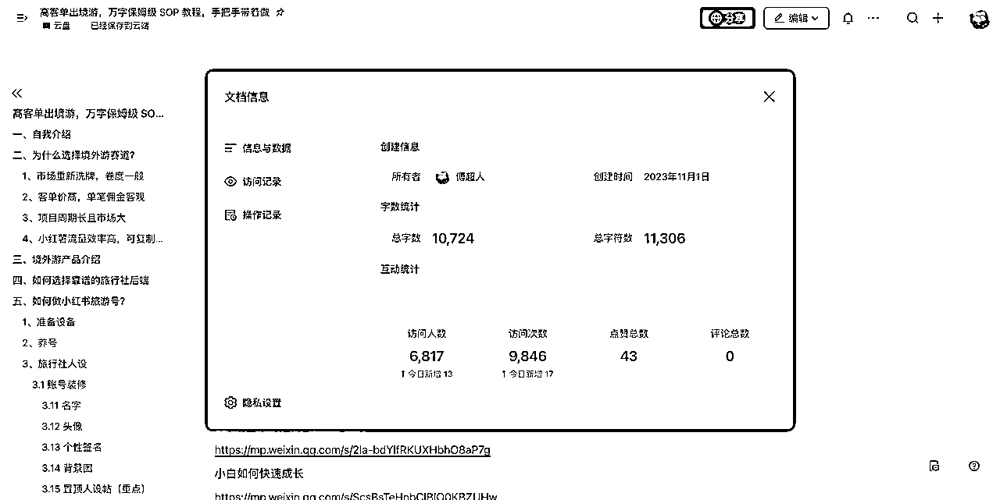
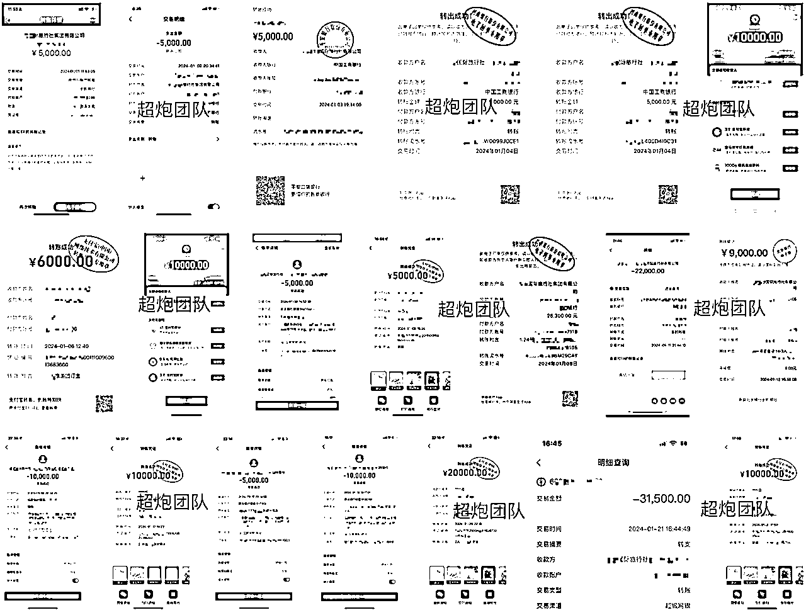
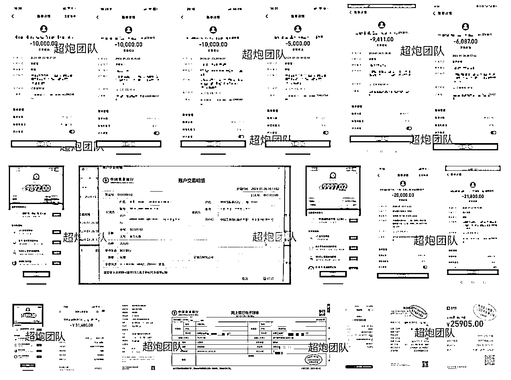
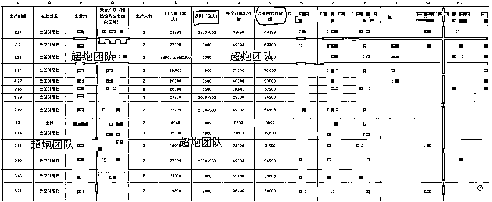
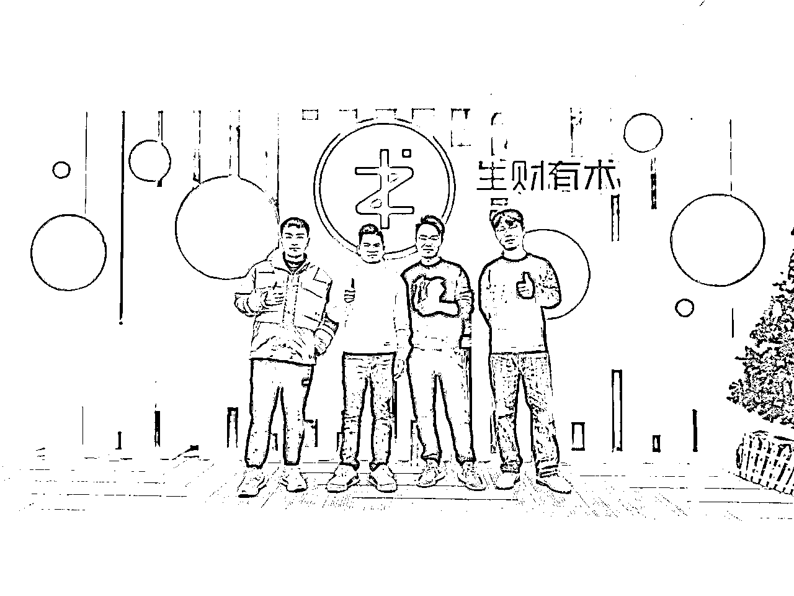
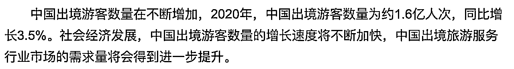
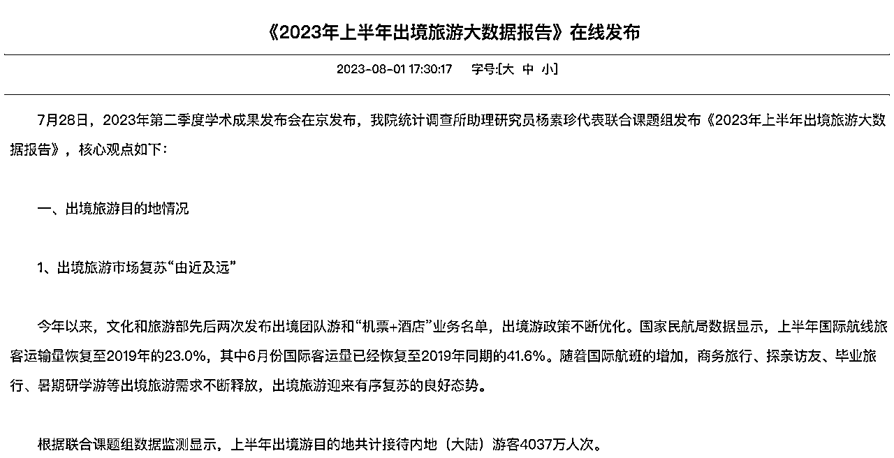
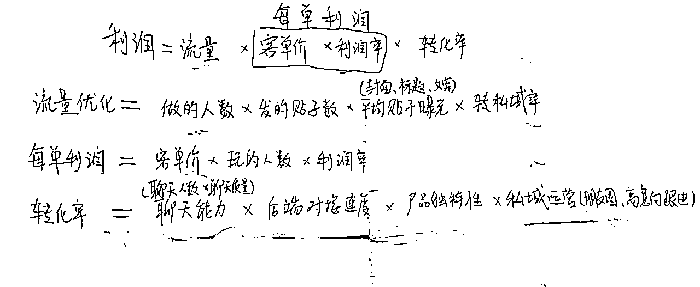
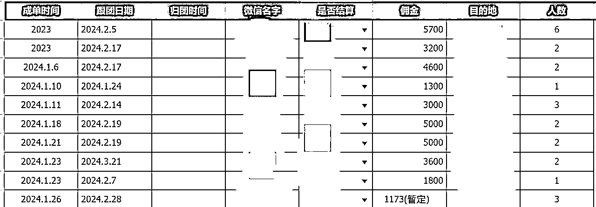
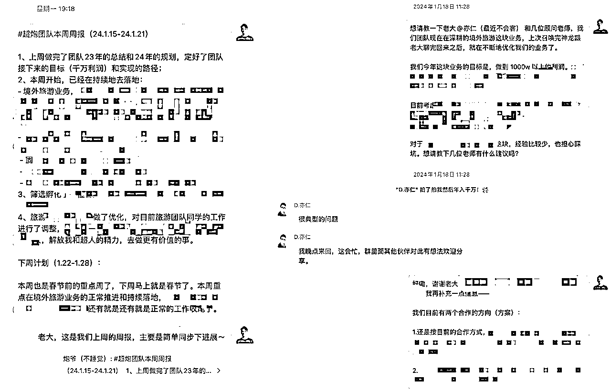

# 小红书高客单境外游，今年目标利润1000W，我们是如何规划整个打法的？

> 来源：[https://xsej9se9cv.feishu.cn/docx/H2SVdXuYfoSzunxGKaBcubBPnse](https://xsej9se9cv.feishu.cn/docx/H2SVdXuYfoSzunxGKaBcubBPnse)

## 自我介绍

哈喽，大家好，我是傅超人，我们团队今年2024年的目标是深耕境外游这个赛道，把利润做到1000W，今天给大家分享一下我们的规划。

三个月前，十一月初的时候在生财发了篇精华贴：

目前这篇文章大概有 6000 多人看过，平均看了接近 2 次，说明这篇公开的文章确实挺干货的，很多人也通过我这篇文章拿到了成绩。

口说无凭，不扯虚的，先放点一月份的部分数据吧。

（基本都是定金截图，正常境外游都是1，2个月后才出行，签证需要提前这么多天去办，然后出发前15天左右付尾款）

平均客单价大概是 3W 左右，目前的单一般是 2 个人左右出行居多（优化中）平均每单目前是 5W 的GMV，大概利润是 6000 左右。

23年底，我们去杭州召唤完神龙🐲后，两个多小时的超强度输入，跟亦仁哥深度聊了一些优化的方向，以及站在他的角度给我们的业务和发展给了非常干的建议，我们回来后就持续在推进业务和持续优化。

这篇文章，我们就不聊旅游流量和转化要怎么做了，还没看过文章的，可以看一下我之前写的这篇

关于高客单境外游这块，怎么聊客户，可以参考一下我们实战营一位同学之前写的这篇文章

月初的时候，我们团队闭门开了几天会，做了团队接下来一年的业务规划，以及高客单境外游这块接下来的打法规划。

好，回到今天的标题，《小红书高客单境外游，今年目标月利润100W，我们是如何规划整个打法的？》

OK，我接下来直接分享一下我的思考：

## 首先是关于市场的思考

你首先得思考这个市场在未来几年是增长的，还是下降的。

任何人想要更轻松地赚到钱，一定是顺势而为，也就是在一部向上的电梯里面去做事，这样才能事半功倍。

首先，境外游这个赛道，足够大，经历了三年口罩，境外旅游重新恢复，大量在洗牌（很多之前从事这方面业务的，很多都换行了）

我们是跟传统旅行社去抢市场做线上流量，跟他们竞争，那不是降维打击吗

而且门槛比较高，因为靠谱且专业的后端资源很难，一般旅行社对境外不专业，做不了。

## 项目周期长且市场大

欧洲、美洲、大洋洲、非洲、南北极......

日本、伊朗、尼泊尔、巴厘岛、马尔代夫......

全球都能做，每一个地区都算一个细分赛道，我有一个朋友，光做 XX 一个国家，去年一个账号在红薯上都做了 500W 的销售额。

而且用户加到私域以后，可以运营起来，会有复购！

## 月利润100W的具体规划：

既然市场没问题，不缺我这一个月利润100W的小虾米，那么具体到我，我要怎么规划呢？

先把利润的构成列出来（这叫做公式化思维能力，我们之前出品的小报童专栏《百万千万级项目操盘指南》中也分享过，很实用！）

利润=流量✖️每单利润✖️转化率✖️复购率

那么接着往下拆：

流量 = 做的人数✖️发的帖子数✖️产品数量✖️平均帖子曝光✖️转私域率

每单利润 = 客单价✖️利润率✖️玩的人数

转化率 = 聊天能力✖️后端对接能力✖️产品独特性✖️私域运营

复购率 = 产品体验✖️服务体验

哪些地方能优化？这里的每一个点都能优化啊！每优化一些，整体利润就增长一些。

我拿几个典型的点，来举例子

### 如何优化转化率：

我拿转化率这点来举例子：

高客单境外游这个项目，整体的逻辑是从公域曝光👉私域运营👉私域成交。

经历了一个项目的全流程，说实话你只要跑通这个流程，你做任何产品，任何项目基本上都通了，而且这是高客单产品，更有说服力。

但是在前两个月的过程中，发现了一个问题，就是有些人不擅长聊天，不擅长私域运营，他只擅长流量。

但是有些人聊天特别有天赋。

如果只会做流量，不会聊天，那么聊一个客户跑一个，很难出单。

如果很会聊天，但没时间做流量，那出单量也很少。

那么为何不把他们匹配到一起呢？

分工合作，一起分钱就行嘛，一起做大做强。

呐，测试迭代了半个月，果然，这个模式很强！

转化率一下子就翻了一倍。

这是优化之后，一个同学最近出的单，小几十万的GMV

### 如何优化平均帖子曝光：

拿小红书来说，一个爆款贴抵得上一百个不爆的贴，那么小红书爆款贴的逻辑是啥？

站在小红书的角度，是不是要用户停留时长越久越好？

所以，用户评论就得花时间。用户收藏意味着这个话题有价值，我收藏了，存起来，以后还想再看看。

对吧？

那封面和标题呢？

100 条帖子同时摆在你面前，当然是，第一时间吸引眼球的那条帖子，更容易让用户留下来嘛。

如果所有帖子用户都不愿意点，那平台就没人愿意登咯，平台就垮了。

所以我们从平台的角度去思考问题，就能顺应平台，迎合平台，平台对应的也会给你推流。

其实就是一句话：找爆款，抄爆款，同学不会找？带着他找！给他提供爆款模版！同学不会抄？带着他抄！

### 如何优化后端对接能力：

核心在于，资源倾斜，先富带动后富。

给予那些出单多，做得好的同学，单独拉专属的对接群，有问题随时沟通。

### 关于产品数量这一块：

优化产品的广度，铺更多的国家，更多的相关产品，比如签证服务，欧洲杯门票，奥运会门票（开幕式、跳水、游泳）

每个产品，有多少人做，数据咋样，实时统计，这样宏观上就能把控还有哪些产品没有铺到，我们再分配人去铺。

我的思考是，先把我们的出单量，以及GMV，利润做稳定，稳定在一个月 1000W GMV，再考虑是否要专注于某个目的地做深，做细分。

比如湖南有个叫懒猫旅游的，只做仙本那这一个目的地，有深度的地接、产品资源，做得非常深，整个公司围绕着一个目的地打，成绩也非常不错。

在一个万亿大的市场，只要你足够专注，愿意深耕，真的不差你一个月入百万的团队。

怕的就是你不够专注，三天打鱼，两天晒网，做啥啥不行，永远都是循环 0 到 1，这样指定赚不到大钱，也赚不持久。

## 一点小思考：

站在我的角度，我有几个思考，分享给大家：

### 1、人与人的区别到底在哪

我经常在想，同样是一个项目，有的人文档都没认真看完，有的人一月份GMV也到跑了小几十万，佣金好几万块吧。

人和人的差距真的有么那大吗？可能真的和上学的时候一样，同样的一个老师，同样的学习方法，同样的教材，同样的课程，同样的答疑。

有人些能考前十名，有些人只能考后十名，有些人能上清华北大和 985，而有些人只能上专科院校。

同样是老师用心在教，花的都是同样的指导时间，那么，慢慢的策略就变会成，自然而然地花更多心思在前十名的同学身上，争取让他们都上清华北大和 985，接着再花一部分精力放到中等成绩的同学上，让他们跟着这些优秀生，一对一教学，优生帮中等生，一起取得更好的成绩。

这就和总设计师当初改革开放时所说的一样，先富带动后富，先让一部分人富起来。

这就是今年，我们团队境外游的核心策略。

流量做得好的匹配上转化做得好的，门当户对，一起出更多单。

其实算一笔账就知道了，每一个创业者，首先要学会的就是「算账的能力」，算不清楚，自然就干不明白。

10个优等生做到月利润 10W➕，团队月利润就过百万，月 GMV 就千过万了。

10个优等生做到月利润 10W➕，带30个中等生做到月利润3W➕，团队月利润就是差不两多百万，月 GMV 过两千万。

而我们团队要做的，就是做好匹配，做好流量分配，以及保持更新更前沿的流量玩法，迭代后端的对接能力，产品的深度，广度以及利润率，仅此而已。

### 2、关于执行力、学习能力、反馈能力

我觉得要做出成绩，无非就是跟对项目，然后拼个人的执行力、反馈能力以及学习能力这两点。

#### 什么是执行力？

读书的时候，为什么有的人学习好，有的人学习差。

进入社会之后，为什么有的人能赚大钱，有的人赚不到。

我做一件事情，想一个问题，都喜欢往深层次去想，其实我发现这两件事，其实背后的逻辑都是一样的。

你要学习好，首先得想要学习好，你要赚大钱，首先得想赚大钱。

第一，其实就是欲望问题，我想要学习好，我想要考第一名，我想要去好大学。

我想要赚钱，我想要请客，我想要买车，我想要买房。

这一块，统称为，开眼。

我见过好大学的生活，全是帅哥美女，全是积极向上，我也想去！

我见过有钱后的生活，选择自由，想干嘛就干嘛，我也想过！

有了欲望，有了需求之后，什么都好办了。

#### 那么学习能力呢？

其实小白要掌握的只有一句话，叫做听话照做。

换个表达方式，叫做：一比一抄优秀同行。

同行做啥你做啥，跑通从0到1变现，稳定后再谈优化。

从生物学上来说：

「生物可以通过模仿，快速学习其他生物的优点」

为什么这样学习，效率最高，因为其他生物的优点是通过无数次试错，最后保存下来的（适者生存）

在自然界往往试错一次，一般都是断胳膊断腿，甚至命都没了。

所以可以通过模仿其他的生物无数次试错优化后的行为，来提高自己的生存率。

那么做项目也一样，有数据跑的很好的同行，老师给你整理出来的最佳路径，你为啥不一比一模仿他？可能你自以为是的“优化思路”，都是我们曾经踩过的坑。

你还想着自己莽莽冲一把，断胳膊断腿？

然后许久不见正反馈，全是负反馈，于是就觉得自己不行，觉得项目不行。

然后循环往复，找下一个你认为好做的项目，然后自己再“优化”，再断胳膊断腿，再负反馈？

次数多了，心理素质不好的人，可能就会断定自己不是创业的料，老老实实去上班吧。

殊不知，可能就是你没有，听话照做，这一个点。

#### 那么反馈能力呢？

很多人可能第一次听说这个词，啥是反馈能力？

其实就是写小作文，不说每天吧，每三天，每一周，把你最近的数据，思考，总结，问题，整理成一篇小作文，发给带你做的大哥。

永远不要闷头干活，可能你思考一天，一周都迈不过去的坎，大哥一句话就给你解决了。

所以要定期给大哥反馈，虽然大哥不一定总是有时间给你反馈，但大哥都会很喜欢那些积极反馈的人的。

直接现身说法吧，我们也不例外，我们定期也会给亦仁大哥一些业务上的反馈。

而且，大哥非常喜欢这种小作文，因为业务体量到一定程度，大哥身边是不缺项目，不缺机会的，往往缺的是能踏实干事，能冲锋陷阵，事事有回应，靠谱的人。

懂了吧？

### 3、抬头看天，低头赶路

觉得自己牛逼，做出点小成绩之后，没有执行力的时候，得时不时抬头看看更牛逼的人，更牛逼的成绩，更牛逼的执行力。

抬头看天，低头赶路，这八个字，才是真正牛逼人的人生常态。

抬头看天，才会觉得自己目前做的成绩根本不算啥，戒骄戒躁，继续狠狠干。

共勉。

这次我的分享到这里就结束啦，希望这篇文章对于还没有跑通0到1，以及想要放大自己业务的朋友有所帮助，我是尽我所能把干货都写出来了。如果有所收获，可以点个赞支持一下哈哈。

「看见好的内容点个赞也是种利他行为」

也欢迎想做旅游或者已经在做旅游的圈友来链接交流呀～

我是傅超人，一起生财有术！

欢迎链接沟通，abcfjj123

备注「生财圈友」

新圈友可以看这几个帖子再认识我一下，熟悉下名字，交个朋友。

22 岁，毕业半年，我赚了 50W

https://mp.weixin.qq.com/s/2Ia-bdYlfRKUXHbhO8aP7g

小白如何快速成长

https://mp.weixin.qq.com/s/ScsBsTeHnbCIBlO0KBZUHw