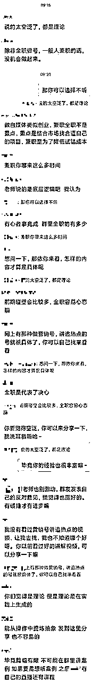
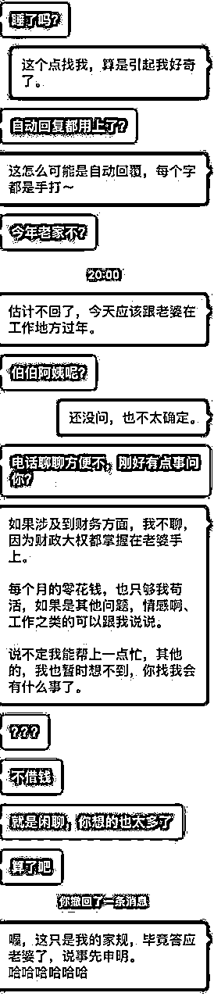
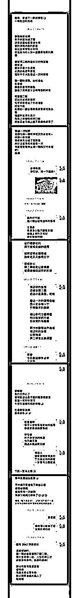

# 知识付费赛道，如何透过处理『反对问题』，增加用户粘性和复购率？

> 来源：[https://oee5lr7gsk.feishu.cn/docx/HXjJd7c9VonHMox4UAYcxOPMnZe](https://oee5lr7gsk.feishu.cn/docx/HXjJd7c9VonHMox4UAYcxOPMnZe)

全文共：6288 字

预计阅读时间：12.314分钟

圈友们好，我是根源，文章的开始先祝福各位新的一年生财有术，龙年行大运！

这篇内容是跟知识付费与私域运营相关的内容

我认为知识付费赛道，难的都不是产品的交付，或者说把服务做好，

而是在交付过程中，透过解决『反对问题』，增加用户的粘性，以及复购率

刚好最近有一个非常棒的案例

我想从这个案例，延伸聊一聊

如何在产品/服务的交付过程中，遇到客户的质疑/反对问题时，

透过沟通，增加用户的粘性，以及复购率

生财有术有很多朋友在知识付费赛道深耕，

想着如果能把这个问题做一个完整的梳理，

那说不定能帮到那些正在知识付费领域中摸索的朋友。

这篇内容我个人觉得很棒，

如果你刚好也在做社群运营或者知识付费的一些事情

很欢迎看完文章后

能一起讨论。

* * *

曾经有一次，在某个挺高额的付费群中，有一位小红书高手发了这样的一张截图。（聊天图片会有点长）

背景大概就是，这位小红书高手有个一百多人的付费群，

群里的『某某某』对这门课有些『意见』，在大群中直接说出来。

某某某：

说的太空泛了，都是理论。

除非全职做号，一般人兼职的话，没机会做的起来。

认真看了这张截图，一定可以发现，

这位老师的付出肯定很不错，因为底下出现的留言，有多数都是『帮老师说话』的言论。

这几年做知识付费结合私域下来，如果要把这行业做一个归属，我会认为这依旧属于『服务业』。

那老师应该服务学生些什么？我会引用韩愈的师说，说过的这段话：

韩愈 . 师说：師者，所以传道授业解惑也。

这段话，其实就涵盖了，

一个知识付费的讲师或者老师，应该要服务的范畴。

也就代表，

只要身为老师的我们，做出这三个范畴之外的事情，那就不是定义上的『服务』。

* * *

# 01 分类言论，重新诠释

我用了一些颜色区分，把这一段截图分成了三段：

红色：评判者

黄色：群主

蓝色：拥护者

看这张长截图的颜色块区分，能更快速地看到『蓝色』占比是最多的，也代表着『拥护者』为多数。

什么样的状况下，拥护者会占大多数？

*   群主的课上得不错

*   多数都是『续费』成员

*   朋友占大多数

不管是哪一种，其实都很棒，因为这是一种『正向』循环，想一个很简单的道理，没事我说他好干嘛，肯定有道理。

但反之又想想，没事说我不好干嘛，肯定也更有道理。

### 没有事实的问题，只有诠释系统的问题。

一个好的诠释，可以让逆势翻盘

一个坏的诠释，整件事情就毁了

以前我自己也犯过这样的错，一个反对问题处理的好，事情真的可以逆风翻盘、但如果一个问题处理不好，就会出现群的崩盘，更严重的就是人设的崩盘。

这也像是一个企业的公关事件，这一年多来也有很多类似的案例，明明是个小错误、但就因为公关处理的好，导致最终粉丝不只没跌、还涨了。

当然也有因为一件很小的错误，公关处理的不好、或是IP处理的不好，粉丝瞬间就掉了几十、几百万。

一个客诉的发生，与其说是：为什么总有这些找碴的人、其实可以用另一种思考来诠释这件事情：

肯定有什么我做不好的地方。

这是一个我这几年，碰上任何客户或者学员的反对问题时，会优先问我自己的，当我一这么反问自己，情绪就开始从对外的批判、变成对内的反省，情绪就会快速消失。

* * *

# 02 重新定义『评判者』

以前我的老师跟我说：

### 真正的高手都不是在顺势能够把事情做得好，而是如何在逆势能够翻盘

如果把这个思维放在上面的例子，其实群主的做法是对的。

每次处理事情的时候，我总会停下五秒问自己：

是否有更好的解决方法？

因为一个『更好的』解决方法，不只能够得到更好的结果、还能降低更多的隐患。

我自己把成功，做了个更精细的定义：

与其谈如何把事情做得更大，

更不如说是，如何未来隐患能变得更少。

因为很多时候一件事情能不能成

不在于那些对的人给多少帮助，而在于那些错的人把事情搅得多糟。

举个例子：

今天我一间店要开业，很多过去帮助过我的人都送来鲜花。

因为过去不小心得罪了某一个小人，

他在这样子的时刻，带着一群他的兄弟到我的店泼油漆。

就因为他带着人来闹事，

让原本能够很顺利开业，反而被这群人就搞砸了。

我常在想：

为什么当时不多做点事情，让这些人未來不会出现来搅局呢？

所以我就对这些人做了个定义，这个定义叫做：

『善贵人』与『恶贵人』。

上面案例，群里的那位『评判者』，我认为这样的角色是个很棒的存在。

因为一个群，假若每个人给的都是正反馈（拥护者），我能肯定这群无法做太大。

因为只有正反馈，是没办法让事情能够更进一步。

### 给出负反馈的那些人，这样的人才是真正能『再』给我帮助的人群。

既然这个人给我的帮助是更大的，

为什么我要排斥他们、甚至是避开他们呢？

* * *

# 03 换个姿势，再来一次

如果是我遇到对话中的状况，我会有两种做法，

## ⭕️第一种做法：保持六十分的礼貌

就是对于这一些勇敢给出反对意见的人，最少做到保持六十分的礼貌。

因为很多时候善意，是有很多种不同方式表达的

很多人可能因为家庭背景、因为工作环境、因为小时候的思维，

他可能习惯用『反义词』来表达他的善意。

我举个例子：

我老婆早上就很喜欢说：

『老公你不抱我，我讨厌你』，

虽然使用的都是『不』，

但我知道老婆心里其实是爱我的。

也就是很多时候，

善意的包装并不一定是用善意的外壳包装，

有时候可能是用黑色的盒子，来包装里面的那一层善意。

## ⭕️第二种做法：用道歉来削弱防御系统

我会先问我自己，

应该要说什么样子的话，

可以让这样的人不只不反对我，内心还会称赞『这个群主够大气』？

所以第二种做法的最首要步骤，我一定跟对方道歉。

这个道歉的目的并不是说『我做得不好』，而是为了让对方，能降低他内心的防御体系。

因为沟通中，潜意识里的防御体系，是造成沟通无法更好传递的核心要素。

甚至我能说：

### 人与人之间的信任感，最首要做的事情就是打破这个防御体系。

也就是说，这个道歉的目的是

为了要减缓当时紧张的情绪，因为任何剑拔弩张的状况是没办法做到更完善的沟通。

* * *

# 04 求关注，并不是只有一种姿态

这个人给了这样子的建议，有没有可能是：

他其实对于课程有疑惑，但是却不知道该怎么提问，

所以选择了一个『相對不好的方式』来引起你的关注？

不是每个人都懂，如何用对的语言得到对的关注，这本就是一个很难学的技能。

举两个不同例子：

*   对的语言、对的关注：

这教学打得太好了，

每个细节都让我眼睛为之一亮，

但是第三阶段的这两个步骤，

我有点看不太懂，

能详细地在跟我说说吗？

*   错的语言、错的关注：

这什么烂课件，

尤其是第三阶段的这两个步骤，

这样写是谁看得懂。

其实，这两种表达方式，都在说同一件事：我这里看不懂，请教我。

过去我在某篇文章曾打过一句话：

不能因为对方不礼貌，就导致我自己也失了礼貌。

修养都来源于自身，不会因为外在的荒唐，而没了自己的修养。

* * *

# 05 降低出现『恶贵人』的隐患

一个问题没处理好，就很容易让原本支持自己的学员怀恨在心，

某天就因为在群里的『感觉』不好，而哪天在其他群说我的闲话，

这样的事情其实是能够避免的。

延伸这段，举一个学员私下对我的提问，这也是一个处理反对问题相关的思维：

### 如何能用沟通上的正确顺序，避免『恶贵人』的出现。

（学员对话截图）

这是学员的一段对话内容

我想，这样的对话在人情世故的现实中，应该不陌生。

上面的对话，是一位学员，这几天找聊的内容，

他发了一张图，我把图片上的对话内容，用文字的方式撷取出来。

发图片之前学员跟我说：

老师，我一位发小，好几年没联系我了，昨晚突然找我

其实，之前他也有跟我借钱的经历

主要是他过去跟我的借钱，后续都不是太好

但我觉得我这样的回覆，有点犯二了

想着你是我沟通老师

我还是得主动的跟您报告

我当时是这么回复学生的：

其实，你的这样的回复并没有错

尤其，感觉到这情况『准备』发生

事先跟他说明了原则，这绝对是一件好事。

但如果是我的话，我可能不会选择这样表达。

我想用两方立场来跟你分享我的看法。

1.  第一个是『借方』的角度：

坦白说，这几年我也有不好过，也借过钱。

甚至，现在都还些再慢慢的还。

我很清楚的知道，

每一笔借钱之前的开口，对于借钱者来说都不容易。

开口，都需要极大的勇气。

光是这一份勇气，就值得给上赞许。

最少，他还会为了生活需要来想办法，

可能这个办法，并不是最好的那一种。

1.  第二个是『被借方』的角度：

我分几个不同的层面说

## ⭕️层面一：说的顺序

你说的并没错，在他口之前先用老婆说，堵住他的问题这，是一句对的话。

但是顺序我认为可以做点修改。

我会把这个话，放在他正式开口的后头。

听他说完之后，再说明你没办法借的原因。

这其实是一种，聆听上的尊重。

很多时候，认真把对方的话听完，也是一种尊重。不管你是否早就听出来。

因为当你自己说话被打断时，心里一定也是不舒服的。

既然是，那就不要把这种不舒服，转移到别人身上。

修养，都在于自身，不在于别人。

我有礼貌不会因为你礼貌，而我就失了我的礼貌。

## ⭕️层面二：现实中的『人情世故』

小时候常听到我父母说：做人留一线。他會說沒問題，

坦白说，当时我听不懂这个意思，现在，我真是有点明白父母为何这么说。

有时候只因为我『回对了』，這一線就能留住，他会马上说没问题。

就因为最开始的一点，对人的『尊重』可以把这关系，稍微地保留着。

坦白说，谁没有状况不好的时候，

包含我也是，谁的人生没有困难的时候，需要不得已找别人帮忙的时刻，

有可能，哪一天你也发生，也需要跟人开口借钱，

因为不得已，借了一轮发现借不到。

因为曾经的善意，

我可以肯定，当你通讯录滑到这一位发小时，想发讯息跟他借一点时，

做人留一线，很多时候这『一线』真是能帮到你大忙！！

## ⭕️层面三：善意的谎言

很多时候『借者』，更宁愿听到一个谎言他可能知道你有。

但最少你用了一个合理的理由跟他说了：

对不起，

我是真的没有，

不然肯定得帮。

因为，让别人『好下台』，也是一门高深的学问。

## ⭕️层面四：一份善念的累积

三十年河东、三十年河西、莫欺少年穷，有没有可能，哪一天这个人就起飞了？

人生在世，哪有一辈子都高的，

可能也哪有一辈子都不好的可能，就算真的没借，用好的语言尊重了他。

很多时候，语言上的尊重对方就是一种帮忙。

当哪一天，真的遇到事情，也需要『别人』帮忙时，

每一次种下的『善念种子』都会开花结果的。

因为他的小气，绝口不借钱！

但可能就因为这份善念，你开口了，他就愿意帮你。

因为当时，他记住了你给他留了一份『尊严』。

## ⭕️层面五：对于关系的对待

其实，你清楚他过去的纪录并不好。

但是『保持六十分的礼貌』，是我一直认为重要的事情，尤其，对于可能会是『小人』的人。

真的有可能，因为这一次的『果断』拒绝，

当有一天你开个店创个业他就怀恨在心，因为你对他的不尊重

结果就带人去泼油漆砸店给差评........

我称这样的人为『恶贵人』，也是贵人的一种。

对任何人保持『最基本六十分的礼貌』，尤其对小人更需要这样。

总结一下上面说的几个重要的点：

*   修养都在于自身，不在于别人。

*   做人留一线。

*   让别人『好下台』，也是一门高深的学问。

*   三十年河东、三十年河西。

*   每一次种下的『善念种子』都会开花结果的。

*   对任何人，保持六十分的礼貌。

其实关系的处理，是人生最高深的一门学问，也是最难的，

能处理好关系的人，哪一个不是超级高手。

同时，私域运营的场景，更是一种超大型处理关系的环境，

处理的好就皆大欢喜，

但只要处理不好，就容易因为自己的疏忽，而『制造』出好多恶贵人的出现。

* * *

# 06 嫌货人才是买货人

销售的过程，我学过一段话这段话是这么说的

嫌货人才是买货人。

这个『嫌货人』谈的就是那些：

会杀价的、会讲产品不好的、会说东西有瑕疵的人。

也就是，这个看似口出恶言的人，他其实就是我上面谈的买货人。

真正的销售高手、解决问题高手，其实都在于如何去解决这一些很难处理的反对问题。

如何把这样子的人，服务到让他心服口服，

我认为是这样子的事情带给我们最大的领悟。

如果要以这个案子为实战经验，我可能就会这么进行回复，我会说：

很抱歉，

让你有这样子的体验，

其实你说到的空泛，

我在写课程的时候也有这样子的感觉，

你的这句话点醒了，

我在课程上应该去做一些更细微的修改。

因为我清楚，

我能做并不代表别人也能做，

我做得到也并不代表别人就一定做得到。

如果只是我能做到，

但别人却做不到，

有可能是因为我步骤拆的不够细，

更有可能是因为

我用过于主观的方式来写这堂课。

所以很谢谢你，

给出这样子的建议，

让我有机会可以思考，

如何把课程变得更完善。

那我能不能够知道，

是哪个部分让你感觉写得不够完善呢

很希望你能告诉我，

这样有助于让我把课程做得更好。

我同时会发在群里，以及私发到他的个人私信中。（这个动作超级重要。）

这个小举动，可以大大的增加对方的好感，因为是一种对于提问者的尊重。

* * *

# 07 透过致歉，来重新审视自己的位置

其实做这样子的举动有三层含义，

## ⭕️第一层含义：让这个人冷静

致歉，是一种非常好『让对方可以不继续攻击』的好方式，

因为只有放下『攻击姿态』，才能愿意听，我接下来想说什么。

## ⭕️第二层含义：重新审视自己

人只要遭遇批判，惯性行为一定是『反击』，二话不说先打再说。

但是这个『致歉』就像是一桶冷水，可以同时让自己也冷静下来。

很多争执场景，其实是能够避免的，

会越演越烈的最大原因，反倒不是对方，而是自己没控制好，也跟着发火。

## ⭕️第三层含义：大格局一定会向下兼容

当我能够在这么多人的群里，

用这种方式解决『評判者』的反馈，更能够让那些支持我的人可以感受到：

这个群主真的跟其他群主不一样。

我认为花钱买他的课真的很值得，

因为连看似这么棘手的反对问题，

都可以解决到让对方心服口服。

第三个含义，也是我认为一定比我的课程做得多么的详细、这么的好来的更重要。

因为很多时候，在互动的过程、随机的过程、这些突发状况的过程中解决问题。

才是我认为能够真的把群做好，并且让这些原本的学员可以对我更加认同的关键。

一个反对问题的处理，其实群里的学员都在看，格局够大处理的好，

都能在群里面增加这些原本就已经支持自己的人，增加下次愿意复购的概率。

* * *

# 08 任何的逆势，都能够化为优势

这张图，是我第二期沟通课的尾声，

准备进行第三期沟通课招生时，有一位学员私下发给我的。

也当成这次案例分享的结尾。

当时是我开的第二期沟通课，

在第二期结束发毕业证书的时候，她给了我这样的反馈，当下我的第一个想法就是：

完蛋了，第三期肯定不来报名。

但也因为我的『第一回应』处理的不错，

并没有因为他对于课程的不满意，我就失了礼貌。

最终这位学员不只报名了第三期，那年一共参加了我七期的课，

然后最终又报名了我十万的年度终身教练。

最后用这句话期许自己：

善意的提醒，很多时候不一定会以佛的形态出现，

更多时候，会用魔的方式来狠狠敲你。不管佛还是魔，都得对他说声谢谢。

* * *

# 尾声的过去历史介绍

我是根源，同时也是第四期的生财圈友

一个有 2w+ 实战案例的心理咨询师

12年线下销售、团队管理经验。

2022 年开始转型线上，做一些知识付费的项目。

过去曾发表过几篇文章

都能看到这，代表你对文章的喜爱

肯定有一定的程度！

也欢迎阅读过去我写过的历史文章。

2021年的文章（精华x1）

1.  精华《直觉式萨克斯 透过社群成功变现146万》 https://t.zsxq.com/116B1bcYc

1.  《73项被动收入打造》 https://t.zsxq.com/11EHjTH0P

1.  《杭州夜话02场，夜话官复盘》 https://t.zsxq.com/19IkX4UMl

1.  《年入百万，团队从20人到4万人》 https://t.zsxq.com/19JYt77hL

1.  《主题：如何更有效的链接见面会认识的圈友》 https://t.zsxq.com/19VY2LWg4

2022年的文章

1.  《互联网小白，第 1 次做线上产品，7 天赚回 10 倍门票》 https://t.zsxq.com/11ooZZbM7

1.  《把捣乱分子『逆势』转成爱用者的好方式》 https://t.zsxq.com/19lipLhJ5

1.  《 好的内容，是目前依旧没退旧流行的变现方式 》 https://t.zsxq.com/19BLMAYw1

1.  《明白老师的一个启发，让我从100天日耕的过程赚了30W+》 https://t.zsxq.com/19BgNoxfi

2023年的文章（精华x6）

1.  《私域的意义不是管理，而是经营》 https://t.zsxq.com/19WEsfSq1

1.  精华《9年传统行业 1 年时间，从一无所有，到年入 200 万》 https://t.zsxq.com/10nmEr1cA

1.  精华《25个提高微信成交率的小技巧》 https://t.zsxq.com/11AgRW24F

1.  精华《35 个让私域收入翻 3 倍的技巧》 https://t.zsxq.com/11FmV2aqZ

1.  精华《续篇 - 25个提高微信成交率的小技巧（26 - 50）》 https://t.zsxq.com/13yRbmUwo

1.  《 私域话题：涨价之后，如何回复以及留住客户？》 https://t.zsxq.com/11UJk9HxQ

1.  精华《成为自由职业者的20个必备特质 》 https://t.zsxq.com/14XTxhh15

1.  《 36个让私域成交率翻倍的实战指南！ 》 https://t.zsxq.com/17zSrYzvk

1.  精华《产品线有引流体系，如何通过沟通促成升单？》 https://t.zsxq.com/17ocUJEFA

多亏加入了生财有术

让我少走了很多弯路。

也积累了一些经验、心得

如果圈友有什么需要探讨的

欢迎加我微信「 AF54094 」交流~

▲

也能扫码撩我~