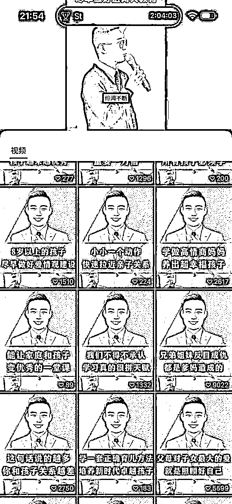
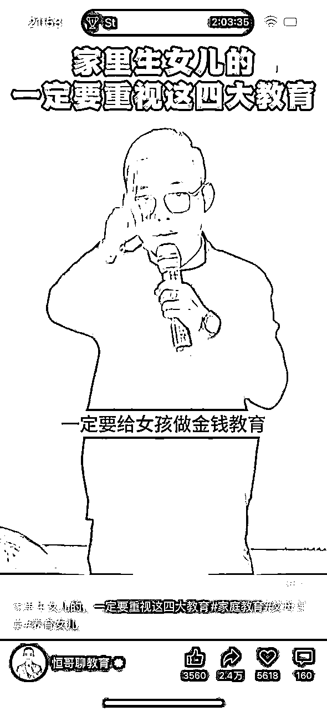
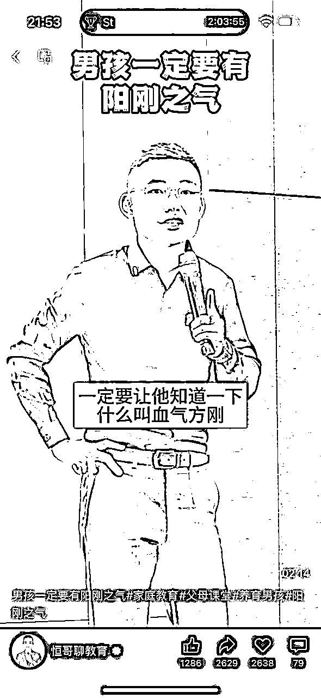
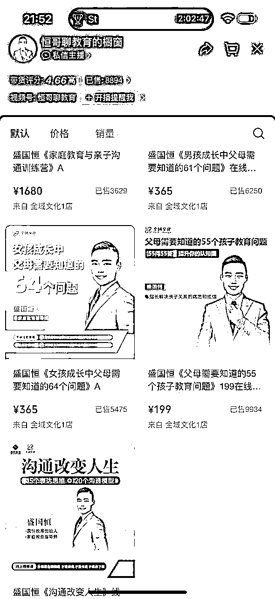
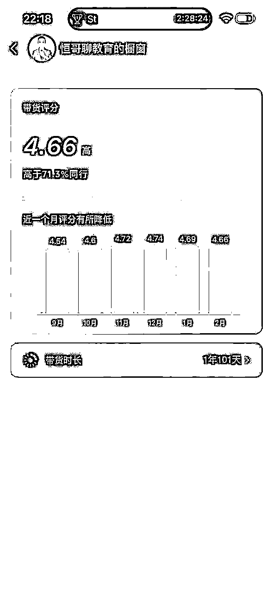
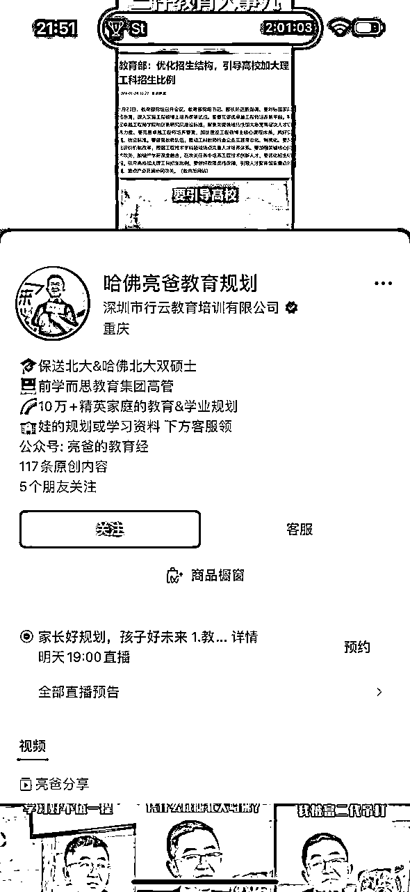
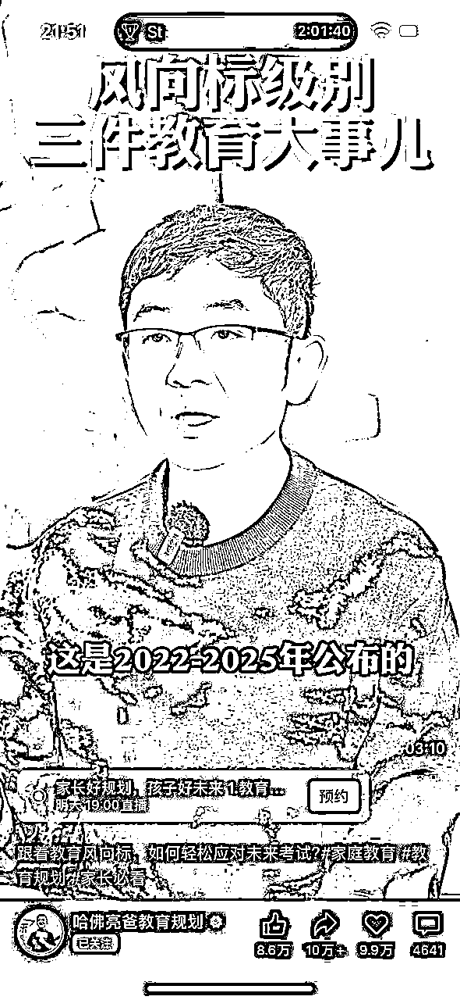
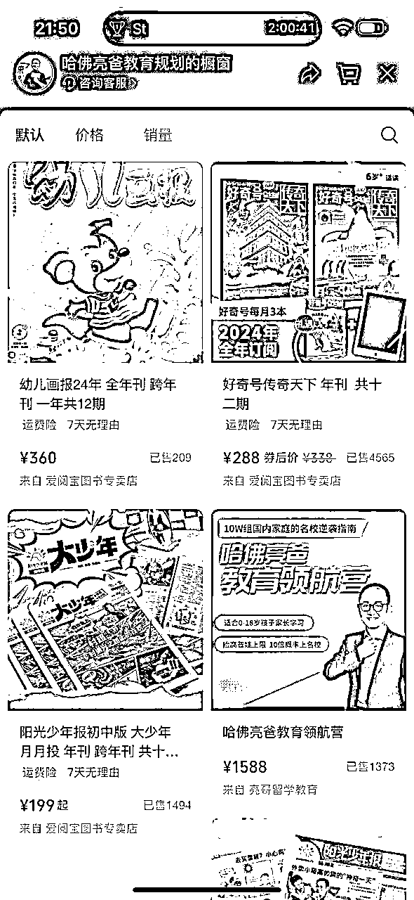
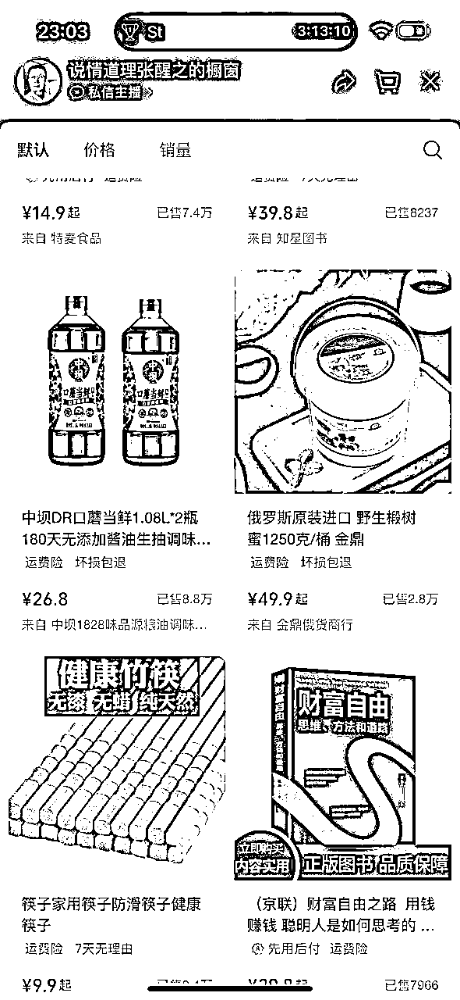
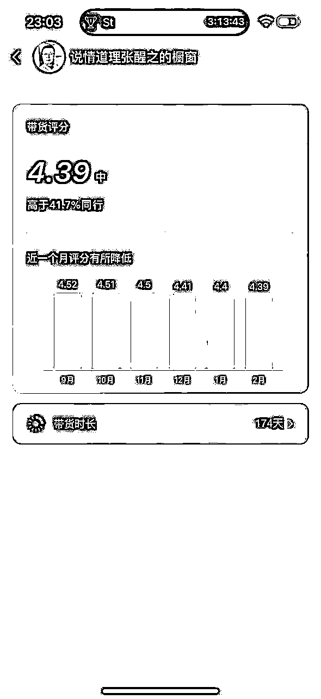

# 风向标拆解第 3 期 -- 视频号高销量的知识付费是怎么玩的 -- Sevila夏薇拉

> 来源：[https://hx3f0km7fuv.feishu.cn/docx/HeIydotcWoFcjwxChchcVrQFnLd](https://hx3f0km7fuv.feishu.cn/docx/HeIydotcWoFcjwxChchcVrQFnLd)

大家好，我是Sevila夏薇拉~

最近有幸参加了咱们风向标拆解第三期活动，我拆解的风向标项目是：视频号高销量的知识付费是怎么玩的。下面来跟大家分享我的整个拆解过程。

主要目的是帮助大家了解一下视频号知识付费类赛道做账号变现的具体玩法，请看下文~

本篇拆解大纲如下（点击蓝色字体即可跳转到对应板块）

1.赛道前景描述

2.账号定位与内容

3.变现分析

4.注意事项

# 1\. 前景概述

知识付费属于在各个平台都玩烂了的内容，但我为什么还选择分析这个赛道？

理由如下：

1.知识付费属于爱学习的人可以低成本甚至零成本开始的一种赛道，时间自由，收益会根据你自身能力和团队能力而递增。

2.知识付费类的账号，对于打造知识类个人IP具有极强的叠加作用。

3.为什么选择视频号，理由也很简单：我在视频号里进行“知识、职业”等关键词搜索，发现搜索出来的内容非常单一，爆款内容很少，说明知识付费领域目前在视频号里还属于蓝海阶段，各位有想法的老板，在这里能够大有可为。

# 2.内容选题

知识付费类能够涵盖的范围很广，在其他所有平台跑通的赛道，都值得来视频号里一试。

选择的原则首先从你个人的兴趣爱好出发，你自己常研究的、常看的，你喜欢的、主动花时间最多的地方，都可以作为方向选择的依据。

选择好细分赛道，要想想自己的定位是面对哪些人群，你的账号怎样能够快速出圈，在这里，小白行动最快的方式，就是拆解对标账号，进行模仿。

以下给大家几个拆解的例子，供各位看官参考：

## 案例分享

案例1：亲子教育赛道

#### 基本情况

账号名称：恒哥聊教育

细分领域：亲子教育+亲子关系

内容呈现方式：

基本是现下授课视频的录制剪辑，教会家长如何正确与孩子沟通，解决父母与孩子之间的矛盾等等

变现方式：

a. 亲子教育视频录制课程，目前有4个课程，单价分199、365、499，合计总变现金额约670W

b.亲子教育社群训练营，单价1680，已售3629，变现近610W。

ps.查了一下账号带货时间，近一年零四个月。

案例2：亲子教育赛道

#### 基本情况

账号名称：哈佛亮爸教育规划

细分领域：亲子教育+孩子的教育规划

内容呈现方式：

人设为保送北大&哈佛双硕士，人设首先就立住了

内容基本为室内讲述视频，对父母对孩子的教育规划进行引导

变现方式：

a. 少儿书籍，有双语内容，比当当和京东价格都低，目前有4类年刊订阅，均价300元左右，带货4128件，总带货金额近124W

b.孩子留学教育家长训练营，单价1588，已售4565，变现近220W。

ps.查了一下账号带货时间，273天。

案例3：为人处世教育赛道

#### 基本情况

账号名称：说情道理张醒之

细分领域：为人处世教育，适合成年后的全年龄段人群，尤其是30-80+

内容呈现方式：

中年人，中式服装，书房内视频讲述，单条视频大部分点赞过万，转发率也很高

变现方式：

a. 书籍类，目前带货30本书，均价30元左右

b.百货，均价在30元左右

c.二者带货3.3万件，乘以均价就是99万元

ps.查了一下账号带货时间，174天。

# 3.变现分析

基本遵循以下逻辑：

1.做好定位，注册申请包装账号，发布第一个内容

2.持续不断围绕核心内容进行输出

3.看粉丝画像，如果年龄不大，就只做课程，先做录播课，再开高客单价的训练营；如果粉丝年龄50岁以上比较多，在卖课的同时可以进行书籍百货的带货，粉丝反感的可能性不大

4.持续做出优质内容和优质课程，不断放大自己的影响力

# 4.注意事项

知识付费是一条能够深耕的赛道，所以必须有耐心，不太适合想赚快钱的人，当然之前的案例3，可以结合快钱思考，但是要想准定位和用户画像，用内容做勾子，结合直播，引发带货。只要能引起粉丝信任，就有可能成交。

以上就是我的拆解思考，非常感谢您看到这里。

2024，和大家一起生财有术！