# 风向标拆解第3期--小红书高销量手作饰品都是怎样的运转逻辑？--咻咻

> 来源：[https://r04hyaniw3.feishu.cn/docx/Ibc2dZ5ajoBNJuxzEs7cxsQOn3e](https://r04hyaniw3.feishu.cn/docx/Ibc2dZ5ajoBNJuxzEs7cxsQOn3e)

# 拆解账号：

1、【川川手作】Fairy house

2、楠璞手作饰品

3、认真的橙子

4、山野少女

5、简菩文创

选以上几个账号的原因：在小红书的店铺销量都比较靠前，产品类型也稍微有些差别，粉丝数量也各不同，利于分析比较。

我会先从粉丝数量、笔记内容、产品风格方面来记录这几个账号的信息。最后再分析几个账号的特性，来总结其背后的运转逻辑。

# 各账号的详细拆解

## 账号：【川川手作】Fairy house

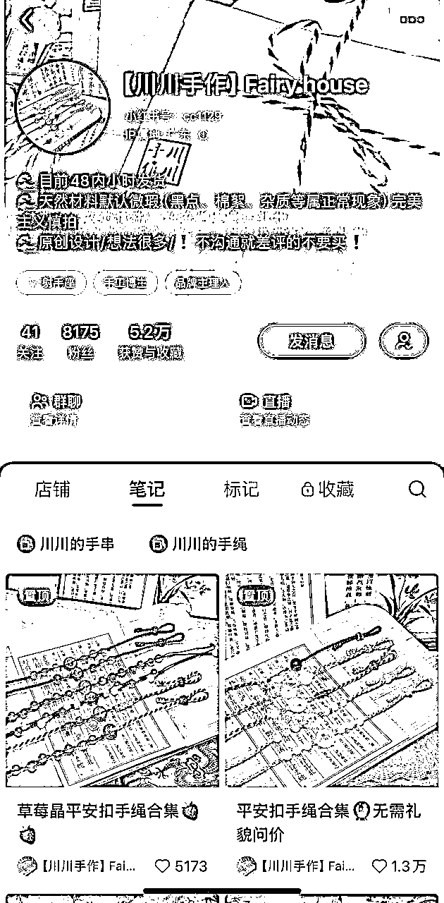

### 粉丝数：8174

### 产品类型：原创设计，玛瑙类型手串、项链

### 产品价格：9.9-60以内，大部分都是50以内。

### 产品利润估算：

根据市场调查，产品自身成本+包装快递费，估计在6-8元之间，大概每单利润是4-50元之间。

### 笔记内容：

2022.5.20开始发笔记，发的随意图片，发两篇就断了。

2023.3.13重新开始发笔记，发产品的图文笔记，内容就是产品的摄影图，标题写上产品名称。

看样子是自己拍摄的，风格是带点仙气儿，唯美感觉的。

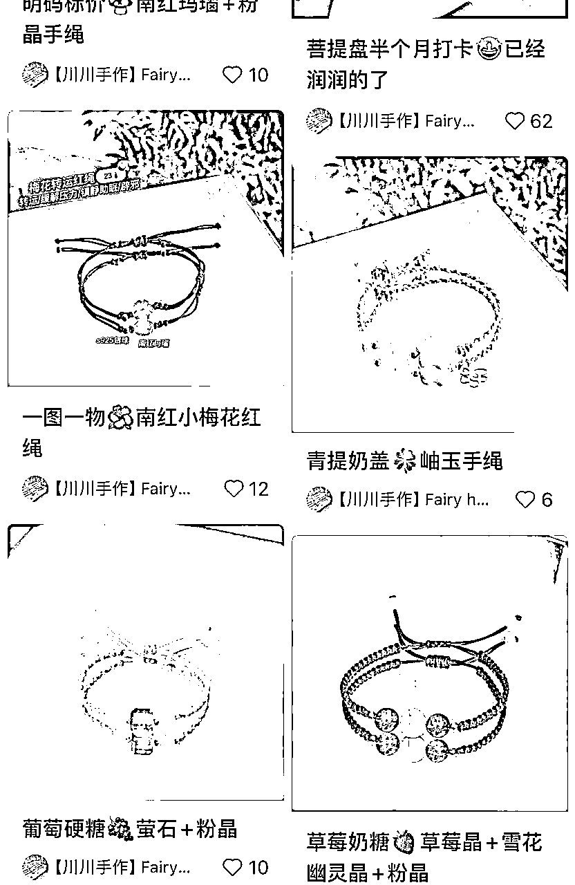

2023.4.4的笔记开始挂商品，后面都是挂商品的图文笔记了。

更新频率基本是日更。

一开始的笔记点赞都很少，从4月底出现了一篇爆文，关于她的摆摊经验分享。

8月底，有了真正的产品爆款笔记，也是从这篇笔记开始，如下图，她改变了产品的拍摄风格，并且一直持续这个风格到现在。

### 店铺销量：最高产品销量一千多，其余多为100-200

### 有无直播：无

### 有无群聊: 有，进群查看了一下，基本没人说话，就是店主时常在里面发上新通知

### 有无其他平台店铺：淘宝有店铺，但是没有营业，所以可以算是无

### 分析总结：

这家店从2023年3月份开到现在，等于是不到一年，没有直播，只是靠日更笔记，就有了不错的销量。是怎么做到的呢？

我觉得就是首先离不开店主的坚持日更，然后就是她的产品调性，笔记调性都比较一致，主打原创手工制作，价格又不算贵，尤其产品和拍摄图确实很吸引人，容易被人记住。

那他的笔记的吸引点在哪里呢？

从所有笔记分析来看，主要是图片的功劳。因为所有笔记的标题都非常简单，只是写了个产品的名字，所以产品标题起到的作用应该是比较小的，更多的还是图片起到了引流作用。

然后从笔记数据来看，很明显，从她转变了拍摄图的风格以后呢，笔记流量更好了，然后我个人也觉得后来的这个风格拍出来真的很让人眼前一亮，和产品的本身气质也非常搭调，所以肯定是给她的产品大大加分了。

最后总结该店高销量原因：产品风格一致，有记忆点，笔记内容垂直，且颇有特色，做出了属于自己的品牌感，并且坚持日更笔记。

## 账号：楠璞手作饰品

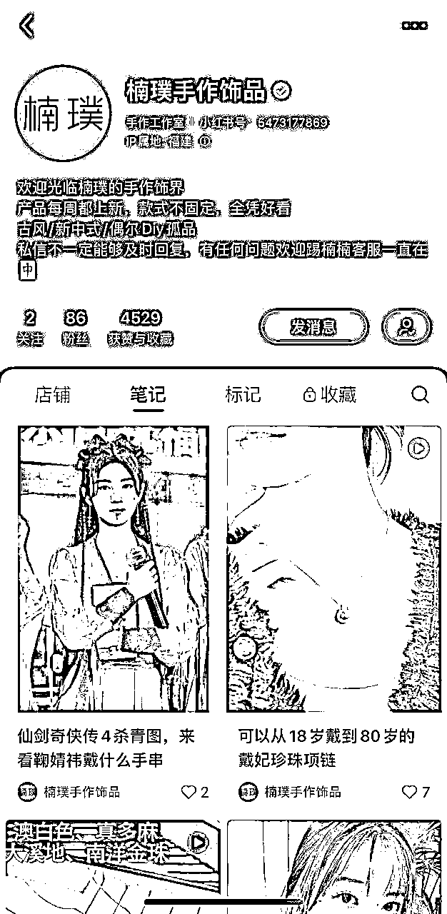

### 粉丝数：86

### 产品类型：古风、新中式，和田玉、珍珠，手串项链

### 产品价格：19.9-350元以内，大部分100以内。

### 产品利润估算：

不好估，这家产品卖玉较多，玉的价格实在是参差不齐，无法估算利润。

### 笔记内容：

图文、视频都有。

大概2023.11中旬开始发笔记，第一条开始就挂商品，内容都是展示产品为主。笔记风格很杂乱，有时候只是展示产品，有时候发明星事件蹭热度，点赞数据大部分都在10以内。

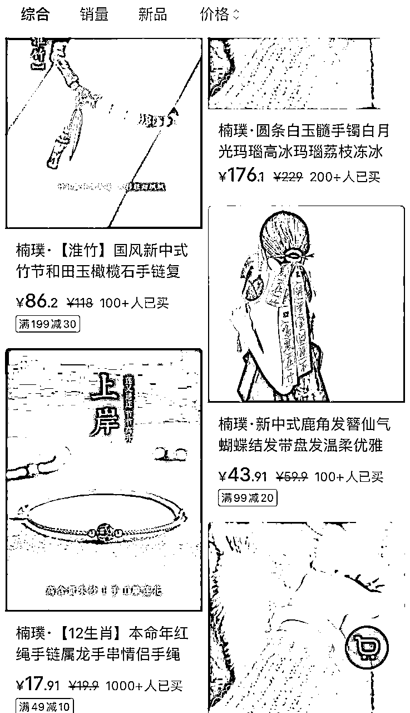

### 店铺销量：最高产品销量一千多，其余多为100-200

### 有无直播：无

### 有无群聊：无

### 有无其他平台店铺：无

### 分析总结：

这家店销量整体来说比较一般，不过她的产品价格比较多样，既有50以内的低价，也有更高的单品，所以虽然销量少，但是可能每单利润较高。

她的笔记的风格始终没统一过，进到她的主页就是给人一种杂乱的感觉。他的产品也没很明显的风格特性，让用户没办法第一时间就知道她的主打产品是什么。但是就这样，她也有个过千销量的小爆款，我推测她一方面可能赶上了小红书的开店红利，一方面靠坚持发笔记，慢慢积累起来的。

## 账号：认真的橙子

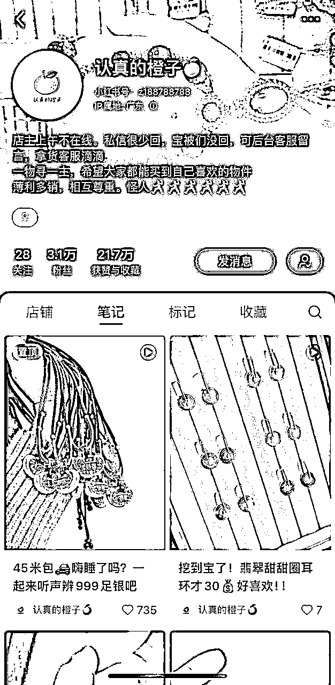

### 粉丝数：3.1万

### 产品类型：翡翠、玉之类的饰品，项链

### 产品价格：9.9-60元以内，小部分200以内。

### 产品利润估算：无法估算

### 笔记内容：

视频笔记为主。2022.4.18开始发笔记，2022.7.6开始挂商品。更新频率非日更，无规律。

笔记内容多是短型视频，无配音解说，只展示产品，如下图2所示，产品的介绍都放在了标题和文字区。但是所有的笔记风格调性比较统一，还是比较有辨识度的。

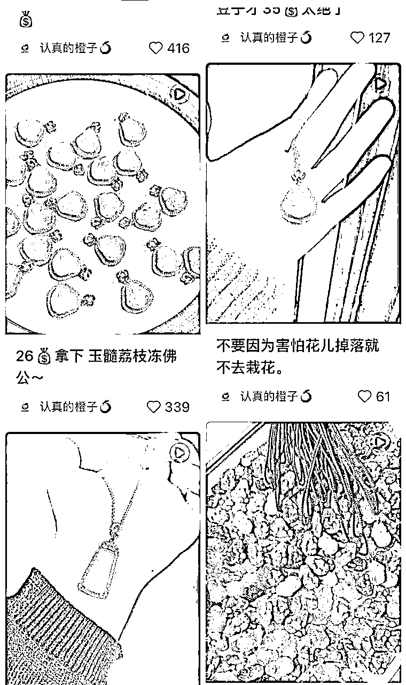

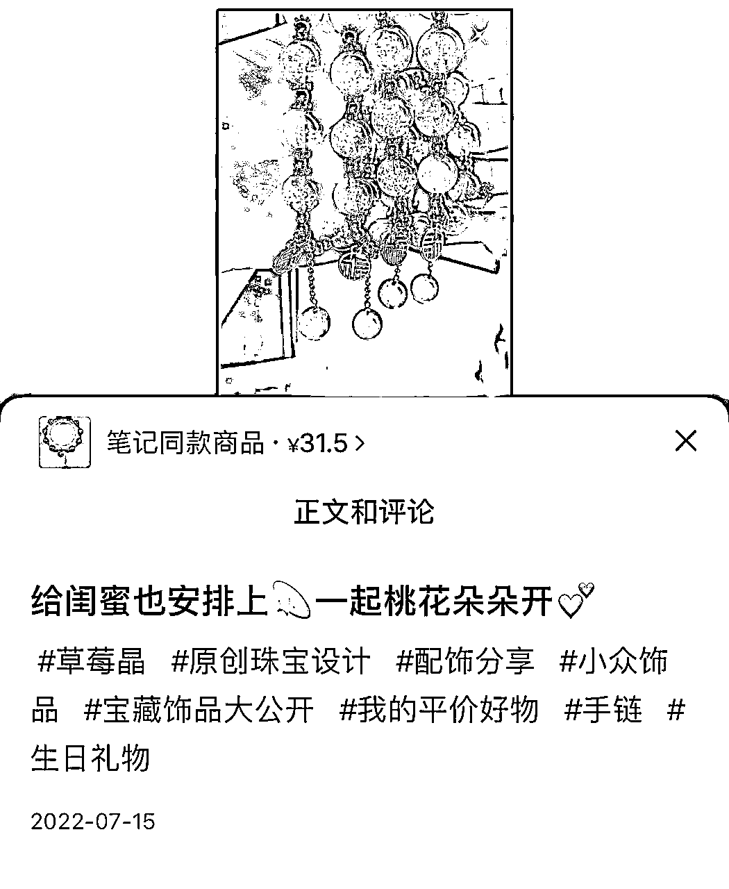

### 有无直播：无

### 有无群聊：无

### 店铺销量：最高产品销量一千多，其余多为100-200

### 有无其他平台店铺：淘宝有，但是看样子没太经营。

### 分析总结：

这家开店的时间线也快2年了，价格也不算很贵的那种，对比拆解的其他几个号，这销量真不算太好。笔记更新频率也不高，应该是副业做的。这种情况下，更新频率可以低点，但是我觉得笔记内容如果改善一下可能会提高销量。

## 账号：山野少女

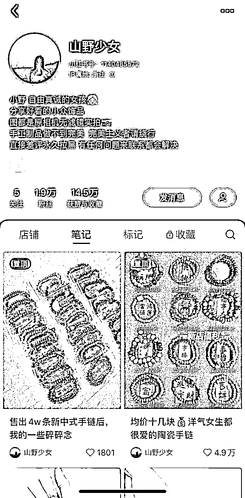

### 粉丝数：1.9万

### 产品类型：新中式、文玩类型的手串为主

### 产品价格：9.9-30元以内，产品数量很少，20个以内。

### 产品利润估算：

根据市场调查，产品自身成本+包装快递费，估计在6-8元之间，大概每单利润是4-22元之间。

### 笔记内容：

2023.5.3开始发笔记，第一条笔记就开始挂商品，可见是直接冲着开店来的。前期的笔记更新没有规律，发布频率较低，近期基本是日更一篇。

笔记内容视频图文都有，占比差不多。图文笔记内容就是单一的展示产品，视频内容也一样，没有产品解说，如下图所示。只要是发产品合集的那种笔记，点赞数据就不错。由于产品风格差不多，所以整个主页的笔记给人的感觉也算统一的，但是辨识度不太高。

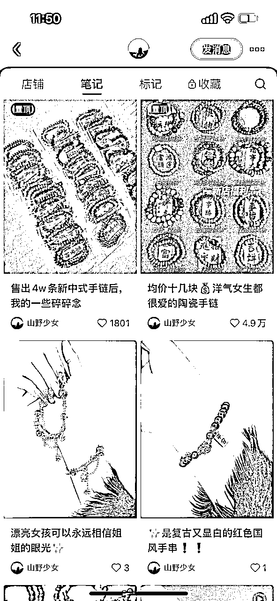

### 有无直播：无

### 有无群聊：无

### 店铺销量：最高产品销量4万+，其余多为100-200

### 有无其他平台店铺：无

### 分析总结：

2023年5月才开始发笔记卖货，到现在已经有上万销量的产品，很不错了。相比其他同时间开店的账号，她涨粉速度不错，可能是产品比较受欢迎。产品和笔记风格都比较统一，如果前期的笔记更新频率再高些，也许成绩会更好。

最后总结该店高销量原因：产品和笔记，想表达的风格调性都比较一致，并且物美价廉，笔记内容垂直，且坚持更新笔记。

## 账号：简菩文创

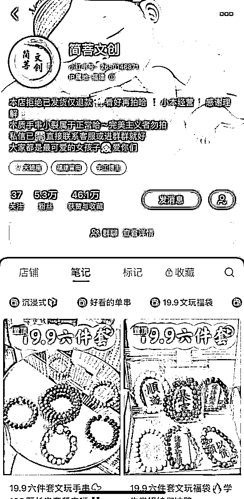

### 粉丝数：5.3万

### 产品类型：文玩类型手串

### 产品价格：大部分8.8-30，小部分30-60。

### 产品利润估算：

根据市场调查，一个单品成本+包装快递费，估计在6-8元之间，而他卖的套餐居多，如果是有更便宜的渠道，可能套餐的总成本也就七八块钱，那么这种19.9的套餐利润可能在11元左右。其余小部分更高价的产品，利润肯定更高了。

### 笔记内容：

视频笔记为主，内容展示产品，有方言配音，如图所示，都是价格作为标题。

2023.3.1开始发笔记，笔记内容只是很单调的展示产品，没有任何配音解说，更新频率为日更。

3.21开始转变笔记内容，如下图，有了配音来详细介绍、展示产品，并说明价格，后面基本都是延续这种笔记风格了。

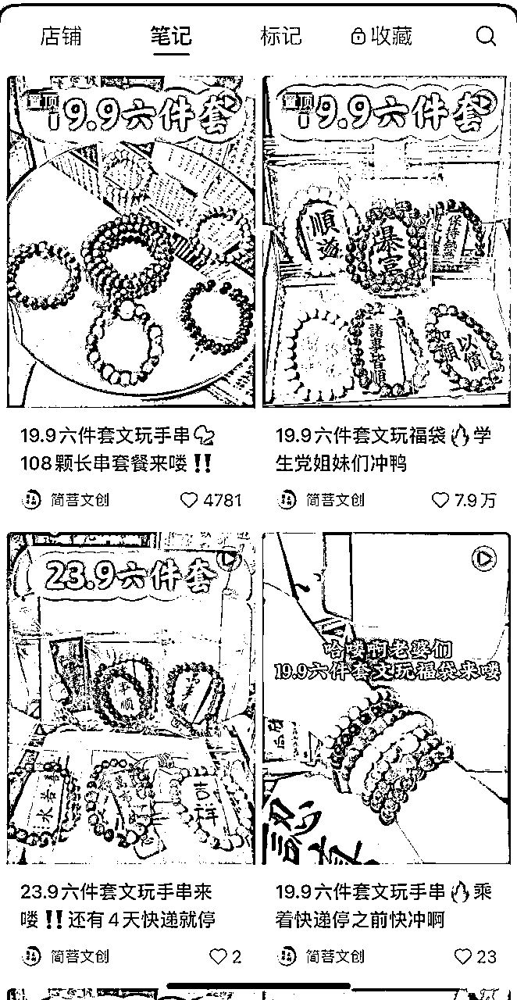

### 店铺销量：两款产品有过万的销量，最高产品销量4.3万，其余多为几千，或几百几十

### 有无直播：无

### 有无群聊: 有，5个

### 有无其他平台店铺：抖音有店铺，并且同步了笔记，但是销量最多就几百个，远不如小红书。

### 分析总结：

这个店铺首先产品风格非常统一，走的文玩路线，比较有记忆点。然后就是价格都普遍很便宜，不到20块钱能买6串，相比同行，非常便宜了，我觉得便宜这个点应该带来了大部分销量。笔记也尽量走着统一的风格，更利于小红书给他推送合适的用户。

最后总结该店高销量原因：无论从店铺名称，还是产品，想表达的风格调性都高度一致，并且物美价廉，笔记内容垂直，且坚持日更。

# 最后总结

首先总结一下产品行情，这5家店铺，产品基本都算是文玩领域，带文玩手串号称是个养成系爱好，一方面可以作为装饰，给人增添美感，一方面也是个精神追求上的爱好。

这几家店可以划分成两个大类型，一类是玛瑙、玉的饰品，一类是木质类型的饰品，

经过我在小红书上的调查对比，木质类型要比玛瑙玉类销量更好。那为什么木质类型销量更好呢？经过我对文玩产品的调查来看，文玩手串是有级别划分的，玛瑙玉之类的是属于入门级别的人玩的，木质类型的是属于资深玩家的。再加上我觉得在传统意义上，木质类型可能更符合大家对文玩的理解和认知，所以选木质类型来玩的会更多，自然销量也就更多。

然后总结一下这几家店，我觉得有几个要素可以提炼出来

1、坚持日更笔记，并且风格统一

2、产品风格鲜明、统一，有记忆点

3、价格在9.9-30以内

这3个要素，再加上文玩这类产品的特殊性（满足了用户的爱美性，精神爱好的追求），应该就是高销量的原因了。