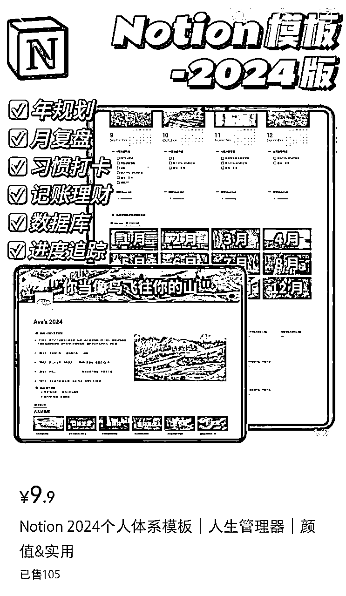
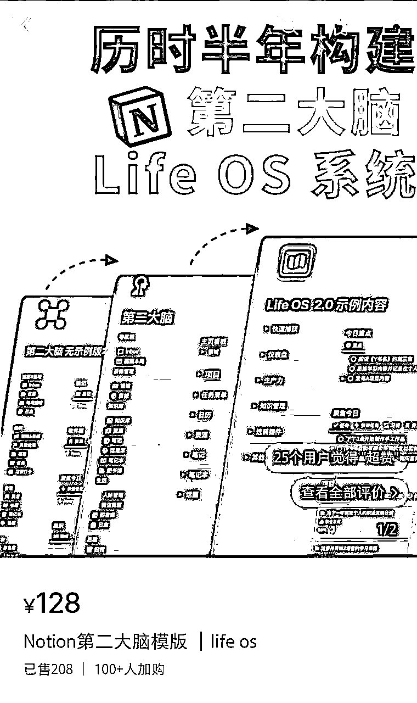
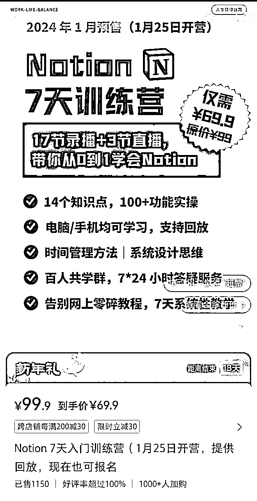
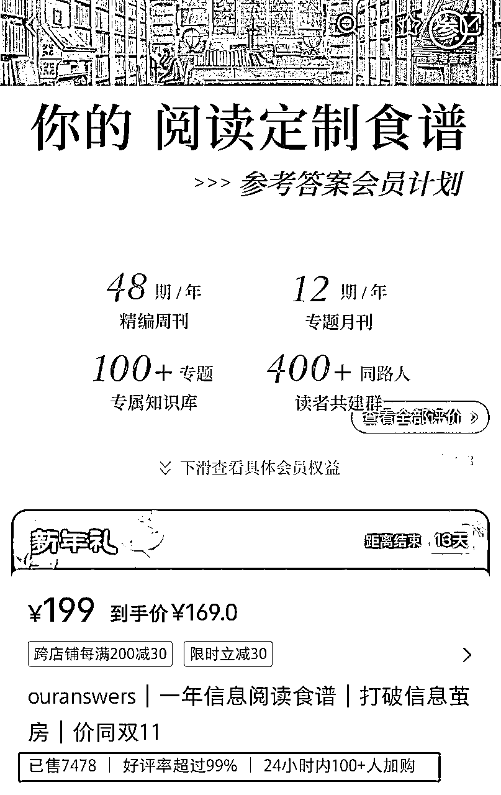

# 风向标拆解第3期-机会9：靠Notion模板年收入100万美元，通过资料整理变现的路径如何实现-灵犀小V

> 来源：[https://jqm0uu2peum.feishu.cn/docx/J2o8dT455oiVqWxHSGuc1vABnag](https://jqm0uu2peum.feishu.cn/docx/J2o8dT455oiVqWxHSGuc1vABnag)

现在人们在创作前大部分都会百度搜索一下相关模板进行套用，这个看似日常的潜意识行为包含了巨大的商机，通过整理归纳各种模板资料可以实现变现，有数据表明全球最赚钱的Notion博主Notion模板年收入达100万美元，资料整理的变现市场大有可为。

# 背景概述

## 1.什么是Notion

Notion是国外的一款软件，包含了笔记、文档、任务、数据库、日历、多人协作等内容的all in one生产力工具。

## 2.Notion的作用

可以记录、管理信息、收集资料、追踪进度、呈现看板等，可以实现个人知识系统构建，系统管理，团队项目合作管理。

## 3.Notion的市场如何以及在国内的适用性

*   Notion的市场前景

注册用户3-4千万，付费用户4-5百万，用户所在国家50-60个，营收最大的notion创作者收入1000-1500万人民币/年，国外创作者80%只发模板20%做consultant，中国notion的用户很少。

*   Notion在国内的适用性

1.目前界面不支持中文，在语言上存在一定壁垒。

2.Notion的服务器位于国外，存在一定的网络不稳定情况。

## 4.国内类似软件

国内飞书、钉钉个人版是类似Notion的集合多功能的生产力工具，但是目前飞书、钉钉模板的市场相对空白，较少人介入。

# 以下是项目拆解需要解决的4个核心问题：

# 产品是什么

产品可以分为两类：

一是通过整理资料实现变现。资料的关键在于价值、整理的逻辑性，有还可以适时加入观点；

二是通过建立深度讨论、陪伴、训练营等进行变现

## 资料类

### 获取什么资料

#### 1、模板类：

计划模板、复盘模板、记账模板、打卡模板、PPT模板、思维导图模板、简历模板等

从左边的两款售卖产品价格可看出，简单售卖单一规划模板价位较低

如果开发出一个管理某项工作的系统，加入自己的逻辑设计进去可以10倍以上的提升价位

这就是价值差异!

#### 2、文章视频类：

*   优质网络文章、刊物、演讲视频、电影等

刘润、吴晓波等大腕的年度演讲视频和全文稿是很多人都喜欢记录收藏会看的材料。如果能将这些需求及时收集并将优质内容整理归纳，能帮助大家解决收集材料的繁琐问题，很可能会付费购买。

#### 3、技巧类：

烹饪、育儿、通用技能（时间管理方法、笔记记录法）等

#### 4、学习工作相关资料类：

考研资料、公务员考试资料、公文写作资料及模板、各种资格证备考资料

### 如何获取资料

#### 1、模板类：

拼多多、淘宝等电商平台，AI创作，平台现有模板再设计

#### 2、文章视频类：

TED、B站、微博、公众号、知乎、头条

#### 3、技巧类：

知识星球、百度网盘、小红书

#### 4、学习工作相关资料类：

考研资讯网、教培类网站下载、工作涉及的写作可以直接运用，专业写手创作，ChatGPT

### 如何进行整理归纳

按分类、时间、关键词进行归纳

## 训练陪跑营类

根据个人特长及擅长的资料类型开设计划打卡陪伴营、个人成长训练营、各种类型技能成长训练营等。建议资料与训练营选择相关类目，尽量保持类目垂直。

鉴于Notion国内使用的人很少，市场竞争较少，可以针对想学习Notion使用方法的人开设训练营。

训练营课程以录播为主，一次录制，“睡后”收益，平时只要定期进行直播答疑等即可

转化了第一批批用户之后还可以从里面继续进行高阶转化，开设其他陪跑训练营等

# 用户是谁（买家）

*   根据资料类型对应需求方

*   计划复盘类模板是通用模板，普遍适用

# 如何引流（渠道）

1、在小红书、公众号等平台上免费发放部分模板（放钩子）导流入私域；

2、矩阵账号引流

3、开店引流

4、如果英文比较好的话，可以在国外的网站进行引流

# 如何变现（路径）

1、通过各平台售卖模板；

2、教别人如何做模板、如何使用软件；

由于Notion是英文软件，本身语言上就存在一定壁垒。建立第二大脑这个概念在中国还没普及化，目前教授利用系统进行人生规划的市场还相对空白，如果能尽快熟悉软件并利用软件服务生活就可以出品教人使用软件、搭建体系的课程进行售卖。

3、年度付费会员制；

通过收集各类优质信息进行归纳，开设年度付费会员的方式提供权益，同时可以开通不通层级的会员群，提供不同价值的付费服务

4、知识星球/微信群陪跑训练；

5、付费咨询

当用户购买了你的信息之后，你在专业领域可以提供付费咨询。比如如果你是专业的HR，熟悉招聘环节就可以售卖简历模板，付费修改简历，提供面试的付费咨询业务。