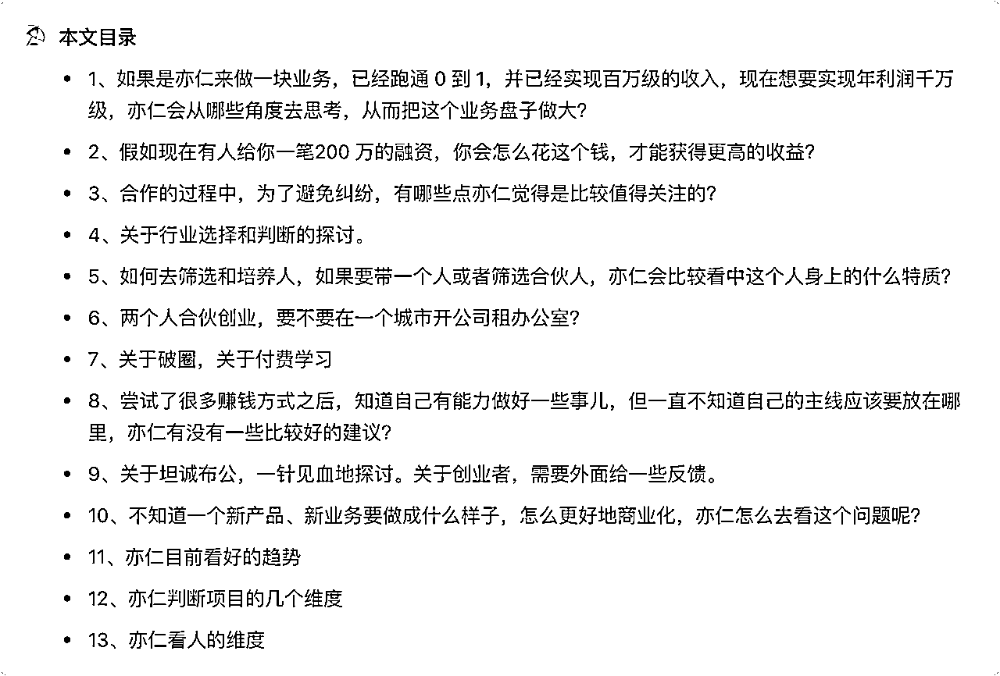
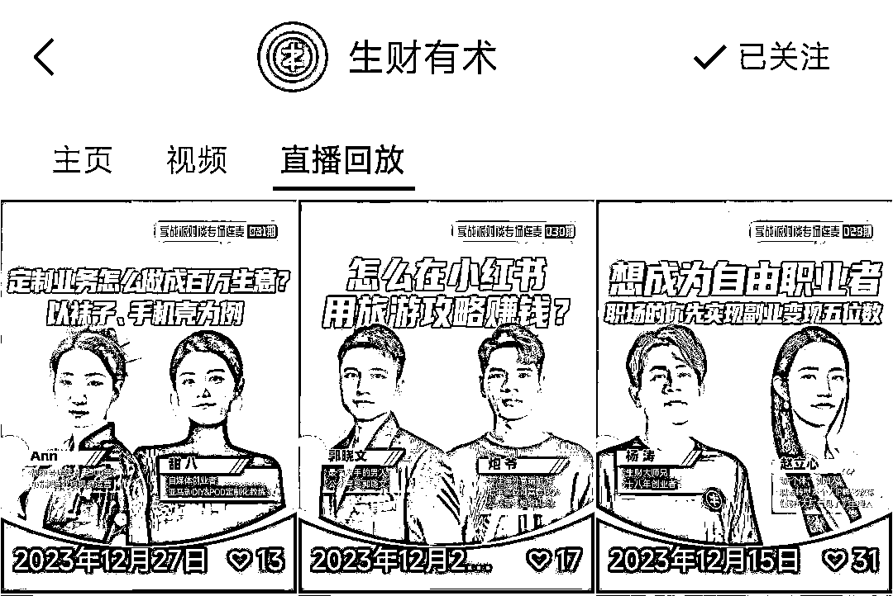

# 万字长文记录我们召唤神龙亦仁价值10W元的2小时神龙咨询

> 来源：[https://qpztiqweer.feishu.cn/docx/JehBd0THgoQUCVxh9NScNK9dnhf](https://qpztiqweer.feishu.cn/docx/JehBd0THgoQUCVxh9NScNK9dnhf)

2023 年 12 月底的时候，我和我合伙人傅超人飞去杭州，和我的好兄弟七小一块召唤了一次神龙亦仁的 2 小时咨询。探索了很多问题，碍于篇幅有限，只能先挑选一些我觉得对大家有帮助的问题来展开。

召唤神龙的时候，我们跟亦仁探讨了房产代理的合作机会、小红书境外高客单旅游业务的流程及转化率、明年我们境外高客单旅游业务的体量以及利润预测、境外旅游行业发展的思路和策略以及关键点和挑战、旅游行业中的新品牌机会和一些潜在的市场潜力。

小红书流量的获取和挑战、投资逻辑的变化和风险控制、项目孵化的合作策略与注意事项、合伙创业过程中的利益分配原则、团队合作与战略调整、企业管理之路的思考、筛选人与选拔合伙人的四大特质、行业选择与个人成长的重要性等。

本文目录

召唤神龙的过程中，亦仁问了我们几个行业相关的问题，比如：

*   红书境外高客单旅游业务的流程及转化情况等

*   明年我们团队境外高客单旅游这块业务体量以及利润预测

关于小红书高客单境外旅游这块，具体的业务流程和业务细节就不再赘述了，之前我们也在生财发过相关帖子，在生财有术的视频号上也有炮爷和郭晓文老师的直播访谈回放。

👇👇👇

《 》

《 》

两小时的神龙咨询，信息量过大，好几万字，一一展开也不现实。因为有一些问题涉及到超炮团队或者是七小私人的业务问题，可能比较敏感，不方便对外说，或者是实在太业务细节了，分享出来意义也不大。

所以下面分享过程中，我会脱敏或者直接去掉这部分内容，保留一些对圈友真正有用的内容来分享展开。

OK，说回正题。聊的过程中，我问了亦仁一个问题。

### 1、如果是亦仁来做一块业务，已经跑通 0 到 1，并已经实现百万级的收入，现在想要实现年利润千万级，亦仁会从哪些角度去思考，从而把这个业务盘子做大？

站在亦仁的角度，已经做过很多年入千万甚至上亿级别的业务，基于过往的做项目、做业务的经验。

如果亦仁现在正处于我们的角色，小红书旅游高客单境外旅游这块，已经跑通了 0 到 1，并且也已经早早就做到了百万级的收入，现在想要往年利润千万的目标去做的话，亦仁会从哪些角度去思考，从而把这个业务盘子做大？

注：本文中举例会以超炮团队小红书境外高客单旅游业务来做案例，事实上，大家可以拓展到自己的行业，或者是任何一个行业，亦仁大哥提供的底层的思维逻辑，都是通用的。

亦仁：我刚才问你们的问题（境外旅游行业的一些业务流程和转化情况、明年超炮团队境外高客单旅游这块业务体量以及利润预测等），其实就是想看看你们的思路什么样子的。

如果我来做这个事情，我觉得首先第一个就是，培训只是我的一个提升获客效率的一种手段而已。首先要思考清楚，我到底是把培训作为基本盘，还是把旅游本身作为我的基本盘。

如果你想把旅游这个事做好，一定是要回到旅游这个业务本身，这是很关键的一个点。

你要把旅游这个事做好，那就要回到旅游这个行业，它最基本的痛点是什么？需求是什么？资源怎么盘活，这个才是关键点。所以如果说这个事你们要做大，肯定要回到供应链，回到你们现在的那个上游，去看看他到底是怎么盘活的。

这个事我觉得是值得做的，做深做透，甚至你们可能是要去收购一家旅行社，重度地做旅游这个事情。一旦你往后做，你会发现，你前端肯定是要切得更细的。境外游这个市场还是太大了，得切细。比如说定制境外旅游，这是一个细分品类，或者定制日本，又是一个更细分的品类。

在任何一个细分市场，它都能提供一年几千万的利润。

但是你一旦做得宽，肯定就做不深。所以我觉得在我的视角里面，我一定会往旅游行业走。而培训，其实是作为我初期获客的一个手段，我利润薄一点，我甚至不要利润没问题。但是我有了这些流量，我最终因为他们拿到流量，最终还是要看你的产品好不好，他们才能持续转化，你不控产品，你不控后端，他们是其实是没有抓手的，也就是第一个点。

第二个点，其实你发现到了下一个阶段，比如你的后端整合得差不多了，你可能根本不需要培训了。你会发现你体系地招人，体系地训练员工，体系地去激励，效率是远远比现在这种培训的模式要高很多的。培训只是你们起盘的一个最基础的手段，但是不能依赖于培训。而是要往整个公司化、矩阵化、团队化去做这种获客。

我觉得这个其实才是你们把这个业务体量放大的关键点。

第三个点，其实你们现在我觉得做的方式其实相当于从平台上薅流量。就是你们自己不薅，但是你们其实是带着学员在薅。这些人因为体量小了，所以目标被分散开。平台不一定能关注到这些人，但是这个事情其实是不可持续的。

所以最终一定是会走向付费投放的逻辑的。而走向付费投的逻辑，那么你们的竞争对手就变成了携程、去哪儿那些已经很大的这种旅行品牌。像这些平台已经在小红书开始矩阵化地去做这些事情了。所以你们如何在跟他们去竞争的时候，打出你们的差异化？这个其实是你们要去考虑的一个点。

现在在整个旅游行业里面，哪些点是那些大企业不一定能做到，但是你们能够去做差异化，这些东西都是不可避免要走的。想要做大规模，肯定还是得跟平台共赢，那肯定是毫无疑问的。

所以就可以推导出来最终逻辑就是你们自己成为旅游行业的一个差异化的新品牌。这个新品牌就是完全正规打法去做。但是这个不代表没有机会，我觉得还是有很多机会的。

因为现在企业做大之后，包括像携程、去哪儿这些大品牌，他们很多东西其实是做的不够精细化的。在大公司里面，公司虽然大，但是可能在某个项目里面，他其实也差不多都是几个年轻人在做，所以你们还是有机会的。

所以这就是我所说的战略。

你们要把这些问题考虑清楚之后，知道终局是什么。然后先做什么，再做什么，把节奏理清楚，然后模拟活动。

然后在2024年的时候，想做到利润1000万以上，可能2024年的这个时候利润目标不一定能实现。但是你在那个时间点，你知道自己的基本盘是没问题的，那后面继续往下打，你就有机会成为一个新的旅行品牌。

我觉得很重要的一个点，就是还是得往品牌那块去做，往行业做深做透。

就是旅游这个行业还是很多需求的，包括你看抖音上也有很多做旅游的对吧？然后流量能力很强的，我觉得这个还是机会非常多的。所以往后端做，往产品做，加大需求，然后抓住一个点去打透，就已经可以做的非常大了。

傅超人：对，这确实是。就像中国地质局还是旅游局做的南极的攻略，一下票就没了。

亦仁：对，这种东西叫什么？就是你的这个差异化的路线对用户的需求是有识别的。

比如，你们基于对当下趋势下用户需求的一个洞察，识别出来这个东西可能会爆。然后你们自研出一两条旅游线路出来，打出特色，打出品牌，然后迅速地去把用户心智给占住，然后大量流量就涌过来了。

然后因为你们一旦研发出某一条旅游路线，就肯定很多人会来抄袭复制。

比如最近的长白山旅游，哈尔滨旅游，都爆掉了。但那些路线在去年前年是不火的，肯定是有人识别出来这条路线，这个地方是很有价值的，所以就把这个点提出来，然后打爆了。

同样地，如果说你们识别送到某一个地方，这个需求很强，然后你们能有能力研发出路线，再结合你们手上现有的几百个培训学员，一块去种草，一下就打爆了。那这样你们自研的这个产品又有利润，又有一堆人帮你们做。

这个一条线1000万利润，然后打包形成方法论。再去开拓一条新的路线？那你们这个说不定公司里面只要有这样十条线，就可以做的非常大了。

所以整体上我觉得如果我来做这样一个项目的话，我肯定会先找到这个市场头部。看看头部的玩家是怎么玩的？找到这个对标，了解他们现在做了什么体量，打法是什么样子。这个是对标才能拉开你的视野，不会停留在现在我得多招多少培训学员这样的视野里面，我觉得这个视野格局是要打开的。

你们要奔着说，我就是要干大事的，我就是要在旅游品牌这件事情干一票。

这个才是你们的基本盘。你们会搞流量，这个已经很有优势了，你们又能聚集起一批会搞流量的人，这个优点非常强。我觉得大公司会搞流量的，其实没那么多，他们不太会像你们用很多草根的方式去搞流量。那你们如果产品上、后端上，能够有一些资源创新，就会变得很有优势。

炮爷：按目前的模式，其实就是合作的后端，其实我们还得分利润出去。

亦仁：分钱没问题，就是把钱分出去。你们现在要先把流量盘活，这个是没问题的。但是这个事情你们想做重做深，那么供应链一定要是自己去深入去干的。

炮爷：对，比如自己去做供应链，成为供应链。

亦仁：你可以整合也可以自研。但是整合意味着其实是利润不会特别多给到你们，自研才会有利润。

比如说中老年旅游的研学，你们如果能设计出来差异化的产品，再通过流量去搞，那一条线可能一年就能赚个几千万了，是很有空间和机会的。

炮爷：对。这么思考，一下想象空间就变得很大了，之前也没有往那么高的战略方向去想。

亦仁：培训要做好，但着力点不一定要在培训上。把培训作为你们的一个获客手段，这样你们其实是站在一个更高的层面。

炮爷：这块确实是得多想一下，还需要多去研究一些大品牌，看看他们都是怎么玩的。

亦仁：对，去拆解。把抖音、小红书上做旅游的这些号，包括在公众号、视频号做旅游的这些号全部都拆一拆，看看他们到底怎么玩的，是不是已经形成了一套个人打法，对产品都是怎么研发的？

炮爷：我们回去就落实了一下这个。

亦仁：我上次跟你们说，这个事你们要做就得往大了去做。

炮爷：是的，现在就想着抓住一个机会要深耕，而不是说，不断地去换这个项目，换那个业务的，换来换去也累，关键也赚不到什么大钱。

亦仁：对，大钱一定不是浅浅浮在流量层面，大钱都是在行业深处的。

傅超人：这个事情能做大，但是我们之前没有重视，那现在我们是可以重视一下这一块的。

* * *

### 2、假如现在有人给你一笔200万的融资，你会怎么花这个钱，才能获得更高的收益？

假如现在有人给你一笔融资，假如说现在有人给超炮团队200万的一个融资，那你会怎么花？我们其实是拿了钱都不知道可以把钱花在哪一块。就想问一下亦仁大哥，你如果创业初期拿到一笔融资的话，应该要在哪些地方去花，才能更有效益呢？

炮爷：对，今天我们和刀姐（黄小刀）吃饭的时候，刀姐问了我们这样一个问题：

如果亦仁给你们投资 100 万或者 200 万，你们会怎么去用这笔钱呢？我想了一下，我说可能我们会直接给大哥这边一定的股份。但是我们好像也不知道该怎么用这笔钱。

因为我们现在的利润其实也能覆盖成本的，比如说我们再招点人也是能覆盖的。所以如果亦仁真的投100万或者200万过来，其实我们也不知道要用这笔钱来干嘛。

亦仁：对，所以这就是你们的战略，钱是辅助战略的，组织是辅助战略的。确定了战略之后，才能知道接下来要干啥。比如我要自研团队，我要自研产品，我要构建团队，然后我要去付费获客。我大概什么时间点，要做成什么样子，使得我在明年这个时间点能做得怎么样。

比如在这样的时间点下，我希望加速整个进程，以使得我们不会错过这个窗口期限，所以我们需要一些资金流进来。这个资金流进来之后，是要招兵买马组建团队，还是要投放，等等，这个时候钱的作用就出来了。

如果你没有战略，就没有说接下来我们的商业模式要怎么搞。

炮爷：不然像之前这些战略的问题没想清楚，感觉即使拿到投资，也确实也不知道这花去哪儿。

亦仁：就是有人跟你们讲一讲战略的定西，你们可能会加速这个意识强化，不然也会意识不到。

炮爷：对，主要也是看谁讲。比如亦仁讲了，然后我们会重视。不然会觉得现在好像也能赚点钱，你每年也能搞一些钱，就不会那么重视这个事情，趁着现在还能搞钱，就先搞着，不会去思考一些大的战略层面的东西。

亦仁：对，趁着你们精力好，还是要把这个体量稍微扩一扩。

* * *

### 3、合作的过程中，为了避免纠纷，有哪些点亦仁觉得是比较值得关注的？

亦仁大哥合作这么多的项目，会觉得在合作当中有哪些点是容易产生纠纷的，然后就很需要事先跟人家谈明白。这种你觉得哪些点是比较值得关注的？

亦仁：主要就是分钱，其他也没有啥。

怎么进行利益分配？这个几乎是很多创业公司崩盘的最主要原因了。这个东西怎么弄呢？在我看来就是找一个专业的一个人进来，参与这个事就OK了。

比如我现在在做股权管理对吧？直接花20万找个股权顾问过来跟我开会。我告诉他我想要什么东西，我希望怎么样，那人家做了很多很多这样的case，他会把他所有看到的你没有看见的风险点都告诉你。

然后你只需要把你的需求告诉他，他就可能理解的非常深刻。而且他会充分地考虑双方的各自诉求，沟通好协调好，最后帮你把这个事儿落实掉。可能现在我有一定的愿意花这个钱，所以我可以找专人来解决这问题。

那你其实最后是15个点，或者说25个点、30个点，其实没什么太大区别。重要的是你心里面觉得差不多了就可以了，就够了，不要太注意细节。

炮爷：对，就是要先把这个事情先赶紧做起来。

亦仁：理性里面就是有一个基本的尺度，然后上下波动其实无所谓了。你白纸黑字写，其实现在的这种协议，基本都是框架协议，你约定的很细其实没有什么用，因为从0到1没跑出来，你约定很细就会发现没啥用。

总体上，在你可接受的尺度范围内差不多就行了。在这个过程中，你的个人价值，你的稀缺性越来越强，你所获得的自然会越来越高。

你们当初白纸黑字写清楚，你的价值越来越强的时候，自然你就可以要到更多东西，就跟董宇辉一样，对吧？

就像董宇辉，相信当初肯定也是有了明白纸黑字怎么分配，但是随着现在他的价值越来越高，稀缺性越越强。形势就逼着他的价值越升越高。所以我觉得对于早期的分配不要太那么的在意。

* * *

### 4、关于行业选择和判断的探讨。

关于行业选择和判断的探讨。

拿房产交易来举例，亦仁的分析——

亦仁：不管房产行业的形式是否在改善，现在交易有没有变多，就是现在这个行业交易是一点点的变多，还是成倍的在变多，这个就是整体行业的变化。所以我对于这个事情的理解，就是这个行业其实是，我觉得是没有变化的，就是在下行，就是交易越来越少。

你可以去赌说未来的两三年房地产又起来。我觉得这是在赌对吧？但很有可能就是起不来，就是没有交易。就是越来越多人想卖，但是买的人是越来越少的，所以这个交易会越来越少。

而在一个下行行业，就是不管怎么样，你在下行行业里面做工作就是错的。不管你是在这个行业里面，发现什么机会，行业在下行，这就是事倍功半。

所以一定要选一个在上升期的行业，旅游就是一个上升的行业。我不说旅游，我就是说通过小红书去寻找旅游需求。这个趋势是在不断往上的，小红书作为平台，也在营造这个趋势，对不对？

所以这个趋势是没有问题的，你只有在对的趋势里面你用力才有价值。

你在错误的趋势里面你越用力，你两倍的力最后产出的结果就是一点点，对吧？你还自我怀疑我哪里做错了，没有做错，只是在一个逆势的电梯里面，你上不去。

所以这个底层逻辑其实很多时候就是跟趋势在走的，而不是我们能影响趋势的走向。跟着上升的趋势走，你就感觉这个是很容易的就成功了，对吧。

亦仁：对于一些下行行业，不需要再去看数据来分析这个事情。如果还要看数据，那就说明你自己的体感还不够强。

因为你对于数据的抓取和理解其实是非常有限的，你总能说上涨，你也能找到几个指标证明它上涨。下降你也总能找到指标就能下降，不需要通过数据判断。这个是我们直接体感就可以感受到趋势了，对吧？这种趋势我们直接靠我们的直觉体感观察就够了。

如果一个趋势我们要通过数据来分析，说明这个趋势还不够明显，那再等一等是不是？对，这个趋势再明显一点，那我们光靠体感就能感觉到。

你比如说你看TikTok和小红书对吧？你就明显能感觉到身边靠TiTok和小红书赚钱的人多了。明显能感觉到有不少人靠TikTok、小红书赚钱了，那这就是个趋势。你听到谁这几年通过这种房子交易赚到钱了吗？听到很多说最近我有买房的这样的交易的case吗？没听到吧？

炮爷：对，之前看到很多人想要转手自己一线城市的房子，还是降了好多钱才转出去了。

亦仁：对，所以我觉得趋势上你要把握，我们一定要在上升的趋势里面去做事情。

* * *

### 5、如何去筛选和培养人，如果要带一个人或者筛选合伙人，亦仁会比较看中这个人身上的什么特质？

在带人的过程中，或者说是我们这里有现在在培养人，就是在筛选跟培养人。比如要去带一个人，以及筛选合伙人的时候，亦仁这边会比较看重这个人身上什么特质？

亦仁：我觉得第一个是人品，人品非常重要。

就是在过往的认识中，在圈子里面他有没有过一些其实是败坏人品的行为。对我觉得这个东西其实是一票否决的，人品非常重要。再一个，这个人为人是不是正直靠谱？诚信这个很重要。包括在小圈子里面是不是有些纠纷，我觉得这个东西都是在体现人品。

第二个我觉得是他是不是拿到过结果，有自己的作品。是不是能够从0到1地做成过一些事情，你能够通过一些公开的东西，就可以看到这个人的成果是什么样子的。这个我觉得可能是你选合伙人要看重的一方面。

第三个我觉得其实是要格局大一点，视野大一点。比如说他团队怎么分成的时候不要斤斤计较了，就是这个斤斤计较最后都会暴露问题对吧？对，就是大家格局都大一点。就是我觉得这个其实是我我我是比较看重的对，多一点少一点其实都非常重要。但是谈好了，我们再去对他们的任务。

第四个我觉得我是希望这个人相对的要能够专注一点，就是围绕一个事情做深做透。因为小钱其实都是在大钱都是在可能几年之后才能挣到的，对吧？

就像有的生财圈友（具体圈友名字脱敏了），前一两年也不怎么赚钱，可能一年利润就只有一两百万或者两三百万。但是在一个行业深耕久了，资源、信息、资金，包括团队这些东西都会慢慢建立起来。

然后今年他们就赚到大钱了，而且明年肯定会赚更多。他们甚至未来利润可能比现在还要更高。就是在这个行业待久了，又是处在一个上升行业，就越赚越多。

我还是希望这个人能够专注在一个领域，不要轻易地换来换去的。

比如说，过往他在一段时间里面，不停地跳，一会比如WEB3，一会儿AI，一会儿就是海外淘金。这一来一回的，那我觉得这个人我也不太看好，我觉得，就是他没有想清楚自己想要什么，所以不断地浅尝辄止。

我觉得任何一个上升的行业，你只要深耕下去，都是非常有前景的。

然后如果还要再说的话，我会看到什么呢？

我会看到跟我的互补性，或者说跟你要找合伙人，要跟你互补，就是能够把你的一些相对短板能够补上。

比如你的优势是发现机会和整合资源，那他的优势可能就应该去做一些团队的管理，团队的精细化的这种运营。那两个人优势互补那就比较好。两个人优势都一样，那基本上会打架的吧？

炮爷：对，我和超人现在也属于比较互补的，就相对比较互补。然后是下面也有在带的人，我这边有带，他也有带。

亦仁：反正两个人合伙就一定要有一个意识，就是大家在做事过程中都会慢慢的觉得自己的贡献越来越大。

就一个公司你去问谁的贡献大，每个人填一下自己的贡献，最后占比是1000%，对吧？

所以一定是要有意识的，第一个要承认别人的贡献，第二个就是要合理地评估自己的贡献，而且是双方都要这样去想，千万不能觉得我牛逼，我贡献大，最后这个关系一定会失衡。

所以双方要经常的沟通，互相地认可对方价值。只有双向奔赴，互相认可对方价值，这段关系才能比较长久的走下去。

* * *

### 6、两个人合伙创业，要不要在一个城市开公司租办公室？

炮爷：就像我们现在，因为上次找大哥这边聊的时候，也跟我们说过，要不你们两个成立一个公司好好干。

我们也有在考虑这个问题，因为现在相当于说其实超人是带着一些人在长沙，然后我是带着一些人在深圳两地。对于这种的话，你会觉得可能就是大家到一个城市里面，比如说到杭州这一块，可能成立一个公司干了会更好吗？还是说就是目前的模式，这样子也是。

（注：这个问题召唤完神龙回来之后已经解决，我们会在深圳一块做公司。）

亦仁：OK，这就叫团队对吧？团队其实我们叫组织，以及组织能力。而组织是服务于战略的。

就是你到底要干成一件什么样的事情，这个是首先就要搞清楚的。你要想清楚说，我接下来要干一件什么样的事儿，这件事情可能就必须要求你们天天聚在一起，对吧？如果说你就说我们就做个培训对吧？明年到这个时候干个几百万利润也挺好。那这个时候就是即使不在一起开公司也没问题。

就是取决于你最终说我到底要干成什么样的事情，我的愿景是什么样子的，我的战略要怎么打。

最后才是我的组织该怎么调整，我该怎么设计，我该怎么激励来支撑起我的战略，对不对？你们两个要不要在一起工作，要不要组团队，还是我刚刚聊的那个问题，你们最终要干成怎么样？

你们是想干成旅游行业的一颗新星？还是大概要干成怎么样？

这个是首先要考虑清楚的问题。这个问题搞清楚了，下面的很多问题都好解决了。

你要干成旅游行业的什么样子，可能就要求你必须得有团队，而且线下的团队必须得有公司。那个时候你们说一个人在深圳负责什么？一个人在长沙负责什么？这可能就是也可以。

炮爷：我觉得那个东西其实还好办了，就是还是得把最核心的问题想清楚，

亦仁：最核心你们到底要干什么？这个问题就是叫战略问题，这个问题讲清楚。明白或者有一个模糊的愿景对吧？模糊的愿景也是OK的，有一个模糊的愿景往前走。

就知道我可能大概要干成什么样子，我的终局应该应该是一个什么样子的，一个大概的一个形态。这些东西得想清楚，就是很难一次性想清楚。

亦仁：我说我这一年参与的业务会比较少，我最近一直在思考战略，我本来也以为战略可能一年花个一个季度考虑，但是这个事情就是一个不断要投入思考，然后根据一些现实反馈的调整对吧？战略我都觉得半年前我想的很清晰了，但是这半年中，我又觉得我想的更清晰了，对吧？包括现在这个时间点，我觉得我非常清晰。

可能再过一段时间，我觉得我想的其实还是有一些地方需要调整的，这是一个持续在调整的过程。

但至少我知道我的方向是什么，我的方向就是非常坚定地帮助普通人赚到钱，帮助他们从0到1，从1到10。从开始搞副业，到副业变成事业，这是我的使命感。

所以说我非常清晰。因为这个事情很清晰，那我就可以先跑了。中间我的整体的战略有一些调整，我是通过航海家这个产品形式，还是通过垂直培训这种形式，都OK。中间我可能还会再变，但总体上不影响。

所以就是说，你们要知道你们未来往哪里走，就要保持开放，经常去看一看。类似我们这个行业大家做的怎么样，头部天花板在哪里，标杆怎么做的，这个东西得经常看一看研究一下，而不会被我们现在当下所处的这个圈子信息所束缚住。

我看抖音上我有时候刷一刷，看到别人讲旅游也是一个外行人杀进来，也不是旅游行业的杀进来，通过很正常输出内容，然后很正常搞流量，最后自研路线也干的风生水起。那种我觉得也很强对吧？像抖音上有一个叫什么伊万讲私域的，他们好像也搞旅游，搞得挺猛的对吧？

傅超人：他们好像也有搞小红书。

亦仁：那你们去看看他怎么做的，那他们那个估计肯定千万以上了。他们团队一看很多人，至少大几十个人。

炮爷：对，在小圈子里面看到了可能就还是那些东西，可能就搞流量，然后搞IP，然后搞搞培训什么，很多都是可能在圈子里面就只能看到那些东西。

* * *

### 7、关于破圈，关于付费学习

亦仁：圈子要时不时地主动地打破一下，主动地去打破。为什么我一年可能我估计得花一两百万进各种圈子，就是要打破我自己的这个信息差，打破我的限制。多出去看一看之后，你就能感觉到自己的渺小。

炮爷：对，我们平时也会花钱去加一些圈子，但是这些圈子感觉很多其实也是基于生财的圈子起来的，感觉还是没法去跳脱自媒体那一块的东西。

亦仁：对，圈子是一方面，另外一方面就是你们要选择，比如我刚刚说你在抖音上的一个东西，顺着相关的路径去研究。

你一拆解发现，人家都干这么大了，这个东西是更基础更真实的。圈子里面估计真实的案例不会那么快的体现出来，但是顺着你们的小红书刷一刷去拆解、去研究，就会发现人家都已经搞这么大了。

我们看到别人做这么大，慢慢地就会觉得其实我们做的还是很小的，这个时候你内心的ego就不会那么强，就不会觉得自己多么多么牛逼了。

你看到很牛逼的之后，你觉得我们其实还刚开始，你觉得自己还有十倍的空间的时候，你就不会被当下的很多小问题困住了。这都是我们十倍增长路上的一些小细节而已，他那些事情就不会把你搞崩溃了。

炮爷：就是大的趋势是对的，一些可能的细节问题再慢慢完善就行。

亦仁：对。你如果不知道你的路哪里，你就会被这些事情所困惑住。你知道你的这个路在哪里，你的目标在哪里，当下这些小问题，你就甚至都不会管它的。将军赶路不打小鬼，现在可能是你这个小鬼而已，朝着你的目标去就OK了。

* * *

### 8、尝试了很多赚钱方式之后，知道自己有能力做好一些事儿，但一直不知道自己的主线应该要放在哪里，亦仁有没有一些比较好的建议？

想问亦仁一个问题，如果尝试了很多赚钱项目，也知道自己有些能力，能做一些事情，但就是一直还是不知道自己的主线在哪里。对于这种情况，亦仁有没有什么一些建议，或者说我应该找哪些对标可能是更加有用一些。

亦仁：首先你的核心优势是什么？这个要思考清楚。

其次，不管怎么样，反正你要把自己锁死，锁死在一个行业里面，就是不要轻易地换。因为其实早期的话，大家在生财里面的诱惑太大了。一会儿看到这个能赚钱，一会儿又会看到那个赚钱。但是没有一个在行业的根基和积淀，就是很容易就被各种东西带着走。

被带着走，就基本上赚不到钱了。

在行业里面待着，我觉得这个是要一定要干的。特别是那种发散的，很容易看到很多机会的对吧？然后那就一定更是要锁在一个行业里面，要在这个行业里面不断地去迭代去突破。

炮爷：之前跟一个圈友聊也是，最早做知乎好物的，后面去尝试了小红书、抖音等，尝试了很多机会，结果发现其他的也没搞好，知乎也没搞好，就赶紧把其他的全部砍掉了，重新回到自己的行业里深耕。

亦仁：对。你不管说是在一个框架里面，你昨天做小红书，明天做抖音，后天做视频号对吧？然后一会儿做这个项目，一会儿做那个项目的，那基本上没有积淀。

但是，你没个两三年积淀，大钱是不会出来的。

所以很重要的一点是，你一定要锁死在一个上升的行业里面，而这个行业你要有相应的判断力。

选择一个下行的行业，你再怎么努力都是错的，简直就把自己坑死了。

拿生财来说，生财作为一个帮助普通人赚钱的平台，现在越来越多人没找不到工作，就得找创业机会，找项目。所以我理解生财还是在一个上升期。

* * *

### 9、关于坦诚布公，一针见血地探讨。关于创业者，需要外面给一些反馈。

关于坦诚布公，一针见血地探讨。

关于创业者，需要外面给一些反馈。

亦仁：还有啥问题吗？

炮爷、超人、七小：刚才解决了，跟大哥聊完后，接下来确实还有很多工作要好好优化一下。

亦仁：因为我也说的比较直接，当然也不是为了打击大家的信心。

炮爷：明白的，我们也是想要听大哥这种一针见血的见解。因为我们自己确实也想不到这些东西，有些以前没有个人去跟你说，我们自己的那个视野就这么高，也确实看不出。

亦仁：所以我要说的比较直接，但我相信你们的内心都是比较强大的。不会因为我这么说几句，就觉得怎么样，对吧？所以有的时候创业者就是需要外界给的一些反馈，这样我们可以更好地锚定自己，知道我们在什么地方。

特别是我们这些做社群的人，平常接触到的大多数都是正反馈。这个时候你很容易就把自己的位置给放的很高了。

因为你社群里面大多数人其实是不如你的，所以我们做事情的人一定要去主动地去给自己重新定位。千万不要因为你在社群里面呆久了，你的定位就失真了，你就会觉得自己很厉害，觉得自己很牛逼，觉得自己怎么怎么样。

你需要时不时地再重新定位一下自己，特别是要经常向上、向外看一看，找准自己的定位，心态摆平。

我们要通过一个又一个的作品，一个又一个的结果来真正地证明自己，这是很关键的。

在社群里面大家可能确实是真的认为你很厉害，去夸赞你，但是我们自己要清醒，千万不要被群众的马屁声给淹没了，觉得我们做都很好了。

这个一定是要保持清醒的，社群里面也一般都不会指出你的问题，都会碍于脸面啥的，都是各种夸，但是那种声音很容易让自己迷失。所以一定要保持清醒，时不时地给自己充血，清醒冷静地往前走。

这点其实我是特别希望传递给大家的。

因为你们现在都还很年轻，未来还是有十倍百倍的空间和机会的，所以希望你们千万不要被眼前的这点小成绩迷住了双眼。你们都能十倍速地增长，一定要把视野打开，眼光放长远。

* * *

### 10、不知道一个新产品、新业务要做成什么样子，怎么更好地商业化，亦仁怎么去看这个问题呢？

关于一个新产品，一个想要做的领域，如果想不出来做到最后的话应该是怎么样一个产品服务体系，要怎么去变现，要怎么去看这个问题呢？

亦仁：我现在问一个问题。假设有一个创业机会，基本能赚1000万，然后你完整地把整个做法拆出来了，变成一份报告，这个价值是不是非常大？

所以只要这个事情价值足够大，你后面的商业模式还需要担心么？我就直接卖货都可以，是不是这个逻辑？

所以很多时候，我觉得就是我们先去看我们创造的价值是不是非常大，非常独特，非常不可或缺。这个东西是非常确定的，后面的商业模式，对于我来讲，是非常容易的。

我卖报告也好，卖版权也好，我自己做也可以。比如说我举个例子，现在我拆解出了一个机会，我直接用这个机会去去拿股份。我说你们两个，我给你们个机会，我告诉你怎么玩，但是我要拿 10 个点的股份，我也会投点钱，大家乐不乐意？肯定乐意。

那是不是我们就可以通过机会入股了，就可以入很多很多股了？这个商业模式非常多，就是在非常擅长商业模式，擅长怎么搞流量的人员里面，这些东西都是他们需要的一个机会，这些东西都是确定性的。

但是，真正搞定有价值的东西，这个事情是难的。

因为你得去识别需求，去设计出产品，这个东西是很难的。所以现在就是比如从一个风向标到到一个具体的机会，在这个过程中我现在肯定可以搞，但我没有精力没有时间去搞这个事情，但这个事情价值非常大，是不是？

在不同的人眼里面，这个确定性是不一样的，可能在我这里，这个事情很确定，无非就是成本问题。把一个东西卖出去，这个事在我看来很确定，有非常清晰的打法，所以这件事情很确定。

对于年轻人而言，到成熟的团队里面去参与创业，参与一个项目孵化，这样成熟团队会给你一个指导方向以及起步的一些支持。然后在这个体系里面你可能更容易创业成功。单枪匹马创业，容易吃太多的亏，踩太多的坑。

在我看来完全没必要浪费自己的才华，没必要说再花个七八年去踩那些很基础的坑，比如组团队的坑，找合伙人的坑，甚至搞流量的坑，产品的坑，这些坑你都踩一遍，没必要浪费掉了。

在一个成功团队里面，你参与进来，然后有一些新的项目让你做，那我觉得这个机会也是不错的，就像早期某位生财圈友的加入，生财里面整体的配置，财务、人事、团队都给他配置好。

他就不需要再操心这些事情了。并且经历过这些之后，你再回头看，会觉得这个是个很小的事对吧？但是你没有经历过，你现在觉得搞定HR这个事情是很难，比如几千块钱找个办公室，你都会觉得很纠结。

而纠结这些事情，对创业者的心理影响是很大的。如果在这些事情上你都纠结内耗，那你就没法干业务了。所以我觉得这些东西就是没必要自己去经历的，把你的宝贵的精力和能力发挥在最有价值的事情上。

* * *

最后补充一点，之前在深圳参加航海家路演活动的时候，亦仁看好的一些趋势、判断项目的维度和看人的维度。

### 11、亦仁目前看好的趋势

1、数字货币

2、AIGC相关的

3、小红书的整体商业化，平台背后的趋势，比如中老年这块

4、留学，背后的趋势是会有越来越多的人想要出去，包括移民、留学、旅游等方式

5、一些传统行业转型的玩法

6、出海是一个趋势，出海的应用，网站，工具等

7、生财有术生态周边相关的

### 12、亦仁判断项目的几个维度

1、亦仁最看重的是趋势。看项目的趋势是不是对的，会特别关注项目背后的趋势，钱都是大风刮来的。

趋势本身比个人努力要更重要，平台的趋势，行业的趋势是最重要的。比如Titok，2020年亦仁非常看好，跟一位生财的圈友一起合伙做，前期也是各种踩坑，上个月终于实现了月净利润100万美金。

2、你的项目对社会，对平台，对用户是不是有价值。如果你的项目是对的，对社会和用户是有价值的，那么即使短期是没赚到钱，那也是没关系的。

一个好的商业模式是，你赚到了钱，同时平台也能从中赚到更多钱。想做大做强，一定要让平台持续赚到钱。

3、你做的事情，你做的项目，在行业中有没有对标的成功案例。

4、你的业务的终局是什么样子的？在这个行业终局中，有没有你的位置？你能分到哪块方案。比如做小红书培训，终局可以参考淘宝培训的终局。

5、看这个项目的利润空间是什么样子的，目标要定高一点，这个项目的利润空间能不能做到一年千万？

### 13、亦仁看人的维度

1、看这个人的优势是什么，比如这个人特别擅长执行，或者特别擅长培训等，要擅长去给自己打标签。

2、希望这个人要极度开放，对于各种信息，各种不一样的观点，要足够开放和包容。

3、这个人的人品要足够好，比如这个人在生财这样的圈子中要有好的口碑，爱惜自己的羽毛。

4、这个人要有结果。

5、这个人要认可生财，符合生财的价值观。

* * *

「看见好的内容点个赞也是一种利他行为」

也欢迎想做旅游或者已经在做旅游的圈友来链接交流呀～

我是

2024，继续一起生财有术！

欢迎链接沟通，备注「生财圈友」～

微信：paoye365，添加请备注：生财圈友

公众号：炮爷Hack