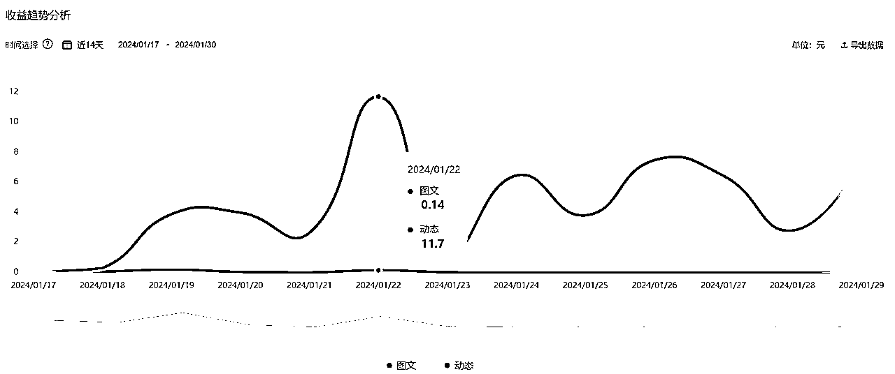

# RPA+ChatGPT+lark多维表格，实现爆文写作全流程95%自动化，每日躺赚三位数

> 来源：[https://a76muvvuzu.feishu.cn/docx/Jrr4dDvknoo9oTxrnDJc8A7AnJd](https://a76muvvuzu.feishu.cn/docx/Jrr4dDvknoo9oTxrnDJc8A7AnJd)

# 前言

大家好，我们是...，一时竟不知如何自我介绍，暂且自称卟言吧。这里是由3个20岁大三本科在读的学生组成的team，去年用各自红包钱拼凑起来加入的生财，今天是我们第一次在生财发文章。由于我当时仍处在学生思维里，面对2000多的费用犹犹豫豫，便找了两个好哥们一起平摊，而这两个哥们成了我创业路上的合伙人。在这里也许下一个承诺：哪天赚到人生第一个w时，立马给亦仁老师补回我们三个人的星球费用，尊重知识付费！

学校刚放寒假，和各自家长做好交涉后，我们三个毛头小子租了间房子，集中起来做出第一次创业尝试。由于之前并没有真正跑通过任何一个项目，这次的尝试充满了未知，抱着年轻人该有的活力，迈出了第一步。好在之前零零散散做过百家头条公众号写作、抖音图文带货等项目，权衡之后选择了当时看不上的、已经放弃的百家头条爆文写作这个方向重点探索，定的目标也相对激进：22天内，赚回房租，我们就算成功！

用时16天，正式跑通第一个小项目，结合RPA+ChatGPT+lark多维表格，实现全流程95%自动化操作，如今测试稳定后第一时间来给大家分享。按照生财惯例，先上成果。

头条：

【头条1号】-还没开首发双倍收益

【头条2号】

【头条3号】

【头条4号】

百家号：

【百家1号】

【百家2号】

【百家3号】

其中不乏一些超级爆款时常会出现。

头条:

百家:

我们目前只把手上仅有的4个手机号注册发文，一个手机号对应一个百家号和一个头条号，过年回去找家长注册铺矩阵。上面的截图也可以看出，我们正式开始日更的时间是在1月16号左右，用时两周，流量和收入基本稳定。

利用手上仅有的4个手机号，实现每日躺赚100到200+，随着粉丝权重积累，这个数值一定还会不断上升。而最关键的是全流程95%自动化操作，对副业来说是一个不错的选择，一旦铺矩阵，收益相当可观。

下面手把手详细讲解：

# 工具介绍：RPA+ChatGPT+Lark多维表格

RPA和ChatGPT就不多介绍了，生财里面已经有相当多的资料，大家都比较了解。重点来介绍一下Lark多维表格，这个工具的灵感来源是生财的AI大佬：@AI指挥家的分享。

Lark是飞书的国际版，在多维表格里已经内嵌了AI生成的功能，可以接入自己的API key，在配置中，能输入自己调试好的prompt，结合飞书独特的表格生态，最大化利用API。

这有什么特别的用处呢？重点来了！！！

通过一次下拉，100次对话同时执行，即生成100篇文章和生成1篇文章的时间相同，真正实现100倍提效！

视频演示如下：

调用API的费用我也算了下，大概每次输入输出全加起来，消耗1.5k token左右，一次性生成50篇400字左右的文章，花费1-2元人民币，相当划算。

在最开始时，我们还想着用Excel里的ChatGPT插件，但是被价格劝退了，综合起来的费用是飞书这套方案的两倍以上。此处，再次感谢@AI指挥家，分享的新思路！

Lark下载入口：https://www.larksuite.com/zh_cn

注意：只有飞书国际版才能接API，国内版还没有AI生成功能。大家感兴趣的话，后续我专门写一篇文章来全过程详细讲解Lark的注册和使用的细节，今天这篇文章重点讲爆文写作！

如果嫌API太麻烦，成本太高，我们也编写了份结合ChatGPT依次输入的RPA代码，以便于少量素材时使用。

# 深度解析：自动化全流程——全套RPA代码放在文末啦

写这篇文章之前，我在生财里几乎把RPA相关的文章都看了一遍，想看看大家都是怎么分享RPA里的细节。但看了一圈下来，好像没找到几篇把代码具体编写思路分享出来的。不管如何，说实话我们现在还没想好能用RPA变现的方式，今天这篇，我们直接把编写思路和细节分享出来，确保RPA小白也能看懂并且用上整个流程！（PS：RPA有源代码分享功能，无需懂代码，整套拿过去立马就能用）

## 总体框架如下：

## 自动化全过程视频演示如下：

RPA代码详解：

## 初始化操作

### 终止应用程序

这一步骤看似作用不大，实际上对于流程整体的稳定运行是很有帮助的。这一步骤把该关闭的网页、excel等关闭，避免后续运行出现不必要的麻烦。比如说：如果运行流程之前已经打开了谷歌网页，那么后续在打开一次谷歌网页，屏幕就会出现两个相同的网页，此时进行网页自动化的操作时，机器人无法识别到底要在哪个网页进行操作，导致报错。

### 设置变量

从程序阅读的方便性来说，会将接下来需要用到的变量设置在最前面。修改起来也十分方便。

### 打开excel和网页

因为excel打开的时候不是最大化，所以我还添加了一句鼠标点击的命令，将画面最大化，一是为了方便执行程序时的监控；二是我习惯性喜欢最大化的页面。

至此，初始化设置完成。

## 登录任意一个头条账号

### 登录哪个账号？

准备用哪个号来找素材，就登哪个号。

### 一些稳定性优化

可能第21-23行的命令看起来会有些疑惑，为什么要写这几句多余的命令？按照正常的逻辑来说这，几句命令是多余的。但是我在测试的过程中，经常出现匪夷所思的报错。后面不断测试，最终加入了这三行命令，之后就再也没有报错了。

## 打开对应网页，抓取高赞文章，同时存入excel

这一部分内容较多，属于同一个流程块，都写在一个大循环里面。

### 抓取文章数据

*   打开素材网页后，将一个判断放在一个无限循环里面，这样能实现不断的循环抓取数据，直到满足后续所有条件才跳出循环。

*   获取数据后，将所有数据存入excel，并将草稿的总行数赋值到变量“草稿数”中，方便接下来判断是否为高赞素材。

### 判断是否为高赞素材，并存入excel

本小节的细节流程图：

*   循环打开excel“初始草稿”表中的素材草稿网页

*   判断点赞数是否大于10，大于10则获取文章内容，并将文章内容存入excel的“输入表”中。小于10则跳过。

*   判断素材字数是否在400字以内，字数太多，GPT改写出来的效果不好，观众现在也不太愿意看长文，所以我们素材也不能找太长的。

*   每循环一次，就判断高赞素材数是否达标，达标则跳出循环，不达标则继续下一次循环。并且时刻在调试窗口输出信息，方便看到运行的情况。

## 利用Lark一次性批量洗稿

我们嵌套在Lark多维表格里面的prompt是非常简短的，为了节省输入的token还将prompt翻译成了英文，不搞那些花里胡哨的结构化prompt，成本为王。虽然看起来很短，但也是经过多次测试才得出来的，并且发文效果确实也还不错。在这也将调试好的prompt分享给大家。大家也可自行训练再嵌套。

prompt：Please act as master copywriter. When writing, keep the themes of the original text and use more colloquial and intense emotional expression, especially in the first sentence. Do not print anything other than the text. Output in Chinese,the word limit should be 100 words or less.

文案：

代码详解：

*   代码乍一看很多，其实就两个动作：“复制”和“粘贴”。复制excel内容，粘贴到飞书表格，等待输出完成，复制生成好的内容，粘贴到excel的“输出表”。

*   这部分其实有很多种写法，我选择最简单的控制鼠标点击的动作。经过多次测试，还是非常稳定的。

*   为了运行过程中方便观察，我还加入了一些激活窗口、点击窗口的命令。

## 将文案依次存入草稿箱

*   此时的无限循环流程是嵌套在一个循环流程里的。

*   运行整个程序之前，先将需要用的账号存到excel的一个表格中，方便后续的循环操作。

## 再次初始化

为了使程序整体形成一个闭环，我再次进行了一次初始化，确保RPA运行前后，电脑界面保持一致。

至此，爆文写作从找素材到存草稿箱，全过程实现95%自动化操作，只差最后一步：发文。

刚开始我们也想着将发文也自动化操作，但测下来，发现人工最后审核一下内容，再配张符合审美的图片，发出去流量会好很多。不然没有人工审核的话，可能GPT3.5有时不太聪明，写出些多余的内容，甚至是违规的内容，所以保险起见，最后一步人工干预一下。

# 技巧细节：避坑避雷指南

## 技巧性

有时候常规方法实在达不到想要的效果，这时就要想一下有没有别的技巧，甚至是投机取巧的办法。比如说：我一直不能通过“点击目标”这个命令获取到Lark界面的一个按钮，那么我就想着要不就直接坐标定位，让鼠标每次都点击同一个地方。最终实现的效果跟“点击目标”的效果是一样的。

## 稳定性

很多时候代码逻辑是没问题的，但是在运行的过程中却总是出现各种各样匪夷所思的问题，可能是网络卡了一下，也可能这个命令本身可能不太稳定，这时候我们就需要添加一些代码去规避这些问题。例如上面：我在登录账号这个流程中添加了“全选”、“再删除”这两个命令。

## 设置延时

善于利用延时能够解决许多问题，比如：在测试时发现网页加载的时间比较久，这时就要相应设置延时让它成功加载完后再执行后续操作。

## 调试方法

我比较喜欢的调试方式是在某些地方加入“向调试窗口输出”命令，这样能够知道运行过程中输出的内容是否正确。甚至还能判断程序是否运行到这一部分。

# 方法总结：最最最干的货

以下从账号注册到发文全过程总结，主要分为三条线执行。

一、百家头条账号注册：准备一个手机号码用来注册--注册完后人脸识别实名认证--绑定实名人银行卡后续才能提现--选定发文领域--修改主页个人信息

二、绑定API key：打开魔法工具--注册虚拟币交易和虚拟卡平台--充值USTD--充值虚拟信用卡--绑定openAI支付账户--获取API key--下载并注册Lark--打开多维表格绑定API

三、自动化执行流程：数据抓取--存档到Excel--粘贴到Lark多维表格--自动运行AI生成--粘贴到Excel--分别登录头条账号--存档到不同账号草稿箱内

# 反思复盘：我的心路历程

能赚钱就是好项目，不要看不上任何一个赛道。

去年九月份左右，当时生财里关于百家头条号这类GPT写作的精华帖不时出现，我们也选择了这个赛道去尝试。跑了一个多月，效果不算太好，也有点小结果，每个号每个月有个一百多的收入。但后面我们觉得这样用GPT机械化地写作分发学不到东西，上限太小，就停止了这个小项目，后续接连转战小红书、抖音图文带货。

直到今年寒假，我们发现头条号上线了首发双倍收益，并且流量各方面都有扶持，我们决定回归。

那天晚上，我们反思了此前的决策失误，其实百家头条写作上限并不小，倘若我们铺一下矩阵号，收入是不是就可以翻一番？倘若我们专门去研究一下平台逻辑还有用户的爱好，优化一下提示词，是不是流量又可以翻一番？倘若我们将写作全流程自动化，是不是就可以真正剩下时间来探索新赛道了？于是我们在这个寒假就集中精力做了下面的事。

简单的事情重复做，重复的事情做简单。

百家头条写作本身就是一件非常简单的事情，几乎不用动脑子，但把这件简单的事情重复做，它就不简单了，至少可以让你成为这方面的专家。

而重复的事情做简单，RPA干的就是这件事。把一切可以不需要人工干预的步骤，让RPA去执行，我们只负责最后的审核。这样一来，此前让我们苦恼的机械化步骤就全都省去了。

其实以上的每一个步骤都还有很大的优化空间，比如提示词的优化、素材收集的优化，这都是我们后续需要重点升级的地方。

集中人员，集中精力，从做好一件事开始。

我们三个人，分别在两座不同的城市读书，此前都是在线上对接，效率和状态都无法发挥出来，而现在终于可以面对面工作了。开工前一天，我们决定把之前在做的小红书、GPT相关的视频录制都暂停了，只留下了爆文写作和电商带货，每天完成第一件事再做第二件。从前的我们什么都想抓住，结果什么都没能抓牢，现在正是断舍离的时候！

# 写在最后：还想说点什么

我们三现在就读的是广东的普通二本院校，在加入生财之前，还处在学生思维里，每天为校内那些杂七杂八的事浪费精力，眼前望得到头的只有打比赛、拿奖、考研考公这些选择，从来没有想过自己在读大学时可以出来单干。

加入生财后，一切都变得不一样了。我们三开始意识到：原来赚钱有这么多方式，校内的事情真的太小了，封闭在学校里真的是慢性死亡。

去年十月份，认识了@小鹅老师 。有时我能量不足时，常常会打开朋友圈看看她发的内容，吸收他们散发出来的能量，完事立马又干劲十足了。因为看同龄人取得了成果，远比看到深耕某个赛道几十年的老兵来得激励作用更大。

也正是因为在生财里面看到很多取得成果的同龄人，为什么我们不行？说干就干，这个寒假，舍弃所有吃喝玩乐的机会，三个人聚在一起，一定得干出点成果来！

于是，我们保证不挂科的前提下，把时间精力都放在了做生财的小项目上，并且有了个共同的理念：上学是最不重要的事情！得出这个想法不是一时的脑子发热，而是深思熟虑之后的毅然决然，因为我们深知现在大学的现状，更别说是普通二本大学。

现在的普通二本的教学方案，早已落后于校外的社会发展，特别是在ChatGPT等AI工具出现以后。老师上课念念PPT，学生坐在课室里玩玩手机，一节课就过去了，期末考试全靠老师划重点或者给暗示。到头来整个大学四年，其实没几个学生心里是踏实有底的。

生财对于在校生来说，真的是一个非常利于打破学生思维的地方。如果可以的话，是否可以推出个学生优惠价。虽然现在的价格早已物超所值，但对于大部分普通学生来说可能也不是一下子就能拿得出手。而一旦有更多上进的在校生加入生财，这又是拉上了不少冉冉升起的新星了！

最后，我想用六伟老师朋友圈里看到的一句话来结尾：

如何才能链接贵人？

答：极致努力、极致利他、及时感恩、静候佳音。

# 附录：RPA源代码分享

附上生财RPA航海手册：https://search01.shengcaiyoushu.com/docx/Onl7dyK2vosOPuxVq3mcCXqtnbc