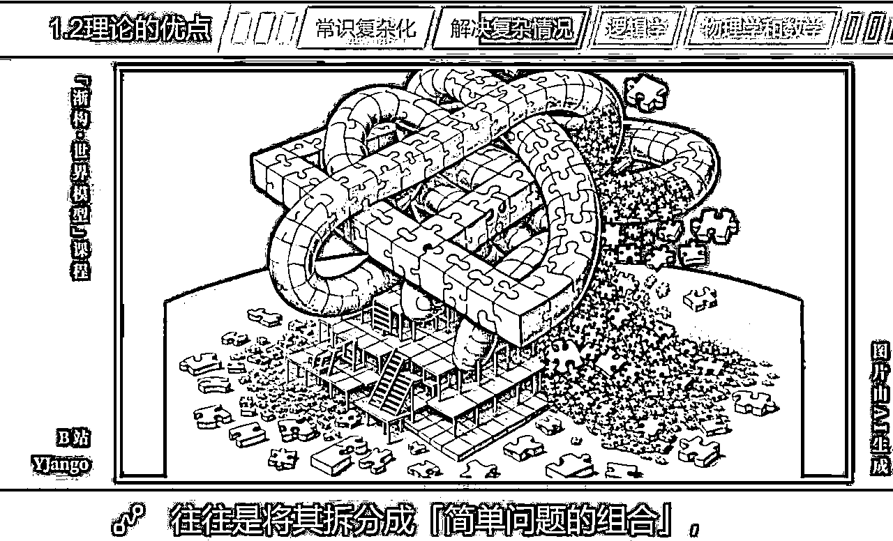
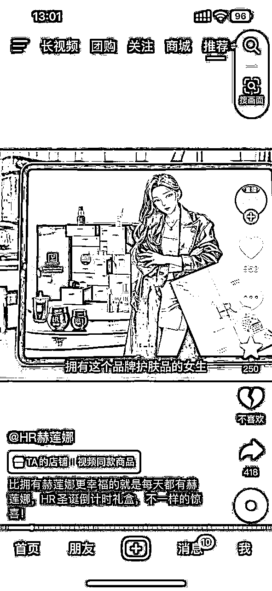
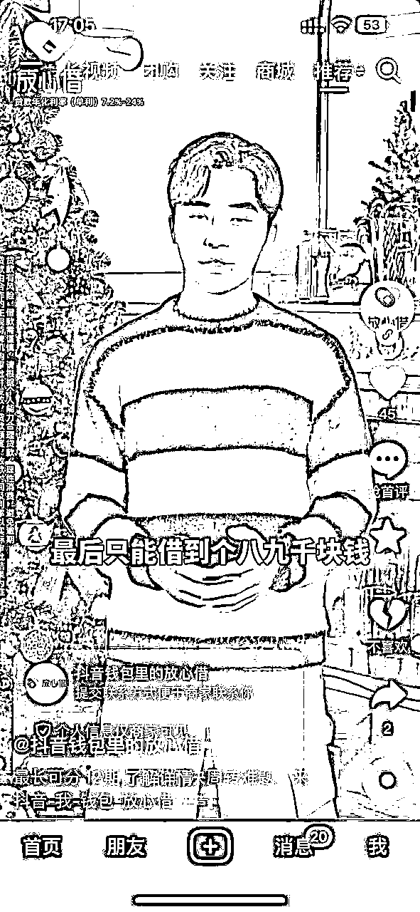
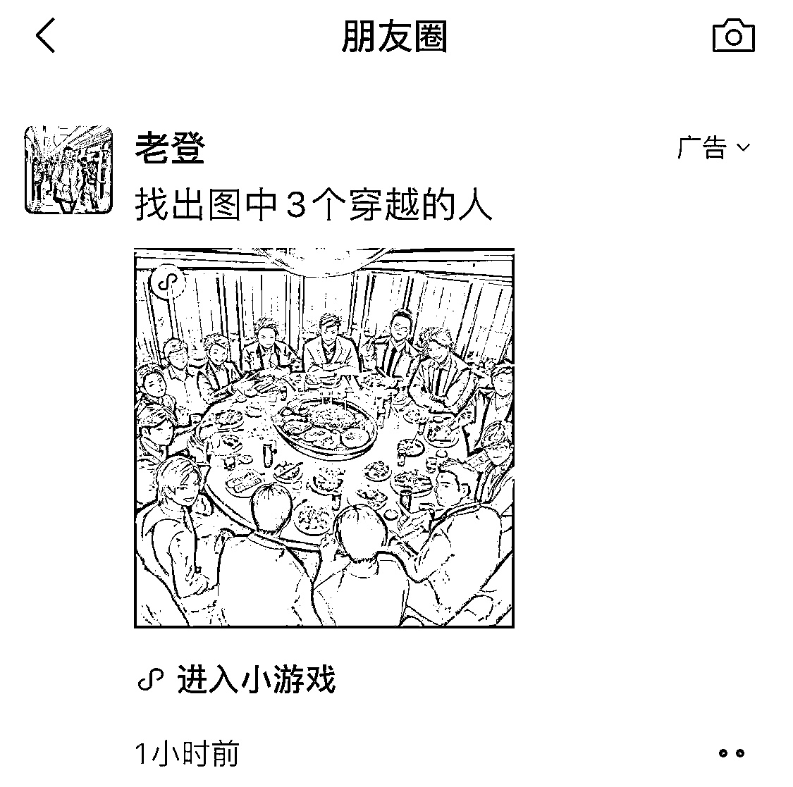

# 《AI已经火了一年了，真正属于普通人的机会在哪里？》

> 来源：[https://ry5hwpuf7b.feishu.cn/docx/KDGEdUXLUoRRLexnT9Oc3w47nMg](https://ry5hwpuf7b.feishu.cn/docx/KDGEdUXLUoRRLexnT9Oc3w47nMg)

《AI已经火了一年了，真正属于普通人的机会在哪里？》

大家好，我是吴东子

对普通人来说，AI的机会在哪里？

这是过去一年来，我收到过最多的问题

在这篇文章里，我会把我目前对AI的理解阐述出来，分享3个普通人能够把握的方向

讲清楚在现在这个时间节点，当我们在说搞AI的时候，到底是在搞什么，怎么搞

因为逐渐有越来越多人意识到，搞了那么久的AI，好像自己根本没在搞AI

一、AI行业的本质是什么？

二、AI是一个「放大器」

三、AI个体创业赚快钱

# 特注

本文写于2月1日，因AI行业发展速度很快，文中的部分说辞具有时效性

我只能保证我在此前说的话，都是我在那个时期个人所相信的话，并不能保证我那个时期思考也许有误，也不能保证此后时期各种变化，导致我的思考已经更新了，而没能触达给你

不过我相信，比起你每天都能在网上听的那些话。也许相对片面的，可能会错误的话，会对你更有启发，更有思考价值与指导意义

# 正文

这一年，AI发展飞快，每天都有各种各样的AI信息出来，各个巨头纷纷下场，AI是下一个风口也渐渐成为了大众的共识

于是每天都源源不断地有非常多人涌入这个行业，希望在AI里取得成绩

在这场狂欢的一开始，大多数人还沾沾自喜，觉得自己了解到了很多AI的信息，似乎马上就要抓住风口，实现财富自由了一样

但他们却没意识到，什么是真正的做事

半年前我有一场公开演讲《你在搞个鸡毛AI》，试图唤醒人们踏实做点事，真正在AI领域里找到自己的生态位

但就像你永远叫不醒装睡的人一样，大家还是只愿沉浸在这场狂欢里自欺欺人，不愿正视事实

到了今天，再怎么不愿正视事实也好，越来越多人都会开始意识到，再怎么狂欢，也没给自己带来结果

回头认真想想，很可笑，自己好像压根没在搞AI

我很早就说过：不要假装很努力，因为结果不会陪你演戏

绝大多数人最大的问题在于他们没意识到

对于大多数人而言，AI根本不是一个行业，而是一个工具

AI不是一个行业，而是一个工具

把工具当行业，怎么会有路呢？

什么叫AI行业，我之前也说过，只有AI的前三个层面：基础层、技术层、应用层

也就是你在企业里做芯片、传感器、人工智能算法、自然语言处理技术、无人驾驶、大语言模型，C端应用小程序APP，这些叫AI行业

对于绝大多数人来说是参与不了的，他们只是在使用这个工具

如果你觉得你有能力能参与进AI行业，那你可以选择进入AI行业里去做事

目前行业里的职位都是供不应求的，很多大厂可以轻松开出百万年薪

但如果你真去这么干了，很快会发现一个问题，人家要3年以上AI工作经验的，但你没有

怎么办？

赌！

赌三年以后AI还火，甚至更火，大家都抢着要有能力的人

这里有一个很重要的前提是，现在的结果是由过去造成的

你3年前没积累AI的相关经验，导致今天的你失去了很多选择的机会

今天的你也不积累相关经验，而是东搞搞西搞搞，那3年后的你一样没有这个机会

但如果今天的你开始积累相关经验，那至少3年后你有得选

你肯定会问：没赌到怎么办，万一过两年AI不火了怎么办？

这个问题无解，没人能给你保证未来会发生什么，这是恐惧，但也是机会

如果所有人都知道3年后AI还会火，是一个确定性的答案，那所有人都会涌进来

但就是因为多了一点那么不确定性，把绝大多数人都筛选出去了

赌与不赌，自己决定

所有行业都一样，不要再幻想找那种确定性的答案了，没有的

这里其实我也不喜欢用赌这个词，但必须事实求是，有些东西运气占比就是大的

就像风叔说的，很多中年一辈的人会懊悔

为什么自己在90年代初的时候不进华为，如果自己工号排在前10000就能怎么怎么样了

可事实是在华为做第一代交换机的时候，那时同样做交换机的公司，有1000家

在那一刻，你能不能从那1000家企业里面挑选出华为，挑出未来的任总

就算在真正合适的切入点，1000家同类公司杀到只剩下四五家的时候，剩下巨龙、大唐、中兴、华为

你也没法挑出哪个是未来的，很多人也选择了巨龙、大唐、中兴

更何况，最早期进入华为的人，到2000年附近，很多就已经离开华为了，你待不住的

这个就是实事求是地认识到是个运气占比比较大的游戏

但如果你什么都不玩，运气永远不会到你身上

所以如果有能力、有自信、且相信AI是未来、并愿意承担风险的，深耕进AI行业去，是其中一条路

第二个，AI不是一个赛道，而是一个工具

什么叫赛道，比如抖音、自媒体，这个赛道上延伸了很多项目机会

AI不是赛道，未来很成熟的时候可能会是，但目前不是

所谓的什么提示词工程师、或者最近说的GPTs，现在来说暂时还是比较扯淡的

不是完全否定，而是你得对这些东西有一个正确的认知

你非要说什么招聘平台上就有招这个岗位的呀

你要清楚，一个词的名字和词的内涵是不一样的

好好看清楚招聘平台上的提示词工程师是干什么的

绝不是招你过去写写提示词的，别这么天真了

或者你非要找几个冤大头的案例来跟我吵架是没用的

我们不是在玩辩论赛，我只是对我的想听我发表观点的读者负责

倘若你愿意独立思考的话，你不妨好好想想我说的是不是正确的

最终，我的观点是

在目前的发展下，AI不是一个行业，也不是一个赛道，而是一个工具

工具是依附于应用场景的

只有“根据应用场景找工具”，才是真正有意义的

注意，我说的不是“拿着工具找应用场景”，而是“根据应用场景找工具”

你细品这两句话的区别

千万别弄反了，AI领域里多少人就是反着来的

所以，这么多人，即便再努力，再有执行力，从起点就走错了

那怎样才叫“根据应用场景找工具”呢

分两种，一种适合自有行业人士长期发展，一种适合个体创业赚快钱

先说第一种，如果你本身有自己的职业，且这条路相对具有价值

那优先要做的就是专精于自己的优势和专业领域，不断提升自己的专业水平

因为AI相当于是「放大器」，会放大你原本的能力

你的专业水平越高，掌握的技能越多，就越能在AI的加持下，获得更大的价值

然后再在自己专业遇到的卡点问题中去想是否可能用AI来实现，落实到具体的应用场景

有具体的命题去找AI，而不是用AI找命题，这样才能真正解决问题

同时AI也会让「学习」变得容易，你学习能力越强，AI对你的帮助就会越大，并且让你和其他人拉开的差距也越来越大

也就是说，区分人和人之间的差距，也会变得很好区分

不学习的人就不会像今天一样，没那么容易看出到底有没有料了

用AI去赋能自己的行业，举几个例子吧

1.这是一个B站的百万粉知识博主，原本写好文案之后要去网上找大量的素材来配画面，还要考虑版权问题

而现在用AI根据文案出图，既能让观众更好代入，自己也能降低制作视频的成本

2.这是美妆品牌赫莲娜的抖音账号，用AI做图文内容，既能提高内容生产效率，又能降低成本

3.抖音的信息流广告，仙剑奇侠传的同人游戏，用AI处理版权问题。还有抖音自己的广告

4.朋友圈的信息流广告

5.小说平台的开屏设计

5.抖音财经博主，可能自己长相太年轻不好说服人，用AI换脸把自己变老，看起来有多年经验

6.拼多多商家用AI做产品图

7.单条视频播放百万，4条视频涨粉1.6万，自己本身有写相声的能力，但自己一个人不好演，出镜可能也演不好，于是用AI配音来赋能内容

以上只是我平时刷到了就截一下图，还有很多很多案例

而这些案例是你在网上其他博主那里看不到的，因为大多数都是在东抄抄西抄抄，讲来讲去都是那些

可实际上，AI已经开始进入很多公司的工作流，会像辐射一样一点点改变，最终只有当我们回过头时才发现，原来生活中已经有了那么多AI做的东西

核心还是建立在你本身有一个做得很好的业务，有一个自己的专业领域，这时你仍然不断保持学习AI技术，就能看到自己行业中哪些问题，哪些卡点，可以用AI来解决

这个是大家能走的第二条路，也是我最推荐的一条

接着说第二种，如果你现在是更倾向创业、副业

那要做的是找到一个项目中能被AI解决的不可能三角，并在早期进场吃到红利

我们过去有句话讲，老板眼里的员工不可能三角

能力强、忠诚、要价低

一个员工忠诚、要价还低，那能力一定很糟糕

一个员工忠诚、能力还强，那价格一定很贵

一个员工能力强、要价还低，那要么是过几天就要跳槽的，要么是商业间谍

不可能三者同时具备的，直到AI技术出现重大突破

AI就是可以同时满足这三点，能力强、忠诚、要价低

回到什么叫AI行业？你去帮忙设计打造这样一款“能力强、忠诚、要价低”的AI产品，才叫在AI行业里面玩

你如果明确知道自己不是这款的料，那就不要管打造

而是用别人打造好的AI工具去找到目前已有的应用场景，用这个AI工具去解决

比如因为公众号开放流量主收益和公域入口的早期，平台就需要大量的吸引人注意力的内容

根本不管你质量怎样，总之有人看就给你推进流量池，这时候AI下场，很多人一波就赚到了百万级的收益

从最早的卖GPT账号，到什么AI头像定制，神图头像号，然后宝宝四维彩超，艺术二维码定制，AI赛博机车，妙鸭相机，有大项目，也有小项目

而以后，这样的项目只会越来越多，价值越来越大

目前基本每一个技术到了相对成熟的时候，都会有一大波机会，比如马上可以进入应用阶段的AI音频，太多套利的机会了

之前因为市场里没有新一轮叙事，所以去年随着资本、巨头纷纷进场，互联网上因为AI的趋势，迎来了十几年未曾见过的崭新局面

AI的技术发展得飞快，很短的时间内就迭代了不知道多少个版本

也因为这些技术进步得很多可以开始落地实用了，所以越来越多应用场景浮现出来

所以谁能越快地挖掘出这些应用场景，越快下场实干，谁就能吃到那波供需不平衡的红利

但同样的，我不会只给你吹某一种方式，而是会把利弊放在你面前，给你来选择

选择追风口的这种方式也会有弊端，当越来越多人看到这个信息差的时候，供需就会趋于平衡

因为核心技术不在自己手里，如果这个资源又不是自己独有的，那就无法形成护城河，没法做到有壁垒

所以通常来说这样的项目，就非常明确不是用来长期做的，赚一波就去找下一波

但未来真正长期的项目本就越来越少了，大多项目都会以更快的速度去迭代

如果自己是执行力很强，有很好的项目判断能力和信息渠道足够快速的人，倒也是一个路子

这个是第三条路子，我的看法是可以走，但如果你不是项目型人才，还是不要沉迷，多积累才是王道

# 总结

如果你真的笃信AI是未来，想办法让自己能够进入AI行业的头部企业，是一条最稳最正道的路子

反之，就不要把AI当作行业、不要当作赛道去看，而是当成工具去看

最终根据自己的情况选择是用AI提高自己的长期价值，还是用AI来吃红利

我用一个词来总结AI对普通人的作用就是——可能性

在稳定的社会环境中，上升渠道是比较有限且逐渐收窄的，资源会向金字塔顶聚集。

随着贫富差距加大，阶层之间的鸿沟越来越难跨越，留给底层人才的机会越来越少

但在乱世，由于山头林立、各路人马都求才若渴，各种出身的人才都有更多的机会施展才华。数量众多的底层草根人才更容易被发掘出来

而随着AI的发展，一定会带来这一段「混乱期」

旧的工作被加速、优化、替代，但新的行业还没有发展起来，就会有一波非常混乱的时期，会很多人受到影响

但这个时期，也是一波从中找到需求和机会，让自己获益的时期

只有事实求是，耐心沉淀，不断积累与成长才是能笑到最后的