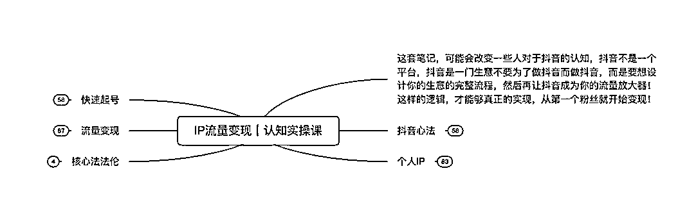

# 【靠流量变现思维4年做到月营业额200w+的心得】

> 来源：[https://x45ngm9a0z.feishu.cn/docx/KQeud45tLouyrCxSJvIcCOhHnXc](https://x45ngm9a0z.feishu.cn/docx/KQeud45tLouyrCxSJvIcCOhHnXc)

【靠流量变现思维4年做到月营业额200w+的心得】

哈喽，大家好～我是子凡，一个山东的95后短视频从业者，踩准短视频红利从大学毕业一路做到月业绩200w，加入生财一年的时间，参加了行舟老师的抖音老板IP航海，航海结束后汇总了群内成员的问题，结合自己4年的短视频运营思维整理了以下笔记，就在这里给入局抖音后没有方向的同学点帮助，希望给大家带来一些新的思路。

按照「道-法-术-器」的模型，此篇内容主要是围绕着「IP流量变现」“道”的内容。基本涵盖「IP流量变现」从0到1所有认知问题。今后有时间我再给大家整理关于“术”的内容。懂得做事的底层逻辑，那做起事情来讲简单一万倍，了解清楚方向再去努力，方向不对努力全费。

适用对象：

抖音运营小白，完成从0到1的认知框架，有整个体系的支撑，避免弯路。

已经入局抖音的老板，一心停留在“术”的层面，没有大方面的突破

*   这套笔记，可能会改变一些人对于抖音的认知，抖音不是一个平台，抖音是一门生意不要为了做抖音而做抖音，而是要想设计你的生意的完整流程，然后再让抖音成为你的流量放大器！这样的逻辑，才能够真正的实现，从第一个粉丝就开始变现！

# 抖音心法

*   规则

*   抖音的算法核心：彩票机制

*   有的视频第一次发爆，有的第二次爆，如果还不爆，换个账号试一下

*   如果你感觉自己的内容很好，但是数据不好，那就换个账号

*   抖音绝对是有权重的，所以一定要养号

*   抖音100%需要优质账号，最好是活跃的老号

*   三个月以上，正常使用的老号和权重很高

*   任何平台都是有隐性降权的

*   定位

*   想做一件事情，但就是犹豫不做，两个原因

*   把事情想复杂了

*   不知道这件事能赚多少钱

*   按百万级粉丝账号规划-一地鸡毛

*   按十万级账号规划，快速起号，行动起来

*   小目标先干了再说

*   模式

*   知道什么能做，什么不能做，从第一个粉丝开始变现

*   你会先装修门店再决定卖什么吗？先决定卖什么，再去操作

*   抖音的核心指标就是变现，其他指标都是p

*   粉丝没有价值，粉丝属性才有价值

*   百万级别的剧情号你还能刷到几个？

*   十几万粉呼呼卖货的账号你知道几个？

*   同行调研

*   结果不是思考出来的，而是调研出来的

*   不要思考，直接把同行做的好的拿过来

*   定位：你要做的每一件事，同行都已经给你答案了，去调研分析

*   如果没有同行，那就别做

*   不要问怎么做，把你要做的事情再调研一遍

*   调研模板

*   核心指标：简单、赚钱

*   行业里面找细分，分析为什么赚钱

*   行业背景

*   行业变现

*   账号、粉丝量、变现方式、引流方法、变现预估

*   抖音成功案例

*   变现模式

*   拍摄方式

*   操作难度

*   利润预估

*   打电话，加微信，看朋友圈

*   询问内容及价格，列产品明细和价格

*   询问每次数量，预估单月利润

*   爆款架构

*   选题

*   前3s

*   核心论点

*   营销文案架构

*   行业热词

*   巨量算数等

*   拆解同行

*   明确你想要的人群

*   近期公域账号数据表现

*   评论区导向、营销反馈

*   私域数据

*   核心三大框架

*   粉丝框架

*   产品框架

*   人设框架

# 个人IP

*   为什么要做个人IP？

*   什么好卖？

*   卖人

*   当用户认识了你这个人，你卖什么都好卖

*   可靠供应商

*   企业个人化

*   个人企业化

*   卖产品

*   注：卖人更容易，IP是有故事的，产品是无属性的

*   产品没有差异化，但人有！

*   做IP，就是卖人设

*   当你达到一个量级的时候，总有瞎子喜欢你

*   获客成本低

*   回报周期长

*   没有其他机会

*   抖音是时代的机遇，风口大于一切

*   超深度的软文营销

*   广度

*   提高知名度

*   跳出行业限制，产生更多业务拓展可能

*   深度

*   建立信任度

*   当你有10w粉丝时，用户根本不管你是不是有5w平工厂，是不是行业头部，只靠IP的流量就具备了超额的背书效应

*   速度

*   传播效率高

*   高度

*   人设属性强

*   降低风险 产生复利效应

*   持续营销

*   增加销量

*   风险及门槛

*   需要差异化，建立属于自己的IP

*   存在风险，个人IP和企业绑定

*   竞争激烈，对手多、耐心磨

*   见效慢，做抖音IP需要时间-长期主义

*   有门槛，有可变现产品，有交付能力

*   内容

*   身份定位

*   简介

*   人设标签

*   没有身份可以编，含蓄一点

*   定位加身份

*   你是谁

*   你有什么可以拿出手的

*   你能为粉丝分享什么干货

*   slogan

*   人设置顶视频

*   强营销

*   用户对你的付费程度，来自于对你的身份认可

*   炫耀自己的成绩，依然是目前立人设最好的方法，没有之一

*   视频内容

*   情绪不要太平稳

*   声音清楚是底线

*   文案全靠借鉴

*   选题：知乎、热点、围绕身份扒

*   内容：做切片，简单高效，数量打败质量

*   切记不要太复杂

*   时间堆积

*   三个月

*   什么是好文案？

*   前三秒+选题占80%

*   选题是让系统和人性认定你的视频了，前三秒是系统和人性进一步确认了你的视频。

*   前缀+文案结尾+后缀

*   心锚词

*   由一句话想到一个人

*   后缀是精准的变现指令

*   怎么磨出好文案？

*   选题：80%以上，前期要宽泛

*   找到10个以上的同行，90%的选题就能搞定

*   不要碎片化的去做，一定是在某个时问段集中干一件事情，才会有结果

*   好文案：前三秒，有深度，有冲突

*   正常的文案架构：前缀+造次＋强引导+文案结果+后缀（身份＋价值)

*   slogan+后缀（身份+引导关注）

*   slogan：引发联想

*   怎么打造铁粉：造词

*   账号内容架构

*   日常内容

*   涨粉内容

*   变现内容

*   做流量，做个人IP，起号做泛粉，在泛粉里筛选精准用户

*   展示成果，才会更容易找到精准客户

*   高客单，高利润，适合做抖音

*   起号做得太垂直，不容易起号！

# 快速起号

*   落地五部曲

*   意识

*   用户意识

*   算法意识

*   对标意识

*   复盘意识

*   方法论

*   实现办法

*   抖音变现

*   短视频创作方法论

*   直播间停留方法论

*   行动

*   执行力

*   写

*   演

*   拍

*   剪

*   复盘

*   结果：最快速度拿到正反馈

*   数据总结：根据结果结合数据，进行复盘

*   账号策划

*   同等内容看类型

*   同等类型看选题

*   同等选题看结构

*   同等结构写剪拍

*   核心王道唯人心

*   账号定位

*   你的行业赛道里面找到抖音的蓝海内容，而不是去抄别人的红海内容

*   要有跨界思维，不要受限制，用互联网思维

*   新模式的方法来打老业态，用创造力的团队去打新的老业态

*   定位定江山

*   定位精准，同时要考虑人群阶段

*   定位问题

*   A、定位人群是不是最大人群

*   B、品本身是不是刚需

*   C、产品后端有没有衔接

*   D、流量基数大小

*   人群要精准，还要考虑人群现在的阶段

*   同样的产品，定量不同，人群不同，反馈不同

*   比如，都是创业者，有的刚入行，有的已经被市场教育过，还有的已经有了一定的结果！你到底要的是哪一类人

*   所以虽然定位了行业，定位了内容，但是还要从你想要的精准用户需求出发，他们喜欢听什么，你才讲什么，终极目的是变现

*   根据产品延伸出来很多相关话题，一定要筛选那些可以吸引精准用户，且符合平台规则的话题，作为内容输出和直播内容

*   把离变现最近的内容挖出来

*   爆款内容设计

*   把同行爆款逻辑总结梳理下来，然后优化，结合，梳理一套属于自己的爆款逻辑

*   强变现，就要有强价值输出，而不能只有情绪价值

*   情绪价值：故事性，流量点

*   用情绪价值把流量放大，再用价值输出变现

*   直播间起号

*   真诚才是现在直播最大的套路

*   最好的营销就是自己：

*   1、视频泛一点，人群定位精准了就可以

*   2、直播间人货场高度统一

*   3、直播间要真实

*   4、信任是最强大的法宝

*   增加进入率，才会有推流

*   内容+人货场，增加进入率

*   比如：减脂成功就是你的IP，减肥过程就是你的故事

# 流量变现

*   变现的8个环节

*   1、设计变现模型

*   引流产品，爆款产品，盈利产品

*   2、分析同行案例

*   粉丝框架，产品框架，人设框架

*   公域数据表现，评论区导向、营销反馈，私域数据

*   3、确定拍摄形式

*   A、口播

*   B、应用场景

*   C、客户体验，反馈

*   D、炫：正面形象，和我的客户拿到了什么结果

*   4、巧用场景打造变现

*   A、办公室

*   B、服务场景

*   C、应用场景

*   D、未来场景

*   高手懂得卖未来，卖未来的视频变现超级好

*   5、团队搭建

*   6、孵化模式

*   形成一个可循环的系统

*   7、矩阵打法，把成功的复制十遍

*   8、seo

*   私域运营

*   1、建立人设，打造IP，足够极致且稀缺

*   功能属性：你的人设能为用户提供什么价值

*   性格属性：你是一个什么样的人

*   2、精准引流到私域

*   不精准的人会增加你的运营成本

*   门店：路过就要加进来

*   电商：小卡片，打电话

*   内容：通过内容吸引私域

*   3、存量找增量

*   通过分销，拼团，分享有礼，榨取用户剩余价值

*   4、内容营销，朋友圈

*   图片：场景图，朋友圈的核心，不是硬广有多硬，而是软广有多硬

*   10条朋友圈

*   4条产品咨询

*   2条成交截图：晒单不叫炫富

*   2条用户反馈：使用前后对比

*   2条生活场景：生活中也有产品植入

*   私域转化

*   1、朋友圈有对话感的内容，有针对性的发布内容

*   2、私域直播：针对老粉，分享价值

*   3、社群转化，用社交氛围来做产品转化

*   4、门店转化，私域种草，吸引到店里来

*   短视频制作

*   把合适的内容，推送给合适的人

*   目标共识，找到你目标客户的痛点，用你最自信的状态，说最正确的废话，让核心用户持续停留

*   热门算法就会破圈，推送给没有那个标签的人群来看

*   协同算法：你喜欢，和你有相同爱好的人，可能也会喜欢

*   选题

*   选题来自于市场，内容来自于生活

*   选题：泛选题，人设选题，专业选题

*   结构：完播引导，爆点前置，反智型，价值后置，揭秘型

*   拍摄技巧

*   你面前的不是镜头，而是粉丝和用户

# 短视频平台机制

*   矩阵机制

*   一个账号可能是用十个号跑出来的，跑赢概率和运气

*   规则大于技术

*   当你多一个账号的时候，你的账号推送给的不是一批人

*   用新账号推送老账号的爆款内容

*   账号到达一定粉丝量之后，粉丝涨不动了，视频流量也不行了

*   抖音涨粉是有瓶颈的，也有快速涨粉期的

*   所以做大号，还不如多做几个小号

*   矩阵操作细则

*   不要连wifi，买流量卡

*   一样的视频翻拍几遍

*   用最简单的方式去拍摄

*   10w-30w粉的时候，流量最好

*   标签机制

*   你说什么，就会吸引什么样的粉丝

*   你要想清楚你的视频要发给谁看

*   他们有什么需求，他们喜欢听什-么

*   说他们爱听的话

*   然后通过反馈数据，调整账号标签

*   投流打法

*   投小V，去挖小V的粉丝

*   找到这个行业的上下游账号去投流

*   冠军作品投流贴标签

*   粉丝经济

*   养号

*   你的标签，是由用户决定的

*   去你的对标的爆火视频热评

*   去你的对标直播间骗粉，刷一个小时榜一，让对标喊一波关注

*   富人起号——大V互捧，推流

*   你只要给用户提供停留，他就会给你提供流量

# 核心法法论

*   扒同行，你的同行在做什么

*   深扒最牛逼的10个同行

*   深度研究竞争对手

*   原动力来源于你必须清楚，做一件事情的时候，清晰的知道自己在做什么事，能赚多少钱。

最后给大家两句自己这四年的感悟。

财富,是抄来的,穷,也是抄来的。一个人赚不到钱,或许你模仿的人本身就不对。

一切从结果上来看，结果以外的东西我都不相信

踩风口比什么都重要，任何一个行业在风口期是有大量的溢价的，这个社会已经给我们论证过了，btc、微商、电商，早期就是捡钱，同样的操作方式，风口大于一切。

做离钱最近的事情。