# 《视频号红包封面涨粉3000+玩法详解》

> 来源：[https://mw1ctv1p4w.feishu.cn/docx/KgO2d1VTQouJQaxC6WocCkOgnw9](https://mw1ctv1p4w.feishu.cn/docx/KgO2d1VTQouJQaxC6WocCkOgnw9)

大家好，我是无岸。

首先来个自我介绍

【微信昵称】无岸

【所在地区】宁波

【自我介绍】

90后超级奶爸/阿猫觉醒合伙人/老徐八年合伙人/老马十年合伙人/封号斗罗

1⃣公众号单日涨粉1w人，变现五位数

2⃣新号从零开始，依靠红包封面涨粉3000，重回万粉博主

3⃣视频号单个作品播放量破900w，新晋万粉博主

4️⃣0基础运营知识星球3个月，成为知识星球官方推荐星主

5️⃣问一问半个月点赞3w+，涨粉6000+，日入四位数，累计答题曝光破200w

【提供资源】

1⃣引流变现案例库小报童

2⃣无岸2024陪伴群

3⃣无岸三年私教合伙人

上个月视频号官方发布了一批2023优秀创作者，然后赠予了数量不等的红包封面免费额度，我有幸也获得了一部分。

虽然我的大号在2023年的播放量超过900w，但不知道什么原因，没有获得额度，反而是我的小号得到了900个红包封面。

我的小号利用这900个红包封面额度，在两个星期的时间里，单日涨粉2000，顺便还让公众号被动涨粉近400。

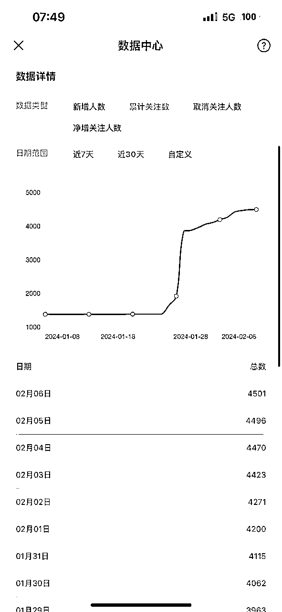

# 一、如何制作并领取红包封面

## 1、获得红包封面额度

只要是在2023年发布过视频，在不违规的情况下，都能获得红包封面额度。

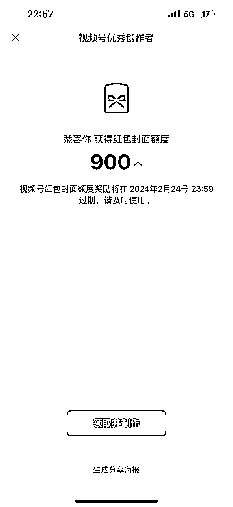

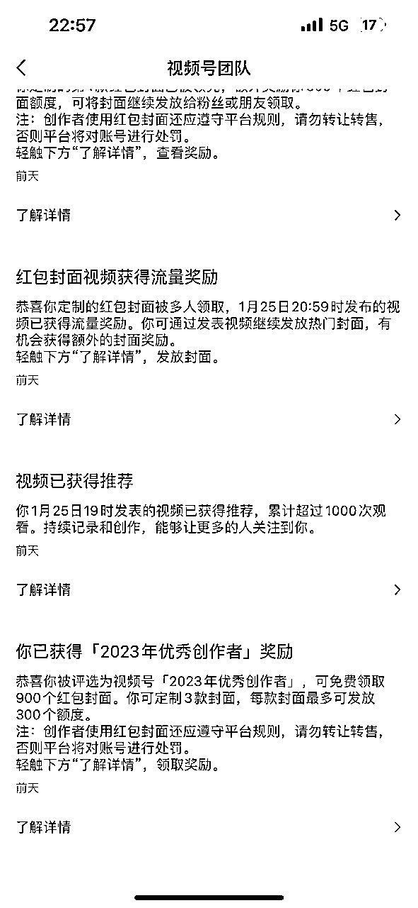

根据系统送我的900个免费红包封面额度，我可以做3款红包封面，每款定额300个

## 2、制作红包封面

### 2.1 筹备期

因为此次视频号极大降低红包封面的制作门槛，只需要上传图片或视频即可，不需要像公众号那样需要各种证明。

因此，我在考虑用热门话题。我先想到了前一段时间刚刚放完的电视剧《繁花》。

做了第一款，虽然播放量是起来了，但涨粉并不多。

于是，我在视频号里搜了下李莲花，发现流量很好，并且我只发现了一款红包封面，说明潜力很大！

这里我补充说明，由于互联网上女粉的价值比男粉大，所以我们优先寻找未婚、颜值高、人气高、口碑好且有爆剧傍身的男演员。

### 2.2 制作过程

我首先需要找到无水印的李莲花图片，然后我想到了公众号，直接在公众号里搜索李莲花图片，并且无水印。

另一种方法比较繁琐，但适用范围更广。可以先去小红书搜索相关图片，然后复制笔记链接，再去微信里去水印的小程序，粘贴链接，便可以得到无水印的图片啦！

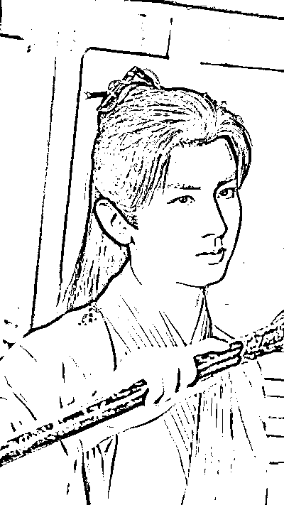

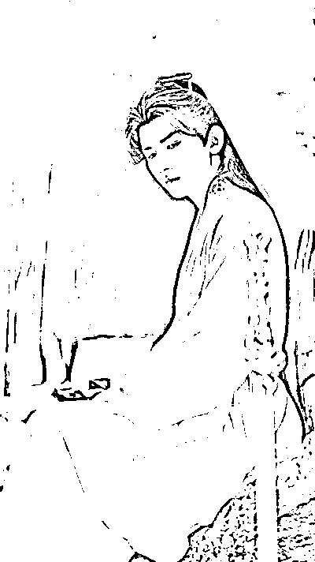

光有图片也不行，必须要有热门bgm

只要音乐响起，观众情绪马上到位！

我先把三张图片导入剪映：

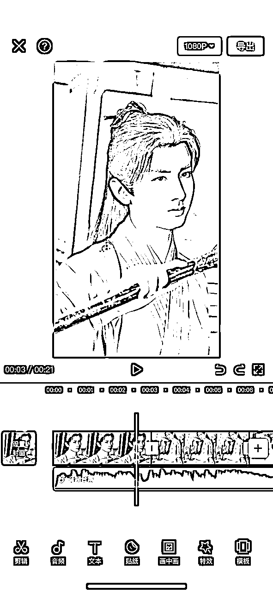

然后在音频里搜索《莲花楼》片尾曲《人世太匆忙》

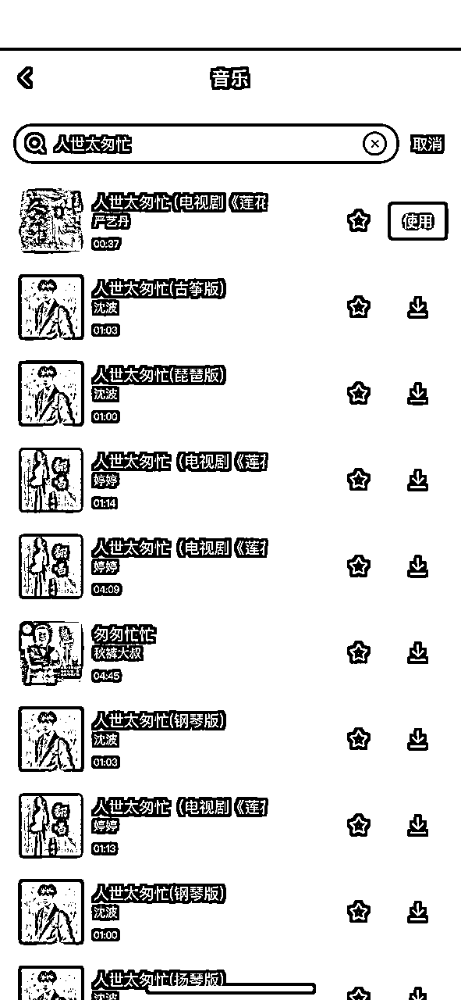

我使用了原唱版本。

可是只有三张图片，而没有任何动画效果，又太单调。于是，我使用了剪映vip专用的动画效果。

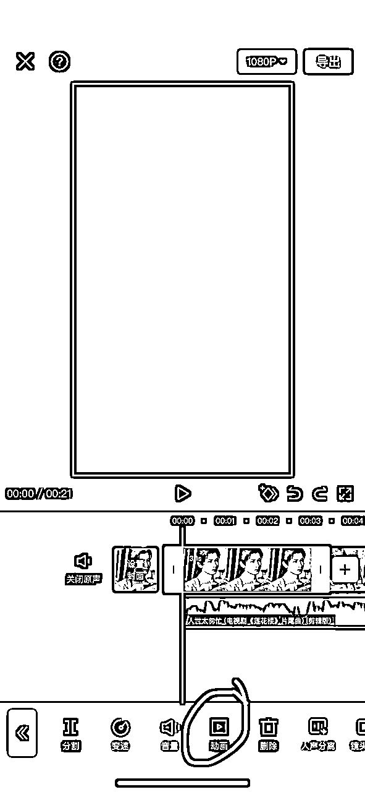

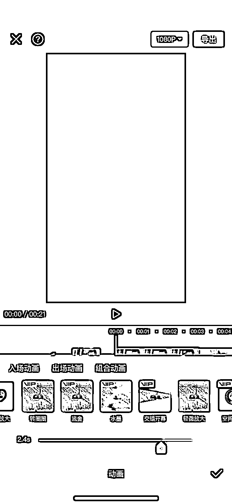

三张图片都是用了不同的动画效果。

接着我再考虑时长。

片尾曲37秒，但精华部分在前面二十几秒，三张图片加起来才9秒。怎么办呢？

我干脆把图片又复制了一遍，有另外用了三种不同的动画效果。然后把多余的音频裁掉。

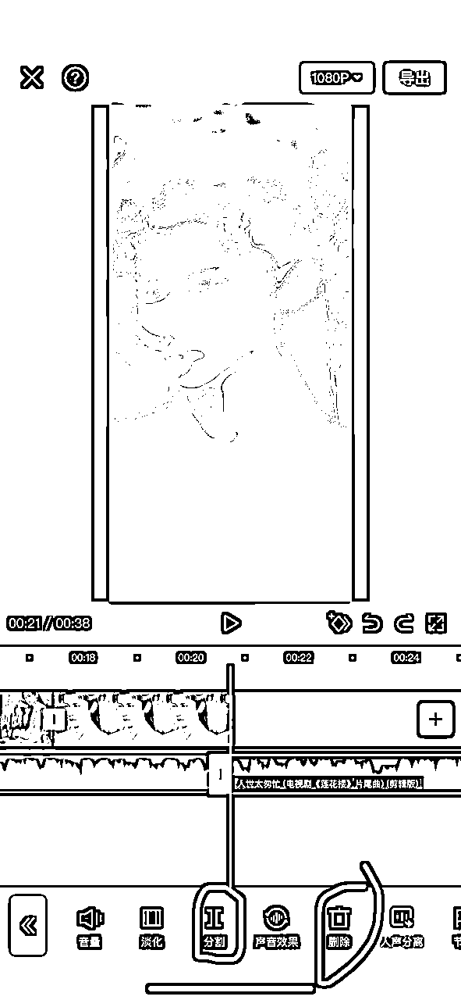

设置好封面，就可以导出啦！

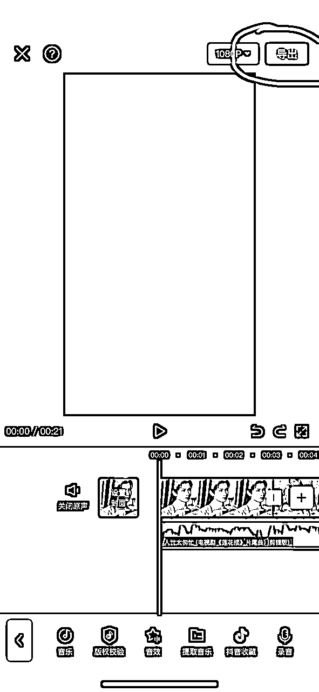

## 3、红包封面相关设置

我们还是回到视频号的优质创作者这里

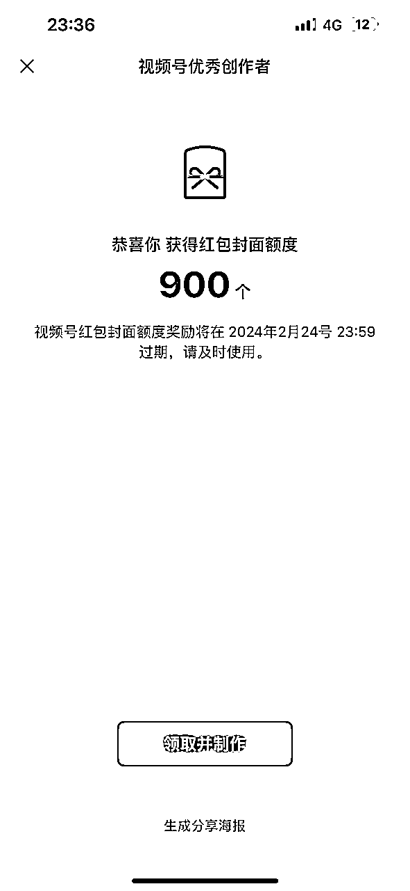

点击领取并制作

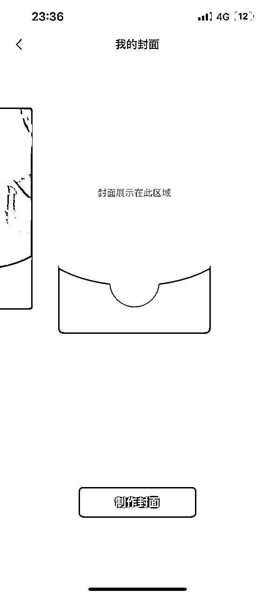

点击制作封面

这时候会让你选择新视频还是视频号里的视频

我们选择新视频，选择刚刚编辑好的李莲花。

会出现这样的发表画面。

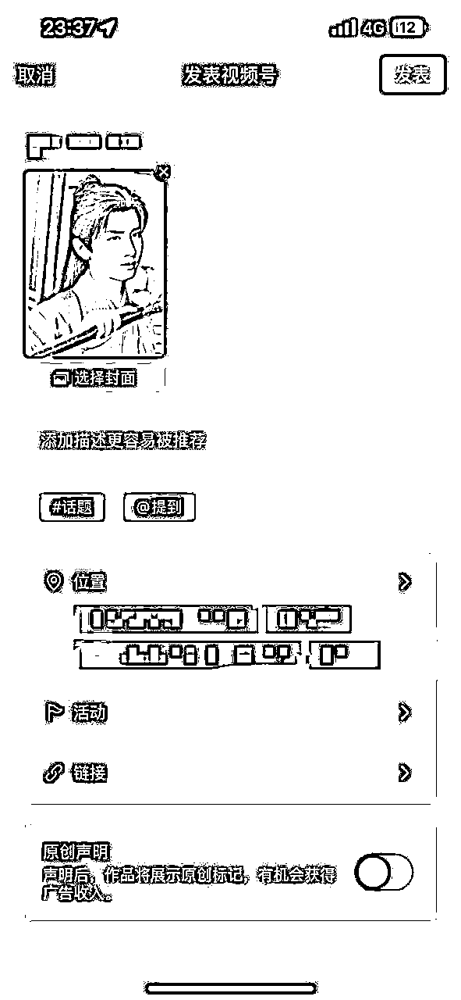

我们要在描述中写上文案，还有你要添加的话题，比如红包封面、李莲花、莲花楼、成毅等等。

为了防止别人搬运你的视频，这里的原创一定要选。

确认无误后，点击右上角发表。

发表结束后，再回到红包封面制作界面，由于我这里已经做好了，直接看别人的图

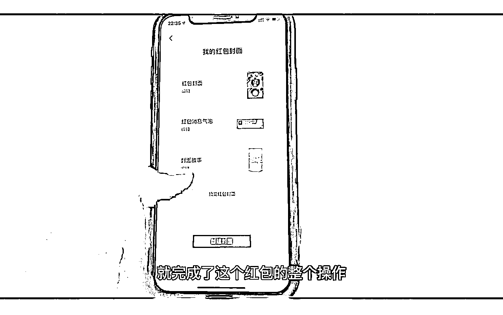

官方会让我调整，在结束以后，还有一次修改机会。

红包封面的发放有两种方式：

1、对于已经发表的视频，直接要发放的视频。红包封面的领取直接出现在视频的左下角。

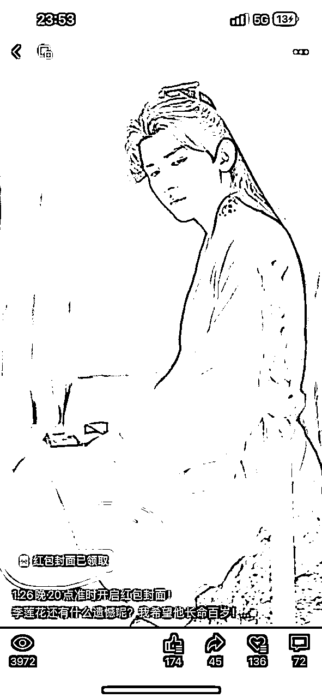

2、发放给还未发表的视频，可以生成红包封面链接，复制到下图

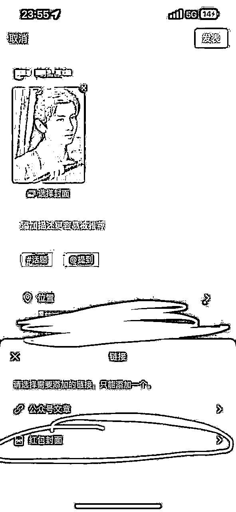

这样在视频发表后，红包封面领取按钮直接出现在视频左下角。

## 4、如何领取红包封面

我认为有主动和被动的领取办法。

先讲主动的。

一开始官方不是发了红包封面的额度吗？

在视频作品左下角的红包封面没被领完之前，用户都可以在这里领到红包封面。一但额度用完，自然也就无法再领取。

被动领。

此次视频号官方开创性的发明，只要用户点赞、推荐和关注视频号，视频号博主都可以通过谢谢，回赠红包封面。

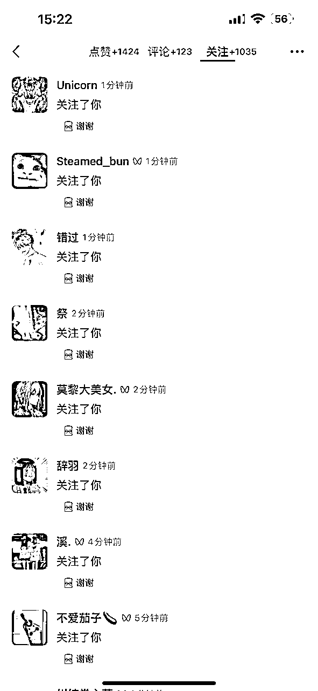

但这里有个条件，就是微信一定要更新到最新版本。

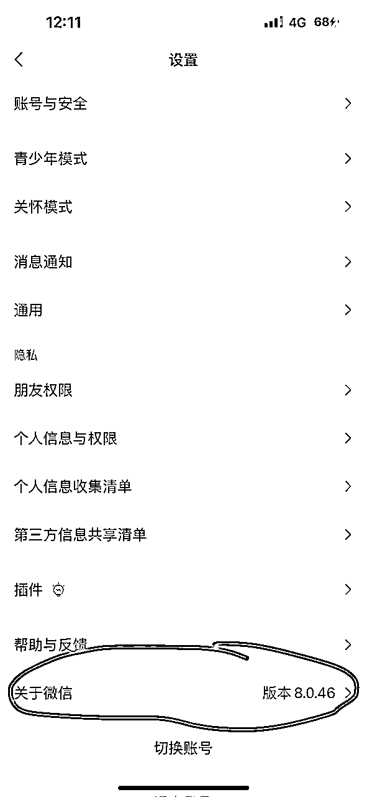

领取的地方在视频号界面的消息里。

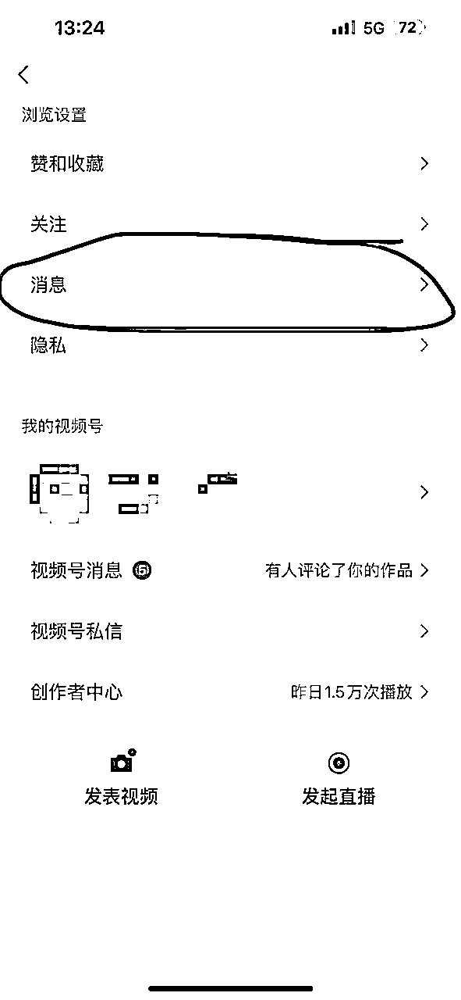

# 二、视频号如何引流

视频号如何引流私域？

首先给大家看我的视频号主页，方便叙述

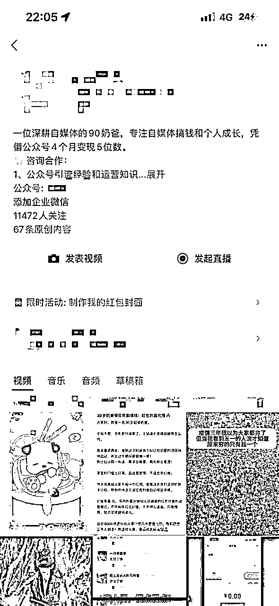

视频号的引流方法有这几个

1、简介

当简介大于三行的时候，其余的会被折叠。也就是说，如果你想留微信号，最好在前三行。当然，如果你想引流其他账号，也可以艾特你的其余账号名称。

2、公众号

如果你的视频号绑定了公众号，那可太完美了。只要看过你主页的网友，如果是对你视频号感兴趣，那么他也会去你公众号逛逛

3、添加企业微信

如果是开通了企业微信的小伙伴，可以把视频号和企业微信绑定。网友可以直接添加你企业微信的好友，与你聊天。

4、内容描述区

也就是说你在发表视频的时候，其实是可以艾特其他账号的，但不要出现“点赞、推荐、转发、评论和关注”字眼

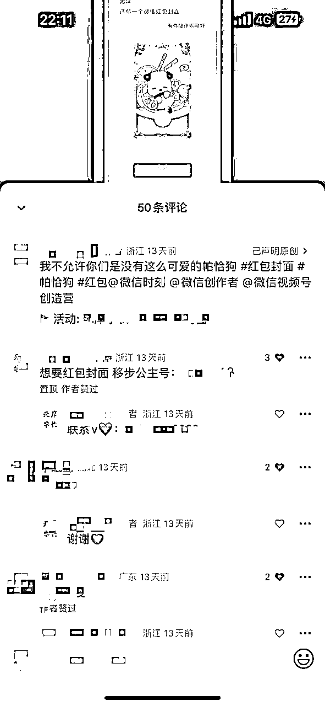

5、评论区

评论区不可以留自己的微信号、公众号，即使你留了，别人也看不到，谐音也不行。

但据我的观察，如果你说公主号，后面再加上自己的公众号名称，系统是无法识别删除的。

比如上面图片里，我的公众号名称就被网友们大量搜索。

6、私聊

在评论区不要主动让网友私聊你，除非是你在回复别人评论的时候。这时候你就可以去私聊界面，引导用户加你微信。

# 三、视频号如何避免违规

## 1、违规情况

1.1有很多人喜欢在视频号评论区发微信号和公众号，但很遗憾这几个字都被系统屏蔽了。意味着只有你自己看得到，除你以外的人是看不到的。

1.2最好不要在评论区写让粉丝私信你，我没试过，因为很多人会没完没了地问，纯属浪费时间。

1.3如果单个视频被判定违规减少推荐，可以选择不用管，但最好是隐藏起来。之后发作品的时候不要发生类似事情就可以。

1.4作品封面和文案区域不要出现点赞、关注、推荐字眼，没人举报没问题，被人举报就是100%中招！

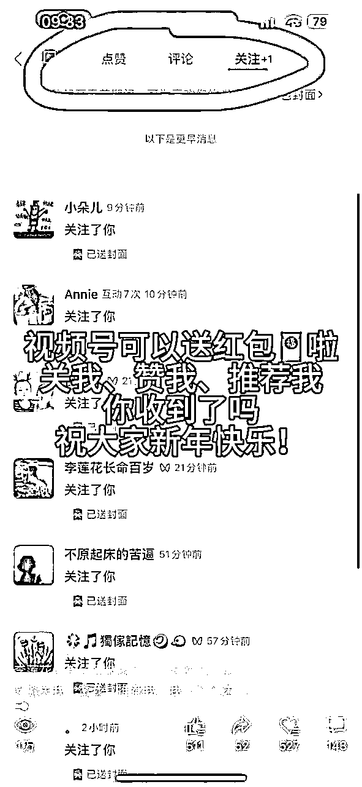

像这样就被人举报成功了。

## 2、账号解除违规

给大家看一下，我最近大号的情况。

大家可以看到我现在账号是正常的，但昨天以前我的账号是被减少推荐的。

对此我在视频号中找到了答案：

要连续上传10条真人、原创且是同一人的视频，并且去找官方申诉，才有可能恢复正常。

之前有博主说可以拍10条风景，可惜现在已经行不通了。

首先我连续上传了10条我儿子的视频，为了避免搞乱标签，我什么也不写。

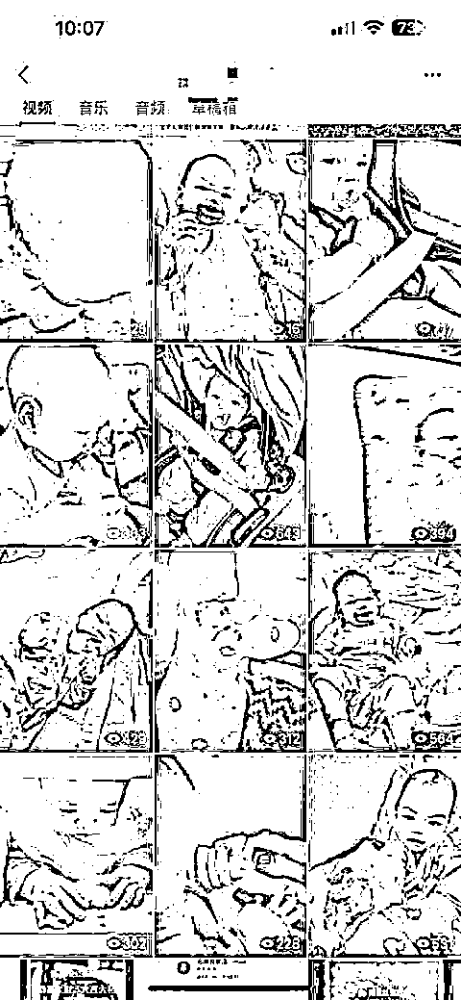

然后我去找申诉入口：

一般情况下，申诉入口在这里，点击加热工具

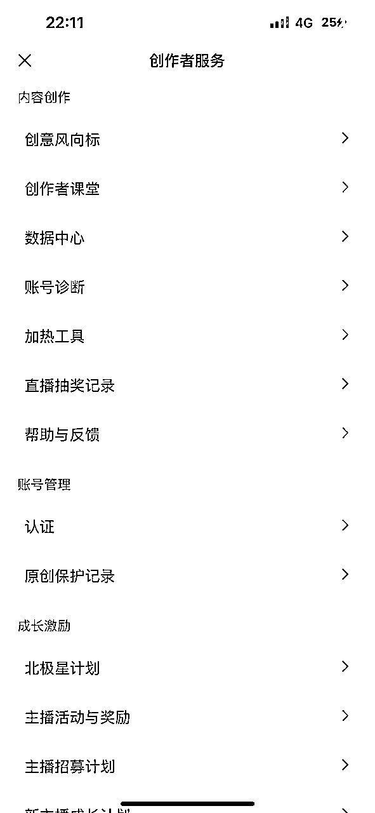

会看到视频不可加热

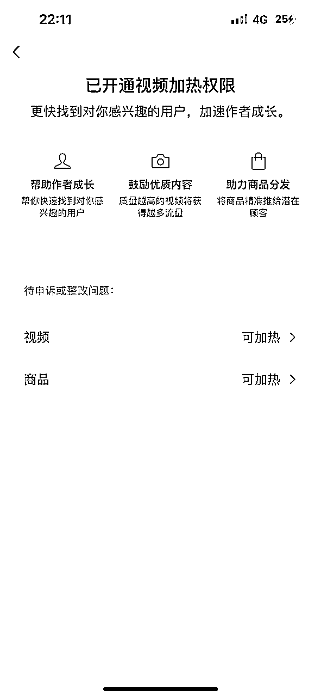

在视频处点击 不可加热，进行申诉。

申诉内容就说：我已按照官方要求发布了10条真人原创视频，申请恢复加热权限。

然后在证明材料出上传自己的作品截图和相册截图，证明确实是自己拍的。

官方说7个工作日内会回复，实际上我第二天就收到恢复正常的通知了。

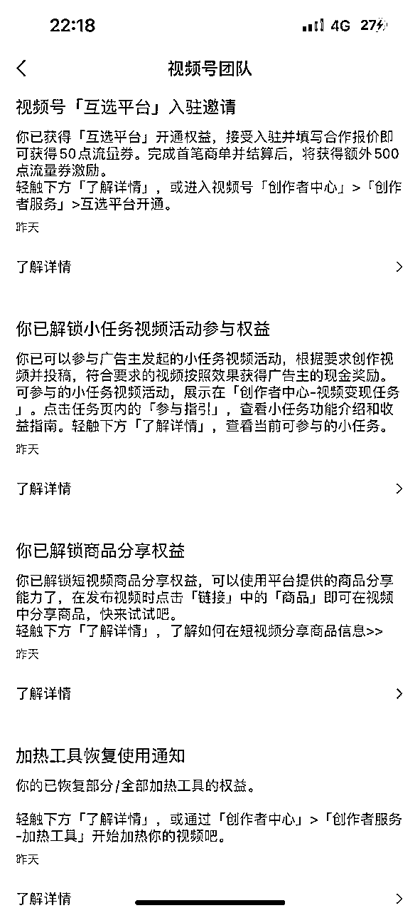

昨天我的小号也违规了，账号被减少推荐7天。

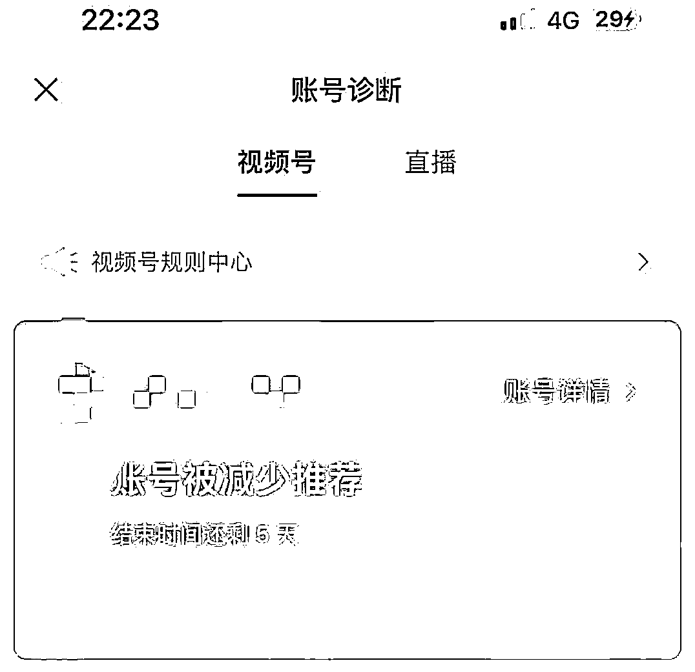

很明显，我的小号被人举报了，多个视频被减少推荐。

只能等待限制时间到期，别无他法。

现在最新消息，微信更新到8047版本，人人都可以使用视频号做红包封面，只是红包封面的免费额度有点小，只有30个，每款红包封面10个。

并且没有系统推流与回赠功能。

好了，就分享到这里吧，想要李莲花红包封面欢迎链接，祝大家新年快乐！