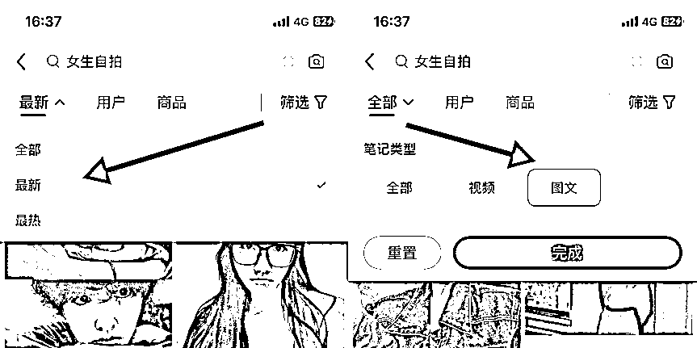

# 人人可复制的小红书无门槛项目

> 来源：[https://lw03aeuj0n.feishu.cn/docx/KnmtdkRDDo23uLxQqmBcWiqanEf](https://lw03aeuj0n.feishu.cn/docx/KnmtdkRDDo23uLxQqmBcWiqanEf)

大家好，我叫艾小飞

新的一年来了，最近很多圈友也开始焦虑了，对于赚钱的欲望和需求也高涨了

特别是看着身边朋友都赚的比自己还多，心里不是滋味，开始怀疑自己到底是哪里出了问题！

不是你哪里出了问题，而是你缺少了赚钱的机会，如果你能早点发现机会，也不比身边人差到哪去！

看到这个问题，所以今天我将给大家带来一篇《人人可复制的小红书无门槛项目》文章

希望你看完后，能抓住这次机会，打通思路，把执行力拉满，赚点钱过年

好，废话也不多说了，接下来我们看看，这个项目难不难？该如何赚钱？多久能赚到钱？能赚多少钱？有什么要求？能持续赚多久？

你好奇的问题，都会在文章分享中，给到你解答

# 项目介绍

## 产品和模式是什么？

我也不卖什么关子了，这个项目就是在小红书上卖脐橙，通过小红书发帖和转化，把意向客户引导到微信或闲鱼成交

他付款后，你再去拼多多下单，低买高卖，从中赚取差价

这就是小红书私域无货源项目的模式玩法

## 这项目有哪些优缺点？

先来说说优点吧

优点是无成本，无门槛，只要有小红书号就能玩，而且小红书用户质量高，开单非常快。对于新人来说很吃香

但缺点也很明显，在小红书引流有很大被限流或封号的风险。

我们测试出来的，基本上每个号的生命周期在5~7天。也就说账号在5~7天，又要重新的注销再注册。这个是比较麻烦的。

总之，优点很有吸引力，但缺点也很明显，要想赚到钱，是需要承受点代价的

## 开店卖货和私域成交有什么区别？

可能你会问，那我在小红书上开店不就好了吗？为啥搞那么麻烦？

对的，在小红书上开店确实减少了被封号的风险

但伴随而来的，是开店需要交1000块的保证金，需要提前垫资15天的货款，至少要5000元以上

还必须要有货源渠道，要不你在小红书上发拼多多的货，是行不通的，一发就冻结30天

另外，发布笔记挂带货商品的，会比不挂带货商品的笔记多两项数据考核

如果不达标到同行水平，反而会降权或限流

还有发货和售后的问题，我就不举例了

总之你想在小红书上开店去做这个产品，不单单是需要财力支持，还需要运营能力支持。还需要货源渠道支持

对新人来说，简直是难上加难

相反走私域成交的模式就香多了

不用你垫货款，客户微信打款你再去下单，相当于空手套白狼

不用你去发货，只要你下单后去复制拼多多的物流单号给客户就行了

也不用你做售后，客户有啥问题直接甩给拼多多的商家让他解决

更不用你交押金，只要有微信号就行，自己赚钱自己花。

这就是开店和私域成交的区别

这个项目有哪些操作流程？

如何快速起号？

如何发帖引流？

如何转化客户？

如何成交客户？

如何找到货源？

如何处理售后？

好，接下来就以自身操盘项目的角度，来给你们分享我是如何跑通从0-1的？这过程将会有哪些技巧？需要注意什么细节？

# 项目有哪些操作流程？

操作流程简单一句话概括就是：

在小红书上引流和转化客户，把他们引到微信上，复制闲鱼的链接给客户下单，下单后我们在拼多多下单，拼多多发货后复制单号到闲鱼订单上，客户收到货后就交易完成了

这其中低买高卖的差额，就是我们所赚到的利润

小红书引流/转化→微信承接→闲鱼下单→拼多多进货→闲鱼发货→交易完成

虽然一段话讲清了整个流程，但这里面的细节点是非常多的，细节也将会决定了你这个项目能玩多久，能赚多少钱

好，接下来你就要按照我给你的步骤，一步步的去执行，去照抄！缺少了其中某个环节，都有可能影响你赚钱的效率

# 起号前的硬件准备

## 1.一台手机

手机分为两种，一种是安卓，一种是苹果

安卓手机型号要求在近5年内生产的时间，不要过于老款

要不没办法使用最新的小红书版本功能，同时也将会受到笔记流量隐型限制的影响

苹果手机型号要求在7P以上，跟安卓机同理，老款手机型号，会受到很多的影响

这是手机的基本要求

## 2.两个微信号

一个是你主号，一个是卖货的小号

如果你不想弄那么麻烦，一个号也可以操作，只不过会麻烦一点

要同时扮演两种角色和来回切换账号

如果你刚注册微信小号，要提前设置好一个简短又好记的微信号

跟大家说个冷知识，你微信号的长短和难易程度，会影响客户是否想加你微信的欲望

如果你是客户，面对这两个微信号，如果给你手动添加，你会选择加谁的

A商家

ABC123

B商家

xks_jdi283987053

我们测试出来的，A类型的加微率比B类型的要高出10倍

记住，除非你的产品是茅台，去卖9.9元，哪怕你微信号再长再复杂，人家都会想办法加上的

但我们卖的是脐橙，肯定没有那么大的吸引力，要想客户简单的加上你，那就要设置简单的微信号，方便他们加微信

到时候你可以先检查看看自己的微信号，是否很长，可以修改下

我之前为了起个好的微信号，花了大半天专门去测试各种微信号靓号，发现很多号都被抢注了

但我也找出了几个还没注册的靓号，目前还是空的！有时间可以去抢

BB3636

PL2580

GEI397

A6980A

XIANG525

HU98765

QI965QI

## 3.一个小红书新号

注册小红书新号时，尽量不要用虚拟号去注册，有违规和限流的风险！也不要去登录WiFi，尽量用流量去操作

操作时不用刻意去养号的，只要你的手机设备没有严重的历史违规记录，注册的新号都会有流量奖励的，这个不用担心

# 起号前的软件准备

## 朋友圈打造

朋友圈相当于用户初次认识你的名片，第一印象很重要

因为信任，所以会影响成交

如果你朋友圈啥也没有，信任度肯定会大打折扣的，这点懒不得

### 1、怎么找朋友圈素材

朋友圈不用自己去原创的，会很累，我一般都是抄人家的

用小号加一批的同行，把他们的朋友圈素材全都复制粘贴到我的号上，这样能省出很多的时间

怎么找？

我是用抖音搜索关键词，比如“脐橙”“赣南脐橙”，然后模拟用户去评论区留言“怎么买”“怎么下单”

大概1-2小时后就会有同行回复你的信息，你就模拟真实顾客去加到同行的微信

两个小时就能加20个了，在这20个同行里，你去看看他们的朋友圈都是怎么发的，有哪些素材是你看了都想下单的，那种才是好素材！

### 2、如何发朋友圈

这个本来我觉得没必要说的，但后面想想，我之前教过的徒弟，很多连朋友圈都不懂怎么发，我觉得不想给你们在这种细节上踩坑，也来跟你们讲讲发朋友圈的细节点吧

①、标签管理

首先是朋友圈的标签管理

你要单独创建一个客户标签，发的朋友圈，仅限给他们看就行了

没必要去打扰到微信里其他的好友，这样也看得到出，你标签里人数的变化，方便后期统计数据

②、设置朋友圈为仅三天可见

为啥？

人家客户加你微信，你朋友圈近期频繁的更新脐橙素材，但看到一个月前的朋友圈，都是与脐橙无关的素材

你让人家客户咋想？

人家会误以为：你是不是最近才开始卖脐橙的？你是不是二道贩子？不会是骗子吧？

你看看，要是客户有这种想法的，你是很难跟他交易的，刚说了，信任会影响你的成交率

为了避免这种情况的发生，最好就是设置仅三天可见，每天更新朋友圈脐橙素材就行了

③、朋友圈发布次数和类型

每天发朋友圈3~5条就行了，别刷屏，3条脐橙相关的，2条生活相关的，每条相隔2~3小时发一次就行了

# 起号前的基础信息

当你朋友圈和小红书弄好后，下一步就开始布局小红书新号的基础信息了

基础信息包括头像、名称、简介和背景图

先说下，我们卖产品，一般都是用女生的身份来做的

在小红书上女生的人设会更受欢迎一点，下单率也会更高一点

所以一切都是以女生的口吻，来设计账号人设

## 1.怎么设计账号头像

我们做的人设是女生形象，那头像也要求是女生

所以我们可以到小红书上，“借用”人家小姐姐的自拍照来用下

怎么找？

搜索关键词“女生自拍”，选择最新→图文

找个像大学生，颜值高，有气质又阳光的女生自拍照，截图成1:1的正方形，作为你的账号头像

尽量不要找那种动漫卡通的，风景的，缺少真实感

在这我发几张图你们做个参考

## 2.如何起账号名称

这个简单，你照抄我的这个模板修改就行了

我的账号名字叫:脐橙小x姐姐

你就改中间的那个字

比如

脐橙小雪姐姐

脐橙小彤姐姐

脐橙小玲姐姐

有模板在，随便怎么改都行的，这个不难的

## 3.如何编辑简介

你知道简介意味着什么吗？

意味着用户认为你是个什么样的人，打算用什么身份，来诉说你卖脐橙的这件事

我给自己设定的人设是“果农的女儿”，单单是这点，还不够有吸引力，我还加了一个身份：大学生

当时考虑到正宗的脐橙都是在赣南那边地区，而我作为一个广西人，人家一看账号ip定位，就知道我是冒牌的了

怎么解决呢？

我就再加上一道身份：在广西读大学的果农女儿

于是我的简介，就写成了这样

不单单人设要立住，你还要给人家关注你的理由

我给人家关注的理由是：我就是源头果农，没有中间商赚差价

这样就可以吸引很多想追求性价比的人群关注我了，下单率也会更高

你们可以照抄我的模板去修改，把城市改成你的城市，这样又可以节省很多时间了

## 4.如何找背景图

这个就很简单了，背景图的要求不是很高，只要给用户一看，你确实像是个果农的就没问题了

可以在小红书搜索：果园，点击图片，找几张好看的图片裁剪，在编辑资料的背景图那，上传上去就搞定了

# 起号前的素材准备

关于素材，这个也是很多人最头疼的问题，因为素材能直接决定了你是否卖得好的最大原因

我带的徒弟，在没出单之前，每一条笔记我都会提供封面和标题

但在这教程里，我就没办法照顾得到那么多位圈友了，不过我会把最详细的教程分享给你们，你们可以花些时间去找找，也是一样的

## 1.封面素材怎么找

封面，我们都知道很重要，是决定了小红书笔记80%的流量来源，这个要是找到合适了，订单会出得很快

我是怎么找的？

我一般会先去看看同行的封面是怎么做的

我去搜索关键词“脐橙”“赣南脐橙”，发现大部分同行的封面展示，主要都是以挂在树上为主的

刷了这种封面10分钟后，有种莫名的视觉疲劳感，感觉很腻，没有什么吸引力

我在想，封面要以什么样的核心点，才能吸引到客户想下单？

当时我心里也没有答案，就跑去问我对象：如果你想买脐橙，下单的理由是什么？

她说：好吃、便宜、甜

ok，提炼出关键词：好吃、甜！

那如何在封面上去体现这种感觉出来？

我想到的是，要不我去找一些切开的脐橙图片，显得有饱满多汁的，试试看这样能不能吸引人进来看

确定了封面的核心点以后呢，那封面去哪里找呢？

总不能去买回来实拍吧

这样的成本很高，也很浪费时间

我继续去搜“赣南脐橙吐槽”，看看评论区有没有人晒图的，我去收集点素材回来

没想到还真挺多的，然后我把符合“多汁”的封面都截图收集到相册，然后再用美图秀秀做二创放在便签里存着

不单单是找封面，我连内页也都一起收集来了，多张图同时发，效果肯定会更好

## 2.标题文案怎么找

刚说的封面会直接影响笔记的流量来源，而标题也一样，两个是互相打配合的，缺一不可

怎么找？

继续搜索“脐橙”“赣南脐橙”关键词

把以商家口吻写的标题，我全都复制下来，不过这个环节是最累人的，耗时也是最长的，我就不展示出来了

为了让你们看完这篇去实操就能开单，把我测试过出单率高的标题，都公开贡献给你们了

以下的标题，你们稍微修改下个别字或价格，就可以继续用了

出单率很高，小红书的用户很吃这套文案的

## 3.正文模板怎么找

其实这个路径也是一样的

搜索“脐橙”“赣南脐橙”关键词，然后去参考同行的爆款笔记，他们是怎么写的，都复制下来，再优化成你的文案

记住，不要去抄很正式，很严肃的那种文案，也不要去抄干货知识的文案，那种没用

比如：脐橙怎么剥，脐橙如何榨汁，脐橙有什么营养

要是发这种文案，吸引来的人都是问你干货知识的

记住，我们是来卖脐橙的，不是来科普脐橙的！两种消费人群是不一样的！

我给你们个案例参考

下面的两篇文案，如果你是客户，你更愿意想咨询哪家购买脐橙？

我们都做过测试了，实话说，B文案的创作结构，下单率更高！

A文案在小红书上太严肃和干货了，有人看，但没人咨询你下单，这就是区别

# 发布笔记的细节点

当所有前面的步骤都准备好了后，这时候终于可以发布笔记了！

但在编辑笔记时，有三个关键点要注意：

1.不要打开wifi

2.不要打开定位

3.不要保存相册

ok，发布完成后，流量是慢慢逐渐上升的，只要小眼睛是在100+的，都属于账号正常

如果小眼睛低于10的，说明你账号本身有问题，需要重新注销再注册，如果流量还是不行，要么是手机设备有问题，要么是网络有问题

刚开始发布第一篇笔记的时候，流量都不会太高的，要想清楚，我们这是引流贴，不是娱乐贴

平台是不会给商业引流笔记过多流量扶持的，除非你能给平台带来某些价值，就像我这篇家具引流笔记这样，给了价值，才能“飞”得更高

当你按照我的素材模板发布第一篇笔记后，大概15分钟内会有人给你留言：“怎么买”，“怎么下单”

这时候要该怎么回复他们呢？

这就说到转化的环节了

# 如何在平台转化客户

转化环节分为评论区引导+私信转化，这两个是互相配合的关系，缺一不可

## 1.评论区引导

先来说说评论区

当有人来评论，说明他是认可你的价格或产品的，这时候就不用过多的介绍产品了

先想办法用话术把人从评论区引导到私信去做转化

如何引导？

你可以复制这段话过去：“后台踢踢我，给你发今天的价格表看看”

这样他本人看到了，要是真有意向下单，会主动私信咨询你的，也能间接的筛选掉低质量客户，为自己省点时间

其次，也能让后面看到此条留言的用户，要是有意向下单，也能主动的私信找你

一来能为自己省时间精力，二来能引起蝴蝶效应，被动坐等接客

为什么不要在评论区转化呢？

因为同行或小人太多，见不得别人好的人更多，我们这是商业引流贴

为了防止被人恶意举报，降低封号率，最好就是通过引导到私信的方式去转化

这样能筛选精准客户的同时，还能避免被人抓到把柄

## 2.私信转化

当引导客户主动私信找你后，下一个动作，就是要学会筛选了

不是别人一问你：“怎么买”

你就回：加我微信xxxx

别人不小心点个举报，账号就GG了

正确的方法是，应该多发些简单的话术去筛选下，他是否是同行，他是否有意向购买，他对价格是否能接受

如果你能感受得到他是真心想买的，再做下一步的引导动作

这样加到你微信的人，下单率高，还能保护微信不被人恶意举报，虽然流程有点麻烦，但这种防范意识最好要有

# 如何在微信成交客户

当你转化客户加你微信后，你要尽快的同意通过，然后这时候可以说上一句：姐妹，请问是要买脐橙的吗？

用这句话先试探他是否现在有下单的想法，还是先再观望看看

如果他想现在下单，你可以给他两种选择，一个是闲鱼链接下单，一个是微信转红包下单，问他要怎么选

为什么要加上这个步骤？

因为用户刚从小红书上跟你聊没几分钟，信任度是很低的，刚也说了，信任度是决定你下单率的原因

为了缓解他对你的信任度低，你可以主动的提出可以第三方平台交易，也可以微信转账交易，看他怎么选

这样他心里也不会有压力，担心你是骗子什么的

如果他要选闲鱼下单，你就去闲鱼编辑个链接，设置好价格发送给他下单

他付款后，你就去拼多多下单，复制单号到闲鱼上

钱款15天默认自动收货，钱款就到你支付宝上了

如果他直接转账给你，那说明他是信任你的，这样你也不用提前垫资货款了

你收款后就去拼多多下单，复制单号发微信给他就行了

这个成交的环节很重要，要给他自己去选择付款方式，你不要替他选

如果他说，我过几天再买，咋办？

这时候你就要提高警惕了，要么是同行，要么别有用意

你可以留意他朋友圈有什么内容，判别是否是同行，如果是，立马删

如果他朋友圈是正常的，或者是把你屏蔽的，每隔2~3天，你就主动发促单话术给他

如果连续发了两三次他都还不下单的，这种人留来干嘛，删了吧

在我认知里，不成交的客户，留来没用，别想着以后靠朋友圈内容去感化他们

不如你多花点心思再去引流一批人来成交，效率更高更快

# 如何找货源下单

我们玩的是私域无货源模式，那找货源最好的平台是1688和拼多多

各说他们的优缺点吧

1688，货源质量比较好，服务和售后也好，但价格高，品类少，不包邮

拼多多呢，品质差！虚假宣传重！发促单短信！但平台售后好，品类选择多，最主要是，价格超低！

两种一对比，如果走的是高客单高质量的品，建议走1688，如果走的是低客单的品，还是拼多多牛逼

我这卖脐橙的客单价，也就几十块钱，为了追求利润最大化和平台售后好，当然选择拼多多了，虽然他垃圾，但他很便宜！很多人是又爱又恨的

可能你会问，那为什么不能直接去找线下的果商谈呢？

这里就会面临一个货量的问题

人家会问你：老板，你要多少的量？

你怎么回？

大家都知道拿货越多，拿价越低

对于我们这种初次量少的小卖家来说，你开始只要一点点的量，人家不可能给你多低价格的，说不定比拼多多的价格还高！

既然要从拼多多上找货源比较合适我们，那货源从哪找呢

为了节省你们的时间，在这我给你们分享我最近常光顾的几家拼多多店铺链接，我都是从他们那进货下单的

商家1

https://mobile.yangkeduo.com/goods2.html?refer_share_id=opXiFxWHhNsv6bib8lUrNnCwSASUsDEC&refer_share_channel=copy_link&_oak_share_detail_id=3927883217&_oc_trace_mark=199&pxq_secret_key=GZVBA5H2Q5HBUXUNNYKRWEZ5LA6H6PEQ54VPZUSMDAPRIPV2GF2Q&_oak_share_time=1704429161&_wvx=10&_wv=41729&share_uin=6C3OJELGPUJJYRBUTHRCEHXPOU_GEXDA&_x_query=%E8%B5%A3%E5%8D%97%E8%84%90%E6%A9%99&page_from=23&refer_share_uin=6C3OJELGPUJJYRBUTHRCEHXPOU_GEXDA&goods_id=568118525582&_oak_share_snapshot_num=1060&_x_org=2

商家2

https://mobile.yangkeduo.com/goods.html?refer_share_id=GDtMclGmnuGjvI1haE4BdZU2judixtYx&refer_share_channel=copy_link&_oak_share_detail_id=0&_oc_trace_mark=199&pxq_secret_key=GZVBA5H2Q5HBUXUNNYKRWEZ5LDGMPTEFUFPWFYVA6WL5Y6CKHD7Q&_oak_share_time=1704429225&_wvx=10&_wv=41729&share_uin=6C3OJELGPUJJYRBUTHRCEHXPOU_GEXDA&_x_query=%E8%B5%A3%E5%8D%97%E8%84%90%E6%A9%99&page_from=23&refer_share_uin=6C3OJELGPUJJYRBUTHRCEHXPOU_GEXDA&goods_id=572115001623&_oak_share_snapshot_num=380&_x_org=2

商家3

https://mobile.yangkeduo.com/goods2.html?refer_share_id=lth9r8rxxcdzLmNhc1toFMca8LjcpvHx&refer_share_channel=copy_link&_oak_share_detail_id=3918088463&_oc_trace_mark=199&pxq_secret_key=GZVBA5H2Q5HBUXUNNYKRWEZ5LAWPZPRPIQVSCIFGW4B7NUWFPMMA&_oak_share_time=1704429239&_wvx=10&_wv=41729&share_uin=6C3OJELGPUJJYRBUTHRCEHXPOU_GEXDA&_x_query=%E8%B5%A3%E5%8D%97%E8%84%90%E6%A9%99&page_from=23&refer_share_uin=6C3OJELGPUJJYRBUTHRCEHXPOU_GEXDA&goods_id=571117171854&_oak_share_snapshot_num=652&_x_org=2

商家4

https://mobile.yangkeduo.com/goods1.html?refer_share_id=A51WNqBLdVyCvYwi2qEBH1KWBW3ux4T7&refer_share_channel=copy_link&_oak_share_detail_id=3934328563&_oc_trace_mark=199&pxq_secret_key=GZVBA5H2Q5HBUXUNNYKRWEZ5LBCFSH2IXXAKRCY5UZXIZJ37F77Q&_oak_share_time=1704429379&_wvx=10&_wv=41729&share_uin=6C3OJELGPUJJYRBUTHRCEHXPOU_GEXDA&_x_query=%E8%B5%A3%E5%8D%97%E8%84%90%E6%A9%99&page_from=23&refer_share_uin=6C3OJELGPUJJYRBUTHRCEHXPOU_GEXDA&goods_id=572314737563&_oak_share_snapshot_num=588&_x_org=2

商家5

https://mobile.yangkeduo.com/goods2.html?refer_share_id=aCA6p0rbCi4fKhpfGj5MKzMilF3PGH5o&refer_share_channel=copy_link&_oak_share_detail_id=3783055869&_oc_trace_mark=199&pxq_secret_key=GZVBA5H2Q5HBUXUNNYKRWEZ5LC6653CTFPEECZACANQ66SOMLEDA&_oak_share_time=1704429406&_wvx=10&_wv=41729&share_uin=6C3OJELGPUJJYRBUTHRCEHXPOU_GEXDA&_x_query=%E8%B5%A3%E5%8D%97%E8%84%90%E6%A9%99&page_from=23&refer_share_uin=6C3OJELGPUJJYRBUTHRCEHXPOU_GEXDA&goods_id=560439424179&_oak_share_snapshot_num=1279&_x_org=2

如果你们有订单后，直接去任意一家下单就行了

但他们每隔几天价格都会有微浮动，如果涨跌幅度超过20%，那你也要跟着涨跌，价格最好要同步

# 遇到售后问题如何解决

在拼多多下单发货，难免会遇到些售后的问题

比如水果坏了怎么办？不够称怎么办？不好吃怎么办？

这都是很正常的问题，也是很容易解决的事

如何解决？

我处理的办法是，当客户来向我抱怨时，我就复制他的文字过去给拼多多商家，看他怎么回

如果他愿意赔付，我也复制商家的话术过去，给客户赔付

在这个环节，我就是“中间人”，客户怎么发，我就复制过去给商家，商家怎么回，我就复制过去给客户

这样的话，就不用我再去思考，如何去处理麻烦的客户问题了

在我这，相当于0售后，是不是很简单对吧

# 最后想对你说

## 项目本身，不值钱

虽然这篇分享讲的是如何做项目去赚钱，其实值钱的，不是项目本身

你们知道这个项目真正有价值的地方是什么吗？

产品？利润？还是起号？

其实都不是，而是项目的模式！

可能常看我文章的朋友都有点了解，我之前在写残蟹无货源项目文章时，用的也是这个模式

而那个项目在最高峰时，给我每天带来3000块的纯利润！

你想想，为什么我换了一个不同的产品，不同的定价，不同的消费人群，还是能跑的起来呢？

就在于操作项目的模式上！

如果今天这个脐橙产品过季了，或因为市场竞争没办法卖了，那你怎么办？不做了？还是另想出路？

其实你可以借用这模式的核心，拿去套在你想卖的产品上，这样既能节省很多的精力和成本，跑通起来也会更快

如果不懂要找什么产品，正好前段时间我在研究过年要卖什么时

就看到小红书这款卖726元的滋补品礼盒装，销售了474单

我去拼多多搜同款，看看进货价是多少？搜了一看，把我吓了一跳，相似的产品进货才97.8元

疯狂啊！纯利润有多少？

726-97.8＝628.2元

一单赚大几百，你说疯不疯狂！

如果你借着我这套模式去复制照抄做这个产品，哪怕你基础能力再差，一天开个一单，你觉得自己有没有把握做得到？

这就是项目模式的价值所在！

项目本身不重要，重要的是如何套用模式去赚更多的钱

有了这个模式拿去小红书做任何的产品，都能解决你赚钱慢，赚钱难的问题！

现在市场不缺好产品，好项目，缺的是你要用什么好的成功模式去跑通它！这才是关键点

希望你看完我这篇分享后，能用行动把流程和模式给跑通做起来，先出单赚点小钱给自己正反馈和自信心了，那往后你赚的钱也会越来越多！

好了，今天的分享就到这了，我叫艾小飞

希望圈友今年越赚越多，也祝你们越做越大！圈友们，下期再见！

原创：艾小飞

转载可私信

禁止搬运和抄袭