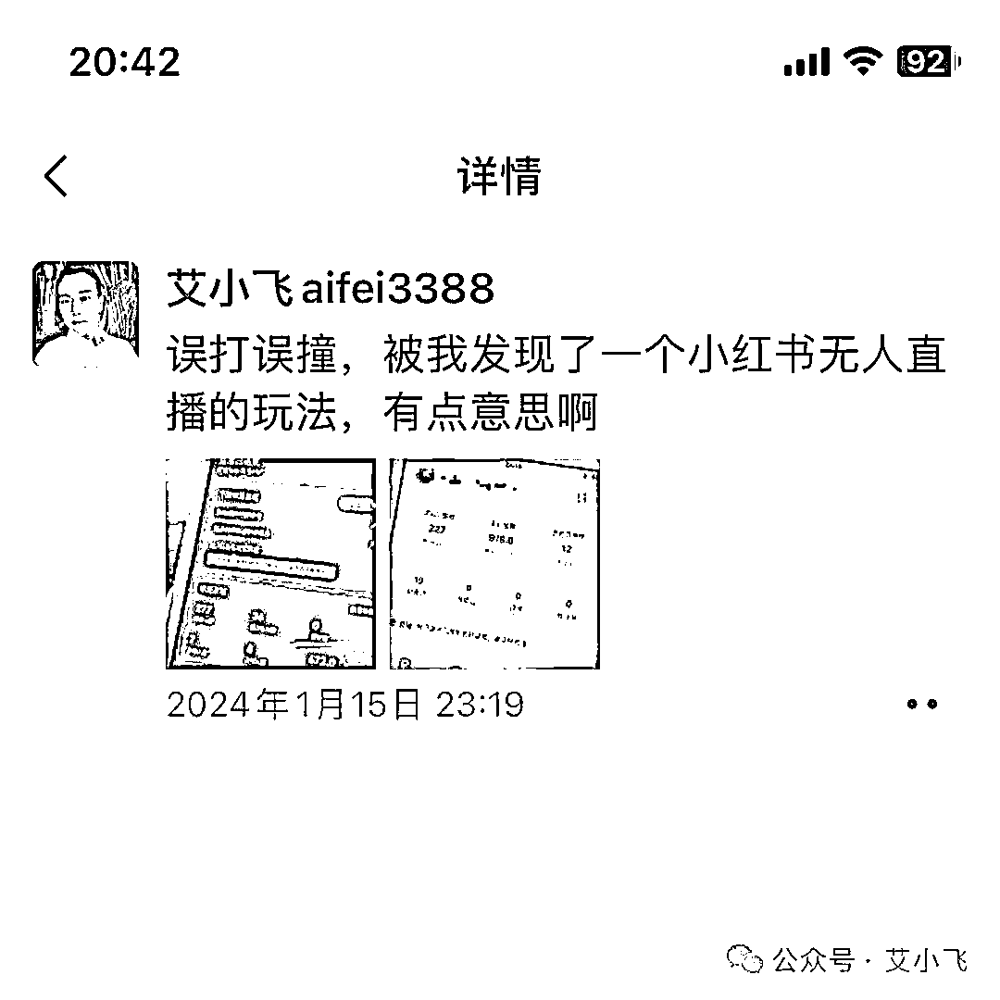
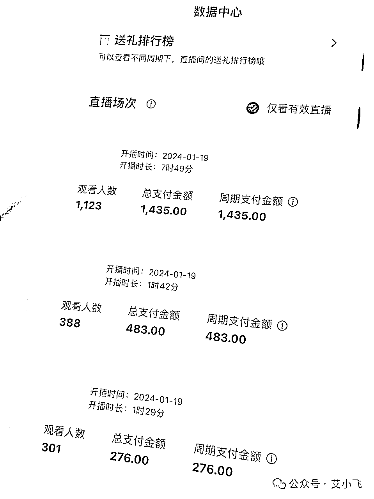
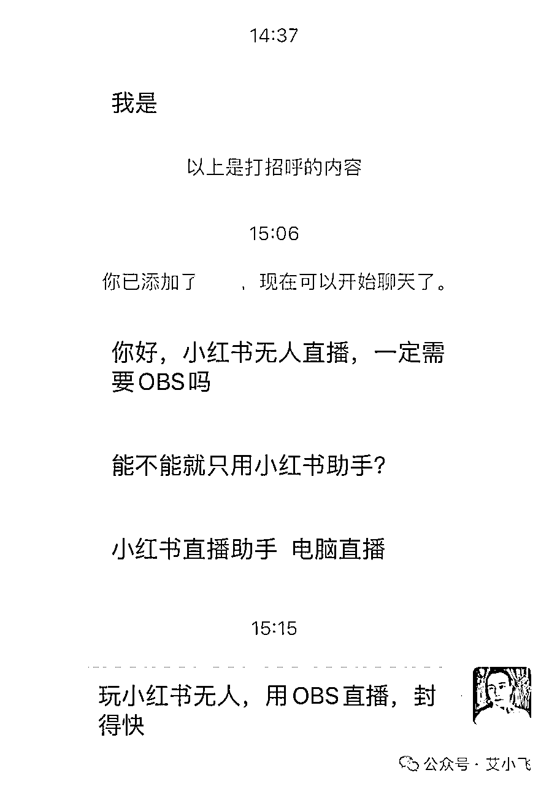

# 小心封号！用obs录播小红书，一个举报一个准！

> 来源：[https://lw03aeuj0n.feishu.cn/docx/MbaidIGWmo4qfAxv30qcOszVnoc](https://lw03aeuj0n.feishu.cn/docx/MbaidIGWmo4qfAxv30qcOszVnoc)

*   小红书无人直播怎么玩？

*   如何避开平台的检测？

*   如何提高无人直播抗风险能力？

大家好，我叫艾小飞

最近我在小红书卖水果，被我误打误撞的发现了小红书无人直播的玩法

并且通过不断的测试和技术迭代后，让我掌握了一套能对抗平台和同行举报无人直播的技巧

虽然这个技巧有时效性，但在短时间内按照这套方法去实操，肯定能小赚一波

这套玩法是什么？如何做？为什么不能用OBS来播？小红书检测录播的原理是什么？我们该如何避开？

这些方法，我都会在这篇文章给解答

今天有位粉丝来咨询我，他说用电脑OBS来播小红书无人直播，可以吗？

当时他这么一提问的时候，我就预感到，可能背后还有更多的人，都有跟他一样的想法和疑问

不知去哪找答案，也不懂该如何做？

现在啊，真是时代在变，规则也在变。

之前你们玩无人直播的那一套打法，在小红书早已经行不通了。

想赚大钱，必须要做出改变。

怎么改变？

首先就不要再用传统老套的打法来做小红书了

之前很多人都爱用OBS的模式打法，去做抖音快手视频号的无人直播，成就了一批批的百万大佬

看到小红书平台现在刚推出直播板块，就无脑的照搬之前那套模式，继续玩

玩着玩着就发现，好像小红书不吃这套啊！

老是频繁的被封账号，多少个号都不够用！

为什么会这样？

不要认为小红书平台是吃素的啊

根据我内部的小道消息，小红书平台对于用obs录播的，早已计入系统的自动检测范围内了

一旦被巡查或举报，100%是不留余地的封号！

# 一、平台怎么检测无人直播

他们是根据哪些原理检测到的呢？

## 第一是摄像头

系统会自动检测你的直播间，是否为真实的摄像头直播的

如果是虚拟的，那肯定马上强制要求下播，如果短期内被大量用户举报，那你这号肯定是保不住了的

## 第二是直播画面

系统会自动检测你的直播画面，在规定的时间内是否有重复出现的情况

如果重复出现的频率过高，会被提示下播，直播间被限流3天的处罚，不管你怎么播，直播间一个人都没有

## 第三是声音轨道

系统会自动检测你的声音轨道，在规定的时间内是否有重复出现的情况

比如同一段话，在60分钟内重复了20遍，声调语调语气都是一模一样的，那系统会提示你直播间涉嫌非真人语音，直播被限流，建议你整改

## 第四是直播互动

系统会自动检测你回复用户评论的频率，如果答非所问或不回答用户的，那你直播间也会被限流

以上这四点，都是系统能检测到的基础动作，而这些，都还只是小红书的“开胃菜”

之前有人说玩小红书无人直播很简单，那我想问你，以上的这四座“大山”，你怎么解决？

所以玩小红书无人直播，玩的都是细节，玩的都是信息差！

# 二、怎么解决平台检测

接下来我给大家分享下，我是如何解决以上难题的，这经验很宝贵，推荐收藏保存！

## 第一个摄像头的问题

明知平台会检测摄像头，我肯定不会傻到用OBS的虚拟摄像头来直播

明知路有坑，我就绕着走

怎么走？

我直接用真实的摄像头来播，这样不管是同行还是平台，举报我录播的问题，根本就不会通过了

因为我直播间确实是真实的

## 第二个画面的问题

之前玩OBS的朋友们，很多人都喜欢用同一个画面去循环播放。我也知道平台肯定会检测到的

所以我买回产品，自己搭建个小小的展示台，用摄像头对准产品播，这样出现的画面，都是实时展示的

我试过举报自己，全都举报不成，这个方法可完美的避开同行的恶意竞争

## 第三个声音的问题

有些人会好奇，那我的声音是怎么解决的？

很简单，录自己的声音一小时，重复8小时循环播放

这个办法我测试过，在小红书看直播的用户，没有哪个能蹲在直播间一小时的，我说的每段话，在一小时内都不带重复的，语调和语气都是不同的

如果同行来举报，你觉得能举报得成吗？

我试过，自己小号举报自己的大号成功几率为0

## 最后一个互动的问题

这个更简单了，把用户提前想问的问题，我都在录音里给他解答完了

不管他想问什么，我的录音里都能90%的解决掉，剩下的10%的问题，都是很冷门的问题，可以不用去理会

用户的疑惑我解决了，同行看到后，好像确实是真人直播解答的，也不会有举报的想法了

如果你是平台，你会封这样的直播间吗？

大概率是不会的

所以玩小红书无人直播，玩的都是细节，玩的都是信息差

这些都是用资源和钱才换来的宝贵经验，都是细节问题

而细节，也决定了成败！

以上我说的这些玩法，你们拿去套用，至少封号的几率不会那么快

也千万不要再用OBS的模式去做小红书无人直播了

你的套路玩法，平台都看在眼里，只是他不想赶尽杀绝而已！

好了，今天的分享就到这了，下期我继续分享，小红书无人直播时长和时间段的细节解决问题，点赞越多，分享越快！

如有疑问，可后台沟通！谢谢大家，我叫艾小飞

原创：艾小飞

转载可私信

禁止搬运和抄袭