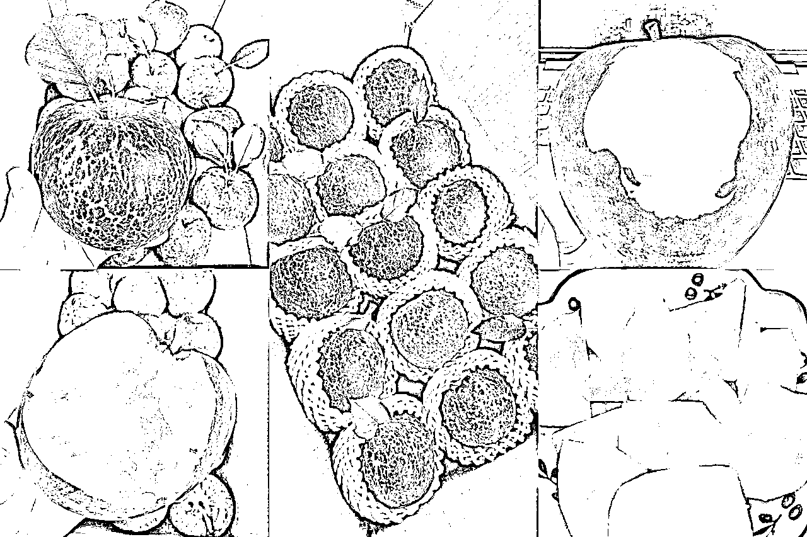

# 拆解小红书卖苹果

> 来源：[https://t5ldp2gatt.feishu.cn/docx/MmfldbSF4oNglGxLXlxclv2bnxf](https://t5ldp2gatt.feishu.cn/docx/MmfldbSF4oNglGxLXlxclv2bnxf)

项目拆解：小红书卖苹果卖了300w，三农账号怎么做？

研究对象：小红书账号：李小七水果铺 https://www.xiaohongshu.com/user/profile/5c53220e000000001201fd1a

为什么选择这个店铺作为研究对象？

一、风向标里的提到的例子是这个店铺https://wx.zsxq.com/dweb2/index/topic_detail/588428215821524

二、小红书搜索关键词“丑苹果”，点击“商品”，排在前面的店铺有

果农人阿强：粉丝1.7万，销量9.8万单，发布笔记1021，获得点赞收藏数为55000万，平均每个笔记获得点赞收藏数为54

森果园糖心苹果：粉丝5815，销量1.6万单，发布笔记580，，获得点赞收藏数为25000，平均每个笔记获得点赞收藏数为43

青山集（新疆农场）：粉丝7290，销量1.5万单，发布笔记207，，获得点赞收藏数为13500，平均每个笔记获得点赞收藏数为65

而李小七水果铺粉丝1.1万，销量6.5万单，发布笔记415，，获得点赞收藏数为71000，平均每个笔记获得点赞收藏数为171

综合上面的数据，李小七水果铺平均每条笔记获得的点赞收藏数为171，遥遥领先于其他账号，说明她做的笔记内容更加优质，优质的内容更能形成转化，也就更值得学习借鉴。

所有将这个店铺作为研究对象。

刚参加了RPA提效航海，学会了数据抓取， 于是用影刀制作了批量抓取机器人，将这店铺笔记的标题、文案、点赞、收藏、评论抓取到表格，以作分析。

经过对李小七水果铺账号的观察，这个博主卖了几年苹果了，账号里有少部分是2022年的笔记，其余都是2023年八月份开始发的挂苹果链接的商品笔记，只卖苹果，到12月份中旬，后面不再发布笔记。看来都是每年打一枪，来也匆匆，去也匆匆。

盈利：拼多多上昭通丑苹果很多均价五六元一斤左右。这个店铺有两个商品链接，好几种规格，均价10元一斤左右，还看到有客户评论说10元一斤太贵，而且她是产地发货，利润应该更高。没有准确打探出进货价多少，所以无法估算能赚多少。这个店铺售出6.5万单，就算一单赚10块，才干几个月，也不少了。

其他市场调研啥的也没做，就聊聊从账号里能看出来的一些东西吧。

封面：这博主不是第一年卖苹果，应该之前已经测出来了爆款封面，所以她几乎所有的笔记都是下面这五种风格。日更三四条笔记，大部分是图文，少量视频笔记。这就是践行生财里很多大佬帖子里写的爆款封面重复发就行。这些照片都很容易拍，要上手模仿也没有难度。看到有几家店铺也是这种风格的封面，应该也是模仿她的。

标题、文案：

博主总共有415条笔记，抓取了303条，至于为什么只抓取303条，机器人搭建技术不过关，没排查出来问题出在哪里，不过样本数量也足够分析了。博主虽然账号整体数据比较优秀，但也有很多笔记数据不好，有些甚至是0赞0藏0评论。那就取其精华去其糟粕，只选取点赞+收藏+评论的总和大于50的笔记来分析，一共102条。赞藏评大于50的笔记，我认为是内容较好的，剩下的是内容没那么好的。这个没有统一标准，每个行业每个产品数据不一样，仅供参考。

将标题和文案分别复制到微词云，自动分析得到高频词

高频词有什么用？我是这么认为的，我们在写标题和文案的时候，除了可以在内容里布局热搜词、下拉词、推荐词以获得搜索流量之外，还可以找一下对标账号里经常用到的是什么词，她为什么用这些词，能不能借鉴拿到自己的笔记中。

比如“酥脆”这个词，应该大多数人对苹果的印象是脆和甜，脆对应的是粉，甜对应的是酸，但酥脆是什么，苹果还有酥的？博主的笔记里这个词出现的频率很高，为什么她喜欢用这个词来形容苹果，这个词对于提高点击率转化率有帮助吗？如果我们也在小红书上卖苹果，可以拿来测试一下。

比如“回购”这个词，在数据较好的102条笔记中，“回购”出现了20次，比例为19.6%。在数据不好的201条笔记中，“回购”出现了28次，比例为13.9%。甚至在博主数据最好的前10条笔记中，就有五个标题里带有“回购”。

这应该不是巧合，说明了在笔记标题中有“回购”这个词，数据会好一些。或许用户看到这个词，脑子里会有疑惑，什么东西那么好值得回购，真的好吃吗，好奇之下就点进去看看。对于在小红书卖水果或者其他食品零食，将“回购”这个词写到标题和文案里或许有好的效果。真的，回购，好吃，酥脆，终于，这些词在博主数据好的笔记标题中经常出现，可以参考借鉴。

通过找高频词，我们可以在研究分析模仿借鉴对标账号的时候，看哪些词是经常出现的，标题中哪些词可以提高点击率，文案中哪些词可以提高转化率，然后在制作笔记的时候多将这些词写到我们的笔记中。

字数：数据较好的102条笔记字数总和是12570，平均每条笔记123字。博主发每天三四条笔记，在保证内容质量的前提下，要写到一百多字也是要费不少心思的，当然有AI加持的话另当别论。想想航海的时候打卡要写到50个字才能提交，还得数一数字数是否够了。用户点击进来后，文案内容多，给用户展示的信息就多，越有利于转化，当然得保证内容质量，不能无脑堆砌。博主的竞争对手的笔记字数普遍没那么多，甚至有时只有一个标题。

情绪价值：什么是情绪价值？先来看看这个博主的笔记风格

再看看其他人的笔记风格

这个店铺博主的文案和举例的两个文案，哪一种更能调动客户的情绪？哪一种更能让客户下单购买？

生财文件里下载的一篇文档《爆文狂潮中的黑马：探索小红书低粉账号的流量捕捉术》里写到：情绪价值是低粉爆文的第一生产力。

生财里凯哥的帖子《小红书1篇笔记可以卖货10w+的文案，到底长什么样子？》里写到：没有情绪的文案，就像是行尸走肉。https://articles.zsxq.com/id_fpdghkpm6s3c.html

在小红书，不需要讲太多大道理，要充分调动用户的情绪。看这个店铺博主的文案，感觉像一个女孩子在你面前手舞足蹈叽叽喳喳热情洋溢的说：啊啊啊这苹果真好吃~~~ 让一个钢铁直男都忍不住会心一笑，真的有那么好吃吗，那我去试一下吧。想起在抖音上经常看到有些残疾人或者老年人带货卖垃圾袋，有些销量还很高，也是属于调动了客户的情绪价值。垃圾袋天天都要用，客户心想在哪买都是买，何不帮残疾人赚点钱改善生活，也算献爱心了，于是就下单了。

总结：

水果项目是可以长期做的，每种应季水果的果期就几个月，但一年四季都有各种不同的水果，积累足够多的高净值客户到私域，什么水果都可以卖。朋友圈有个女孩子卖脐橙好几年了，她卖的脐橙确实好吃，买过几箱给客户，客户吃了也要找她买。她用的是自己的包装盒，卖的挺贵，适合送礼。之前只卖脐橙，现在也拓展到其他水果，有猕猴桃，榴莲，车厘子，山竹。

做带货也可以，博主在图文或者视频里都没有出镜，她说是云南昭通当地人，也未必就是真的。只要联系到靠谱的合作供货商，自己只做小红书引流，照片或者视频素材让供货商提供，也是可行的。

通过对账号的观察，我学到的是：

封面：找一定数量的对标账号，五到十个，找出爆款封面，模仿，重复拍，反复怼

标题、文案：批量抓取爆款标题和文案，分析，模仿，取其精华。要用心写，保证内容质量的前提下多写内容，提取多条爆款分拆再组合，或者借助AI，来降低写作难度并提升效率。文案不需写得太正式，不需太一本正经，可以更加口语化，要能调动用户的情绪。

笔记数量要保证，每天三五条，这个博主内容制作水平应该很好了，但也是大部分笔记数据不是很好，甚至有0赞0收藏评论的笔记，要多发，用数量对抗概率。

有效的项目拆解应该要对市场、上下游、竞争对手、流量、转化等各个维度进行研究分析。我对于这个主题的拆解，其实算不上是拆解，很多东西都没有涉及到，只能说是观察学习。由果及因，就像拿着锤子去到处找钉子。也没有分析其他更多的竞争对手做得好与不好的地方，比如《果农人阿强》丑苹果销量9.8万单，为什么他卖的更多，有什么特别之处可供学习借鉴，也没有进行分析。分析方法也不够科学严谨，比较主观。

欢迎评论指导。