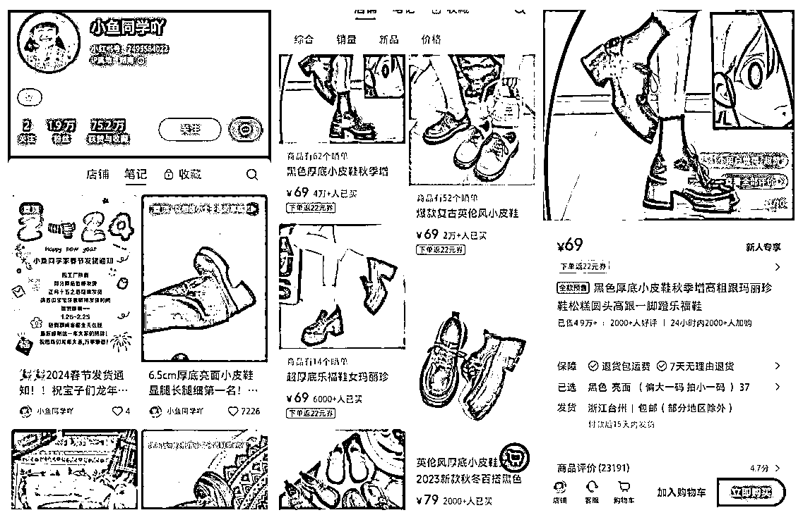
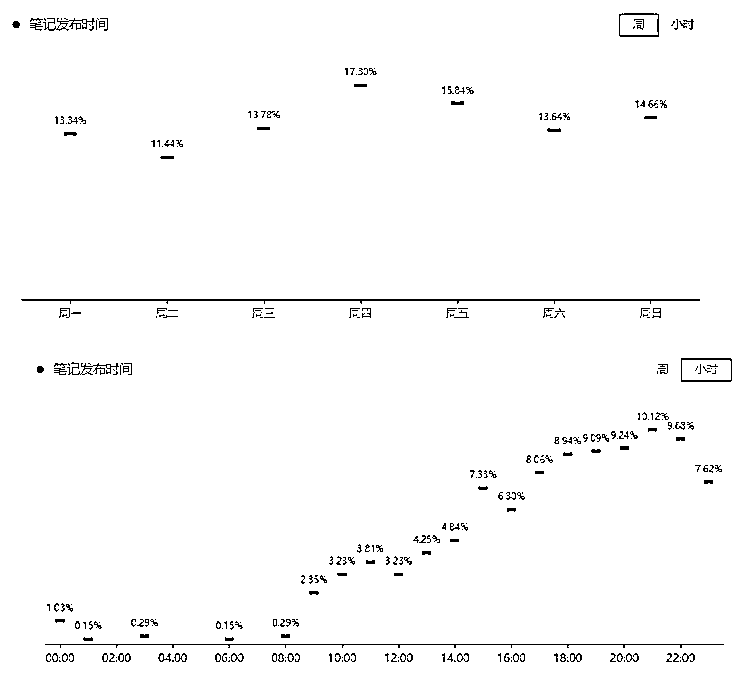
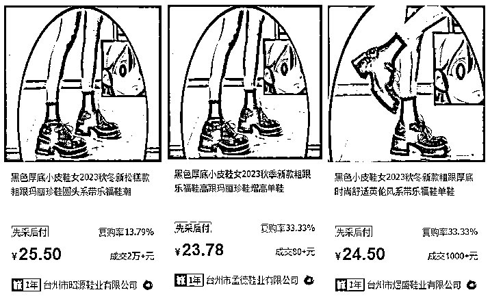
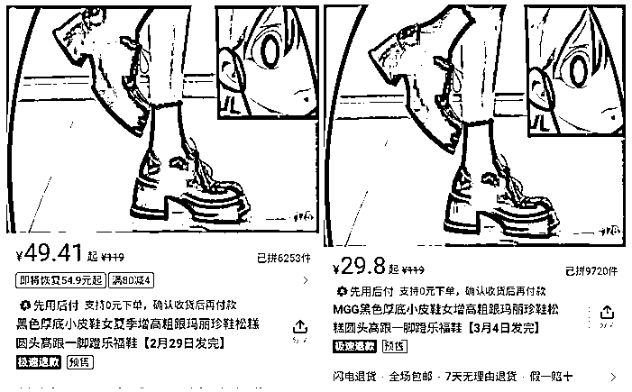
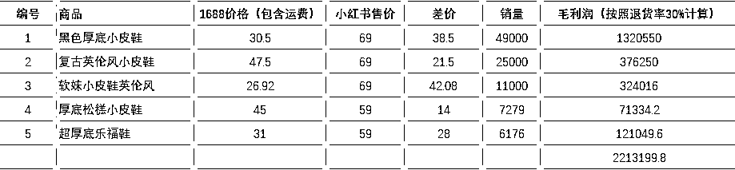
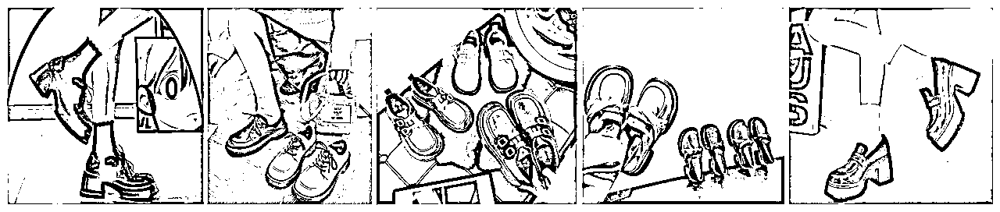

# 风向标拆解第 3期--小红书爆款，售卖件数50W+的店铺到底是怎么赚钱的--闵一

> 来源：[https://uwc2n3yxpc.feishu.cn/docx/MvkkdMrgjoj4hkxGu8ncw4CpnTg](https://uwc2n3yxpc.feishu.cn/docx/MvkkdMrgjoj4hkxGu8ncw4CpnTg)

小红书爆款，售卖件数50W+的店铺到底是怎么赚钱的？

在小红书，我们经常能看到一条鲨鱼裤销量80w+，一件打底衫销量50w+，一家店只卖一个品，就能赚得盆满钵满。同时，也出现过“春节必备的20件一次性用品”的热点话题，靠卖百货卖出10w+的店铺。

那么，这种高爆款的那种店铺，都是怎么做起来的？

几十万销量的背后，靠的做矩阵铺货吗？还是邀请达人带货？还是图文+无人直播的模式？

本质上现在小红书各类的玩法也越来越成熟了，爆款店铺的背后，对于大家来说的机会可能是什么？

## 案例拆解

#### 账号基本情况

账号名称：小鱼同学咩的店

类目：女鞋

带货形式： 视频 （目前没有看到直播）

## 变现情况：

### 1 流量怎么运营？

*   该账号免费流量主要来自视频，发现页+搜索流量+商品页，目前没有看到直播，没有其他达人带货；

*   总计374条笔记，最早更新时间是2023.3.1，平均每天更新1-2条视频，时长10s-30s；

*   视频表现形式为鞋子到货开箱视频和上脚试穿视频；只配音乐，或者是配音变声解说；

*   标题突出低价，比如“60+💰 谁懂 被这双厚底乐福鞋高级住了!!”、“才69r这双锁扣厚底小皮鞋是来报恩的吧😭😭”

*   笔记发布时间，集中在晚上6点到10点，其他时间段相对少

*   笔记评论词云

*   消费者画像

女性为主，占比97.1%

粉丝数TOP3：广东（10.40%）、山东（8.80%）、河南（8.80%）

主要年龄18-24岁|57.7%、25-34岁|28.6%

粉丝活跃最频繁的时间：10:00（15.30%）、11:00（13.70%）、12:00（11.90%）

### 2 产品怎么解决？

以该店铺热销款为例，小红书店铺售价69元，已售4.9万件，发货地台州

1688同款1：25.50+5元运费，差价38.5元；

1688同款2：23.78+5元运费，差价40.22元；

1688同款3：24.50+5元运费，差价39.5元；

拼多多同款1：49.41，差价19.59元；

拼多多同款2：29.8，差价39.2元；

### 3 利润怎么核算？

1）收益分析

该店铺总共上架55款产品，目前销量排名前5的产品利润如下表：

其他款产品销量千件以上有8款；500-100件的有5款；剩余100左右

2）成本分析

*   资金投入：保证金+投流费用+垫付资金+人工费用

*   小红书个人店保证金1000，投流费用没有数据可查；

*   女鞋行业退货率30%左右；

*   小红书店铺抽成5%；

3）综合利润

产品太多没有全部记录价格和销量，先按照店铺排名前5的产品估算单店利润

固定投入：1000+69*55（样品购买）=4795元

总利润估算220w，账号运营11个月，平均每月19万

（不确定是否有广告费，人工费，或者其他隐形支出，有在开店并且盈利的大佬请帮忙看看是否计算正确）

### 4 项目结论

百元内售价，实拍+不断测款+持续更新，定位某个细分群体，比如该账号定位学生党增高鞋；