# 风向标拆解第3期--会偷懒就能赚钱，一个自动记账快捷指令是怎么变现的--十七

> 来源：[https://y098ow0zio.feishu.cn/docx/QoeodQIUvoJJgVx2anec2vmsn4c](https://y098ow0zio.feishu.cn/docx/QoeodQIUvoJJgVx2anec2vmsn4c)

## 产品背景

iPhone的快捷指令连接到制作好的表格实现自动化记账任务。

Workflow是一款应用软件，2015年“App Store最佳应用”，iPhone平台最具创新应用。

2017年3月，Workflow被苹果公司收购。( [1])苹果不只获得了Workflow App，开发团队也会加入苹果公司。( [2])

2018年，Workflow更名为“快捷指令（Shortcuts）”。

发展历程：

2017年3月23日，苹果收购Workflow，但苹果具体收购价尚不清楚。( [3-4])

2018年，Workflow更名捷径，并发布新版本，提供汉化( [3])，不久后又更名为快捷指令。

2019年，随着Apple推出iOS 13.1，快捷指令更新了“自动化”功能，可以在触发某一条件时自动运行快捷指令。

主要功能：

快捷指令可以将多个App或者App的功能连接起来，形成一组指令，自动完成任务。

快捷指令可以完成一系列复杂的工作，它通常需要用户打开若干个应用，然后只要按下一个按键即可将工作自动完成。例如，假如用户想让某个人知道自己迟到了，只要使用“迟到”工作流即可自动找到自己的下一个约会，然后计算出路上需要的时间，编写一条文本消息并发送给约会对象。

苹果电子表格工具

Numbers是苹果公司开发的电子表单应用程序，作为办公软件套装iWork的一部分，与Pages、Keynote分别销售。Numbers 1.0于2007年 8月7日发布。其最新版本为Numbers'13。而最初版本只能在OS X上运行， 后来随着iOS系列产品的推出，苹果公司也推出了iOS版本的Numbers。随着WWDC2013的到来，iWork系列随之推出了iCloud版本。

## 用户需求

随着科技越来越发达，现在的人越来越依赖智能设备。记账这个事情，很多人都觉得好麻烦啊，但是自动记账功能真的是帮了大忙了！它解决了现代人普遍的懒惰和健忘问题，让记账变得超简单。

自动记账功能通过智能识别和分类，能快速记录每一笔支出，然后自动放到相应的账目里。这样就不用手动输入啦，省时省力，也不会因为忘记或弄错而烦恼。对于那些总是忙到飞起或者忘性大的人来说，这简直就是一个救星！

而且，自动记账功能不仅仅是简单记录，它还能分析你的账目，给你提供个性化的消费建议和预算规划。这就像是有个私人财务顾问一样，帮助你更好地掌握自己的财务状况。

通过智能技术，可以轻松记录每一笔支出，还能得到专业的消费建议和预算规划。这种财务管理方式，就算不是很勤快的人也能够轻松搞定，更好地规划自己的钱财。

## 案例拆解

### 1.基本情况

账号：Cayson呀

类目：数码

粉丝：2476

作品：45

变现形式：小红书店铺

账号：数码朵拉 PM

类目：数码

粉丝：1944

作品：31

变现形式：小红书店铺

### 2.选择该账号拆解的原因

1.3个月内做起来的低粉爆款

2.模板相对统一，图文和视频可复制

3.类目垂直，只做一个产品。

### 3.附上账号首页截图

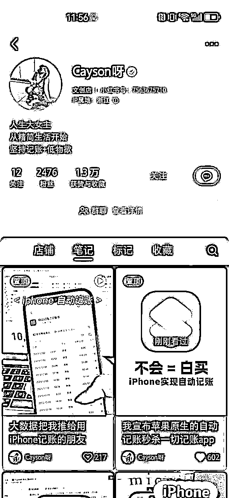

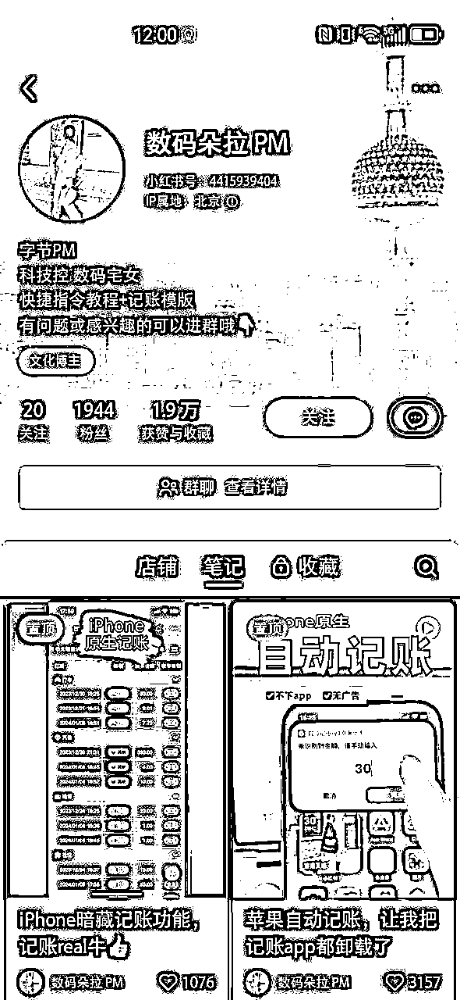

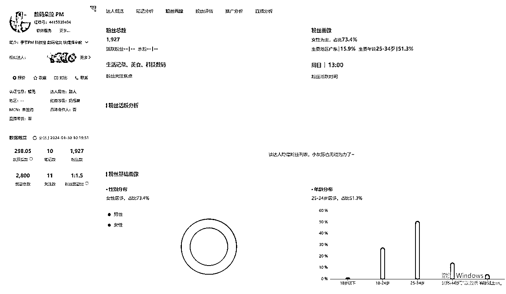

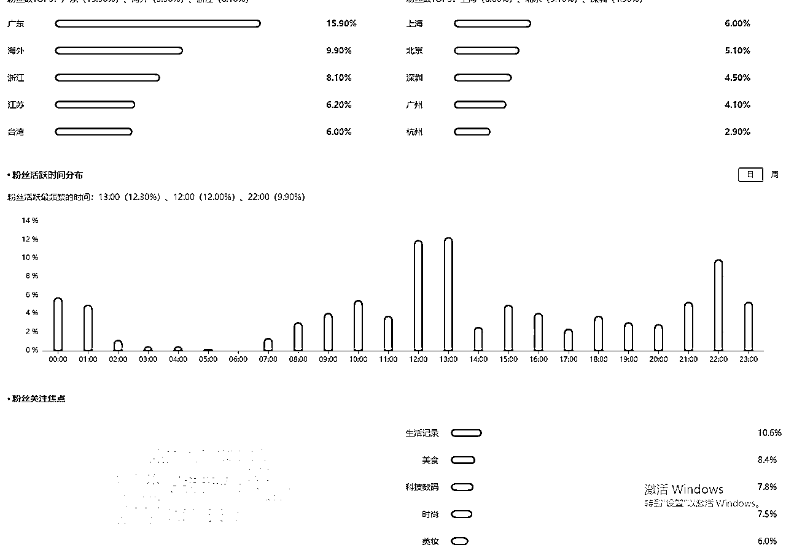

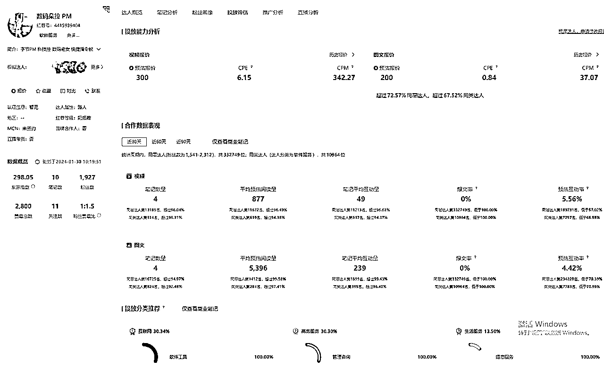

## 1.流量怎么运营？

第一步：搞清楚流量从哪里来。

分为免费流量与付费流量。

免费流量：图文笔记和视频笔记的自然流量

付费流量：对标没看出来有付费推广

结论：靠自然流量

## 2.产品怎么解决？

#### 1.购买他人成品

小红书/淘宝购买上架的成品，价格从6.9-29.9元不等，有专人售后，自己是苹果手机的话，按照做好的模板和教程体验一遍，后续更方便解答客户问题，并且后续接单过程中如果遇到棘手的问题，也可以把问题甩给商家帮忙解决。

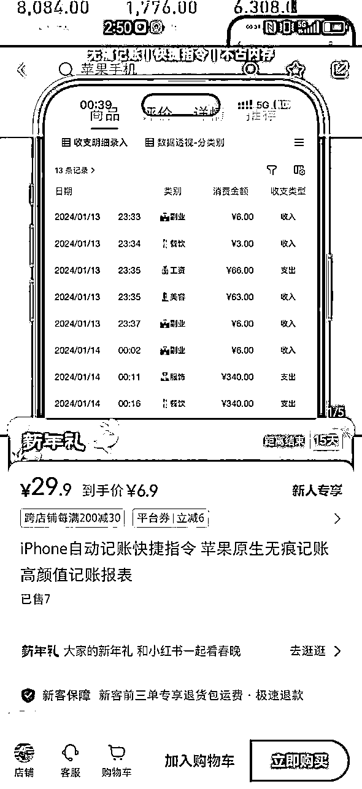

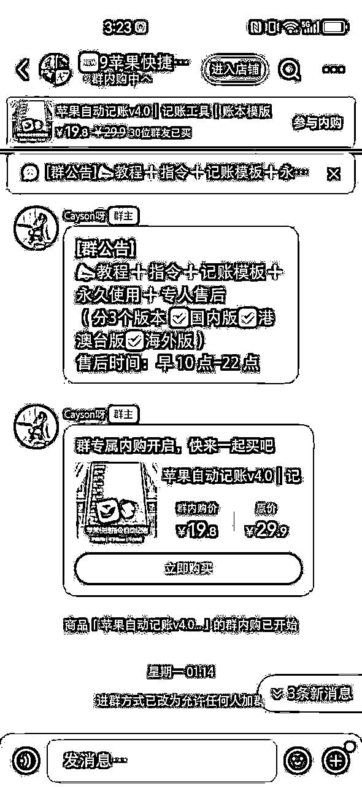

#### 2.自己制作飞书表格

在B站上找到一个自己制作表格的教程，1个小时内可学会，学会一个新技能。

iPhone懒人记账 自动记账 究极不掺水教程来啦

附上链接：https://www.bilibili.com/video/BV1pg4y1e7oZ/?spm_id_from=333.788.recommend_more_video.0&vd_source=ac6921198599369f27d54968d8acce2e

#### 3.免费下载numbers账本

快捷指令链接

https://www.icloud.com/shortcuts/a31f54edcf784e26937e88139a31de6a

numbers账本链接：https://pan.baidu.com/s/1vBBKxDjdgDNvgeJGrHRBbw 复制这段内容打开「百度网盘APP即可获取」

提取码：9Y3Y

注意点：

*   如果用不起，就快捷指令中最后一条，把numbers文件重新关联一下

*   然后在辅助触控里设置一下轻点手机背后两下启动记账的快捷指令，然后到支付界面启动快捷指令就行了

*   刚开始用，里面的交易记录不要删，记录2、3条以后再删。

## 3.利润怎么核算？

1.收益分析：

Cayson呀店铺出售两个商品

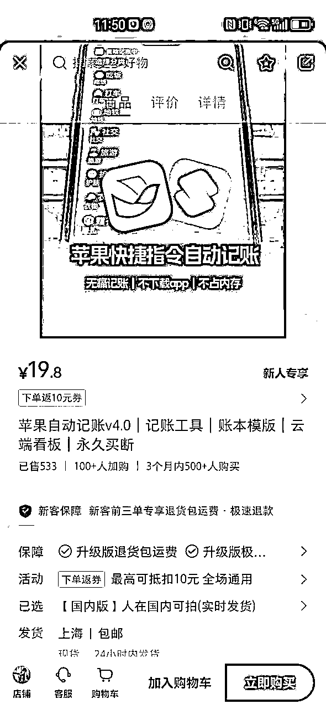

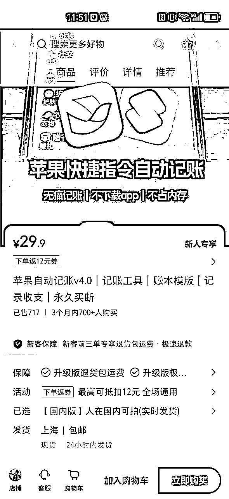

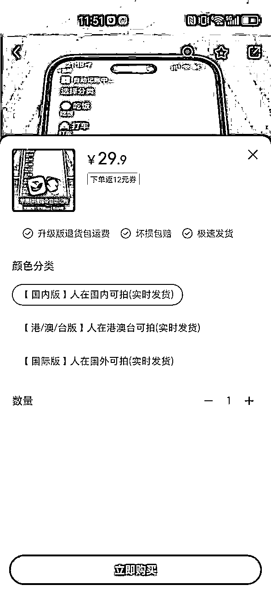

① 29.9元 售出：717单 29.9*717=21438.3元

② 19.8元 售出：533单 19.8*533=10553.4元

从24年1开始发笔记到月底，自己上架商品营业额3万+

提现手续费：24219.9*5%=1600元

自动发货订购200--300元，具体不清楚

利润：32000-1600-300=30000元

数码朵拉 PM店铺出售两个商品

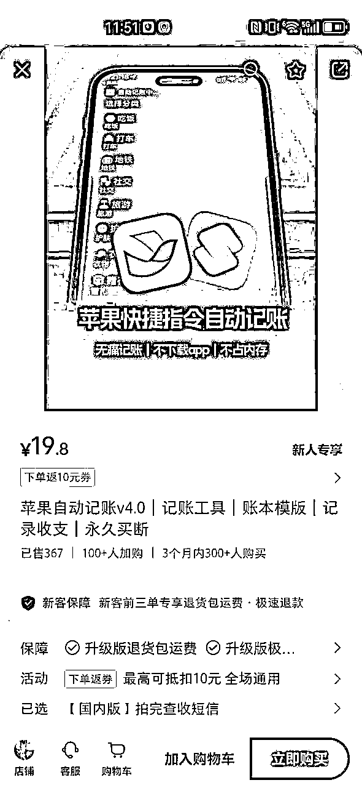

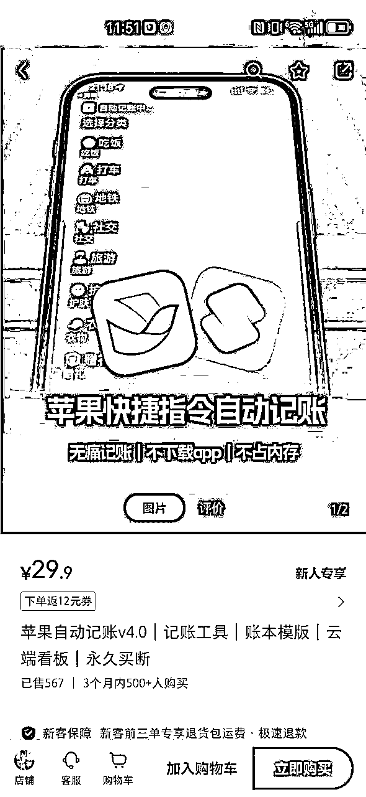

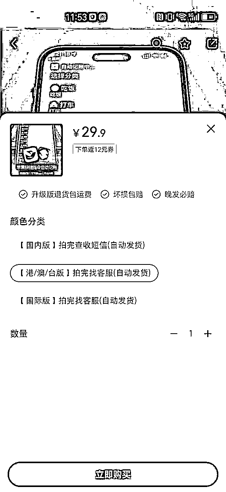

① 29.9元 售出：567单 29.9*567=16953.3元

② 19.8元 售出：367单 19.8*367=7266.6元

从24年1开始发笔记到月底，自己上架商品营业额3万+

提现手续费：24219.9*5%=1210.995元

自动发货订购200--300元，具体不清楚

利润：24219-1210-300=22700元

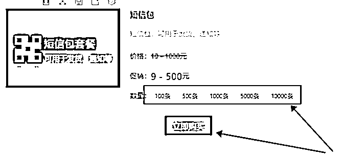

2.关于成本

店铺前期成本

1.  购买其他人的商品，除了前期购买指令的价格+1000店铺保证金，总销售额＞1万平台抽取5%提现手续费。

1.  自己制作表格，除了时间成本+1000店铺保证金，总销售额＞1万平台抽取5%提现手续费。

1.  免费下载成品，商品0成本，1000店铺保证金，总销售额＞1万平台抽取5%提现手续费。

1.  订购自动发货9-500元不等，根据订单量选择。

如何退1000店铺保证金？

1.  登录小红书卖家后台：使用您的卖家账号登录小红书的官方网站或APP，进入卖家后台界面。

1.  进入财务管理：在卖家后台界面中，找到并点击“财务管理”选项，进入财务管理页面。

1.  申请退还保证金：在财务管理页面上，您可以看到自己的保证金信息以及相应的操作选项。点击“退还保证金”按钮，填写相关信息，提交退款申请。

1.  等待审核：提交退款申请后，小红书的相关工作人员将对您的申请进行审核。这个过程可能需要一定的时间，请耐心等待。

1.  审核通过退款：如果您的申请通过审核，小红书将会将保证金退还至您事先提供的账户。具体退款到账的时间可能因银行处理速度而有所不同。

除了以上流程，还有一些要求需要注意：

*   店铺处于正常关闭状态：在申请退还保证金之前，您的店铺需要处于正常关闭状态，不能存在违规行为或处罚。

*   没有未解决的投诉和纠纷：在申请退还保证金时，您的店铺不能存在正在进行中的投诉和纠纷，必须保持良好的售后记录。

*   无欠费情况：在申请退还保证金之前，请确保您的店铺没有未结清的费用，如广告费、服务费等。

*   提供正确的退款账户信息：在填写退款申请时，请务必提供准确的退款账户信息，以确保退款能够顺利到达您的账户。

*   小红书店铺保证金1000的退款流程相对简单明了。通过登录卖家后台，进入财务管理页面并提交退款申请，然后等待审核和退款到账即可。在申请退还保证金之前，请确保店铺处于正常关闭状态、无未解决的投诉和纠纷，且没有欠费情况。

*   同时，在填写退款申请时，务必提供正确的退款账户信息。通过遵守相关要求并按照流程操作，您可以顺利退还小红书店铺保证金，保障自己的权益和资金安全。如果在退款流程中遇到任何问题，建议及时与小红书的客服人员联系，得到专业的帮助和指导。

## 4.项目如何做&如何放大？

### 1.项目如何做

#### 一：注册账号

尽量一机一卡一号,正常的账号注册，全程不要连无线wifi，注册的时候会让我们选择兴趣爱好，站在项目角度，尽可能选“学习”相关标签。

个人信息的设置，主要是名称、简介，头像，背景这四方面。

①名称:最好是全中文，不要用英文和生僻字，这样不利于别人检索与记忆，可以采用名字+领域，如:XX考研、XX备考，目的就是消除距离感。

②简介:简介要注意不要做个人引流，要展现自己的优势，可以说明自己账号的内容走向，也可以铺排人设特色，强化个人标签。

③头像:可以用自己的真人头像这样才有辨识度，也可以使用漫画头像，找一些真人背影、侧脸这样的图片，打造一个学姐、学霸人设。

④背景图:小红书背景图尺寸是:1000*800pX

可以选择开通店铺上架商品/笔记挂商品链接

#### 二、开通店铺

往期航海小红书店铺手册：

https://search01.shengcaiyoushu.com/docx/N1lSdZs1JodBnyxSozOcWaa4n5A

个人型专业号，可以申请开个人店铺或个体工商店。

个人店铺

只需要提供姓名、身份证号、手机号，并进行人脸识别，验证成功后店铺就开通。

*   名称为 XXX(昵称)的店;

*   店铺保证金最低 1000 元;

*   月营业额<1万，平台免收技术服务费超过 1万的部分，平台收取 5%作为技术服务费;

个体工商店

需要提前准备好以下几点:

一个执照的话可以开三个店，要先注册三个小红书账号

(1)公司信息的营业执照照片、公司名称、统一社会信用代码、经营地址以及营业执照有效期,

(2)店铺运营授权书。

#### 三、认证流程

###### 个人店铺

点击【创作中心】一【更多服务】一【开通专业号】一【我是个人】-【实名认证】-选择身份证，填写相关信息即即可开通橱窗。

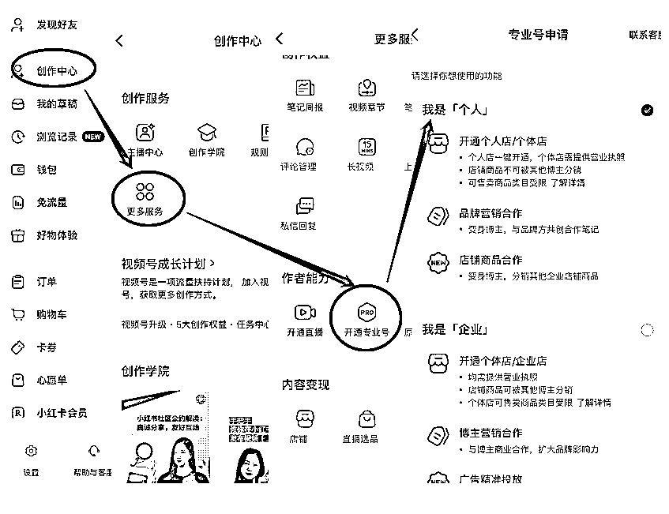

###### 个体工商店：同样也是先选择店铺经营类目，然后根据提示上传相关的资料。

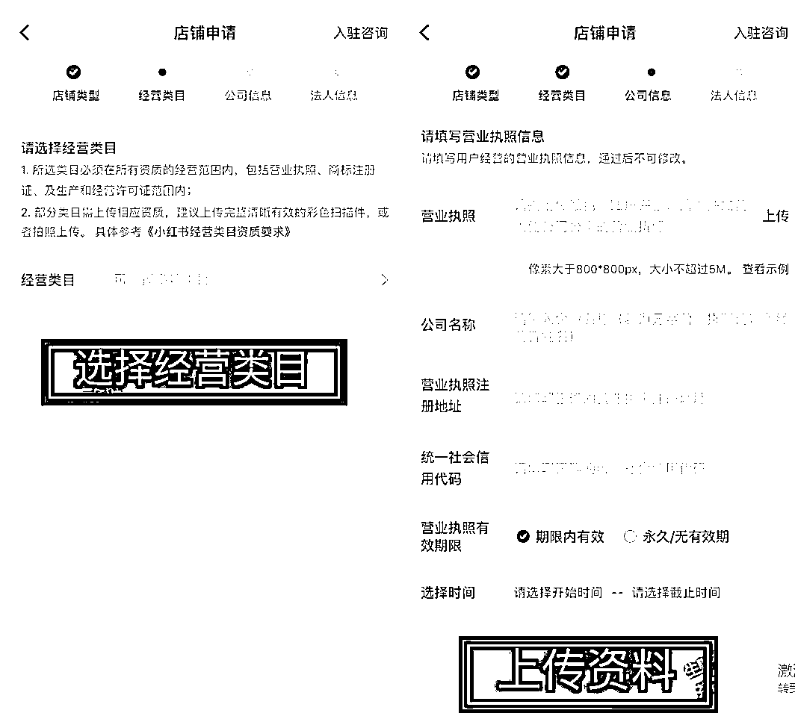

#### 四、上架商品

手机端下载【小红书商家版】【登陆小红书商家管理后台】

上架流程：

选择【发布商品】→【编辑商品】→【填写商品信息】→【进入审核】→【审核过后】→【完成商品上架】

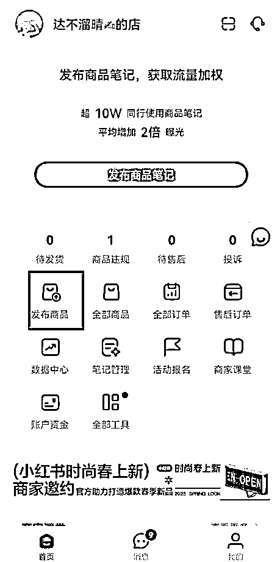

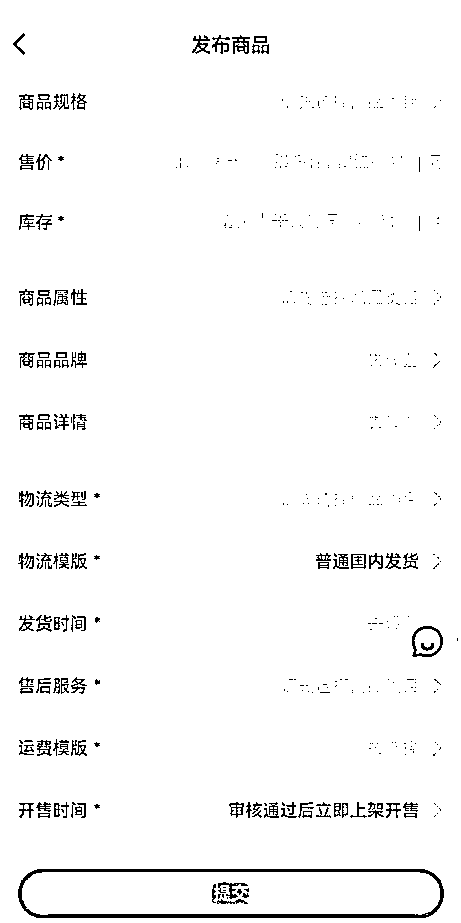

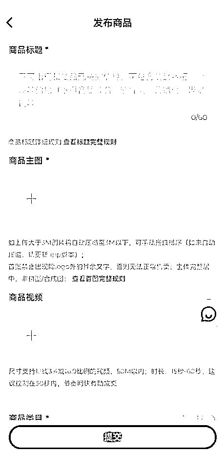

上架商品过程中需注意事项：

A.上架类目选择电子数码

B.商品标题需按标题规则填写，不可包含品牌名、诱导词、极限词等，详情可查看蓝字部分【规则详情】

C.商品短标题为产品名

D.填写销售信息时，价格库存可以随便填，可以填2000以上（虚拟商品无所谓）

E.初次发布商品前，需前往发货基础设置下创建物流模板，操作路径：登陆商家管理后台 - 交易 - 物流工具 - 物流模板 - 创建模板【虚拟产品一律设置包邮】

##### 1.发布笔记

1)怎么找对标笔记?

●搜领域关键词

如我们做“iPhone自动记账”，就在小红书搜索框里搜索相关关键词，通过主页出现的笔记去筛选适合自己的对标笔记。

笔记分为：图文笔记和视频笔记。

###### a.图文笔记

作图工具：PS、搞定设计、美图秀秀

<h7>① 图片尺寸：1080×1350像素（标准）</h7>

根据模仿对标爆款的图片，1:1复制

<h7>② 标题：</h7> <h7>搜集3个月内爆款标题直接用</h7>

③ 正文内容：

根据爆款笔记多搜集一些，混合在一起，大概改写下就是自己的笔记。

<h7>④ 末尾带话题：</h7>

搜集对标的话题标签，如：#日常生活里的快乐瞬间##-人一个iPhone使用技巧##记账##记账app

用的时候可以直接取。

###### b.视频笔记

剪辑工具：剪映、pr

① 视频尺寸：3:4或9:16

根据模仿对标爆款的图片，像素级模仿

<h7>② 标题：</h7>

搜集3个月内爆款标题直接用

③ 正文内容：

一般以视频为主，正文文字不多，看对标。

<h7>④ 末尾带话题：</h7>

搜集对标的话题标签，如：#日常生活里的快乐瞬间##-人一个iPhone使用技巧##记账##记账app

用的时候可以直接取。

##### 2.设置自动发货

###### 步骤一：订购服务

小红书自动发货订购网址：https://aldsxhs.agiso.com/

###### 步骤二：设置宝贝

进入到自动发货后台---商品管理---付款后发货---前往设置---商品单独设置：出售中---找到需要设置自动发货的宝贝---设置---选择无卡类型---附言里填写要发送的内容---确定

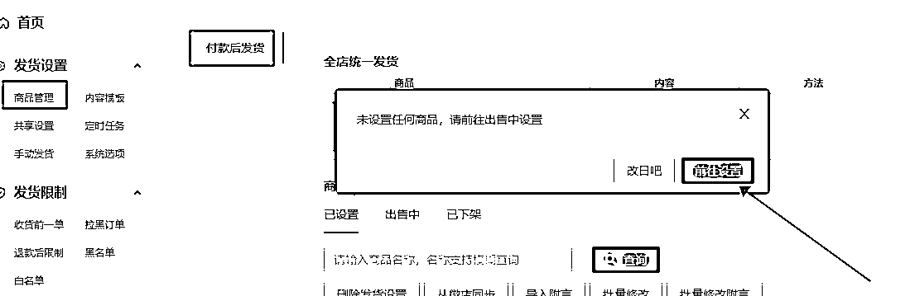

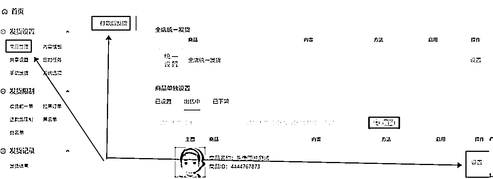

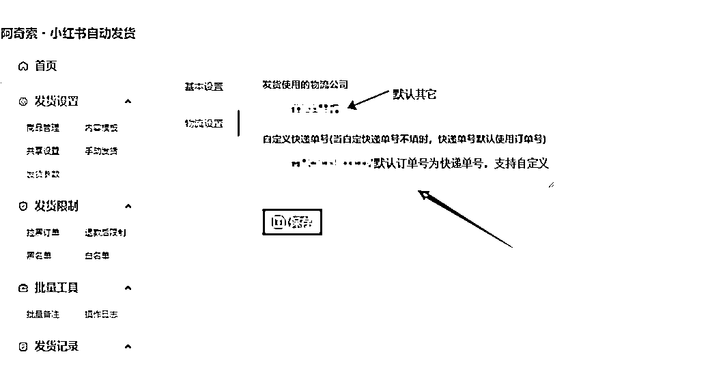

###### 步骤三：绑定91卡券仓库

自动发货页面---91卡券仓库---卡券管理---前往绑定---输入账号密码登录（如没有账号点击免费注册，前往注册一个91账号）---前往授权---是---卡券管理页面出现91卡券账号时即绑定成功

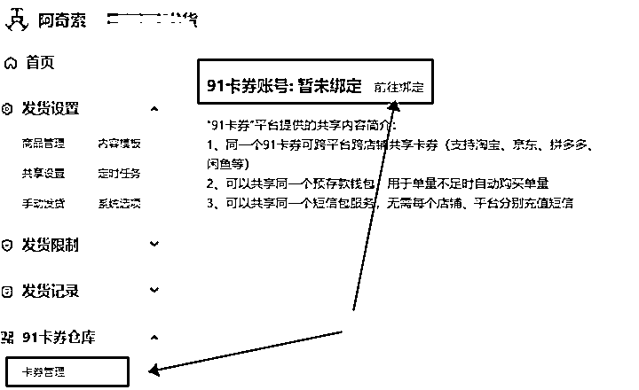

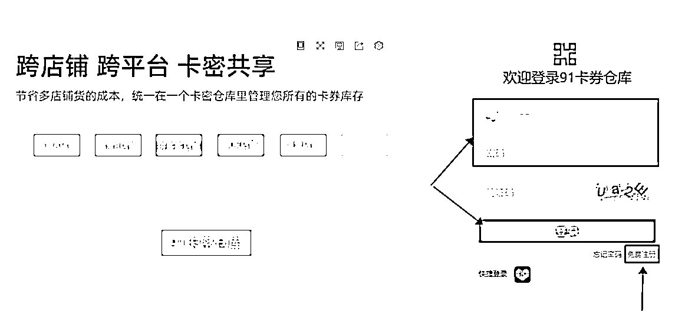

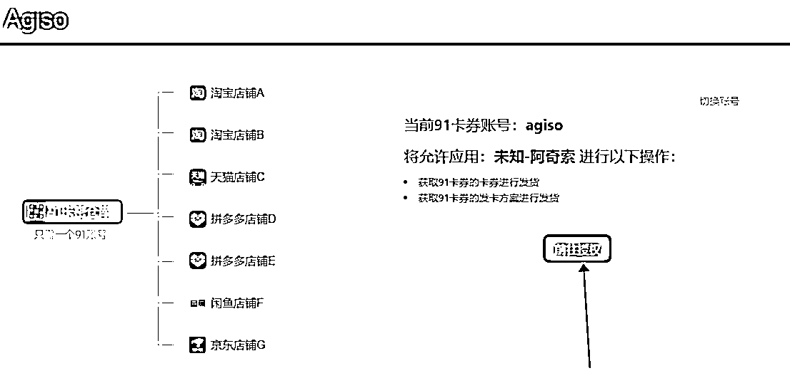

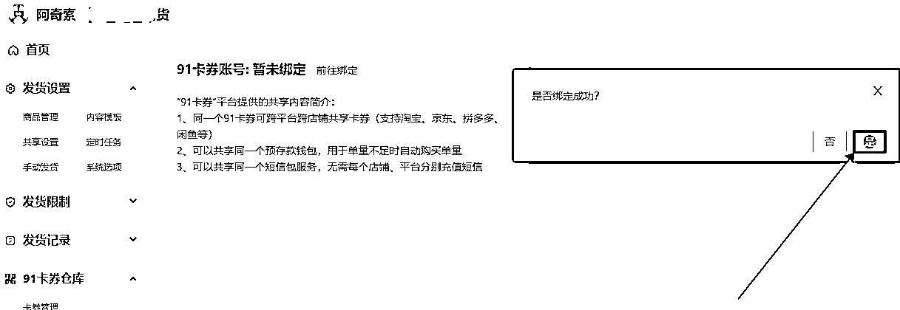

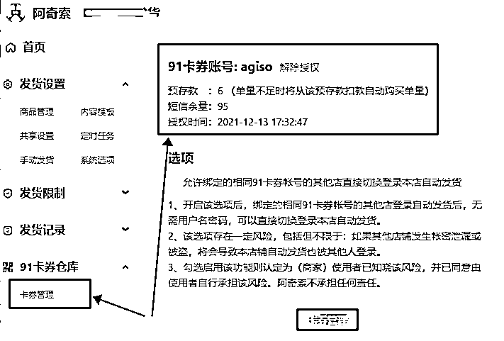

###### 步骤四：短信发送

（小红书仅支持短信发送及自己前往提取页面提取，短信发送需要勾选短信和绑定91卡券账号）

自动发货页面---发货设置---商品管理---付款后发货---找到需要设置的商品---点击短信旁的问号---短信数量充值---跳转到91卡券页面---资产---钱包---短信数量---购买---选择需要的短信数量---立即购买

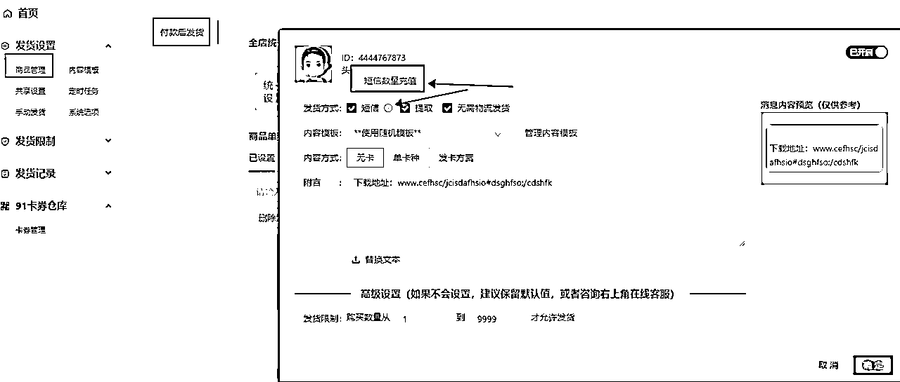

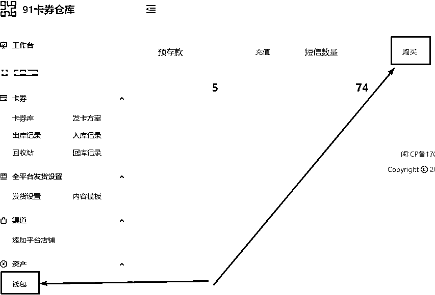

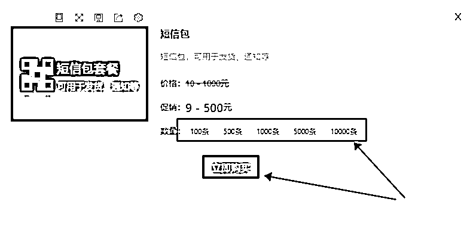

* * *

###### -----抖音视频观看--------------------

复制到抖音打开查看设置步骤：

5.84 09/04 SYZ:/ p@d.NJ 小红书自动发货 无卡密篇 # 小红书 # 电商运营 # 教程 # 卡密 # 自动发货 https://v.douyin.com/iLwKBFkx/ 复制此链接，打开Dou音搜索，直接观看视频！

##### 3.挂商品链接

1.  首先，你需要确保你的小红书账号已经进行了实名认证。

1.  然后，你可以在笔记编辑页面中找到“标签”功能，点击后会弹出一个输入框。

1.  你可以在输入框中输入商品的链接，然后点击确定。这样，当其他用户在浏览你的笔记时，就可以直接点击这个链接购买商品了。

#### 五、关于小红书尺寸

小红书图片尺寸

小红书头像 400*400px （1:1）

小红书背景图 1000*800px

小红书封面 (竖版) 1280*1706px （3:4）

小红书封面 (横版) 2560*1440px（9:16）

小红书配图 (竖版) 900*1200px （3:4）

小红书配图 (方图) 1080*1080px（1:1）

小红书配图尺寸

1）小红书常用的图片尺寸为1:1、3:4、4:3，其中观感最好的是3:4

2）图片尺寸为3:4的分辨率：720*960、768*1024、960*1280、1080*1440，分辨率越高，图片越清晰

3）小红书图片展示比例，由封面图的尺寸决定，如后面图片与封面尺寸不同，系统则会自动进行剪裁、生成黑白背景，统一尺寸；所以建议统一图片比例，视觉效果会更好

关于小红书配图

1）尽量保持封面的风格，不要频繁更换封面一定要突出主题

2）一篇笔记一次最多只能发9张图片

如图片为非上述的尺寸，也依旧能够发布，如想完整展示，在上传时可点击调整背景，进行背景扩张。

#### 六、评论区引导

###### 1.引导关注

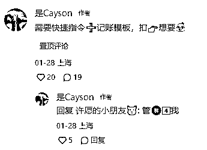

###### 2.引导入群

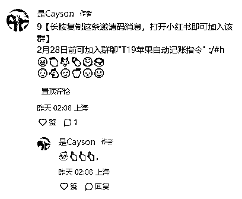

<h7>建群方法</h7>

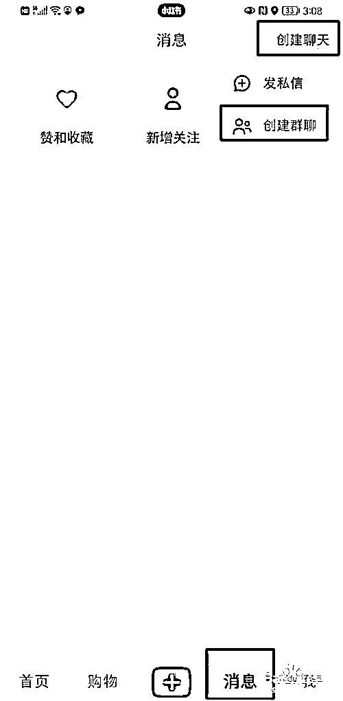

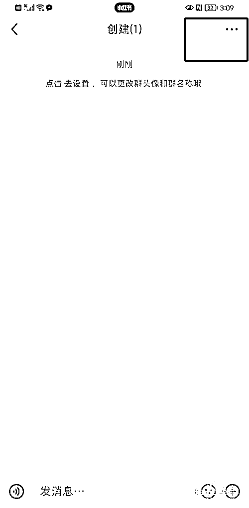

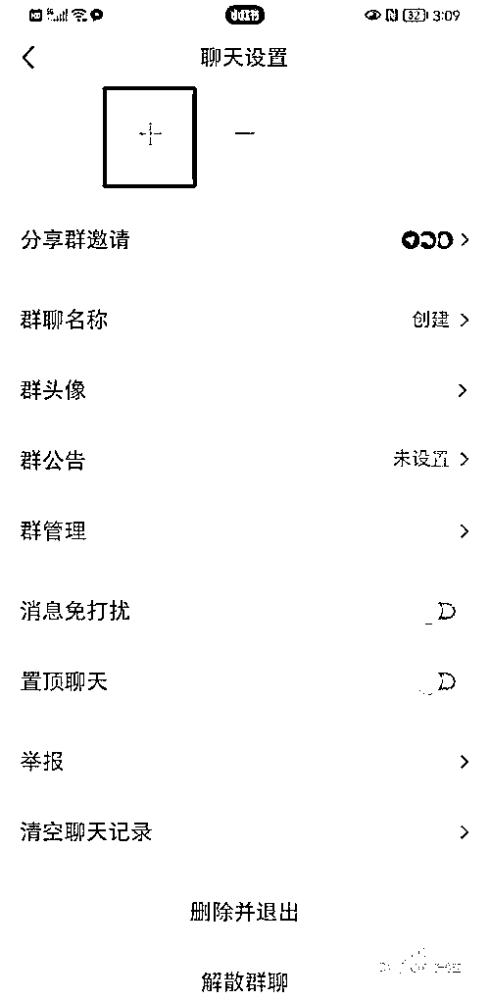

小号给大号评论并置顶入群方式。

在小红书中建立群聊的方法有以下两种：

方法一：直接建群

打开小红书应用，点击底部的“消息”按钮。

点击页面右上角的“创建聊天”，然后选择“创建群聊”。

输入希望的群聊名称，点击“立即创建”完成群聊的创建。

方法二：转移建群

如果账号无法直接在“开启聊天”中选择“创建群聊”，那么可以通过以下步骤进行群聊的转移：

找到一个可以创建群聊的账号，无论是亲朋好友还是随机账号。

使用该账号按照“直接建群”的方法创建至少五个群聊。

将每个群聊的“群邀请码”发送给您自己的账号。

通过接收到的“群邀请码”，加入到相应的群聊中。

在新加入的群聊中，点击“群管理”，将自己设置为管理员。

最后，在新建的群聊中点击“删除并退出”，这样群聊就被成功转移到您的账号上了。

确保所有群聊都设置了“个人主页展示”，以便其他用户能够看到群聊信息并申请加入。

以上步骤综合了搜索结果的内容，提供了如何在小红书上建立群聊的不同途径。

###### 笔记挂商品链接

在小红书上挂载商品链接需要满足以下条件：

要想在小红书上挂商品链接，商家需要具备一定的粉丝基础、实名认证、正常的账号状态

*   当前账号粉丝量达到1000人以上。

*   用户需已完成实名认证，并且年龄在18岁以上。

*   账号状态必须为正常，且在历史上没有出现违规行为。

*   如果商家想要在小红书上销售商品，他们需要申请入驻小红书社交电商平台。这通常涉及提供企业的相关资质和产品信息，然后等待平台的审核。只有在审核通过之后，商家才能获得添加商品链接的权限。需要注意的是，小红书不接受个人或个体户入驻，仅接受正规企业入驻。

*   商家需要有实体店或线上店铺，并提供相关证明材料以证明其合法经营身份。同时，商家需要确保所售商品质量可靠且有良好的售后服务。

### 2.项目如何放大

1.矩阵放大

多做几个小号评论区@大号，引导去大号店铺下单。

2.小红书直播

直播间里演示记账过程，直接挂商品链接，引导用户下单。

## 5.项目结论

成本很低，笔记制作简单，竞争也不是非常大，并且有利润空间，可以做。