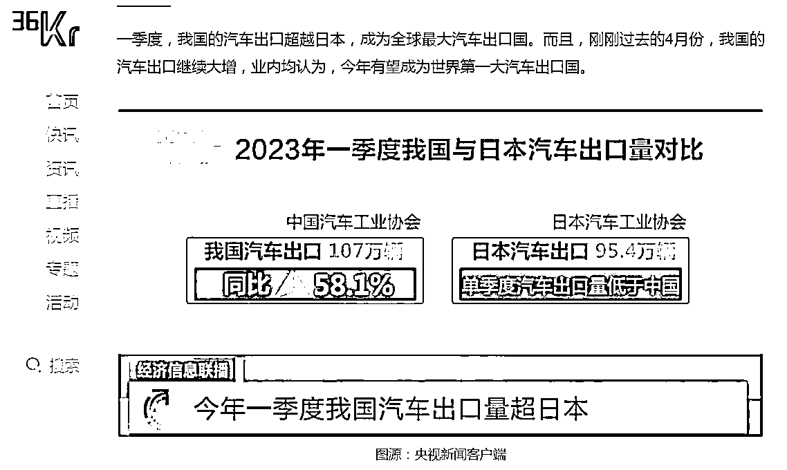
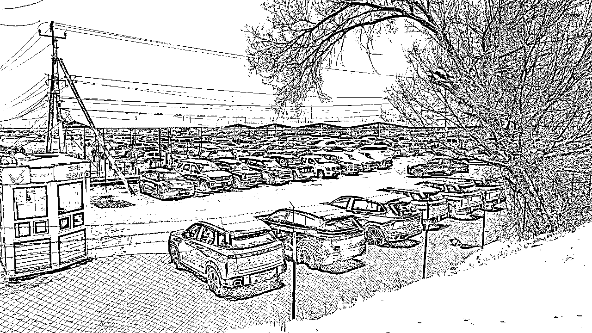

# 2023年卷入汽车出口“蓝海”的8个月，一线实践避坑忠告！ （2.07更新）

> 来源：[https://dop5miuclk.feishu.cn/docx/NIsUdCEiroH5ECxTUDocjMKAnUd](https://dop5miuclk.feishu.cn/docx/NIsUdCEiroH5ECxTUDocjMKAnUd)

# 写在前面

2023年的汽车出口，就是一场行业狂欢式的“盲人摸象” — — 公开信息所宣传的喜人数据背后，是整个业态的极度不成熟，和参与者无数的踩坑。

2024年，如果你仍然对汽车出口这个方向感兴趣，那么一定要读完这篇分享，再决定是否躬身入局？

汽车出口，行业狂欢式的“盲人摸象”

可能消息灵通的大家，已经看到过官方展示的，十分可观增长的数据。并包括36k，tx汽车，dycj等媒体关于汽车出口业务的报道。其中不乏月利润千万等创富神话。

但大家请相信，这篇回忆帖的内容，会更加贴近真实和细节。

我们的故事，从去年4月底开始...

# 目录

## Part 1）【政策机会 — — 这简直就是为我量身定制的风口！】

我是Jerry.俊，桃李出海的创始人。履历：

1）曾经供职于，字节跳动to B渠道业务，

3）在某出海业务创业公司，做过交付端项目管理和人力资源，

3）家里经营有一家15年历史的医疗器械出口贸易公司，熟悉机器产品的外贸流程；

*   整体上，懂管理、有出海经历、熟悉to B外贸流程，

*   这成了我欣然上路的很多底气，但回头来看有很多唏嘘，

*   且让我把这一年的经历，给你慢慢道来...

### 汽车出口的机会从何而来？

客观来说，主要有两个方面的要素，促成了这次机会出现，且附带着非常强的窗口性。

其一，在国家层面

这个事情开始于，2019年4月国家商务部颁布了一份文件，允许新车以二手车形式出口，并颁发出口许可证。但2019年往后，我们直接经历了三年疫情。困于国内运输不畅，和当时国际航运费用的暴涨，至此汽车出口的进度就被按下了暂停键。

这个事情真正开始被启动落地，是在2022年的9-11月份，起步于新疆几个口岸的边境贸易。这一批吃了第一只螃蟹的人，也是大家在各类公开报道里，看到的创富故事的那一批。

*   商务部文件：商务部 公安部 海关总署关于支持在条件成熟地区开展二手车出口业务的通知

*   36kr报道：看看人家！他们怎么赚钱了？｜2023年度故事-36氪

其二，在国际层面

在海外，特别是一带一路俄语区市场，大量对中国汽车的需求涌现，这部分的需求是来自于地缘冲突造成的制裁——大部分的产品，包括车辆在内的德系、美系，日系汽车都暂时退出了俄语区市场。但是，被制裁区域内，对汽车的需求是无法突然消失的，继而这些需求都直接转向了中国市场。

2023年出口贸易一个非常火热的市场，就是俄罗斯。可以说以俄罗斯为代表的，一带一路沿线俄语区国家，都出现了外贸业绩的增长。顺带着ozon平台等，也赢得了甚至来自amazon大卖等商家的注意力。这些情况，其实和汽车出口火爆的原因一致。

【小结】

汽车行业，汽车出口，是长期趋势。但是回头来看，对于汽车平行出口这个业务而言，其业务的窗口期：是集合了国家政策、国际形式、国内市场供给过剩，等多个影响因素的同时满足，是一个窗口性机会的业务，且这个窗口是转瞬即逝的。

对于目前有在做汽车出口业务的，分享几个近期建议考虑的“窗口”变化：

1.国内已经开放试点资质，从申请出口许可，过渡到了全面开放的注册制，人人都可有牌照。

2.中转国的关税发生调整，吉尔吉斯斯坦在2024.1.1将关税上调至20%。

3.主机厂下场速度非常快，超过预判节奏了，比如可参考极氪新年在海外岗位的招聘需求发布情况。

4.俄乌可能会在今年夏天之前停战，届时制裁会取消，其它国家的各类成熟品牌，会再次回归市场参与竞争。

### 和主机厂（官方车企）的竞争关系？

其实对于这个问题的思考，只需紧扣一个原则：当前一个阶段，你所做的事情，是否有利于主机厂的利益？如果是有利的，那么就是不会构成直接竞争，或出现被直接打压的情况。

平行出口的汽车，和官方出口的核心区别是，平行出口的汽车 — —

a. 能享受中国市场地区价格优惠。比如特斯拉，中国的采购价格几乎是全球最便宜。海外版各车型，部分地区价格会高出中国产很多。

b. 不享受官方质保，没有官方售后维修服务。

c. 车机，目前大部分无法调整为当地语言，无法解决联网问题的前提下，无法享受OTA（车机系统在线升级）。这个问题，也在平行出口行业里，衍生出了“刷机”这个刚需业务，但是目前业内还没有非常稳定的技术解决方案。

目前情况下来看，国内主机厂（车企）的一些经营动作，其实也给平行出口的贸易商带来不少压力。主要会有两个方面：

【海外端，主机厂官方下场】

*   主机厂国外销售端。主机厂在各个热门国家招募城市经理，市场经理，筹备搭建官方的销售和服务网络。这对平行出口贸易商，原先打通的本地化销售渠道，本地化服务，都会有较大侵入。贸易商除了价格，没有其他竞争优势（无法提供官方售后服务等）。

*   主机厂国内货源端。主机厂为了避免国际窜货乱价，逐步拒绝给出口贸易商供货（主机厂控货手段会有：出货罚款、或远程电脑锁车等）

【国内端，主机厂价格战加剧】

*   国内市场不断降价，造成口岸甚至海外监管仓的采购价，与国内实际零售价出现“倒挂”的情况，继而出货困难，利润也快速下降。

总之，这个业务仍然保持非常强的窗口期性质，风向变化极快。汽车出口，对国家层面来说仍然是持续的长期赛道，但对平行出口贸易商来说，不一定是。

### 这个业务的利润有多少？

以一台满配的理想L9为例，不考虑降价的情况，仅退税这一项，即可赚取5w人民币左右，如果还有优惠和积分兑换，那么利润就更高。行情最好的时候，一台理想，即使 to B，也能挣到9w。具体核算如下：

*   出口退税，11.5%，（45.98w+1w选装）*0.115=5.4w/台 （按人民币计）

*   直接对海外零售端的话，拿货价和售卖价的差价，行情最高的时候，差价利润可以做到国内零售价的翻倍！

但任何一个，（高利润+标准品）组合的业务，一定是不可持续高利润的。在如此高的利润的诱惑下，导致几个月内大量供应商（平行出口贸易商）的疯狂涌入。

至本帖子成文，到2024年1月份，小红书上已经出现了很多培训招生，这也从侧面说明，这个业务已经的利润已然下跌。

### 这个业务的长期终局是什么？

这个问题，在准备启动项目的初期就有深度思考过，也咨询过一些主机厂的朋友。综合他们的意见，和自己思考，我认为平行出口贸易商的终局可能是：

*   被主机厂收编。成为官方授权代理商

*   被主机厂收购。被回购销售渠道

*   和主机厂并行发展。相互补充，生态共享....

目前来看（2024年1月下），主机厂的动作非常快，估计能留下的只有后续服务和本地化的广告业务了，而且筛选标准会非常严格，因为主机厂错不起。关于为什么“错不起”，以及主机厂的本地化营销需求，这个可以后面另开一篇聊，这里就不多说了。

## Part 2）【实战采坑：国内苦苦摸索，突破信息差】

为了方便大家理解后文，我在这里快速和大家过一下各个“玩家”角色，和一般业务流程。

### 各角色利益链条，一般业务流程

#### 1.1 关键角色介绍

#### 1.2 整个业务流程大致如下

#### 1.3 一些关键步骤的，具体细节如下

##### 1.3.1开发客户，成单，收款（定金）

要做这个业务的两个关键问题：

Q1：去哪里找客户，怎么开发客户？

Q2：怎么成单，收款？

【市场分析篇】

在开发客户之前，基于当时和后面复盘后的认知，我们先来看一下对于汽车平行出口，全球市场在过去一年里，是一个怎样的情况：

-可以做的地区

*   东南亚：部分区域右舵，消费能力一般。清关和当地关系比较复杂。

*   一带一路沿线：主流出货俄语区市场（仅平行出口），但是价格战激烈！（仅批发端）

*   南美：基础建设差，运输时间长（占用垫资现金流）。但是一个很有潜力的市场。

-暂时不能做的地区

*   欧洲、北美：需要coc、VWTA证书用于清关，贸易商无法获取相关文件

*   非洲：消费能力跟不上，目前仍然以日韩低价汽油二手车为主，走迪拜中转

*   新西兰、澳洲：右舵市场，主要来自日本进口（日本同右舵）

小结：作为贸易商，如果没有很深厚的本地关系，唯一能选的只有一带一路的俄语区市场，加入价格战

【客户开发篇】

那么，往俄语区这个方向的市场，大家都是怎么开发客户呢？

-线下，一批占得本地化优势的人：

线下交易，尤其是车辆这种大件，往往有着天然的信任感。除此之外，有一个比较微妙有意的地方是 — — 有很多很多需求，在被传递到网上，或者传递到国内之前。它就已经在当地，或者口岸，也就是更靠近消费者的地方被快速填平满足了。而最终能在线上发生询价的客户，往往已经把线下都摸排了一遍。

当然，线下获客也有着它的差旅成本，对本地语言的要求等等门槛。本地化的红利，也对应要求着更大的本地化的成本付出。

-线上，这个方式的获客，大体也就是下面两个情况：

相对低效，投入大——注册各类外贸平台，运营平台，获得被动询价。另外还有包括技术爬虫等获取客户线索等，都可以归于这一类。这个方式，看似一劳永逸，其实落地层面，会发现流量的质量真的不高，对销售的承接压力是很大的。而且投入成本不低。

相对高效，投入小——走社媒开发，广告投流，主动邮件或电话海外车商。这是一个比较轻量级，且性价比很高的方法。但同样一个绕不开的问题是，汽车交易，特别是在首次，客户很容易要求看到线下实车或者他们能够眼见为实的办公场地。即，成交环节中，仍然有非常高的线下见面需求。

【成交篇】

在实战中，摸索了很久才看到的一个规律——本地有人，生意很好做。谈单方面，我们一开始认为：专业报价和及时响应最核心重要，但后来才发现，报价只是一个提供信息的作用。

而真正的信任建立，往往都是通过线下，或第三方本地有实力的商人背书，才方便达成成交。车辆的跨国交易，有着很强的线下属性。如果想着完全依赖线上去推进，至少在第一单的合作上，销售难度极大，也错失了很多的时间窗口期。

ps：收款（俄语区受制裁，有趣的小发现）

在监管仓交易时，数字货币的使用率非常高，u币丝滑兑换，最后由人民币、或美金现金付款。这些海外客户玩得特别熟练。

##### 1.3.2 国内采购、垫资

国内采车和个人买车有什么不同？

国内采购，最简单理解就是在国内把客户需要的车辆买下，过户，做好各类手续，准备出口。和个人用车购入似乎没有什么太多区别。但如果一旦上量，或者市场突然对某一款车型需求增长，就会发现车价和股票一样，是可以随行就市的。

比如，某个阶段非常火热的XYue L1852，懂行的人应该都明白我在讲哪一款车。几个月前，从一车难求，每台车利润丰厚。到不到两个月后，大批口岸同款车型堆积，每台车净亏3000美金抛货。市场需求是一方面，在趋势中有人炒货，是一个很考验采购决策的要求。你什么时候买，买多少，准备怎么卖都很有讲究。

这个情况的发生，也佐证了平行出口汽车这个生意，有着非常的窗口性，和需要敏感追逐趋势的属性。而这个敏感，只能来自于长期的采购经验，和散布全国的采购渠道，以及对利润的克制。

什么是“垫资”？

垫资一般是发生在国内采购环节，比如：由于对客户只收取了30%的定金，约定车到了口岸或运输到当地后再支付尾款的70%。

对于国内来说，只要需要把车从门店或工厂提走，就必须要支付全款。继而，这70%的尾款，就会由资方先行垫付进来。

【注意避坑】

垫资资金的不可控风险*具体情况解释：

1.  资方运转正常，但贸易商出货量太大，垫资需求大于资方能够承受的金额，导致贸易商错失成单机会

1.  资方运转正常，但决策缓慢，导致贸易商错失成单机会

1.  资方单方面因各种原因，拒绝履行契约。导致贸易商拿不到应有利润

##### 1.3.3 国内车管所上牌

为什么会有这个步骤？在商品车出口里面，当时有两个情况，海关是会予以放行的：

*   情况I：主机厂出口，或官方授权商出口，车辆按国家标准定价，车价配置也是目的国标准；

*   情况II：二手车出口，适用二手车出口许可证政策；

把买来的车操作上牌啊，就是因为贸易商能走的就是情况II的平行出口（即二手车出口）。但实际车况是全新的，未使用。

再将这类0公里行驶数的“二手车”，按二手车出口政策获得出口许可证，安排出口手续。去到目的国后，终端销售仍会按全新车出售。

##### 1.3.4 办理出口许可证

出口许可证，是海关和商务局部门，为了控制出口质量等方面的考虑，只允许试点企业办理的通关文件。

Q1) 第一批试点公司，是以什么标准被筛选出来的？

非官方的说辞：大体参考了资金实力（需要冻结千万保证金），过往在国内的汽贸规模。但没有太多要求出口贸易、出海能力。

Q3) 试点公司，为什么要“出租”牌照？

*   试点公司是有业绩对赌的，若当年没有完成对应体量的出货量，则第二年就无法继续维持试点资格。在出口业务实际推进过程中，有大批的试点公司都发现了这个问题，

*   同时也有越来越多有能力找到海外销售线索的出口业务员，两边的信息撮合中，就出现了“出租”牌照的现象。试点公司会从每台出口的车上抽取牌照使用费。

Q4）未来的试点牌照，将会是一个怎样的变化？（窗口期缩减，竞争加大）

二手车出口“试点时代”或结束 全面开放前奏吹响http://www.ce.cn/xwzx/gnsz/gdxw/202312/19/t20231219_38834082.shtml

2024年，对于汽车平行出口，会是一个人人可出口的政策。这个变化，其实从我的角度来看，是真正把大家拉到了同一个公平竞争的市场环境里。对平行出口的贸易商，就是直接能看清大家的实际销售能力。

对于之前，靠“出租牌照”获得极高出车量，刷流水的试点公司，会被打回原形。而那些能够在海外，本地化深度经营，打通海外销售渠道的公司。这些真正意义上的出海者，能够降低交易成本和简化行政手续，真正在竞争中占得先机，获得应有的利润。

##### 1.3.5 国内、国际运输

往俄罗斯方向的，运输走陆运，一般都用笼车。海运则会涉及集装箱或RORO（滚装船）等形式。

这里讲几个小细节：

*   为了控制运输风险和把控进度，出口贸易商，在中后期基本都能做到，每台车都需要装地理定位GPS，用来判断：车辆没有发生盗抢，或者异常的途中停留（比如运输卡车坏了，但是司机为了规避责问，一直选择不上报情况，造成了运输延误）

*   直到去年年底，业内的最高交付标准是：迟到一天，赔付每台车100美金一天。也就是说，时效问题，在任何一方看来，都是非常关键的一个问题。

ps：如果能选到一支高质量的运输团队，甚至自建运输车队，是可以在竞争中可以获取较大优势的业务手段。准时交付，及时交付，不仅有利于资金回笼，更是建立交易信任的核心。

##### 1.3.6 海外清关和“灰度”操作

车辆达到海外之后的清关，几乎是一个灰色地带，只有持有本地护照甚至说本地语言的当地人才能做。

1.  为了降低关税等交易成本的“灰度”操作

*   低价值申报。低于货物实际价值申报海关，降低税负；如果能有较好的海关关系，这部分后期被抽查的风险会得以降低；

*   车辆过户到个人户头。可以理解为国内的“背户”，这批人都是会有当地人专门组织，然后再将车辆过户到车商或者其他的c端客户名头上。

*   收付尾款的问题（此处不做具体讨论）

1.  为什么是本地人才能做？因为具体需要

1.  海关关系

1.  组织当地人“背户”

ps：本地化的深度链接，往往都在这些敏感的对接环节，解决了一个个非常微小但又很容易造成整个交易流程卡顿的业务细节。真正的出海，一定是能够依托当地资源，稳妥低成本地解决当地的问题。

##### 1.3.7 国内段出口退税

“出口退税”的定义是：出口货物退税是对报关出口货物，退还在国内各生产环节和流转环节，按税法规定已缴纳的增值税和消费税（主要是增值税）。退税金额=开票价*0.115。

一般是退税操作是由试点公司全权操作。 影响出口退税的结果和时效的因素有很多，比较常见的是：

1.  退税相关资料是否准备齐全且符合要求（导致驳回、延期）

1.  当地税务部门当月退税预算额度是否够用（不够用，会导致退税延期）

1.  公务员是否恰逢假期（导致退税延期）

退税最怕出现的就是退税延期，因为会对贸易商的现金流造成影响。

### 出海业务无非就是追求一个信息真实！

对于上面的业务流程和细节，作为也算是第一批进入的外行，我们没有任何可学习参考的资料，完全依靠各路信息和认知的拼凑，花了几个月的时间，理清楚了全部业务流程和细节。

除此之外，我们在对海外市场的理解上，也也耗费了我们很大的精力去获取真实信息。甚至因为对中亚，一带一路方向的业务情况的不了解，做出了错误的战略判断——将年初几个月的窗口时间，都放在了开发迪拜中东市场上。

我们在业务起步阶段，遇到的坑有：

*   中东地区的客户，早早确立了供应商，但却会套取正式报价，再拿回去压价。成交条件是在当地有展厅。

*   中东地区，在五月份左右过后的一段时间内，因为国内大供应商的大量铺车，直接把当地特斯拉价格拉到了低于成本价出货。

*   往俄语区方向的客户，对价格和交付条件要求越来越苛刻，不断抬高成交条件，甚至要求100%垫资，送车上门。

*   有非洲客户，一次就是几百台的询单量，但是最后总是杳无音讯。

*   一些欧洲地区的客户，自己也不清楚是否可以进口清关，带来了很多无效的询价。

现在回过头看，如果当时对当地海外情况能够有本地资源，实在可以节省太多时间和精力，就能够把有限的资源投入在最高产出的方向上。

除此之外，我们还去到了秋季广交会的现场，以及大湾区第一届新能源汽车出口展会。我们在展会和外商客户聊了一下，也是得到了很多有价值的真实信息：

*   海外的资金成本高，客户不愿意轻易上杠杆拿车

*   同行价格战，同行交付欺诈频发，丢失基础信任

*   来自日韩的竞争仍然很强，特别是销售渠道上底子深厚

*   配套服务几乎为零

至此，国内段的情况了解得比较全面和深入了，我们也非常确定，只有躬身实地到海外去看本土的实际情况，才能真正明白，汽车出口的业务到底应该怎么做？！我决定出去看看！

## Part 3）【出国考察，一线认知，重启出海2024！】

飞抵吉尔吉斯斯坦首都比什凯克，次日就去到交易市场，调研市场情况。

### 出口贸易商在海外“伪出海”

（监管仓非常小，有好几家外面摆放了大批国产车的，都是中国供应商）

去到海外批发市场的一线后，有了以下发现和感受：

*   国产新能源汽车对于俄罗斯地区有强烈的玩具属性，toc的利润空间确实很高

*   大部分人，看似在出海，其实仍然在做着国内供货的角色，只不过供货的节点，越来越靠近一线市场罢了。

*   大部分从业人员，都在“伪出海”。他们虽然已经人&车都在海外，做出口业务。但实际上，他们仍只能把车卖给了极少部分中国人。而这批“极少数”，在当地有着良好的商业关系，能够有效接触到对方国家的批发商，甚至到进入到对方的终端市场直接零售。

*   作为“伪出海”的供货方，在口岸、甚至监管仓堆积的车，不断被按头杀价。

*   也会有一批中国同胞，去到了俄罗斯TY汽车城租赁场地。但实际上，这个汽车城是由中国人包租下来的倒闭二手车场地，再转租给国内想要做汽车出口的这批贸易商或试点公司。（而这个地方，距离俄罗斯莫斯科地区的主流商业区也有100公里的距离，并非主流能够获取客户的好地段。）虽然也算勇敢踏出了出海这一步，但是却没有走对方向。

### 真正的销售渠道，都在外商手里

另一个在海外的真实情况是，几乎100%零售渠道，都牢牢掌握在外商手里。但同时，也会有一批中国人，因为入局比较早&承担了足够高的风险，或找到了靠谱且有实力的外商合作伙伴，也能把车直接卖给c端客户。

除此之外，比如说口岸货，大部分其实都仍然挤站在国内段的供货商角色上。大部分利润都被压到很低，甚至夸张的交易情况有，十几万售价的单车，销售利润仅剩几百块的地步。

那么，一般什么样的本地人，能够承担出口汽车的外商角色？

*   进口汽车销售从业人员（熟悉日韩进口）

*   有高端人脉的当地人（比如，当地的房地产商、高级酒店主管）

*   汽车相关的当地网红（通晓本地文化，有精准本地流量）

他们的共同特点都是：是本地人，在本地有足够的资源，能打通高效率的销售渠道。

【小结】

不难发现，本地化的人脉资源，会带来的巨大的经营优势！真正的“出海”—— 一定是认真本地化，深入理解当地，才能够把业务扎根到海外去。

### 出海做生意，更需要知己知彼

还有一些印象非常深刻的体会是：我原以为，在“贫穷落后”、人们对于服务、产品质量不是那么挑剔的中亚小国家吉尔吉斯斯坦，他们看到我们中国的产品，质量又好又便宜，应该喜欢得不了吧？所以，把车卖给他们一定也不需要什么服务，只要把车送达，交到他们手上，他们就一定很开心，万事大吉了！

其实呢，在当地生活的一个月中：无论是当地的【产品质量、性价比】，还是【服务水平】都让我深深惭愧自己的非常自大的心态。举例来说：

*   当我采购床上用品时，发现他们的毛毯都是土耳其生产，且质量手感超过任何一家国内四星级以上酒店的配套用品。更要命的是在价格上，和我们江苏南通的产品依然很有竞争力；

*   十几人民币，可以喝到一杯吊打国内主流咖啡品牌的浓郁咖啡，或巧克力热饮；

*   几乎所有服务业的工作人员都能够真诚热情，耐心细致地提供服务。

更隐蔽的是，在海外，还有着一些不同的【商业文化上的差异】

在商业文化层面，这些前苏联国家，其实仍然保有着很深的社会主义的交易文化。整个营商的气氛，并不是那么市场化。

反而，他们更在意更关注是产品质量、业务的长期价值，个人和业务的口碑。在建立信任，或有本地有实力的中间人背书后，很多业务都会比容易成交。且因为国家人口很少，圈子很小，整体的社会信誉度极高。更不用说有中间人做引荐背书的情况下。

启发点：

中国新能源电车，为什么突然在这些地方很好卖？因为，这类汽车，恰好满足了他们的消费习惯，就是要质优价廉的产品。更何况，对于一些当地富豪来说，我们的高端电动车，对于他们除了质量过关以外，也带有一定的玩具属性，可以作为他们社交时候的谈资。在俄语区买一台理想，差不多等于五六年前，我们在国内买一辆保时捷卡宴那样风光。

至于服务，我们和他们的差距，对生活的美好的理解，差距不是一点点。而这些非常细微的认识，都必须深入到当地，并和当地人有过交往后，才能够比较零碎地体会到。继而，这些认知才能够更好地指导国内向海外出海的整个思路和动作。

# 【写在最后】

## 针对2024年想做汽车出口的新人，自测判断是否适合加入？

适合的条件（以下满足一个即可加入，由易到难）

看起来合适，但是其实可能不适合入局的

2024年，汽车出口对于普通人的机会是什么？

找到精准的销售线索，做好国际“二批”的角色，0风险赚取高额“佣金”（一般能给到30-40%）

具体最性价比的方式，可以通过：

a.线上，社交媒体内容营销，拿到whatsapp和具体需求，批量获取销售线索，再合作交付方

b.线下，利用海外资源（比如是俄罗斯当地留学生），打通当地c端交付渠道，帮助国内贸易商直接触达c端进行出货。

还有一些其他卖铲子的服务，比如技术党，或者非常擅长国内获客的“普通人”，可以深度关注一下给车机刷到英文或其他当地语言的服务，目前的行情是每台车的服务费用都在不断上涨。说明技术供给很稀缺，但是需求量一直在上涨和非常刚性。

ps：我就曾经遇到过迪拜客户想要采购六台理想，但是在最后环节，因为车机当时无法刷成英文，并解决联网问题而丢单

再次友情提醒大家，汽车出口做得好的话，确实是很赚钱，无论是单车利润还是整个市场规模。但同时，它也是一个非常吃需求趋势和窗口性的机会，和某些gambling游戏里面，追波浪的感觉差不多。市场有风险，上手需谨慎！

项目风险提示

汽车出口整个业务链条很长，涉及的合作方也很多，再加上本身整体行业的管理水平就落后于诸如跨境电商、出海的互联网企业等，继而会造成有各种风险存在。

当然对于，仅仅参与营销和销售环节的小伙伴来说，整体风险对比收益还是非常低且能够承受的。

另一种情况是，假设如果是有直接动用资金，并深度参与整个贸易流程的话，就会有以下一些风险会需要注意规避的：

-采购环节

汽车出口，车源供给方往往鱼龙混杂。对于非常热门的车型，太过于心急拿车，曾经就出现过供应商不断收取定金然后突然跑路的情况。我们的建议是，一般新手就不要参与“炒货”— — 对一个时期内的热门车型追涨杀跌，尽量只做一些普通款就可以了。

-销售环节

付款和发货的先后会需要特别注意。对于第一次合作的客户，或没有中间人背书的情况下，一般建议新手村，要从小单做起，尽量收到全款后再发车。

-运输环节

最常见的便是“运损” — — 新车在长途运输的过程中发生了磕碰，甚至运输车辆的事故。国内段，一般都有保险还是比较好处理。但如果是境外段，往往理赔难度会极大提高。

（规避建议：尽量选择成熟的运输车队，在追求时效的同时，也要尽量提高对安全运输的要求。购买足额足段的保险，询问或自行建立标准的理赔流程，避免在发生磕碰时，发生无人负责的状态。）

另一个风险，便是发生路途中的盗抢，但是这个一般运输车队对有自己的应对措施，相对来说发生的概率很低。只是一旦发生，造成的损失会比较大。

-金融环节

1.  销售地当地货币的汇率波动。一般来说，都是只认人民币或美金结算。

1.  如果是通过一些特殊渠道转款的，同样也要注意甄别欺诈，最好在最后一首还是只接受现金或正常的银行转款即可。

## 2024，我们将全面实地出海！

*   在2024年，将继续做好汽车出口的“业务方”角色。继续以各种不同形式，去到海外一线，不断增强在当地的业务落地能力；

*   在2024年，搭建链接：海外人士和国内出海老板的交流平台。 在之前的对外贸易经历中，我们反复认识到了本地化信息，和海外落地的重要性。这个平台，旨在让更多的国内外有志于促进中国企业出海的人士 一起解锁海外真实信息，务实落地地出海。同时，我们也会对内做好打破一线信息差的服务，对外我们也积极把国内的需求，和我们强大的供应链，链接给已经深度出海的海外同胞们。

在出海搞钱的路上，有以下几个原则，我认为是比较重要的，和各位老板共勉：

*   保持独立思考

*   保持不被带情绪

*   永远相信市场是对的

*   永远交叉验证非一手信息

2024 桃李出海，一起加油！