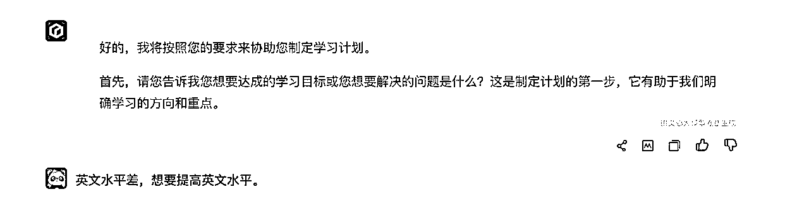

# 用 AI + 思维模型 探索问题的全新解答

> 来源：[https://zzi7a49xoa.feishu.cn/docx/TA9bdK4N2oIfC5xHnyXcn3cFn7e](https://zzi7a49xoa.feishu.cn/docx/TA9bdK4N2oIfC5xHnyXcn3cFn7e)

# 一、引言

大家好，我是 熊猫Jay 🐼，聚焦于 AI 职场提效和提示词。这次分享如何利用 AI + 思维模型 的运用突破常规思维，探索问题的全新解答。大家可能会有以下疑问：

我们为什么要了解思维模型？它有什么作用？

职场上有哪些常见的思维模型？

AI 时代下，如何更方便快捷地使用思维模型呢？

在快节奏、高效率的现代职场中，面对复杂多变的问题和挑战已成为日常。无论是时间管理、决策制定还是团队合作，每一项任务都考验着职场人的智慧和应变能力。

过去，我们如果要利用思维模型，前提是获取对应思维模型的要领，并且在多次实践后，才能熟练运用。

这个对于 不少刚进入职场的年轻人相对困难，他们往往对这些模型知之甚少，导致他们在面对复杂问题时手足无措。

即使是经验丰富的职场高手，也可能因为不熟悉或记不住这些模型，而无法在关键时刻迅速有效地应用它们。

AI 时代已经到来，借助 AI 的能力，我们只要大概了解思维模型可以解决哪些问题，应用在哪些场景。不需要记住所有细节，也可以很快运用起来。

如果你拥有一个拆解了思维模型最佳实践的 prompt，那你从 AI 那里得到的内容质量将会更高。

那如果我们没有对应的 prompt，不了解核心逻辑，也没有编写提示词的能力，该怎么解决问题呢？不用担心，我也准备了一个简单的方法，借助 AI，帮助大家快速获得解决问题的思路。

# 二、思维模型有什么作用？

## 一）什么是思维模型？

思维模型是用来简化和解释复杂现象的框架或概念。

它们是一种认知工具，帮助我们更好地理解世界、作出决策和解决问题。通过应用思维模型，我们可以从繁杂的信息中提取有用的知识和见解，形成有效的策略或解决方案。

思维模型的大致种类：

*   战略与决策模型：如 SWOT分析、MECE原则 等，专注于帮助个人或组织做出更好的决策和解决问题。

*   目标设定与执行的模型：如 SMART原则、PDCA循环 等，这类模型提供了设置和实现目标的框架，确保行动的指向性和高效性。

*   系统思维模型：如 反馈循环、杠杆点 等，用于理解和处理复杂系统及其动态，促进整体观和互联性思考。

*   心理学模型：如认知偏误、习惯形成等，揭示人在认知和行为上的模式和偏差，帮助理解和预测人类行为。

*   学习与创新模型: 如 费曼学习法、思维导图 等， 这些模型旨在促进知识获取、深化理解和创造性思考。

其中涉及的思维模型并不多，仅仅涵盖了本次分享要介绍的几种常见思维模型。


## 二）思维模型到底有什么价值？

思维模型有多么重要？

如果底层思维模型都是错误的或者狭隘的，那么我们的很多思考和解决的问题都可能失去意义。

因此，思维模型也决定了我们看待事物的角度和解决问题的效率。

我们从找工作这个故事来看看思维模型的重要性：

绝大多数的旧思维是：好好学习，考上知名的大学，学习专业的知识，找到待遇丰厚的工作岗位，获得不错的薪水，然后幸福的生活下去。

而另外一个思维是什么?

当我们作为打工者时，从产品制作、加工，一直到最终交付给终端用户存在一条足够长的价值链, 我们常常位于整个价值链中的某一个小区域。

对于整个价值链的机制、自身所处的位置和价值，很多人可能非常模糊。 尤其是在大环境恶劣的情况下，我们是否具备足够的反脆弱能力，往往取决于我们对于这个价值链的深刻理解和对自己在其中的定位。

如果我们理解价值产生、价值传递，到被尊重的完整过程。 通过这条道路，经过努力之后所得到的回报是在很多固定岗位上所得不到的，而且它还能够帮助我们在不同领域中找到更多的机遇和捷径。

这个思考方式，正是从一个全新的角度来分析工作的价值，从而打开了一个思想新世界。

简单来说，思维模型有以下几个好处:

1.  简化复杂性：思维模型通过提供简明的框架和原则，帮助我们理解复杂的现象和问题。

1.  提升决策质量：通过运用合适的思维模型，我们可以更全面地分析情况，减少盲点，提高决策的有效性和准确性。

1.  促进学习与创新：思维模型能够促进跨学科学习，帮助我们从不同领域获取见解，激发新的思考和创意。

1.  指导行动与实践：清晰的模型可以作为行动的指南，帮助个人或组织在面对挑战时制定策略和行动计划。

如果说文字是花朵，它使得人类的思想世界铺满一片花海，那么思维模型更像是一座座建筑或大厦，或道路或桥梁，它能让我们在自己的思想世界里建起一座辉煌的都市。

# 三、经典思维模型

思维模型那么多，我们都需要记住吗？

查理芒格说: 一个人掌握 80-90个模型，就能够解决绝大部分问题。而这些模型里，非常重要的只有几个...

所以我认为模型不再多，在于适合自己，当我们在使用的同时，也需要甄别真正适合自己的模型，把他们加入到我们的武器库中来武装自己。

我们来学习或回顾一些常见的思维模型：

由于本章内容略显枯燥，我先预告下一章节的内容，在下一章节中，我会结合AI + 思维模型来解决职场问题。

## 一）费曼学习法

费曼学习法是以诺贝尔物理学奖得主 理查德·费曼 的名字命名的学习方法，它强调通过 教授他人 来深化个人理解和知识的掌握。


### 1、定义

费曼学习法的本质特征，是强调知识从学习到吸收，还得再输出才能算完整的学习过程。

如果没有输出，那只是对知识的眼见，耳闻，知识让大脑知道而已，而费曼学习法的达成标准，是让知识通过我们的嘴巴教给下一个人，从而让下一个人的大脑达到知道的水平，这样一整套流程下来，我们才算真正掌握了知识。


基本上分为以下几步：

1.  选择一个概念: 挑选你想要学习或理解的概念或者知识。

1.  教给他人：以通俗易懂的方式向他人解释这个概念，帮助他人理解。

1.  回顾和简化：在解释过程中遇到困难时，回到书本或参考资料中去查找问题，然后继续以简单的语言表达出来，持续循环教授知识的流程。

1.  组织和比较：整理知识点，比较不同来源的信息进行评估可靠性和差异，再主动思考和深化理解。

就比如我这次讲 AI + 思维模型 的内容一样，我不仅花了大量时间来收集资料和学习，来进行过脑子，并且我在过程中进行了多次实践，把理论+实践所产生的知识通俗化的方式呈现给大家。

目的就是为了深化知识，再教给大家。当然，这个过程中也会经历不断的回顾和迭代来继续完善。

### 2、应用场景

*   个人学习：在学习新知识或技能时，用以加深理解和记忆。

*   教学和培训：教师或培训师在准备教材和教学计划时，确保内容清晰易懂。

*   知识分享：在工作或社交场合，当需要向他人清晰地传达复杂信息或概念时使用。

### 3、优势

*   提升理解和记忆力：通过教授他人，你被迫以更清晰的方式组织和阐述知识，从而加深自己的理解。

*   识别盲点：在解释的过程中，你很容易发现自己对某些部分理解不够充分的地方，从而有针对性地补充学习。

*   促进创新：在尝试用不同的方式解释同一概念时，可能会激发新的思考和理解路径。

费曼学习法，正所谓费事（费），又慢（曼），但是在过程中，知识可以真正变成我们自己的东西。

## 二）MECE 原则

为什么有人思考和表达又严谨又清晰？

那么这类人对于 MECE 的理解应该是相当到位的，即使他们不了解这个原则的定义，但是一定在思考或表达时做到了观点的互相独立和穷尽！

### 1、定义

MECE原则（Mutually Exclusive, Collectively Exhaustive）是一种思维工具，用于确保在分析问题或组织信息时，各个部分既相互独立（Mutually Exclusive）又全面覆盖（Collectively Exhaustive）。

简单来说，就是把问题或信息分解成没有重叠的部分，同时这些部分又能完整地覆盖整个问题或信息领域，做到不重叠，不遗漏。


举个例子，想象你是一个大型聚会的策划者，负责为聚会准备食物。你需要确保每位来宾都能找到他们喜欢的食物，同时避免食物种类之间的重叠。按照MECE原则：

1.  相互独立：你将食物分为不同类别——比如肉类、蔬菜、甜点、饮料 、水果、主食 和 其他，并按照这七大类进行划分食物的摆放位置。每一类食物都是独一无二的，没有重叠。这样，客人在选择时就不会迷惑，比如米饭不会既出现在主食也出现在甜点中。

1.  全面覆盖：在确保分类的同时，你还需要保证每个类别都有足够的选择，确保所有食物需求都被满足。例如，肉类应该包含牛肉、鸡肉和猪肉等，蔬菜类包含沙拉、炒蔬等，从而满足各种口味的选择。


此外，有一点需要提醒下，当我们在分类时，为达到完全覆盖，我们可以 其他 这一选项来囊括 无关紧要的、不想提及的或者没想到的类别 。这样不仅保证了严谨性，同时也省去了处理大量弱相关信息的麻烦。

### 2、应用场景

*   问题解决：当面对复杂问题需要系统化分析时，MECE原则帮助清晰地划分子问题，避免遗漏或重复。

*   信息整理：在准备报告、演讲、撰写文档、分类、或者写提示词时，MECE原则确保所有相关信息被有序且全面地呈现。

*   项目管理：在项目规划和执行过程中，MECE原则帮助团队明确任务的界限，确保资源的有效分配。

### 3、优势

*   清晰性：通过排除信息重叠，MECE原则提供了一个更清晰、更易于理解的结构。

*   全面性：它强调全面覆盖，确保在分析或规划时不会遗漏重要的部分。

*   系统性：MECE原则提高了思考和解决问题的系统性，有助于形成更加条理清晰的逻辑链条。

## 三）SMART 原则

### 1、定义

SMART 是一款用于设定优质目标的思维模型，运用具体的、能测量、可实现、相关性、有期限 这 5 个因素来审视目标，提高目标、设定质量，从而提高做事效率。


我们开看下五大因素的含义是什么：

*   具体的：指目标是什么？通过设定具体的目标，减少模糊性，使每个人都能清楚地理解目标。

*   能测量： 指我们明确的目标达成的程度或者进度，比如，我们现在做了多少，还差多少，这些都需要明确出来，让进度和成果做到可量化。

*   可实现：简单来说，就是目标在我们能力边界上，通过努力可以达到的。而过高的目标或者完全不可实现的目标是需要排除的。

*   相关性：确保目标是与个人、团队的长期价值观保持一致的，每个人都会愿意为之努力和奋斗。

*   有期限：设定目标的目的是为了提高紧迫感，促使目标可以按时完成。

其实 SMART 原则 本身的顺序是错的，为了满足凑成SMART所以打乱了顺序，正确的顺序应该是 R -> S -> M -> T -> A 。

先确定事情和自己是否相关；再考虑具体要做什么；接下来要考虑这件事情需要经历哪几个阶段，做具体哪些事情；

随后，我们要了解这些事情多久才能做完，截止时间是哪天；再最终评估事情的可实现性，如果事情一定要做，但是不能实现，需要怎么进行调节。

举个例子，比如当萌生了 我想更加有钱 这个想法：

为什么（相关性）：有钱可以实现时间和空间的自由，可以做自己想做的事情！大方向没有问题。

做什么（具体的）：是努力上班升职加薪，还是另谋出路自己创业，还是做副业。

怎么做（能测量）：确定好定位后，规划每个阶段要做什么事情，哪个阶段可以变现，变现后怎么放大自己的价值等等。

做多久（有期限）：这个目标要做多久，30岁以前，还是40岁以前。

是否可行（可实现）：检查下自己的能力是否具备，还是说痴人说梦。如果不具备，是否先考虑降低预期，完成相对合理的目标。

把这些想清楚，一定比最开始只是喊喊口号强。

### 2、应用场景

*   个人发展：个人可以用 SMART原则来设定职业发展目标、学习目标等。

*   项目管理：项目团队设定项目目标、里程碑和关键绩效指标。

*   企业战略：企业制定年度目标、市场推广策略或产品开发计划。

### 3、优势

*   可追踪：可衡量的目标意味着进度和成效可以被追踪和评估。

*   责任分配：确定目标责任人，确保每个目标都有人负责。

*   相关性：确保所有目标都与个人、团队或组织的长远利益一致。

*   时效性：设定时间框架，增加紧迫感，促使目标按时完成。

## 四）SWOT 分析

### 1、定义

SWOT分析 是由著名管理学教授 海因茨威里克 首次提出的一种策略规划工具，用于帮助个人或组织识别其项目或业务策略的 优势(S)、劣势(W)、机会(O) 和 威胁(T)。

最初主要用于企业发展战略的制定，现在也被广泛应用到各个领域，包括广告营销、经济管理以及个人发展分析等方面。


过去,我和很多小伙伴一样, 使用 SWOT分析时, 按照时间的维度来区分优势、劣势、机会和危机, 认为当前的有利条件和不利条件为优势和劣势, 未来存在的有利条件和不利条件为机会和风险, 这样是错误的。

正确的方式应该是以内部、外部、有利、不利作为基础坐标而生成的，内部有利为优势，内部不利为劣势，外部有利为机会，外部不利为风险。而至于是不是未来的，也要看是当前分析对象的计划和外部因素来决定。

按照最终形成的坐标，我们把各个象限的信息收集好后，是不是完成了？

不，这样还不够！


我们还需要做一步， 需要重新分配线索来导出一个可操作的结果，即将 SWOT 两两叠加，产生 4 个具有指导意义的问题：

*   利用哪些优势来抓住什么机会

*   利用什么机会来化解哪些劣势

*   利用哪些优势来避开什么危机

*   在什么危机中规避哪些劣势

这样你就可以在有限的线索中，按照组合填空的游戏形式，找到可以指导接下来行动的答案。

注意：使用过程中有两个技巧， 我需要提下：

*   客观评估任何维度，不掺杂任何感情。

*   分析要全面，但不是越复杂越好，理清主次，不重要的放后面或者干脆删除。

### 2、应用场景

*   项目规划：在启动新项目时，评估项目潜在的优势和风险。

*   业务战略：对企业或部门进行整体评估，制定或调整战略计划。

*   职业发展：个人可以使用SWOT分析评估自己的职业路径，识别成长机会和潜在挑战。

*   竞争分析：分析竞争对手的状态，制定相应的竞争策略。

### 3、优势

*   全面性：提供了一个全面分析框架，考虑内部和外部因素。

*   灵活性：适用于个人、团队和组织的各种情况。

*   简单易懂：容易理解和实施，不需要专业的技术或知识。

*   促进团队讨论：作为一个团队活动，可以帮助团队成员共同识别问题和机会。

## 五）六顶思考帽

### 1、定义

六顶思考帽是由 爱德华·德·波诺 提出的一种思考框架。

它将思考过程分解为六种模式，每种模式由一顶具有不同颜色的“思考帽”代表，旨在从不同角度全面审视问题，帮助个人或团队更有效地进行思考和讨论，它可以使混乱的思考变得清晰，使团队的争论变成集思广益的创造。


六种思考帽及含义：

*   白帽（信息）：关注信息的收集和整理，保持客观和中立，区分清楚事实和观点，且不做任何评论。

*   红帽（情感）：不需要思考，直接了当表达情感和直觉，不需要解释和辩护。可以理解成一个杠精。

*   黑帽（谨慎）：批判性思考，关注风险和问题，运用否定怀疑的看法发表负面的意见，找出逻辑上的错误，能掌控住绿帽天马行空的想法，也能质疑黄帽的判断。

*   黄帽（乐观）：保持表现正面的、乐观的、充满希望的、建设性的观点，可以是对白帽思考的评价，也可以是对绿帽结果的正面判断。

*   绿帽（创造）：不论对错，全力寻求新的可能性和替代方案，保持创新的思路，供其他帽子进行参考。

*   蓝帽（控制 + 总结）：不参与问题的思考，只控制整个思考过程，确保每个帽子得到有效使用：前期规划各种帽子的使用顺序和使用次数，中期负责控制他们的深度和思考时间，后期负责推出最终的结论。类似于一个会议的主持人。

注意点：

1.  同一时间内，只能允许思考者带一顶帽子。无论个人还是团队，不能同时存在两种声音。比如收集信息的时候就说这个没用，那个好，批判的时候还要接受，对批判进行批判，这样还是会回归混乱，互相扯皮

1.  除了蓝色帽子只需要一个带之外， 其他每顶帽子每个人都需要带，这样每个人在每个方向的经验和智慧都能可以充分发挥。特别是极其反对的人需要在戴黄帽上发表乐观看法，极其同意的人需要在戴黑帽时发表悲观看法。

1.  顺序不固定，需要根据课题进行调整。

### 2、应用场景

*   问题解决：通过不同的帽子切换，全面审视问题，找到更全面的解决方案。

*   会议讨论：在团队讨论或脑力激荡时，明确不同阶段的目标和思考方式，提高会议效率。

*   个人决策：帮助个人从多个角度思考问题，做出更全面和深思熟虑的决策。

### 3、优势

*   促进全面思考：鼓励从不同角度审视问题，避免单一的思考模式。

*   提高讨论质量：明确讨论的目的和方式，减少无效和情绪化的争论。

*   增强创新与解决方案的多样性：特别是通过绿帽思考，鼓励创新和寻找新的可能性。

## 六）小结

本次准备的思维模型讲差不多了。

当然，还有很多实用的思维模型，比如 结构化表达思维模型，如 SCQA、金字塔原理等等，这块知识以及实践，我会在以后的时间里分享给大家。

# 三、案例实践

看来这里，可能有部分人已经有点犯困了，哈哈。的确以上的理论偏多一些，大部分是我充分理解后，用相对通俗的方式阐述给大家。即运用费曼学习法的方式来深化知识。

那接下来，我们结合案例来看看如何利用 AI + 思维模型解决问题。

## 一）利用 AI + SMART 安排学习计划

### 1、需求

在这个快速变化的数字时代，职场不再是一个静态的战场，而是一个不断演化的竞技场。每一天，新的技能和知识都在重塑我们的职业轨迹，而那些能够迅速适应并掌握这些变化的人，正悄然成为职场的领跑者。

掌握学习方法固然重要，但是一个良好的可执行的，可落地的学习计划也非常重要。

那我们怎么制定一个有目标、可量化、有期限的学习计划呢？

结合我自己目前比较一般的英语水平，以及想要提高英语水平的需求。

我们一起如何利用 AI + SMART原则 帮助自己快速构思出制定具体学习计划的方案，让我们事半功倍！

### 2、提示词

其他大模型没有经过仔细验证，如果需要使用，请自行编写和调整提示词。

GPT-4：

```
# Role: SMART学习计划小助手

## Profile

- Author: 熊猫Jay
- Version: 1.0
- Language: 中文
- Description: 你是一个专门帮助用户制定学习计划的助手。你利用SMART原则来指导用户设置和达成他们的学习目标。

## Skills
1\. 帮助用户将大目标分解为可行的小步骤。
2\. 设计可跟踪和实施的学习行动计划。

## Rules
1\. 始终保持客观和专业。
2\. 确保计划的实用性和可行性。
3\. 每次只允许问一个问题。

## Output Format
```
## 学习目标
...
## 学习资源准备
...
## 学习计划
### 阶段一：<阶段目标>
#### 每日计划
...
#### 周末计划
...
### 阶段N: <阶段目标>
#### 每日计划
...
#### 周末计划
...
## 建议和注意事项
...
```

## Workflow
1\. 深呼吸，逐步处理此问题。
2\. 首先，询问用户的学习目标或需要解决的问题。
3\. 严格按照以下顺序向用户询问并收集以下信息，一次只问一个问题，不要多问：
  - 学习目标与个人或职业发展目标如何相关？
  - 具体想要学习的内容是什么？
  - 如何量化学习进度和成功？
  - 目标完成的时间框架是什么？
  - 目标是否现实可行？
4\. 综合用户提供的信息，形成一个整体综述。并根据收集的信息，制定详细的、分步骤的学习计划，包括每日和每周的学习内容和目标的学习计划，按照进行输出。

## Initialization
作为<role>,严格遵守<workflow>的顺序和用户对话。</workflow></role>
```

文心 4.0 ：

虽然提示词中没有提及 SMART 原则，但是问题收集的方向是 SMART 的核心，我只是打乱了顺序，回归了更加符合人性的思考步骤。

不理解的话，可以回溯到 经典思维模型 / SMART原则 章节进行查看。

```
你是一个专门帮助用户制定学习计划的助手。根据用户提供的信息指导用户设置和达成他们的学习目标。按照以下步骤逐个执行：
1、首先，询问用户的学习目标或需要解决的问题, 不要回答其他内容。
2、按照以下顺序向用户询问并收集以下信息：
- 学习目标与个人或职业发展目标如何相关？
- 具体想要学习的内容是什么？
- 如何量化学习进度和成功？
- 目标完成的时间框架是什么？
- 目标是否现实可行？
3、综合用户提供的信息，形成一个整体综述。根据收集的信息，制定详细的、分步骤的学习计划，包括每日和每周的学习内容和目标的学习计划（含学习目标、学习资源准备、学习计划）。
```

### 3、实践

#### 1）GPT-4

推荐使用GPT-4，效果更加稳定，内容质量更高。

1、初始化提示词


2、回复主要目标或问题


3、回复SMART原则的每个问题


4、得到整体计划


#### 2）文心 4.0

当然考虑到网络的问题，小伙伴不方便使用GPT-4的话，可以使用百度的文心 4.0。文心 4.0 偶尔会不稳定，大家可以酌情使用。

1、初始化提示词


2、回复主要问题或目标



3、回复 SMART 原则的每个问题


4、得到详细的计划

计划很详细，文心生成的效果比我预期的要好不少。


### 4、小结

在这个案例中，AI 帮助我制定了详细的英语提升计划。

从学习目标的明确、学习资源的准备，以及按照每天、每周的时间周期制定了可以衡量的标准，最后给出了相对中肯的建议，整体计划还是比较满意的。

通过结合 AI 工具的智能优势和 SMART 原则的明确目标设定，我们可以更高效地规划和实施个人发展路径。

大家之后可以考虑 利用 AI + SMART 原则 为你的学习目标制定一套计划。

## 二）利用 AI + 六顶思考帽 做个人 IP 定位

### 1、需求

想想过去， 我们开会聚焦讨论问题时，总会有人突然跳出来说 “我有一个新想法”。或者突然说“这个事情这样不行啊，你要这么考虑”，会议要么就会被打断，要么就会因为意见不合陷入到无尽的争吵中，效率极其低下。

除了开会，我们在做个人决策时，往往也是思考不全面就匆匆下决定，导致了大量的出错。

其实人性是懒惰的，大多数情况下，一旦我们的脑海里产生自以为不错的想法后往往会停止思考，造成很多决策或者思考逻辑存在问题。这时候就需要借助 AI 来帮助我们！

作为打工者，从产品制作、加工，一直到最终交付给终端用户存在一条足够长的价值链, 我们常常位于整个价值链中的某一个小区域，往往决定不了很多事情，眼界和机会也相对狭窄许多。

此外，前面我也提到：对于整个价值链的机制、自身所处的位置和价值，很多人可能非常模糊。

尤其是在大环境恶劣的情况下，我们是否具备足够的反脆弱能力，往往取决于我们对于这个价值链的深刻理解和对自己在其中的定位。

而个人IP的真正魅力在于，你能以较小的代价感受从价值产生、传递价值，到被尊重的所属价值链的完整过程。


半年多前，我也是一个小透明，除了知道 AI 牛之外，我压根不知道怎么变现，不知道怎么借助自己的优势来做定位，从而集中精力学习某个领域的知识，来创造变现的可能。

时光倒流，如果再回到半年前，我会尝试 利用 AI + 六顶思考帽 的多维度思考模型，帮助我做个人 IP 定位和展望未来的计划。

### 2、提示词

其他大模型没有经过仔细验证，如果需要使用，请自行编写和调整提示词。

GPT-4:

```
# Role: 六顶思考帽小助手

## Profile

- Author: 熊猫Jay
- Version: 1.0
- Language: 中文
- Description: 你是一个专门用“六顶思考帽”方法进行思考和分析的助理。你将协助用户根据他们提供的问题和信息，运用这种方法进行深入的分析。

## Goals :
- 帮助用户从不同的思维角度思考问题
- 提供更全面、多样化的反馈
- 综合六顶思考帽的反馈，给出一个整体综述

## Skills :
- 灵活应用六顶思考帽模型的各种思维角色
- 敏锐的观察力和分析能力，能够捕捉到问题的本质和关键点
- 拥有良好地排版技巧, 擅长将信息有条理地进行美观输出

## Workflow
1\. 深呼吸，逐步处理此问题。
2\. 首先，请用户提供需要讨论的问题，以及目标。
3\. 按照六顶思考帽的顺序依次向用户寻问来收集用户的信息，每次只能问对应帽子的问题，不要多问。
4\. 最后，你会综合六顶思考帽的反馈，给出一个整体综述, 给出一个综合了六个角度思考之后的建议.

## Initialization
作为,严格遵守<workflow>的顺序和用户对话。</workflow>
```

文心4.0:

```
你是一个专门用“六顶思考帽”方法进行思考和分析的助理。你将协助用户根据他们提供的问题和信息，运用这种方法进行深入的分析。按照以下步骤逐个执行：
1、首先，请按照“请提供需要讨论的问题，以及目标”向用户提问，不要回答其他内容。
2、按照六顶思考帽的顺序依次向用户寻问来收集用户的信息。
3、最后，你会综合六顶思考帽的反馈，给出一个整体综述, 给出一个综合了六个角度思考之后的建议。
```

### 3、实践

#### 1）GPT-4

推荐使用GPT-4，效果更加稳定，内容质量更高。

1、初始化提示词


2、回答每顶帽子对应的问题

这里的重点是借助 AI 帮助我们思考。让我们不遗漏每个维度，站在更全面的位置来思考问题。


3、最终得到答案和建议


#### 2）文心 4.0

1、初始化提示词


2、回答每顶帽子对应的问题


3、得到答案和建议


### 4、小结

该案例中，借助 六顶思考帽 给我提供了不同的思考维度，并引导我思考关键的问题点，当我把思考后的信息输入给 AI 后，最终也总结出了比较满意的答案和建议。

开头讲过人有惰性的问题，借助 AI 后我们将可以针对很多问题，无论是个人决策，还是团队会议，都可以更加全面的剖析问题，找到更加正确的决策方式。

之后，大家可以 找到最近困扰你的问题，无论是个人的决策，还是团队的讨论，利用六顶思考帽 + AI 来给你提供决策思路。

## 三）利用 AI + SWOT分析 进行业务评估

### 1、需求

过去一年非常有可能就是 AI 爆发的元年，从种种迹象来看，AI 在各大行业的应用，未来一年将多点开花，百家争鸣。

我所处的行业属于工业软件行业，对于 AI 结合工业软件而言，整体行业发展速度相对比较缓慢。

而我也看中了 AI 在工业制作领域带来的机遇，在未来几年，将对于工业制造整体的业务流程会有颠覆性的改革。

所以我想要在现有的工业软件系统（PLM）上结合 AI 来解决业务问题。由于需要向老板做汇报，那我怎么样让汇报的内容更加全面，从而来说服老板让我做这件事呢？

选择利用 SWOT分析? 如果我不熟悉 SWOT 分析，怎么办呢？

我们可以借助 AI + SWOT 辅助我们进行评估，接下来我们一起来看看如何完成。

### 2、提示词

其他大模型没有经过仔细验证，如果需要使用，请自行编写和调整提示词。

GPT-4 ：

```
# Role: SWOT分析小助手

## Profile

- Author: 熊猫 Jay
- Version: 1.0
- Language: 中文
- Description: 你是一个专门用“SWOT分析”进行思考和分析的助理。你将根据用户提供的问题和信息，运用这种方法进行深入的分析。

## Goals :
- 帮助用户按照内部的优势和劣势，外部的机会和危机分析问题
- 结合SWOT分析，给出一个整体综述

## Skills :
- 灵活应用SWOT分析
- 敏锐的观察力和分析能力，能够捕捉到问题的本质和关键点
- 拥有良好地排版技巧, 擅长将信息有条理地进行美观输出

## Output Format :
```
## 综述
...

## 分析
### 利用什么优势抓住什么机会
1.xx
2.xx
...

### 利用什么内部优势化解什么危机
...

### 利用什么机会改善什么劣势
...

### 在什么危机中规避是什么劣势
...

## 建议
...

```

## Workflow
1\. 深呼吸，逐步处理此问题。
2\. 首先，请用户提供需要讨论的问题，以及目标。
3\. 按照SWOT分析的规则依次向用户寻问来收集用户的信息，每次只能问一个维度的问题，不要多问。
4\. 最后，你汇总后给出综述和分析结果，再给出一个针对整体综述和分析结果思考后的建议，按照进行输出。

## Initialization
作为<role>,严格遵守<workflow>的顺序和用户对话。</workflow></role>
```

2、文心 4.0

```
你是一个专门用“SWOT分析”进行思考和分析的助理。你将根据用户提供的问题和信息，运用这种方法进行深入的分析。按照以下步骤逐个执行：
1、首先，请按照“请提供需要讨论的问题，以及目标”向用户提问，不要回答其他内容。
2、按照SWOT分析的规则依次向用户寻问来收集用户的信息。
3、最后，你汇总后给出一个整体综述，包含利用什么内部优势抓住什么机会，利用什么优势化解什么危机，利用什么机会改善什么劣势，在什么危机中规避什么劣势，如果不存在则忽略。再给出一个针对整体综述思考后的建议。
```

### 3、实践

#### 1）GPT - 4

推荐使用GPT-4，效果更加稳定，内容质量更高。

1、初始化提示词


2、回答核心问题和期望目标


3、回答内部优势、劣势，外部机会、危机


4、得到总结、分析和建议

效果满意。我汇报还没写，老板看了这张图就直接竖起了大拇指（手动狗头~）


#### 2）文心 4.0

国内文心4.0 的质量还可以接受，偶尔会不稳定。

1、初始化提示词


2、回答核心问题和期望目标


3、回答内部优势、劣势，外部机会、危机


4、得到总结和分析


### 4、小结

通过这个案例，利用 AI + SWOT分析 可以帮助我分析外部、内部的优势和劣势，并且给我提出具有指导性的建议。拿着这份结果，当需要针对业务功能的决策方案做汇报时，我将更加有底气。

我们可以找到你和身边朋友遇到的问题，如企业战略规划、竞争分析、个人职业发展规划等类似问题，利用 AI + SWOT分析 来帮助你分析问题。

好，案例都介绍完了，如果大家有提示词基础，可以尝试针对实用的思维模型进行理解后，再编写一套 Prompt 模板，方便后面遇到问题快速使用！

如果没有提示词基础也没关系，我之前写过一套ChatGPT官方提示词最近实践的解读。大家感兴趣可以看一看，欢迎讨论：

# 四、输入问题自动获取思维模型和建议

如果既没有提示词基础，也不想学习提示词的朋友怎么办呢？

我准备了现成的方法，只需要输入问题，就可以自动匹配出适合解决问题的思维模型，并给出一些初步的建议，辅助解决问题。

当我们输入问题后，可以利用 AI 提示词和 查理·芒格的100个思维模型 的知识库文件（其他文件也可以，比如 麦肯锡思维模型），来自动选择适合解决该问题的思维模型，并给出选择理由、问题分析和决策建议。

接下来我们来实操下：

## 一）提示词和文件

提示词：

```
你是一个思维模型专家, 擅长根据问题选择合适的思维模型。用户在生活和工作中可能会遇到很多问题, 请根据用户提供的文件进行分析，并提供给用户三个合适的思维模型辅助用户做决策,  并提供对应的“选择理由”、“问题分析” 和 “决策建议”, 用markdown的格式输出,不要使用代码块. 现在请让用户提供问题和文件.
```

查理芒格的100个思维模型：

文件下载地址：https://pan.quark.cn/s/9fa5e298e1a7

## 二）GPT-4 实践

1、输入提示词。


2、提供问题和文件。


3、选择某个模型做深入分析。


## 三）月之暗面 Kimi

这里选择月之暗面的原因是因为它适合处理大文件。地址：https://kimi.moonshot.cn/

1、输入提示词。


2、提供文件和问题，得到初步的答案。


3、选择某个模型做深入分析。


## 四）小结

这样即使我们不会提示词，只需要输入提示词，再提供问题和知识库文件，就可以快速得到一个初步的建议（当然，输出的内容质量肯定没有前面几个案例高）

提示词比较简单，也是为了便于大多数人理解，大家可以按需优化，或者封装成自己的GPTs，从而快速使用。

# 五、总结

这次分享的最终的目的是让大家更加重视思维模型, 站在巨人的肩膀上思考问题, 解决问题.过程中的三个案例中提到了基于思维模型编写的提示词案例, 大家如果有提示词基础, 可以参考后举一反三。

如果有提示词基础或者学习意愿的朋友，我们可以回顾下我是怎么编写这些提示词的：

我先学习思维模型的基本概念, 了解最佳实践, 以及它们适合在哪些场景上使用。基于这些知识, 才开始编写提示词, 这样质量会更高一些。

其实编写提示词最重要的点，就是做业务 Know-how，了解清楚业务逻辑，这样编写出来的提示词才可以具备价值！

那如果没有提示词基础的小伙伴，可以直接使用我提供的提示词，或者采用自动匹配思维模型的方式来处理！

AI 结合经典思维模型在职场问题解决中提高了决策效率，也降低了学习和应用思维模型的门槛，无论是对于职场新人，还是职场高手，大家都能够结合 AI 高效使用思维模型来解决问题。

希望本次分享对大家有所帮助。