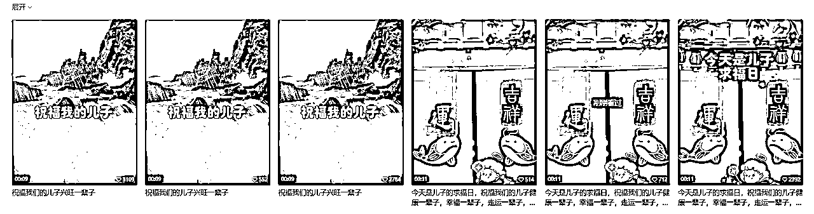
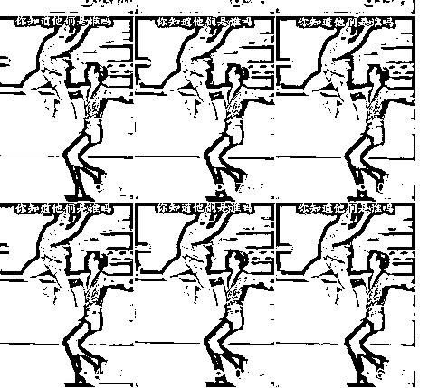
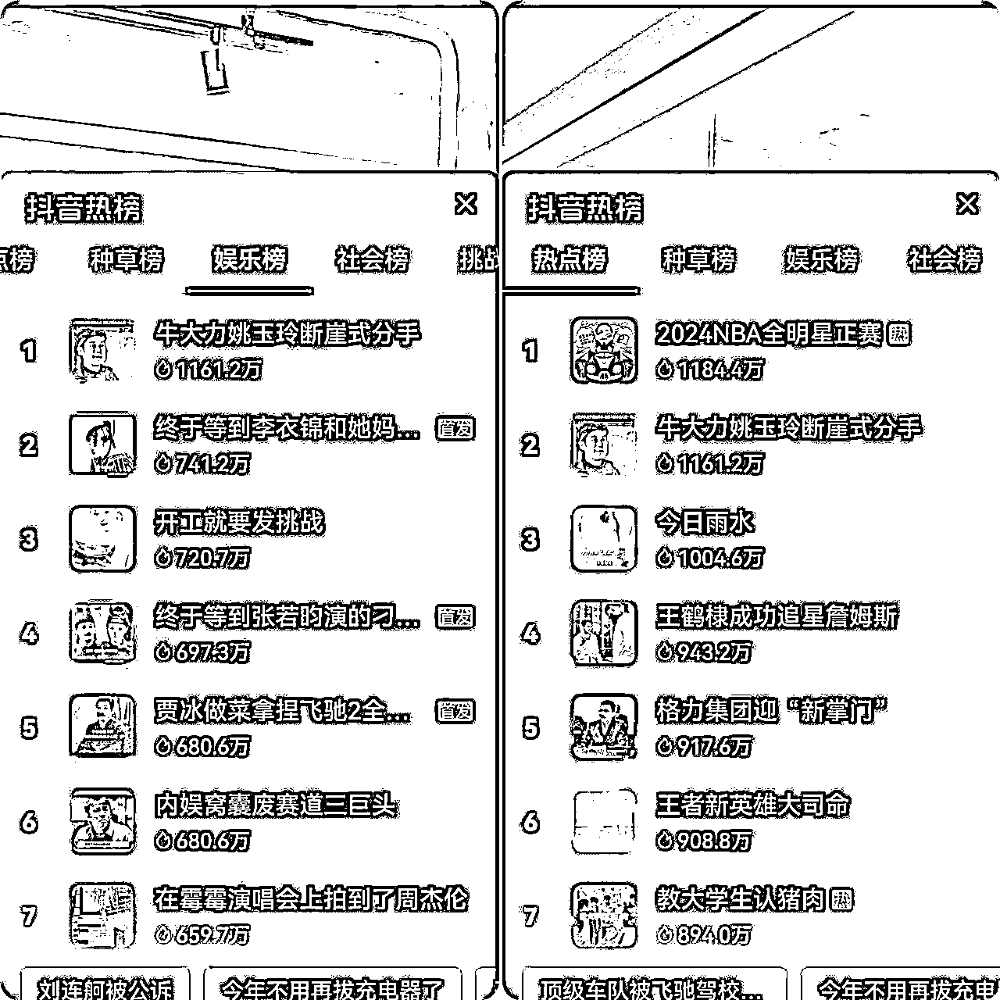

# 视频号赛道挖掘与快速涨粉秘诀，详细实操一条龙，学完即可上手操作

> 来源：[https://o0yvn3o31a.feishu.cn/docx/Nrx7dKDEHoDUhGxWRxGcKMxNn6d](https://o0yvn3o31a.feishu.cn/docx/Nrx7dKDEHoDUhGxWRxGcKMxNn6d)

大家好，我是黄岛主！

今天分享的这篇文章是关于视频号赛道挖掘以及快速涨粉的实操方法，为什么要写这篇文章，主要是因为我1月份和上年的11月份带了两期视频号创作者分成计划的航海，在航海里发现很多圈友对选赛道和涨粉方面的方法不是太擅长，再加上手册上并没有太详细的方法，所以我也是忙里偷闲的时候写了这篇文章，很详细的玩法，看完就可以去实操。

目前来说，视频号创作者计划这个项目还是可以做的，但是规则改变太大，对于大家来说，主要两个难点就是选赛道和快速涨粉，可能你说可以刷粉丝，其实这样是很满分的，因为你刷完还得去做视频通过爆款去激活，刷粉丝是不可实际的工作。所以，涨粉成为了大家的第一步，但是很多人迟迟不到百粉，创作者计划开不了，那么项目基本上跟没做的一样。其次，就是选赛道，百粉突破了之后，开始在赛道上犯难了，不知道怎么去有效的选择赛道去开展项目落地。

所以说，我今天写的这篇文章，可以最大化的帮助正在做视频号创作者计划的圈友，在选赛道和涨粉上进行一定的突破，而且也会给你看到我们上年做了哪些不错的赛道，以及通过我们做的赛道去突破自己的思维思路，还有赛道的变现情况等。同时，我们也会举例说明我们做了哪些赛道是可以快速涨粉的，可以说最大化当天涨粉100+，几天几千个粉丝，甚至几万不等。这个没什么技巧，无非就是赛道选的好，信息差大家没接触到而已。

好了，不啰嗦了，下面是选赛道和涨粉的两个模块的讲解：

# 一、挖掘赛道

首先，新赛道的挖掘和涨粉是目前做视频号人群最关注的问题，很多人不擅长，不太懂方法，导致涨粉慢，即使粉丝涨起来，做后期也会遇到问题，比如赛道饱和了想换新赛道，但新赛道不会选择，没有挖掘新赛道的能力和方法，所以会遇到困难！

先说一下赛道挖掘会遇到的几点问题，第一、现状问题，第二、已做赛道，第三、挖掘方法，我们也会围绕这几个去展开讲解！

第一、现状问题

不会选赛道，只会默认给的，比如参加一个培训，培训只会给你一个赛道去做，例如祝福赛道，前段时间比较容易做，而且收益比较高，可能会看别人晒收益一、两千，把项目包装卖给你，你学了之后就只会这一个赛道，再选赛道的话就不会选了，因为没有去教怎么选赛道，没有新赛道就没办法再继续变现。

很多培训课程只给一个赛道，不教方法，没有涨粉方法，没有选择赛道方法，一个赛道所有人都在做，基本上没办法放大，特别卷，这就是大家遇到的现状问题，我们最开始做的时候没有赛道选择，唯一选择就是娱乐赛道，娱乐赛道当时是红利期，当时刀郎最火，中国好声音最火，那英、杨坤最火，然后是李玟去世比较火。

那个时候基本就没有太大的推荐，但娱乐明星效果非常不错，后来做一段时间放弃了，因为单价太低，而且容易死号，刚开始随便做都可以，后来面临死号，视频号规则改变，只能不断挖掘新赛道，没有方法很难发展，选择大于努力，赛道决定收益，赛道选不好，再努力也不会拿到好的结果。

第二、已做的赛道

我们上年做了很多个赛道，比如接福、娱乐、对话、情感、漫剪、探索、话题、体育，这些赛道都是我们做过的，我们做视频号创作者分成计划的时候，市面上基本上没什么人做，当我们对外做培训的时候也没什么人做，后来培训资料泄露之后就很多人去做了。

下面我将用案例来举例，去细说我们做过的赛道，我也希望大家通过我分享的这些赛道，自己去举一反三，去扩大自己的思路思维，有聪明的圈友我想是没问题的。下面具体看下！

1、接福

可以看一下接福的数据，接福现在基本上是没办法做，接福当时是混剪、风景、真人出境，加上祝福语，账号已经注销掉，视频已经没有了，下面是当时的截图，几千播放量，三个一样的做了改动重复发，一个视频爆之后，稍微改动一下再发还会继续爆，点赞都是几千，一天两、三千收益。

接福很简单，可以视频号上搜一下关键词接幅就有很多类似的，当时我们做的时候，市面上没有人去做，是从抖音上复制过来的，后期拓展一下思路，我们以后也可以去抖音上看爆款视频，弄到视频号上去大概率也会成为爆款，要有搬运的思维。

2、娱乐

去年比较火的当属那英、刀郎、中国好声音、李玟最火，是娱乐里面比较好做的，下面这个数据是当时王校长和刀郎的，可以百度一下王思聪和刀郎，王校长为刀郎说话被封杀的情况，比较火，当时刀郎怎么发都会爆，五六十万、七八十万，根本想象不到刀郎那么火，当然收益基本上都是五百左右的收益。

做娱乐有很多明星都可以，比如过年春晚就发生了不少娱乐新闻，白敬亭、马丽也比较火，娱乐单价最开始很高，现在低了，不会给太多的收益，2000多的评论能给80~150左右，娱乐有很多方向，体育明星、娱乐明星等，但是要找能够热门的赛道，有很多明星怎么发都不会热门，中国好声音怎么发都会热门，因为当时处于热点。

3、对话搞笑对话，夫妻对话、婆媳对话、司机与乘客对话。

搞笑对话，下面这个收益图，80万多播放量，2000多点赞，400多评论，二百到三百块钱收益。

情侣之间相互聊一些搞笑话题，比如互联网上比较火的王大爷，对话比较搞笑，你一句我一句的对话形式，去视频号上搜搞笑对话有很多。

夫妻对话，也属于搞笑类型，容易爆，但是做起来比较困难，用平板画出来的，只要会描就没有问题。

婆媳对话，有一个数据收益图，就是纯聊天记录对话，很好做，这个是抠图抠出来的，原来是纯色的，抖音上找纯色的视频，下载下来之后再去给他换背景，在视频号上会看到动态背景、风景背景，基本上都是把别人的视频拿过来直接抠就行，抠出来还是原创，量非常不错。

司机与乘客对话，做一段时间效果比较不错，190多万播放，3000多点赞，400多评论，当时我们做的时候基本上没什么人做，把别人的文案扒下来，用AI改写，同一个事件用不同的方式表达出来。

搜司机与乘客对话关键词看一下，可以用漫画形式展现，或者直接把行车记录仪拿出来作为视频，也可以自己坐在车里拍，行车记录仪的视频是原创，这个赛道也非常不错。

4、情感

情感的小故事比较容易火，故事也是用AI生成改写的，一段文案搭配一段原创风景，最开始五、六月份的时候可以去做，现在没办法做，因为规则改了，五百多万播放量，将近3000点赞，900多评论。

故事是关于血型的小作文，文案当时做的时候把同行对标文案全都扒拉下来，用AI改写一下，包括今日头条上面也有很多类似的，也都是拿过来改一下，搭配风景视频去发很容易爆，因为抄的都是爆款文案。

6、漫剪

比较费成本，把视频生成动漫的时候需要收费，做起来能挣钱，如果没做起来就有成本，不推荐大家做，只是告诉大家现在有这种热点点。

6、探索

探索类的不知道大家有了解过，现在不太好做，这个视频是1000多万的罕见月亮，账号已经被注销掉，去年8月份，当时热点就是讨论月亮为什么这么大，为什么是蓝色月亮，搜索看一下同行对标，有很多种，大家要学会去发现。

7、话题

今日话题也非常不错，之前发的爆款167万播放，7000多评论，9.2万点赞量，标题是你和喜欢的人现在是什么关系，然后底下评论很多。

8、体育

体育赛道一个视频爆了，热门了可以重复发，因为视频是混剪，把别人体育视频下载过来做混剪，稍微修改一下再发，现在同样的视频很多个爆款，爆了一个再继续发是可以的，但是现在规则已经改了，不能这样发了，除了滑冰，还有跳水、游泳等都可以做，介绍完以上这些赛道，大家是不是有更多的灵感。

第三、挖掘方法

1、多刷视频

抖音、视频号两个平台没事去刷一刷上面有很多不同类型的视频，刷的时候要去找没有做过视频号的账号去刷，如果找一个经常做视频号的账号，给你推荐的只有那几类视频，不会给你推荐其他类型的视频，所以要找空白，刚注册好的视频号去刷，会推荐很多没有遇到过的视频，推给你之后不要点赞，不要关注，不要评论，点赞一个、关注一个之后，后期都会推荐这类视频，导致其他类型视频不推荐，抖音、视频号能刷到很多从来没见过的类型。

2、付费同行

刷视频的时候会遇到很多不同赛道的视频，感兴趣、想学习的就会看账号签名、介绍上面有没有微信，很多都是留微信加他学习，一般学费都是159、198、298、398，试错成本是有的，有能力就去学习，有些比较泛滥的赛道学过来没什么用，要找同行比较少，不泛滥的赛道学，不要什么都学，比如送祝福、接福的没必要学，付费同行是比较好的选择。

3、看风向标

像淘金情报、生财风向标等，多看会发现很多类型的素材，比如淘金情报有音乐的新玩法，用路边广告词表现歌词，能不能爆要测试才知道，还有董永辉情感语录，情报站里面有很多不错的情报，要拿过来测一下才可以，光看不测试是没用的。

4、举一反三

多去发现赛道，一个赛道可以延伸出来更多赛道，自身的知识储备越多，能挖掘的东西就越多，脑子里一片空白也挖掘不出东西，如果大家觉得有用的话，你可以把这几个方法仔细用一下。

# 二、涨粉秘诀

1、涨粉目的，开通创作分成计划和开直播带货门槛，还可以卖号，千粉、万粉账号都可以。

2、现状问题，涨粉非常慢，做视频号首要任务就是涨粉，很多人一百粉丝需要半个月，在涨粉上面就浪费了很多时间和精力，是因为你不会选择赛道，要选择涨粉快的赛道。

3、涨粉赛道，推荐先做娱乐、体育赛道，以娱乐赛道为主，去抖音热榜、腾讯新闻看一下最近都有哪些娱乐新闻，只找娱乐圈的，其他领域的不要涉及，体育赛道也一样，1-3天可以涨粉100，如果有爆款的话，一天就可以涨粉100，涨完粉之后把发过的视频隐藏起来，发准备变现收益的赛道视频就可以。

娱乐赛道案例：

比如腾讯新闻，抖音热榜，如下：

其实吧，娱乐赛道是最好涨粉的，我们上年基本上都是靠刀郎、李玟、全红婵这些明星去涨粉的，这些真的是一发就爆，很热涨粉开创作者计划。开通计划之后，然后隐藏他们，再去选择合适的赛道去做收益就行了。

涨粉赛道选择娱乐之后，我们要会制作方法，下面我详细讲下赛道视频制作，我可以负责任的说，这个方法很简单粗暴，只要看一遍就会，而且涨粉效果刚刚的！当然，如果不懂，可以找我深度交流！

可以看下案例，一个视频涨粉660个，45万播放量：

# 三、涨粉视频制作方法

首先，我们需要找对标模仿，对标一定要有，随拍视频主要用于提高作品原创度，视频文案要用吸引人的，剪映制作成视频。

我们可以去打开视频号刷对标，平时养号搜某些东西越多就会推荐这类的视频，遇到同类型账号关注一下，爆款至少点赞在200以上，收藏、关注一下，后面账号肯定还会发，只要经常刷，都会推荐爆款素材，要发谁就一直发，账号会更垂直，尽量紧跟热点，半个月之内的都可以，对标模仿要注意一下，要提前找到爆款，账号刷了一段时间之后都会给你推这种类型。

比如以全红婵的为例：找一个点赞、评论都比较高的同行去对标，把里面的文字修改一下，意思不变就可以，下面的网友评论可以去参考对标底下的热门评论有哪些，一些比较绝对的字眼不要出现，同行有的中间放真人图片，平台会提示图片侵权，所以我们不要放。

打开剪映，添加素材，以风景随拍为例，配上复合的音乐，先关闭原声，随拍视频10~15秒完播率比较高，也会提示视频质量低的问题，但是对原创度没影响，到爆款的时候会限制推流，有些时候100万或者五、六十万就不动了，点击剪辑、分割，把多余的分割删除。

点击文字、新建文本，把准备好的文字输进去，吧文字轨道拉到和视频对齐，然后复制文字轨道，几行文字就复制几个文字轨道，比如复制5个，依次输入文字即可。

文字上颜色看看同行都是什么样的，热点再去发还会再爆，想要更多的热点，一定要去多养号，多刷同行才会给你推荐更多相关的，文字可以用文字模板，也可以用普通样式颜色，多看看别人是怎么配的，选中文字轨道直接更爱字体样式、颜色、拉到合适的位置就可以了。

声音背景音乐分为两种，可以自己配，也可以用爆款音乐，发布视频的时候对标爆款背景音乐直接发布就可以，做好的视频导出来，帧率60，码率最大导出来。

发视频的时候可以直接用同行的文案，点击背景音乐，可以通过背景音乐发现更多的爆款，点击发视频，找到制作的视频发布就可以，也可以用提前收藏好的爆款音乐，发视频的时候从这里面选择喜欢的就可以。

电脑端操作基本上一样，也可以把比例调成16:9横屏的视频，背景可以用纯黑色背景，也可以用模糊背景，效果会更好一点，纯色背景也可以，导出来配上热门音乐发布就可以。

好了，以上是全部内容，也算是做了一个复盘总结吧，如果你对选赛道和涨粉不是太懂，在做视频号的时候对这块犯难，可以参考我以上的文章。如果有问题，也可以跟我交流！

# 四、过计划方法

涨粉后，我们需要过计划，这里我做了核心总结，你一看就懂，具体看下：

新号先发十个风景 ，如果能拍真人出镜 可以直接拍真人出镜哈，比风景视频质量高，今年不知道什么情况，不知道风景能不能最大化过计划，不过我们最好真人出镜，然后每天发3-5个，分2-3天发完即可！

比如航海的学员反馈的数据，如图所示：

注意：这个真人出镜视频，你可以拍情感语录、祝福语等等，都行！

发完之后，然后正常发你要做的赛道的视频，然后进行涨粉，其实你可以理解成，先发十个原创风景或真人做铺垫，然后发涨粉视频进行涨粉，或者发赛道视频进行涨粉，当然肯定娱乐涨粉快，先涨粉100，然后在选择正常做收益的赛道。

简单理解就是：先发原创铺垫+发涨粉视频涨粉100+发赛道视频过计划+最后赛道视频做收益

那么，涨粉的过程中，会自动过规范需求，但大部分不会自动过，可能会一直提示不满足，那么这个就是加热工具出了问题。所以，如果一直没满足规范不过计划，你去看加热工具的视频加热是否正常，所以我建议你要在这几天 随时看视频加热是否正常，如果不正常会提示整改，然后在发十个风景或真人出镜视频 分2天发完，然后审核过就可以自动过规范或者直接开通计划了。

目前我们都是这样的流程去做的，2-3天过计划的效果不错的。

关于加热工具的正常使用，下面我写了详细方案，大家可以看下：

加热工具每天检查是否正常（包含解决方法）

这里一个细节要注意：每发一天涨粉视频，都要看下加热工具 是否正常

大家先去看看 加热工具 视频加热 是否提示加热失败？

在创作者中心里，找到加热工具

然后点 加热工具

提示：账户异常 ，点下 不可加热 进去看下，是哪个不能加热，如果是商品就没事，如果是视频就不行

如果显示视频不可加热，就点视频，看提示整改吗？

点整改中，会提示让你发十个原创视频！

如果出现这个了，我们就要用2天时间发十个风景或真人出镜视频去做整改，一定不要去发聊天记录的视频，如果已经有发了，还没审核中，就隐藏发过的那个聊天记录视频，从而发10个15-30秒的风景或真人出镜视频。

注意：之前发的涨粉视频不需要隐藏，正常放着就行了，先整改审核完，继续发涨粉视频！

加快整改审核的方法（发涨粉的过程会遇到）

发完十个涨粉视频之后，可以先让审核1天看下，然后点 意见反馈 申诉下，这样可以加快审核力度！

点击创作者中心，点击帮助与反馈

拉到最后，点击意见反馈

点击创作者权益

看到这个界面，里面输入文字：亲爱的视频号工作人员，您好!我知道视频号是一个积极的正能量短视频平台，我很高兴能在这个平台上展现自己，我的作品都是自己辛苦拍摄剪辑的，我一直都很注意的，绝对没有拍什么违规的作品，希望官方可以明察，及时帮我恢复账号流量，如果我有没有注意到的细节，也绝对不是故意的，我保证认真学习平台规则，努力去拍更好的作品，也会认真审查自己的作品再传上平台的，恳请官方能帮我再次审核，及时帮解除账号限制，辛苦了，谢谢!

同时截图主页图片，写自己的联系方式和账号昵称

下面是自然过规范化的的，如果没自然过，就按照上面的方法进行意见反馈！

好了，写到这里，如果你想做却不擅长涨粉、选赛道、过计划，那么这个文章很适合你，让我们一起生财有术，一起加油！有问题可以与我沟通交流！