# 🔥风向标拆解第 3 期——靠Notion模板年收入100万美元，通过资料整理变现的路径如何——李幸运（最终版）

> 来源：[https://ya0i98h795d.feishu.cn/docx/TUspdsgoboc7rjxMNYFcQtFOnPf](https://ya0i98h795d.feishu.cn/docx/TUspdsgoboc7rjxMNYFcQtFOnPf)

资料整理——人民日报精读笔记项目：

✅流量怎么运营？

✅产品怎么解决？

✅利润怎么核算？

✅项目如何做&如何放大？

# 案例

#### 基本情况

账号：花花烂笔头/辣评君图书（推测是矩阵号）

类目：艺术定制（看了小红书电商类目表，以及他们产品标题加了定制，估计选的是艺术定制类目）

带货形式：图文笔记，左下角挂商品，直达小红书店铺

选择该账号拆解的原因：

*   小红书专卖人民日报精读笔记（纸质版和电子版）的店👉垂类店铺

*   小红书图文👉起号简单

*   两个账号起号两个多月总销售额129w+，单个账号每个销售额都达到60w+👉销量不错

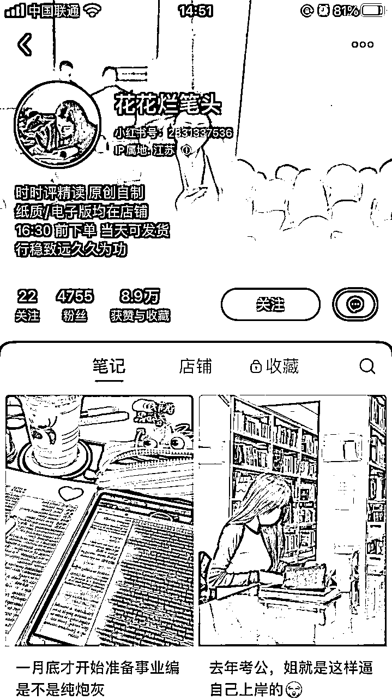

图一：花花烂笔头主页

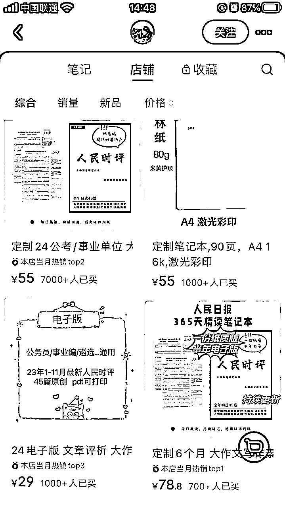

图二：花花烂笔头店铺

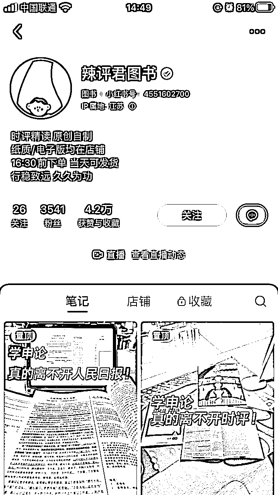

图三：辣评君图书主页

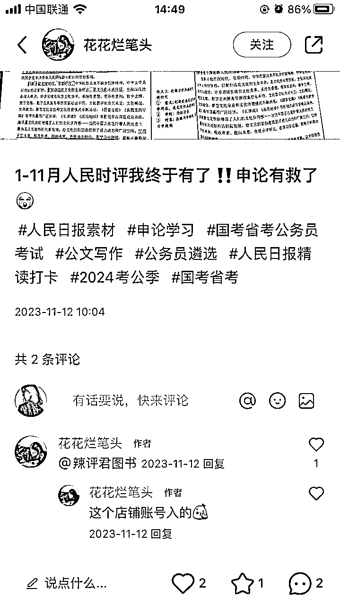

花花烂笔头刚开始的笔记没有挂商品，而是@辣评君图书，而且ip地址都是江苏，起号时间也是差不多的，推测是矩阵号。

图五：花花烂笔头第一篇笔记

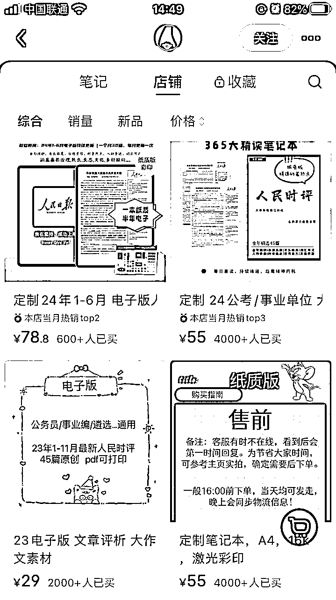

图四：辣评君图书店铺

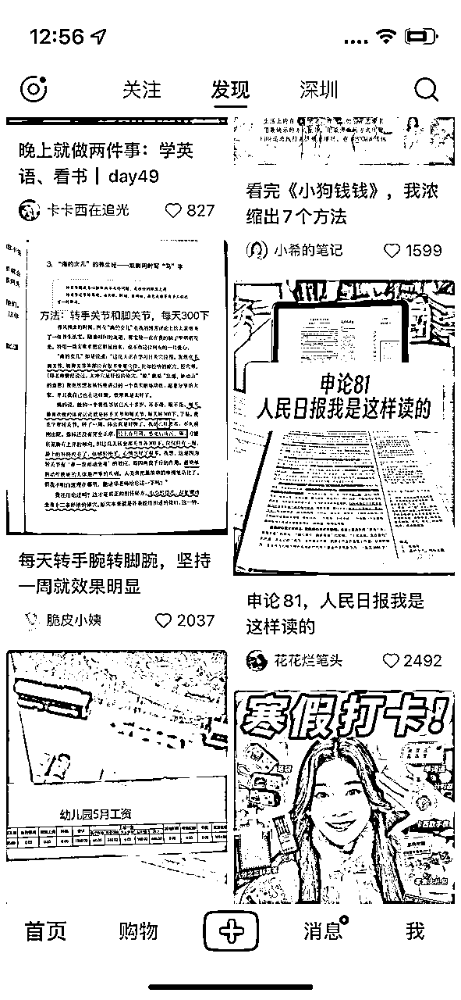

图六：花花烂笔头付费推广

## 1 流量怎么运营？

免费流量：该矩阵账号免费流量主要来自图文笔记，“辣评君图书”仅在2023年11月12日有开过一次直播，所以暂不做分析。

付费流量：小红书主页有刷到“花花烂笔头”的付费推广，右下角显示“赞助”。

1）图文笔记（近7天）

*   以下“花花烂笔头”为例：

*   新增图文38条，其中挂车38条，评论区都会引导购买同款。

*   一天发4-6条，1月30号当天发布6条，时间为：6:30点、9:20分、13:00分、15:40分、18:02分、20:35分，以量取胜，近7天点赞超过100的比较少，7天前几乎每天都会几百赞的，千赞的有一条是付费推广。

*   图文内容：每个图文放3-5张图，有些全部是纸质版资料的实拍图，有些第一张图加了人物复习的场景图。标题关键词主要是考公、事业编、省考、上岸、申论、人民日报/人民时评，精准吸引考公考编的用户。

*   粉丝画像：女性居多，年龄25-34岁居多，省份江苏、广东、山东居多。

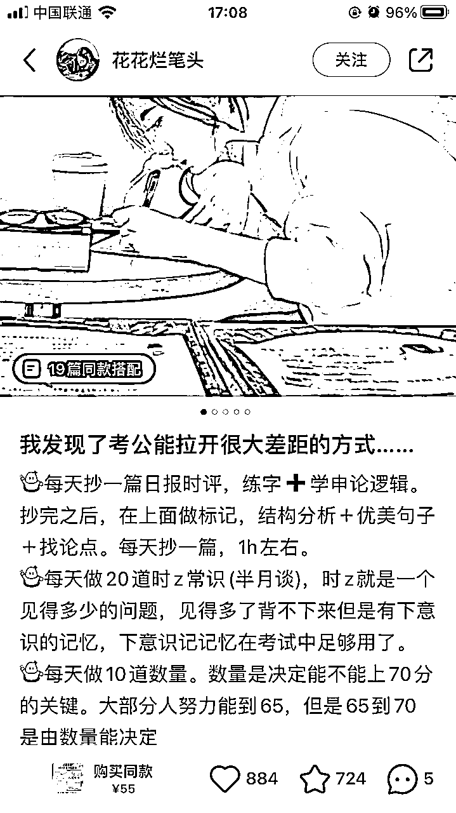

笔记第一张图

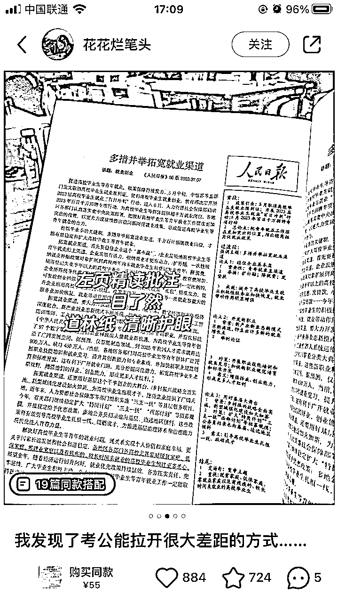

笔记第三张图

笔记第二张图

笔记第四张图

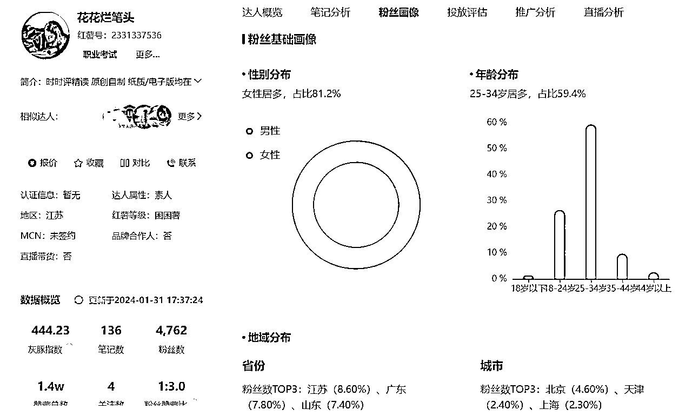

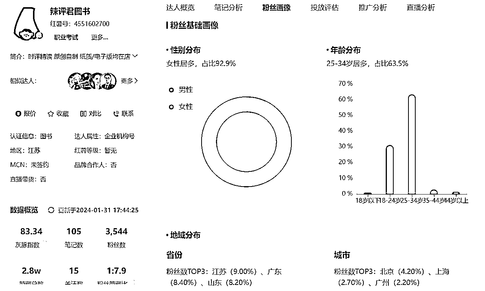

2）付费投流情况

我只是在小红书刷到“花花烂笔头”有一篇笔记有“赞助”字样，本人在这方面能力有限，小红书具体付费流量占比，以及ROI目前不知道如何分析，如果有知道如何分析的圈友，欢迎一起交流。

3）结论

*   免费流量：通过图文种草，左下角挂购物车，以及评论提醒购买同款，尽量引导用户购买；通过怼量来打造爆款；通过实拍资料图和关键词，精准吸引考公考编用户。

*   付费流量：在小红书刷到“花花烂笔头”有一篇笔记有“赞助”字样，表明有付费投流，点赞和收藏都超过2000，具体ROI未知。

## 2 产品怎么解决？

（1）自己找厂家打印：纸质版的暂时没有看到其他平台卖同款。

（2）无货源模式：淘宝拼多多有电子版资料，纸质版有不同款但类型相似的资料。

花花烂笔头/辣评君图书的纸质版应该是自己找厂家打印的，暂时没有看到其他平台卖同款。普通人想做的话，可以先采用无货源模式，淘宝或拼多多买电子版资料以及类似的纸质版资料，或者小红书账号起来后自己找厂家打印纸质版，淘宝上也有很多专门做打印的店铺。

1）自己找厂家打印

*   电子版：淘宝上3.98元可以买到。

*   纸质版：自己找厂家打印，根据纸张、页数、装订形式的不同，价格也不一样，花花烂笔头/辣评君图书店铺的纸质版只是挑选了45篇内容，一篇打印了2面，一面有批注一面没有批注，不到50页，按淘宝上打印资料彩印一面1毛钱算，暂且预估一本的成本在10元，运费预估5元。

*   利润：

*   电子版小红书店铺售价29元，淘宝上3.98元，电子版重复售卖，成本忽略不计，每单利润29元。

*   纸质版小红书店铺售价55元，打印成本加运费成本15元，每单利润40元。

2）无货源模式

*   如果是一开始不想自己找厂家打印，纸质版也可以先在淘宝上找卖相似产品的商家。

*   利润：

*   电子版小红书店铺售价29元，淘宝上3.98元，电子版重复售卖，成本忽略不计，每单利润29元。

*   纸质版小红书店铺售价55元，淘宝上16.9-25元，每单利润30-38元。

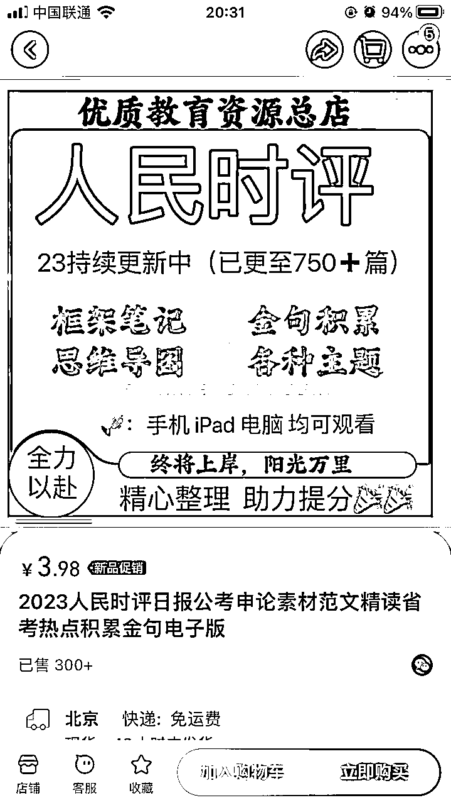

电子版资料

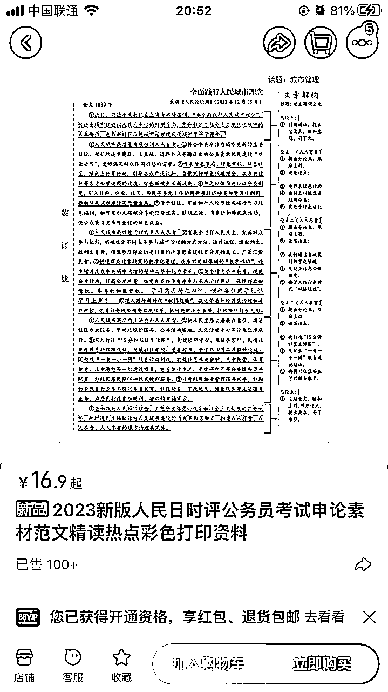

纸质版资料

## 3 利润怎么核算？

利润=收益-成本

1）收益分析

*   时间：2023年11月12日-2024年1月31日中午（起号两个多月时间）

*   销售额：花花烂笔头62万+（单月先按23万+算），辣评君图书66万+（单月先按25万+算），2个店80天总销售额129万+

*   减掉产品和物流成本的销售额：花花烂笔头47万（单月先按17万+算），辣评君图书51万+（单月先按19万+算），2个店80天总销售额98万+

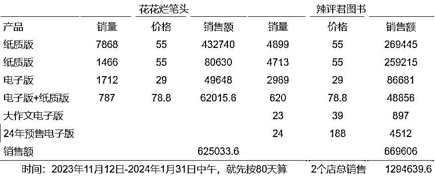

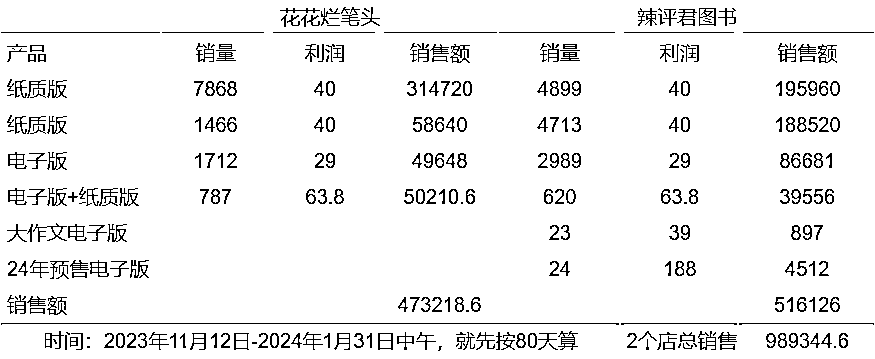

2）成本分析

*   资金投入：保证金+投流费用+工商执照费用（企业店需要）+产品成本+物流成本+人力成本

*   保证金：类目保证金和浮动保证金取高缴存，按10-50w区间算，单店保证金5000元

*   退货率：电子版不支持退货，纸质版退货率不确定，整个店铺的退货率暂时先按5%算

*   小红书佣金：（月订单结算额-1万）*5%

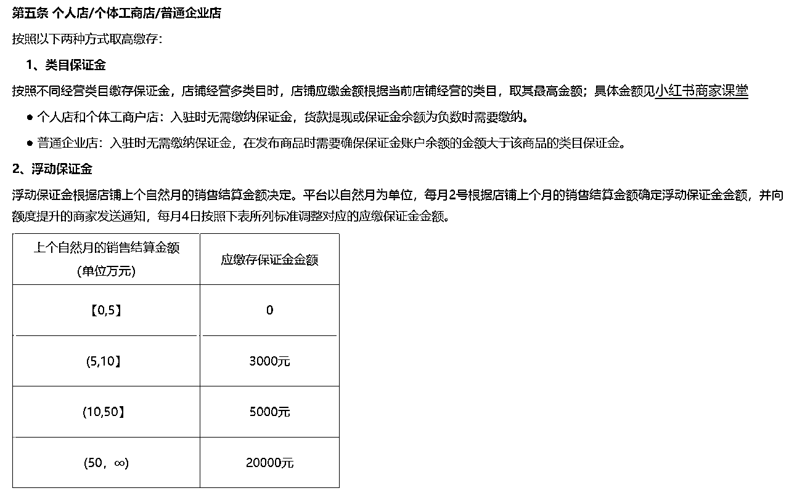

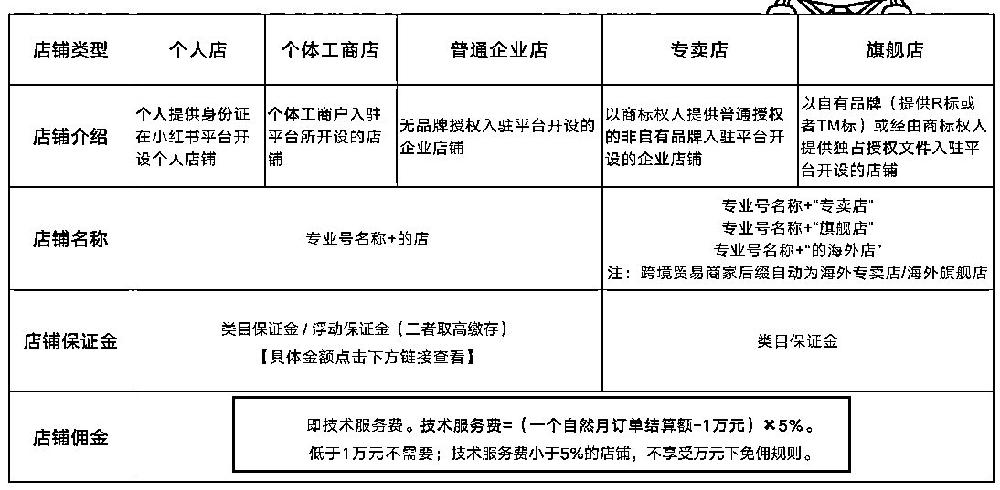

3）综合利润

*   花花烂笔头：单月销售额按23万算，佣金（23w-1w）*5%=11000，退货23w*5%=11500，保证金5000，投流费用不确定先不算，个人店没有工商执照费用 ，减掉产品和物流成本之后单月销售额按17w算，那么利润=17w-11000-11500-5000=14.25w

*   辣评君图书：单月销售额按25万算，佣金（25w-1w）*5%=12000，退货25w*5%=12500，保证金5000，投流费用不确定先不算，企业店工商执照费用先按3000算 ，减掉产品和物流成本之后单月销售额按19w算，那么利润=19w-12000-12500-5000-3000=15.75w

综合来看，单店月利润为15w左右（投流费用和人力成本未算，保证金5000不是每个月都要重复交，工商执照费用3000也不是每个月都要交），不过只开了2个多月，后续利润可能会有提升。

## 4 项目如何做&如何放大

（1）项目如何做

（2）项目如何放大

#### 1）项目如何做

每天发布4-6条图文笔记，以量取胜，获取更多自然流量，除了笔记数量之外，关键词很重要，通过考公、事业编、省考、上岸、申论、人民日报/人民时评等关键词，精准吸引考公考编的用户。

1.  开通店铺

1.  资金投入：保证金+投流费用+工商执照费用（企业店需要）+产品成本+物流成本+人力成本

1.  开店：可以开个人店，也可以开企业店

1.  图文起号

1.  基本要求：画质清晰，一般3-5张图

1.  图片来源：纸质版资料可以自己实拍，有些人物出镜的图片可以在各平台找，但要注意是否侵权

1.  图片去重：通过加贴纸水印、抠图、拼图、提升画质等方法，进行去重

1.  连怼玩法：一天4-6条图文笔记，用数量博取爆款概率

1.  产品来源

1.  纸质版自己找厂家打印，电子版淘宝购买

1.  无货源模式，淘宝找相似的纸质版资料下单，前期可以这么做，后期还是建议自己找厂家打印

#### 2）项目如何放大

1.  矩阵放大

1.  多店操作：可以再开几家个人店铺，花花烂笔头是个人店，辣评君图书是企业店。

1.  多账号操作：可以再加几个账号，不用新开店，直接关联，一个开店的企业账号可以关联3个未开店个人账号和3个未开店企业账号。

1.  多平台操作：小红书成功后，可以将玩法同时复制到抖音等平台。

1.  付费投流

1.  可以投流，小红书目前还没有那么卷。

1.  当然也需要看roi，是否有盈利或者多久可以回本。

1.  私域承接

1.  花花烂笔头和辣评君图书这两个号，目前没有看到直接引流到私域的入口，不知道发货包裹里会不会有，两个多月已售2w+，都是非常精准的考公考编的用户，如果只是卖资料太可惜了，可以导流到私域。

1.  如果本身可以做考公培训类课程或训练营，导流到私域的流量可以很好的承接，如果本身做不了，也可以找相关培训机构或者老师合作。

## 5 项目结论

从上面的分析来看，1天多条图文笔记+爆款的模式还是有机会的。单店月利润15w左右，还有可提升空间。

可以测试多店铺操作和多账号操作，看看哪个类型的操作效果更好，再继续复制，矩阵放大，同时，只卖资料盈利空间有限，都是非常精准的用户，导流到私域，卖课程、训练营等高客单价产品，空间更大。