# 《卖课百万的知识博主必会的 6大偷巧思维》

> 来源：[https://b16xnqwk20.feishu.cn/docx/O3vBdevO8ov0JbxyptWcg9RbnNQ](https://b16xnqwk20.feishu.cn/docx/O3vBdevO8ov0JbxyptWcg9RbnNQ)

各位新老朋友大家好，见贴欢喜，我是宋老师

21年做知识付费至今，全网10000+的知识博主和我学习过，开过3期80+人的线下大课，做课、私域高客单单陪跑近300人。

# 成绩👇

下面是抖音学浪的销量（4100+）单，还有一部分（10000+）是小鹅通私域成交的

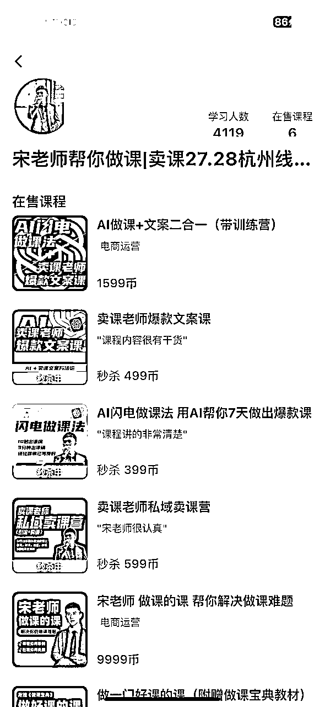

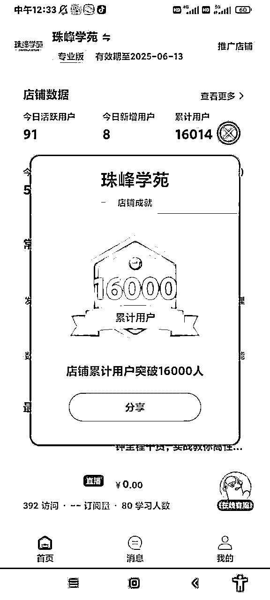

我是宋老师（账号叫宋老师帮你做课），全网粉丝20w+，多个矩阵号。很多抖音、小红书做知识付费的小伙伴可能知道我，我花了近1年的时间，从0-1成长为做课卖课赛道的头部博主。

简短的自我介绍一下，便于大家快速知道我的价值

我的四个标签：

1.目前自媒体头部的做课&卖课博主→流量能力

2.原来的新东方总监，最高记录同步管理80w学生社群→教学能力

3.10000多位知识博主的老师→成绩

4.很多百万博主背后做课卖课的男人

如果你一直处于流量卡点，变现也始终没有年过百万，不是你不够努力，而是你的“认知局限”

最近两个月我大概花了 6 万多块钱，我看了一下所有的知识博主的打法，包括我去拜访了很多现在目前单月卖课的千万级别的博主，发现他们其实也是这 6 大思维的底层逻辑，我集中性地给各位去做提炼，让大家能够快速地吸收这个核心的点。

主题主要有以下这么几个版块：

1、成事心法，年入百万的知识博主在想啥☆☆☆

2、预售为王，先卖再干，效果会更好☆☆

3、杠杆思维，做什么事情赚钱最快，知识付费做什么赚钱最猛☆☆

4、神兵利器，一个工具干掉 10 个人的神奇方法☆☆☆

5、矩阵，流量矩阵，包括你们所说的矩阵号，平台矩阵☆

6、日进斗金，就是我们如何放大自己的利润。☆

往期的精华帖，感兴趣的老师可以回顾👇

# 一、成事心法

## 一、定位

老生常谈的难题(会的人一直会，懵的人一直懵)

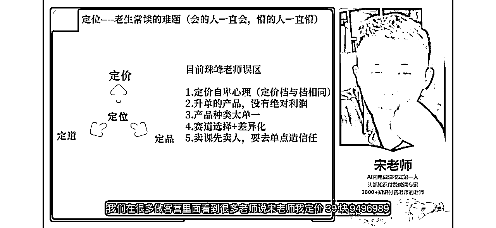

### 1.定价自卑心理

在课程定价方面，我注意到许多老师存在自卑心理，这反映在他们的定价策略上。在我们的做课营中，常常听到老师们说，他们的课程定价在39元、49元、69元、89元等较低价格区间。这种定价策略实际上源于自卑心理。

根据我们从官方后台得到的数据，我们发现299元以下的课程在市场上看起来没有明显差异。

### 2.涨价的误区

一个常见的误解。许多人可能认为，将课程价格从99元提升至299元会导致销量下降，但实际情况可能并非如此。我们的数据显示，当课程价格从99元上调至299元时，虽然销量下降了20%，但营收却增加了1-2倍

这意味着，尽管销量有所减少，但由于价格上涨，总收入实际上增加了。也就是说：作为知识博主，不应该在定价上有自卑心理。相反，应该有信心，相信市场愿意支付更高的价格购买你的课程。

在直播销售中，我们发现不超过399元的课程最容易销售。这是因为直播变现的效率较高。然而，当价格处于699至999元区间时，这个价格区间的课程通常不好卖

### 3.产品种类太单一

要做升单的课程，你要让用户买完一个课程再买下一个课。一般升单的价格梯度在 6- 10 倍

一会给大家看一个表格，就能清晰的看到，为什么一定要搭建升单体系了

### 4.赛道选择+差异化

在课程销售中，一个关键因素是选择正确的赛道并进行有效的差异化。我个人认为，课程销售困难并不仅仅是因为流量问题。即使拥有了足够的流量，如果没有恰当的差异化，课程仍可能难以吸引买家。

*   差异化的重要性：首先，需要明确你的底层数据，理解你的目标受众和市场需求。明确了这些数据之后，你就会知道如何为你的课程进行差异化。

*   差异化的本质：差异化的本质在于让潜在客户能够看到你的课程与众不同。比如，如果有一群身高185cm的人站在一起，你无法仅凭外观判断谁是最好的篮球运动员。同样地，在众多课程中，你需要让自己的课程突出，无论是通过教学方法、课程内容，还是通过其他独特的特点。

差异化是关键，它能使你的课程在竞争激烈的市场中脱颖而出。通过明确的策略和创新的方法，你的课程可以成为目标市场中的佼佼者。

差异化的核心及其重要性

差异化的核心在于找到使你的课程或产品与众不同的特点。许多人误以为差异化会限缩他们的目标人群，但这其实是一种误解。差异化实际上可以帮助你在竞争激烈的市场中脱颖而出。

*   差异化的实例：比如在教育领域，许多课程都集中在家庭教育、K12培训或者学科类教育上。关键在于如何让你的课程在这些领域中显得独特。例如，如果你专注于家庭教育，你可以通过针对特定年龄段（如7-12岁）或特定群体（如单亲妈妈或单亲家庭）来进行差异化。

*   差异化的必要性：如果你不进行差异化，你的竞争对手可能是那些资源更加雄厚的大机构，如北大姐妹花。他们的日常投入可能远超你的预算，包括广告成本和团队规模。因此，差异化不仅是一种策略，更是生存和成功的必要条件。

*   自我审视：重要的是要诚实地评估你的课程和产品。问问自己，我的课程是否有独特之处，让潜在的顾客一眼就能感受到与众不同？

### 5.卖课先卖人，要去单点造信任

比方说我要卖给的是男孩子的家庭教育课，卖给的是单亲妈妈的家庭教育课，我有一个很明确具象的人群。只要限定了人群之后，就可以卖高价，

因为全网没有人讲单亲教育课，我讲，全网没有人讲自闭症孩子的教育课，我讲，我们甚至还有一个老师讲休学心理辅导的课，一年也能赚个大几十万

## 二、课程

我们卖的不是课程，卖的是人

卖的是愿景，卖的是人设，卖的是痛点

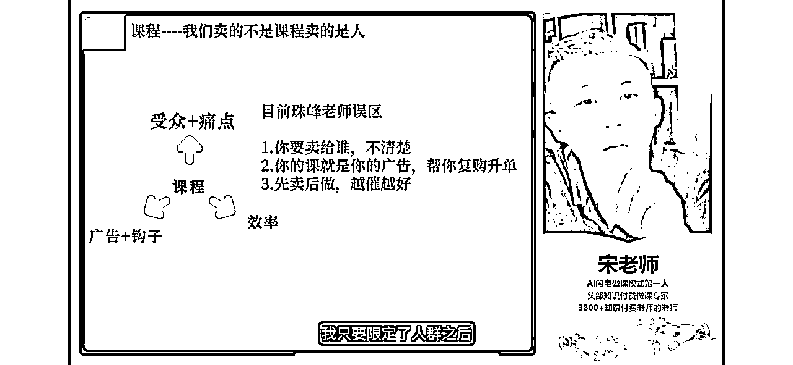

### 

做人群细分定高价

我们在卖课写短视频的时候，往往很多老师是把你的干货知识点放到了视短视频里面，但其实没有必要，你要切的是那些人的焦虑点，你要把焦虑放大

### 1.没有高阶课就做圈子

在没有高阶课程的情况下，应该专注于建立社群。不要等到高阶课程完成后再去提升它，因为那时可能已经错失了最佳时机，信任降低。之前有100个学员与我关系很好，但由于没有后续产品来维持这种关系，最终大家的联系变得疏远。即使当时的服务再好，随着时间推移，人与人之间的感情也可能逐渐淡化。

卖课的目标是为学员提供更长期的帮助和支持。由于优秀的老师远少于不那么优秀的老师，因此提供更多支持和服务变得尤为重要。这种方法不会给学员或者销售团队带来心理压力，因为提供的内容更优质，能够给学员更长久的帮助。基于这个逻辑，即使没有完善的二级产品，也应该先建立社群，把人聚集起来，这一点至关重要。

### 2.引流课同时也是广告

很多人的引流课里面你们是只是讲干货，但是我跟你们讲，如果你们要往二阶再去升的话，想让他再去买高价课的话，你们的引流课其实也是一种广告，也是一种广告， 所以既然是广告，我们就要在里面去下钩子，让他能够自然地去报名进阶课

我们是要勾他的意向和痛点出来

让他能够自动的去找你私信。

所以其实我们我也建议各位去这么做，因为这个效率极高，每个人都有拖延症

## 三、卖课

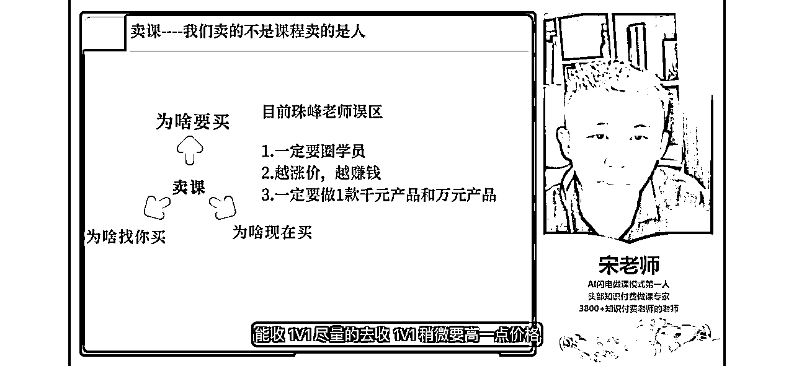

### 1.一定要圈学员

### 

如果你是极小粉丝量的老师，你现在还没起号，或者你的粉丝量很小， 5000 以下，我建议你们前期先不要卖课。我说的这句话记住了，前期你们先不要卖课。

为什么？因为你几千粉丝也不好卖，说实话一两千粉丝你也卖不出去几单，所以我建议你们前期干嘛呢？能收 1V1 尽量的去收 1V1 稍微要高一点价格，比方说你们前期是做女性职场规划的，你是做女性健身的，你是做口才的，你是做英语的，你们是不是可以先授点 1V1 的学员，先带他们一对一的做，他们干起来了，你有案例，你有结果了，你自然而然你在公域就可以去更好卖了。

还有一个很重要的点，一对一能收高价

### 2.越涨价，越赚钱

### 

越涨价越赚钱。有一个人性叫做追涨杀跌，就是他喜欢买涨价的东西，但不喜欢买降价的物品。

原因很简单，所以你涨价，你卖课，涨价也会很容易卖出去的，所以只要有点流量，你就开始涨价，慢慢涨，可以 50、100 的涨，然后这里面也会存在一些就涨价噱头，比方说你涨价 15 天， 14 天都是可以的，每天都会有单子进来，我跟大家讲涨价的魅力无限大，我只要课程一涨价，销量就暴增

### 3.一定要做1款千元产品和万元产品

你不可避免的你会碰到一些高净值人群。比方说你碰到某个上市公司的高管，他想跟你去做女性的职场规划的咨询，他想跟你去做女性的口才提升的课程，那么此时他不满足于 499、399 的课，他想让你一对一的带他，此时你要收一个很高的价格

不是因为看人下菜碟，而是因为这个人就匹配这个价，

所以一定要去做一个高客单产品，它能帮你去承接高客单的人，我们见过很多的同行和很多的博主都是把这些人错失了，其实很这些人的能量很大的，只要你把他们服务好，他们能帮你一个人带 10 个人

# 二、预售为王

预售思维会让你的产品制作更有热情

预售为王，我们在抖音卖课程，在小红书卖课程，本质大家一定要抓住一个核心逻辑，就是测试思维，要去做预售。

我给大家看一组数据，就很有意思的数据，就是我们一个朋友，他在 5 月份的时候，他当天下午没事干跟我们说，哎，我要不要开播卖课？他流量挺好的了，已经直播间能做到几百人了，所以我说那看下你卖呗，他说我没课，我说没课现场写大纲，没课现场来去弄东西，没课现场来上架。好，然后我跟大家讲，就是他当天一天，大家可以猜一下他卖了多少单，好，猜一下他卖了多少单。

他当天组织的直播间，当天做的脚本儿，当天做的大纲，当天上架的小程序卖课程，大家猜一猜他当天 499 的课卖了多少单？ 他当天卖了 100 单， 他第二天要干嘛？ 赶紧做课，再不做课，不退费了， 全投诉我， 所以你看他当时这个效率就极高了，因为他后面就跟追杀一样，你知道赶紧出课，因为他履约就两周，不履约的话就催款了。

预售思维及其对产品制作的影响

预售是在知识产品销售中极为关键的思维方式。无论是在抖音还是小红书卖课程，重要的是要理解并采用测试思维，即首先进行预售。

*   预售的数据案例：一个朋友在5月份决定进行直播售课。尽管他当时没有准备好课程，但仍然决定现场制作课程大纲并上架。结果令人惊讶，他在一天内就售出了100套499元的课程。这种高效的反应不仅体现了预售的力量，还展示了他需要快速准备课程的迫切性。

*   预售的心理影响：预售的另一个重要方面是它如何激发产品制作者的热情。就像我自己的经验一样，当我知道有很多人已经购买了我的课程时，我会感到极度兴奋和责任感，这促使我更加努力地准备课程内容，以确保它的质量和价值。

*   预售的核心逻辑：预售的核心在于“先卖后做”的逻辑。这种方法不仅可以测试市场反应，还可以在制作课程时给予更多的动力和方向。因此，这是一个重要的销售策略，值得每个知识博主认真考虑并实施。

通过预售，你可以更好地了解市场需求，同时激发自己在课程制作上的热情和创造力。这不仅有助于优化产品质量，还能增加销售效率和成功率。

# 三、杠杆思维

知识博主的杠杆究竟是什么?是你用1分钟时间，可以产出10分收益的事

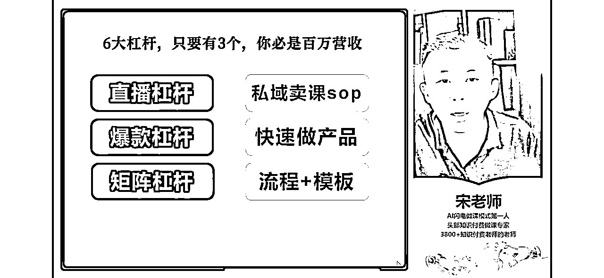

灵魂的认知，所有想在抖音小红书卖课的人，你要把杠杆儿两个字纹在自己身上，为什么？因为你想成为一个高变现，一年挣 300 万以上的人，你一定要有杠杆，你单靠一个人的生产力，一年能干个八九十万顶天儿了。

但是你想到八九十万以上，就需要综合的杠杆儿思维和管理能力帮你去做，好吧？所以我之前我在那个文案群里面，我发过说过杠杆这个事

什么是杠杆？杠杆就是你动一下，后面来了 10 次好处就好，好比说你拍一条视频，它可以给你带来 10 份儿收益，能理解一鱼多吃

## 一、直播杠杆

我举个例子

大家可能知道有一个人叫刘思毅，群响的创始人，然后他每次开线下课的时候，他是做很强的杠杆，他要一鱼多吃。开线下课收了一笔钱，收了个比方说收个5980，收了 100 个人。然后这个线下课说完之后，他在现场还会搞直播，两天的课程，三天的课程，他把半天拿出来在公域放直播，他们就想听下一期，所以公域又卖出去了

## 

他在现场做了好几个机位帮他去拍短视频，他把每一个小的知识点都做成碎片化、切片化。

然后现场他在讲课的过程中，其实短视频内容就出来了，那出来了之后其实就很简单了，那他只需要有剪辑手帮他剪辑就行了。所以好比说这个老师只讲了一次线下课，但是他带来三份收益，

他还会在现场找老师一对一的沟通

他的沟通的脚本是什么呢？第一句话问你是谁？第二个问题，你对于群响有什么想说的？你在群响里面你的最大的收获感是什么？

此时他在通过那个观众帮他去卖课，所以你想想这个东西就能解出来，又能让剪辑剪出来，变成了学员案例

所以你看一次线下课他只需要讲一遍，但是对于他的收入杠杆而言的话，有四个杠杆儿，所以这就是杠杆儿的核心含义。

## 二、爆款杠杆

就是你要去拍短视频，短视频你拍了一次之后，你可以发多个平台，如果你爆了之后，你甚至你可以一天，或者说甚至你团队可以一周都够吃了。

如果你有个爆款出现的话，其实你可以把它翻拍十遍，然后同时可以发多个平台，然后同时还可以让你的团队去承接后端的私域，

## 三、矩阵杠杆

举个例子，比方说我拍了一条爆款视频，在抖音获得了 10 万播放，发到小红书又获得了5万播放诶，发到视频号又获得了5万播放，总计我在三个平台薅到了 20 万播放，但我如果只做一个平台的话，我只能获得 10 万播放，对不对？如果我再放 b 站，放快手，放放知乎等等，我还能再扩量，所以这是矩阵杠杆。

关于平台矩阵杠杆，但是如果我在一个平台里面起 5 个号，我一个号获得 10 万播放，我 5 个号就是 50 万播放， 50 个 50 万播放，再乘以 5 个平台，那就是 250 万播放，它能够统一的往私域去导

但是对于 IP 博主干的事只有一件事，拍好一个视频，一个视频剪辑帮我发多个平台

我跟大家讲一句很刺痛你人心的话，做知识付费这一行，做知识博主这件事，我觉得没有人是不勤奋的，因为不勤奋的人基本也不会在自己的行业里面有结果，有成果基本都是在各个行业里面，有成果的人才会做知识付费，才会当一个知识分享者，因为你觉得你是一个成功的人，你才会愿意分享

但是成功的人都有特性，都是很勤奋的，所以勤奋在所有的事情面前是不值一提的，就是越勤奋往往你越没有钱，为什么？因为你方向错了，没有偷巧，没有杠杆，没有思维好，就这个核心逻辑。

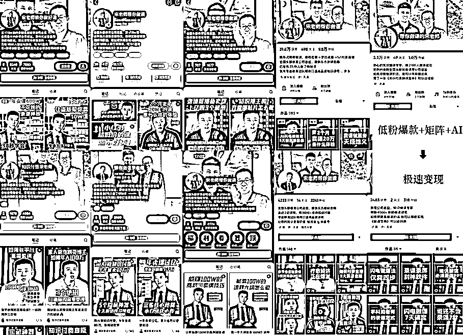

## 四、私域卖课sop

如果你想成为一个自动赚钱的知识博主的话，你要搭建私域卖课的SOP，所以这是我为什么要开线下课

原因是因为 SOP 那个东西线下线上讲不明白，要搭很多的细节才能往里面写进去好不好？

我现在每周三天不来公司，我还能让我的课程卖很多的原因是我有套私域的SOP，那他能按照我想说的逻辑，每天让操盘手去写，然后大家去发机器人帮我发，发完之后它不自动成交了， 这是个核心逻辑，它不需要耗我 IP 的时间。

大大小小我们做了近20个sop，而且不断的更新

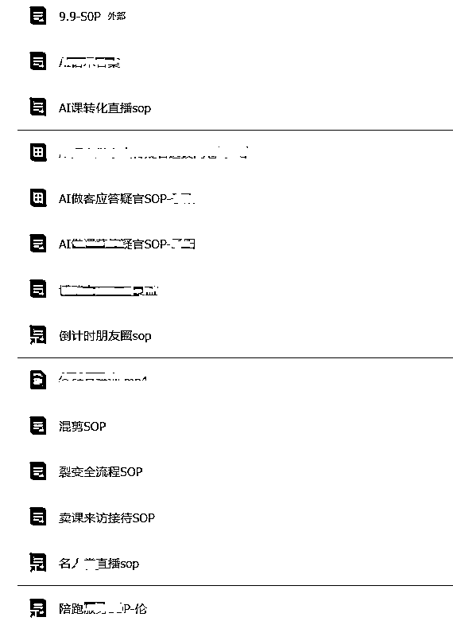

## 五、产品

这个点很重要，就是如果你一个产品卖半年，你相信我，你半年之后就没饭吃了。为什么？因为在知识付费领域，一个产品就只有半年周期，如果你半年以上再不更新产品的话，你就面临着产品匮乏的问题。所以要快速的去做批量化的产品，能够收更多的人进来。

我举个例子给你们说一个，我帮你们去搭一个产品线，产品线很重要，就是你要搭好产品线，能帮你省很多的事儿，它是自动赚钱的系统

## 六、流程加模板

就是你们都是指望着自己能够让别人帮你去完成你的伟大梦想，那么在这个过程中你必须要去带人，因为如果你自己吭哧吭哧干，我自己干的最高营收就是 80 万一年，因为它没有场控，没有运营，没有私域，是带不动的。那么你想把那个事情干大，就必须要有流程加模板，帮你去带教带谁呢？带你的新伙伴儿，所以你要讲究带教的逻辑，把人能够带起来教明白。

所以你的流程和模板其实是为了帮你复制放大团队去用的，你团队大一定是需要这些流程和模板去帮你去佐证这个内容

这是我们做的一个收入的预判表

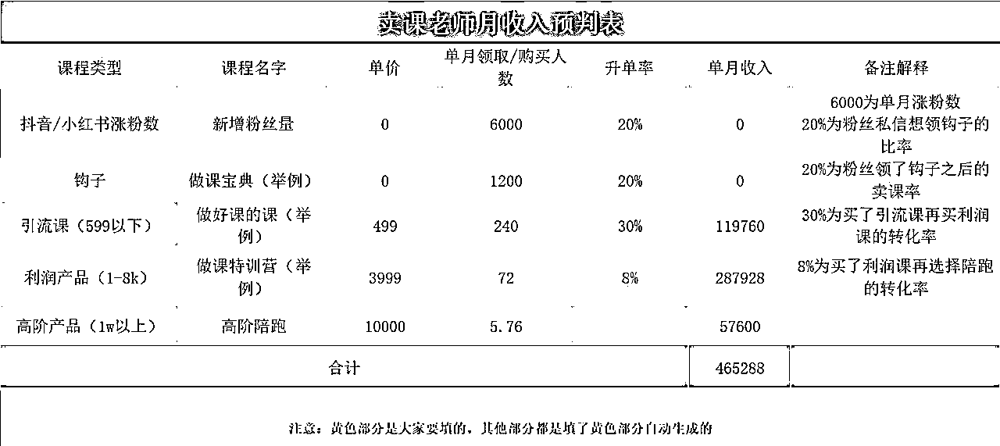

大家可以去想想你们的梦想，一年想赚多少钱？

假设你的引流课399，一个月抖音+小红书会卖出300多单，私域还会卖200单，这样引流课收入是20w

中间你升级了一个利润课【2499】，这个利润课是从引流课转化的，转化率大概30%-40%，

所以会出37w

最后你可能还有高端的1v1服务，一个1w，出现10单左右，

总计10w

综合算一下，你的公域每个月收入=300×399=12w

私域=200×399+370000（升单产品）+100000（VIP产品）=55w

所以你们要去算你们自己的杠杆，你们要去算你们自己一个月能赚多少钱。

# 四、神兵利器

## 一、社群运营神器

自动回复消息，自动触达，拉群，SOP计划，多群转发。

运营私域的老师必备的神器，操作有点麻烦，需要多看教程

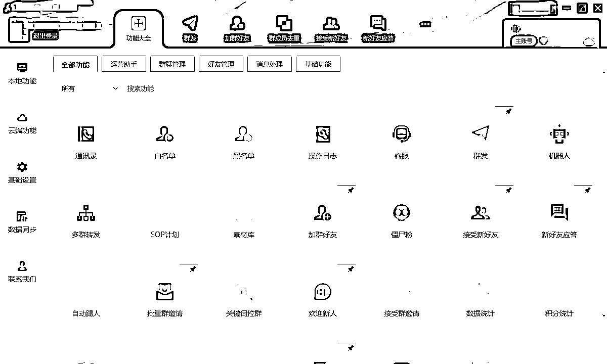

## 二、客服回复神器

可以做好快捷回复的功能，省去无用的回复话术反复敲打

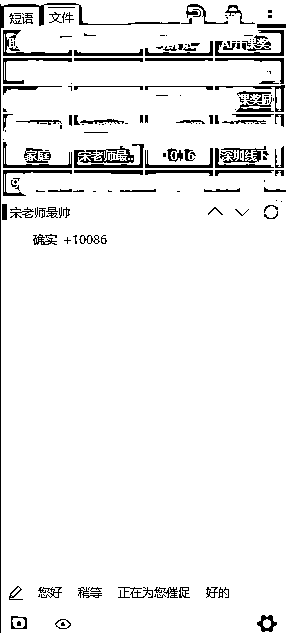

## 三、直播录屏神器

录制同行直播间，可以通过飞书转文字，拆直播稿

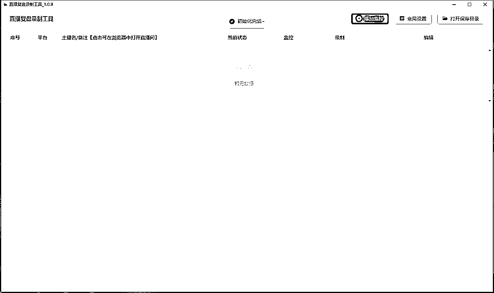

## 四、选题采集神器

快速的去找选题，批量找爆款的低粉高赞的选题

有个深度采集的功能，可以探索下，可玩性很高

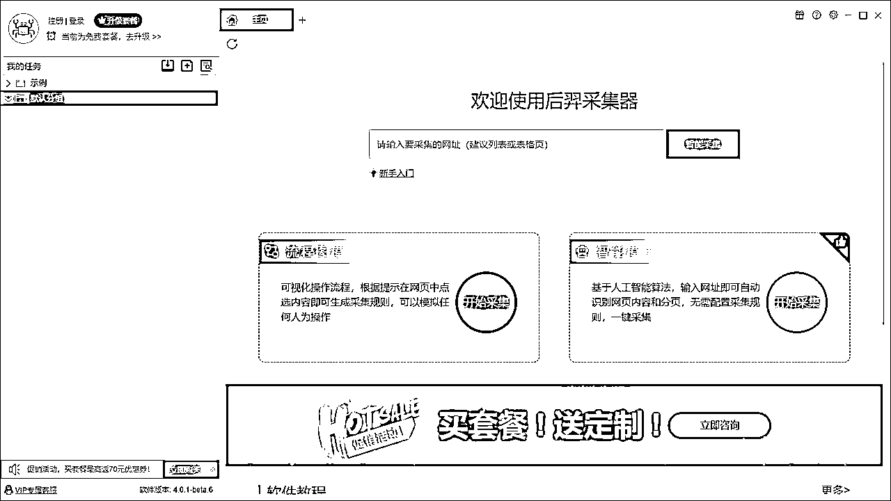

# 五、矩阵通达

矩阵的本质--解放自己 IP 的时间，帮助我们做一件事儿，省 10 份的时间，赚 10 份儿的钱

## 一、账号矩阵

但平台多账号矩阵，以量取胜，有点暴力起号的思维

但不同的是，混剪的技术，原创的能力，AI文案的辅助，这些都是提高流量的技巧，后面有机会再给大家分享，我有一份短视频剪辑的sop，需要的老师自取

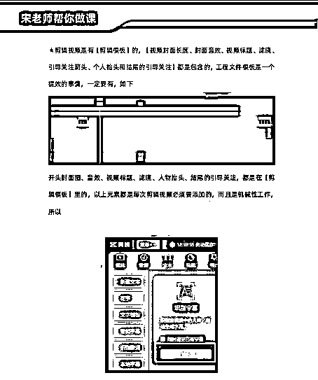

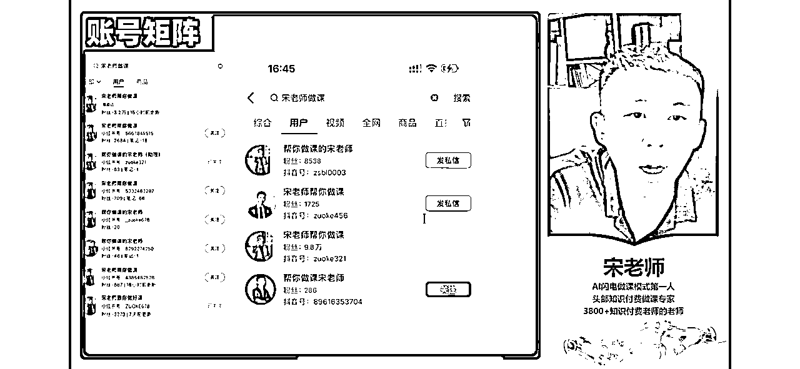

## 二、产品矩阵

多维度的课程内容，多角度的课程方向，只要是有对知识付费感兴趣的老师，我就有相应的课程对应，就能让他跟着学习。

但也不建议品类特别多，会影响用户的选择，选择优质的一两个爆款的课程主流售卖即可

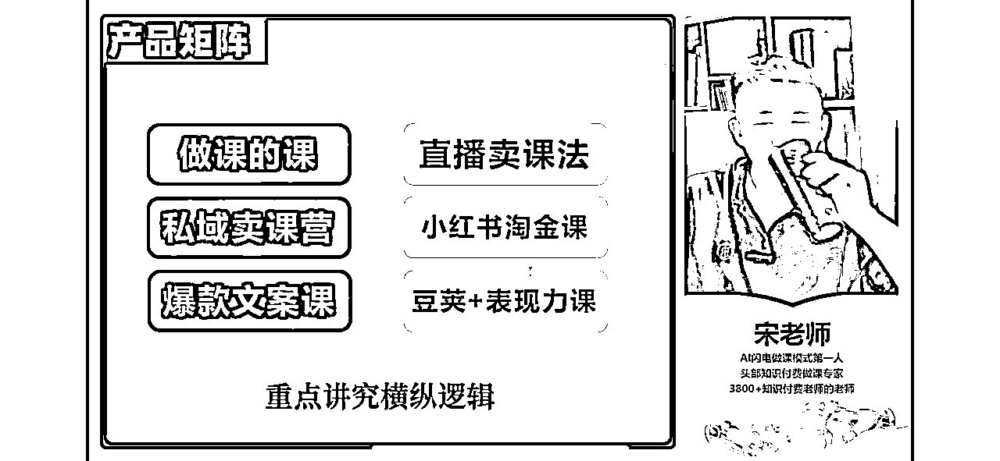

## 三、多 IP 矩阵

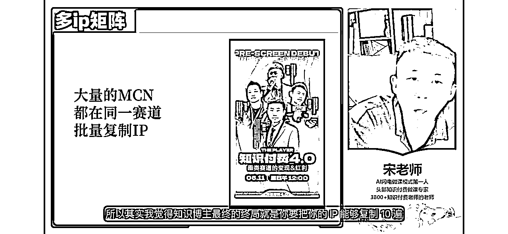

知识博主的扩展与IP复制策略

知识博主的最终目标应该是复制和扩展自己的个人品牌（IP）。这意味着将你的成功案例和知识内容复制多次，以此达到规模化的影响和收入。

例如，我们目前正在签约一些有潜力的IP，特别是那些能来天津，与我们深入合作超过两个月的人才。我们的目标是找到那些能够在特定领域取得显著成就的人，比如财务、会计或家庭教育等领域成功的博主，比如一位老师可能在某个特定领域已经取得了显著成就。但要想实现更大的发展和收益，就需要寻找更多类似的专家来复制他们的成功模式。

当一个博主的IP达到一定的瓶颈，例如年收入已经稳定在1000万，要想继续增长就需要采取新的策略。这就是为什么我们要寻找可以复制我们成功模式的合作伙伴。通过与其他博主合作，不仅可以扩展自己的影响力，还可以共同分享成功的经验和策略。

所有 IP 的终局要么是开MCN-小徐的模式；要么就是自己一条路做超级个体-李一舟模式

## 四、多平台矩阵

多平台起号

每个平台的风格又不相同，抖音靠内容，小红书靠封面，视频号靠私域，每一个都有独特的爆款风格和人群，深入的内容，可以私下探讨

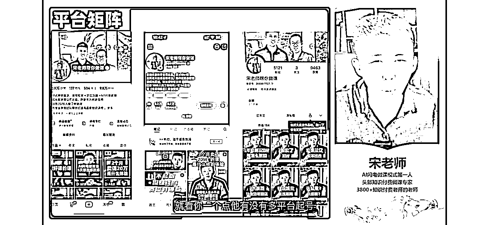

# 六、日进斗金

我想强调的核心点是：知识博主想要赚取更多的钱，本质上需要关注两件事情。第一件是增加总收入，第二件是降低总成本。

1.  增加总收入：

*   很多人限制自己只在卖课上思考。但实际上，收入的来源可以更多样化，包括卖课、提供咨询服务、提供陪跑服务、销售其他服务、举办线下课程以及进行分销。

*   每个收入渠道都可以为我们提供金钱。因此，重要的是要考虑除了卖课之外，你还能提供什么服务或产品。

*   多样化的收入来源包括但不限于卖课、卖资讯、卖陪跑、卖服务、卖线下课、卖分销。可以找合适的人员或渠道来分销你的课程，这也是一个有效的收入来源。

1.  降低总成本：

*   降低成本需要考虑两个方面：人效、评效、绩效，以及投资回报率。

*   考虑每个员工或每个投资的效率和效果，即他们能为你带来多少收入。这包括评估招聘一个人的成本效益，以及投资办公场地能带来的回报。

*   如果你不确定如何计算这些，至少要评估投资回报率，即投入一元钱背后能赚取多少。清晰地理解这一逻辑对于增加利润至关重要。

总结来说，日进斗金的关键在于理解并实施这两个核心策略：扩大总收入来源并降低成本。通过这种方式，知识博主可以有效地增加收入，实现财务上的成功。

# 写在最后

好了，今天的分享就到这，无论你是企业老板还是个人博主，其实我觉得知识付费都是一门极低成本，极高收入的好事，这个行业的利润在75%以上，老板可以做课程，输出你的产品或者管理思维，用课来征服合作伙伴

个人博主可以做课程增加收入，提高粉丝粘性和后端合作

欢迎大家有知识付费问题找我讨论。

知识付费的体系搭建很庞大，有时候我们要的不是一棵大树，而是一片叶子。只有当我们熟悉底层逻辑，找打合适的入口，会源源不断的挖到矿

知识博主不是比谁跑的快，而是比谁活得长

希望大家，2024生财有术，知识生财，感谢看到这的每一位老师！

我是宋老师，24年帮助500位老师卖课50w，欢迎和我一起卖课生财！