# AI如何驱动用户增长？聊聊最具竞争力的AI项目！

> 来源：[https://w91h2gmtrn.feishu.cn/docx/OFeqd7EOLoC1UAxZICucLSSTnVx](https://w91h2gmtrn.feishu.cn/docx/OFeqd7EOLoC1UAxZICucLSSTnVx)

读前说明：

1、本文2800实战干货，实践干货内容较长，图片截图也较多，建议用电脑浏览器阅读更加高效。

2、欢迎圈友来链接和交流（微信：qiaobangzhu-cn），一起AI、一起成长、一起赚钱！

3、乔帮主的AI实战训练营正在火爆招募中，在线下通过两天一夜手把手带大家玩转AI。全新课程不仅在课程内容价值上实现了质的飞跃，而且实战性更强，案例更加丰富：

文章目录：

1、2023年的四个AI项目赛道

2、AI如何驱动用户增长？

3、提供的AI产品和服务是什么？

大家新年快乐，我是乔帮主。借助新年新气象，跟大家分享聊聊AI领域一个最具竞争力的项目，祝愿大家在新的一年里财源滚滚。

在过去的两个月，我在圈内线下的项目路演、线下聚会、线下年会等很多线下活动中，很多次都正式分享了AI在营销领域的应用。今天在这里把这些干货内容汇总跟大家分享出来，希望大家在龙年里行鸿运发大财！

# 1、2023年的四个AI项目赛道

ChatGPT刚满一周岁，过去的2023年也是AI时代开始发展的一周年，我在AI创业赛道上也摸索实践了一年。在AI赛道跌跌撞撞了一圈，我看到了四个算是比较靠谱的AI赚钱项目。这四个项目我也都实践了下，接下来跟大家拆解分析下有何特点。

首先就是AI+技术领域，在这项目方向上，也是我做技术的老本行了。我曾在很多场合，也对很多圈友都说过这么一句话：上一个互联网10年是云计算，下一个互联网的10年肯定是AI了。

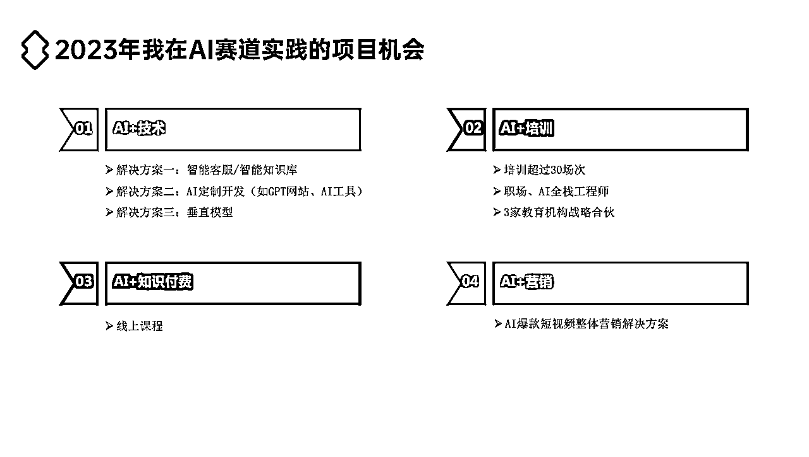

AI在企业级的应用，更多是AI技术结合企业级的业务应用，AI的定制开发、AI部署实施等都将会成为企业的刚需。在AI+技术的项目方向上，智能客服/智能知识库、AI定制开发（小到GPT网站、大到AI工具、AI系统等）、垂直模型（有点像私有云的模式）是比较成熟的解决方案，也都是比较靠谱的AI项目。

但在智能客服/智能知识库、AI定制开发、垂直模型等项目上进展不理想，主要原因是这些企业级应用，需要专业技术团队、专业的销售团队，对企业也有较高的资质要求，不太适合我们这些个体创业者小团队。

然后就是AI+培训领域，在这项目方向上，也算是我做的老本行。虽然主业没做过培训，但我一直在培训机构兼职，以前也在大学兼职过讲师，对培训体系和模式很是熟悉。

AI会重塑所有领域，所有领域都值得用AI重新做一遍。培训行业同样如此，以前的课程内容体系，后面都会基于AI体系之上。AI+培训领域的结合，我也是比较看好的蓝海赛道。

这里值得注意的是，培训主要指的是培训机构那种至少一个月以上课程的模式，并不是一两天那种短期类似知识付费的形式。所以培训的课程体系是一个非常庞大的内容体系，至少光课程内容体系开发都要半年以上。

AI+培训的模式，不管是面向ToC的学员还是ToB的学员，整体感觉跟AI+技术模式有点类似，需要专门的讲师团队、需要专门的营销团队，门槛偏高，也是不太适合我们这些个体创业者小团队。

其次就是AI+知识付费领域，在这项目方向上，大家所熟知的就是李一舟卖课，光抖音就卖了三四千万。AI+知识付费的核心在于要熟悉知识付费的业务模式，其次才是AI。知识付费的本质就是自媒体，会从公域运营操盘搞流量，会搞IP，基本上就能做成。

这项目方向，门槛没前面AI+技术、AI+培训那么高，卖卖课、搞搞社群或者陪跑训练营，赚多赚少，基本上普通人都能入局，很适合我们这些个体创业者小团队。

最后就是AI+营销领域，也是我最看好的赛道方向。接下来主要详细跟大家聊聊这AI+营销领域的项目，用AI如何驱动用户增长，如何通过AI帮助企业引流获客。这也是我在AI赛道跌跌撞撞了一圈，所看到的最具竞争力的AI项目，也是当下我现在主要在做的项目方向。

# 2、AI如何驱动用户增长？

AI+营销的项目，我们用了一家专注于AIGC企业营销应用的科技公司运转。企业定位在AIGC助理企业增长，服务内容为AI+行业培训、内容营销、落地执行，企业的初心是落地实战、陪伴成长。

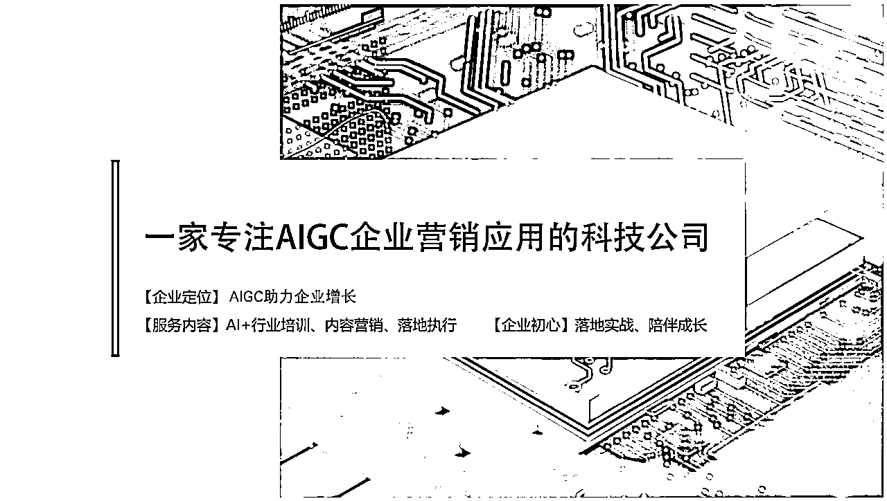

我们是怎么来通过AI来助力企业增长，即让企业营销效率提升的？

营销效率的提升=协作效率，即SOP标准化运营，你得跑通SOP这是基础。然后我们通过AI爆款短视频+数字人引擎+智能矩阵系统，让个体效率提升至少10倍效能。

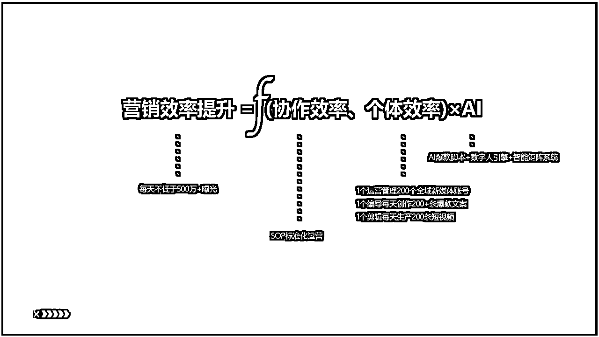

即通过AI能让1个运营至少管理200个全域新媒体账号，让1个编导至少每天创作200条爆款文案，让1个剪辑每天至少生产200条短视频，让企业每天不低于500万的曝光。

比如博商的张琦，就是典型的采用了企业智能解决方案。通过AI企业营销短视频矩阵：AI内容生产+数字人+智能矩阵系统+私域SOP，一个员工能一天就能剪辑200条企业营销短视频，企业获得100万+曝光、覆盖上百个关键词，上千条精准线索。

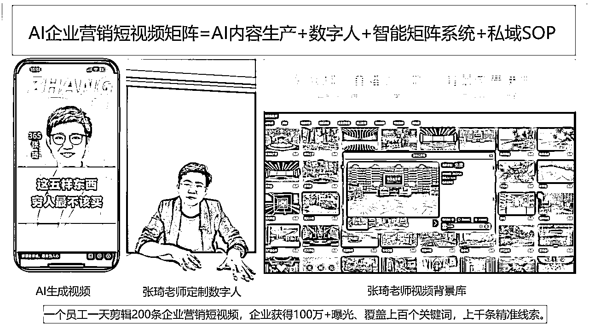

通过企业智能营销解决方案，张琦全网100亿播放量，全网分发10万条短视频，有上千个矩阵账号。

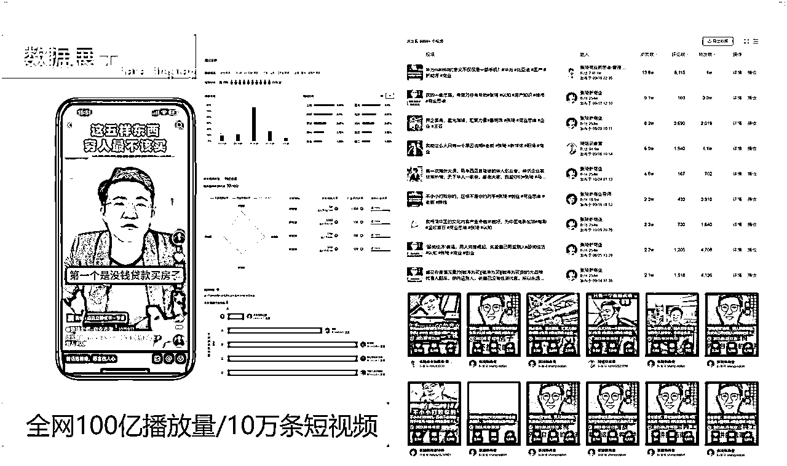

这是我们的矩阵系统：能管理上千个账号、能AI写脚本/写分镜、能全平台绑定分发、能数据跟踪/消息回复，我们矩阵系统巅峰期单日能产出15万条短视频。

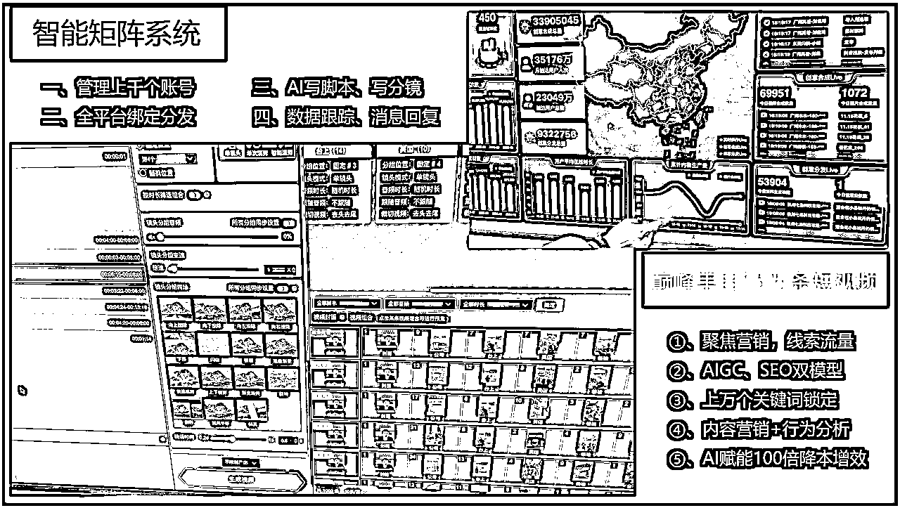

这是我们正在开发马上要上线的AI视频宝，通过AI视频宝，也很快的智能写爆款短视频脚本。我们也是将我们在各行各业积累的爆款短视频文案的经验，全部整理输出到我们AI视频宝这个产品赋能给到大家。

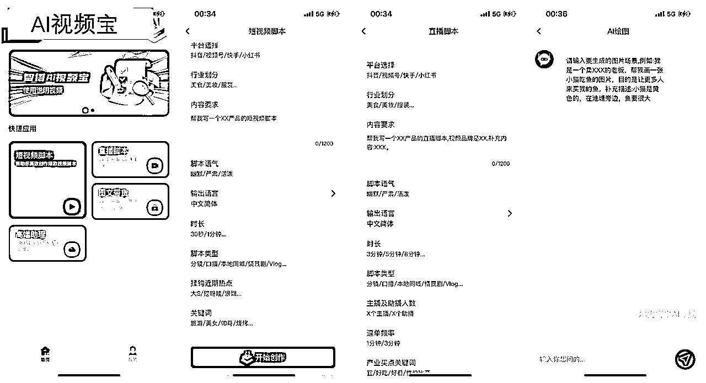

# 3、提供的AI产品和服务是什么？

所以我们核心提供的产品和服务是，围绕我们AI视频宝+矩阵系统+数字人，来培训教你们怎么把AI企业短视频营销矩阵给跑通，把这套解决方案赋能给到你。

培训内容主要为AI创作、营销定位、账号体系、内容体系、运营体系、本地化部署、矩阵系统使用、数字人系统使用。我们收费是两天29800每人，69800专场（5-8人）。

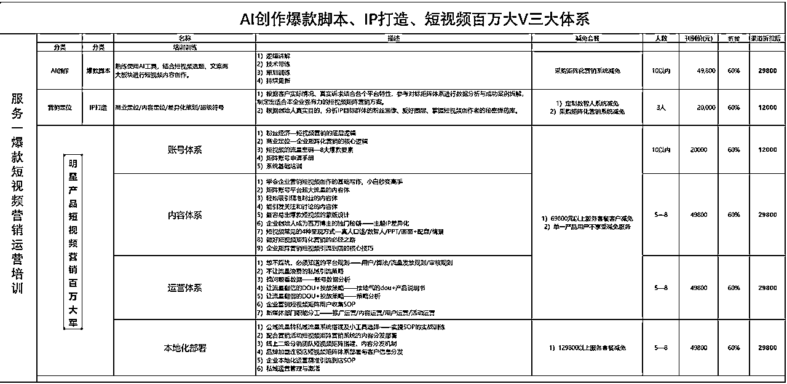

培训完后，用户可以采购我们矩阵系统，他们自己去批量管理他们的矩阵号。

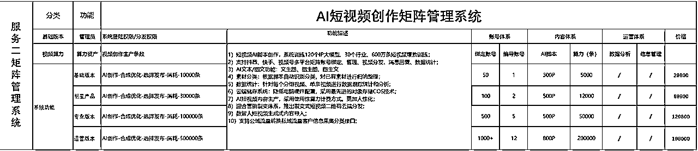

也可以采购我们数字人系统，来定制他们的数字人真人形象。

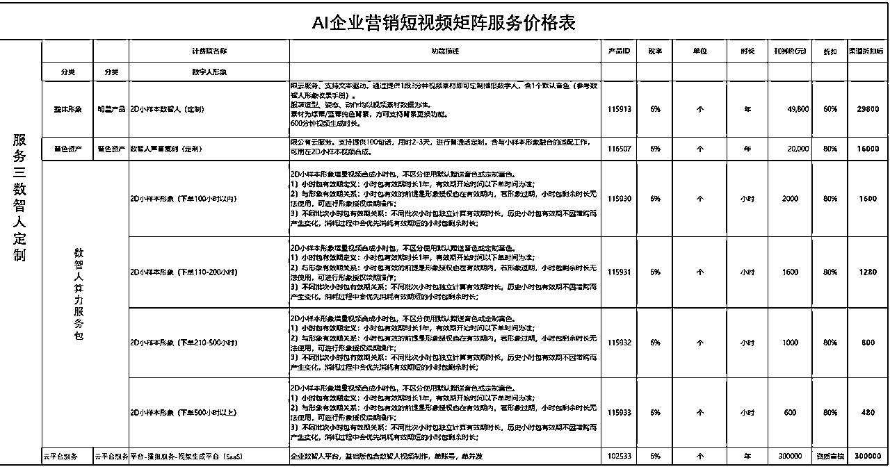

重点来了，哪怕把解决方案和实施细节都告诉你了，很多企业还是没办法跑通。毕竟是个复杂的技术活，需要专业的人去弄，门槛还是蛮高的。所以这时候，我们高客单价的服务就来了。

我们主要的目标行业是美学、本地生活、培训、新能源汽车。为什么这些行业呢，是因为我们跑通了sop，因为我们对这些行业领域足够熟悉。

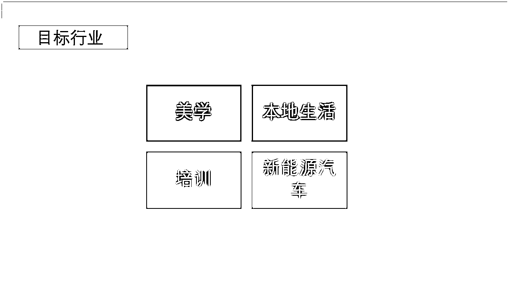

我们高客单价服务最低是20万起，由我们来亲自结合企业的业务，来结合AI落地短视频矩阵。交付标准是：推10000条以上短视频，并保障播放量和点赞量。并且获得的用户线索，客户还需要额外给我们100-300块每条线索价。

该项目有4个特点：企业刚需痛点、AI风口、来钱快、缺人（瓶颈）。特别是我们现在收了客户不少钱，收钱的时候有多爽，那交付的时候就有多痛，现在是缺人来跟客户服务交付。

当前我们团队情况，上海是总公司，主要为业务中心。现在也是在上海准备待半年带团队，跑项目的SOP。然后接下来我会在杭州成立新公司，来组建后端交付团队，搭建交付体系。

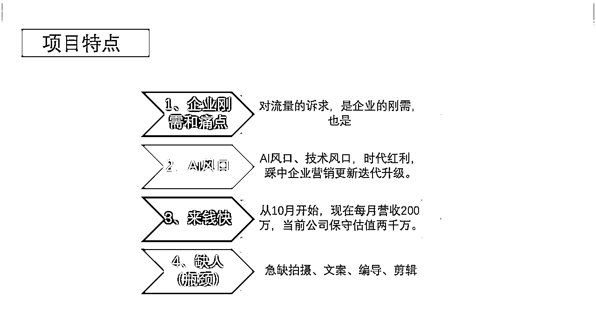

这也是我最近在做的AI项目，分享出来给大家参考借鉴下。1月就在上海都在跑这个项目了，很多圈友当时要来拜访我聊聊，都被我婉拒了。主要是忙起项目，根本没时间做其他事情了。

当时也跟我同事感叹，没想到我一个技术总监，以前干技术的，现在在做营销方面事情，跟以前搞技术的工作完全没关系。不过对于一个创业者，对于一个营销薄弱的我来说，这项目对我提升和帮助是巨大的。

这一个月都是在搞AI+短视频矩阵，收获也是蛮大的，对短视频矩阵、如何在抖音起号、账号定位、内容方向都有了很大提升，也算是这方面的专家了。面对客户的任何问题和需求，也都能解决、并自信的给出解决方案。

有很多项目实施的细节等，可能由于篇幅有限没办法进一步分享。感兴趣想进一步交流、或者想参与项目一起做些事情的老铁们，可以加我联系。

* * *

乔帮主的AI实战训练营正在火爆招募中，在线下通过两天一夜手把手带大家玩转AI。全新课程不仅在课程内容价值上实现了质的飞跃，而且实战性更强，案例更加丰富：

* * *

往期干货精选：

往期干货合集：

微信：qiaobangzhu-cn，添加请备注：生财圈友。欢迎交流！

公众号：点金乔帮主

