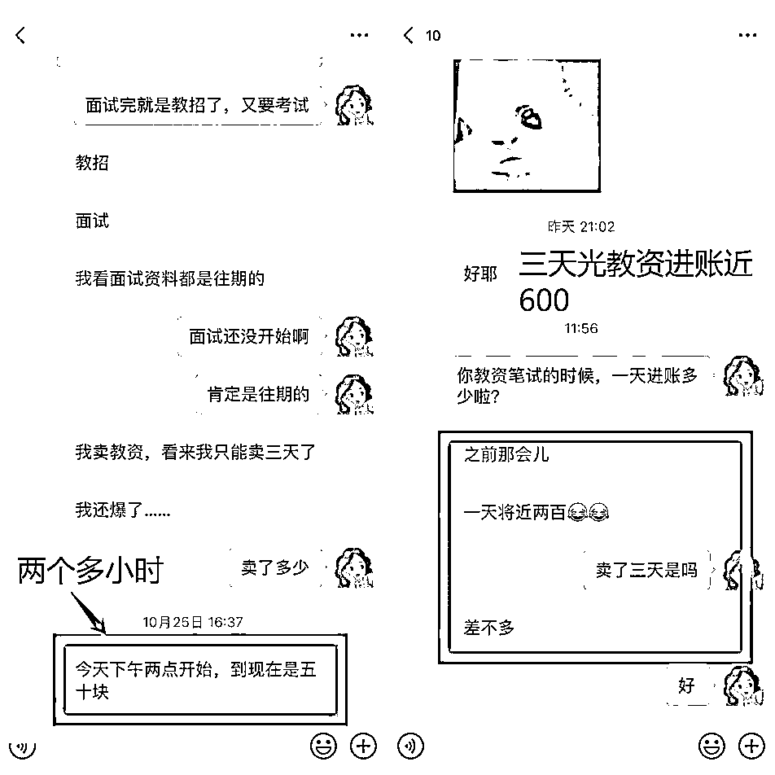
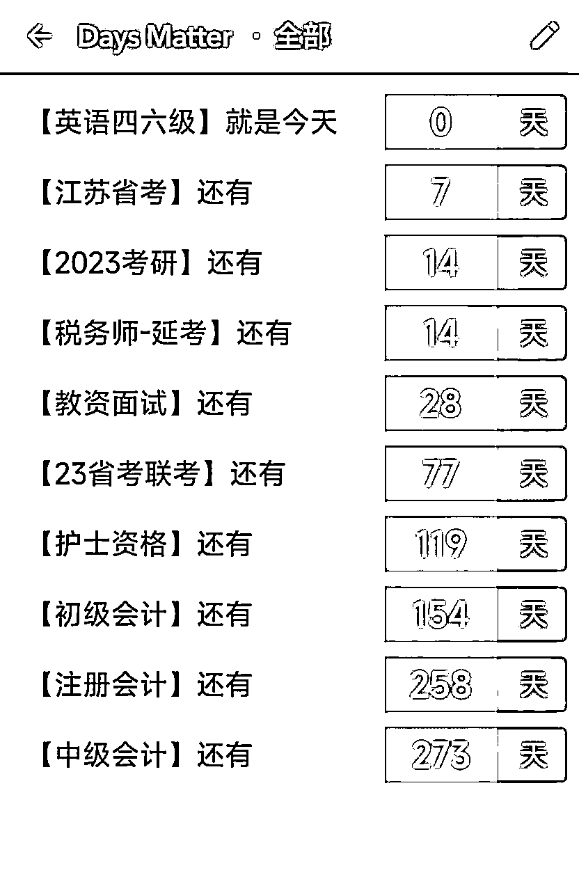
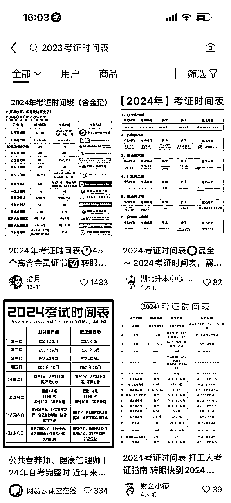
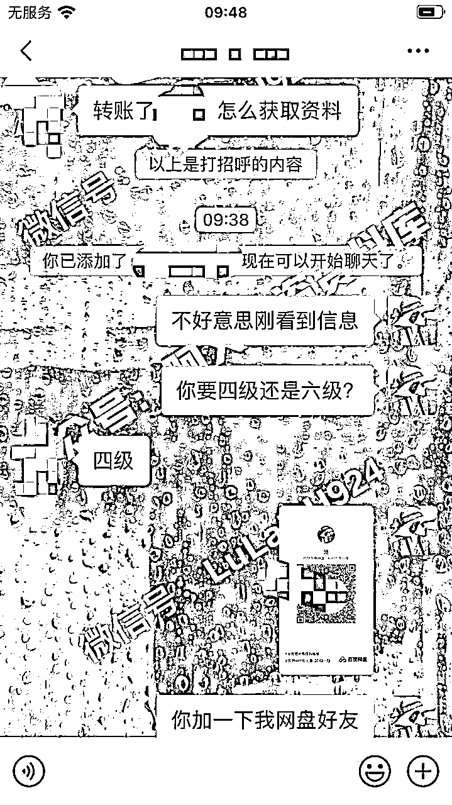
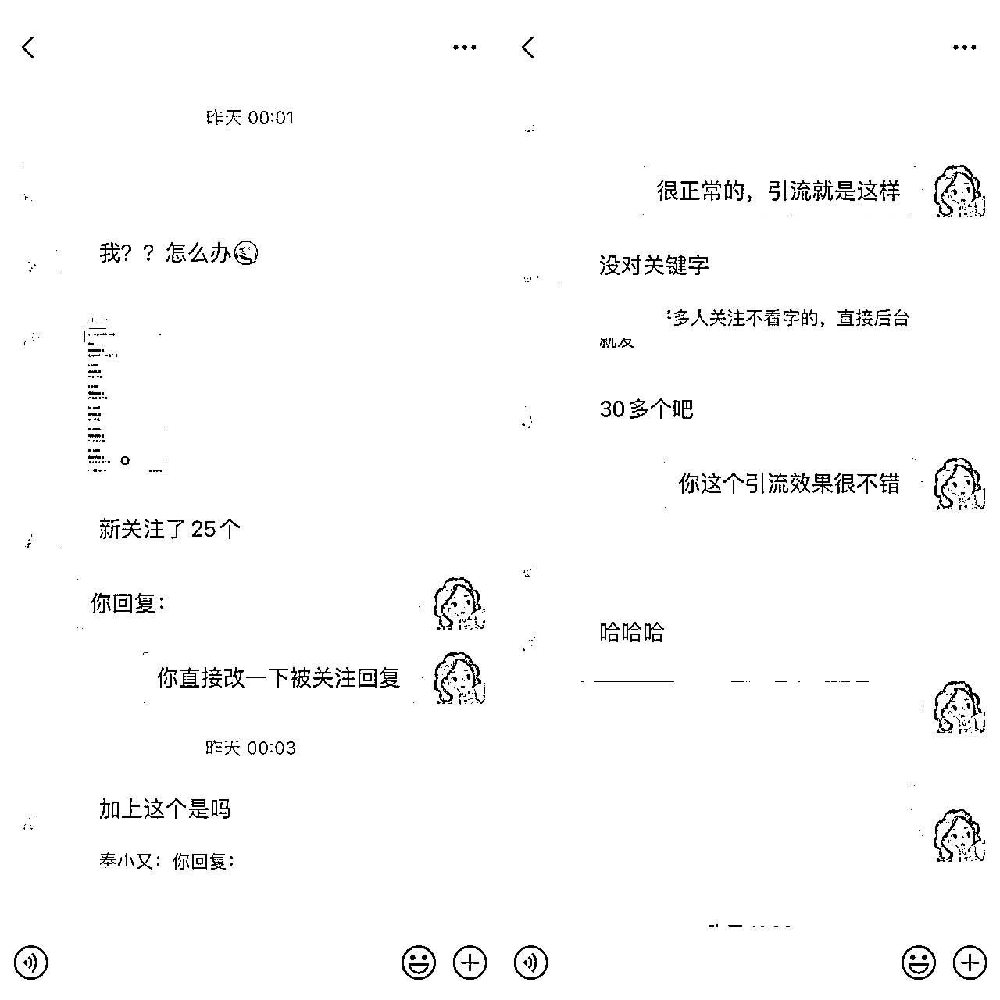
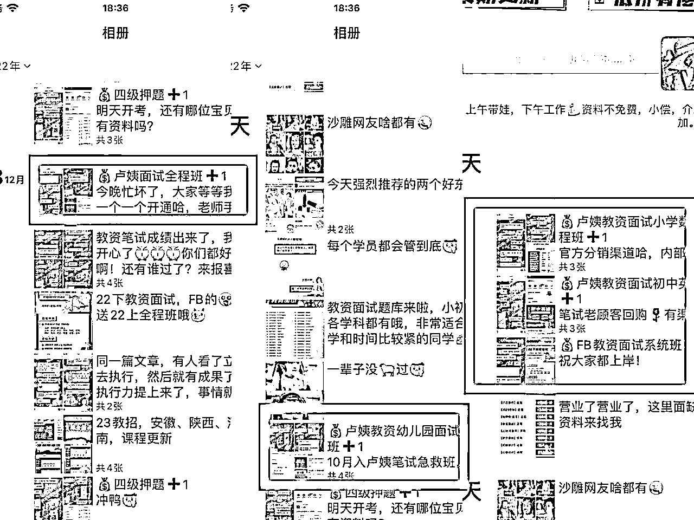

# 2023总会分享会：月入过万，学习资料项目如何没有淡季

> 来源：[https://jvx6nnxr4va.feishu.cn/docx/OjOTdd0pZoxazJxOnu6cParFnUd](https://jvx6nnxr4va.feishu.cn/docx/OjOTdd0pZoxazJxOnu6cParFnUd)

大家好，我是小又。

裸辞全职做自媒体一年多，2023年营收19.67w，除去一些合作伙伴的分销返点，再加上银行卡提现的几千块团购收入，实际收入大概在18w左右。

前两天我分享了没考过教资、非师范专业如何7天上手做资料项目，这个经验是我自己总结出来的，我后来带的学员用的也是这套方法。

上次分享的内容在这个链接：

上次直播快结束的时候有同学提问：一开始可以选择哪个赛道，是只能做一个考试赛道吗？

做资料项目我们前期都是建议先专注做一个考试赛道，因为你刚接触这个项目，如果你什么都想做的话，往往什么都做不好，但是如果你把一个赛道做好了，其他的考试赛道你也能很快上手。

有一个主打赛道也比较有利于粉丝粘性，增强粉丝的信任度。

但是你如果想收入更稳定一些，那我的建议是你最好有一个主打的做得专业一些的考试赛道，其他的考试作为辅助。

不管是什么考试，不管一年考几次，它也不可能每个月都考的，像教资这个赛道，每年两次笔试两次面试，已经是所有证书考试里面考得比较多的了，但就是教资这个赛道每次考试结束都还会有一个月左右的淡季，刚考完的那个月，你卖教资资料是很难卖出去的。

但是我们总不能说这一个月我们就不赚钱了呀！所以我们就可以临时性地去做一些别的赛道的资料引流。

给大家看一个我的学员案例：

这是我的一个做考研的学员，在教资笔试的时候每天也赚近200块。

我是做教资的，但是在去年年底临时做四六级引流，也赚了小两千。

那具体怎么去做呢？

# 一、关注各大考试的时间

提前一个月或者考前20天开始布局，趁考试热点疯狂输出。

一般来说网盘资料团队会有这样的考试时间表，如果没有，你可以去小红书搜XX年考试时间表，上面会有很多。

这些都很容易搜到。

大家也可以关注一下招生考试官网，上面也会有各大考试的详细安排。

# 二、临时做别的考试赛道引流，不专业怎么办？

大家要区分一下，我们是做临时性的考试热点引流，不需要你多专业，大概了解就行。这个阶段的顾客有什么特点呢？

其实临近考试，很多考生都抱着临时抱佛脚的心态来的，这个时候他们不会有太多问题，就希望有人给他一套重点资料，他突击复习一下，能过就过，过不了下次再战。

所以根本不需要你有多专业，一般网盘资料团队都有一些押题资料或者考试重点复习资料，你去整合一下，然后去各大平台引流就好了。

大家看，我就是把其他平台的人引流到公众号，在公众号后台做好关键词设置，一般他们都自己先转账了再加我微信来领取资料。

给他们领取资料以后再说点好听的话，比如祝你上岸之类的，再顺带嘴提一句我这里还有考研考公考编的资料，上岸以后有需要的可以随时找我哦！

这样他下次就有可能还会继续找你，我很多老顾客和转介绍就是这么来的。

# 三、去哪里引流？

你能想到的所有的平台都可以引流，公众号、小红书、抖音、微博等等。

我做四六级押题引流的时候很忙，因为要带孩子，所以每天只有四五个小时可以工作，当时只做了微博和公众号。

就这两个平台我都忙不过来了，公众号我只发了一篇就有20多个精准用户加我，成交率非常高。

我学员用我的方法去做，效果也很不错。

一篇推文，新公众号涨粉30多个。

微博就是去对应的超话引流就好了，不过要注意，一不留神很容易被举报或者被超话拉黑，这样你的号权重就会降低。连续被两个超话拉黑，你的号就废了。

小红书引流效果也很好，给大家分享一个比较基础的方法。

你把自己伪装成一个求资料的，发个帖子，加一个求资料的热度比较高的话题，等看着流量跑起来了，就自己在评论区说：找到了！太不容易了！

再找个小号去你自己评论的那条下面回复：姐妹，可以分享一下吗？

你自己再回复引导就行。

如果平台提示违规，隐藏笔记就行了。

或者去各大平台各种帖子下面截流，说自己上岸了，用的就是博主分享的这套资料之类的，再找个小号去你自己的评论下面问：姐妹，可以分享一下吗？

然后就会有人跟风说求分享，你再针对性引流就可以了。

# 四、不要忘记我们的最终目的

我之前跟学员说这个方法的时候，她问：不是说要尽量垂直吗？我现在发别的会不会影响我的垂直度？

大家注意啊，是尽量垂直，不是绝对垂直。

我们平时深耕一个领域没有错，但是偶尔可以发点热点文辅助。如果你主做的领域暂时遇到淡季，那么你是号重要还是赚钱重要啊？

咱们偶尔发点别的也不会就把账号搞没了，不用在意这些，我们的目的是变现！变现！变现！！再说，就算账号没了，我们有了做号的能力，重新做一个，照样赚钱。

我自己做废了好几个微博引流号，4个小红书号，废了就废了，钱赚到了，账号就完成它的使命了，如果一个账号做得很好，但是不赚钱，那又有什么用呢？

说到垂直度，就像川菜大厨，他主做川菜，但是如果有客人口味比较清淡，他也可以临时做别的菜系来满足顾客，顾客知道他平时主做川菜，别的菜系就算味道做得不怎么好，也不会怪他。

这并不妨碍他是个川菜大厨这个定位，能把这个临时性的顾客服务好，把钱赚了就行了。这个比喻可能不恰当，但就是这么个道理。

比如我之前在专攻四六级的引流，教资这块基本没顾上，但是做完四六级引流的时候，刚好教资笔试成绩出来了，照样很多人找我买面试的课程。

不管是做虚拟学习资料项目还是别的副业，都一定要把资源利用最大化，这样才能赚更多钱。

# 五、没有其他考试的押题冲刺资料包怎么办？

这个真的非常简单，去找同行买！！

如果你担心买了自己卖不出去，那就先去同行的账号找引流素材，自己处理一下图片，先引流，有顾客了你再去同行那里买一份问题就解决了，真的特别简单。

同行是最好的老师，在你不知道怎么做的时候就搜一下同行是怎么做的，很多问题就解决了。