# 视频号语音直播，涨粉几百，上千的完整流程玩法

> 来源：[https://k874t2qh8w.feishu.cn/docx/OjmfdzO4HoJPnJxJypOcKtKenPg](https://k874t2qh8w.feishu.cn/docx/OjmfdzO4HoJPnJxJypOcKtKenPg)

大家好，我是辰风。最近这段时间，很多朋友都在尝试做语音视频号直播，数据也非常可观。

我的一位朋友通过单日的直播，一天涨了1000多粉，我做了三场直播，每场涨粉也有100左右。

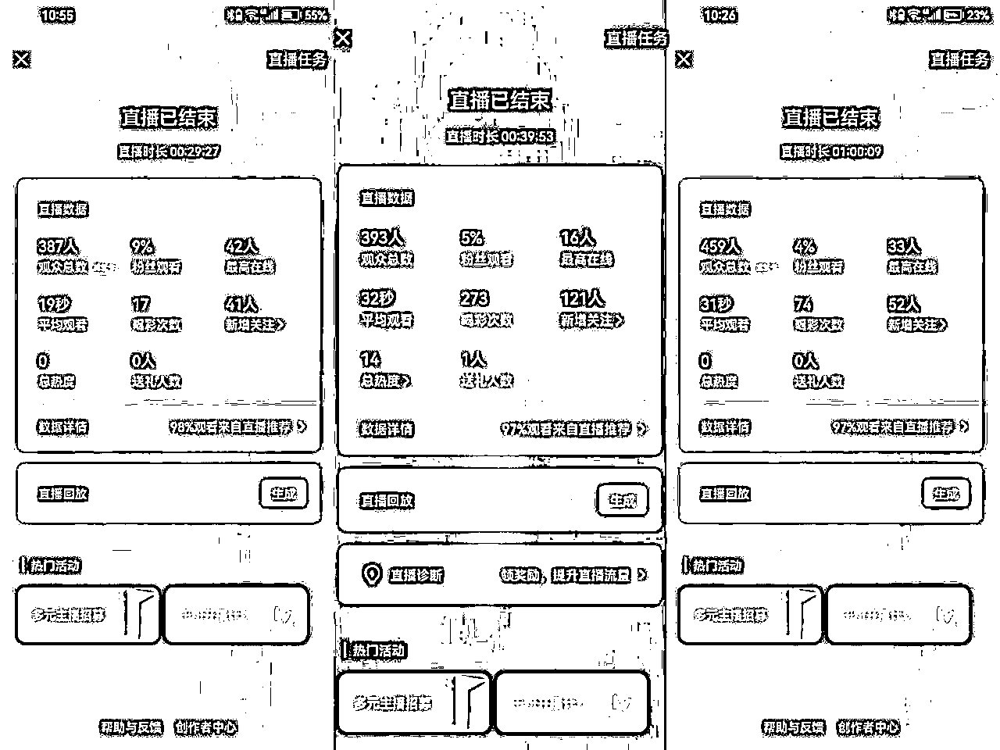

# 流量玩法简述：

视频号最近热度很高，很多人都入场在玩，并且拿到了数据反馈，场观可以多的达到2-3K，少的也有几百。

没有基础粉丝没关系，我们走的是平台推荐流量的模式。

玩法很暴力：语音电台开播，然后挂福袋，适当互动聊天，留人在直播间，做涨粉就好了。目标是两个：私域导流、视频号涨粉。

后端变现就是，通过私域成交，通过直播进行带货。

# 视频号注册

视频号需要在微信App上开通。打开微信app，在“发现”页面，点击“视频号”，然后点击视频号页面右上方的“人头”图标，就进入到了开通视频号的页面。演示截图如下：

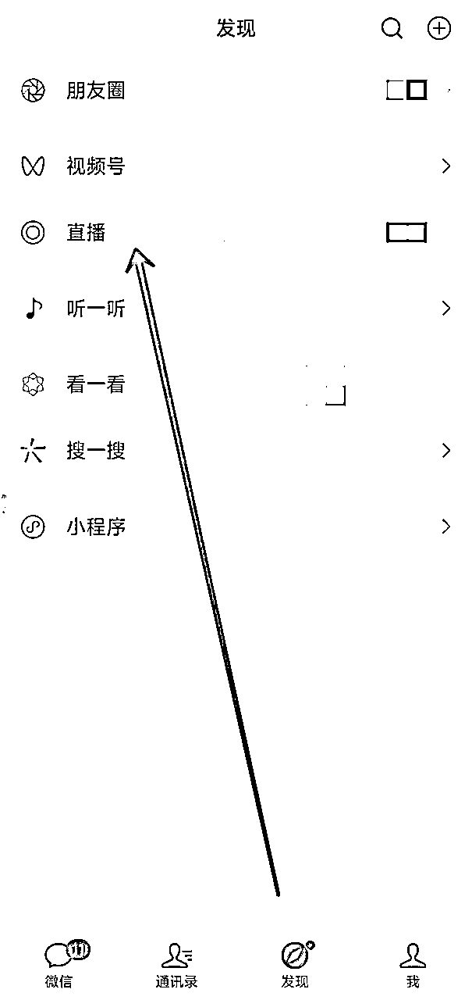

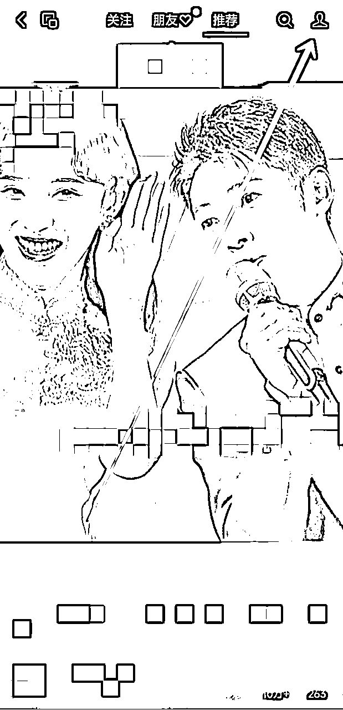

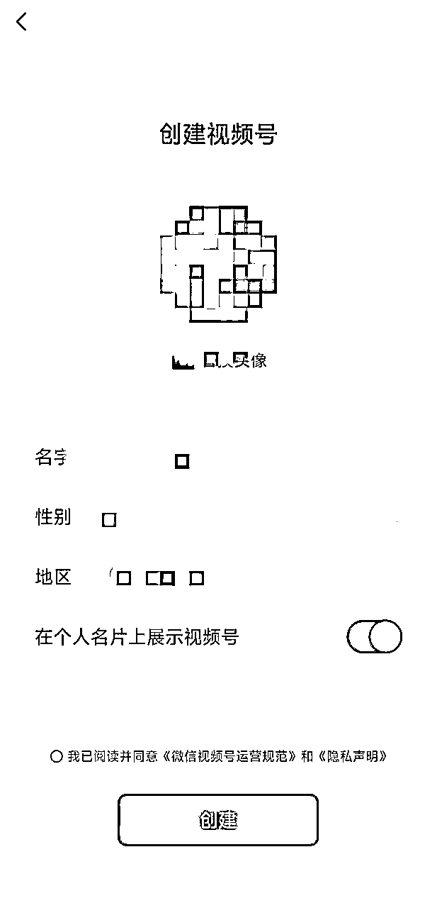

在创建视频号的界面，根据页面操作提示，选择好头像、性别，输入名字及地区，根据个人意愿和需求选择是否在个人名片上展示视频号，点击勾选“我已阅读并同意《微信视频号运营规范》和《隐私声明》”后，点击创建。

（小技巧:选择打开“在个人名片上展示视频号”按钮，在别人加好友后，或即使不加好友在某个群里点击我们的头像时，自己发表的视频就能得到更多曝光的机会，从而增加视频播放、点赞、转发及评论的可能性。）

# 视频号实名

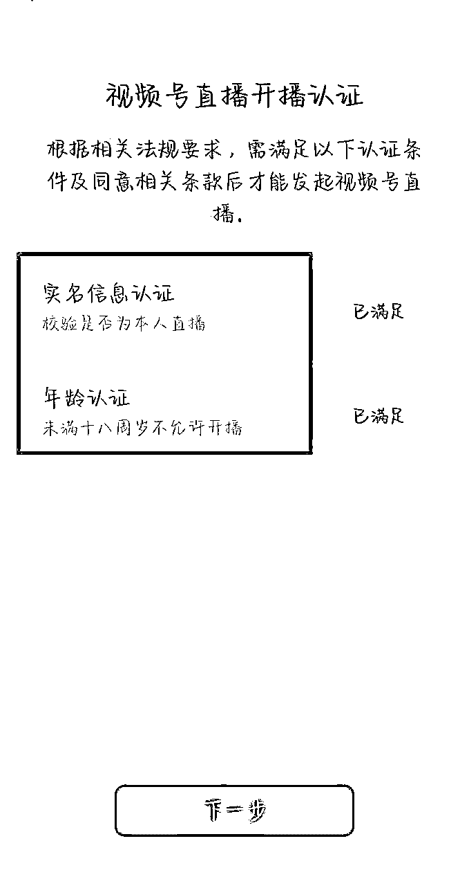

# 视频号开语音直播

进入直播页面，选择语音电台，然后开启直播。

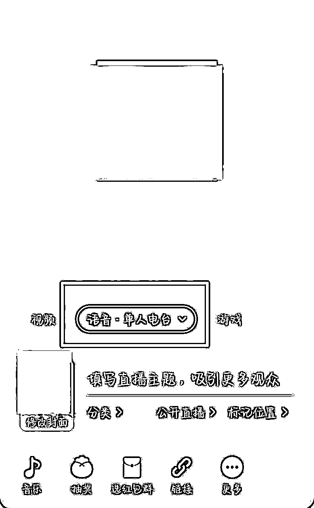

语音电台的直播没有办法贴图。如果你需要贴图，只能使用视频直播。

# 封面标题设置

在开播的页面进行封面和标题的设置。

今天是初五，很多人在迎财神，可以直接使用财神的封面。

因为视频号的主要受众用户是中老年，所以要迎合一下他们的口味，不要用年轻人的审美。

# 视频号音乐设置

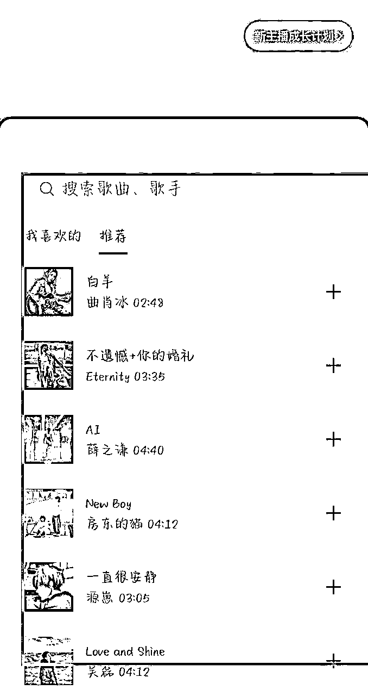

进入音乐搜索可以搜索一些过年的喜庆的音乐，比如好运来，财神来到我家门等等，然后添加到你的歌单。

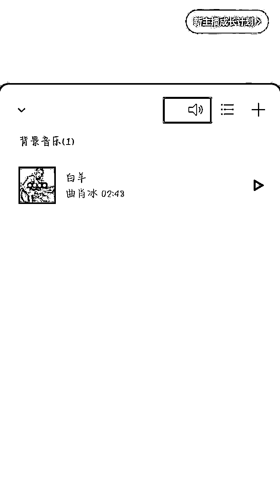

点击音乐就可以直接播放，然后进入上方可以调整音量大小。

# 视频号挂福袋

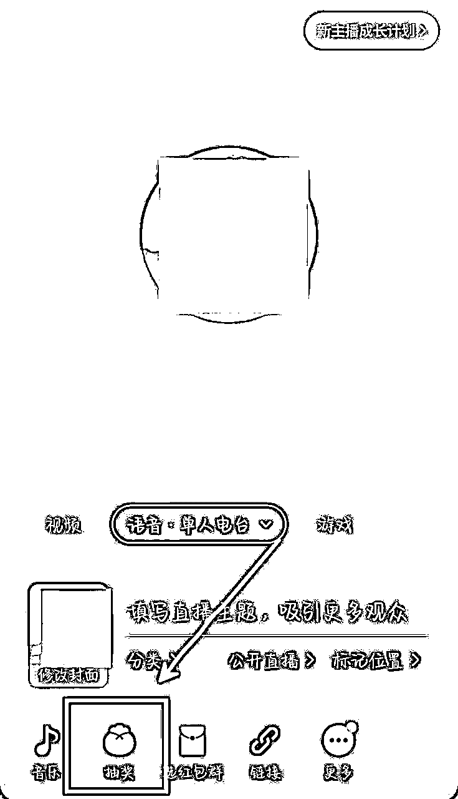

进入挂福袋的页面，可以选择发放爱心，一次可以设置3到4个爱心，然后开奖时间设五/六分钟。

不同的设置时长，可能用户的留存和关注转化效果会不一样，需要去进行测试。

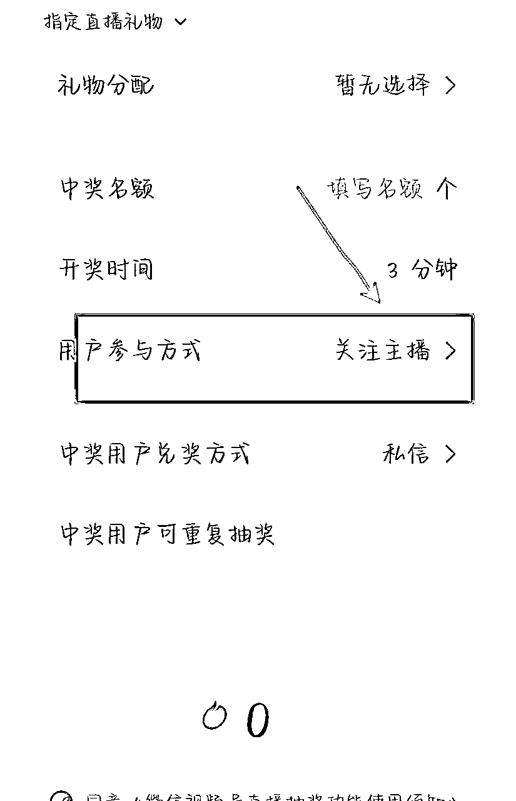

然后要设置成关注主播之后可以抽奖领福袋。

# 视频号引导关注话术

可以用小号评论，让大家抽奖领取福袋，然后设置上墙。

可以适当的做一些评论的福袋，让大家在评论区进行互动，增加直播间的流量。

并且进行抽奖福袋的引导。

在直播间说话，引导大家可以左上角领取福袋，有小惊喜。（家人们，可以加个粉丝团，给直播间点点赞）

话术参考：

家人们，把直播间赞点上来，5000给大家送一波福利。

# 视频号推流玩法

视频号刚开播的时候，流量是不错的，会有推荐流量进来。

等播了一段时间，你会发现不怎么进人了，然后停留的也很短暂。

这时候你可以转发一下你的社群和朋友圈。

通过视频号，在群里发红包。引导大家来进入你的直播间。

通过这个操作，可以给你直播间带来一些流量，用私域来撬动流量推荐。

坚持了没有流量的时间之后，视频号还会进行下一次的推流。

新号首播，会获得直播成长卡，大概有600点左右的流量。

一次直播成长卡有100点，可以用一场，一天只能用一次，可以设置使用时长30分钟、60分钟...

成长卡可以为你单场直播带来几百的流量，还是很不错的。

成长卡使用时间是60天，过了时间就不能用了。

# 视频号引流策略

视频号可以实现跟公众号互绑，但是需要是同一个管理员。

这个前提条件是，老号才可以。（新账号无法互绑）

进入视频号，选择账号管理，选择绑定公众号。

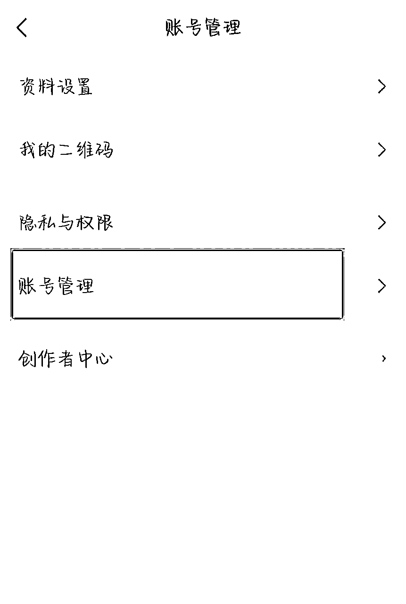

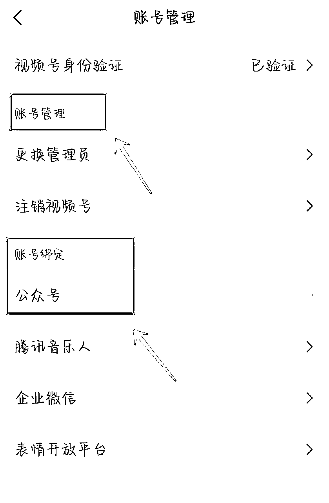

如果你实现了视频号和公众号的互通，他会以公众号身份发起视频号的直播。

等你开播的时候，公众号也会有一个主页的开播提醒。

# 视频号变现策略

## 公众号导流

通过视频号直接直播，可以给公众号进行导流。（后面有聊公众号和视频号互绑，通过公众号身份进行直播）

以公众号身份直播之后，用户关注会直接跳转到公众号。

提前完成好公众号的基础设置，关注后回复，在内容当中植入微信号，或者cpa广告。

用户回复关键词，就会收到广告，跳转过去之后会产生广告收益。或者直接借这波导流到私域微信上。

## 橱窗带货

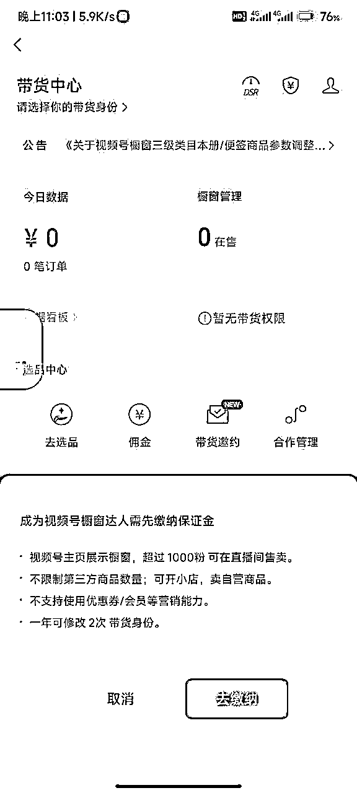

视频号粉丝达到1000粉，可以开通带货，部分类目需要交保证金（这个价格不低）

达到 100粉 要求，可以开通创作分成计划，发布原创视频内容可以获得收益。

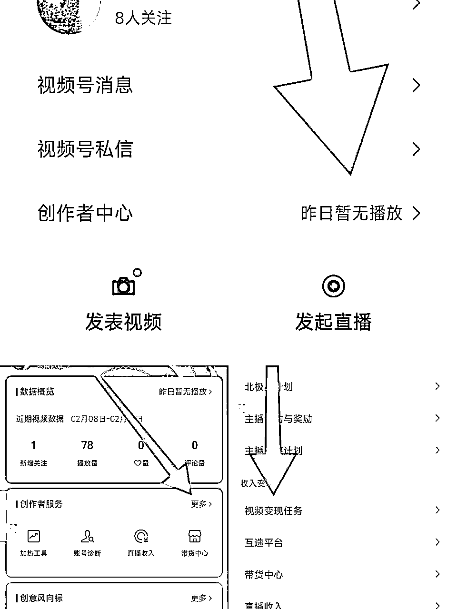

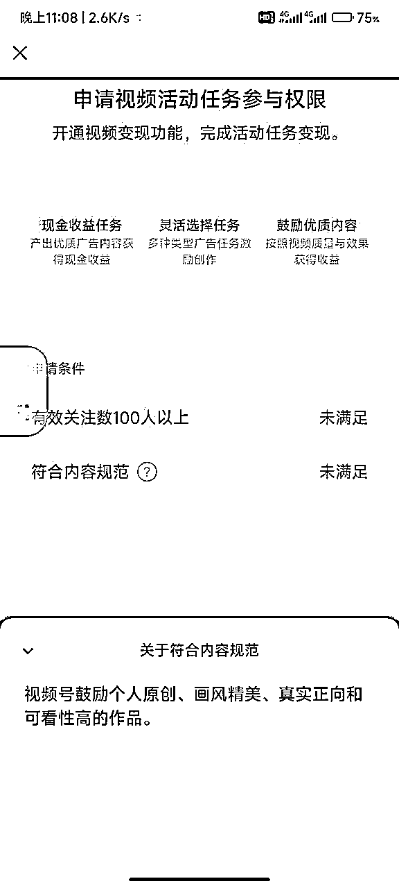

# 避坑小建议

注意违禁词:比如提及其他pt

不要完全无人直播，容易违规限流：我之前就是直播挂着歌，没有说话，然后他说我多开直播，给我判了中度违规，后面就没有流量。（另外有位朋友，好像提示是网络环境问题，也是类似）

视频号对于违规没有明确具体的规则说明，也没有清晰的解决方案。

包括你发的视频，如果原创不过关，或者有违禁词，就直接给你限流或者判违规，有的也不会给你私信提醒，很麻烦。

上次我发的视频，就是提及红包封面项目，然后他说我是虚假兼职，给我账号限流。

然后我当晚发了十个口播视频提交，进行自证，之后他才解除了我的限流。

# 其他常见问题

## 如何修改封面和标题？

在开播页面进入，开播之后也可以修改。

封面和标题非常重要，可以好好想想。可以尝试那种有爆点的标题，多用数据，带IP感的内容。

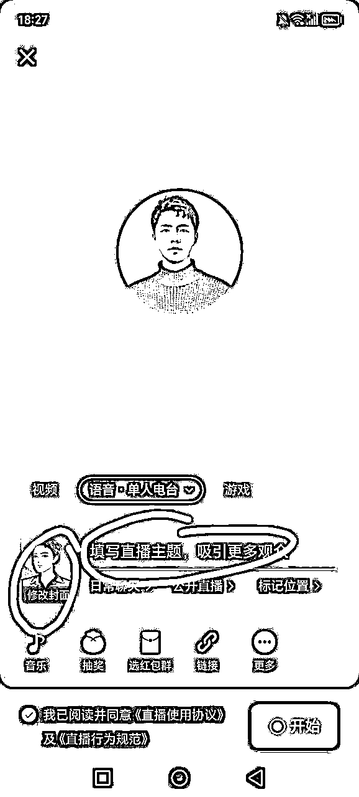

## 如何设置粉丝团？

粉丝团，一个微信豆就可以。

可以设置名字，还有设置公告。

## 没有基础流量可以做吗？

可以，咱们走的主打是推荐流量，所以有没有基础流量，没啥影响。

如果流量推荐较差，可以用私域，转发朋友圈，或者社群，来带一波流量。

## 如何提高涨粉数据？

福袋设置好，发放数量和时间，不要断。

适当说说话，引导大家领取福袋抽奖。

提升曝光度和观看人数，人多的时候可以多引导一下，一个话术反复说。

## 如何提高直播间的流量？

第一，优化封面和标题。

第二，视频号主要看的是加粉丝团，点赞，评论和停留时长，可以在这些数据上面下点功夫。

第三，转发社群，朋友圈。

第四，提前做好预告。

## 如何用公众号身份开播：

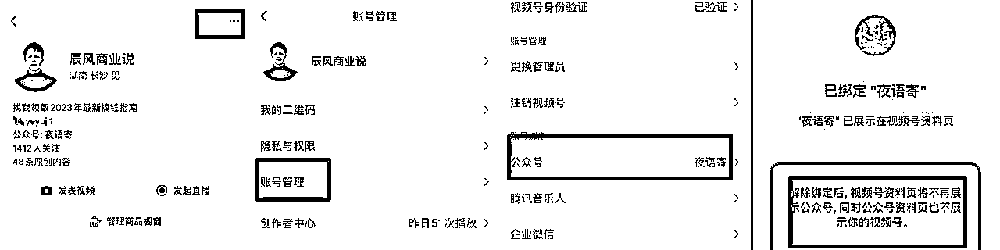

绑定公众号和视频号（必须是同一管理员）

进入视频号，打开“以公众号身份展示视频和直播”

然后你可以小号看看自己直播的身份是视频号还是公众号。

用户关注的话，会关注到你的公众号。

## 如何进行评论？

不能自己评论，只能用小号，进入直播间评论。可以设置一个管理员，然后选中评论长按，设置上墙。

## 关于限流问题自查

可以试试能不能加热

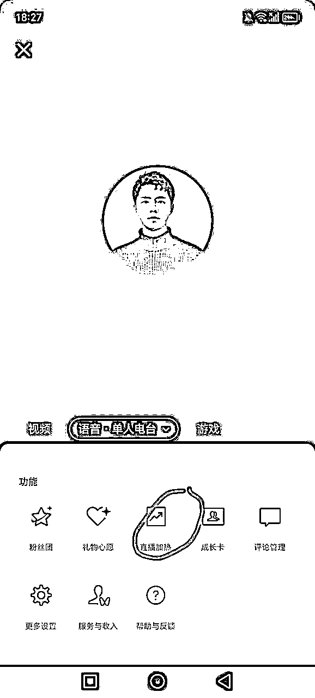

https://zhuanlan.zhihu.com/p/669652238

进入“创作者中心”，进入“账号诊断”，然后即可查看视频号和直播状态。

视频号对于内容限流和账号限流这块非常严苛，一旦限制就很麻烦，所以必须熟悉平台规则，避免进小黑屋。

如何解决：

进入创作者中心，拉到最下面，有个问题反馈，然后点进去，提交你的问题（要选择人工客服提交，等他回复）。

有的时候不理你，多骚扰一下。