# 03年女大学生从0做私域养成系IP，通过精准女粉5年变现千万全复盘

> 来源：[https://bokm2adr1g.feishu.cn/docx/OkzTdA7skoh0rkxlviicpFzQn7f](https://bokm2adr1g.feishu.cn/docx/OkzTdA7skoh0rkxlviicpFzQn7f)

大家好，我是虎牙，一名03年大三在读生，也是一名自由职业创业者，斜杠影视人。

迄今为止，我接触自媒体7年、做私域变现5年，从0到1积累40W+私域流量（99%年轻女粉，主要群体为同龄大学生），拥有千人直系代理团队，陪跑1000+创业者，累计变现上千万。

先上图，有图有真相，我自己的引流日常⬇️

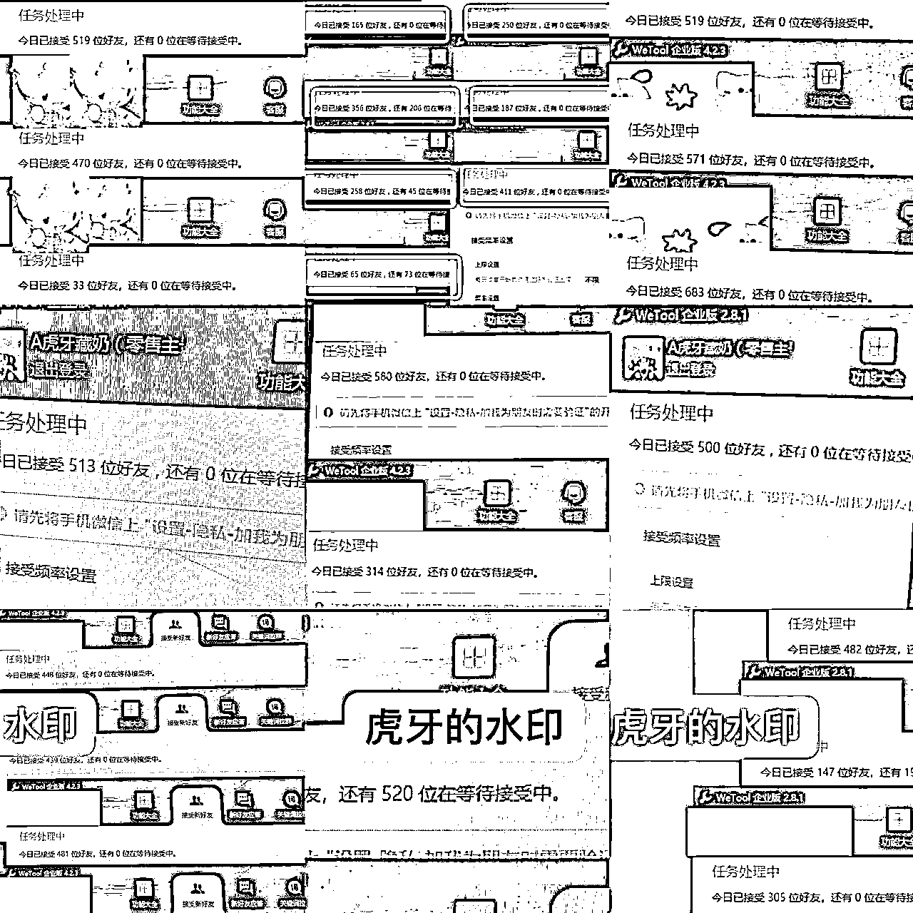

我的自动成交日常⬇️

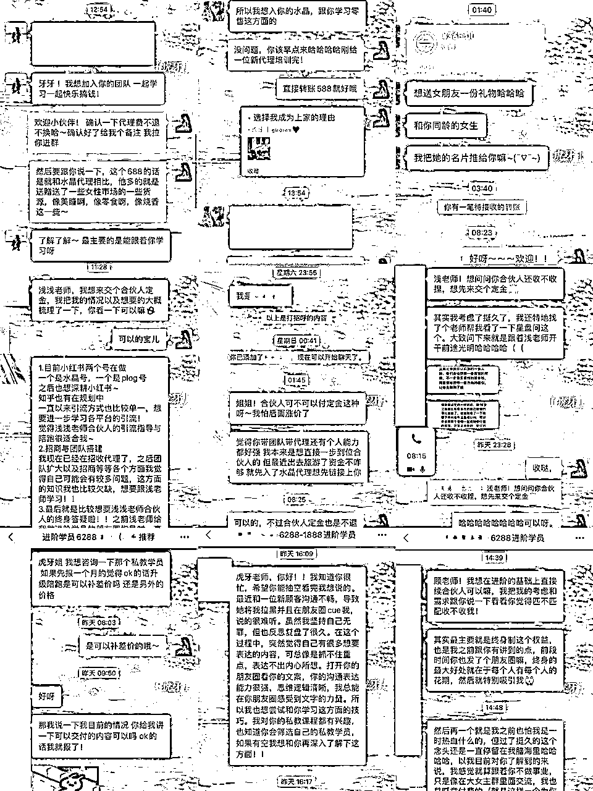

我带出来的代理/学员的引流转化日常⬇️

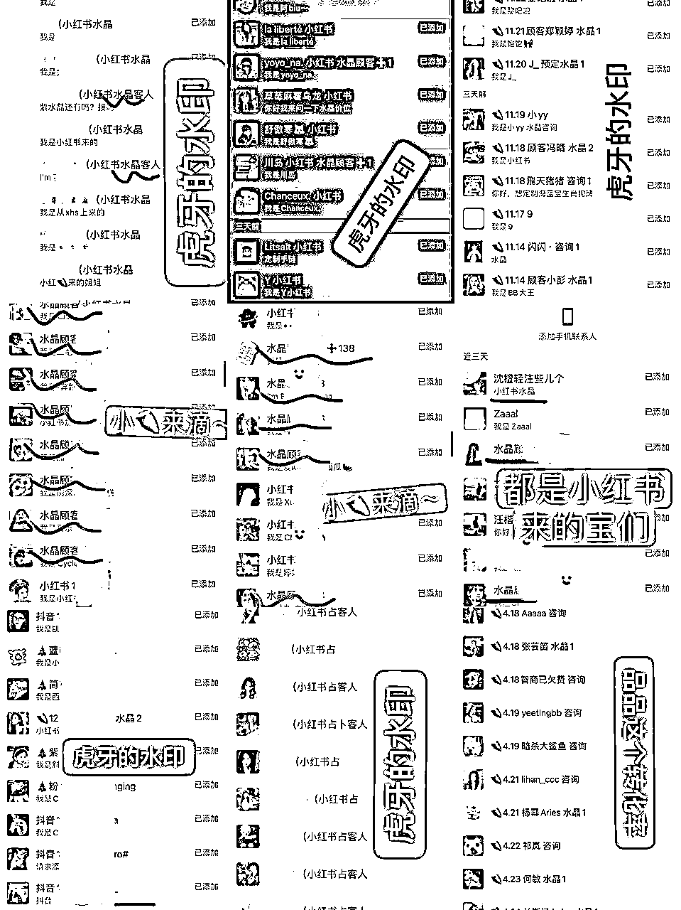

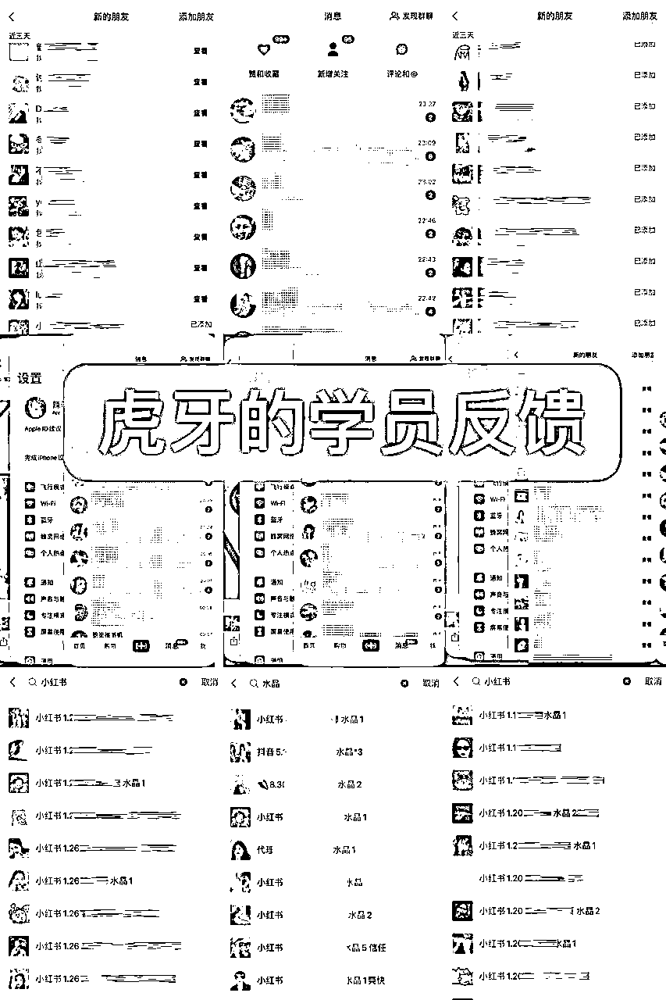

本篇复盘，我将会详细分享我是如何在0资源、0背景下，在大学期间，就靠着私域IP运营变现千万的实战经验。

大家一直都很好奇「虎牙的创业之路」，在每个阶段，到底抓住了哪些关键的机遇契机？做了哪些事情？

如何确立可以穿越时间周期，撬动最大杠杆收益的商业定位？能让我越做越顺，越做越赚钱，稳中有进？

如果你正处于迷茫阶段，想在做个副业，却缺乏一技之长，不知该从何做起；

如果你有自己的想法，想靠副业实现经济独立，做自己人生的大女主；

如果你正处于创业初期，有流量或私域运营上的卡点……

我的成长历程，或许可以给你答案，

因为这些都是我从0到1成长过程中，切切实实遇到过的难题与卡点。

在本篇文章中，我将会从以下几点给大家详细分享：

一、我是怎么走上女粉私域变现这条路的——虎牙的创业之路：从微商做到私域IP导师

1、入局：水晶结缘，早期私域沉淀

2、探索：合作增加，进入发展瓶颈

3、进化：定位导师，私域陪跑成型

二、如何做好成长型IP，拥有高粘性私域铁粉？

1、为什么一定是成长型养成系IP？

2、如何打造自动转化系统，拥有1000个铁杆粉丝？

3、向上链接的秘诀，20岁怎么养成易遇贵人易得贵人相助体质，收到大佬投资，同行青睐。

三、虎牙成事心法：奔赴热爱、择一米宽、借力打力

1、从0到1：奔赴热爱，真实做自己

2、从1到10：择一米宽，掘万米深

3、从10到100：借力打力，强强联合

# 一、我是怎么走上女粉私域变现这条路的——虎牙的创业之路：从微商做到私域IP导师

## 1、入局：水晶结缘，早期私域沉淀

其实我开启搞钱之路的契机还挺简单的，接触互联网比较早，从初升高的时候，因为追星开始玩手机，玩微博，玩qq，积累了很多同好，加的好友都是同龄的追星女孩，这是我最早的一批私域女粉，很多人甚至都留到了现在。

当时决定做水晶微商，就是我起家的行当，其实也很简单，是被一张空间刷到的水晶图种草了，当时的价格是198还是228，对我当时来说是比较超经济能力的东西，但是抵不过我一直惦记着一直想着，最后就攒钱买下了这串草莓晶。

最开始真的只是单纯觉得好看，没有考虑到功效那些，但那时候也是第一次歪打正着，感受到水晶的魔力，因为我那串是招桃花的，当时桃花就很旺，也是那时候遇到了我现在的男朋友，我们今年已经算在一起第五年了。

女孩子嘛，真的很喜欢好看闪亮的东西，对于玄学类物品更是没有抵抗力了，当时的想法其实很简单，就是我自用觉得好，想赚点零花钱，就去做了代理，这是我赚钱的第一个小契机。

出单也挺顺利的，因为当时的好友列表，都是追星女孩，是非常有经济实力和消费能力的一批人。而且大家都是同龄人，知道你想靠自己努力赚点钱去见偶像，都会非常的支持你。

直至高三毕业那年，我决心好好把这份小打小闹的事业做起来，把战地转移到了微信，迁移了大部分的好友。

那会儿，我就经常被列表评价：不是常见的那种让人厌恶的“机器人刷屏式传统微商”，而是一个有血有肉，生动生活的“养成系微商”，还挺讨人喜欢的。

也是那段时间，我靠着那时没什么人强调的超强“个人IP属性”，靠真实，在传统微商中杀出了一条血路，获得了不少小伙伴的喜欢。

## 2、探索：合作增加，进入发展瓶颈

随着水晶业务的深入，我的商业模式也趋于稳定，主要是“零售+代理”，代理团队逐渐壮大后，我带出了越来越多厉害且优秀的代理，来找我学习、合作的人也越来越多。

因为大家都是同行，需求大同小异，所以我当时的定价统一都比较低。换算到产出比上，就是很损耗精力，但又赚不到多少钱。

但也有好处，是在这段期间，我积累了各行各业的学员样本，亲自陪伴学员跑通了一个又一个小闭环，也为后期踏入知识付费领域奠定了坚实的基础。

真正意识到考虑要探索新领域，是在当时的状态下，我感觉自己的商业模式已经摸到了天花板，想要再往上突破就没更多出口。慢慢的，就有点陷入迷茫阶段，找不到做事业的意义，也摸不清自己的定位。我清楚的知道，如果我想要有更多成就、更大追求，就必须做出改变，这个时候如果不进步，那就是退步。

## 3、进化：定位导师，私域陪跑成型

在无数次代理答疑，面对同行讨教的过程中，在无数次合伙人“你真的很适合做知识付费”的提议下。渐渐发现，我是有「导师」属性的，我发现我是喜欢做教学的。

我享受输出的过程，享受帮助、见证和陪伴他人成长，获取正向反馈的过程。在还不清楚知识付费是什么的年代，我也会有意识的去链接厉害的同行，为她们付费学习，精进自己。在这些过程中，我逐渐尝到了知识传递的快乐，也下定了要做好知识付费的决心。

我开始从我的擅长出发，开始在知识付费行业摸索，慢慢一点一点的建立自己的产品体系做个人IP——

我发现我很擅长观察和挖掘自己和身边人的闪光点，并把这些优势最大化展现，甚至基于这些优势变现生钱。

我发现我很擅长用文字来表达情感，我很擅长去写故事来展现人物背后的价值。我知道怎么通过文字去展现一个人的价值，怎么通过私域去达成变现效果。

在无数学员案例的陪跑过程中，我慢慢确定细化了我的导师IP定位：

为不同阶段的创业者提供个人品牌孵化的IP陪跑导师。

以此定位为基础，不断推出完善出了自己的服务体系：陪伴性创业者社群-引流训练营-私教陪跑。

如果说一开始因为追星、因为喜欢入局水晶微商是运气，是歪打正着、误打误撞，是命运推动的齿轮，

那选择转型做知识付费，做到今天这个位置，就是我自己主动抓住的契机，

是靠着实打实的一个个学员样本，靠实战积累的认知差、信息差，是靠着在同龄人打游戏的时间来修炼白己的搞钱认知，商业嗅觉，靠自己不断的打磨和沉淀，不断的自我思考关于自己的更多可能性得来的。

这，就是关于虎牙的的全部创业经历。

了解完了我的创业史，那就来说说为什么我做水晶可以成功，做知识付费转型也可以成功，卖啥啥行，背后的秘密吧——

# 二、如何做好成长型IP，拥有高粘性私域铁粉？

## 1、为什么一定是成长型养成系IP？

可能很多小伙伴不明白成长型养成系IP是什么，虎牙先来跟大家科普一下，什么是养成系IP。

这是相对于专业型IP来说的，顾名思义，就是把自己从0到1的真实状态记录下来，把自己的心得记录下来，又或者把自己觉得有价值的内容通过整理分享出来。呈现从0到1的成长过程，在用户的见证下，从小白成长为一个有影响力的IP。

自媒体兴起后，越来越多养成系IP崛起，比如小红书上的博主@俩不正Yy，就是以“搞笑女”身份，从0开始学习化妆，最后成功逆袭的养成系美妆博主。

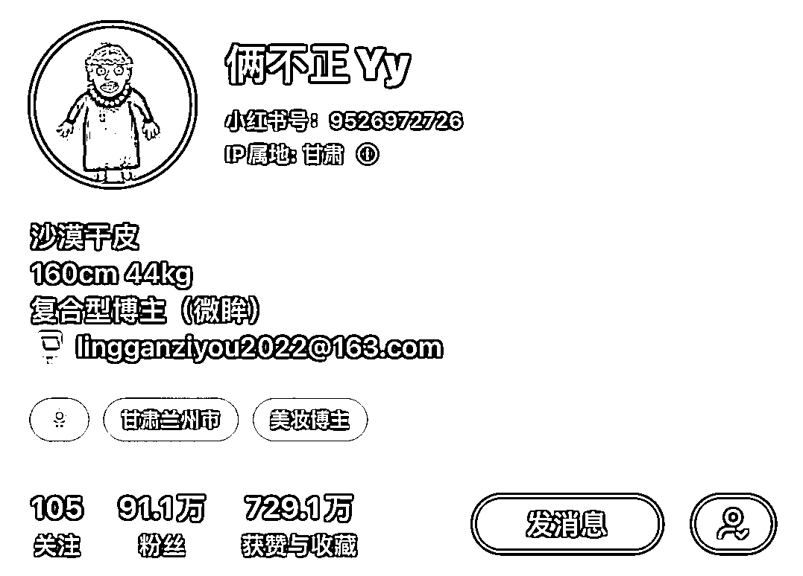

她的人设定位是，幽默有趣，沙漠大干皮，单眼皮的复合型美妆博主。视频内容是同类型单眼皮、干皮女生可以学的化妆教程。

最大的亮点是性格幽默，自嘲是微眸，妆前妆后差距大，自学养成系美妆博主。同样单眼皮的想学化妆，且喜欢看幽默人设的女生就会被她吸引。

而她的成长历程，也是典型的成长型IP路径，俩不正一开始的小红书其实是做穿戴甲分享，但穿戴甲笔记的热度反响平平，并没有掀起什么水花。

在2021年7月10日，俩不正在小红书发布了一篇关于妆容改进的笔记，收到了她入驻小红书来第一篇高流量笔记。

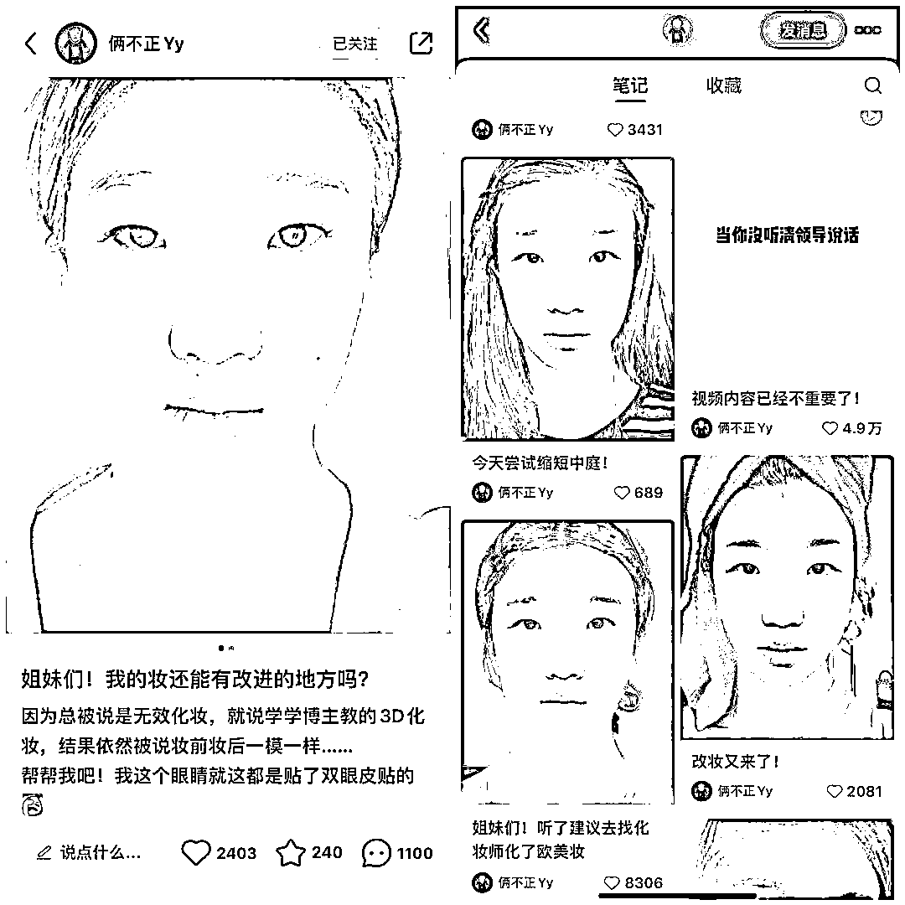

俩不正听取了评论区的建议，对自己的妆容进行了改进，并且在此基础上做出更多的改进，对于这种“听劝”的养成系博主，深得大家喜爱。

随着妆容学习的视频却来越多，又加上俩不正本人幽默的性格，让她的账号热度有了质的提升。俩不正也从一开始的化妆小白，变成了现在能够教其他人化妆的美妆博主。

回头再看，为什么养成系IP火了？因为小白能够更加有情绪共鸣，也因为人性使然，人们的窥探心理，现在偶像养成的综艺选秀节目为什么都那么火，也是这个原因。

虎牙也是一个妥妥的典型的养成系IP，从水晶：陪伴女生们变幸运；塑形产品：陪伴女生们变自信、变美丽；到知识付费创业陪跑：陪伴女生们变独立，变有钱；是随着年龄的增长，也是随着虎牙的成长，陪伴了女孩们成长的每一个阶段……

我们普通女孩最适合的路，就是养成系。

或许我们都没有好的原生家庭，漂亮的脸蛋，姣好的身材，牛逼的学历。

但是我们每个人都可以重养自己一次，并且靠这个过程，获得我们的第一批粉丝，赚到我们的第一桶，二桶，很多很多桶金。

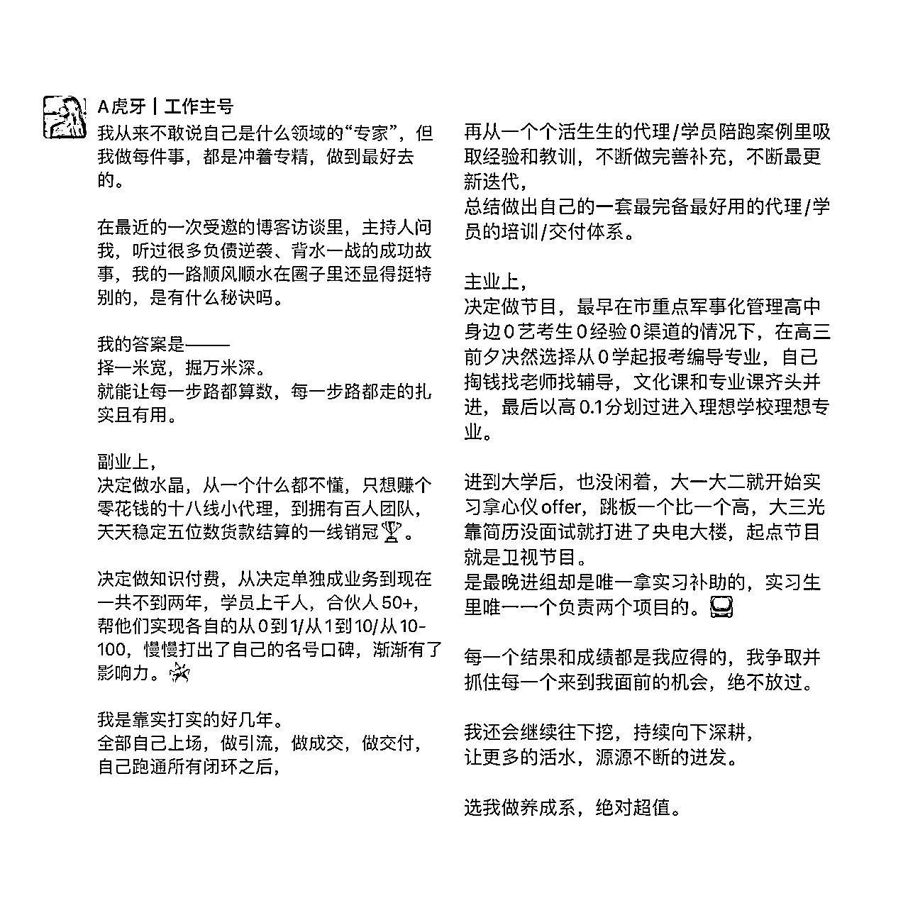

关注我的朋友，追我的朋友圈，就像是追了一部永不断更的连续剧，陪伴主人公不断成长，一路蜕变，成长成更好的自己。

喜欢我的小伙伴，就像是投了一只潜力股，看我一路长虹，这种成就感和获得感，是双向的。

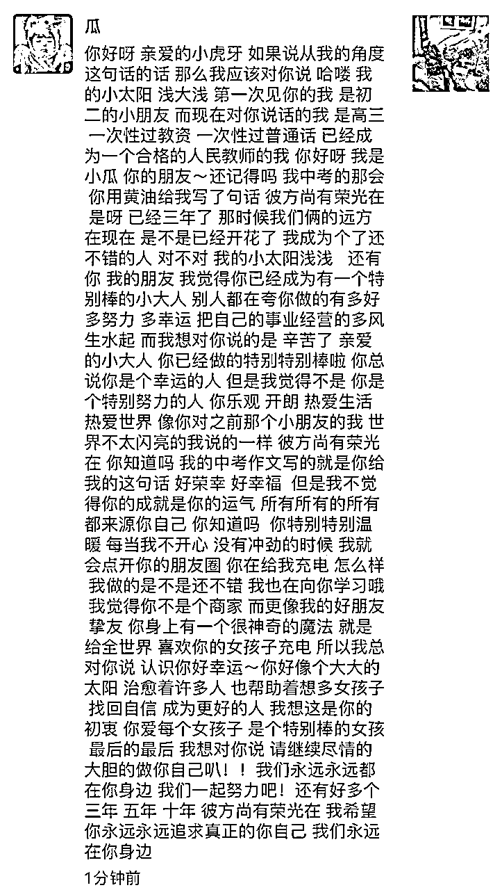

从最初十块钱周边都要纠结靠省出来才能买的13岁小女孩，到如今这个经济完全自由独立，闪亮的大女主。

当今时代，一鸣惊人，一夜暴富站在顶峰的案例已经不足够吸引人了，

而普通人从0到1的，真诚的一路成长历程，更能打动人心。

不是所有的IP都是教授、专家型，

如果你暂时还没有自己的一技之长，完全可以做一个养成系的成长IP，和用户一起成长。

当一个用户能够看到你长期的改变，他就会渴望跟你拥有同样的改变。

养成系的美好，是用户与IP能够相互陪伴，一起成长，彼此见证一路的蜕变、长大、成熟，走向大众、站上巅峰。双向持久的养成系，是养成和被养成互相滋养，我们都成为了约定里更好的人。

所以，在我成长的这5年中，

我的小伙伴们也渐渐的开始认识我，关注我，喜欢我，熟知我，为我付费。

从最初的列表，到消费者，见证我一路成长，再到现在的学员，跟着我学习，一起成长。

这种养成系的信任，就是女性成长IP最强大、最无法代替的独有魅力。

## 2、如何打造自动转化系统，拥有1000个铁杆粉丝？

我有一本反复翻阅的书籍，名叫《一千个铁粉》，特别有共鸣。

在我的成长历程中，铁杆粉的存在至关重要，前期通过qq空间粉丝的原始积累，抖音图文泛粉引流，以及各平台各业务的精准粉丝引流组成了我这40w+左右的私域粉丝，再通过后期的不断转化，才筛选出了一批又一批我的“1000位”专属铁粉们。

她们是我的第一批支持者与拥护者，在后来的IP成长中，不断的重复的为我付费不同的内容，我做什么都无条件支持，也在持续为我介绍源源不断的新用户。

当你拥有了1000个愿意无条件相信你的铁杆粉丝，那你的事业一定做的快乐又舒服，且不愁业绩。

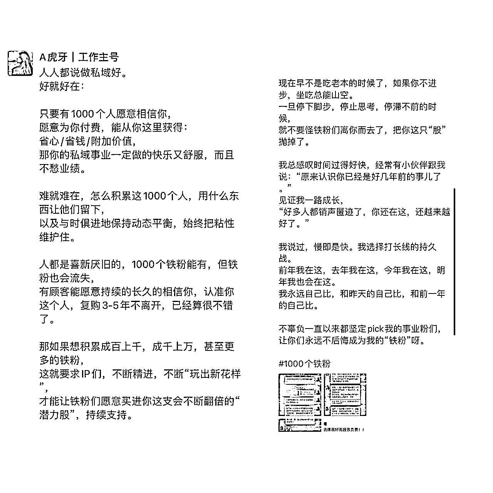

那怎么拥有这样的一群铁杆粉丝，让他们反复为你付费呢？

这就不得不提到朋友圈了，虎牙的一大擅长技能点就是靠朋友圈实现全自动高转化自动成交。

那这一part，我们就来聊聊，怎样来布局朋友圈，打造自动转化系统，让老用户更忠诚，新用户也能被转化呢？

我把我的朋友圈总结分成了以下三个大块：

### 1）品牌故事，让IP更专业

品牌故事讲的是个人IP故事，

可以是分享自身成长经历与经验，也可以分享自己的理念与价值观。

以这条朋友圈为例，

以2023年度总结的形式，分享我在2023的成长历程，

有成就、有成长、有生活，在用户眼前成长。

也能通过成就的总结，个人IP故事的讲述，让大家能够更直观感受IP的个人魅力：

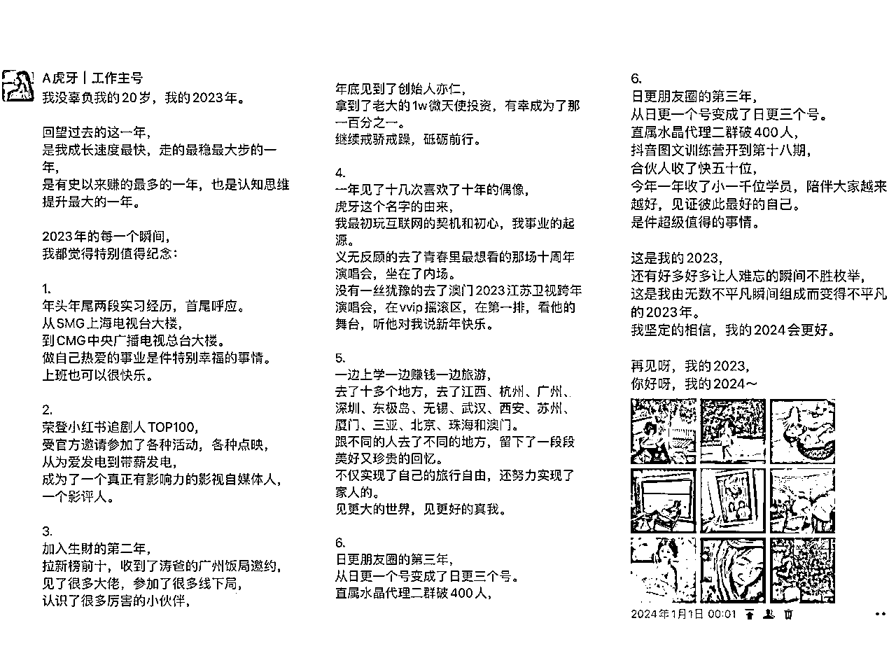

可以分享自己的成长历程，从最初的迷茫焦虑，到后来小有所成，一路走来的心态转变，成长蜕变，也是绝佳的个人品牌故事：

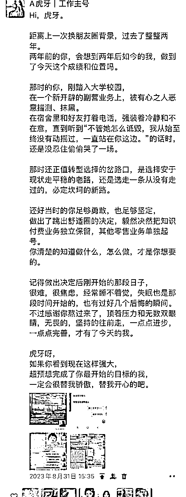

当然，也可以结合自己的选择，借“他人之口”的提问，做问题的解答。

去分享自己的人生观、价值观：

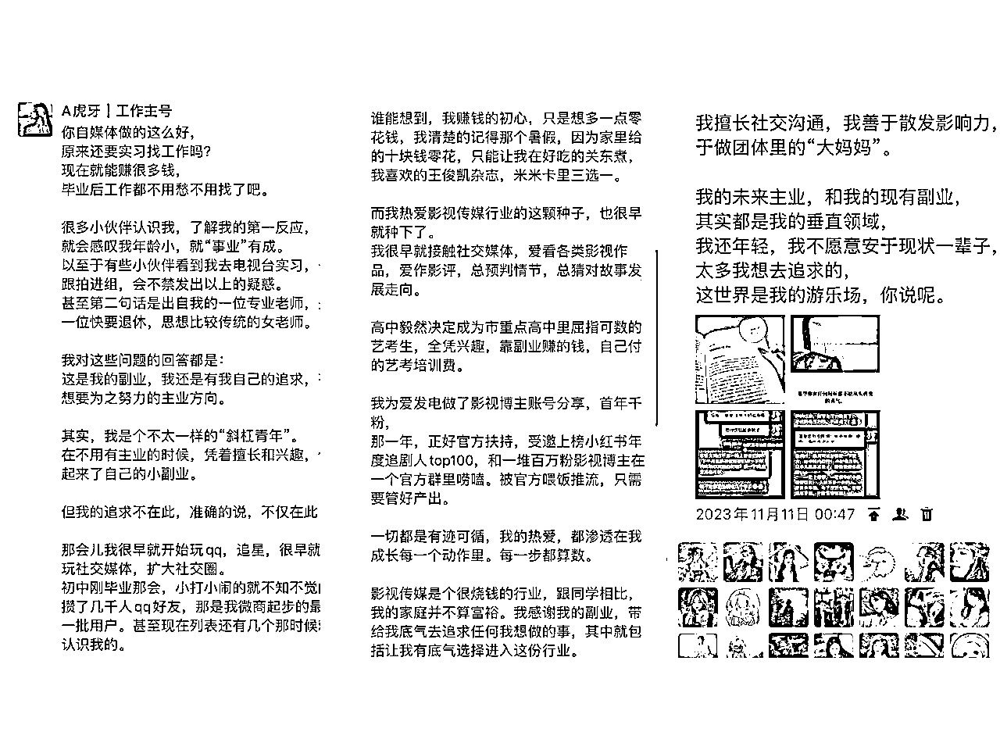

专业技巧、技能千篇一律，更珍贵的是你独有的成长经历、个人价值理念，这无数个有迹可循的成长瞬间，你的真实的多面性，才能构造出一个专属于你的独具个人魅力的专业IP。

### 2）学员故事，让IP更可信

只秀自己的实力，还是远远不够的，更重要的是，也要去秀自己的学员故事。

学员的成绩是一个知识付费导师最好的最拿得出手的作品。

将陪伴学员成长的点滴日常，以故事的形式讲述在朋友圈，

让你的交付具象化，让你的业务更有温度，也能有效积累信任度。

比如说以学员个例为素材案例，分享他们的成长蜕变故事，从0到1的成长史，

让观者有身临其境的见证感，也可以激起意向用户的同感自我代入，促进付费。

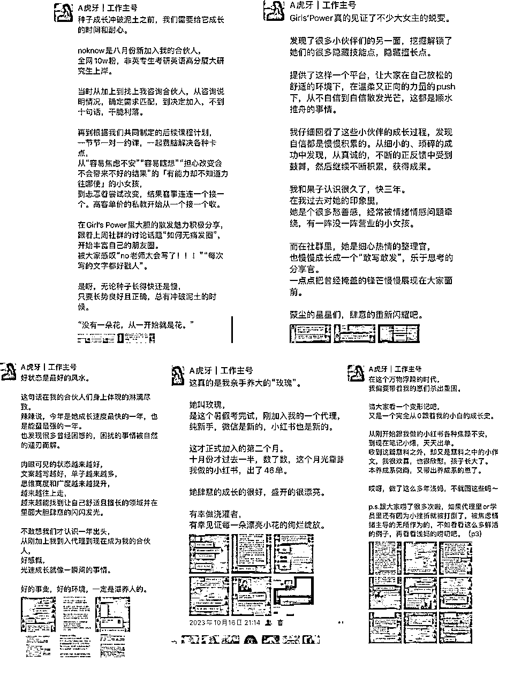

比如以于学员交付过程中输出的观点作为素材，也借此来阐述观点，

引起用户共鸣，踩意向学员痛点，对号入座。

比如在做同行学员的IP陪跑时，

以痛点情景引入，讲述一位学员明明是实力很强的老微商起家，但随着时代的蜕变，现在变得什么都不敢做，怕不被认可，从而随波逐流，甚至抄袭他人的情况，

再提出我的回答，我的处理态度及应对方案，我的观念：

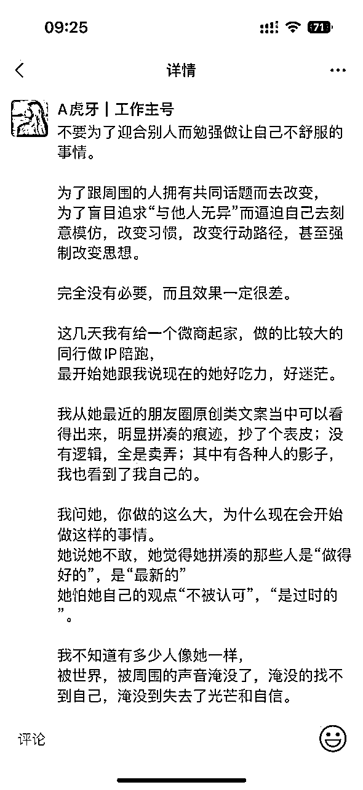

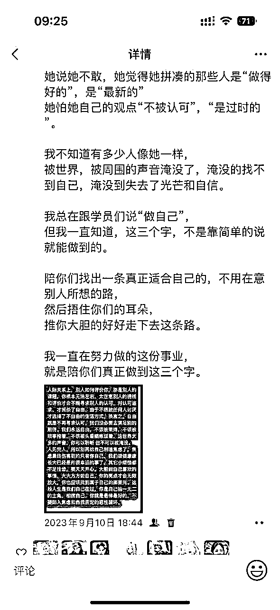

再比如这条朋友圈，就是通过讲学员故事，坚持强调重复自己的观点与理念，帮助学员找到属于自己的、拥有自己风格的那条正确的路。

讲述不同的学员成长故事，体现我做知识付费的理念，尊重每个学员的独特性，擅长挖掘每个人的优势，各花有各花香，引导大家大胆做自己：

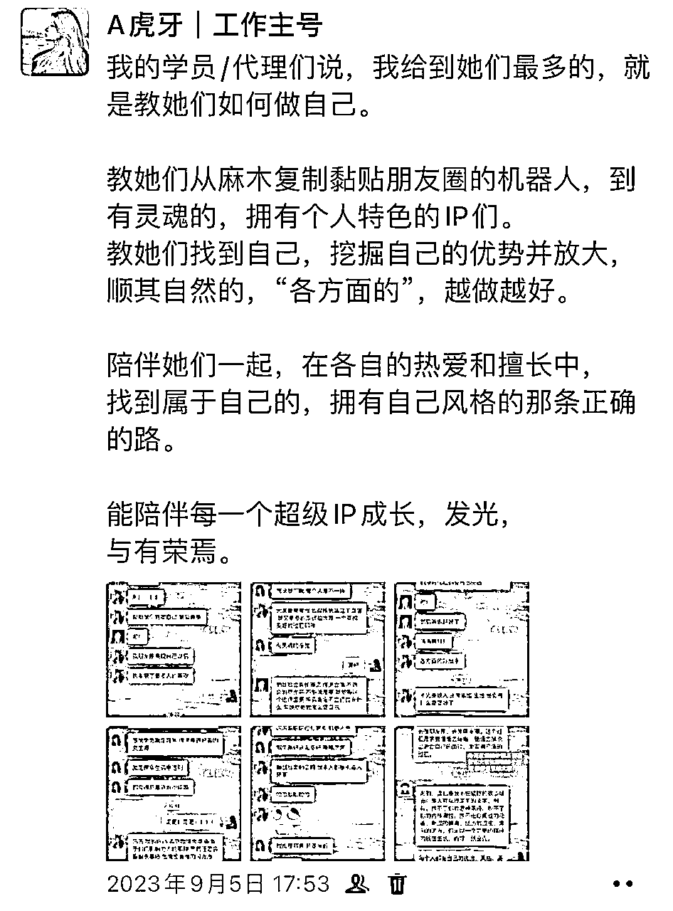

### 3）生活日常，让IP更立体

这里的生活日常，不是简单的分享日常，而是带IP成交属性的日常。

我们的日常圈，是非常好的别人给你刷印象，丰富你的个人IP，让你这个人立体化、生活化的绝佳利器。

我们可以展示自己专业之外的另一面，生活中的那一面，或可爱，或严谨，或细节，或温柔。让人更进一步的了解你，喜欢你。

人都有窥私欲，特别是对自己仰慕的，喜欢的，崇拜的人，总想多了解一些他的生活，他不为人知的一面。

就比如我平常会写日常规划，日常总结的朋友圈，列出自己之后要做的事情，或者总结这一天/这一周干了些什么事：

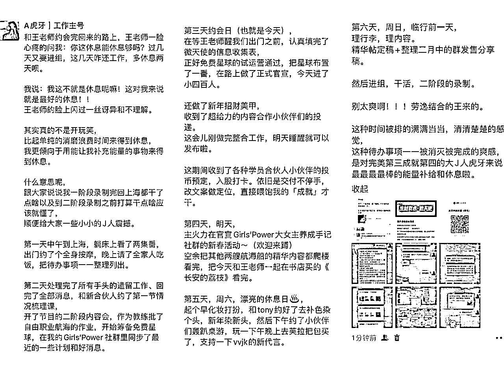

这条朋友圈发完之后，就有小伙伴评论感慨：

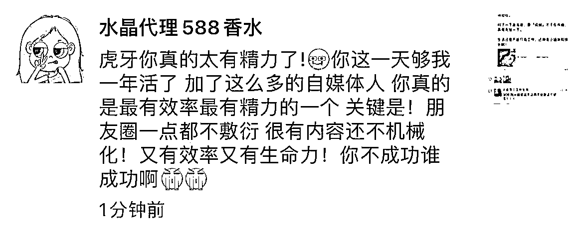

对于我的IP来说，我的日常规划被排得满满当当，

就是时间精力管理的好的最好的例子，一条普通的日常规划报备朋友圈，就能起到吸引到想跟我学习的人，想和我一样管理好自己的人的作用。

再比如平常结合日常引发的一些小思考，碎碎念，

也是非常好的记录生活，表达我们自己的方式：

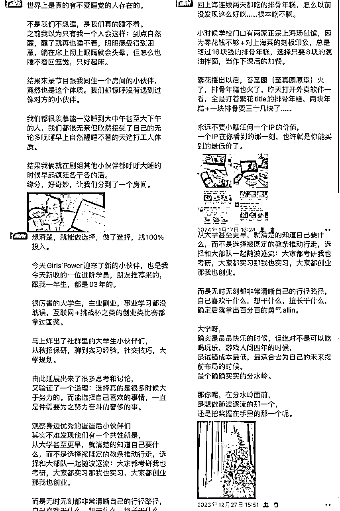

## 3、向上链接的秘诀，20岁怎么养成易遇贵人易得贵人相助体质，收到大佬投资，同行青睐。

“成功三要素：贵人扶持，贵人鼎力扶持，贵人持续鼎力扶持。”

这是我在看《繁花》的时候弹幕跳出来的一句话，我觉得幽默又很有道理。

要说虎牙的这一路是怎么做到这么“一帆风顺，稳中有进，平安顺遂”的，贵人一定是立大功，上大分，虎牙有今天的成绩，一定是离不开这一路的各种贵人在每个关键节点上的相助。

在20岁，有幸收到亦仁大佬的万元微天使投资，接到无敌姐姐，搞钱女孩小辉的播客访谈邀约。

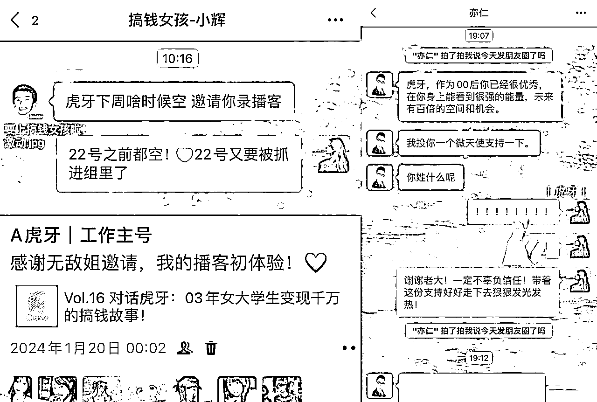

那么怎么样才能养成易遇贵人，易得贵人相助体质呢？虎牙分享给大家三个小tips：

### 1）你若盛开，蝴蝶自来

不知道大家有没有听说过，心理学上有一个跷跷板定律：人与人之间的关系，就像踩在跷跷板上的两方。如果要长久地维系这段关系，需要双方势均力敌，如果一方太强，另一方又太弱，这段关系就会失去平衡。

我想，稳固且有价值的社交关系，往往也是实力相当、互相尊重，势均力敌的双赢。

而吸贵人也是一样的道理，别总想着招贵人这事是“命里注定”或者“天赐的”，摆烂坐等，真命天子降临的那一天。

想要养成“易吸贵人”体质，最有效的“捷径”就是自己先成为“贵人”。不断的持续的提升自我价值，用自身的价值去做“等价交换”，去吸引相互靠近。

你有价值了，别人才会来靠近你，做个有价值的人，蝴蝶自来。

### 2）向上链接，优质社交圈

网上有一条成功法则是这么说的：你的收入，是10个身边常联系朋友的平均收入。这里的10个常联系的朋友，某种意义上，指的就是优质社交圈。

虎牙每年在向上链接，知识付费上花费的费用，都是5-6位数。因为我深知，让自己处于优质的圈子里，你的身边就都是好人。

越是优质的圈子，思想层面就越高，对我们人生的影响也是至关重要的，毫不夸张地说，有一个优质的圈子，你就相当于成功了一半。

当你迷茫的时候，如果你处于高能量的圈子中，你看到别人的优秀和高执行能力，这些就会潜移默化地感染你，无形中会给到你力量与信念。

你也会不甘于平庸，努力去寻找自我的方向。向上链接，还能得到圈子里强者的指点迷津，让你以惊人的速度摆脱困难。

换圈子真的不亚于换人生，一个优质的圈子它所拥有的资源，能量，人脉，思想都是“空前绝后”的，引导我们不断向上。

这里给大家分享我筛选优质社交圈的3个小原则：从价格筛选、从大IP筛选、从自身需求筛选。

从价格上筛选，很好理解，通常情况，市面上所有产品，价格与价值都是一一对应的，所以价格越高价值往往就越大，但具体还是需要大家集合实际情况考察。比如我加入的生财、玩赚等，都是市面上高客单价、排名非常靠前的、口碑较好的圈子，那么这个圈子的质量肯定不言而喻。

从大IP筛选，则是从你熟悉的、喜欢的、了解到的影响力较强的IP来选。

比如说我进入生财，就是通过我的合伙人柠柠推荐，进入玩赚，就是通过大师姐靠谱。都是我非常信任且喜欢的大IP，有了他们的推荐，才让我少走了不少弯路，弯道超车，才有了之后的不断持续破圈。

从自身需求筛选，则是看现阶段，自己需要哪方面的内容，就去哪种类型的圈子。比如我决定开始做知识付费后，就以知识付费为核心，筛选高质量圈子。

就比如我微商转知识付费那个关键契机，处于迷茫状态时，我就加入了生财有术，这个最大的互联网赚钱社群，想多看看机会，多了解了解，看看其他的创业者的前人经验。

再比如我初入知识付费的时候，在设计课程大纲、学员权益的时候，就选择付费向一位与我路径相似的知识付费导师前辈学习，花钱换经验，我觉得是件稳赚不赔的买卖。

再比如我把知识付费慢慢做大，从10向100扩大，准备创建自己的超级团队的时候，我就选择向一位先我踏入这个行业四年之久，在团队组建方面非常有经验的同行付费学习。

加入圈子不但能接触到优质社交圈，某种程度上，也是通过向大IP付费，向上链接。在我看来，最好的链接方式就是付费向大咖学习。不但能迅速拉近距离，还能学到高价值内容，简直一举多得。

### 3）懂得感恩，给正反馈

最后一点，也是最重要的一点，贵人提点一定要感谢，贵人说话要做，要给正反馈。

大佬们实际上都是不缺什么礼物东西的，

在我看来，表达感激的最佳方式，是超越贵人对你的所有期望，多去做、去拿结果，用成长给贵人正反馈。

尤其是取得进步的时候，要第一时间和他分享你成功的喜悦，让他知道你的每一份成就都有他的指点和功劳。

可以的话，定期汇报成长进度，尽可能多的给正反馈，就是一种最好的方法。

但这里需要注意的是，不要大事小事都麻烦贵人，关键的人要留在关键的时候用，把高人用在关键的大事上，也是对高人价值的尊重。精简内容，降低沟通成本，增加效率。

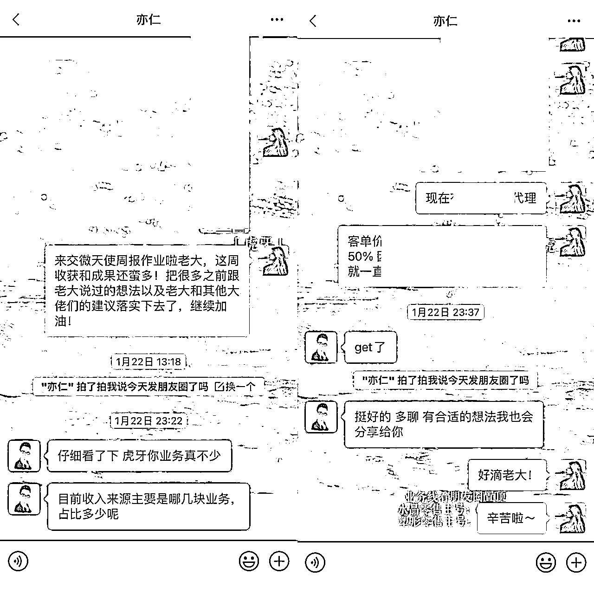

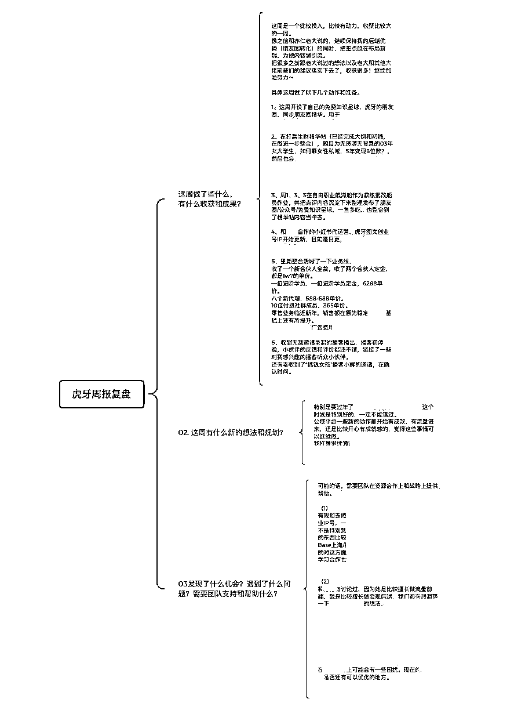

保持自我成长、向上链接、持续破圈，还能与用户一起共同成长，给学员、用户持续赋能，何乐而不为呢。

# 三、虎牙成事心法：奔赴热爱、极致利他、借力打力、强强联合。

最后，再来跟大家分享一下，我创业以来总结的3个成事心法锦囊。

一路走来，就是这3个心法，让我成功从0到1积累40w+私域流量，穿越时间周期，撬动杠杆收益，变现千万。

## 1、从0到1：奔赴热爱，真实做自己

在前面的成长经历中，我就有分享过，从0到1的起步，是源于我的追星经历。因为感兴趣和喜欢，开启了我的第一份水晶事业，结识且积累了我的第一批忠实用户，和不少同龄的用户小伙伴们成为了朋友。

在后来的成长历程中，从始至终，我做的只有一件事，那就是：以我的初心为圆心，热爱为半径，持续坚持做自己热爱的事情，真实呈现自己的成长历程，带领更多女孩走我来时的路，让她们也能像我一样，实现经济独立。

所以，如果要给从0到1一个明确的心法，那一定是奔赴热爱，做真实的自己。唯有真的热爱，才能帮我们抵挡漫长岁月，带我们走得更久更远。

在热爱中成长，在真实做自己的过程中，收获同频的朋友，一起成长，相互赋能，做高粘性的成长型IP。。

## 2、从1到10：择一米宽，掘万米深

在最近的一次受邀的博客访谈里，主持人问我，听过很多负债逆袭、背水一战的成功故事，我的一路顺风顺水在圈子里还显得挺特别的，是有什么秘诀吗。

我的答案是：择一米宽，掘万米深。就能让每一步路都算数，每一步路都走的扎实且有用。

我决定做水晶，从一个什么都不懂，只想赚个零花钱的十八线小代理，到拥有百人团队天天稳定五位数货款结算的一线销冠。

决定做知识付费，从决定单独成业务到现在一共不到两年，学员上千人，合伙人50+帮他们实现各自的从0到1/从1到10/从10-100，慢慢打出了自己的名号口碑，渐渐有了影响力。

我是靠实打实的好几年，全部自己上场，做引流，做成交，做交付自己跑通所有闭环之后，再从一个个活生生的代理/学员陪跑案例里吸取经验和教训，不断做完善补充，不断最更新迭代，总结做出自己的一套最完备最好用的代理/学员的培训/交付体系。

无论是哪种商业模式，都是确定基本领域，而后持续深耕，一步步搭建、完善，最终放大。专注一个领域后，尽管深耕，剩下的都交给时间与努力，做成有影响力的IP就是顺水推舟的事。

## 3、从10到100：借力打力，强强联合

到这一阶段，就要改变自己曾经的单打独斗的思维模式，换成合作共赢模式，也要懂得借力打力。

在创业初期，我倾向于去做一个无所不能的六边形战士，做一个超级个体，事必躬亲。后来才慢慢的发现，这样非常吃力，其实没有人是什么都擅长的。

1、比起什么都自己来，不如学会资源整合，和合适的小伙伴进行合作，各取所需，各补所长，更能组合迸发出更强大的火花，更高效。

我发现自己更擅长做转化，做后端的事儿。所以，就开始慢慢舍得把流量端教学放出去。

比如共创的引流训练营项目，就是和我的合伙人一起共创引流实战类陪跑训练营，各司其职，放出去后发现，不但省力轻松了，效果还出奇的好；

再比如有引流需求的学员，我会与学习过的专业老师合作，直接把学员推过去，学员学习的也开心了，我也不用强迫自己去面面俱到教相比后端转化来说没那么擅长的前端流量教学，还能拿到不菲的cps。

与靠谱的，专业的，信得过的，同频的人合作，一拍即合，

反而更能让每一个意向的需求，有最适合的归宿，最高效最完美的搭配，双方都开心。

2、比起做一个六边形战士，拥有一个各司其职、各自闪光的超级团队是更优解。

每个超级个体背后，一定是超级团队。没有十项全能的完人，但团队的力量可以让你实现面面俱到。

我的核心团队其实只有五个人，都是从我的合伙人当中筛选而成的。

有擅长整理、归纳、总结的，有擅长搞流量、战略思维强的，有擅长沟通、近距离成交的，还有擅长写作、写内容，逻辑缜密的；每次当有核心任务出现的时候，都能最快得到解决，所有人卯足一个核心目标各负责各所长，高效快捷的执行清楚。

就比如我在今年，和合伙人们一起共创了一个名叫Girls'Power女性创业者成长陪伴社群，和大家一起，打造一个女性力量成长社群，

从前期策划内测，定位设计，规则设定，大家群策群力，每个人都有擅长的部分，很快就把想法落地到位；

再到社群面世后作为社群内部的资料整理官，气氛官，内容官，等等···很快社群运营就步入了正轨，不断招收新人裂变。

正所谓“合作才能共赢，成就他人就是成就自己”。合作的形式有很多种，无论选择哪种，都是强强联合，相互赋能共赢的模式。

最后，如果你正处于：

不知道自己的优势到底是什么？不知道自己擅长什么？不清楚自己的个人定位？没有方向感不知道往哪使力？在行业里埋头苦干很久却没有大的成果和正反馈。

不知道怎么做起「强核心竞争力」的个人品牌，确立「能穿越时间周期」的商业定位，搭建起「高转化自动成交」的私域体系的。

欢迎来找虎牙，帮你梳理情况，挖掘优势，找准定位，帮你事半功倍。

祝我们都找到属于自己的热爱，砥砺前行！成为自己人生的大女主！