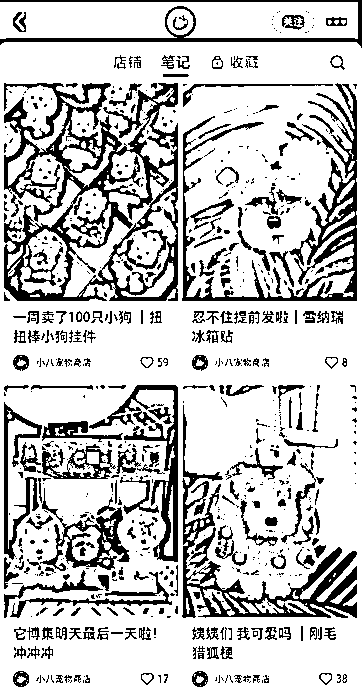
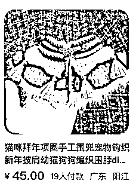
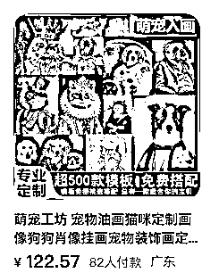

# 风向标拆解第 3 期--手艺人垂类知识付费是一个小而美的生意吗？--榴莲小象

> 来源：[https://cinp728gco.feishu.cn/docx/OlhRdU5TLoACc6xNACac9BqGnyh](https://cinp728gco.feishu.cn/docx/OlhRdU5TLoACc6xNACac9BqGnyh)

# 一、项目背景

## 项目背景

外国人很喜欢手工制品，而且卖的价格都很高。现在国内大家生活水平提高，也不再喜欢千篇一律的产品，追求个性化，所以无论是以后卖国内还是国外，手工制品都是很好的选择。

## 项目现况

采访了几个手作博主，都说现在越来越多看似手工制品，但是被工厂量产，除非是个性定制产品，比如：名字牌，画像。其余大多数产品，主要是第一个产品的设计创意，设计的好看，大家不介意是否独一无二的产品，就可以工厂批量生产，节省人力，交付时间也会更短。

这就意味着手艺人可以把自己的技能，知识付费的形式，交付给更多人，反正大家比拼的是创意，不会有冲突。

# 二、项目优点

### 1.独一无二

手艺人的产品，一般都是一件件自己定做的。不是工厂一个模板的产品，所以很受爱个性的人的喜欢。

### 2.个性定制

可以按客户需要，进行定制。颜色，材质，形状，字母等等。外面买不到，送礼也是最能表达心意。

### 3.只需你自己，不用很大的团队

如果你有个擅长的手艺，把它做垂直，然后把你会的打包成课程，教给不会的人。那么就是从卖产品到卖知识付费的转变。它不需要你有很大的团队，也没有什么产品制作，打包，交付的环节。完全可以靠你自己，就能做完所有环节。

### 4.无成本，利润大

知识付费没有成本，制作一套课程之后，就可以自己不断的宣传，然后复制售卖。利润很大。

# 三、项目缺点

1.手工制品，制作时间长，如果卖的量大，做起来会比较费时，比较累。

2.手工制品，难以复制，需要专业学习

3.比较小众，只针对特别爱好的人群

# 四、项目案例拆解

## 1\. 案例展示

### 案例1: 扭扭棒手工制品

使用扭扭棒可以做各种产品，宠物，鲜花，等等。这个账号做成宠物产品，148一个，一周卖了100只。

### 案例2: 宠物装饰品定制

### 案例3:宠物画像定制

## 2\. 流量怎么运营？

现在各大平台都排斥无货源产品，欢迎个性独特的手工制品。所以可以各大平台发布，尤其现在小红书，发布制作完的成品，吸引喜欢你设计风格的人，他们想要学习，就会咨询你有没有教程。

## 3\. 项目如何做 & 如何放大

1.招学员：想要学个手艺，自己设计制作产品的人

2.招代理：想要做这个赛道，但是没功夫学手艺的人，可以招收代理的形式，他负责接单，你这边制作。

3.国内外同步出售。手工制品在全球都很受欢迎，而且设计没有国界，只是每个国家喜欢的风格不一样，所以可以国内外同步出售。外语好的，也可以收国外学员。

# 五、结语

手工制品是个可以长期发展自己品牌的项目，独家创意设计，让市场找不到同款，所以价格也可以定得高一些。

市场大：国内国外都可以发展，甚至国外卖的更高，更受欢迎。

把自己会的手艺打包成课程，卖给想学习的人。知识付费的零成本特点，可以自己一个人完成录制课程，引流，出售，交付的所有环节。团队小，无成本，利润大。