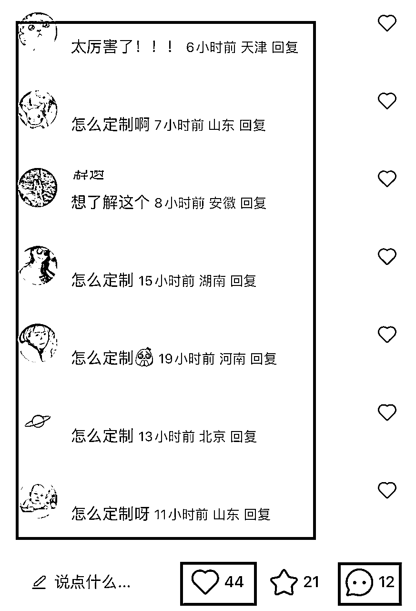

# 《完美还原！AI摄影教程，3个步骤让你实现写真自由！》

> 来源：[https://ry5hwpuf7b.feishu.cn/docx/Ox2ndRADWojFdxxwYQZcYKVbnVc](https://ry5hwpuf7b.feishu.cn/docx/Ox2ndRADWojFdxxwYQZcYKVbnVc)

《完美还原！AI摄影教程，3个步骤让你实现写真自由！》

各位好，我是吴东子

AI摄影，就是用AI生成写真照片

和传统摄影不同的是，传统的摄影需要先妆造、布景，然后再进行拍摄，前后需要耗费的时间精力非常多

而AI摄影只需要在电脑上上传十几张自己的日常照片，就能根据自己的喜好去生成各种梦幻、甚至是离谱的写真

如果你是个人使用，那就可以给自己、给宝宝、家人，还有朋友定制

如果你是工作使用，本身开了一家摄影写真馆，或者在摄影写真馆工作，那你就可以用AI给自己的工作赋能

另外，我们还能在网上接单，帮别人去制作AI写真，目前市面上的需求有很多，并且价格从50~999都有

那今天这篇文章会详细的介绍AI摄影的制作方法，你只需要跟着一步一步操作，就能做出来属于自己的AI写真

一、AI摄影能做什么

二、如何做AI摄影？

三、训练模型

四、出图方式

花了很多时间才整理出来，希望对你有所帮助

# 一、AI摄影能做什么

## 1.给宝宝定制

你可以给自己的宝宝定制奇幻写真，还原度可以达到90%以上

比如这是一个宝宝的原图

可以让宝宝和喜欢的动漫角色或者人物合影，比如和钢铁侠、马斯克等名人合影

可以去体验一些不可能的事情

满足孩子想要成为飞行员开飞机的愿望

成为宇航员在月球漫步

更好玩一些的是和恐龙、老虎亲密互动

以及最简单的就是做一些好看的写真照片

## 2.给自己定制

如果你本身比较喜欢拍照，那就可以给自己去定制各种风格的写真

这是我们团队的丹丹老师

你可以向她一样用AI给自己定制自己喜欢风格的写真

满足自己想要拍各种好看照片的小愿望

## 3.给别人定制

你可以在朋友生日的时候，根据她的喜好、愿望去给她定制一系列的AI写真照片，并且打印出来送给她

让她云旅游巴黎，拍一套新中式的写真等等

以下照片仅做演示

另外，你还可以去平台上帮别人定制接单赚钱

大家可以看一下这是别人账号的评论区

一个只有480赞的内容，却有157条评论，且更为重要的是，评论区都是需求，都有付费的意愿

这个博主内容爆了直接开小红书店铺卖，49.9的单价卖了500多单

接下来我们就来看看AI摄影的制作方法

# 二、AI摄影怎么做

在开始实操之前，我们先来先大概了解一下大概的流程，先建立一个基本的认识

第一步是根据人物的照片去炼一个人物的模型，这个模型就叫Lora

第二步就是找一张自己喜欢的照片，不管是在网上找，还是自己用AI出图都可以

第三步是用上刚刚的模型，把人脸换上去

出来的效果无论是光影还是融合度都是比较完美的

网上AI写真的做法有很多种，有些人会教你比如

换脸插件：roop、rope等插件换脸

抠图重绘：把人物抠图保留，用AI把其他背景部分重新生成

无论哪种效果目前来看都没那么好，前者换出来的脸不像，后者色调不协调，需要你有很强的ps调色能力

而通过炼人脸模型再去换脸，我们就能生成更多场景的照片，并且各个角度的照片都能比较好的适配

接下来我们就按制作AI写真图片的三个步骤顺序，讲解一下AI写真照片怎么做

1.  炼模型

1.  出图

1.  换脸

# 三、炼Lora模型

炼lora这里又可以分为三个步骤

分别是准备素材、打标签、训练模型

## 1.准备素材

我们需要准备20~30张照片

这些照片只需要上半身或者大头的特写就可以了，最重要的是五官一定要清晰

## 2.打标签

也就是用一些词去描述图片的内容

打标签用到的是秋叶的整合包

双击打开文件夹里的“A启动脚本”

然后用它里面的“标签器”去自动打标签

等它处理完了之后，就会在图片文件夹里面看到每张照片旁边都多了一个文本文件，里面就是图片的标签

处理完标签之后，我们就要开始训练模型了

## 3.炼模型

在文件夹里面找到“train”文件夹，然后在里面新建文件夹

把我们要训练的照片以及对应的标签全部复制到这个文件夹

接下来就可以打开训练界面

直接用“新手”模式就可以

除了图片里用红色框框出来的参数需要自己设置

其他参数就按默认设置

最后点击页面右下角的开始训练就可以了

我们可以直接看后台的黑色框框，大概等20分钟，看到“训练完成”模型就训练好了

在“output”文件夹里就能看到炼好的10个模型，我们要在这里面挑一个出来

可以直接用这个模型在SD里面出图，看看这十个模型哪一个的效果比较好，选一个就行

# 四、出图+换脸

炼好模型之后，我们就可以开始出图了

这个图的来源可以有三个途径

1.网上的图片

2.SD出图

3.MJ出图

每种途径的操作方法不一样，我们就一个个来看

## 1.网上图片+换脸

第一种是你在网上看到了有喜欢的写真照片，可以直接保存下来换上自己的脸

但是这种可能要注意一下版权的问题

具体的制作方法：

打开SD图生图里的局部重绘，把图片上传上去

再把人物脸的部分涂白

接着用一个叫adetailer的插件，在这里面加上我们炼的自己的人物lora

最后点击生成就可以了

如果说你经常去线下拍写真，那你就可以用这种方法，先找到自己喜欢的风格，然后把自己的脸换上去看合不合适

这是再去线下拍摄，这样就可以很大程度的减少踩雷的风险

## 2.SD文生图出图+换脸

如果说你不想跟网上的图片一模一样，但又想要这种风格，那就可以用接下来的方法

首先是关键词，直接把照片上传到“标签器”

大概检查一下反推出来的关键词，没有问题的话就可以直接复制到关键词的文本框

接着打开SD的“文生图”，把要参考的照片上传到controlnet，控制类型选择“reference”

再打开Adetailer，在关键词部分加上我们的人物lora

最后点击生成

这样一张用SD生成的AI写真就完成了

如果你还想做出来一些更加特别好玩的图片，那就可以加上风格lora

像和龙合影、一些比较特别的场景，都是用了其他风格Lora出来的图片

## 3.MJ出图+换脸

最后一种是用MJ出图，因为用MJ可以靠关键词去生成一些比较奇幻的图片，所以和名人合照、和动物合影这些照片就可以用MJ出图

然后用SD的局部重绘去换脸

MJ关键词：

Iron Man is holding a 2-year-old boy, black background, bright lighting, portrait photography, realistic photos, highest quality, masterpiece, ultra-high resolution --ar 4:3

钢铁侠抱着一个2岁的小男孩，黑色背景，明亮的灯光，人像摄影，真实照片，最高质量，杰作，超高分辨率

加粗字体可修改

出来一张喜欢的图片之后，就用SD的图生图换脸

接下来的操作方法就是和用网上图片换脸是一样的，这里就不再重复了

这样换出来的脸就是非常自然的，而且光线也是比较协调的

# 五、结尾

好了，以上就是我们这篇文章的全部内容，希望让你也能做出专属于自己的AI写真照片

我是吴东子，我们下篇文章再见！