# 风向标拆解第3期--靠Notion模板年收入100万美元，通过资料整理变现的路径如何--Y__Emerald

> 来源：[https://kibt1a72me.feishu.cn/docx/PiaFdtvhloCP3uxAA6IcxPqMneb](https://kibt1a72me.feishu.cn/docx/PiaFdtvhloCP3uxAA6IcxPqMneb)

# 1.前言

此次资料整理案例拆解对象，全球最赚钱的Notion博主—Thomas Frank，正是时下出海赚钱的一个极好学习案例。因为他极其擅长一鱼多吃！！其中不仅囊括了资料整理的多种变现方式，还涉及了海外工具站和SEO，如果需要深入了解学习，可以看生财对应的航海手册。

注：以下案例的拆解，大部分内容来自于创作者的创业自述文章。希望通过他自我详细的描述，能让我们更详细更好地了解这位全球最赚钱的Notion博主整个创业历程和多渠道变现方式！

# 2.案例及变现情况

全球最赚钱的Notion博主——Thomas Frank，2022年的营收构成情况如下：

团队整体收入：

• Notion模板：100万美元

• Youtube收入：15.3万美元

• Skillshare课程：10.2万美元

• Notion分销：8.8万美元

• 广告赞助：6.7万美元

• Notion Coach服务：4k美元

•电子书：2k美元

总营收：141.6万美元

团队支出：

• 员工：45.2万美元

• 交易费用：6.8万美元

• 办公室租金：4.8万美元

• SaaS费用：3.3万美元

• 团建：1.9 万美元

• 其他支出：18.1 万美元

总支出：80.1万美元

总利润：61.5万美元

（2022年一年，Thomas Frank作为Notion博主的个人所得）

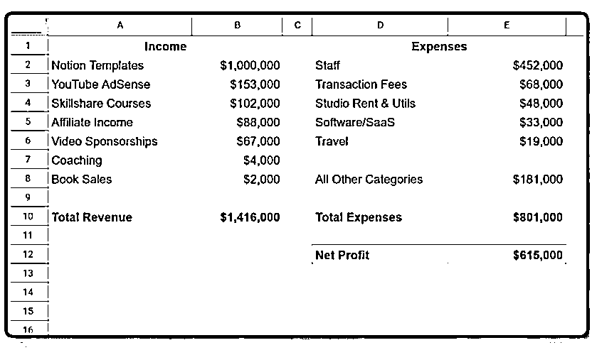

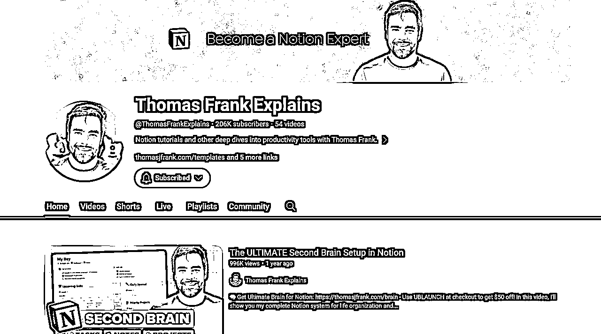

此外，在大约两年的时间里，Thomas单靠卖两个Notion模板创造了210万美元的销售额。目前，模板销售额平均每月约为12万美元，其他收入来源每月约1.5万美元(联盟营销和YouTube AdSense)。

# 3.具体产品及定位

*   定位：经营一家公司，教人们如何使用Notion，并销售Notion的模板。还在YouTube上开设了一个关注生产力的频道，拥有290万订阅者。

*   最畅销产品：旗舰模板被称为"Ultimate Brain"，它将Notion转变为一个完整的个人生产力系统，包括任务、笔记、项目和目标跟踪。

*   第一个产品：向内容创作者销售一个名为Creator’s Companion的模板，它可以帮助创作者直接在Notion中规划和制作所有社交媒体渠道的内容。

*   在开发的工具：现在正在开发工具来带动模板，Flylighter一个功能强大的web裁剪器，将帮助Notion用户立即捕获web剪辑，高亮，注释，语音笔记等。

# 4.Notion模板创作及变现历程

### 事件：

于在2021年底推出了第一个高级Notion模板，即“Creator’s Companion”，并在2022年推出了最畅销的模板"Ultimate Brain"。

### 起因：

迫于2008年金融危机余波的压力，Thomas（创作者）于2010年上大学时即开始创业，他在大一的时候就阅读了大量关于生产力的博客。由于曾经申请为博客HackCollege的团队写作被拒绝,所以他决定建立自己的博客:College Info Geek。

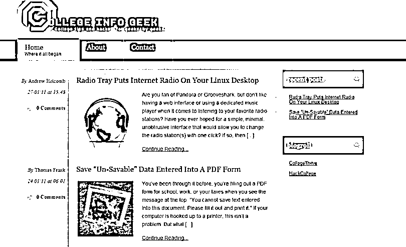

### 经过：

2012年博客收入可观，开始开播客all in创业。在2014年底开始制作YouTube视频。

2015年订阅人数达到了10万，2018年初订阅人数达到了100万。而他的Youtube频道建设策略是为学生制作高质量、有趣的学习和生产力视频。并且通过在reddit的一个小版块(r/getstudy)上发布视频摘要来获得最初吸引力，建立了影响力。

上述媒体渠道影响力的建立和扩大，同样为后续notion模板销售的引流做了铺垫。

从2017年到2022年，他定期在这个YouTube频道上发布视频，几乎每一个视频都得到了赞助。最终获得了每月5万美元的收益，主要来自于品牌视频交易。

### 承上启下：

由于团队发展需要更强大的组织系统，创作者想到了notion。一开始当wiki使用，后来发现管理视频制作也很好。还为团队建立了一个强大的内容规划系统，可以提供一个地方来捕捉想法，编写脚本，组织拍摄列表和管理编辑日历。

为了寻找多样化收入，创作者最初想为那些想要使用Notion的创作者制作一门课程。当在计划这个课程时，他慢慢地开始意识到他更愿意做一个产品，而且已经完成了!

### 结果：

因此，创作者将为团队创建的内容规划系统进行了优化，并将其作为名为Creator’s Companion的付费模板并于2021年发布。

当时创作者对这个想法的唯一验证是，为他的团队构建了这个系统，发现它非常有用。值得一提的是，创作者并没有费心去做任何市场调查，只是做了工作，并发布了模板。

具体操作过程：只是在所有免费模板的顶部放了一个链接到登录页面。除此之外，没有做任何市场营销。

在第一个月，创作者从112次销售中赚取了12,858美元。到2021年底，卖出了367份，赚了49,019美元。

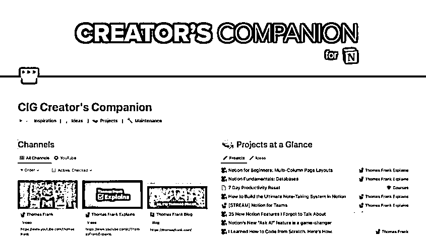

### 发展及扩大：

至于最畅销的个人生产力Notion模板Ultimate Brain，是将笔记、任务、项目、目标跟踪等整合到一个模板中，允许人们完全在Notion中计划和组织他们的生活。

创作者把它想象成一款面向更广泛受众的产品，而不是直接针对严肃内容创作者的 Creator’s Companion。

最开始，2020年，创作者发布了一个名为Ultimate Tasks的免费任务管理模板，并为构建过程制作了一个非常受欢迎的教程。它目前有76.9万的浏览量，到2022年初，这个免费的模板本身将电子邮件列表的订阅者增加到大约3.5万人。

基于该模板的表现以及 Creator’s Companion 的强劲销量，创作者决定从内容创作中抽出一个月的时间去创造Ultimate Brain。许多创作者使用Gumroad进行传播，并在X/Twitter和LinkedIn上建立受众。

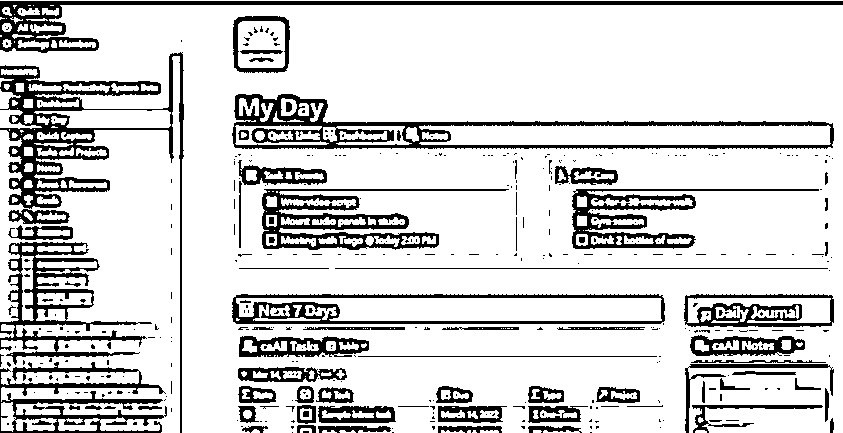

# 5.海外工具站：进行引流销售扩大

### 5.1 Creator’s Companion的发行过程

在2021年8月发行 Creator’s Companion 之前，创造者花了太多时间纠结于网站平台、支付处理器、营销软件和其他细节。

最终决定“去他的”，并决定使用他所能找到的最简单的支付平台Gumroad。为了分发模板，他设置了一个工具系统:

*   Notion模板本身只是一个公共的页面，可以被其他人复制。

*   通过Circle将模板链接分发给客户，还使用Circle发布教程并提供积极的支持。

*   还将买家添加到ConvertKit中，这样就可以自动通过电子邮件发送他们的模板链接。

*   一旦创作者有了他的结账和分发系统，就在他的网站上创建了一个销售页面。

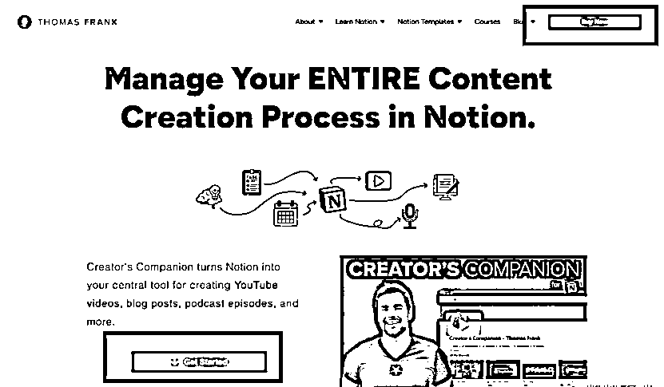

创作者的网站是建立在WordPress上的，他用Elementor，一个用于WordPress的拖放页面构建器来构建销售页面。价目表上的“购买”按钮只是将客户带到Gumroad的结帐页面。

由于创作者害怕一下子获得太多的客户，当时他在YouTube上有超过200万的订阅者，担心产品可能有漏洞，就不想一下子暴露给太多的买家。

所以他悄悄地通过免费模板中的推广链接建立了一个等待名单，然后向434人发布（如下图），这款产品在第一个月便创造了12,858美元的销售额。

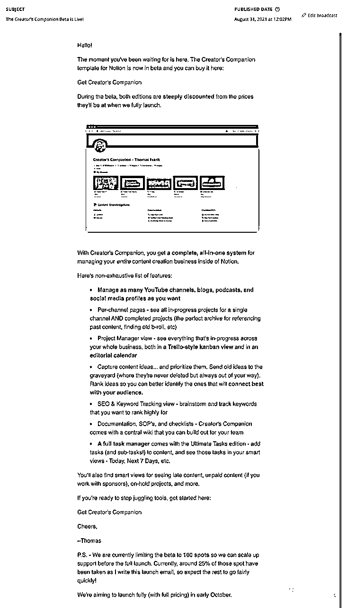

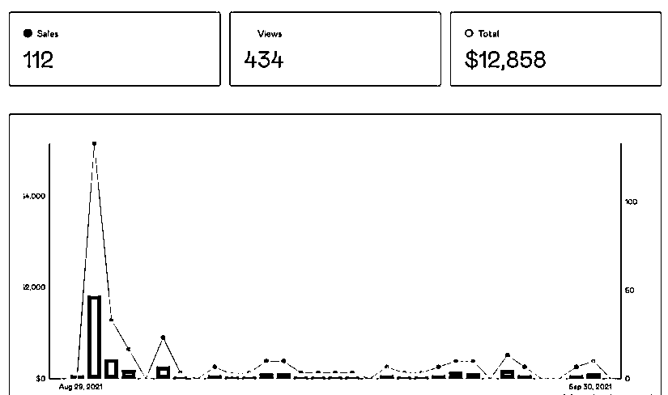

### 5.2 Ultimate Brain的发行过程

经过上个模板的发行，创作者对于 Ultimate Brain的发行过程更加明确，也有信心更快地向更多的人发布产品。

2022年4月5日，创作者向3,201人推出了“Ultimate Brain”。这封邮件的打开率为81%，点击率为60%。

最终，第一个月便创造了88,241美元的销售额。一个月后，创作者发布了完整的Notion Tips邮件列表(35,000人)。这款产品又创造了66,830美元的销售额。

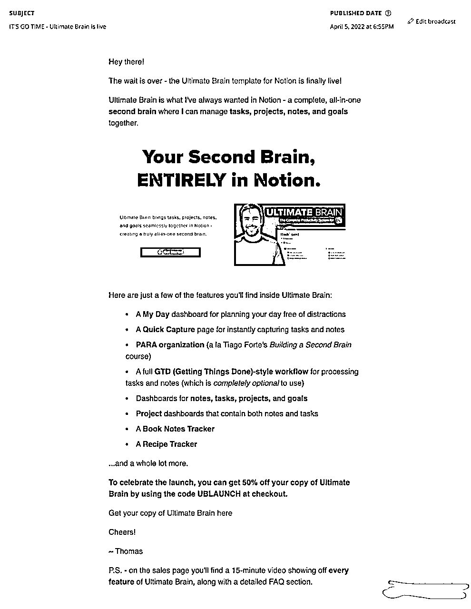

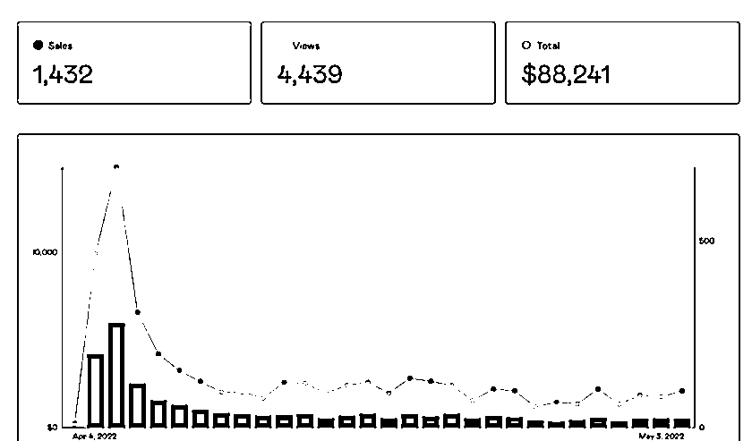

# 6.是什么吸引并留住了客户?

自最初推出以来，创作者主要增长战略一直是YouTube。他的第二个频道“Thomas Frank Explains”完全致力于教人们如何使用Notion。

“Thomas Frank Explains”的目标是成为学习Notion的首选资源，他努力涵盖任何一个人想要学习的东西，从绝对基础的页面到最先进的功能，如API(有一个2小时长的API课程视频，完全免费)。

这种专注于完全细分市场的报道和高质量的视频内容，帮助该频道实现了自然增长。创作者在主要的Thomas Frank频道上做了很少的推广，绝大多数的增长都是通过YouTube算法进行的自然推广。

这对他来说是一个惊喜，因为他期望“Thomas Frank Explains”是一个完全搜索驱动的频道。

在他最初推出“Ultimate Brain”两个月后，他制作了一个45分钟的视频，介绍了这个模板的每个功能。

在观看了来自More Plates More Dates的Derek发布的一个80分钟的视频后，他受到了启发。这个视频是一个80分钟的产品广告，但它也很有教育意义，他最后看了整个视频。

所以他决定做同样的事情: 制作一个很长的视频，涵盖产品的每个部分，展示一切，然后在视频结束时给人们购买的机会。

令他惊讶的是，这段视频反响非常好。它成为该频道上观看次数最多的视频。到目前为止，它已经有近100万的浏览量，并带来了1.2万名直接订阅者。它还获得了6.6万美元的AdSense收益。

这段视频的主要结果是每日收入的巨大而持续的增长。上线后，销售额从 2,500美元/天上升到5,000美元/天，并一直保持这一水平。

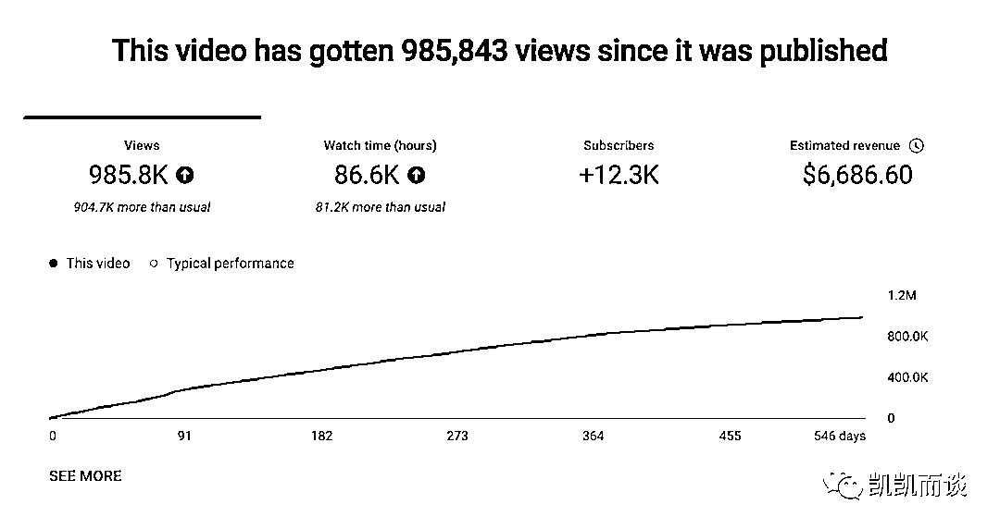

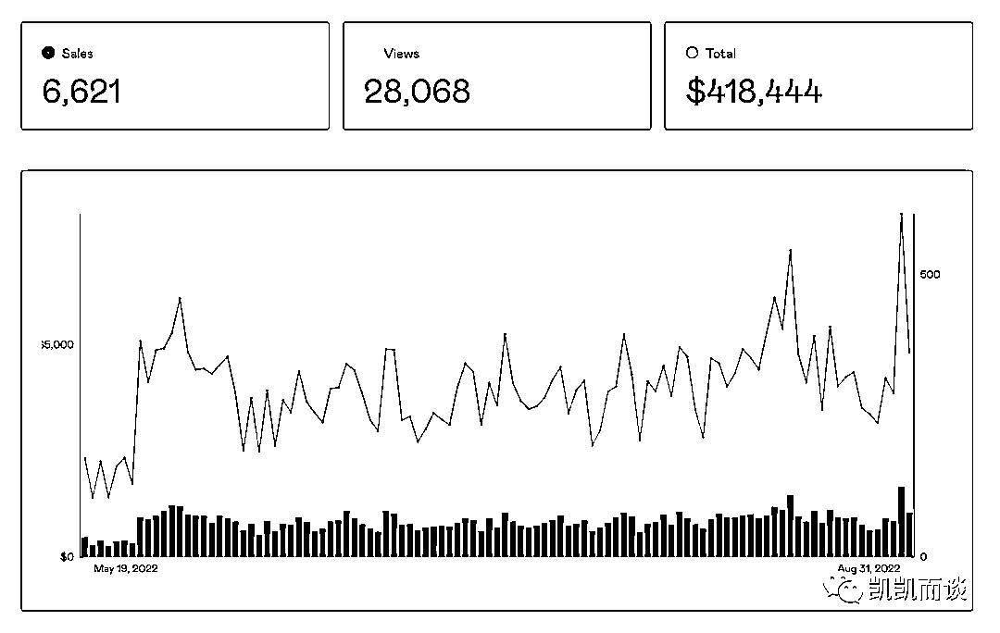

除了直接推销模板的视频外，该渠道总体上是一个非常有效的推广渠道。他们团队鼓励观众通过以下两种途径注册他的“Notion技巧”时事通讯:

1)Notion基础课程:一个免费的系列视频和文章，教授Notion的基础知识。当人们注册时事通讯时，也会得到一堆小抄和其他参考材料。

2)免费Notion模板:每当创建一个构建指南视频时，也会发布一个免费的模板。鼓励人们在获得模板后注册他们的通讯，然后在用户订阅后的第二天推销他们的付费模板。

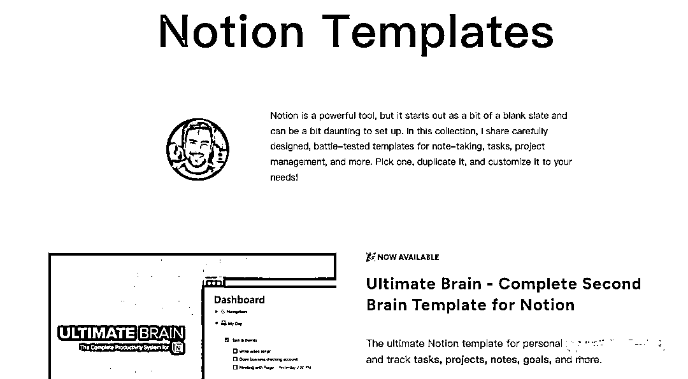

在YouTube频道上，创作者在策划视频时考虑了几个内容:

*   构建指南:长篇教程，教用户如何从头开始构建某些东西(例如任务管理器或笔记系统)。从长远来看，这些往往表现最好。

*   Notion新闻: Notion新功能的报道。

*   概念基础: 以初学者为中心的视频教学Notion的来龙去脉。

*   列表式视频: 有趣的主题，如“你在Notion中犯的10个错误”

*   偶尔也会创建一些无代码教程，使用其他应用程序为Notion添加额外的功能。

他们团队还要做书面内容，考虑SEO。创作者更关注YouTube，但他仍然尝试为最重要的主题创建书面文字指南。例如，去年为Notion的公式特性写了完整的技术文档(45,000多字)。

# 7.项目结论

由上述案例可发现，海外资料整理的变现方式很丰富，包括：卖模板、视频收入、卖课程、分销产品、广告收入和海外工具站等，而且收益也很丰厚。所以如果你有某项知识技能，一定要尝试知识付费，尤其是海外的，因为外国人付费意愿更强烈。当然，国内也可参考相关变现方式。