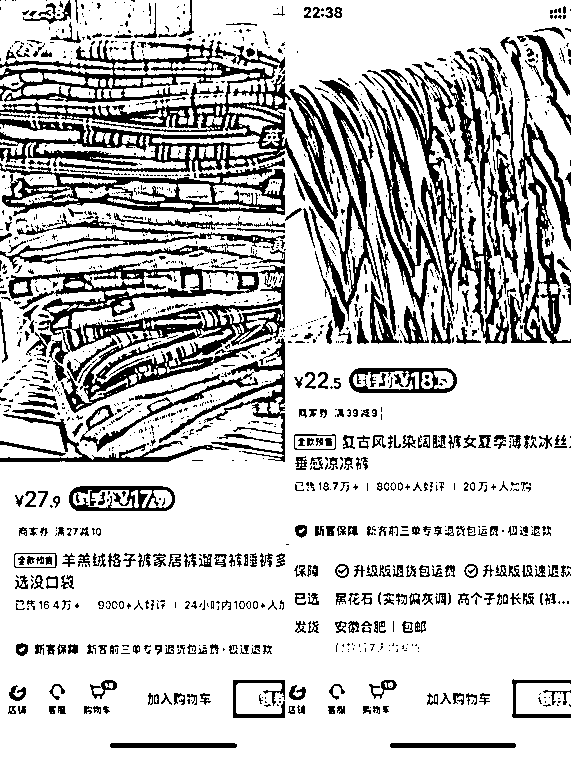
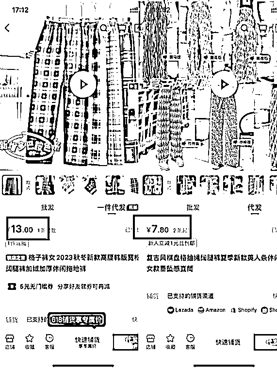

# 风向标拆解第 3 期--小红书爆款，售卖件数50W+的店铺到底是怎么赚钱的--走れ！小鱼ちゃん

> 来源：[https://txkxgfz9sxw.feishu.cn/docx/DQ1GdSOqdoskd9xyRMRcQuZvnIc](https://txkxgfz9sxw.feishu.cn/docx/DQ1GdSOqdoskd9xyRMRcQuZvnIc)

# 前言

大家好，我是小鱼ちゃん，于今年1 月份加入生财。非常开心能参加此次的风向标拆解活动。

我这次拆解的题目是“小红书爆款，售卖件数50W+的店铺到底是怎么赚钱的”，根据题目我摘出三个关键词：「小红书」、「50W+」、「怎么赚钱」 。我根据这三个关键词来寻找拆解对象。

因为我个人对小红书的印象是女性用户群体占比很大，美妆服饰类的内容相对多，就对美妆服饰类商品进行筛选，选出了以下案例进行拆解。新手小白第一次拆解，分析不到位之处还请各位大佬多多交流指正。

## 案例分享

平台：小红书

店铺名称：一树的店

粉丝数：7.7w

赞藏数：180.34w

总笔记数：6956

店铺销量：84.8W

### 一、产品是什么

店内一共 50+款在售商品，其中 40+是家居裤，可以看出此店铺产品很垂直。

下图是店内在售商品简单截图：

### 二、流量从哪里来

根据数据工具「新红」统计，一树的店创建于 2022 -12-04，截止到 2024-02-03，一共发布6956篇笔记，日均 20+篇，其中以视频笔记为主，约占 85%。

图片是 2023 年一年内发布的笔记数据，其中爆文有 229 条，大约每 1.6 天就有一篇爆文产生。

在小红书搜索「睡裤」+ 任意推荐的关键词，基本在前 20 都可以看到一树的笔记。由此可推断，在大量笔记内容下，关键词覆盖率比较高，有较好的 SEO 效果。

### 三、利润分析

以店内两条爆款裤子为例，进行简单的利润分析。

如图，羊羔绒格子裤到手价为 17.9 元，扎染阔腿裤到手价为 18.5 元。

在 1688 和拼多多上搜索对比，由于 1688 价格更有优势，此处以 1688 价格作为利润分析参照。

以无货源模式进行分析，如下表，毛利润均值 7.8 元计算，那么总利润在 660万 左右。考虑到退货的情况，以退货率 30% 计算，利润也有 462 万左右。

| 产品/价格 | 进价 | 售价 | 利润 |
| 羊羔绒格子裤 | 13 | 17.9 | 4.9 |
| 扎染阔腿裤 | 7.8 | 18.5 | 10.7 |
|  |  | 平均利润 | 7.8 |
|  |  | 总销量 | 84.8W |
|  |  | 预估总利润 | 660W |

### 四、项目如何做&如何放大

#### 如何做

1.  根据以上分析，可以看出「一树的店」产品较少，视频笔记脚本简单，可复制性非常强；

1.  起号初期，主要的工作量都集中于视频制作，熟练工的情况下，一个人也应该可以完成；

1.  爆单后，售前和售后的工作会明显增多，需要配置相应人员，分工合作；

1.  前期以无货源模式运营，单量起来后可以和厂家谈合作，走系统对接。

#### 如何放大

1.  多平台：「一树的店」笔记主要以视频为主，可以平移到抖音、快手和视频号等视频平台；

1.  产品矩阵：多产品、同模式，矩阵化运营；

1.  RPA自动化：利用 RPA 技术将部分流程自动化，节省时间成本，可以同时做更多的账号；

1.  团队化：运营模式SOP化后，就可以扩展团队，小步快跑，人多力量大，创造更多可能。