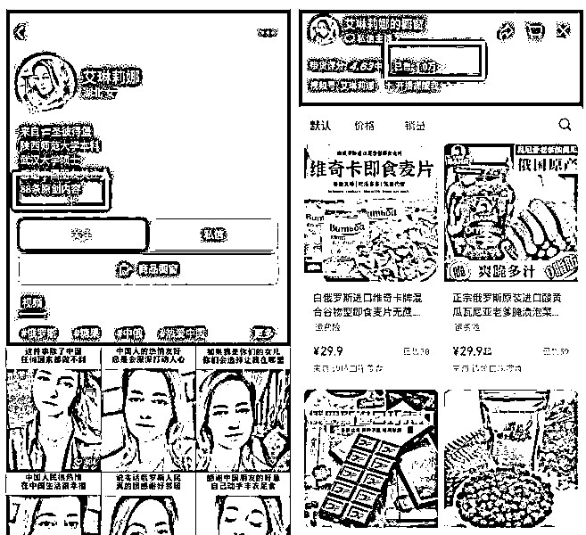
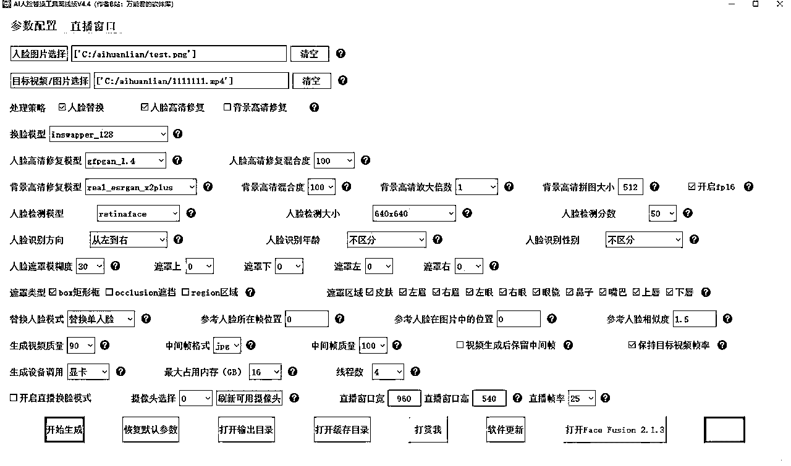
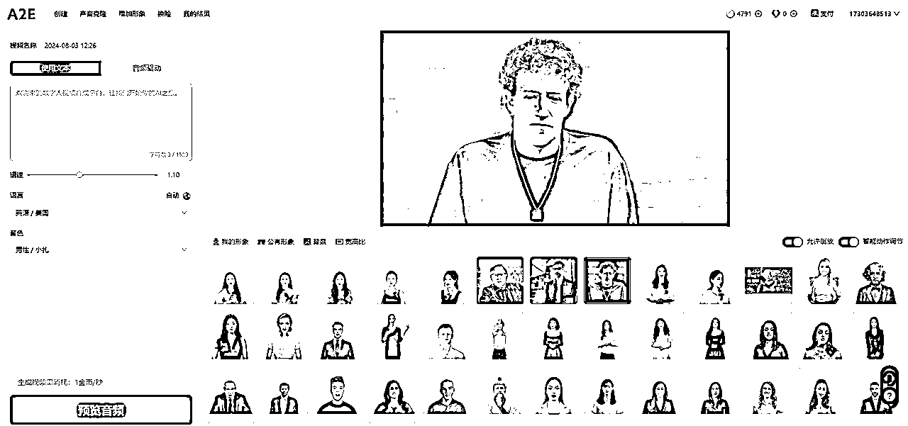
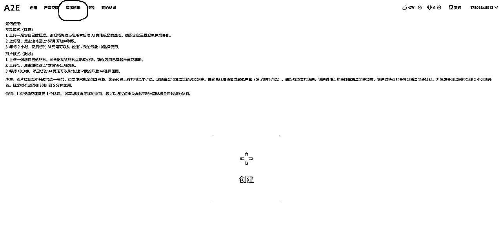
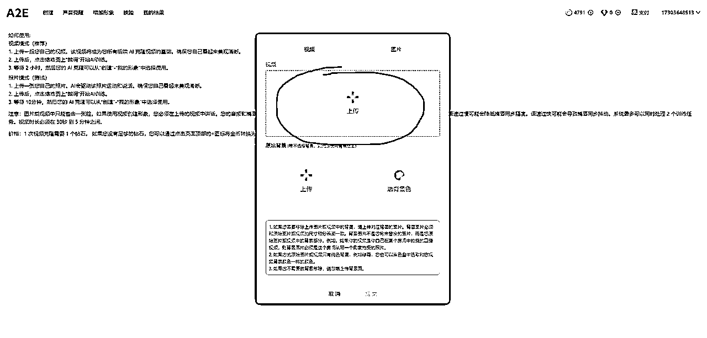
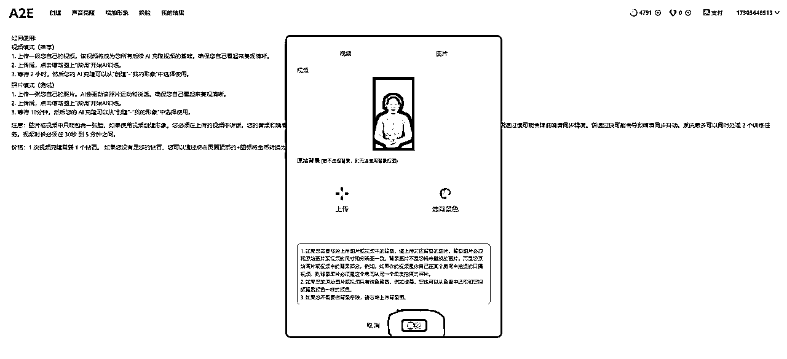
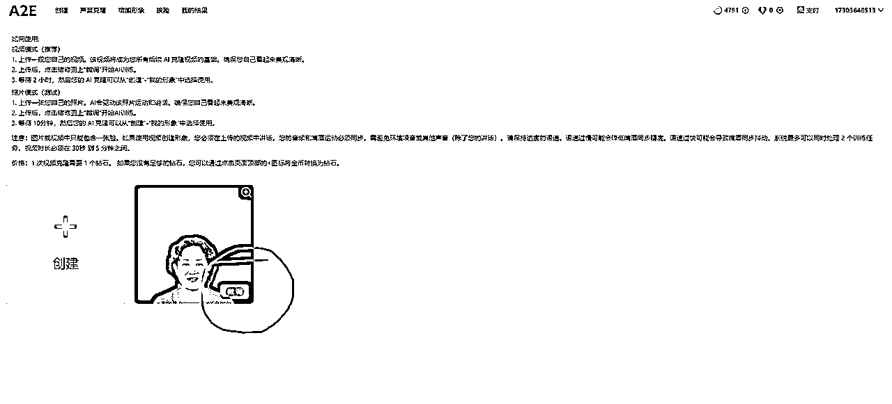
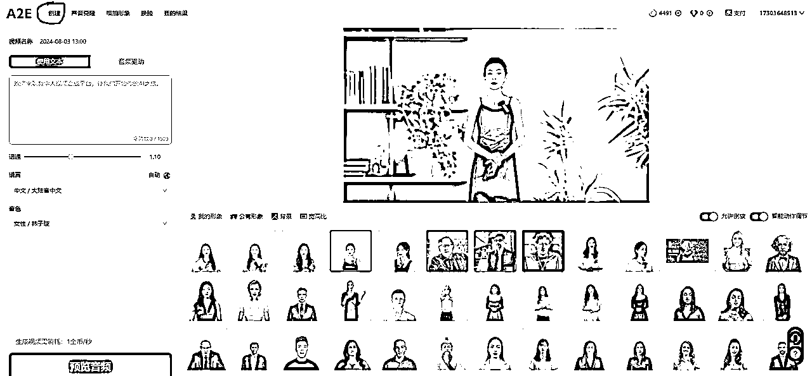
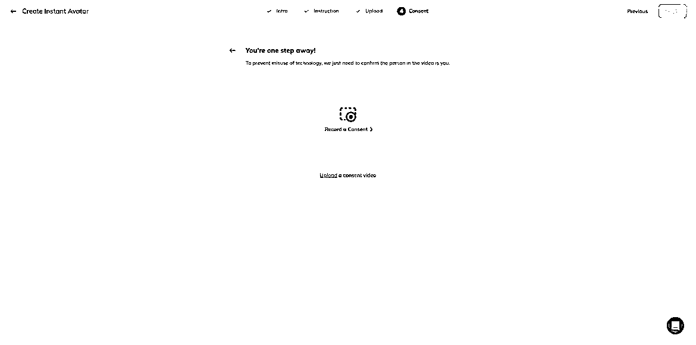
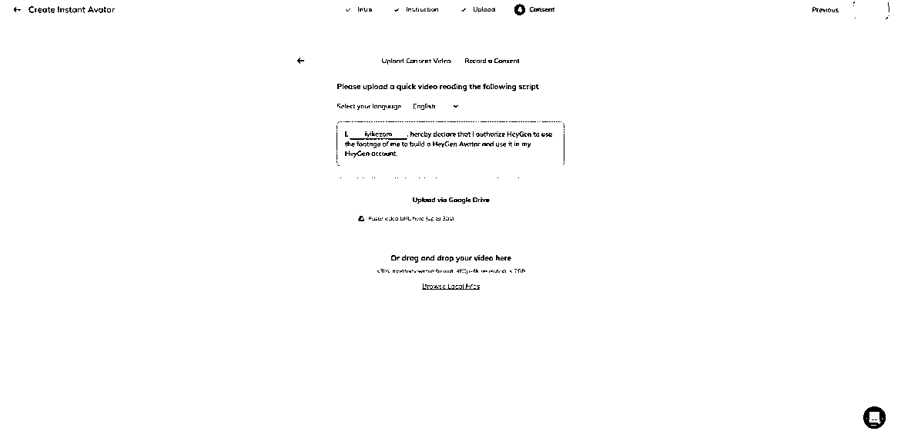

# 视频号口播带货严打，深度思考后的出路分析

> 来源：[https://tokzg1oqtr.feishu.cn/docx/QN3Jd5BGpoE9WMxAH8pcVlOun0f](https://tokzg1oqtr.feishu.cn/docx/QN3Jd5BGpoE9WMxAH8pcVlOun0f)

最近全网火了一批俄罗斯美女带货账号，乍一看还真看不出来是ai数字人，非常逼真！其中以抖音、快手、视频号为主战场，很多账号近期20天内起号都获得了大流量，涨粉很惊艳！

加上年底年货节的热度， 平台节日流量加持，像这个视频号上AI俄罗斯克隆人带货账号，起号才16天，只发了58条视频，橱窗带货随随便便卖出了1万+件，半个月佣金就能赚10W+。

经过我深入研究， 发现这类账号制作成本非常低，基本选定好3-4个AI克隆人模型后，就可以批量生成视频()，2-5分钟内就可以生成出一条原创的AI俄罗斯美女带货，全平台分发，矩阵化操作，增加起号概率，只要其中一条视频爆了，基本这个账号带货数据也能起来。

当然，这些账号文案和选品也非常有技巧。

文案:主要以俄罗斯人的身份， 打造一个非常热爱中国的人设，引发中老年人士的爱国情怀，产生情绪价值，进而产生消费意愿。

选品: 主打就是俄罗斯进口食品，例如糖果，巧克力，饼干，蜂蜜，奶粉、火腿，因为临近年底，很多人都会囤年货，本身视频策划的内容就具备人设感，取得信任后带货也是一条龙的事情。

除了视频挂小黄车外，最大的转化流量就是集中在直播间，如何解决直播信任度的问题，这里我也大概总结了两点，一种是可以利用AI直播换脸工具处理，（一般不推荐），销量数据虽然比较可观，但是换脸比较法律风险性高，尺度不好把控，另外一种是真人手播，不露脸，只讲产品，纯纯卖货也是可以的。

接下来我就把详细的制作流程SOP免费分享出来，希望可以帮助到大家

# 标准化全流程SOP

## 1.找原始素材

## 2.换脸

## 3.做口播视频

## 4.上传模型，自定义内容制作

## 5.生成定制模型，自定义作品内容制作

## 6.多平台矩阵发布

PS: 第二步换脸对显卡有要求，最低N卡1660 4g 起步(已经很勉强了),但为了提高过审率，如果没有高配电脑可以租云机来解决。

## 一、找原始素材

油管(Youtube)，VK，TK上面都可以

### 1.方法

先把外语教学或者个人访谈对话翻译成英语，然后再用翻译后的英语去相应平台上搜索。当然你也可以自己开动脑筋，用别的方式搜索素材。

### 2 .基础要求

要求画面干净，没有字幕，3到5分钟的时长。 镜头不要拉升变化， 一镜到底的最好。

不要一会是近景， 一会是远景，镜头频繁变化的影响后面认证。

更高要求就是，结合你自己后面拟打算再视频 平台运营的定位，找符合定位的角色形象。

例如俄罗斯美女带货，你最好挑吸引人的形

象。目前火的，爆的要么是丰满型、要么是可 爱型。

按需来。

### 3 . 下载

IDM 软件下载，墙裂推荐的一款下载软件，几乎所有网页版都可以下载，我这里有免费版，有需要的找我拿

总之，你用你喜欢和方便的方式，把你找到符合要求的原始素材下载下来即可。

### 4 .剪辑原始素材

导入原始素材至剪映，剪干净符合要求的画面，剪成2分钟时长，导出保存下来。

特别警示：

直接搬运去换脸，甚至直接搬运别人的素材去heygen过认证，我测试过，有几率通过，但是被heygen官方封号，封定制数字人模型的概率极高。建议想好好做的，认真按流程来，自己好好找素材。

## 二 、换脸

## 1\. 工 具

# 下载

win10、win11 V4.5

夸克网盘链接：https://pan.quark.cn/s/7b435a53126d 提取码：2Hs9

mac苹果电脑版V4.2

夸克网盘：https://pan.quark.cn/s/dfb054f98a13 提取码：yEfK

软件有点大，对显卡要求有点高。

### 2.实操方法

先去谷歌搜索一张和原始视频素材里人物长相差不多的高清图片，大致相似保存即可。

然后，打开软件

参考上图填。其中，人脸图片上传你谷歌搜来的图片。当然，你也可以用Al 重绘，没有问

题。这涉及另一个教程，有需要再给大家讲。 目标视频就上传你剪好的2分钟素材。

点击开始生成，等运行完，获得换脸后的视频。

## 三、做口播视频

### 1.登录a2e创建定制模型

打开a2e官网，地址：https://video.ai-anchor.com?coupon=kEtn登录后进入home 页面。

然后选择增加形象，新注册账号会赠送200金币和1个钻石，增加一个形象是消耗一个钻石

然后点击创建，上传处理好的模型

上传完成后点提交。

点击“微调”按钮，确定，模型就开始训练了，等待大约20分钟

点击左上角的创建

我的形象

然后需要读同意书，做口播认证。

六、多平台矩阵发布

目前这类视频数据比较好的平台主要集中在抖音，快手，视频号。大家可以多注册几个号，一鱼多吃，同时也增加视频号的爆率

结尾：2024年龙年马上就要到了，也将正式步入三元九运离火大运，离中虚，其中数字人AI,这种虚幻的科技，是及其符合离卦的象意的，再结合AI进化的速度，2024年必将是AI数字人的爆发元年，到那时真就是真真假假分不清楚了，同学们一起抓住机会，做第一波吃螃蟹的人，欢迎大家一起交流学习，将AI在带货领域应用起来。最后祝愿大家都可以爆单，龙年吉祥，财源滚滚。