# 风向标拆解第三期-小红书爆款，售卖件数59w+的店铺到底是怎么赚钱的-真z

> 来源：[https://ja9jl3gxxun.feishu.cn/docx/ETG5dCNVholy2rxUmzgcELBGnah](https://ja9jl3gxxun.feishu.cn/docx/ETG5dCNVholy2rxUmzgcELBGnah)

# 规模概述

研究对象为销量超过50w➕的店铺：一般小红书店铺经营规模在1w➕——20w；销量50w➕在小红书平台上属于是断崖级别的遥遥领先。像常见的首饰、鞋、包包、美甲、家居、零食等常见小而美的项目很少有店铺销量超过30w➕

## 售卖50w➕的产品店铺举例

| 编号 | 店铺名称 | 产品分类 | 粉丝数 | 销量 | 粉丝转化率（粉丝/销量） | 笔记数量 | 笔记转化率（笔记数/销量） | 带货形式 | 店铺形式 |
| 1 | 云南格棠鲜切花的店 | 鲜花 | 28.4w | 51.6w | 55% | 17392 | 3.37% | 直播带货+笔记带货 | 个人店 |
| 2 | ehd 旗舰店 | 身体护理 | 22.9w | 182.1w | 12.5% | 3346 | 0.18% | 笔记带货 | 品牌旗舰店 |
| 3 | 福东海旗舰店 | 养生食品 | 13w | 69.5w | 18.7% | 443 | 0.63% | 笔记带货 | 品牌旗舰店 |
| 4 | XIAO詹原创工作室的店 | 原创休闲服饰 | 32.1w | 71w | 45.2% | 856 | 0.12% | 笔记带货 | 个人店 |
| 5 | 钱与书光腿神器的店 | 光腿神器 | 13w | 78.9w | 16.4% | 284 | 0.035% | 笔记带货 | 个人店 |
| 6 | 一周无休的店 | 裤子 | 17.9w | 94.1w | 19% | 4481 | 0.47% | 笔记带货 | 个人店 |
| 7 | MOLYVIVI | 运动服饰品牌 | 11.8w | 64.5w | 18.2% | 1128 | 0.17% | 直播带货+笔记带货 | 品牌旗舰店 |

通过店铺的笔记数量和销量之间的转化来看，这里转化效果最好的是钱与书光腿神器的店；通过粉丝数量和销量之间的转化来看，这里转化效果最好的是ehd旗舰店，其次是"钱与书光腿神器的店"；通过数据反映"钱与书光腿神器的店"是这里面单品爆款成功出圈最好的产品，粉丝少但销量多；笔记少但销量更多，具有拆解分析的必要性；因此接下来以''钱与书光腿神器的店"进行案列拆解。

### 案例拆解

小红书——钱与书光腿神器的店

账号基本情况

产品类目：光腿神器

起号时间：2023年10月21日

带货形式：视频起号，图文/视频笔记一日更3篇，日常更新，商品链接挂左下角

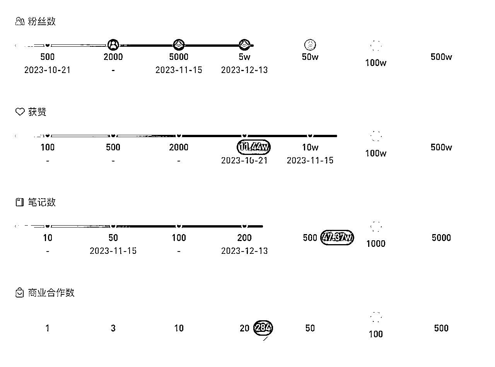

选择该账号拆解的原因：

*   专卖光腿神器的店铺——品类单一，且垂类店铺

*   靠视频带货——起号简单，无需直播

*   光腿神器单品销量75w➕

###### 流量从哪里来

该账号免费流量来自视频带货，''30r ➕到手，太绝了光腿神器'' 标题附带无褶皱产品实拍视频封面，吸引人关注。单个视频1500➕赞，750➕收藏，300➕评论；爆款带货视频下接连更新不同模特穿着的实物视频，承接流量，迅速起号。

###### IP定位

厂家直销，批发价，送运费险

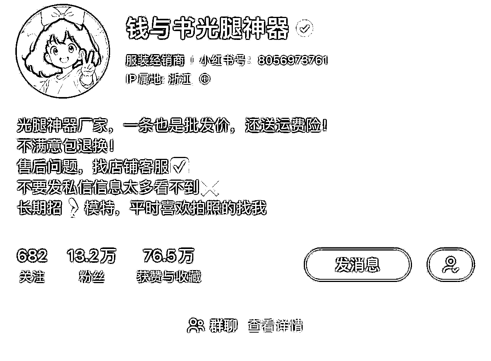

##### 对比同品类店铺

小红书搜索关键词"光腿神器" ，点击商品，按销量排在前面的店铺有

1.钱与书光腿神器：粉丝13.2w，销量79.8w，发布笔记56篇，获得点赞收藏数：76.5w；起号时间 2023年 10月 21日 ；无绒 140g 39.9元/ 薄绒 180g 49.9元 / 中厚绒 230g 59.9元 / 超厚绒 320g 69.9元

2.怀山叙集光腿神器的店：粉丝6.3w，销量35.3w，发布笔记62篇，获得点赞收藏数：72.2w，起号时间：2023年11月2日；无绒120g 39.9元/薄绒160g 49.9元/厚绒220g 59.9元

3.黄小姐旗舰店：粉丝7.8w，销量30.7w，发布笔记1568篇，获得点赞收藏数：40.8w；起号时间：2019年10月8日，无绒 69元 /薄绒 160g 69元 /210g 厚绒 89元 /超厚绒 280g 99元

4.小晴学姐穿搭的店：粉丝7084，销量16.9w，发布笔记677篇，获得点赞收藏数19.7w，起号时间：2023年4月22日，光腿神器品牌：尤然，无绒 130g 41.65元 /薄绒 160g 50\. 15元/厚绒 230g 58.65元 /加厚绒 300g 67.15元

综合上综合上述卖光腿神器的同类产品店铺，钱与书光腿神器店铺笔记数量最少，点赞收藏数量最多，说明该店铺笔记质量更优质，转化率更高。''钱与书光腿神器'' 起号一个月后反响较好，紧接着"怀山叙集光腿神器店"借鉴模仿"钱与书光腿神器店"，也有了较好的反响。黄小姐旗舰店是旗舰店，客单价较高且以图文输出爆款笔记较少；小晴学姐的店起号时间早，但是拍摄视频笔记前期并未大火，笔记内容后期通过模仿成熟光腿神器视频逐渐有了起色。

##### 怎么做爆款视频笔记

封面：腿模，产品薄厚绒的上身实物比较，并配文字"痛点描述"；真实买家收到实物后测评的风格，测出爆款笔记后，反复用爆款标题+更新的不同场景的拍摄实物图；日更三篇，承接流量。

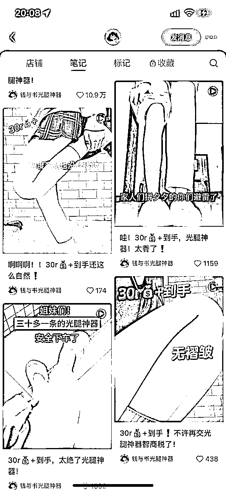

标题'文案

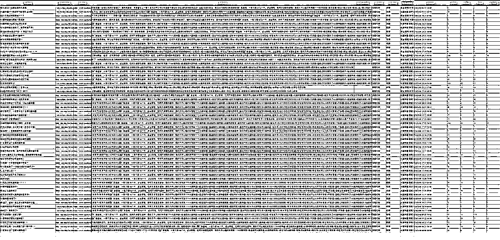

高频词如下：

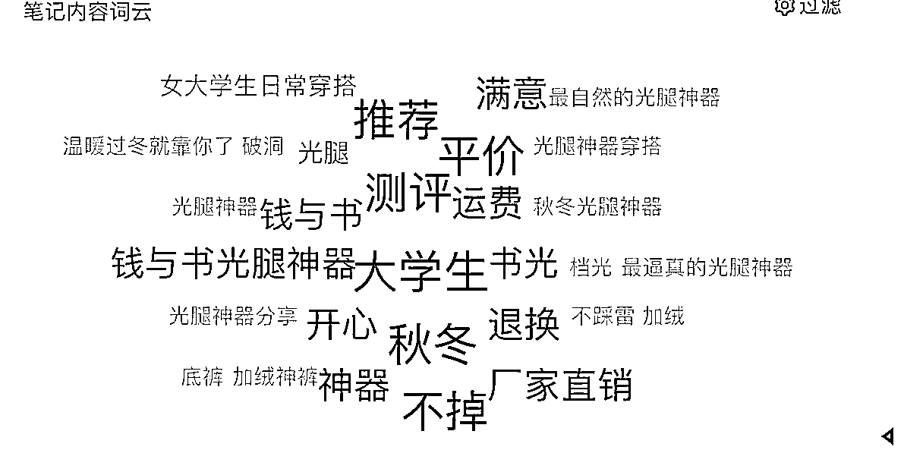

通用吸引人购买欲望的词有：价格、无褶皱、自然、一杯奶茶钱、贴肤、送运费险、可退换、弹力足、扯皮感、真腿感、不卡裆、无螺旋纹、不易勾丝

通用吸引人的文案：带有无褶皱/30r➕到手/巨自然/pxx避雷/中肤色vs 深肤色/揭秘无褶皱的真相/不同厚度对比··· 可以增加点击率，在制作文案的时候可以提高转化率。

视频时长：30秒以内

视频剧本：3个以上场景，不同环境下的上身实物效果展示，近景特写展示，多个角度（站着/蹲着/转圈/行走/弯曲膝盖）无重复模特，每个视频都是不同的模特

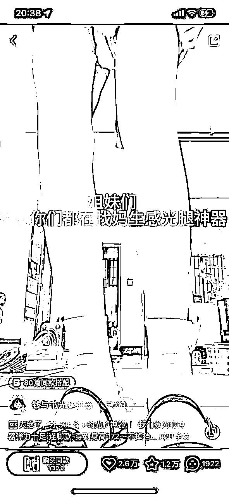

视频的笔记内容：侧重展示高性价比，便宜/可退换/30r➕

提供需求及情绪价值：

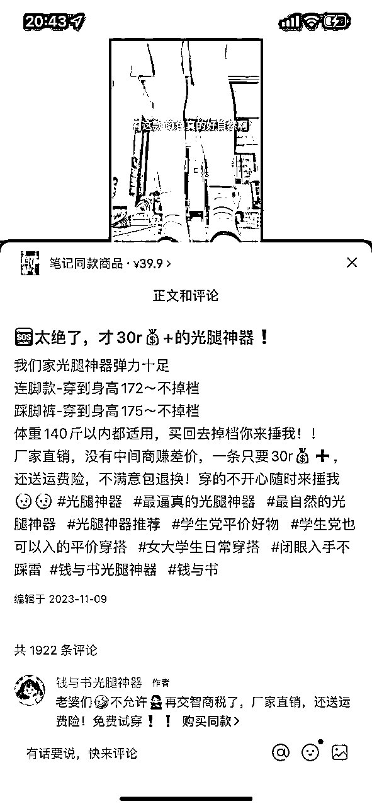

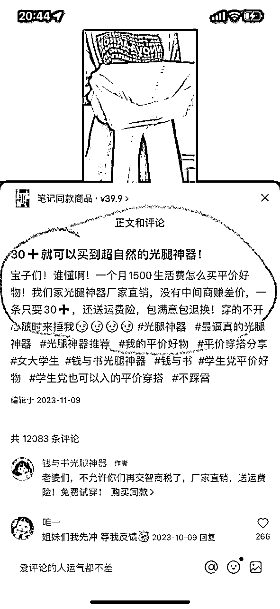

对比一下其他光腿神器店铺的视频笔记：

怀山叙集的拍摄方式及文案非常符合钱与书旗舰店的风格，下面这条笔记13.9w点赞数

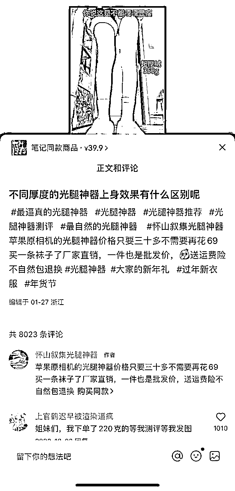

小晴学姐的穿搭

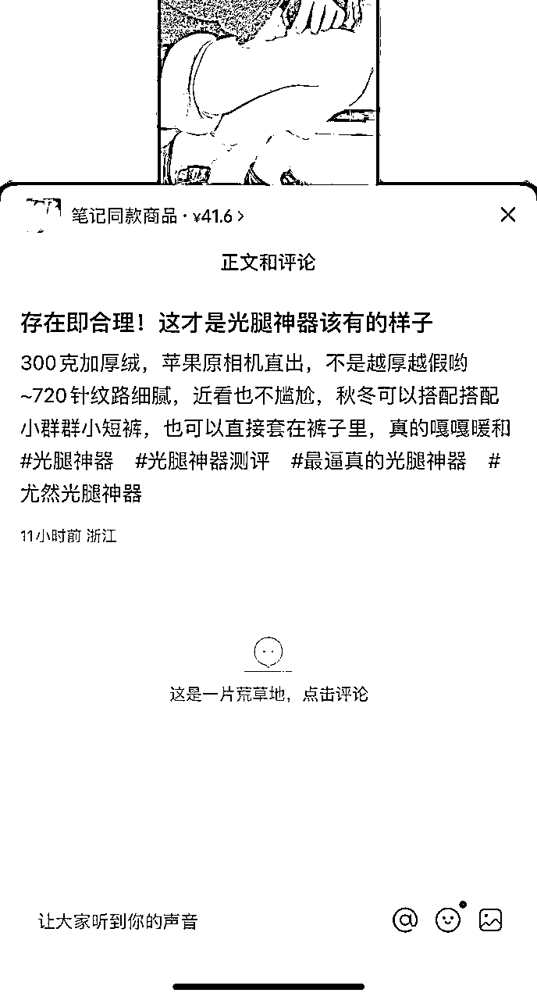

小红书用户目前越来越重视性价比，更喜欢真实测评效果的视频，钱与书旗舰店，在视频下会先带动评论，能够及时回复评论，在评论区发表专业选购建议，提高互动率，增加额外视频曝光；

##### 小红书群聊的日常维护

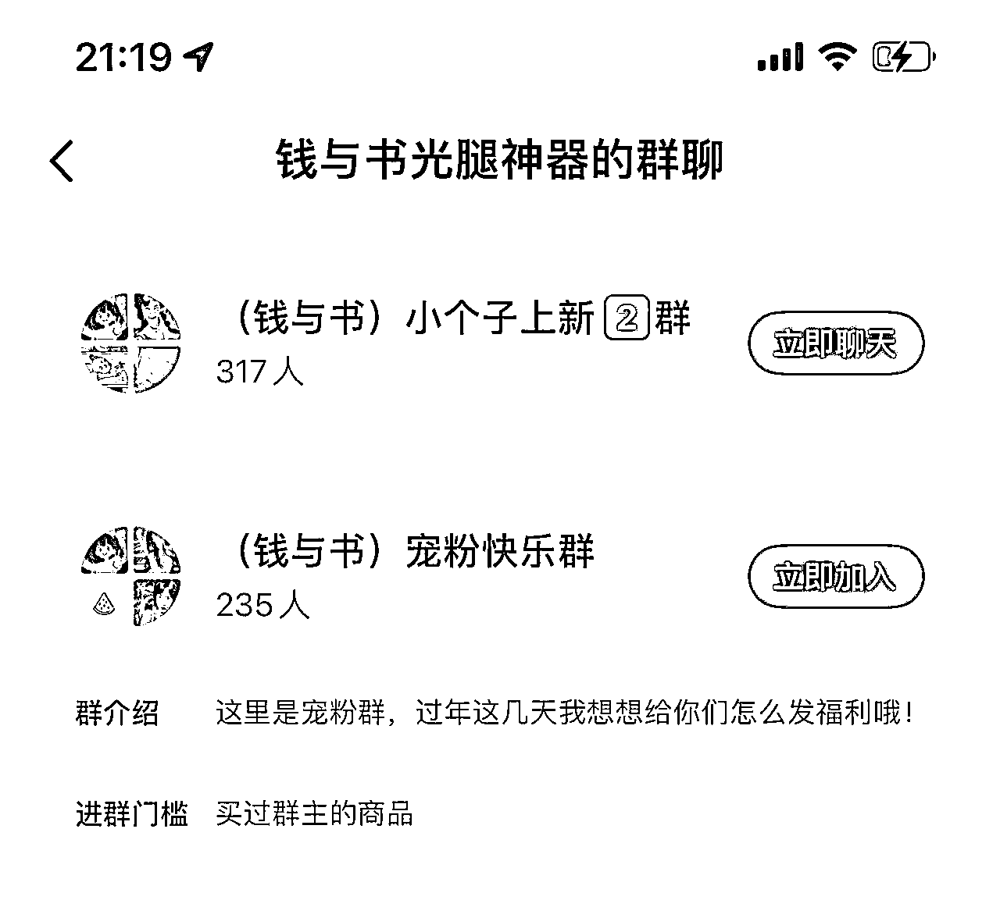

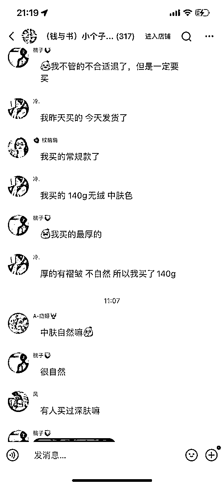

''钱与书光腿神器''用户粘性很强，在群里用户可以提自己的需求，真实反馈及测评；店铺客服是外包金牌客服团队，据搜索了解，外包客服报价按接待量算，"钱与书光腿神器"该店铺日接待量1k➕；如图24小时内4000人加购；

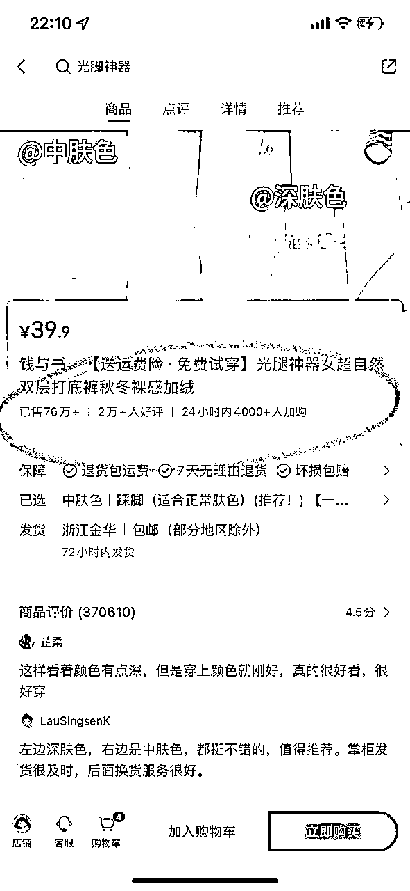

客服外包团队报价如下：

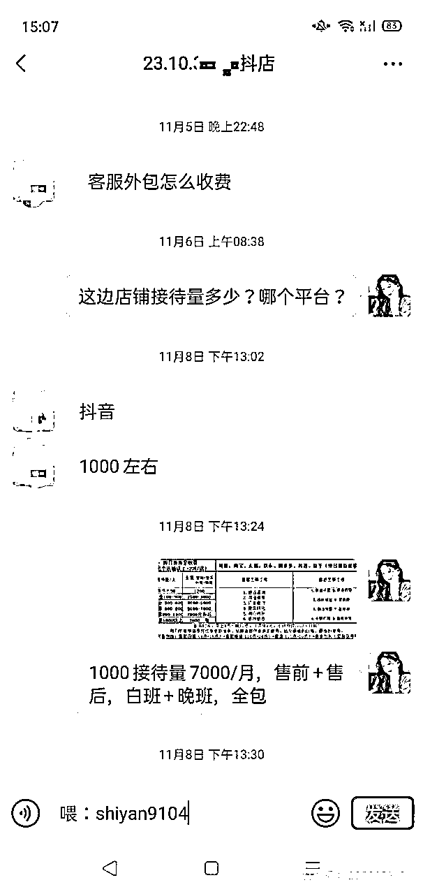

###### 小红书笔记分类

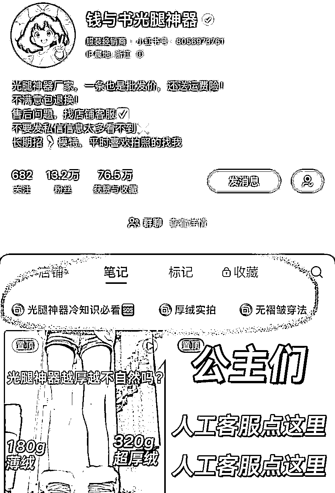

### 利润核算

1688进价如下图：

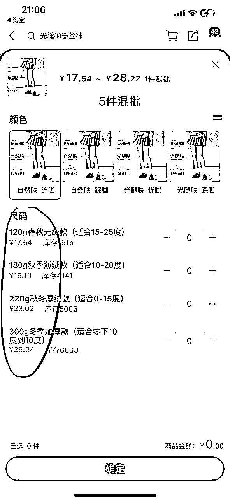

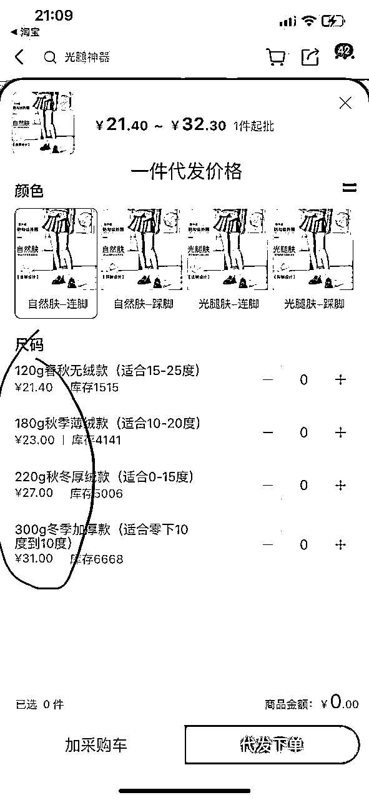

一件代发价格单笔运费增加4元，假如小红书店铺采用的是一件代发发货的话，单件商品差价26元，

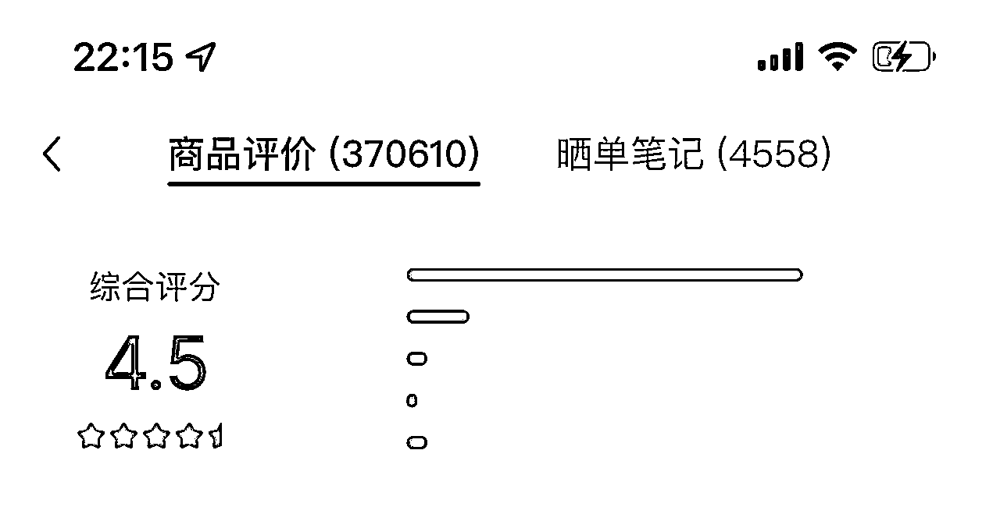

根据店铺根据店铺评分来看，差评率较低，售后问题联系对应1688厂家/实体工厂店，退货直接甩给供应商，大不了抵扣一件运费钱。

| 起号至今客服支出 | 日成交差额 | 起号至今销售差额 | 视频笔记拍摄费用 |
| -7000元/月*3月=2.1w | 50*26元=1300元 | 76w*26元=1976w元 | -1.2k*284篇=34w |
|  |  | 合计：约1939w |  |

综上所述，粗略估计，该商铺在不考虑内部运营成本的情况下，净赚1939w。

分析到这里，我太震惊了，总感觉自己是不是忽略了什么东西？在新红app上未查到该店铺有投放过曝光流量，起号阶段发布爆款视频笔记并且利用流量热度持续输出爆款视频笔记，把流量盘活，迅速起号涨粉，以爆文带货，所谓的厂家直销其实是人设，但带货视频给人的感觉很真实，且确实比其他商家店铺卖的便宜，性价比较高也是这个店铺可以出圈的主要原因。

### 总结

为什么全网那么多产品，这个丝袜能破圈呢？

1.符合产品痛点需求2.性价比高3.实拍视频能抓住用户痛点 4.会选品并将产品好处放大：据拼xx如下图，销量较高的前几位，2023年10月已经出售过这类的产品，小红书平台也有做类似的图文，但笔记未火。

无论是哪个品类做小红书，视频带货效果好于图文带货，用户喜欢真实测评类的实拍视频，评论区回复率高且要专业引导更能加速笔记曝光，起初做店铺可以自己一手操办客服/视频笔记/联系供应商的问题，一旦店铺爆了，规模大起来就要有专业的团队帮忙，客服沟通成本可以外包，一个月大概7000元，视频笔记找网拍/客户真实使用后拍的视频进行剪辑，运营小红书内部产品社群福利发放，增加用户粘性；在做其他品类视频带货时可以借鉴该店铺的一些运营方式。

对于这个主题的拆解还有很多没有到位的地方，我只是找了其中一个比较强势的产品去分析其背后是如何赚钱的，拆解过程的思路可能也不是很严谨，希望看到这篇文章的大佬，多多指点哦！！欢迎评论指导～

谢谢大家阅读！