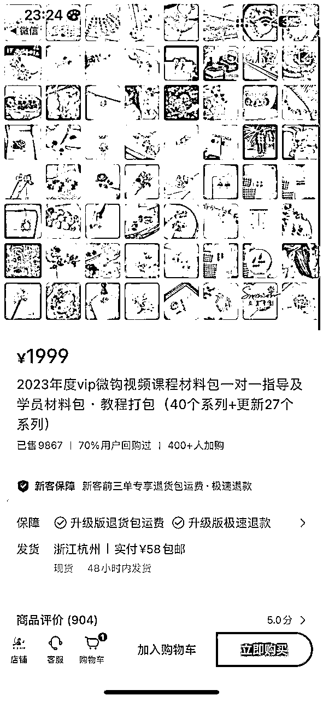
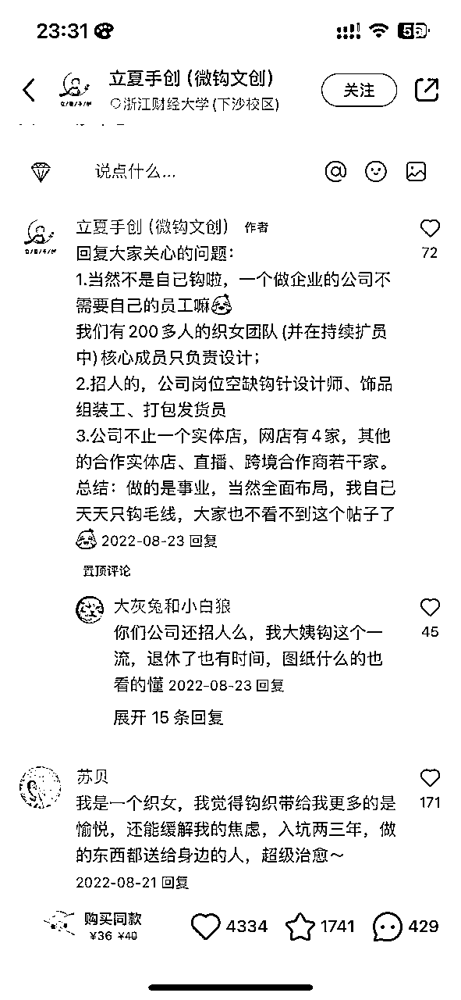
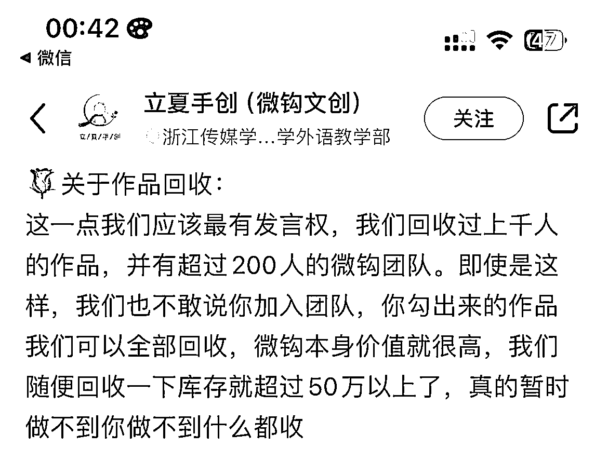
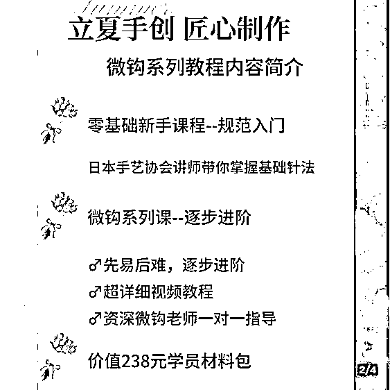
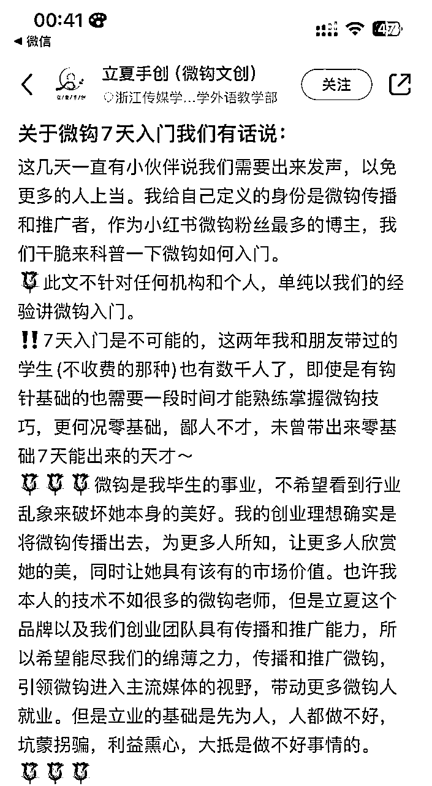
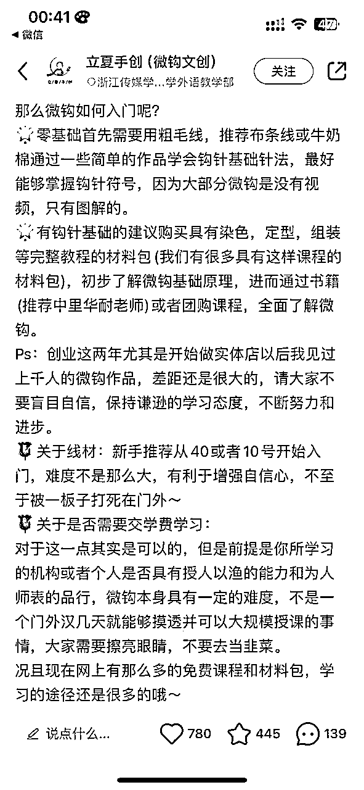
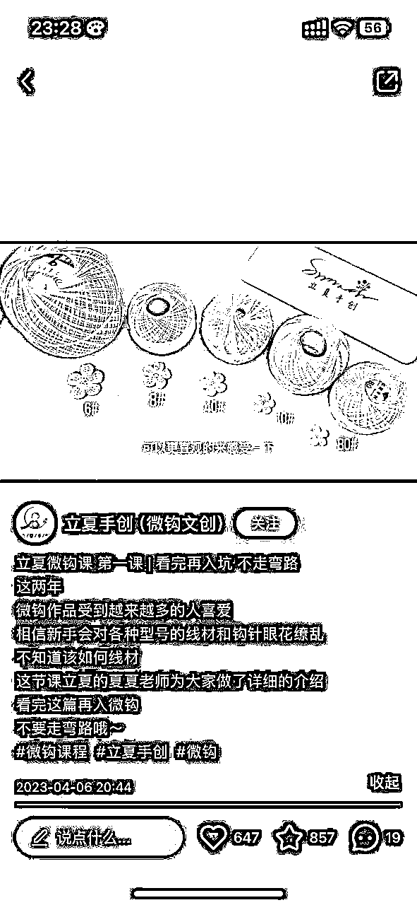
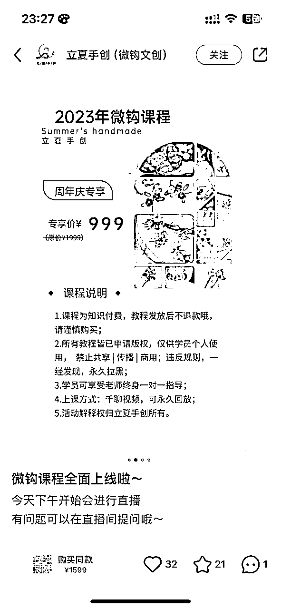

# 风向标拆解第 3 期--垂类知识付费，是一个小而美的生意吗--大Y

> 来源：[https://avvjpxqdxjc.feishu.cn/docx/RGBWdxbESo5F4GxxkEkcQOY7nwc](https://avvjpxqdxjc.feishu.cn/docx/RGBWdxbESo5F4GxxkEkcQOY7nwc)

小红书上，一门1984元毛线钩针教程，卖了9860单。这是一个很了不起的数据，像这样小众到不能再小众的知识付费，只要找对定位，也能大放异彩。

这类型小而美的这种知识付费，其实一直都有，比如体外检测课程、比如照明体系设计，死死抓住一个垂类人群，通过不同的产品设计，千元课也能不断复购。

那么这种垂类的知识付费到底可以怎么来做？换句话来说，如果你有一门手艺/技能，那你到底可以怎么来做？怎么通过账号去获取流量？怎么去做课程体系设计，比如通过从入门到精通的成长路径，完成丝滑升单与复购？希望通过拆解，能形成进一步的结论。

本期拆解大纲如下：（点击蓝色字体跳转到对应板块）

1、选题概述

2、案例拆解

3、项目结论

# 一、选题概述

## 1.1 手艺人概述

提起手艺人，我们可能会想到陶工、铁匠、织工、木匠、厨子、乐手等等。

然而，“手艺人”的定义是相当宽泛的，只要娴于一技，都可以被称为“手艺人”，哪怕擅长的是开方抓药、土木工程或信息产业，七十二行，都能纳入"手艺人”之列。

卖油郎、庖丁解牛是手艺人的典范。

## 1.2 手艺人知识付费

随着社交媒体的普及和年轻人对个性化的追求，手艺人垂类知识付费应运而生。

许多用户希望通过学习手艺人的经验和技巧，提升自己的技能水平，并且愿意为此付费。

手艺人垂类知识付费满足了用户对技能提升的需求，提供了高质量、实用性强的教程和指导。

# 二、案例拆解

接下来我会以 小红书账号-立夏手创 为例，为大家进行拆解。

#### 基本情况

账号：立夏手创

类目：手工文创

粉丝数：9.38w

变现方式：主要是通过小红书图文起号，图文挂车，线上线下都有店铺，小红书店铺卖线上课程和相关成品、材料包等，直播带货。

选择该账号拆解的原因：

*   一家专做微钩的文创店👉垂类店铺

*   靠图文+直播带货👉起号简单

*   价格1999知识付费课程销量9867，70%用户回购👉销量很高，回购率很高

## 1\. 流量怎么获取？

该账号流量主要来自图文，下面将重点分析这图文板块，从而得出一个完整结论。

1）图文信息（从开号至今）

（笔记里2020年10月19日第一条笔记）（数据不准确，赞藏总数和展示出来的笔记赞藏数不一致）

*   新增笔记135条，其中挂车92条，基本全挂车，尽可能多的引导用户购物。

*   发布频率很低，拍的图片很漂亮，审美在线，基本都是商品图，偶尔发一些线下店铺和活动。

*   一开始笔记内容是人物玩偶、水果等微钩，从某一天发的笔记，内容变成「胸针、发夹」，流量开始增加，后续笔记基本都是饰品。

*   图文内容：每个图文放多张近距离摆拍，主图是作品外观。标题，“微购+xx饰品”，精准吸引爱美女孩子和手工爱好者。

2）结论

*   图文：通过挂车尽量引导用户购买；通过垂类产品，精准吸引用户。

*   通过分享手工制作的教程和技巧，让越来越多的年轻人对手工制作感兴趣，但由于缺乏相关知识和技能，无法快速入门。因此，通过小红书平台提供的视频和图文教程，针对不同的技术难点和制作工艺进行讲解，帮助用户学习和掌握相关技能。

*   材料包和付费课程：出单率和复购率极高。

## 2\. 产品怎么解决？

1）个人

在出单量不高的情况下，只要你有一项技能，前期可以自己一个人干 。

2）招人

线下线上双管齐下，规模化找人一起干。

3）学员作品回收

会员制绑定学员，只有学员的作品回收，保证学员的作品不滞销，且有能力将作品卖出去。

*   注：这也是课程复购的重要原因之一。

## 3\. 课程怎么设计？

#### 1.1 了解用户痛点

比如手艺人课程，学员痛点有：不知道怎么选材料，不知道怎么开始，不知道用什么可以做出成品等等，课程设计中可以包含从0-1，从入门到精通，先难后易的内容。

这里以立夏手创账号为例

#### 1.2 解决用户痛点

比如在图文或视频中讲清楚产品，你能给用户带来什么，解决什么问题等等。

#### 1.3课程大纲

先完成再完美，需要调研用户需求，不断更新迭代，做好课程大纲也是吸引用户的一个重要环节。

#### 1.4 课程特色

体现讲师的专业度，一对一指导等。

#### 1.5 课程形式

垂类知识付费的产品形式多样，包括教程视频、图文教程、实操指导等。

#### 1.6 课程定价

成本+利润

*   手艺人可以根据自己的专业领域和技能，开设在线课程或提供付费指导服务。这些产品需要具备高质量的内容和专业的教学能力，才能吸引用户并得到认可。可以借助小红书平台的社交功能，与用户进行互动，提供定制化的服务和解答问题。

## 4\. 如何做升单与复购？

#### 1）项目如何升单

利用好平台，图文更新，定期直播卖课。

#### 2）项目如何复购

小红书的粉丝粘性高且精准，服务好付费的粉丝，让用户信任你是复购的关键。

## 三、项目结论

综上所述，从需求、流量、产品和变现四个角度来看，手艺人垂类知识付费，是一个小而美的生意，它通过满足用户对技能提升的需求，利用小红书平台的流量和用户基础，提供高质量的知识付费产品，实现变现。然而，要在竞争激烈的市场中脱颖而出，手艺人还需要有特色和优势，同时还需要不断学习、创新和与用户保持良好的互动，以提供更有价值的服务和产品。