# 风向标拆解第3期--选题4《小红书高销售量手作饰品都是怎样的运转逻辑》——冷静

> 来源：[https://rrk0u56nvi.feishu.cn/docx/RJindjSWIoP8eyx5JHicYIZLnwd](https://rrk0u56nvi.feishu.cn/docx/RJindjSWIoP8eyx5JHicYIZLnwd)

同是饰品，不同平台和赛道，价格差异巨大。小红书上卖寓意好的手串等饰品的博主很多，但单价与销售额也差异悬殊。

# 一、雍和宫手串、灵隐十八籽手串类

## 流量来源

近年来，越来越多关于年轻人“迷信”的帖子出现：

学生在书桌上放了文昌塔，在作弊和做题之间选择了做法；

女生化妆在鼻头打腮红会破财，因为在面相学里面鼻头发红是凶兆；

甚至一段时间开始流行按五行决定自己每天穿什么颜色的衣服。

这些种种，似乎说明年轻人越来越迷信了，面相占星、紫薇塔罗、八字风水、苏珊米勒、MBTI梅花测字、数字能量奇门遁甲里也必沾一样。

在这样的“潮流”下，有着历史文化背景背书，并且本身就有一定的口碑加持的雍和宫手串、灵隐十八籽，给年轻人新的精神寄托。

## 热度

在小红书搜索雍和宫手串最热的帖子点赞量有3.8w，收藏量1.1w、评论数3393，评论里大多数都是问能不能帮忙带请的。

灵隐十八籽带货最热的帖子点赞量有2.4w，收藏量7368、评论数520。

## 运营模式

### 雍和宫

雍和宫手串一般是代请模式比较多，目前小红书上没有相关的商品信息，并且发布雍和宫手串的帖子基本上是没有带产品链接的。

代请相当于代购，代请人到雍和宫、灵隐寺，根据客户的需求代请手串，赚取代请费。

1、笔记内容引流：

图片：

雍和宫手串的种类、

手带雍和宫手串的图片或以雍和宫为背景展示手串、

文案：

请雍和宫手串的攻略、

戴了雍和宫手串之后事业、生活发生了什么变化。

2、评论区或私信引导目标客户转化至私域。

3、在私域进一步引导客户成交。

### 灵隐十八籽

灵隐十八籽相较于雍和宫手串热度较低，目前小红书上的变现模式有两种

一、代请

与上述雍和宫手串代请模式基本一致。

不同的是灵隐十八籽有代请的购买链接，链接价格是68，手串的原价是46，一单的利润是22元。目前此链接的销量是1031，单链接已经变现两万出。

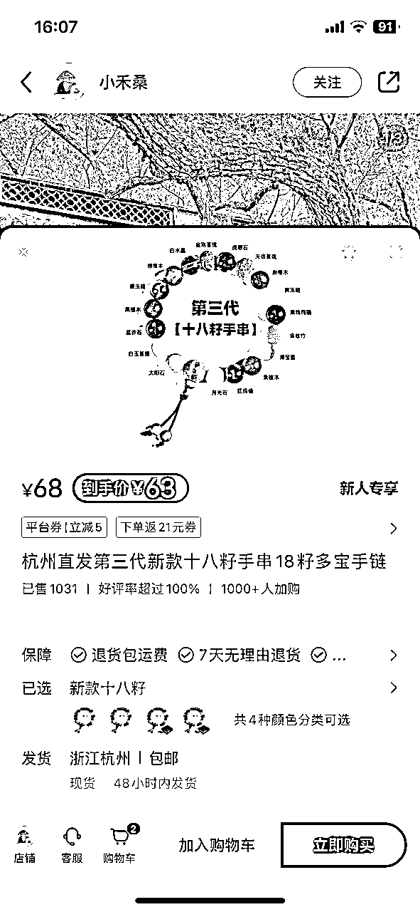

二、店铺带货

以十八籽作为一个引流关键词，销售文玩手串。

笔记内容大多是视频：

1、手戴展示饰品视频，

2、打包视频。

销量：店铺最热销的两条链接：

价格39.9，销量1.1w，变现438900元。

价格19.9，销量6681，变现132951.9元。

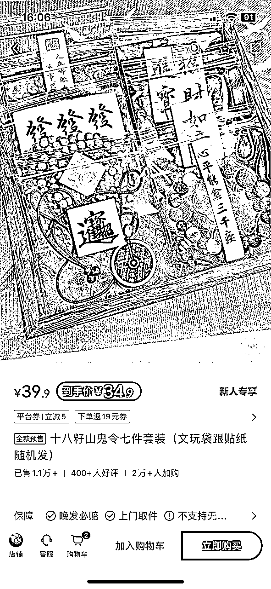

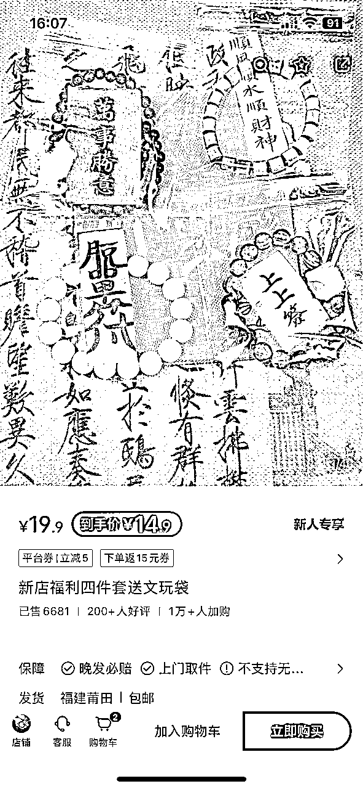

货源：1688拿货。

# 二、手工手作饰品类

此类手作饰品不包含玄学色彩，只为“美”而诞生。

## 特点

手作的饰品相较于“流水线工厂”的产品，凝结了手工者的心血和精力，它的艺术价值是一部分消费群体追求的。

并且因为制作的时间成本注定了的产量的稀缺性，也满足了小众心理人群的需求。

## 拆解例子

以一个近期销量数据很好的一个账号作为拆解例子。

### 账号基本情况

账号分析

账号名称：Shannai Jewellery

粉丝数量：12.7w

获赞与收藏：13.5w

手作领域及产品：串珠项链、串珠手链、串珠耳饰。

变形方式：直播（近3个月几乎每天都有直播）、笔记附带链接销售。

销量：前5销量的链接

价格198-229，销量8647，变现大概是一百八十万。

价格288，销量6672，变现大概是一百九十万。

价格188，销量5375，变现大概是一百万。

价格198，销量3174，变现大概是六十万。

价格88，销量1230，变现大概是十万。

### 笔记内容

图文居多，主要有两大类。

1、封面展示产品并搭配同色系的画

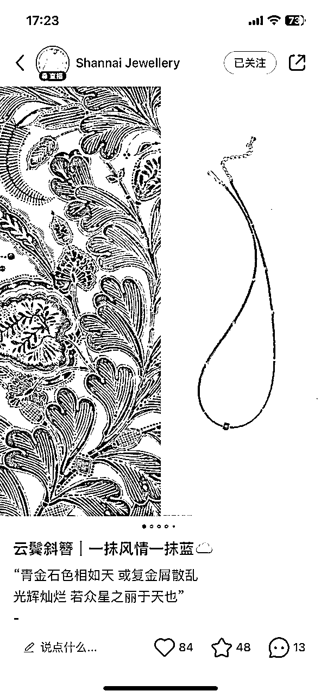

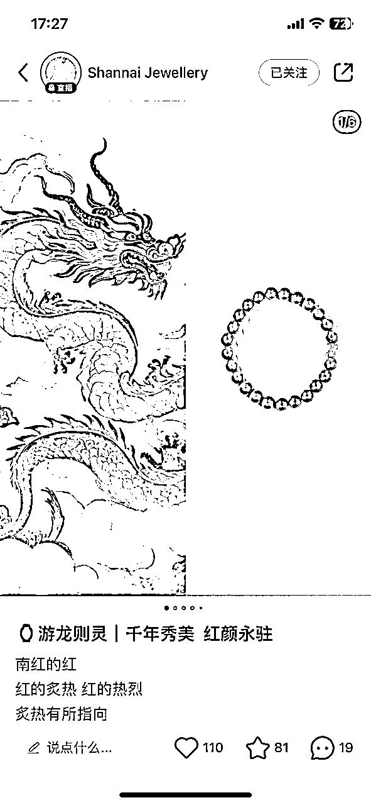

2、封面展示产品穿搭的效果

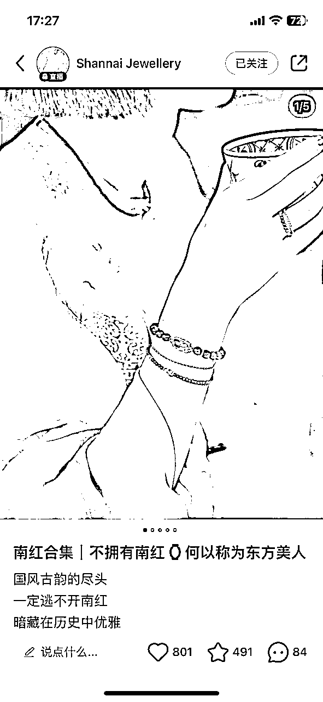

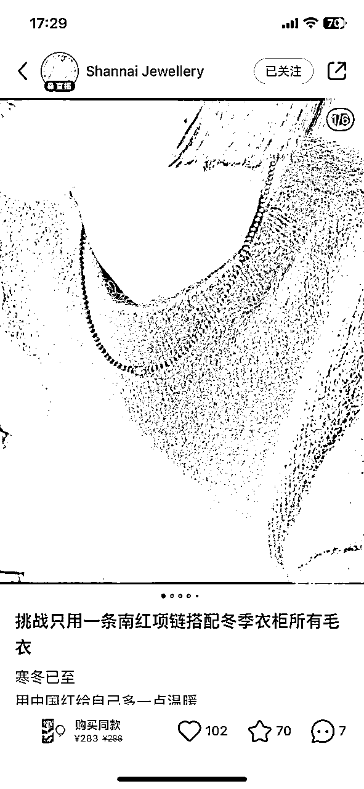

### 直播风格

说话比较温柔，语速慢。

前排展示半成品和原材料。

中排展示几款成品。

主播半露脸，穿戴几款产品在身上直观展示。

产品讲解主要以颜色、寓意、上身效果为主。

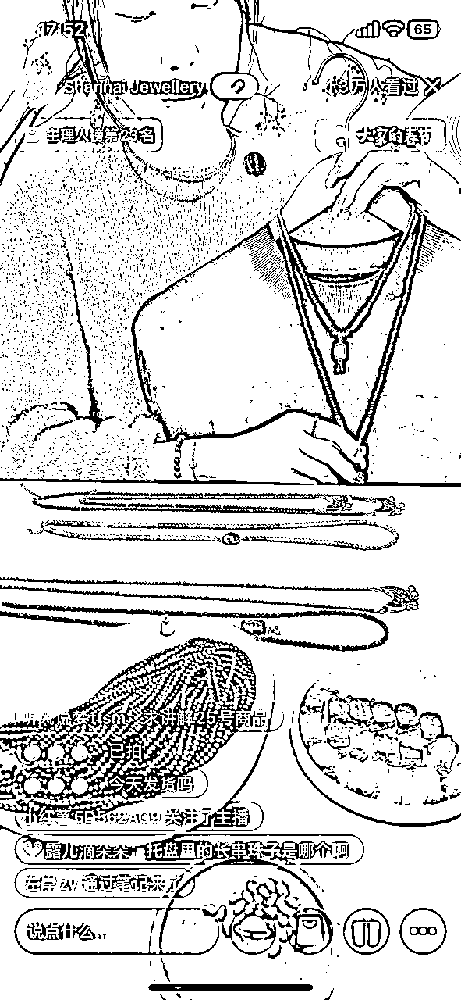

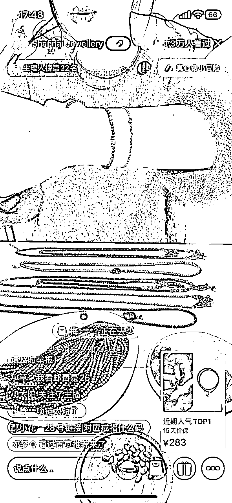

# 三、赛道分析

这个赛道统称说是手作饰品，但其实像是雍和宫手串/灵隐十八籽这两个产品来说，并非真正的手作类饰品，更偏向于带有宗教风俗色彩的文创产品。

而“真正”意义上的手作饰品，我把它又拆分为真正手作类和包装手作类。

## 真正手作类

这类是真正的手工制作，对产品的独特性要求比较高，购买者也很看重产品设计是否为原创。

制作工艺的不同也会很大程度的影响产品的价格，原材料并非第一要素，而是制作的精美程度/难易程度。

### 优点

可以根据自己的风格，想法设计出自己独一无二的产品，并且可以根据客户需求特别订制。被同款产品打价格战的情况会较少发生。

### 缺点

前期需要投入原材料、制作工具的成本，需要投入的时间更多；对审美、手工艺的要求也会更高；并且产品款式没有经过市场的验证。

相较于无货源模式来说运营难度更大。

## 包装手作类

这类大多数是无货源模式/或是直接拿市面上现有产品，通过运营的手法包装成自己的原创手作。

### 优点

可以找市面上已经被验证过的产品来做，对手工艺无要求，需要制作的时间成本几乎为零。

### 缺点

产品没有自己的独特性，容易被客户在网上搜到同款对比价格，并且也更容易被同行直接复制运营。

## 运营底层逻辑

分析小红书现有的这些账号，我感觉最重要的一点是风格的统一，

虽然手作类饰品的购买群体都是女性用户，但是不同风格的用户喜欢的饰品风格也大不同。

以产品来确定购买人群的画像，统一笔记的风格；

或是以目标客户的画像来确定产品及笔记的风格。

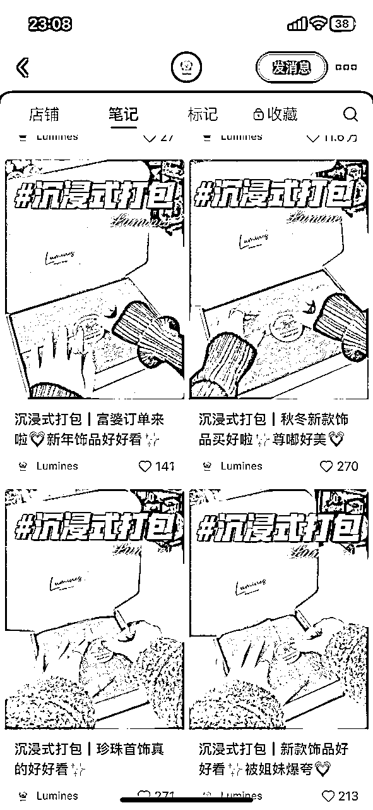

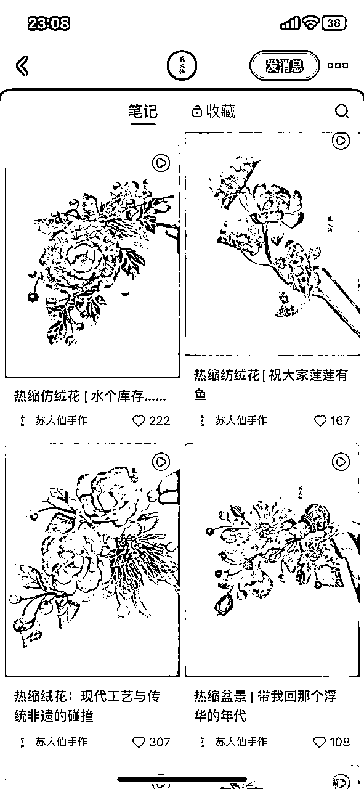

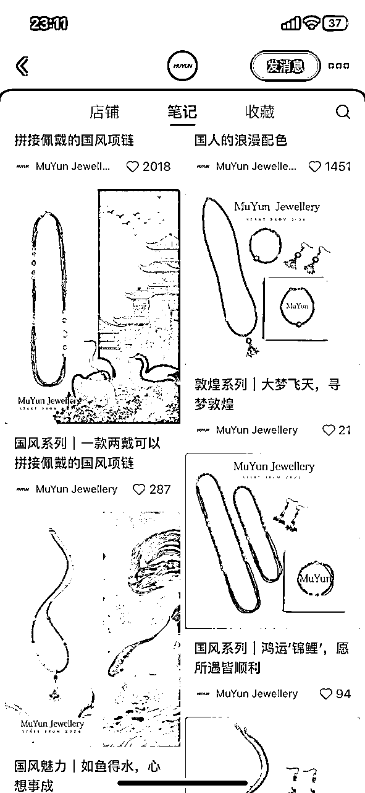

不会想着一个账号要通吃所有类别的客户，风格的统一也会形成明确的账号色彩/标签，用户也会更加忠实。