# 远程办公的高效团队管理

> 来源：[https://q4u7b61cya.feishu.cn/docx/RMjGdCDYsoJ8bgx0iSscy3ltnWg](https://q4u7b61cya.feishu.cn/docx/RMjGdCDYsoJ8bgx0iSscy3ltnWg)

引言：

在我第一篇文章下面，居然有人留言了！这位热心网友想要深挖互联网办公的秘密——不就是我们现在正做的那件事吗？他们好奇的是，用什么神奇的平台来布置工作任务，怎样跟进，以及团队或小组的最佳人数是多少。换句话说，他们想知道的是如何在穿着睡衣的同时，还能高效管理一个远程团队。

那么，这篇文章就应运而生了！我会分享我们公司是如何在远程协作的。当然，我们公司有点特别，像是那种在晚会上穿着独角兽服装的那种特别，所以这部分就轻描淡写了。重点会放在我见过的那些让人眼前一亮的优秀案例。告诉你们，想要远程工作，员工数量根本不是问题——不管是五人乐队，还是五十人交响乐团，远程协作都能和谐美妙地进行。"

# 我所在公司的个例

## 缘何远程办公

我目前的公司，是互联网行业的一员。我们最初专注于印度市场，最近又悄悄地转向了东南亚。我在2019年4月加入这家公司，作为创始团队的一部分——是的，我是那个‘从一开始就在的老人’。

起初，我们在北京中关村一个不错的写字楼里租了个地方。但是，当疫情来袭时，我们被迫开始了在家办公的生活——你懂的，穿着睡衣开视频会议的那种。中间恢复过现场办公，也在中关村换过三个办公地点。22年10月，由于公司的现金流危机，我们无法再租办公室了。就这样，我们开始了长达两年多的远程办公之旅。

这种远程办公模式，可以说是逼出来的。好在留下的都是一些老员工，大家共事多年，彼此间早已磨合得很好。即便公司后来被收购，重新焕发了生机，我们发现远程办公并没有影响工作效率。于是，我们就继续保持着全员远程办公的模式，近期也没招聘新人。

目前公司的规模只有20人左右，包括兼职。在规模最大的时候，中国的全职员工也不超过25人，印度员工接近一百人。而我们一直以来，都是和印度的员工远程协作。这就是我们的故事——一个小团队在全球化浪潮中，穿梭于云端的冒险旅程。

## 我司远程办公现状

正如前文提到的，我们团队里剩下的都是老面孔，人数虽少，但合作默契得就像老朋友一样。我们之间几乎没有内耗和争执，就像一群和睦的邻居，大家都懂得相互尊重和支持。

在我看来，我们不仅是同事，更像是老友。除了工作，我们经常在会议结束后聊聊生活琐事，谈谈家庭和爱好。比如，我近期回北京，居然不用订酒店，直接住在同事家里，感觉就像回家一样。

说到我们的办公工具，我们使用的是国际版本的飞书——Lark。每天上午十点半，我们都会开早会，分享一下今天要做的事情，需要大家帮忙的地方。早会结束后，大家就各奔东西，开始一天的工作。

我们还采用了双月OKR模式，每两个月就会回顾一下OKR的完成情况。至于项目管理，一开始我们用的是Airtable，后来转移到了Lark上的多维表格。这些工具就像我们团队的魔法棒，帮助我们在远程工作中保持高效和有序

Airtable:

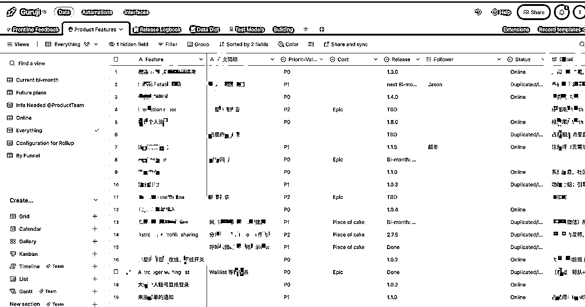

飞书多维表格：

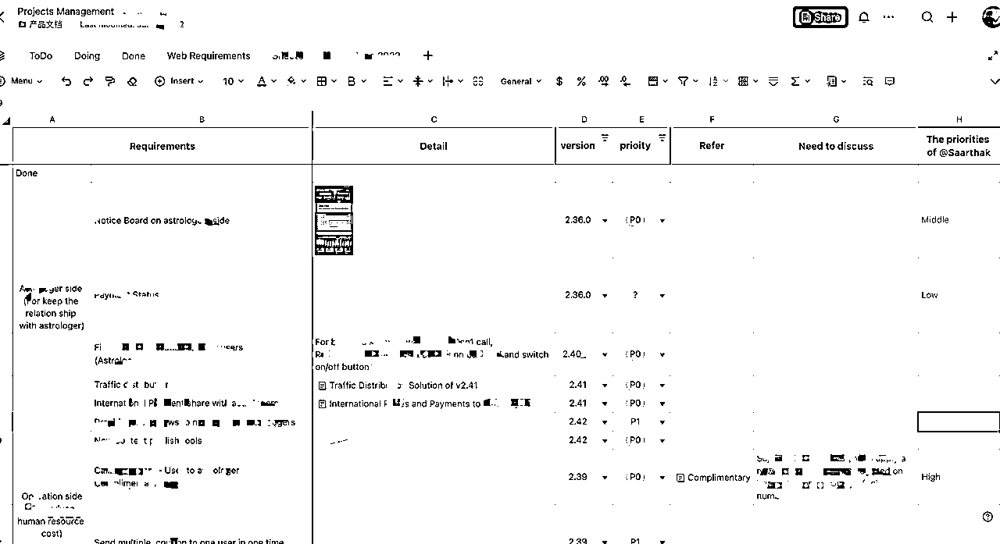

说到会议，我得承认，我是那种对冗长会议有天然反感的人。尤其是那种讨论了半天，结果却空空如也的会议。曾经有段时间我几乎被各种会议淹没，特别是在需要和印度同事协调运营工作的时候。这种情况下，变革应运而生。

在字节跳动，有一种很有效的开会制度，叫做“飞阅会”。简单来说，就是会议发起人会在会前发送所有需要讨论的文档，大家预先阅读并留下评论。会议时，我们就直接围绕这些评论进行讨论。这样一来，大部分会议都能在半小时内高效结束。现在我负责组织产品会议时，也一直坚持这种方式。

此外，Lark上有日历功能，我们会习惯性在上面标注自己的忙碌时间，且全员公开可见。假设我们确实需要开会，也会利用日历查看相关人员的空余时间，确认空闲时间的交集后直接约会议。

总的来说，在我们公司的团队管理风格相当松散。即使在需要亲自去公司办公的日子里，我们因为经常要和印度团队对接，时差问题使得我们的上班时间定在了上午十一点。这让我经常能避开高峰期，享受一个更加轻松的上班路程。在我感觉状态不佳，且当天没有紧急事务需要处理的时候，我会选择去Keepland运动放松一下，然后回来继续工作。这种灵活的工作方式并不影响我的工作效率，即便有时需要工作到晚上十一点或更晚。

但这里有一个关键的前提：在公司初创阶段，我作为一个大厂出身的人，曾经热衷于制定各种规章制度，比如报销制度。然而，公司的创始人更倾向于奈飞的企业文化，核心理念是自由与责任。他相信，给予员工足够的自由，就应该承担相应的责任；提供顶级的薪资，招聘最优秀的人才；最好的福利不是下午茶等小惊喜，而是周围充满能力出众的同事。因此，他甚至希望连报销制度都能简化。

文化准则包括：

1.  我们只招聘成年人。

1.  让每个人都理解公司业务。

1.  绝对坦诚，以获取真正高效的反馈。

1.  只有事实才能捍卫观点

在这样的文化下，我们团队中的每一个成员在招聘时都经过了严格的筛选。大家都是主动性强、反应敏捷的类型。因此，工作起来非常顺畅。如果你所在的团队也有高人才密度，管理的复杂度自然就会降低。只需要为他们创造一个良好的环境，他们就会自发地产出优秀的成果，因为每个人都想把工作做得尽善尽美。而这些其实都为高效远程办公团队的打造打下了基础。

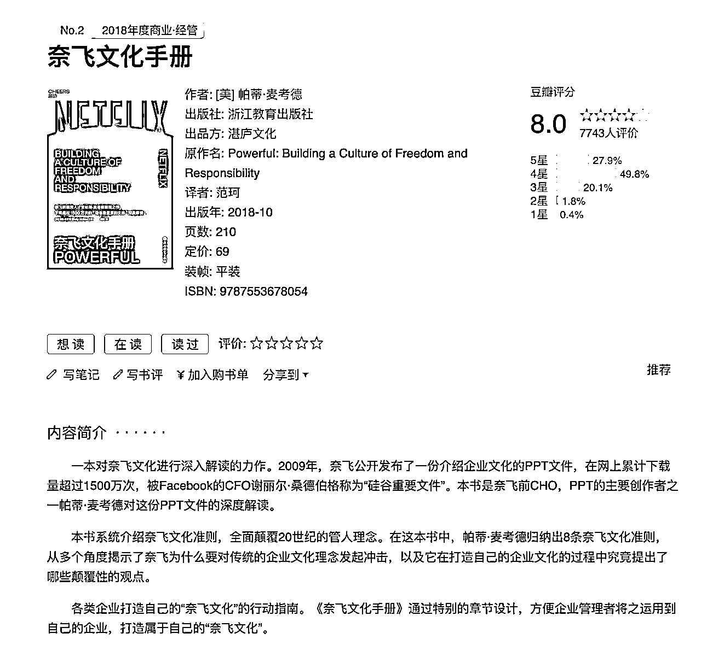

总结：不难发现我们公司确实有着其独特之处。最初，我们都是在一个办公室内并肩工作的同事，后来转变为远程工作模式。由于大家之前已经有过面对面的合作经历，因此在远程办公时并没有出现文化融入问题、团队管理难题。

不过，世界上还有些公司，他们从一开始就是完全的线上运作模式。这些公司在招聘、入职、团队建设等各方面都采用了专门的线上处理方式。接下来，我将以两家这样的公司为例，详细介绍他们是如何在全线上环境中高效运作的。

# 国内全员远程办公公司：圆领

圆领是一家远程工作者服务交易平台，致力于推动远程工作的发展，让企业能跨越地域限制招募人才、让每个人无论身在何处都能自由地创造。他们不仅全员远程工作，也在帮助其他企业掌握远程协作。

官网链接：https://www.superthem.com/home

企业规模：50人以内

这家公司也用飞书作为远程协作的工具，其产品经理曾经在飞行家（官方认证的飞书高级玩家，详细可以参考： ）的分享会中，详细介绍了公司如何利用飞书在新人入职、项目管理等方面进行高效协作。

以下为对应案例，请参考：

## 🔖 新人入职

#### 介绍视频

每个新人入职都需要发送介绍自己的材料和视频，让全公司所有人都可以方便地了解新人。每个新人的个性、风格和形象都以最生动的方式在公司首次亮相。

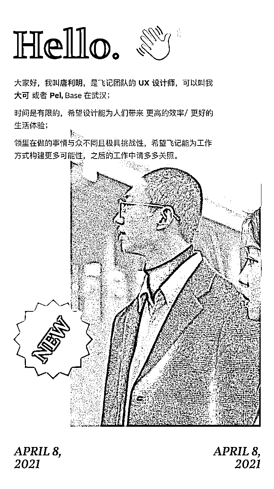

#### 入职文档

通过文档来帮助新人梳理了解刚进入公司需要做的事情：了解工作方式、加入群组、加入飞书日历中的会议、查看过往的共享文档知识库、开通各线上系统账号、根据入职清单完成前期上手工作等。这些即使我所在的公司线下办公的时候也会有，但是圆领包含的内容会更加全面。

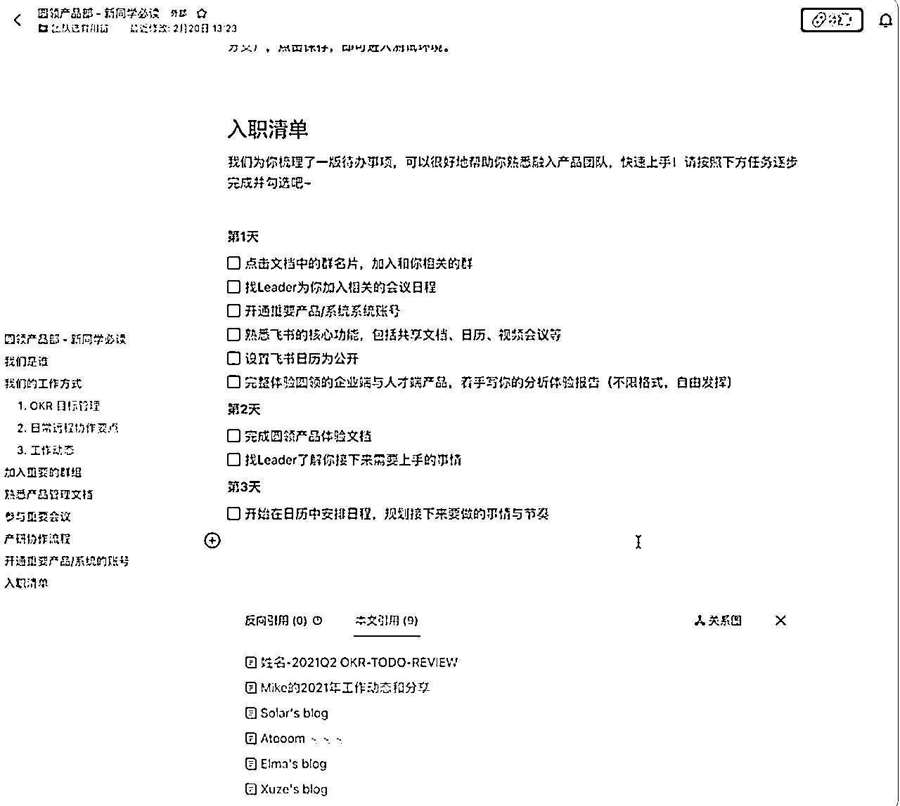

#### 欢迎会

入职的第一天，与人的直接接触是很重要的。除了欢迎会，还有Buddy见面以及相关同学的1v1沟通。请参考如下视频：

### 🖥️ 视频会议

重点：

*   不开视频的远程办公是不可持续的

*   所有会议内容都在线上且保存

*   会后结论信息快速流转：多维表格与话题群

切忌：

*   通过开会来实现“监控”

*   所有会议都接受，不敢拒绝

*   挂机型参会

飞阅会

普遍适用于评审会、部分周会等强调效率的场景

讨论会

抛砖引玉的类型，其中1~3人准备多种方案，众多新点子诞生于PK环节中

共创会

人人共创的形式与分组共创的形式，类似于头脑风暴

分享会

核心人分享与准备内容，多数人是“听众”，氛围很轻松，还可以和家人一起

产研会议是公开向客户直播的，客户可以和他们互动。另外，公司也会和用户举办All Hands Meeting，和用户同步和沟通公司在产品和业务上的思考，让用户与公司共创和共同成长。

### 📡 公开会议结论

项目表里面，大家的讨论会议文档都会统一在一个地方管理。

所有同学无论什么职位，什么级别，都可以自由获得所需要的信息，确保公司内部信息高度透明化。

会议讨论公开

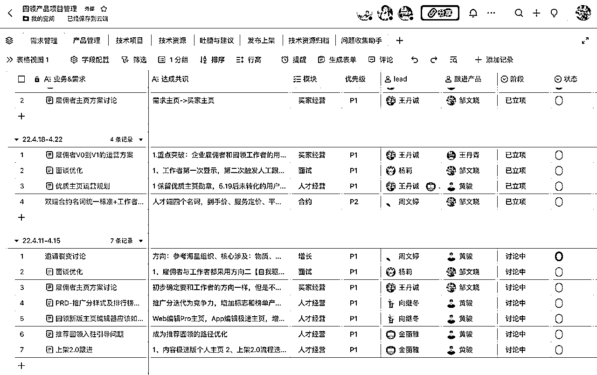

### ⏳ 公开产研进展

产研版本安排与进展公开

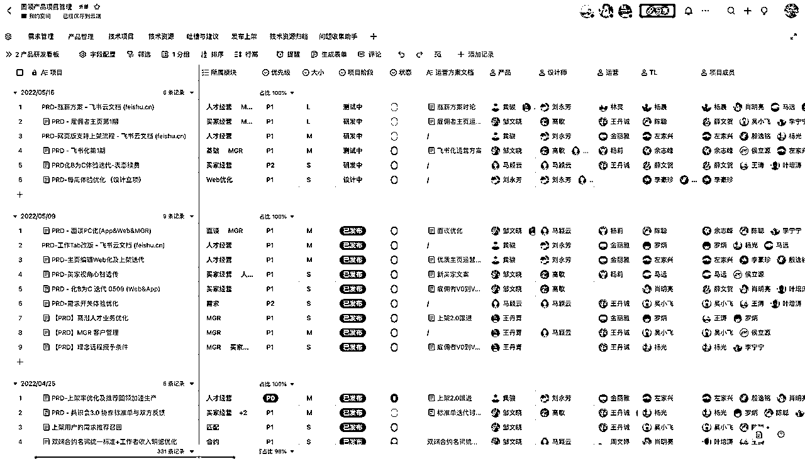

人力投入可视化

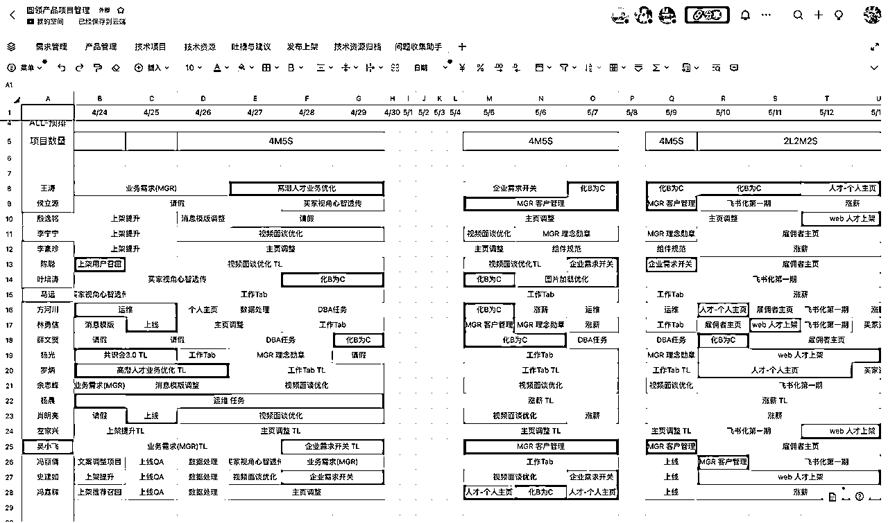

### 📆 公开日历

习惯性使用日历来进行时间管理，并推动在公司范围内公开日历进行信息共享。默认公开日历，当然如有涉及保密日程则可以单独设置为非公开。这一点和我所在的创业公司相同。

这里也可以看到公司制度上有统一的上下班时间，基本没约过晚上的会议，同时这也是为了确保大家在上班时间能快速响应协作，下班时间也有自己的空间。解决信任问题，要通过透明化来实现。

在物理空间上，需要办公区域与生活区域有所划分；在时间上也是一样的，可以从日历直观看出。

### 📢 公开话题群

圆领有多个话题群，比如人人都是圆领产品经理的话题群，在这里所有人都可以抛出遇到的一线用户问题、对产品和业务的想法，这个群里CEO和一线共享公开透明的信息。

解决问题最快的方式：曝光所有问题。

另外，客户问题、人才问题、用户成功故事的案例分享也有专门的话题群与机器人进行信息采集归类。如有重要项目上线，还会单独建立话题群，在刚上线的冲刺期进行每日进展同步。

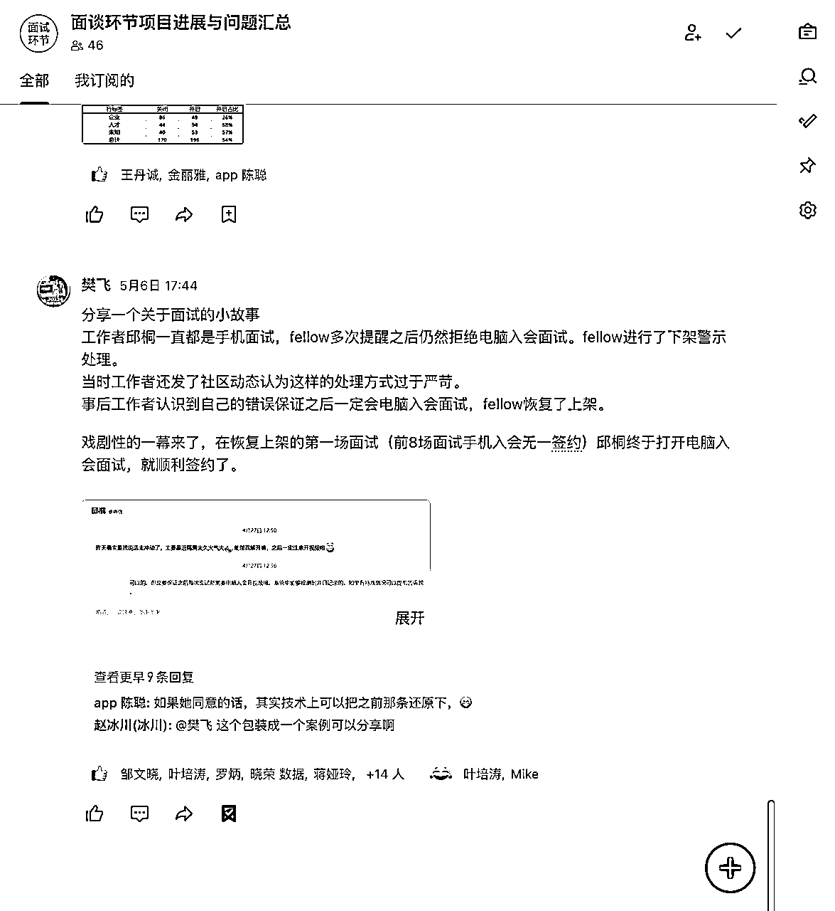

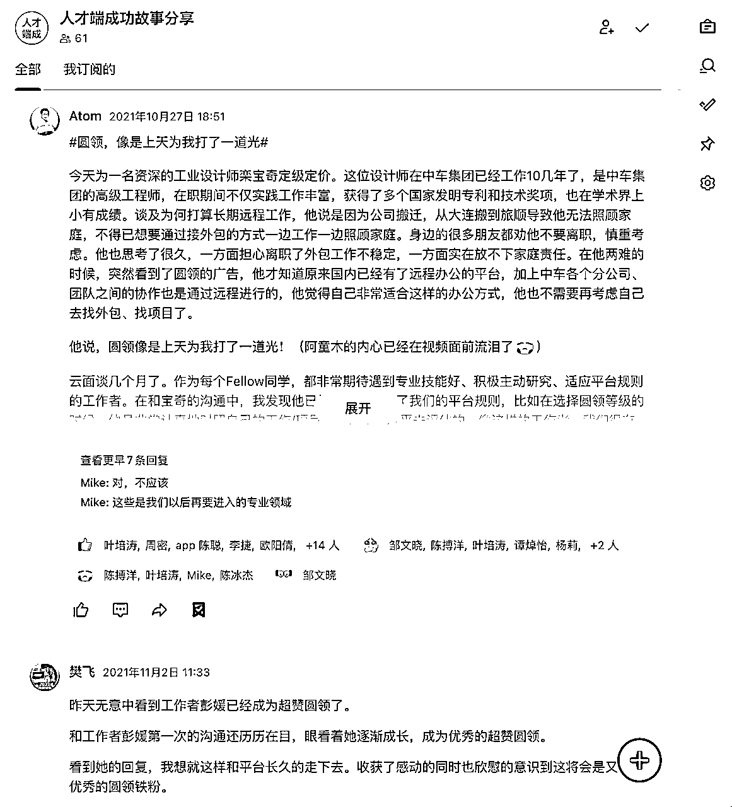

### 👻 人与人的连接

### blog&动态

因为圆领没有茶水间，没有线下的偶遇和下楼的散步时光。所以需要更加主动的表达每个人自己的想法、观点和交流的地方。而飞书文档和公司员工的签名档，成为了每个人的“客厅空间”。

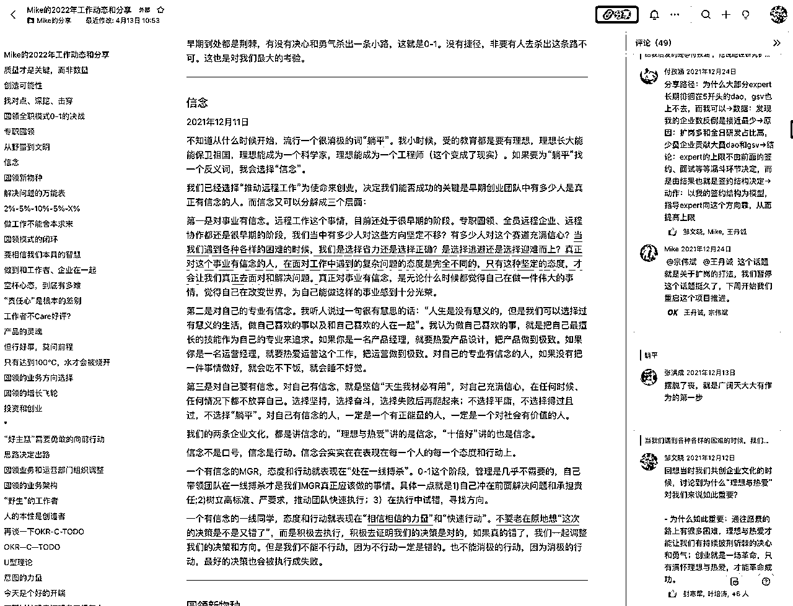

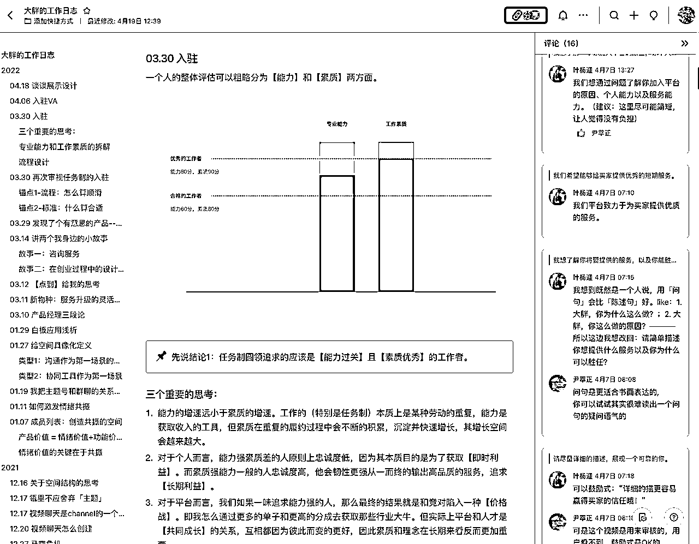

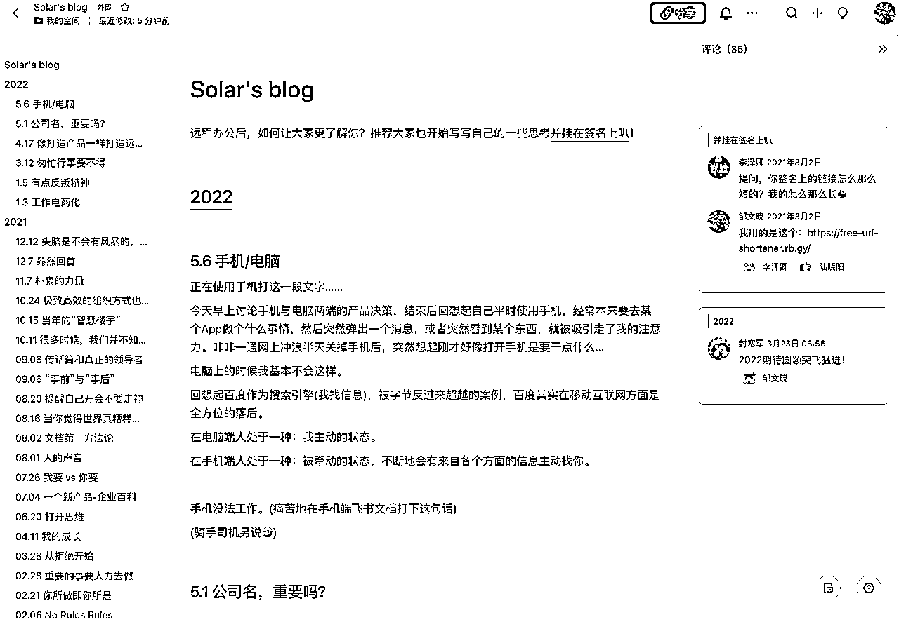

我在2022年受到他们的启发，同时也面临着一个重要人生转折点，需要从全职转兼职，以便花更多时间在自我探索上。这个决定对我来说非常重要，我希望能够充分解释给我的印度同事们，让他们理解我的选择以及这将如何影响我们未来的合作方式。于是也写了一份属于我自己的个人使用说明书。

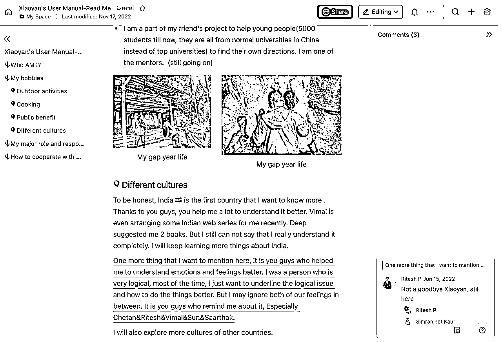

### 线上分享会

刻意组织大家讨论非直接工作相关的内容，拉进大家的距离，丰富每个人的维度。

### 线下见面团建

日常中大家会约着线下见面，周末一起玩耍，或者偶尔在当地城市的wework或者咖啡厅一起工作一天吃饭(自己约着公司关系好的朋友即可，非强制)

公司定期进行全员线下边旅行边工作一周

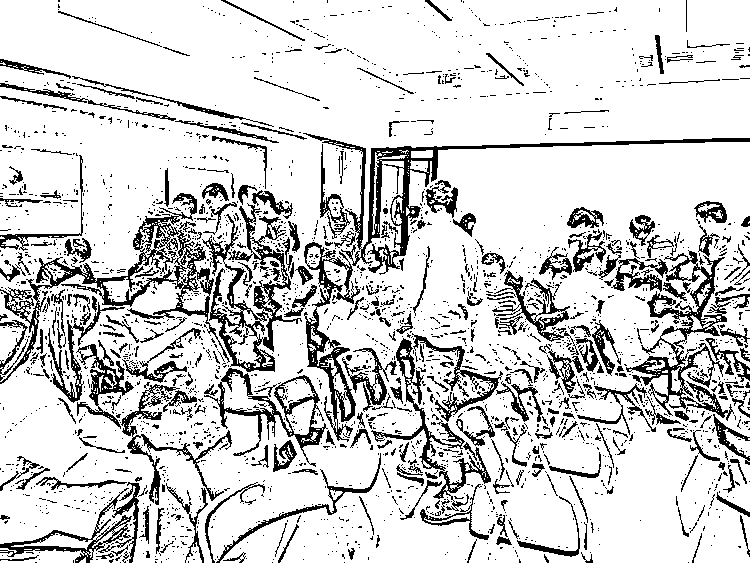

## 国外全员远程办公公司：Gitlab

我们已经讨论了两家小型公司——圆领和我的公司——它们都成功实施了全员远程工作的模式。这可能会引发一个疑问：全员远程办公是不是只适用于小公司？大公司是否无法实现全员远程工作？其实，答案并非如此。

现在，让我们来看一个有趣的例子，这家公司将颠覆我们对远程工作规模限制的传统观念。GitLab是国外一家SaaS公司，主要提供Git代码仓库托管服务，并提供代码审查、代码分支、代码自动化部署等功能。 GitLab的产品特点是开源、易于使用、跨平台、支持私有部署，并且有免费和付费版本。

从官网信息来看，他们的员工遍布全球，来自60多个国家，总计拥有1800多名员工。这家公司自2011年成立以来，就从未设立过任何实体的线下办公室。那么，他们是如何做到的呢？我们不妨深入了解一下。更多的细节和公司文化可以在他们的官网上找到：GitLab官方手册。

值得一提的是，GitLab国际并不在中国招聘员工。他们在2021年初在中国成立了一家独立运营的公司，名为极狐 GitLab。目前，极狐 GitLab已经有100多名中国员工，在全国20多个城市分布。就像其国际版本一样，极狐 GitLab也实行全员远程工作，不过他们有自己独特的管理模式，与国际版本有所不同。更多关于极狐 GitLab的信息，可以参考这篇知乎文章：《国内允许远程办公的公司有哪些? - 知乎》。需要注意的是，本文接下来的内容仅基于GitLab的国际版本。

### 核心价值观：

探索GitLab的企业文化和价值观是理解他们如何高效实施远程办公的关键。这家公司建立了一套独特的核心价值观，这些价值观不仅体现在他们的日常工作中，而且还深刻影响了公司的整体搭建模式。

1.  🤝 合作（Collaboration）：GitLab非常重视团队合作的文化。这包括公开分享优秀的工作，公开给予正面评价，而对于负面反馈，则在私下一对一交流。他们强调在交流中只关注行为而非个人，尽可能以善意解读他人的意图。为了衡量合作的效果，GitLab甚至制定了一个针对不同合作水平的评分表格。

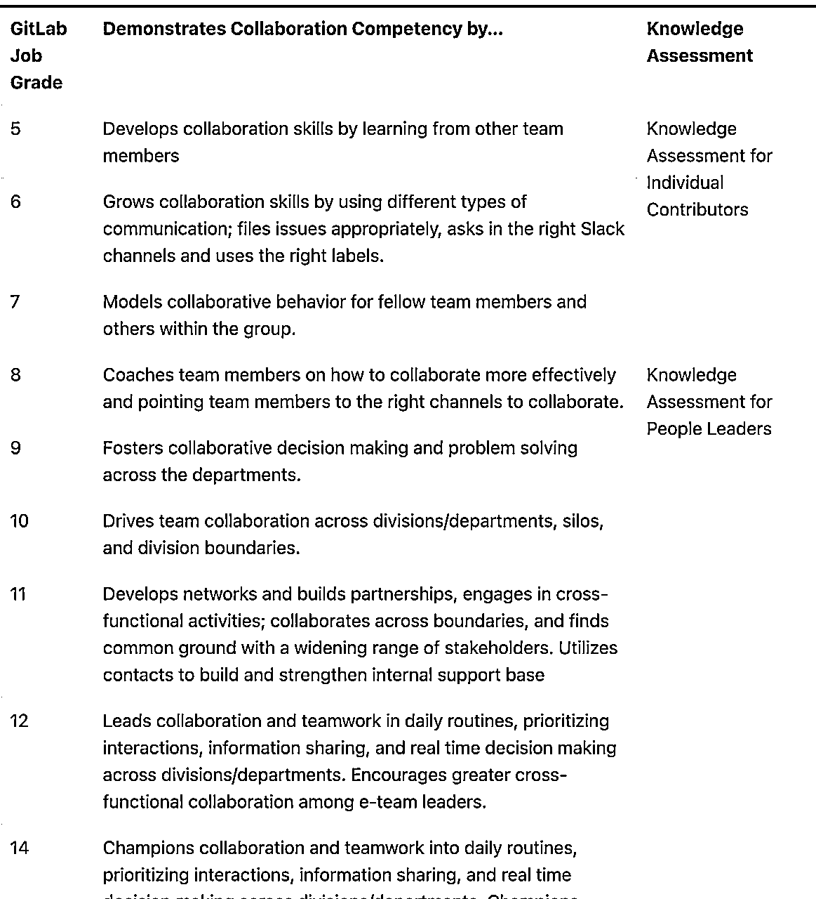

1.  📈 客户成功（Results for Customers）：公司的目标是帮助客户获得成功。

1.  ⏱️ 高效（Efficiency）：GitLab鼓励将事情书面化，遇到问题先查阅公开的文档，尊重他人的时间，并且在使用公司资金时要像对待自己的钱一样审慎。他们更倾向于自由和责任，而不是僵化的规则。

1.  🌐 多样性、包容性和归属感（Diversity, Inclusion & Belonging）：他们试图打造一个文化多样性高，包容性强，能够让不同类型的人都能够得到一定归属感的公司环境。

1.  👣 迭代（Iteration）：他们重视通过迭代来实现最小可行且有价值的成果，并快速获得反馈。

1.  👁️ 透明度（Transparency）：GitLab倡导工作和决策的透明度。

通过上述这些核心价值观，GitLab构建了一个高效的远程工作环境。每一项价值观都在他们的工作方式、决策过程和企业文化中得到体现，共同保证了远程办公的高效率和顺畅沟通。

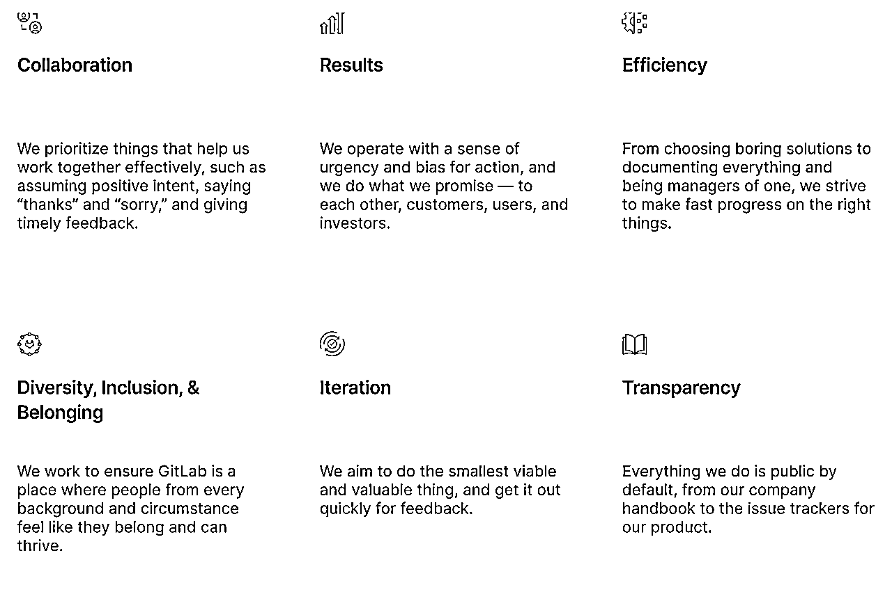

### 招聘端把控：

GitLab意识到，为了实现高效的远程办公，对员工的要求相对更高。因此，他们在招聘环节特别注重评估候选人是否适合远程工作。他们认为适合远程工作的人选应具备以下几个关键特质：

1.  自我管理能力：“Manager of One”的概念，指的是候选人能够独立管理自己的工作和责任，不需要过多的外部管理。

1.  沟通能力：GitLab更多采用异步沟通的方式，也就是通过文档而不是同步会议进行沟通。在这种环境中，文字表达能力变得尤为重要。

1.  远程办公经验：是否有远程工作的经验。即使没有，候选人可能也有在办公室以外的环境（如旅行时工作或在校外推进大学项目）工作过的经历。面试时会询问候选人如何管理这些情况的具体例子，尤其是在无人监督的情况下如何解决问题。

1.  与公司核心价值观的匹配程度：考察候选人的价值观是否与公司的核心价值观相吻合。

1.  自我意识和敏捷思维：一种测试这一点的方法是评估候选人进行思维写作的能力。这指的是能够起草想法，然后对其进行阅读、修改、调整顺序、删减或增强，并能够毫不羞耻地与他人分享这些想法。

通过这些细致的招聘标准，GitLab确保了每位新员工都能够适应并且在远程工作环境中高效工作，同时也保证了团队的协作和沟通能够顺畅进行。

### 新人入职

GitLab的远程入职流程是一个独特而精心设计的体系，它专注于三个重要方面：组织侧入职、技术侧入职、和社交侧入职。其设计是为了从第一天就培养员工的自主能力。员工被鼓励成为自己的经理（manager of one），自立目标，独立完成任务，并在遇到问题时主动寻找解决方案。

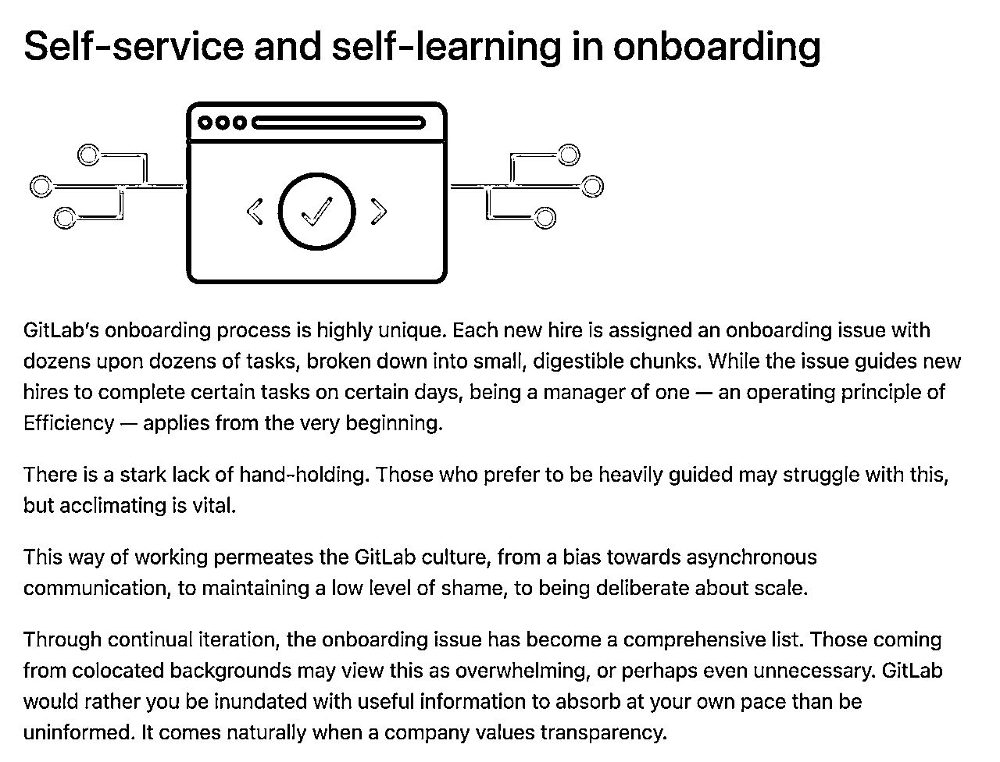

#### 组织侧入职

传统线下公司通常会举办新人入职培训会，但GitLab则通过其官网上详细的员工手册，帮助新人快速了解公司组织和文化，从而更快地融入新环境。

#### 技术侧入职

GitLab将入职培训分解成一项项任务，让新人通过使用自家产品GitLab来闯关打怪兽 (行话美其名曰“吃狗粮”(dogfooding))。每位新人需要在规定时间内完成相应任务，才能最终完成入职。这种做法可谓一箭三雕：一来通过将入职培训游戏化，让整个流程更有趣味；二来新人自己闯关完成，会有油然而生的自豪感和动力感；三是通过使用自家产品完成任务，新人能在短时间内就对产品上手，并可以提出建设性意见，提升产品品质。

#### 社交侧入职

GitLab每位新人入职时，都会有对应的“入职伙伴”给他们提供帮助。一般“入职伙伴”都已经在公司工作三个月以上，他们跟进新人的入职社交任务完成情况，包括和同事来一场线上聊天，在Slack的 #new_team_members 频道介绍自己等。要是新人有问题，可以给新人发一些员工手册中有用的文章，或者帮他们联系相关专家。每一个季度，GitLab都会在担任小伙伴的成员中抽取三名幸运儿，送出价值不等的公司周边产品兑换券。高层还会举办非正式沟通会议，帮助新人了解身处异地的同事。

通过这种全面而细致的远程入职流程，GitLab不仅确保了新员工能够顺利适应远程工作环境，还促进了员工之间的交流和团队协作，从而建立了一个更加健康紧密的工作社群。

### 团队建设

#### 个人使用说明书

借鉴了纽约时报2013年的文章《Want to Know Me? Just Read My User Manual》，GitLab鼓励员工编写个人使用说明书。这些说明书类似于产品手册，介绍个人的工作风格、沟通偏好、优点和短板等。例如，Gitlab公司CEO在其说明书中不仅包含了个人经历和工作职责，还包括了他最喜欢的餐厅，甚至包括了自己的不足之处及应对方式。以下为节选：

1.  我看起来一直很严肃，你可以说“也许你可以多微笑”

1.  我喜欢辩论，因此可以说“请停止辩论，开始合作”或者“我们应该辩证而不是辩论”

1.  我的英语发音、单词选择和语法不太好。我正在上课，但当我们进行1:1的对话和/或可能会让人困惑时，欢迎纠正。

1.  当我匆忙下结论时，可以问“我们能花更多的时间讨论这个问题吗？”

1.  我有时会在报告时，让人感觉我在责备他们，比如为一个明显的错误而生气。可以这时候告诉我：我不介意你提出这一点，但你的语气没有让我感到被尊重。

1.  在我的反馈中，我有时听起来更像是在下达命令，而不是提供建议，即使我指的是后者。如果发生了，请告诉我“这听起来像是命令，我会更欣赏建议的形式。”

1.  我有时会让人分不清我所说的是三个表现水平中的哪一个，因此可以问我“这是一种承诺、一种愿望还是一种可能性？”。

1.  我给人的印象是消极的，因为我专注于可以改进的地方。这时你可以问“你对最近的哪些改进感到满意”吗？

想要了解更多中文版本个人使用说明书，欢迎移步飞书文档：个人使用说明书：如何让团队更好地“使用”你 ？

这种方法不仅促进了员工之间的理解，还提高了团队协作的效率。

#### 促进非正式沟通

GitLab还非常重视员工之间的非正式沟通。他们认为，非正式沟通对于构建团队凝聚力和提高工作满意度至关重要。为此，GitLab专门撰写了一篇文章，阐述非正式沟通的重要性，并提出了多种促进这种沟通的方式。比如线上才艺秀、视频分享生活环境、互相邮寄明信片，甚至鼓励同城员工聚会等。这些活动不仅增强了员工之间的联系，也让远程工作环境变得更加人性化和有趣。详细请参考：

### 手册、目标和留档

远程工作也是Gitlab开发公开可见的【手册】的原因，该手册涵盖了需要了解的关于公司的一切。

该手册中详细记录了每个部门和团队的季度目标，以及他们的“目标和关键结果”（OKR）。这种做法增加了整个公司的可见性和透明度。公司每月都会检查这些目标，确保每个团队的成就和进展对所有人都是公开和透明的。

GitLab的留档方法对于新团队成员尤其有益。因为他们加入时所需了解的一切信息都整合在这个地方。这使得新员工的适应过程更加顺畅，同时也保证了信息的一致性和准确性。

通过这本手册，GitLab成功地实现了远程工作环境中的信息共享和透明管理，确保了团队成员无论身在何处都能保持同步和高效协作。

### 内部沟通协作最佳实践指南

1.  谷歌日历的开放性：所有GitLab成员都可以访问谷歌日历。如果确实需要安排会议，可以直接在日历上找到空白时间段，并提前安排线上会议。

1.  文档沟通和异步沟通为主：优先通过文档进行异步沟通，减少线上会议的需求。

1.  全英文书面交流：所有书面交流都使用英语，即使是一对一沟通，以便于需要时转发信息。

1.  尊重个人时间：不要期望在计划外的工作时间回复消息。

1.  提供有效的手册链接：当使用手册链接回答问题时，给出一些上下文，尤其对于新员工。如果手册中没有相关答案，及时提出合并请求，更新手册。

1.  提供详细链接：在提及具体内容（如合并请求、问题、提交、网页、评论等）时，附上相应的链接。

1.  公司数据默认共享：避免使用本地文本文件，而应在问题评论中共享信息。

1.  明确回复和截止日期：给出具体的完成日期或状态更新，而不是模糊的答复。

1.  明确沟通需求：使用CC功能提醒他人，但如果需要具体行动，明确指出并@提及相关人员。

1.  避免创建私人小组：这会导致信息不透明、不可搜索，且不便于添加新成员。历史记录也容易丢失。

通过遵循这些指南，GitLab创建了一个高效、透明且协作紧密的远程工作环境

### 公司内部培训远程办公

#### 针对管理者：

甚至在coursera上面给到了一门线上课，可以学习如何管理远程团队

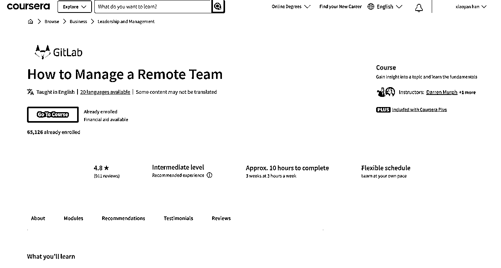

#### 针对员工：

从工作环境的布置到如何找到自己的工作节奏，帮助员工更加适应远程办公的节奏

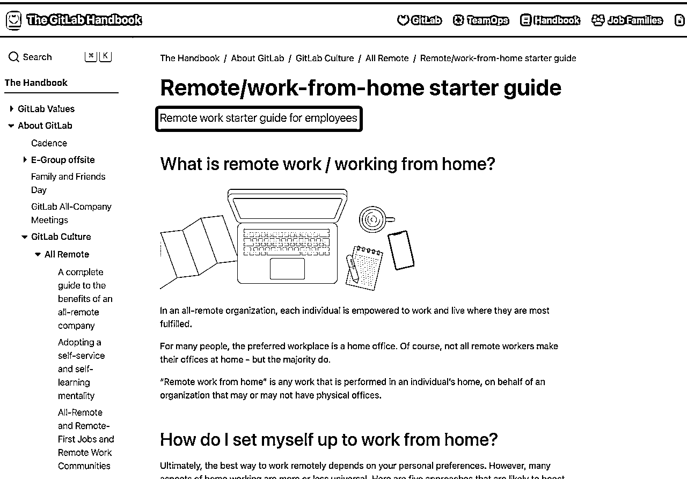

### 员工评价

GitLab作为一家远程工作模式的先行者，在员工和外界的评价中呈现出一些有趣的观点。在Glassdoor这样的职场社区网站上，GitLab获得了相对积极的评价。529条评价的总评分为4.1分，其中74%的人推荐这家公司。这表明GitLab在某种程度上确实提供了一种受欢迎的工作环境和文化。

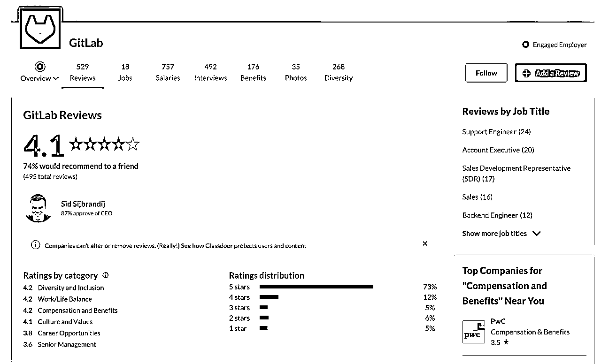

然而，也有一些反馈指出，在GitLab工作可能需要较强的主动性和独立性。由于公司文化的特点，员工可能获得的直接支持较少，这对于职业发展的影响可能是双刃剑。此外，有些评价提到，工作环境可能具有一定的竞争性。我们可以看到在senior management上的评分为3.6。

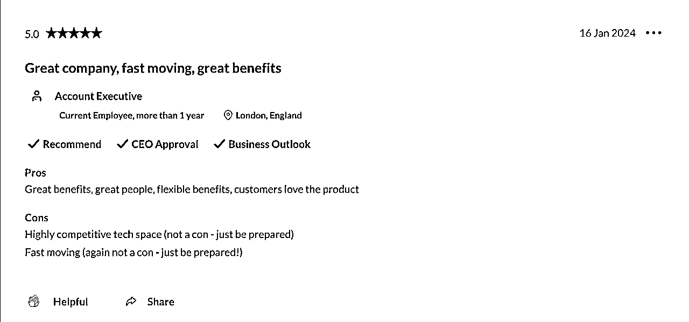

此外，通过领英上的接触，一位在荷兰的GitLab后端工程师对公司的工作模式持正面评价。他特别赞扬了公司文档化的工作方式，虽然最开始十分冗长啰嗦，但最后发现完全值得。这反映了GitLab的文档化，在促进效率方面的潜在优势。

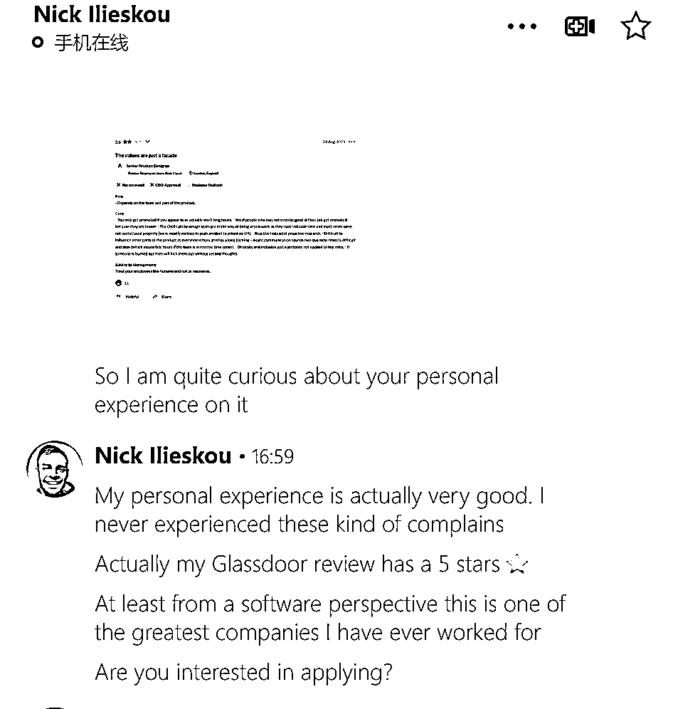

综合来看，GitLab的工作模式虽然在某些方面受到挑战，但总体上看来是成功的。不过，也需要注意到，这种工作方式可能并不适合所有人，尤其是那些更倾向于直接支持和指导的员工。

# 参考信息整理：

handbook.gitlab.com