# 风向标拆解第3期-手艺人垂类知识付费是一个小而美的生意吗？-瑞瑞瑞jio

> 来源：[https://kuslbn5i6p.feishu.cn/docx/SdxvdTS7ZoZcZ4x9W1LcxMjDnWd](https://kuslbn5i6p.feishu.cn/docx/SdxvdTS7ZoZcZ4x9W1LcxMjDnWd)

拆解账号：立夏手创（微钩文创）

## 一、需求

### 1、什么是微钩？

微钩，顾名思义，就是钩编很小的织物。最为精细微小的一种钩针编织工艺品，也是集钩针编织工艺中精华的袖珍艺术品，是钩针编织技法的一个分支。因为微小，所以呈现出来的风格要么极美，要么有趣，要么可爱，要么超萌。可以做装饰也可以做首饰。

下图就是一些精美的微钩作品：

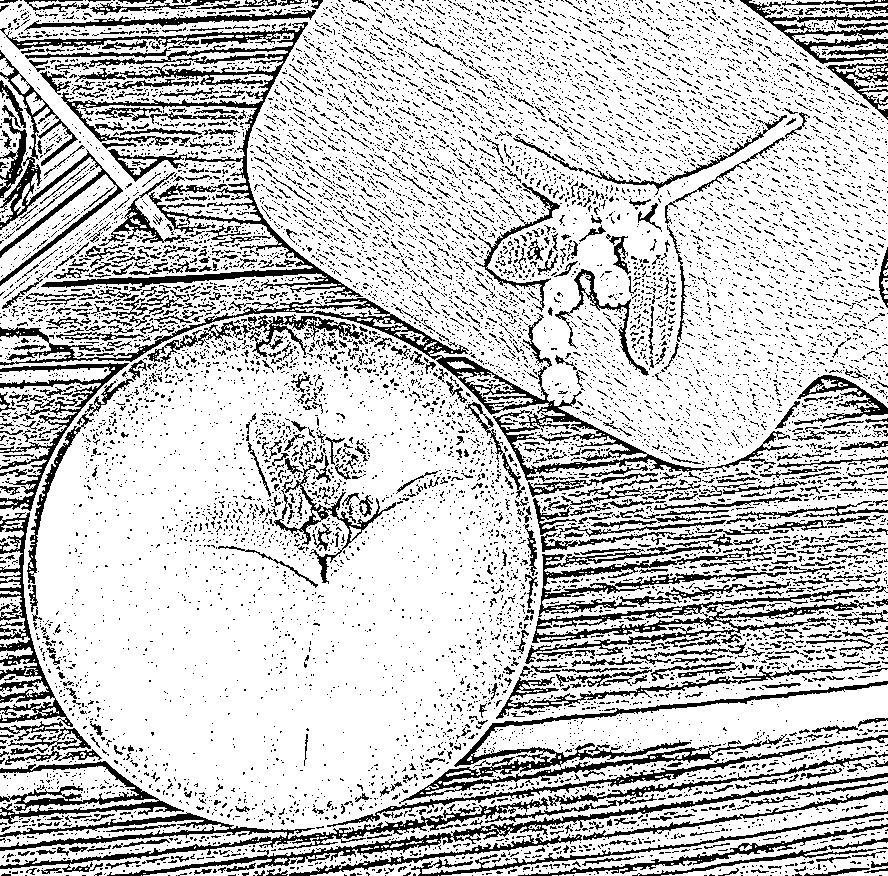

### 2、微钩的需求量及需求人群

如下图，检索微钩的关键词，整个平台的笔记数量才13万+，可以说是一个真正的小众赛道。纵览下拉关键词，基本上需求可以划分为两大类：1）微钩教程；2）购买微钩产品，且前者占据差不多80%比例。所以这个赛道大部分用户都是想要学习如何微钩的用户。

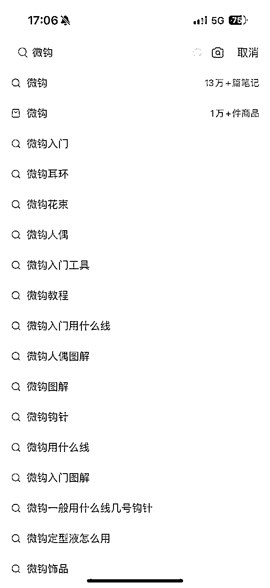

粉丝占比93%都是女性，所以选择小红书作为业务拓展平台是非常合适的。值得一提的是，小于18岁的占比接近一半，微钩可以说是深受现在年轻人喜爱的一种手作形式。

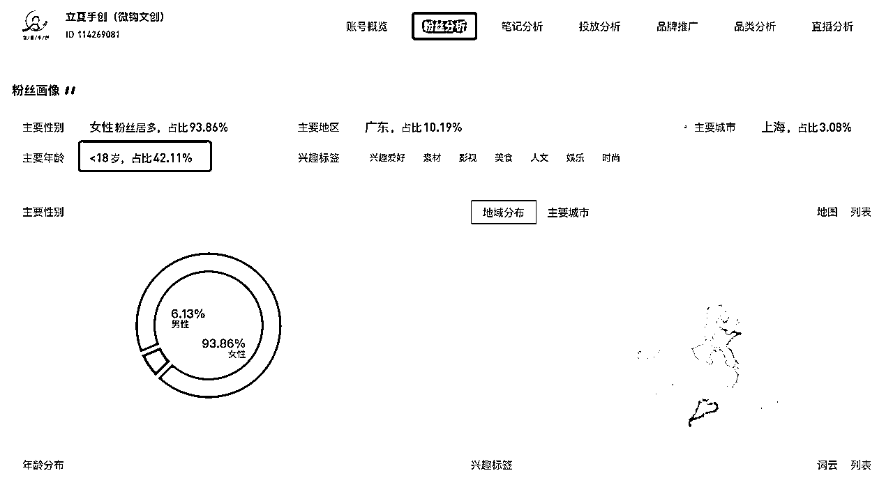

## 二、流量

1）内容类型：图文为主，发文频率差不多一周两篇

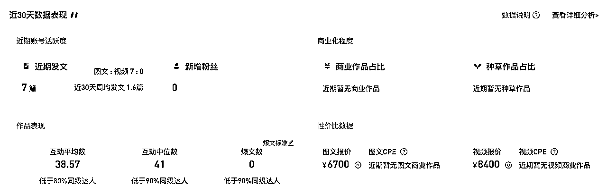

2）主要内容：

A. 微钩美图作品分享

B. 挂车卖产品

C. 微钩线下活动:沙龙/集市

D. 品宣：采访/非遗活动

3)流量类型：这个没办法通过第三方数据平台看到，感觉应该还是主要通过自然流来做

## 三、产品

1）账号的首页简介基本上涵盖了他们的业务内容，如图所示：

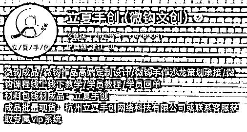

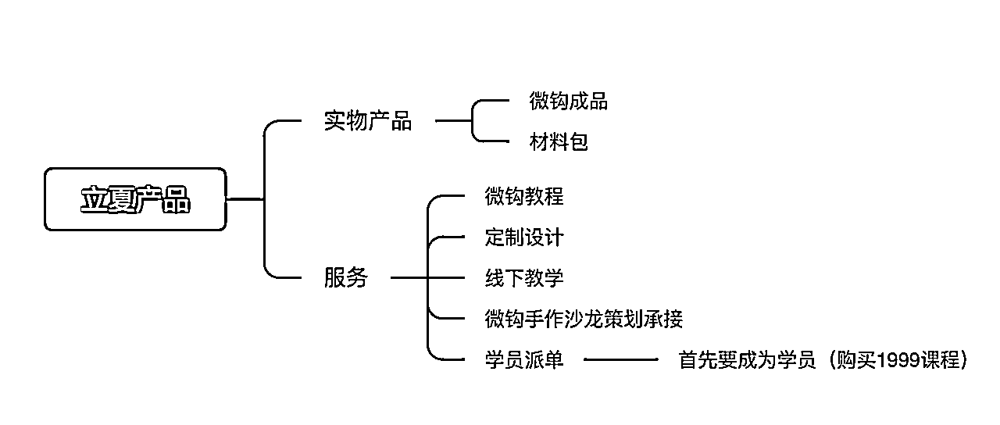

2）重点分析一下销售额占比90%的微钩教程，1999的客单何以还能卖出这么多销售额？

课程的价值点做了一下提炼：

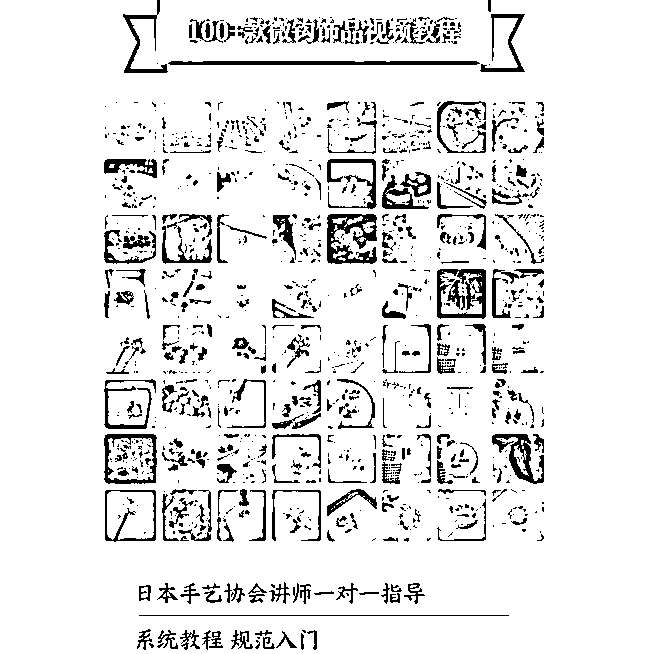

A. 稀缺：用关键词搜索了一下多多，根本没有相关的视频教程提示词出现在下拉框，直接检索微钩视频教程出来的结果也是毫不相干的内容。

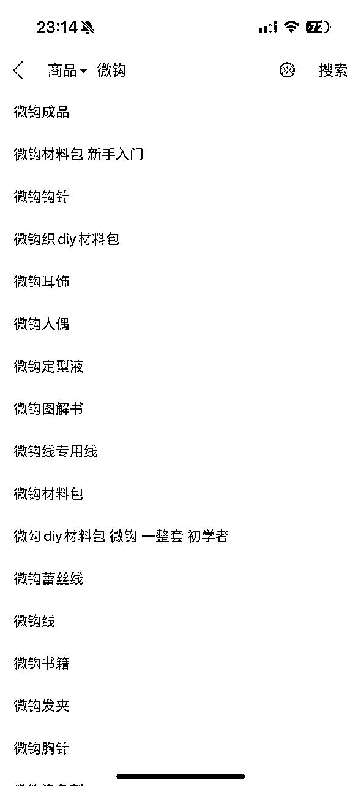

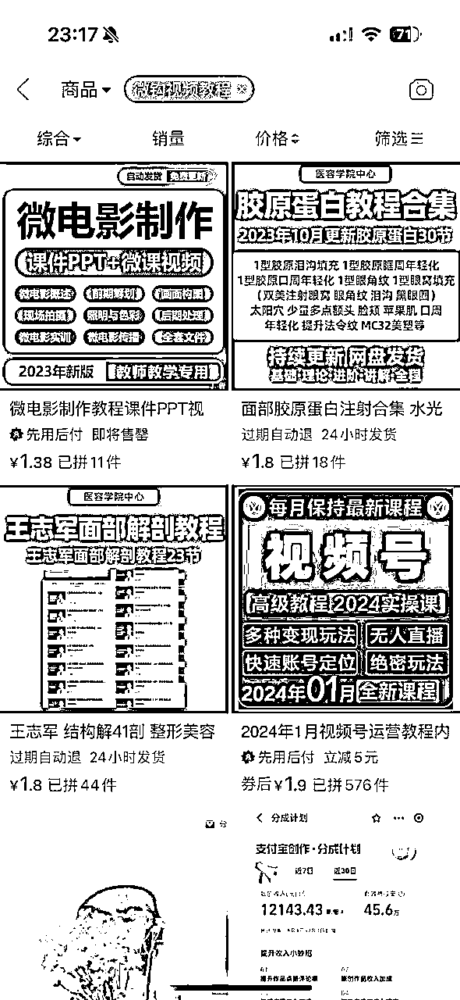

B. 给人多跟全的感觉：100款微钩视频教程

C. 权威背书：日本手艺协会

D. 价值提升：一对一指导

## 四、变现

### 1）小红书销售额

大概统计了一下光小红书平台的销售额情况，立夏的账号大概是在21年就开始做了，而店铺大概是22年8、9月份开的，销售产品为以下三类：a. 微钩成品 b. 微钩线/材料包 c. 微钩教程

#### 微钩成品销售额：504122.9元

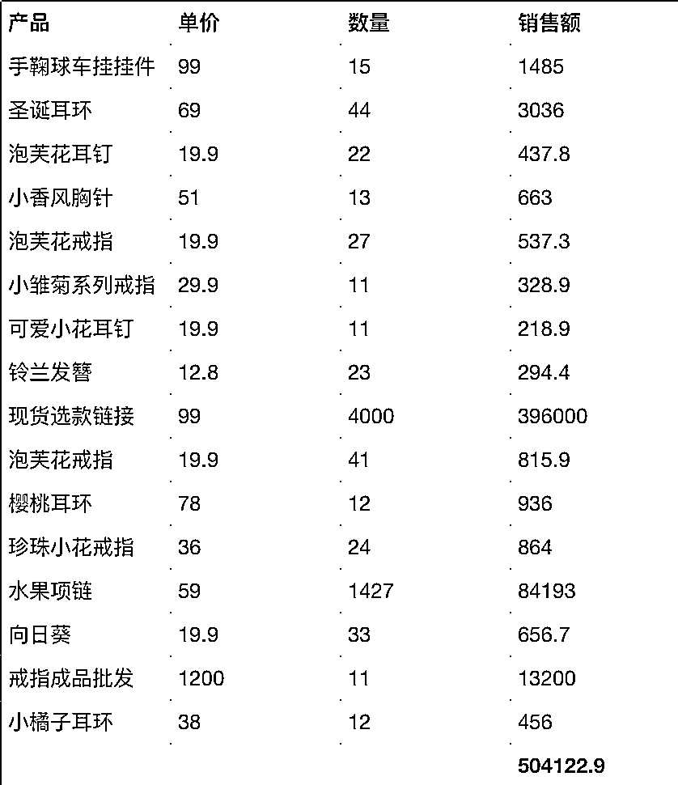

#### 微钩线/材料包销售额：2140375元

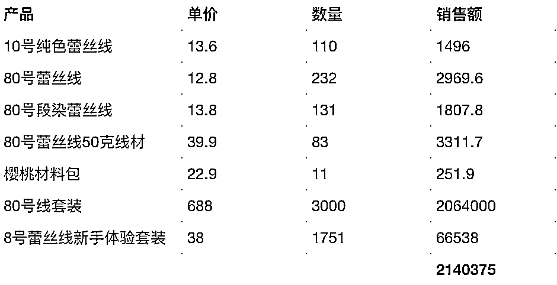

#### 微钩教程销售额：19724133元

总结，小红书销售额从22年8月开始至今，差不多一年半的时间总计2200万+，90%销售额来自教程。除了小红书，还有淘宝、私域等渠道，销售额更高了，的确是一个小而美且香的赛道。

### 2）项目利润如何

各平台开设都会有一些认证费用或押金，几百上千不等，对于项目上千万的收入量级来说不值一提，这边核算就先把这部分暂时省略。

A. 实物产品

搜索了微钩蕾丝线在1688和拼多多的价格，以立夏10号20g蕾丝线-13.6元，差不多同等规格1688价格在6.5元，预估差价利润率在50%左右，预估小红书利润在100w+/年。

B. 微钩课程

除了课程本身还会搭配工作人员一对一的服务，会有额外的人力成本投入，但除此之外可能就没有太多其他成本，就按照利润率70%，小红书利润在1000w+/年。

立夏光小红书单一平台创造利润都在千万级别，算上淘宝/私域/线下门店等等其他渠道，作为一个小众赛道，一年利润也算是非常可观。

## 五、项目如何做&如何放大？

### 1） 开通小红书店铺

小红书店铺性质共有三类，大家根据自己实际情况按需选择即可。

A. 个人店

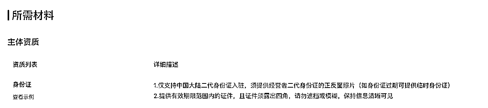

B. 个体工商户

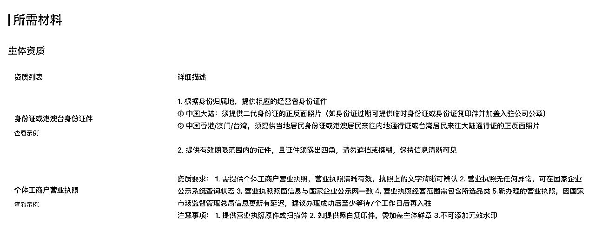

C. 企业/公司

店铺类型：普通企业店/旗舰店/专卖店/集合店（仅邀约）/卖场型旗舰店（仅邀约）。且不同的贸易类型、商品类型均有不同的要求，具体可直接查看入驻网站信息。

### 2）发布笔记

内容类型：美图作品（80%，引流权重笔记）+变现产品笔记（10%，直接变现笔记）+品宣（10%，提升品牌价值）

笔记类型：图文为主（80%），视频为辅（20%）

发布频率：周更2篇左右

### 3）售卖产品

实物产品：

A.成品售卖

B.材料包售卖

⚠️要持续深耕供应链，找到更优质也有价格优势的合作厂家

服务：

A. 课程

B. 线下活动（工作坊/沙龙/文创集市）

C. 定制设计

D. 学员派单（有能力赋能学员开展副业接单，可以为课程售卖提供助力）

### 4）如何放大？

A. 多领域合作引流

手工艺本身就可以跟很多其他的兴趣领域做联动合作。

如：生活美学/棉花娃娃/汉服etc.

B. 多号

开设更多账号

C. 多平台

玩法复制到其他平台，抖音/视频号etc.

## 六、项目结论

如果本身就对某一种手工艺特别热爱和擅长，完全可以尝试去把它变成一个既可以满足你的热爱，同时还能赚钱的事业！何乐而不为呢？类似的手工小众赛道也可以尝试立夏这套方式来操作，但是立夏创始人出身大厂，本身有不俗的运营能力，而且还有开设线下门店，也是有一定的资金原始积累的，不算是什么资源都没有的小白，所以对于我们真的小白来说，我们尝试的时候还是要一步一步走稳，小范围测试跑通MVP之后，再考虑放大。