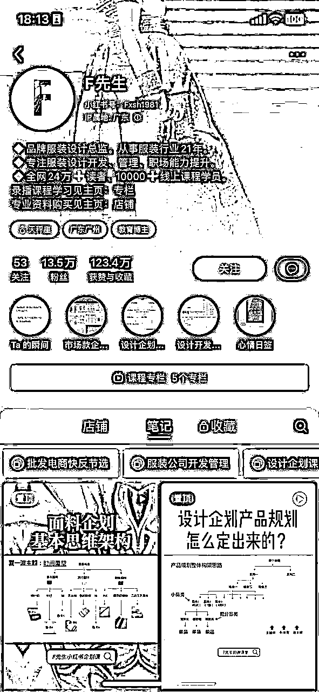

# 风向标拆解第 3 期--靠Notion模板年收入100万美元，通过资料整理变现的路径如何--Susumr

> 来源：[https://e7m0rt4uzw.feishu.cn/docx/TBaJdDfZfoNDNlx7v6rcVMZynmb](https://e7m0rt4uzw.feishu.cn/docx/TBaJdDfZfoNDNlx7v6rcVMZynmb)

生财的朋友大家好，我是Susumr（vx:xxjz305），今天给大家拆解通过Notion模版变现百万美金的案例，如何进一步通过整理资料在国内各平台进行变现，我将从案例剖析、【产品】如何挖掘需求、【流量】如何推广、【利润】定价策略和技巧、以及【如何做】实操路径、【放大】如何做大做强这些步骤带你了解资料变现的路径。

## 1、Notion变现背景及案例：

### ① Notion背景

Notion介绍说明：

Notion是一个多功能的工作空间，它整合了记笔记、任务管理、项目协作和知识共享等功能，旨在为用户提供一个统一的平台来处理各种工作和个人任务。

目标用户群体：

个人用户：Notion吸引了那些寻求简化个人任务管理、笔记记录和信息整理的用户。

中小型企业：为团队和中小型企业（SMB）提供了灵活且成本效益高的协作和生产力工具。

大型企业：为大型组织提供了可扩展的解决方案，以实现高效的知识管理和团队协作。

调研数据概览：

用户基数：Notion拥有3000万至4000万注册用户，其中400万至500万为付费用户。

网站流量：Notion官网每月的页面浏览量（PV）达到1.5亿。

国际覆盖：用户遍布50至60个国家。

财务预测：预计Notion在2022年的营收将达到4000万至5000万美元。

内容生态市场：Notion的内容生态市场规模预计在5亿至10亿人民币之间。

创作者收入：顶级Notion创作者年收入可达1000万至1500万人民币。

创作者构成：80%的国际创作者专注于发布模板和教程，而20%提供咨询服务。

生态工具表现：目前表现最好的Notion生态工具年营收在20万至30万美元，整个开发生态规模达到数百万美元级别。

中国市场情况：

尽管中国Notion用户数量目前相对较少，但随着用户自发的推广，用户基数正在不断增长。

### ② Notion模板变现的案例

#### 案例1 卖两套模板收入210万美元的案例分享

这哥们叫托马斯·弗兰克，教人们如何使用Notion，并销售Notion的模板。在YouTube上开设了一个频道，拥有296万订阅者。在大约两年的时间里，这两个模板创造了210万美元的销售额。目前，模板销售额平均每月约为12万美元，其他收入来源每月约1.5万美元(联盟营销和YouTube AdSense)。

https://www.notion.so/@thomas ，这个是他的模板页面，大部分是免费的引流品，两款主打的付费品，每月10多美元。

#### 案例2 卖模板卖教程去年赚到第一个100万美金

https://twitter.com/heyeaslo，这哥们各个平台都有账号，X粉丝数有31万，TikTok粉丝数：40万，

Instagram粉丝数：40万，而且有自己的网站，每月37w的pv流量。网站上一共提供66套Notion模板，2门课程，历史销售额最高的模板销量接近5000份（这套模板已经卖了2、3年了，平均单价为80美元）。2022年营收: 20+万美元。这哥们年纪轻轻，接触notion比较早，一直坚持在各个社交媒体更新，才更就2023年最快的增长赚到100万美金。

## 2、Notion模板案例剖析及总结：

Notion模板本质上就是资料，就是一个虚拟资料的售卖。

如果我们现在参与到Notion的生态中可以赚到钱吗？

答案是可以的，Notion在持续增长，用户基数大，不过这个需要你持续投入去了解notion模板的制作，各平台的持续的输出高质量内容，既然是海外用户主流那就要出海做。

不做Notion模板，以此为基点，普通人是否还有其他形式进行赚钱？

下面我进行我从产品、需求、流量、利润、放大进行简单的拆解，希望对你有帮助。

什么叫产品？

万物皆产品，只要能满足需求。

一套话术，一段文案，一个眼神，一个电话，一篇文章，一个课程，一个商品，一个咨询，一个关心，一套方法论，一本书，一次交谈，一个回答，一个社群，一本日历，一套方案等等。

以上皆是产品，只要能解决对方的问题。

从这个角度，我们说创业要有自己的产品，是不是感觉创业容易多了？

来自亦仁：https://wx.zsxq.com/dweb2/index/topic_detail/818221142114152

## 3、【产品】如何挖掘需求

需求来自哪？来自你身边，

比如你是打工人，经常需要汇报、演示、方案等做PPT，这就是需求。

比如你是运营或编辑，经常需要写个策划、作图，这就是需求。

又或者你就是实体店的老板，想要学习门店运营提高销量，这就是需求。

就像使用Notion模板的的人，想要通过别人的模板高效的记录自己的数据信息，所以就会有人提供这样的模板。像前段时间很火的“布局2024”，你看小红书notion模板。

以及，就像下图是服装行业从业者，日常要做的设计、策划案、职场经验等积累，（但其实这个人卖资料只是钩子，他主要是还是卖课和卖社群）

比如你是做设计师的，

## 4、【流量】如何推广和推广技巧

### ① 利用各个平台创建IP（建立信任）推广

以上面这个服装行业资料整理为例，他就在小红书、公众号、视频号，抖音、某宝、pdd等其他平台我就不截图了，你可以去找找。

上面就是节奏一鱼多吃，全平台分发内容。

### ② 上架资料平台

*   如果你做notion模板，就上架notion模板广场，依靠官方的流量。

https://www.notion.so/@thomas ，这个是他的模板页面，大部分是免费的引流品，两款主打的付费品，每月10多美元。

如果你思维导图做的好，可以去类似这样的平台进行上架分享。

### ③ 做独立网站

像Notion那个案例，上面的百万收入的就不展示了，下面这个是国区有人做的，域名也是截流的一种方式，月均5W~9W区间。网站这个东西依靠SEO，这个流量是持续的。

## 5、【利润】定价策略与销售技巧

1、成本在于你制作这套资料的时间和精力，如果按照单件一般都是低价，尽量使用打包成套的卖，虚拟资料的利润在于可以无限的变卖，你卖的越多，成本越接近0.

2、比如你依靠搬运，从某宝或pdd购买资源，然后用小红薯、或网站卖打包（会员）资源。按照下图的计算利润。

算上域名、服务器、网站搭建等成本在1000元以内是可以实现的。

如果是个人，你在公众号或小红书上打包售卖，每月卖上500份29.9打包价，每月289*500=1.495W

如果是团队，搭建网站，每月卖上500份会员，每年289*500=14.45W

## 6、【如何做】实操路径

以下按照在公众号运营的形式，其他平台类似。

1.  内容制作、收集、发布：

*   有相关经验，制作高质量的资料合集。确保图片清晰、信息准确，内容吸引人且具有一定的创新性。

*   或在某宝、pdd等平台购买资料合集，把资料里面的所有钩子去掉留成你的钩子。

*   每天在公众号至少发布5条图文，保持频率和质量，以增加内容爆红的概率。

*   图文内容可以从对标账号获取灵感，模仿他们的成功之处并加以改进。

1.  使用资料进行引流或直播：

*   当图文内容获得较好的反响后，及时开展直播环节，利用内容爆红带来的高流量进行转化。

*   直播过程中无需露脸，只展示产品和手部操作，减少对主播能力和场地的依赖。

*   直播内容应与图文内容紧密相关，确保主题一致性，增强用户的购买兴趣。

1.  建立私域流量池：

*   利用公众号的图文和直播吸引用户关注，并引导他们加入微信群或订阅号，建立私域流量池。

*   在私域流量中，可以通过发送每天更新（可以发免费资料）、特惠信息、互动活动等方式维护与粉丝的互动，增强粉丝粘性。

1.  商品推广与销售：

*   公众号、社群、朋友圈除了频繁地发内容外，每周固定时间设置促销优惠，设置低价或5折、限时倒计时。

*   通过直播和私域渠道，向粉丝介绍和推广产品，使用各种销售技巧（如限时折扣、捆绑销售等）来刺激购买。

## 7、【放大】如何做大做强

1、多账号操作：一个人开3～5个公众号，以量取胜，每天20条以上内容，可以通过AI生成内容完成。获取的流量的能力就会放大几倍，这样成交就能多一些。

2、多平台操作：将同样的模式复制到小红书、百家号、头条号等平台（任何有流量的地方），实现一鱼多吃，有能力的可以用RPA的方式实现。

3、多资料形式：全流程跑通后，就可以挖掘需求，选其他素材进行同样模式的复制。

## 8、【总结】项目结论

从上面的分析来看，垂类资料整合+多账号运营。月利润区间为，个人1w起步，团队14w起步，利润可观。

资料整理可玩性和可延展性非常强，转化为私域之后，后期还可以再推出其他相关的资料再次复购。