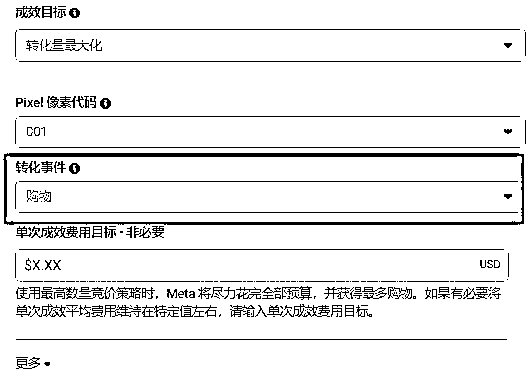

# 跨境COD还能做吗？来看这里：分享一个半价投流的跨境COD玩法,科普＋实操

> 来源：[https://vvxlpvbvbp3.feishu.cn/docx/TE32dlXyUosRXIxE37wc1o6mnR4](https://vvxlpvbvbp3.feishu.cn/docx/TE32dlXyUosRXIxE37wc1o6mnR4)

大家好,我是Albert,

连续创业者,爱折腾,搞钱才是王道。

## 今天这篇文章主要以：

中东COD+拆解+实操的方式来帮助对跨境COD感兴趣的圈友怎么样花最少的钱通过FB投流来跑通COD这个项目,并实现利润最大化。

## 核心关键词：FB余额户

简单一点讲就是带广告余额的FB账户（个人账户）

作为一名深耕跨境行业的老韭菜,总归是会知道一些FB的谜之玩法简称：科技与狠活儿

账户由来在这里不过多阐述,市场讲供求,这里将余额户作为核心关键词,最大的优势是广告费4折

比如广告账户内有300美刀,实际购买成本为：120美刀 按照最新汇率 换算成毛爷爷：855左右

所以当我们用4折的广告费去投流,ROI其实已经不重要了,以中东为例出单即回本,下文会讲到

申明：不卖账号,不卖账号,不卖账号。

## 辅助工具：单页COD系统+科学上网

某宝搜关键词+服务器+部署+域名=500毛爷爷以内搞定,当然单页系统内的模板数量决定了价格

作为小白的话选择单一地区的模板就完全够用,生财内搜COD,可以看到相关圈友有单页系统业务。

科学上网这个就不讲啦。

申明：不卖系统,不卖系统,不卖系统

## 实操：广告投放流程+懒人选品策略（图文）

所有准备工作OK以后,接下来就是实操,以中东-科威特为例.

首先打开FB广告后台：

成功进入广告后台后,先点击账单与支付先查看余额有没有在账户中,以图中的账户为例300刀已经充值成功.

系列名称,广告组名称,广告名称,随意,A/B测试我们也暂时用不到,主要检查广告目标是否正确

下面是广告组设置：大部分操作都在这里了

创建 Pixel 像素代码

用来追踪我们的广告到我们网站的转化数据

像素代码复制到单页系统中,一般单页系统后台都有这个功能,转化事件选择购物

广告预算：我这里设置的20刀,东南亚地区可以选择10刀,不用过多纠结,全部20刀也没问题。

选品决定了：年龄段,正常通选25-65即可,性别,以及细分定位,我投的是洗发水,所以细分定位如图

分享一个简单有效的懒人选品策略：

我们想要投放哪个地区就选择哪个国家,做货到付款主要以中东和东南亚为主,关键词输入：cash on delivery,也可以选择一些别的词,如 免费送货 翻译成英文输入其中 并回车

当我们到达这一步的时候,会发现很多在投放的产品广告,但不是所有的产品都适合我们

比如FP类,比如JF类,大型工具类,JR类

因为我们是做的货到付款,产品的体积和重量越小,运费也就越便宜,可以参考的产品有,生活类,教育类,小件电子产品,衣帽鞋子类.这里放一张运费参考图,货代之间相差不大。

如果还是不知道投什么类型的产品,也不想把时间过多的浪费在选品上,那么在教大家一个更直白的方法

以这款染发剂为例,首先商品大小重量符合我们的选品要求

这款产品目前有13条广告在跑,数量越多说明别人这个产品是在出单的,所以会追加投放数量

投放时间,如果是当天的加上投放数量都很OK的话,理论上我们跟着投这个产品,也能出单,根据这个思路我们可以选择想要投放的产品,因为我们的广告费是4折,所以唯一要考虑的就是签收率

这个选品思路的好处是大概率能出单,坏处是,不能持续出单,这是经过长期投放得出来的结论,如果想要当一个长期副业,选品还是要做优化的。

现在产品也有了,那么接下来就是根据上面的选品策略复制别人的文案,然后分别将产品详细页面copy到我们的单页系统中,如下图 后端+前端

单页系统内的商品信息完成以后,继续回到FB广告设置页面,将别人的文案,广告素材copy进去,长期的测试得出来的结果就是,COD的素材视频素材要比图片素材更容易出单

基本上整个流程就演示完了,可以多个产品,多个广告组不同的受众来进行测试,然后就是等待出单啦

上面的数据一共花了60刀出了2单,我的商品出售价格是29KWD 2单一共卖了58KWD约等于189美元,换算成RMB约等于1350毛爷爷,当时选这个产品的时候2单都被签收了,认真看完的同学可以仔细再去算算帐,广告费4折的情况下

如果是正常的广告花费,这种数据要亏哭

## 写在最后：需要注意的点,细节决定成败

由于时间有限,关于出单后如何采购和对接物流,如果圈友们有需要可以单独在开一篇文章具体阐述,采购就不用过多去说,主打的就是贸易逆差,正常签收后,回款一般是15天左右,主要讲下广告余额户在使用中的一些细节

首先,不得不说,有折扣的广告费确实是很香,但是也有限制,就是每天限制50刀,其次是在上传广告的时候,尽量是全部一起提交,而不是一组广告通过了,又重新提交新的广告组,避免重复审核,导致挂户

另外,相比于我们经常使用的企业账户来说,个人账户还是比较脆弱的,这种余额账户最好是在一周内将广告费花完,尽量保持科学上网的节点稳定。

个人是不太建议使用这种账户来长期投放的,尤其是你想扩大你的单量的时候,当个副业偶尔赚点零花钱,或对于想从事跨境电商的小白来说,这套玩法相对比较友好,可以作为一次尝试,但是不要沉迷其中,中东地区COD之前就一直在做,所以各种资源相对来说都比较成熟和完善,感兴趣的同学也可以测试测试东南亚地区,流量费用相对会低一些。

最后祝生财的所有圈友,以及认真看完这篇文章的同学们,2024年都能达成所愿 跟随着生财一起扬帆起航。

有问题的同学可以站内滴滴我,不占用太多时间的情况下,会逐一回复解答。感谢阅读🤞