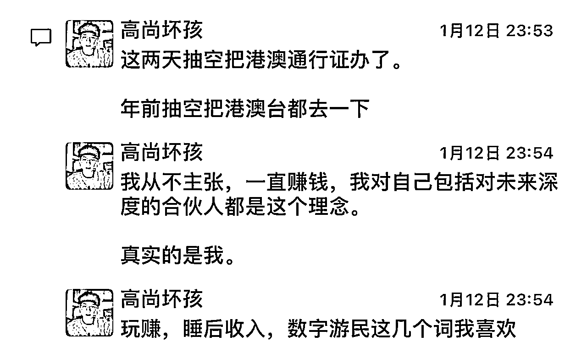
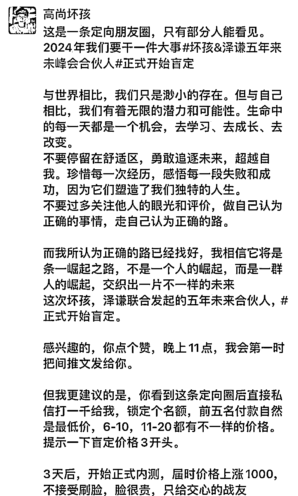

# 盲订四天，150人查看，转化54人付款，一场变现22万的合伙人产品发售，我的深度复盘

> 来源：[https://zwbfnc29pf1.feishu.cn/docx/Tbp1d82WBoRbBaxSdBNc2RlUnzd](https://zwbfnc29pf1.feishu.cn/docx/Tbp1d82WBoRbBaxSdBNc2RlUnzd)

圈友们大家好，我是高尚坏孩，目前是大三在读，在19岁的时候赚到了第一桶金百万，20岁的时候自驾游基本走遍全中国，目前在做品牌的运营以及私域虚拟类目产品。

这场发售全程只用了定向朋友圈，并且给点赞的朋友发上了事先准备好的盲定期介绍，最后就坐等收钱啦！

看似比较简单，但是我们在筹备环节，以及给点赞朋友发的文案上下了很多功夫，下面给大家复盘下这场发售的全套流程。

# 发售筹备期

## 1月10日直播暗示-破圈很重要

盲定期是1月13日到1月16日，我们在1月10日的时候开了一场直播，简单聊了聊最近的动作，没有提到合伙人产品。

但是给观众解答了不少问题，并且重复强调了圈子的重要性，在这里让大家明白，加入一款这样的圈子产品对自己的重要性，你无法赚到自己认知以外的钱，你的未来是由你身边的五个人组成的。

## 1月11日思维导图暗示-与你有关

首先我先用一个正在制作中的图片告诉大家，我们做的这个模式很牛逼。

引发大家好奇心

然后下一条朋友圈就是告诉大家这张思维导图已经做完了，并且下一句是“我的高端客户们你们有福了”，这里就是暗示这款产品的售价不会太低，不是简单的项目，也不是简单的课程，继续吊大家胃口。

评论区还加上一句：”我愿称之为，互联网一图通”，这样一句话下来，让本来认为与小白们无关的小白们有了与我相关的感觉。

诶，我是小白，这个可能会对我有用诶，一图通。正好我现在做互联网也特别迷茫。

## 1月11日学员变现暗示-秀肌肉

暗示学员，我们学员的成绩都还不错，并且我们流量也很好。

## 1月12日伤感图文暗示-要有上进心

夜晚的路边车水马龙，烘托环境和心情，emo文案最击穿用户心智。

评论区暗示坏孩的美好生活，并且假装穿帮一样，把产品是“合伙人”告诉大家。让大家心里有个预期。

## 1月13日暗示创始人-不断终身学习

用一个故事，凌晨4点被猫叫声吵醒，然后就起来看书学习，并且还会学以致用把学到的内容充实到我的产品中间，暗示这款产品我们是精益求精，会带着你不断的学习以及进步。

## 1月13日进一步暗示自己和别人不一样

一个有特点的创始人，产品一定也会有特色。

## 1月13日最后暗示一次自己的实力

随口给别人解答一个问题就收费2999，并且能让别人赚到月入十万

## 1月13日明示产品到底是什么

盲订前最后一条朋友圈明示产品到底是什么，并且为下一条朋友圈发布做准备。

# 盲定正式开始

## 第1天晚上

### 第一条朋友圈

首先声明这是一条定向朋友圈，但是实际上呢，是所有人可见，这算一个小技巧吧，给人感觉与我有关。

在结尾的时候烘托一下紧张的氛围，让大家打1000定金锁定最优惠的价格，让大家觉得一旦晚了一点，可能当前最低的价格就没有了。

并且说明一句话，让一些关系比较近的人明白，平时嘻嘻哈哈可以，但是现在真正推出产品后，你还想靠着以前闲聊来取得的关系继续和我深度链接是不可能的了。

并且强调无法刷脸，避免了一些很有付款意愿，但是想要优秀的朋友来谈优惠的事，私信拒绝会更加伤害人，所以在朋友圈先说出来。

### 第二条朋友圈

1个小时后发第二条朋友圈，几个目的。

1.暗示大家能看到上一条朋友圈的人是优质客户，引起你的好奇去看上一条朋友圈

2.朋友圈终究触达率不高，很多人看不到，隔一个小时去发第二条，让更多的人看到

3.让能看到上一条朋友圈的点赞，然后私信发他推文，让一部分本来不打算买的人，但是点了赞后看到了推文，而前来付款，要知道，我们一边要打高级的玩法，表明只让感兴趣的人看到，但是我们肯定是希望更多人看到，所以这个地方，就用了个小错位技巧让更多人点赞了这条朋友圈。

## 第二天

### 告知后续会涨价

告诉了大家我们产品价格低的原因，并且告诉大家我们产品后续肯定是会一直涨价到最高价，目前价格低的原因是想要持续的打出案例来。

再通过这句：“后续对外说手上100合伙人，均变现过万，50%的人月入五万，哦买噶。”暗示大家，我们对这款产品的交付很有信心。

### 告知产品理念

“炫耀”用户喜欢的生活，也就是边玩边赚钱，既能朝九晚五，又能浪迹天涯。

并且用不那么张扬的方式--“破个误区”，减少这条文案的营销属性。

### 告知用户我们手把手交付

展示两位联合创始人们正在打磨这款产品，并且图二的截图，也让大家看到了，交付是非常认真非常细节的。表明我们产品的一个核心卖点，就是两位创始人手把手交付。

### 直播聊天，增进信任

先是朋友圈让大家预约，然后8点正式开播的时候，强调一个重点，就是目前盲定期你是盲目信任我，那我肯定要好好的交付你给你一个最好的交代。

并且不断强调我们认为2天后正式开始4999内测直播的时候，才是我们觉得值得我们认真给大家讲解权益的价格。

接下来两天都有直播，但是都在不断强调一个观点，盲定期是盲目信任我们，接下里内测的时候是看了权益后相信我们的，我们虽说交付一样，但是在心里会更加觉得你信任我们。

这场直播，一晚上又来了6位付款。

## 第三天

### 告知今年内价格翻倍

第三天没有发很多朋友圈，就是预约和正式直播，但是告诉大家这款产品现在进肯定是最低的价格，且后天要涨价一千，并且告知今年内价格就会翻倍。

### 晒学员好评

晚上快接近零点的时候，就晒了一下一些学员的好评，让大家明白，来了后可以解决你很多问题。

## 第四天

### 告知产品价值在不断提高

这个点也是我们不断在强调的点，因为合伙人这种产品的基本盘其实是圈子，那我们就在不断的强调，我们也在不断的提高我们圈子的实力，到处付费更优秀的圈子，你付这一份价格，可以学到很多很多圈子的精华。

### 长文感情牌

私域朋友圈营销，多发长文。

### 直播告知明天涨价

下午让大家预约直播，晚上直播的时候告诉大家明天就要涨价了。

### 涨价半小时倒计时

至此，这样一场全靠朋友圈触达用户的发售正式结束，最后3天半的时间，成交54单，gmv22万。

## 最后说一下

坏孩认为，私域成交高客单价产品，重点一定是信任，如果你是几百块钱这种客单价，那你不策划一场发售的话也没有太大关系，但是高客单价，打的点一定是信任。

唤起的要是马斯洛需求体系的，高一级的需求，你用生存来打客户的心智，那客户就用生存的价值来衡量你的产品，你用自我实现的需求来打用户心智，那么客户自然用自我实现的价值来衡量你的产品。

所以坏孩认为你学发售，可以学体系，学模式，但是真正的文案，配图等细节，还是要揣着人性来看。一点粗浅的看法，欢迎交流，欢迎一起学习进步。