# 小红书聚光投放，出境游月营收770万投放复盘

> 来源：[https://p03a4vs9s2.feishu.cn/docx/UK6tdWOwcoTJHAxqnoVcN03LnAh](https://p03a4vs9s2.feishu.cn/docx/UK6tdWOwcoTJHAxqnoVcN03LnAh)

哈喽，我是叁斤，深耕小红书赛道4年，负责多家中小型企业的小红书投放， 在别人都在小红书薅免费流量的时候，为了不跟平台博弈，我开始接触聚光投放

现在出境游赛道很火，我有一个操盘的账号做出境游，每个月都有2500+的私信开口，到微信有 1700+左右，营收770W左右（出境游客单价比较高）

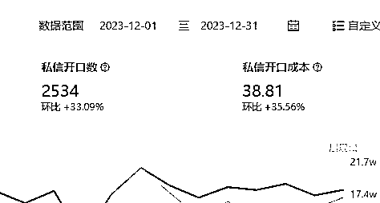

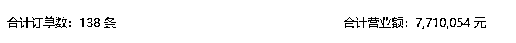

这篇文章就以境外游为例，分3个部分，给大家详细讲解下「聚光投放」思路，实现 0 封号高效引流获客，客资收集行业都通用

# 目录：

1.  运营骨架：高转化矩阵运营

1.  投放策略：笔记赛跑

1.  BKSF 组合营销

# 运营骨架：高转化矩阵运营

基本的运营思路，是小红书矩阵账号 + 投流，矩阵账号补充自然流量，投流保证引流顺畅和精准获客

## 矩阵搭建

### 1.1.1\. 品牌矩阵

同一品牌可以搭建多个矩阵账号，按产品、地域和功能做区分，每个账号精准的定位不同人群

举个例子：

*   同一境外游旅行社会做多个目的地产品，每个目的地可以搭建一个账号，专注给一个产品引流

每个账号专注发自己领域的内容，20%发干货获取自然流量，80%发产品和营销内容用于投流

如果不打算全部账号投流的话，可以将矩阵账号的用户都往投流的账号上导，实现最低成本0风险引流

举个例子：

A账号做品牌主账号，正常投放聚光

B、C、D…账号做不同目的地产品，不投流，有任何咨询都让用户到A账号去私信

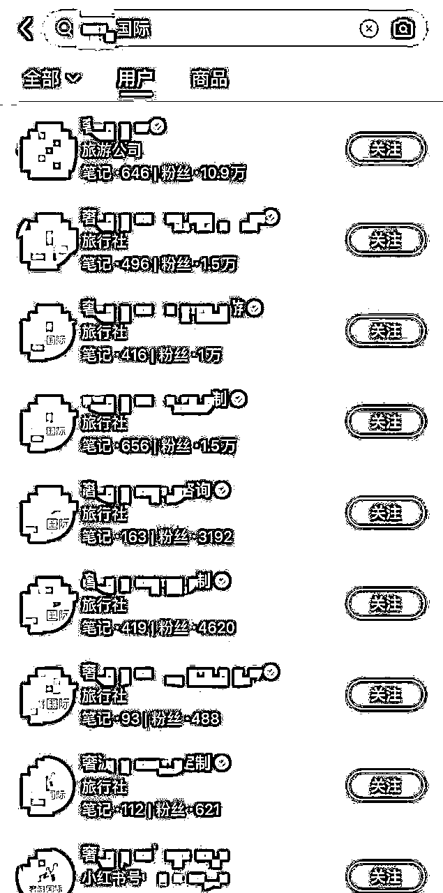

注册企业号小贴士：

正常情况下，一个营业执照只能认证2个企业号。但只要满足条件，就可以突破限制。

因企业运营需要，想特殊申请认证一个新账号，需要企业类型符合以下任一门槛要求：

1）拥有多个分支机构的连锁企业；

2）注册资本超过1000万人民币的大型企业，含多个子品牌及业务线。

### 1.1.2\. 内容矩阵

如果没办法认证多个账号，又想做矩阵的，有几种内容矩阵的方法可以做

1.  素人代发：

把产品的体验、种草和“真实”分享的内容，写好文案配好图，找兼职代发，市场价格在5～10元左右一篇

代发时需要留意自己的业务范围，如果只在某一地区引流的，就只收城市范围内的代发兼职

内容写软广，发布后，记得与主账号进行关联，可以在评论区@主账号

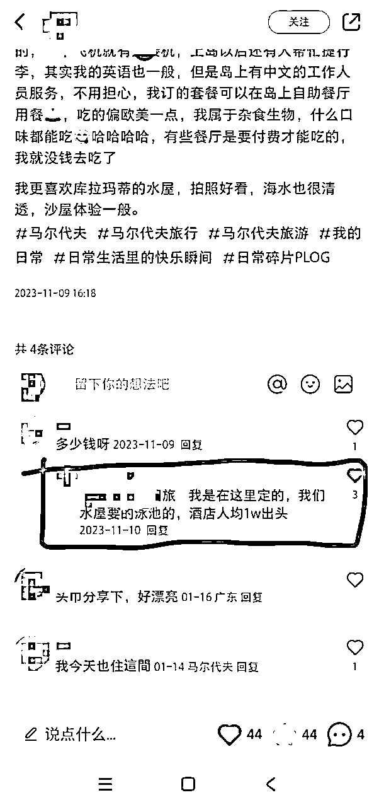

1.  客户分享：

素人代发是假的体验，如果要真实体验，就说服客户发布笔记。客户的分享会更真实，但客户没有运营经验，数据大概率不会好

这时需要我们给出图片、标题参考，为了让客户提高配合度，可以设置一些优惠，发一条小红书优惠打折，或者直接返现部分费用

给优惠时，要注意人群……如果客单价几万几十万的，发一条客片就别给5块10块的……

我们的客片分享，是需要销售提前跟客户沟通分享小红书，客户同意后，再给参考图片，让客户拍类似的图片，标题文案可以帮他写，这样下来，爆文率比客户自己发，高了不少

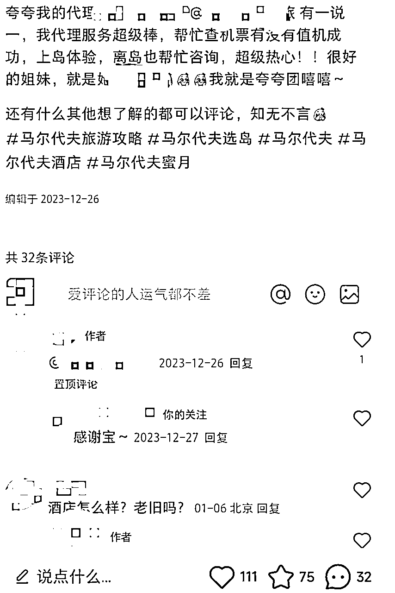

1.  伪素人（员工）矩阵

与素人代发类似，发布的内容都是素人种草分享，但账号是固定的，可以用员工账号

在简介上@主账号，正常分享笔记

但因为账号是未认证的，发布笔记时，注意不要违规。如旅游行业，不能直接推荐产品

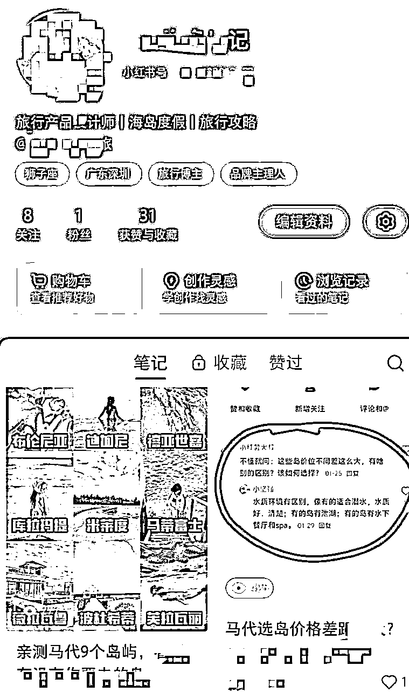

### 1.1.3\. 主理人矩阵

最后一个矩阵模式是效果最好，也是小红书最推崇的，很难，但是转化、用户信任都非常强，值得长期深耕

简单说，就是打造 IP ，突出行业专业身份和业务范围，并关联主理人（一个企业号可以关联3个主理人）

内容以真人出镜为主，突出产品的细节、服务，以专业身份种草，拉近与用户的关系

🌰举个例子：

旅游行业的主理人，可以打造导游、旅行体验师的形象，推荐地域信息、旅行路线、服务特色和酒店试睡等等，内容以实地拍摄 + 真人出镜为主。一次拍摄大量素材，可以出很多篇内容

我运营过多个行业，也投放过很多账号，总结出来主理人+企业号矩阵效果最好。主理人账号的自然流、点击率，都比企业号的好，但只有主理人账号也不行，不结合聚光，人群会跑偏，而且不能大量引流

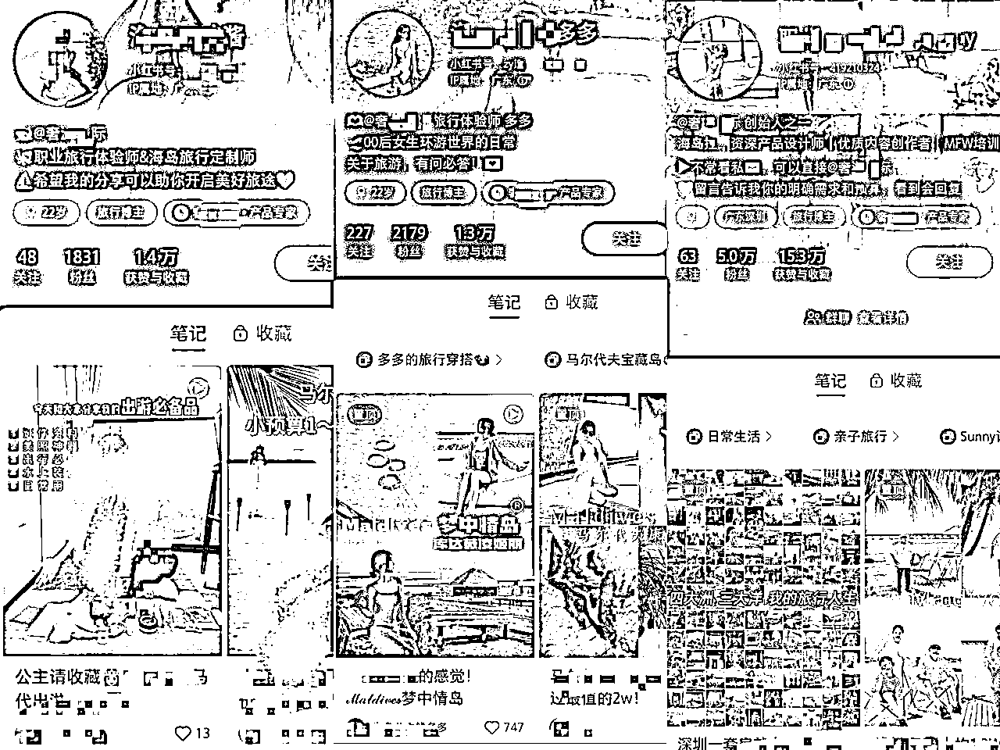

1.  主理人设参考：

员工人设：以员工的角度，切入你的产品，如：在XXX公司上班是什么样的体验

品牌虚拟IP：以品牌的形象出镜，虚构一个品牌IP，如旺仔、雪王

创始人设：把自己当作品牌创始人，分享自己品牌创建经历、品牌故事和品牌愿景、产品等内容获得曝光，让用户既支持自己又支持产品

小编人设：最常见的人设，以小编的方式写营销文案，如盼盼、扫描全能王

其他：岗位性质人设，如旅行体验师、摄影师、设计师、客服等等

1.  主理人形象打造：

头像：突出主理人专业身份或者产品、服务即可，真人头像更具说服力

昵称：主要突出主理人的称谓、身份和作用，如：海岛旅行体验师xxx

简介：@官号联动，并描述账号价值，账号更新的内容方向等

定位：根据人设，不同人设，定位不一样，可以是老板、员工等

内容：更新专业知识、产品测评、品牌故事和实力证明……

### 1.1.4\. 矩阵关联

矩阵账号之间的关联，有几种方式：

1.  简介互相@账号

做不同业务，不同方向，就@不同账号

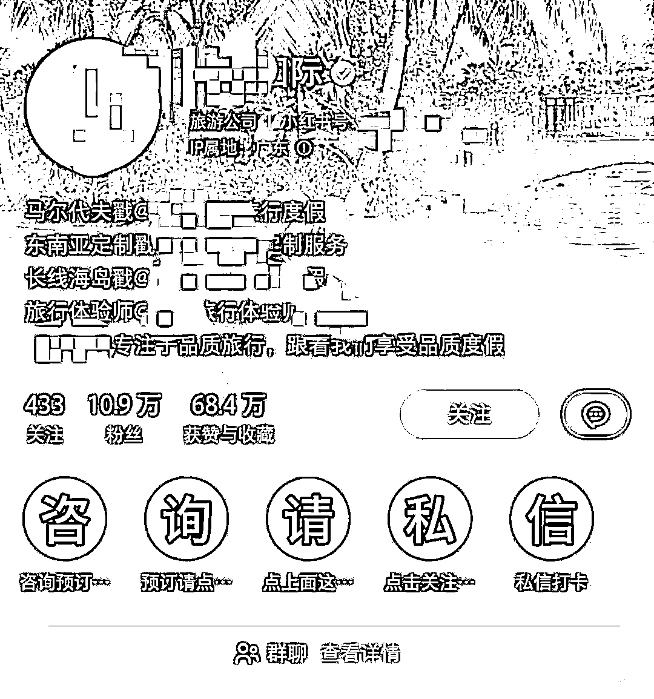

1.  绑定主理人

一个企业号可以绑定3个个人主理人和3个企业主理人

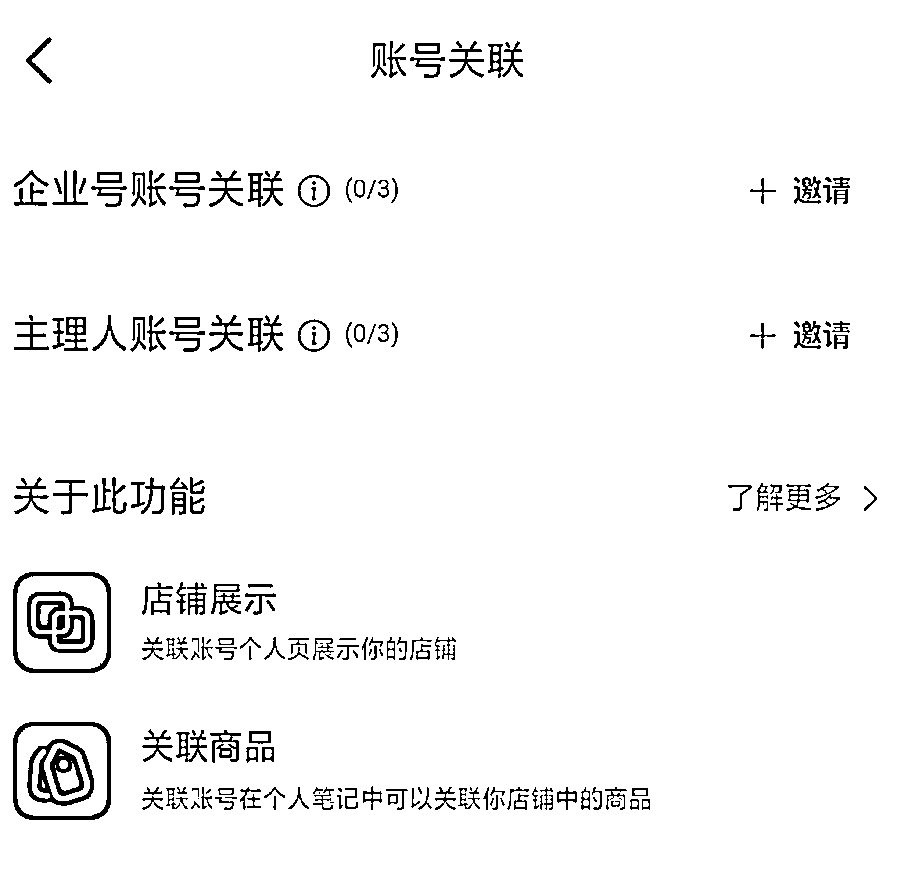

1.  笔记内容、评论区@账号

直接在笔记内容中把账号@出来指路，如果是素人号，就在评论区@一个主账号

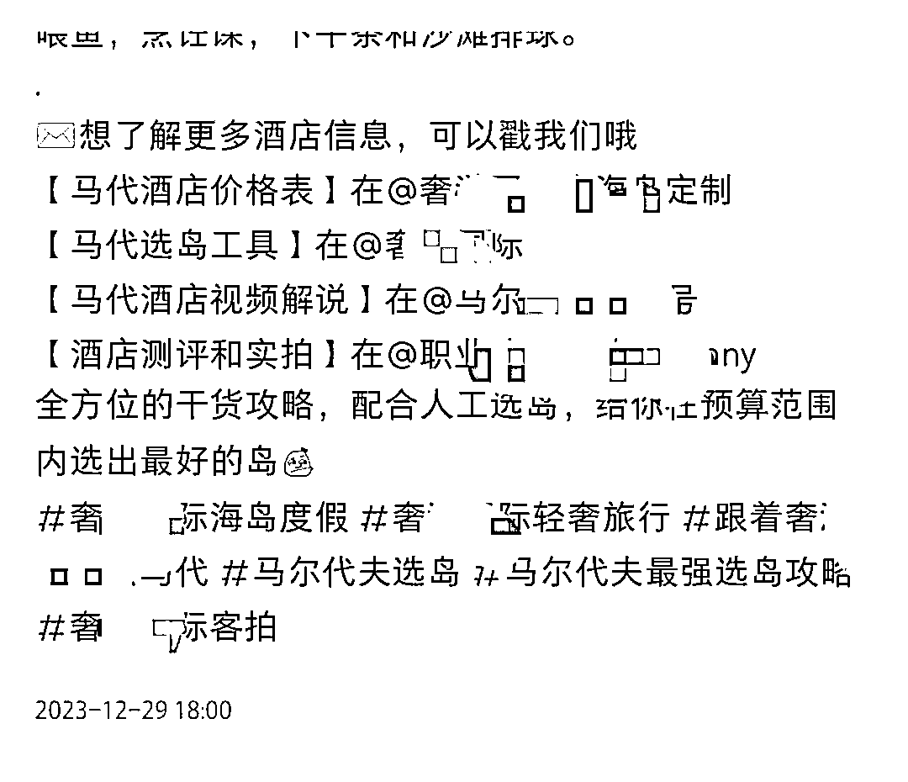

1.  员工账号

企业号可以绑定「企业员工号」和「员工个人号」，绑定后可以在主页显示，而且可以赋予账号一些营销工具，如私信营销

## 投流布局

矩阵账号的基本投放布局：搜索 + 信息流，我运营的几个品牌，内容主力都在图文，所以没投放视频流。如果产品需要用视频才能体现优势的，可以增加视频流投放，视频流也是信息流的一种

### 搜索投放

小红书日均用户搜索占比60%，在国民生活方面已经取代百度，搜索流量比信息流也更加精准，所以这部分是我们投放的重点

投放搜索时，关键词可以选择1000个，不能太少，也不能太多，关键词太少会导致投不出去，关键词太多会导致人群跑偏，成本变高

一般情况下只选择：主关键词+相关词

主关键词包括：

1.  品牌词，如：上海迪士尼、迪士尼

1.  品类词，如：上海旅游、上海旅游攻略

1.  竞品词，如：环球影城、香港迪士尼

跟产品、服务和品牌直接相关的词，这些词的搜索概率非常大，但是竞争也很大，可以增加一些相关词

相关词包括：

1.  需求词：春节去哪里旅游？

1.  长尾词：上海迪士尼门票

1.  间接相关：旅行需要带什么？

1.  ……

在旺季时，如果预算充足，且想要扩大品牌声量，可以追加投放「抢占赛道」

抢占赛道可以把笔记推送至关键词搜索广告的第 1 位或者前 3 位，费用非常高，所以如果投放这个，关键词一定要精准，而且不能太多

### 信息流投放

信息流也是我们投放的重点，但一般信息流都会选择精准人群画像去投放

投放人群包括：主人群+相关人+人群包

主投放人群：

主攻与产品直接相关的人群，出境旅游直接相关人群，如：奢美人群、精致妈妈、精致中产等

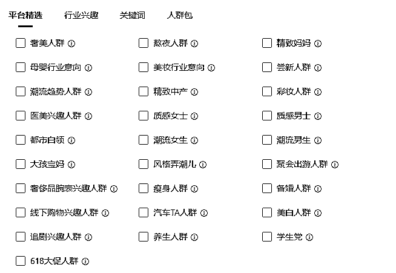

关键词兴趣也都跟旅游相关，只要近期对产品相关的关键词有过搜索、互动和阅读行为的用户，都选上

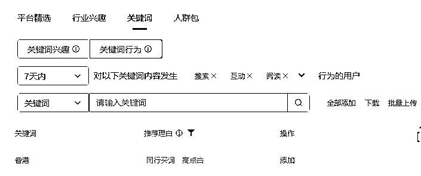

相关人群：

跟产品、服务相关的人群，或者潜在用户，也可以选上。如出境游，我会选上母婴行业意向、大孩宝妈、备婚人群、都市白领等人群

关键词兴趣也把相关词汇添加进来，但一共只能添加150个，所以记得控制数量，越精准越好

人群包：

如果有开通定向人群（DMP）的话，还可以添加一些人群包，可以根据自己产品筛选，也可以找直客协助，直客会协助添加一些海外人群包

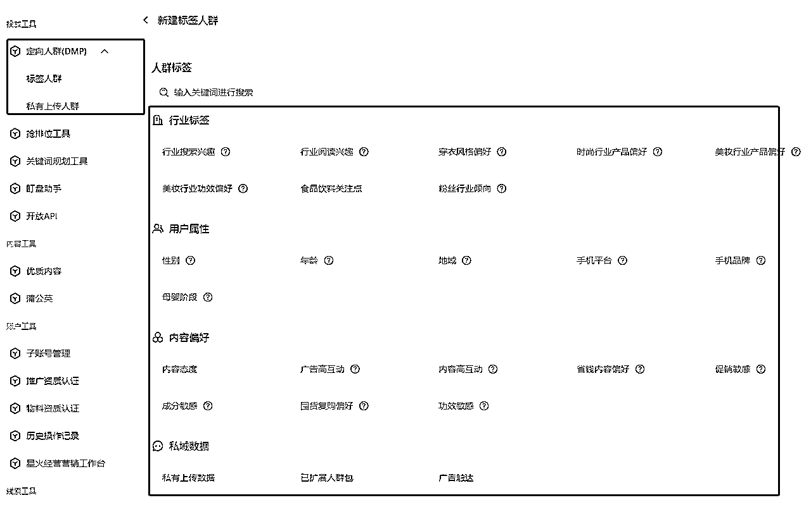

# 投放策略：笔记赛跑

我的聚光投放策略，是笔记赛跑。简单解释：筛选优质笔记建立智投赛跑，再次细筛更高转化低成本的笔记加大投放力度

## 投放标的

客资收集、抢占赛道，我投的大部分都是需要引流的赛道，所以客资收集的投放占了大部分，预算充足的商家会搭配抢占赛道

客资收集投放时一般不会选择落地页，都是笔记投放。推广目标选择：私信开口量

私信咨询量和私信开口量的区别

私信咨询量：只要点击咨询组件，就记录一次咨询，不管用户有没有说话

私信开口量：用户点了咨询组件，并开口说了第一句话，记录一次开口

影响：用户没有跟你聊天，就算是陌生人，24小时内只能给陌生人发送1次文字消息（自动回复不算）

## 笔记初选

在选择投放笔记时，选择高互动、高转化的笔记去投放，不限时间，往期笔记也可以

### 高互动

用户都会有从众心理，低点赞的笔记，就是不愿意点击，低评论的笔记也不愿意去评论

投放时我会优先选择高点赞、高评论的笔记，用户在看到有多人点赞，会更愿意点击

聚光投放的笔记没有时间限制，我最高转化、最低成本的笔记，是发布自1年前高赞爆文

### 高转化

笔记只有高互动的话，投出去效果可能不会好，所以还要筛选有高转化的笔记去投放

1.  产品转化

对比自己的产品/服务，看近期哪个产品转化销售最高，可以筛选笔记追加投放。我在投马代时，会看哪个岛屿最近转化最高，就会筛选一些带这个岛屿的笔记去投放

1.  评论需求

看笔记评论区，有多少评论跟产品、服务的需求相关？如：怎么购买？xxx地区有吗？多少钱？求报价……

## 全站智投筛笔记

笔记筛选出来后，将笔记分类，合集、单推、干货、产品宣传页等分开，前期没那么多笔记时，只要人群、兴趣相差不大的，都可以放到一个计划中测试

### 计划建立

1.  新建一个「客资收集」、「全站智投」计划，按自己的分类命名方便区分

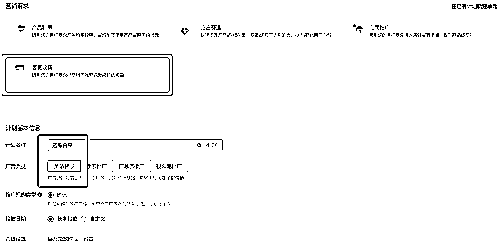

1.  设置计划预算，大约200～500左右就够了，如果笔记量超过10篇，预算可以再提一提，不然跑不出效果。200预算我测试3篇笔记。消耗速度选择匀速消耗

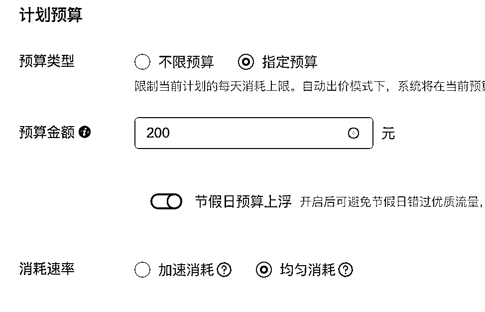

1.  定向根据自己受众人群选择，出境定制游一般不会有18～22岁的用户主动咨询，所以我会把这个去掉

1.  私信开口设置比平均价格低一些就行，可以问问直客自己赛道的平均价格在多少

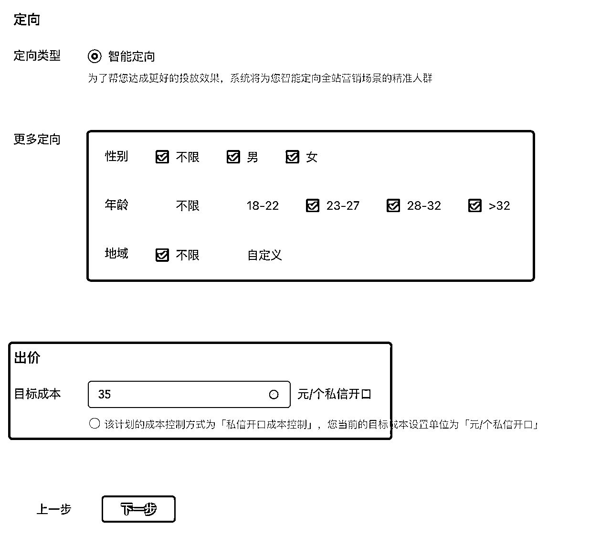

1.  最后记得把封面优选和标题优选打开，会根据点击优化封面。如果有固定封面的话，可以关闭

1.  私信组件一定要打开「立即咨询」，还可以编辑一段置顶评论，这样别人可以在评论中直接进去私信

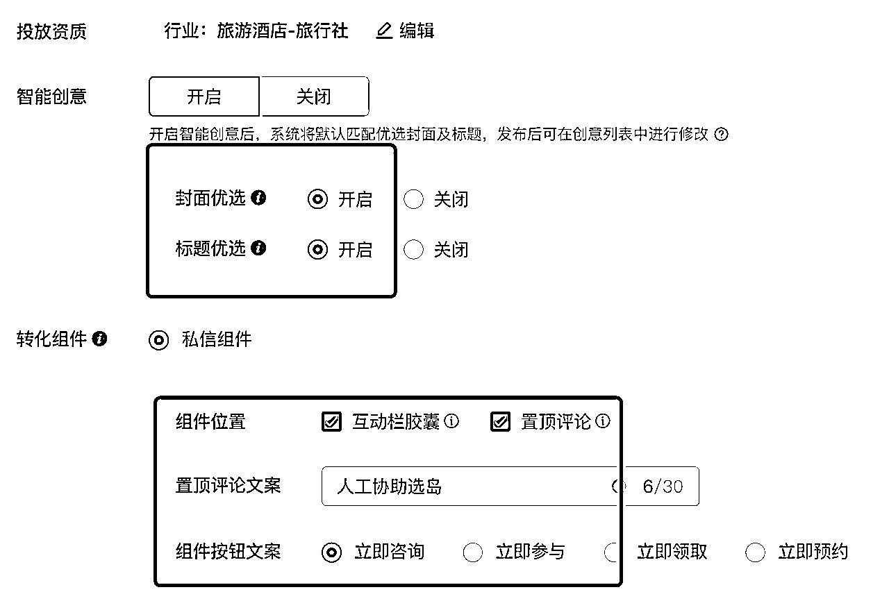

### 笔记细筛

全站智投需要一定时间才能跑通精准需求，所以前面1～3天低消耗、低咨询是正常的，大约跑5～10天，有基本数据后，再根据数据筛选笔记，将不达标的笔记关掉计划

筛选指标：

消耗：投放周期内，没有消耗钱，或者消耗量极低的，关闭计划

开口数：一个开口数都没有的，关闭计划。开口数特别优秀的，继续投放

开口成本：开口成本自己无法承受，或者明显高于平均值的，关闭

只留下有消耗，开口咨询还不错，成本也够低的笔记继续投放，或者进入下一阶段放量投放

## 放量投放

筛选出优质笔记后，留在全站智投里继续加钱投放，加多少钱，完全看品牌方预算。也可以单独给笔记建立「信息流+搜索」的计划，方法跟前面讲的一样

在所有计划都建立后，还需要每天看计划成本有没有变高？小红书用户的喜好不是一直不变，有时产品热点过了，成本会变高，热点一来，成本又低了

比如最近新加坡开放免签，新加坡相关的咨询成本就变得非常低，而且一天咨询量非常可观

# 总结：BKSF 组合营销

前面分享的运营骨架，跟小红书「BKSF模型」非常类似，不同的就是我增加了内容矩阵

B：品牌/官号矩阵

K：kos主理人

S：搜索投放

F：信息流投放

1.  通过品牌账号矩阵输出产品营销、专业内容

1.  搭建kos账号获客，增强用户信任

1.  增加一步：搭建内容矩阵，造势

1.  主攻搜索投放，60%预算投放到搜索广告中，多细分关键词触达不同人群

1.  40%预算布局信息流，如果有视频的话，可以分20%投放到视频流笔记中

低成本、高转化的秘诀，是KOS和内容矩阵

-

以上就是所有内容，2024多多爆量！