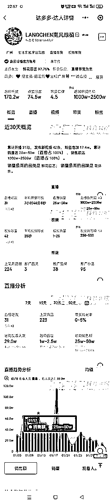
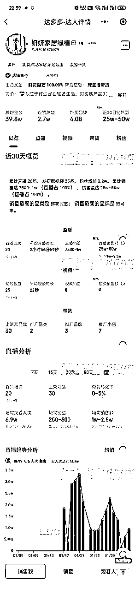
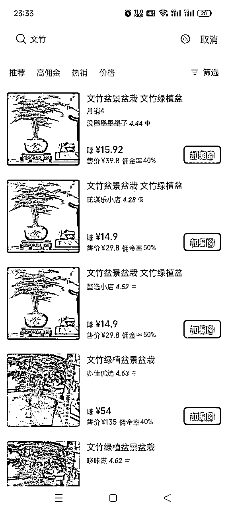

# 风向标拆解第三期——花艺，绿植类账号过完年是不是又有机会了——晓蓉

> 来源：[https://p2heh212tb.feishu.cn/docx/UKBTdla4eoLtAlxDpy4ch5BfnJh](https://p2heh212tb.feishu.cn/docx/UKBTdla4eoLtAlxDpy4ch5BfnJh)

大家好我是晓蓉，这次我要拆解的主题是关于花艺和绿植年后的机会。

随着人们生活品质的提高，对美好生活的追求增加，花艺和绿植的需求也在逐步增加。特别是在一些重要节日或活动期间，如情人节、母亲节、春节等，花艺产品的需求量会大幅上升。

需求：

家庭和办公室绿化需求增加：随着人们生活水平的提高，对于生活环境的品质要求也越来越高。养点花花草草也会让自己心情变好，养好它也会让自己很有成就感。

礼品市场的持续需求：花卉和绿植也一直是礼品市场的热门选择。

健康环保意识的提高：花卉和绿植不仅具有观赏价值，还有净化空气、调节室内湿度等生态功能。

天气渐热，运输绿植会更加方便，在冬季因为运输不便，寒冷的地方都不发货。

人群：40-50岁的女性

带货方式：直播（最好的方式），视频，图文

利润空间：

账号视频的内容创作方向：

养护技巧与教学：账号定期发布关于绿植的养护技巧和教学视频，满足用户对于养护知识的需求。

其他机会：

社群运营：通过建立绿植爱好者社群，增加用户粘性，提高用户参与度。社群中的用户可以互相交流养护经验、分享心得等。

付费内容与周边销售：提供付费的种植技巧课程和养护指南，满足粉丝的个性化需求。同时，销售与绿植相关的周边产品，如花盆、肥料等。