# 做转化的核心 —— 图片（亚马逊版）

> 来源：[https://blrwwxfhox.feishu.cn/docx/UWwMdKEpvogk5cxdEp9cxOAhnDg](https://blrwwxfhox.feishu.cn/docx/UWwMdKEpvogk5cxdEp9cxOAhnDg)

首先，先自我介绍一下。

我叫小紫，今年是我在跨境电商行业的第七年了。

从0-1做过千单爆款，转化率高达79.3%。

目前是多家深圳跨境亿级卖家企业顾问。

我不定期会给大家分享一下专业知识，当作对自己的一个沉淀。

也希望在此，能够结识更多同行的朋友一起互相交流。

我平时被问得最多的问题，就是：你的产品转化是怎么做那么高的，79.3%？

在这里回答一下，

1 常规品类，不是口罩类目

2 上架，广告，售后，自己0-1全盘操手千单爆款

3 做转化，对我来说是一件很简单的事。

今天借此机会，给大家分享一下，我做转化的一些心得。

* * *

影响转化率的因素，有许许多多。

图片、文案、标题、五点、价格、RV、活动、竞品等等。

一篇文章，是肯定讲不完的。

光竞品，都可以讲个几个小时。

有时间我准备做一期合集，以后慢慢分享给大家。

今天想先和大家分享：转化的核心 —— 图片。

# 一、亚马逊卖货=卖图片

有一定体量的卖家都知道，

亚马逊做到后期，比拼的是什么？供应链。

没有供应链呢？那就是运营力。

运营力的核心，不是广告，也不是价格。

是一种能把10刀的产品，卖出20刀的能力，有利润，企业才能生存。

“怎么把一瓶矿泉水卖300块？”

这个话题在知乎上有7000多人关注。

我一向不感冒这类问题，不过这是现状。

你看这两张图，你觉得有什么区别？

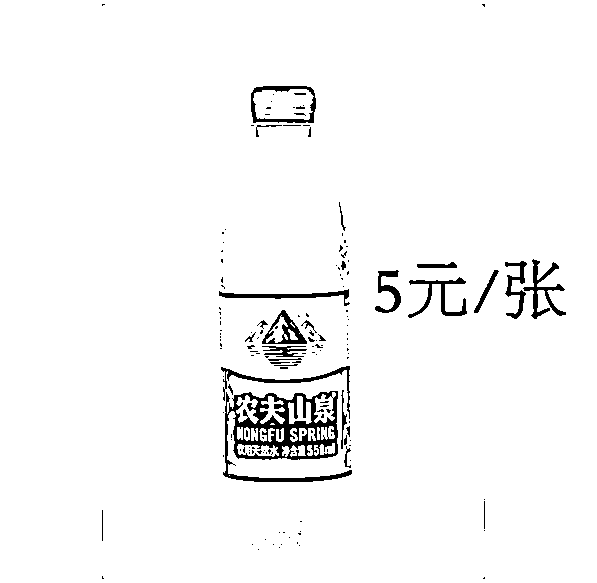

自从电商行业兴起，就一直流传一句话。

“电商卖货就是卖图片。”

产品开发往往认为自己开发的产品是独一无二的。

有时候，产品成功销售不仅仅取决于它的质量和功能。

还取决于市场营销和宣传的效果。

网络购物，消费者无法直接触摸和感受产品。

他们主要通过图片和描述来了解商品。

作为卖家，我们就需要通过图片和文字。

精准传达产品的信息和价值。

核心是：增加产品溢价空间，寻找价值被高估的场景。

这其实是很多卖家都知道，同时，又是许多卖家所忽视的。

甚至一些亿级大卖，因为公司流程化的运营方式。

图片都是美工批量处理，和运营不见得沟通到位。

我对内部团队的设计，永远贯彻这五大要求：

1 差异的印象：是否具备差异的印象使该产品能在一堆相似的产品中被消费者选中

2 具有可读性：是否具有可读性能让消费者轻松了解该产品的基本信息

3 美观的外表：是否有美观的外表能抓住消费者的眼球给消费者享受的视觉体验

4 醒目的商标：是否有明显的商标印象，商标足够醒目才能让消费者对该厂商产生深刻印象

5 齐备的功能：是否有齐备的功能能保证产品的存储且易于消费者使用

大家也可以时常审视一下自己的图片

问问自己，是否能达到这五个标准。

# 二、每张图片，都有自己的职能

很多时候，运营对公司的设计师不满意。

说他们做出来的图片难看，不尽人意。

其实可能是提需求的时候，就出了问题。

图片需求的核心，一定要抓住三个要点：

1 简单简约

2 逻辑梳理

3 语句精简

其中，最重要的则是，逻辑的梳理。

因为每张图片，都有它自己的职责。

这也是最容易出现问题的环节。

让大家提一个简单、言语精简的需求，大家都能提出来。

但逻辑清晰的需求，基于哪些内容呢？

我自己梳理了一套爆款图片逻辑，在这里无偿分享给大家。

内容很多，考虑到会给大家带来一些阅读乏力感。

我接下来捡重点，用最通俗的话术，讲核心点。

第一张，主图，承担着点击率的重任。

尺寸多大、白底、符合亚马逊规定...这些基础要求我就不讲了。

只讲主图最重要的一个点。

即，告诉大家，我们卖的产品是什么？

在此基础上，要无限放大产品质感。

一定要精修，就是加一些磨砂感、哑光、打光位置、阴影等细节处理。

使得图片看起来高级、有质感。

有条件的，一定要渲染效果。

核心公示：质感=材质+颜色+光线处理

大家可以感受一下这两张图。

黑色的产品，是我们公认最好做质感的颜色。

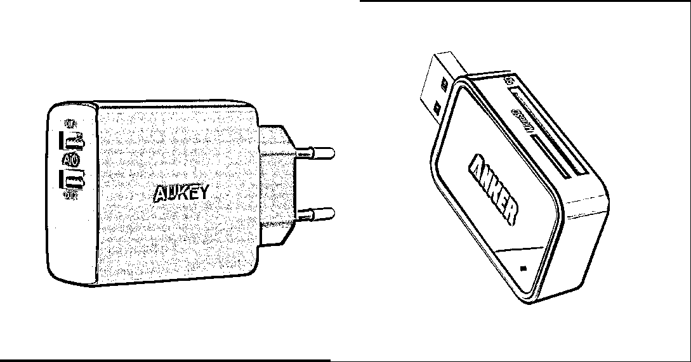

第二、三张图，突出核心卖点

核心卖点图，对提升一个产品的转化率，至关重要。

有工具统计过，买家在亚马逊listing上停留时间平均为2秒。

营销里有一个三秒法则，但运用到短平快的电商上，浓缩为一秒原则较为合适。

旨在一秒钟，快速抓住消费者的注意力，传达有效的信息。

我见过很多运营，想说的内容很多。

做出来的图片，杂乱无章，你不知道他想表达什么。

这种情况，一定要前期做好市调，根据目标人群，直观展示产品核心卖点。

还有那种，抓住了核心卖点，但表达方式很直白。

上来就＜20dB、150PSI、1000mAh...

客户其实只想知道，使用期间，我的感受是什么？

所以，这两张图，核心步骤有三点：

1 通过市场调研，提炼产品卖点

2 客户角度出发，突出核心卖点

3 带入使用场景，解决客户痛点

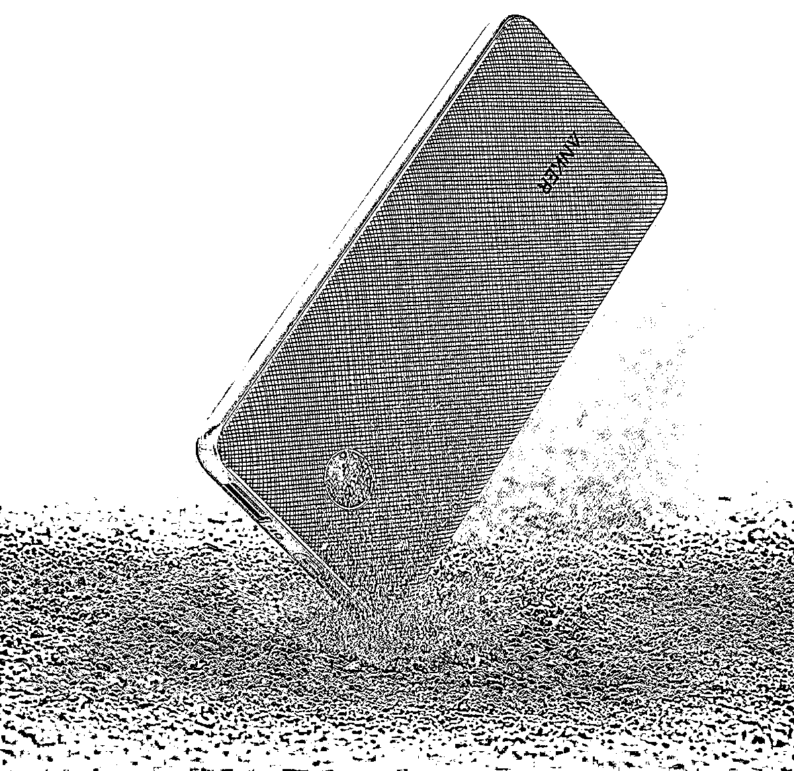

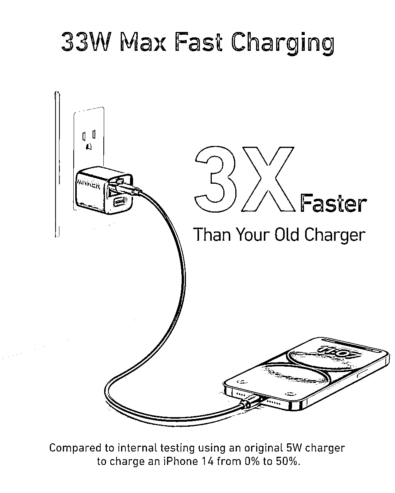

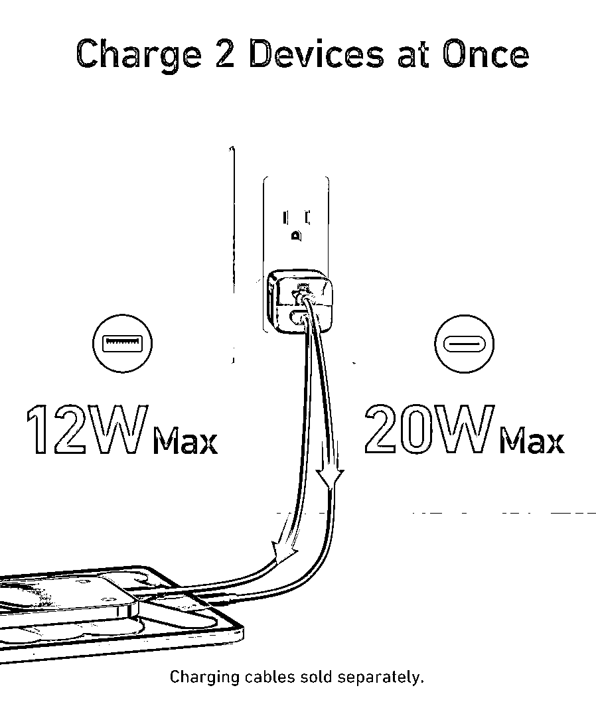

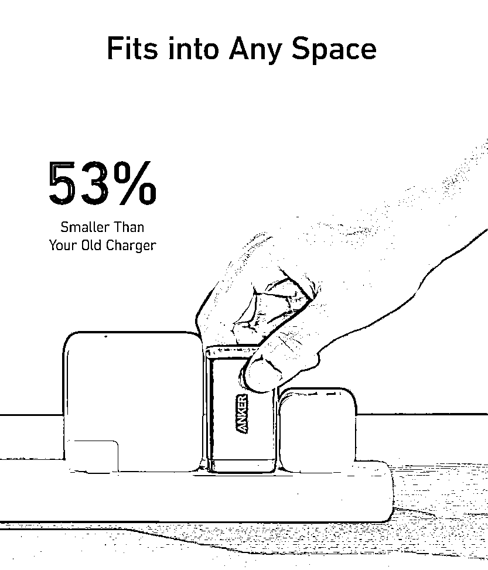

第四、五张图，产品的多样性

核心卖点展示完之后，接下来需要重点突出：产品的多样性。

前面几张图，用户对于产品有了一些认知，产生了兴趣。

就需要在 产品设计细节 和 产品使用场景 上去进一步凸显产品的品质感，增加转化概率。

例如，电子产品内部结构拆解、多样化适配性，服装的多配色、适肤度...

厨房类，加入一些看起来垂涎欲滴的细节美食图，这时候，客户很可能会直接下单。

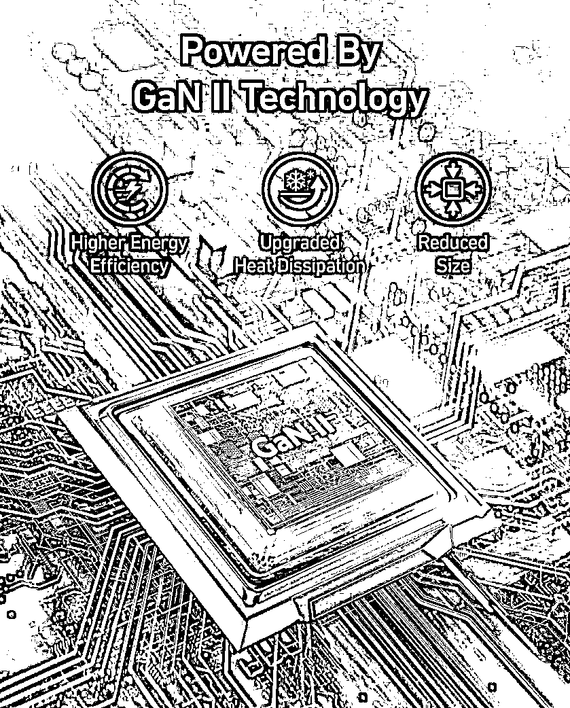

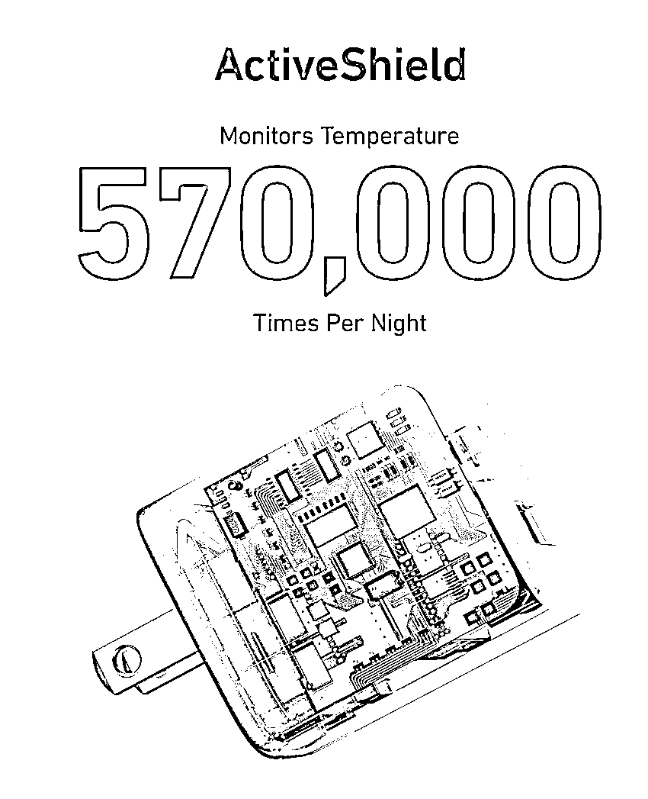

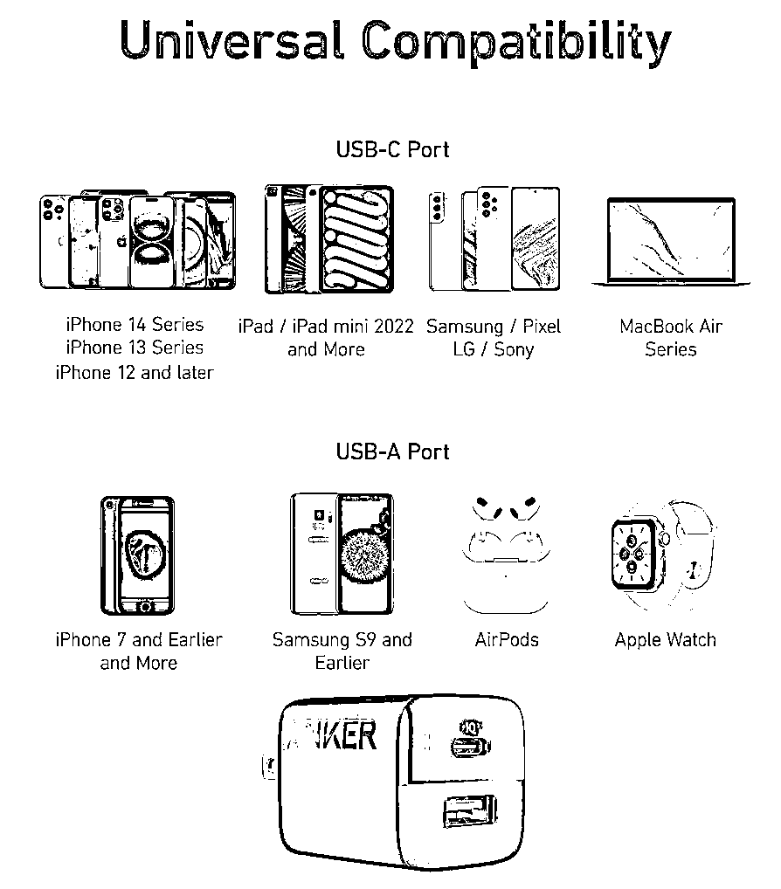

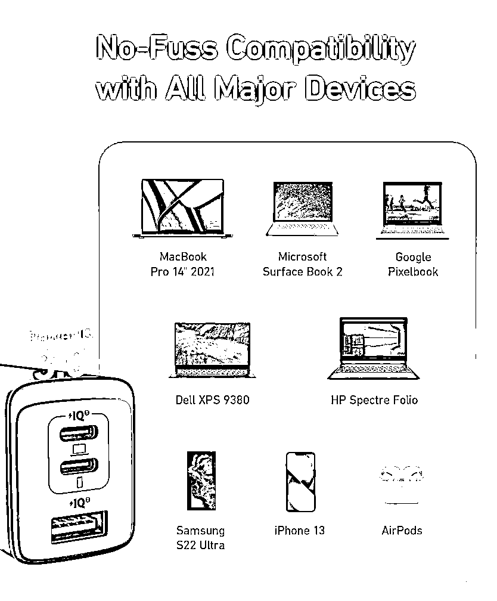

第六、七张图，增加信任感

最后，我们要终极一招。

能看到第七张图，证明客户在你的页面至少停留5s。

此时，我们六、七张图的任务则是：打消用户顾虑，增加信任感，实现转化。

大家都知道，亚马逊PC端，第七张的位置一般都显示视频（如果有上传的话）

那么第六张图，可以作为展示产品的多样性，同4、5。

比如，高单价的、电子产品、健康相关、器械类是有强售后需求的。

那么第六张图一定要作用于增加客户信任感。

反之，低单价的，手机壳、数据线等等则可以更多结合使用场景去突出产品多样性。

那我们如何增加客户信任感？

简单来说，就是给用户一个不得不买你产品的理由。

大家首先想到的，可能是专业的认证。

这些认证有当然好，但对于大部分卖家来说并不是那么简单就能申请的。

这里直接给大家提供几个实用小技巧：

1 善于利用客户评论

2 善于建联环境保护

3 善于利用站外背书

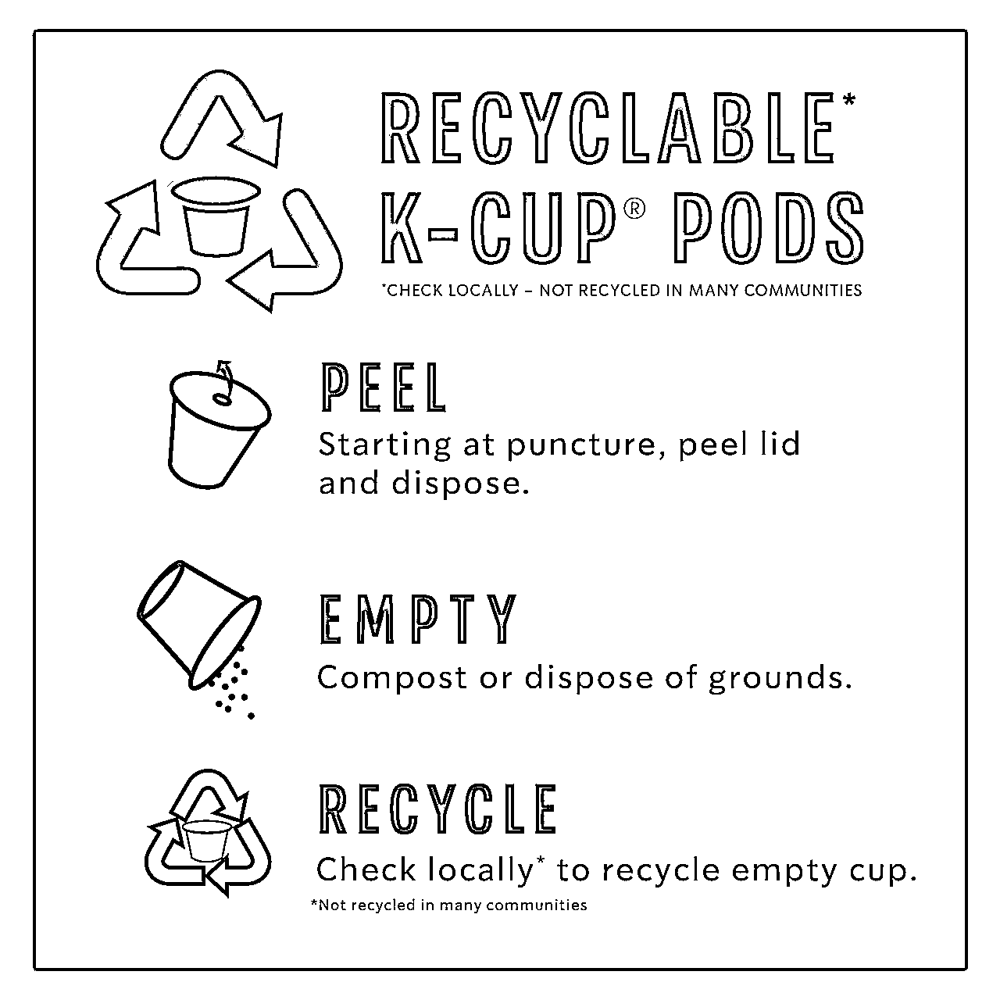

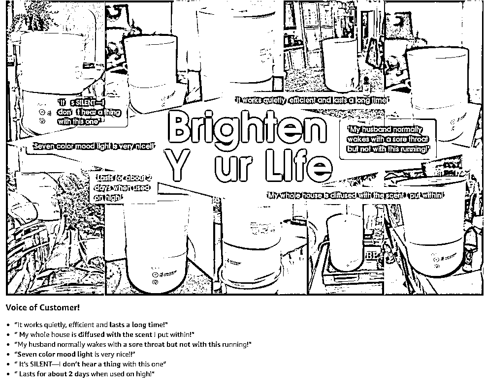

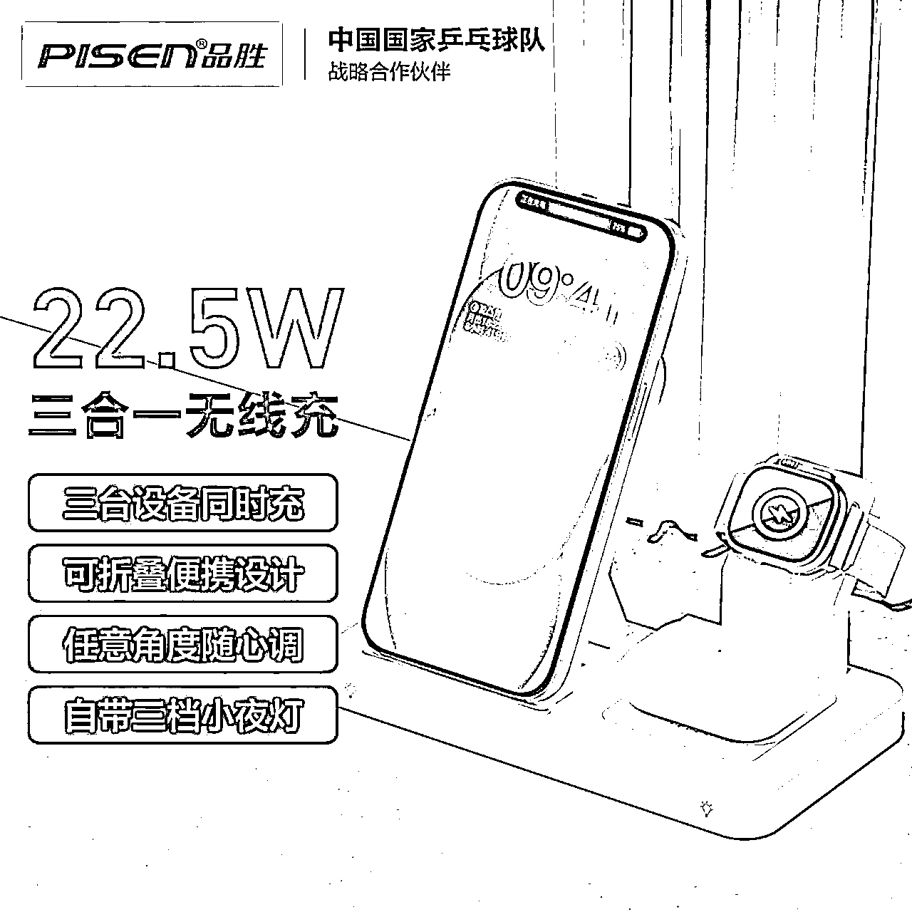

# 三、沉淀图片素材库

我是做3C品类的。

所以我的素材库里面，收集了许多3C类产品的图片。

表达卖点：有体现适配性的、拆机的、兼容性的、尺寸等等。

创新元素：有拟人化的、卡通化的、金属朋友类型的等等。

展现形式：侧面、正面、俯视等等。

颜色区分：黑色系、撞色系、简约白等等。

还有各类型的视频展示。

毫不夸张的说，接近3个T，专门用一个硬盘保存着。

看到一款新品，我的脑海中会闪过那些素材库的内容。

就知道他怎么做图好看。

不要求大家都做到这种程度。

但大家可以从今天开始，沉淀自己的素材库。

沉淀素材库，步骤分为三步：收集、整理、查找。

收集，可以先收集亚马逊TOP前50的链接，你觉得好的图片。

接着整理分类，做文件夹分级整理。

分级整理的时候，每张图片要命名关键词，比如：充电宝 白色 拆解；手机壳 撞色 卡通。

这是我的命名习惯，你可以按照自己的来。

其实好的图片，从来都没有标准。

最重要的是抓住客户的情绪，其次才是和环境的糅合。

并且将这些情绪加之合适的光影和意象，最后诠释出来。

最后，

想了解更多亚马逊图片设计相关的内容（可以私我，备注图片）

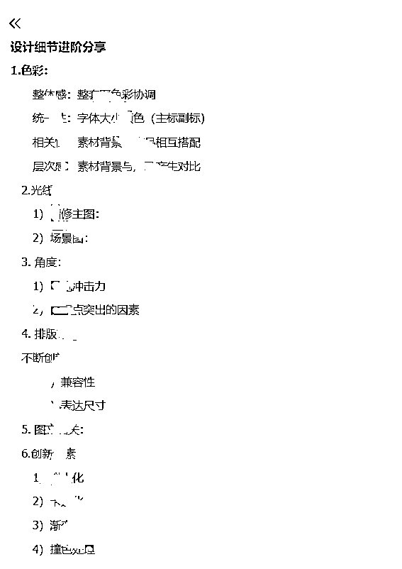

祝大家转化率都翻倍！

祝每一位在奋力向上的人，都实现自己今年的目标！

* * *

全文完。

以下是我的经典文章，99%关注我的人都会阅读，建议你一定要好好看一看：

精细化运营法：

干货型：

职场经验型：

如果觉得小紫的这篇文章聊得还挺有趣

欢迎来交个朋友~