# 时来运转-从0-1项目的实践边实操边优化

> 来源：[https://xq8zkieg4ir.feishu.cn/docx/Trq7dCxwTozQqwx0Ed0cqudrnHe](https://xq8zkieg4ir.feishu.cn/docx/Trq7dCxwTozQqwx0Ed0cqudrnHe)

# 一、纵如彩票虑我千百遍，我待彩票如初恋

## 前言

大家一提彩票，是不是就第一印象中，从没中过或最多5元或10元。

彩票是不是赌博？和赌博有区别？

彩票是不是骗局？哪些大奖得主是不是有内幕啊？

为什么明知不会中奖还要去买？

中国彩票销售量还那么好？

……

为什么要实操这个项目呢？

有没有一种可以提高中奖概率方法或工具之类？

## 回顾中国彩票史

### 彩票事件

”纵如彩票虑我千百遍，我待彩票如初恋”

很真实的彩民生活写照。

彩票这东西有没有黑幕有没有骗局？

看下面一组数据：

在中国彩票短短30多年的发行史上，造假事件层出不穷。

截至目前，中国福彩中心已有14名局处级干部因贪腐被查。

纵然出现2023年12月2日的"10万买中2.2亿"的彩票事件；

2022年8月27日晚，体彩超级大乐透第22098期开奖过程出现异常。

2004年2月5日，“双色球”第2004009期开奖补拍录像事件酿成巨大风波。

2004年的西安宝马案让这场火爆全国的彩票盛宴泯灭无迹。

2002年的扬州彩世塔案就已经透露了“即开型”彩票的惯用套路。

2001年12月到2002年11月间，深圳市彩世塔公司利用承销彩票之机，分别在广东、上海、重庆、江苏等地的17个城市作弊20起，通过彩托“偷回”奖金5806万。

……

还有很多，没收集完全。

### 亿元大奖排行

再看看如下亿元以上大奖：

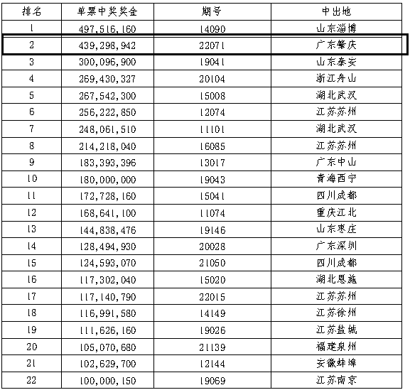

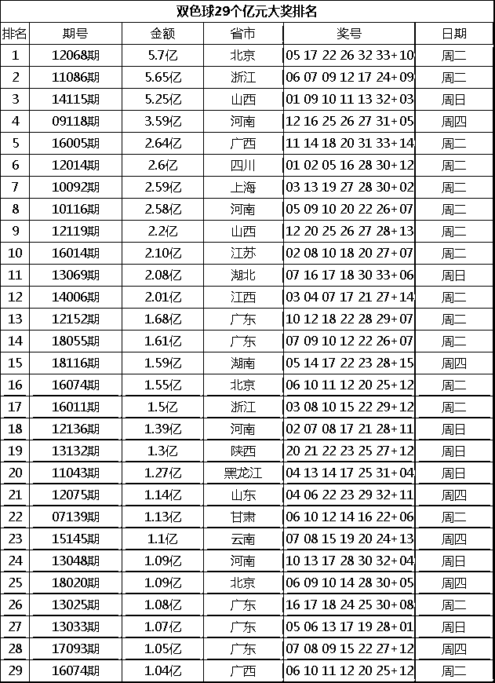

彩票这东西有没有黑幕有没有骗局我不知道也不敢多说，就好比猜拳，我先出你再出，结果可想而知，但是禁不住彩民的前赴后继啊。

### 彩票生生不息

彩票有官方背书，尽管事件很多，但也止不住“2元的彩票梦”。人都有一个追梦

## 思考市场

对，这就是一个蓝海市场，尽管官方背书，只要是人，就有腐败的地方，但这些这些都阻挡不住众多的彩民“暴富梦”万一呢，万一中呢，2元买个梦想何乐而不为呢？

这个市场都有哪些人购买呢？

和我一样的穷人，心中有颗“暴富梦”，偶而小买或守号买；

一群投机的人，其中不凡有“富人”，玩的比较高级，倍数、大复式等之类。

一群大体在35岁以上的群体

……

而我为什么要进入这个彩票市场？

我能提供什么价值给用户呢？

起初，我建立这个大数据模型只是为了自己玩玩，提高中奖概率。

抛开头奖不谈，只要1等以下都可以追求，一等奖就交给运气了。后来头条上看一些发相关的文章，有粉丝又有收入，给了我启发，让我有了建设平台、私域的想法。

从不中到经常中的转变，也希冀用户用了，会有转折点出现，就有了时来运转这个平台。

# 二、初级-人人可为

## 前期准备

注册公众号、头条号、抖音号

以及抖音账号运营

参考@金小亿 《从0开始，普通人可复制：抖音情感号25天抖音涨粉2.2W公众号涨粉4.5W（实战日训练营万字复盘附实操手册）》

注意点：

抖音较严格，不要太明显的，一般不会关小黑屋。

小红书封号比较严重，不建议

百家号也封号严重，不建议

视频号也卡的比较严，不适合

公众号发些实票类的信息不会被封，如何预测之类的信息会被封。

最适合的还是头条，就干头条就是了

### 分析图

分析走势图，官方网站、澳客网、500彩票网、新浪彩票等

### 发布时间

选择固定一个时间段去发布，这样粉丝也会时刻了解。我一般定时在中午11点左右发布。

### 借助工具

如果平台多、或号多，通过工具来管理账号以提高效率。

比如：咕噜管家、推精灵、蚁小二

## 发布内容

### 注意事项

前面都准备好了，就可以正式开工了。

一定要坚持发，刚开始几天没什么流量，一般3天后流量就起来了。

发布文章要勾选原创，不然收益会很少。

到这一步，相信人人都可以操作。一个号一个月200-500是没有问题的，如果弄个矩阵，应该日常生活开支是有的。

示例：

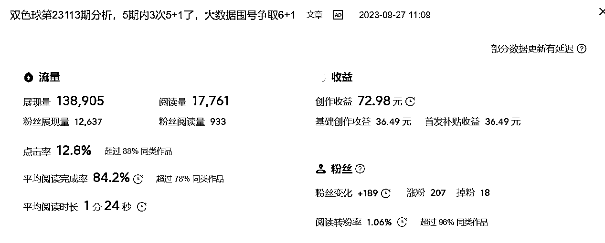

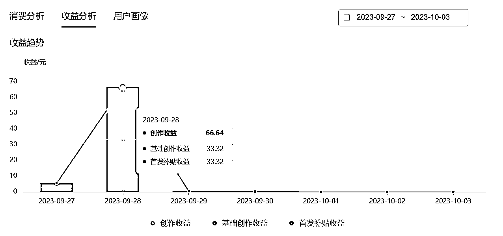

如果像这种，收益一天200-300是妥妥的：

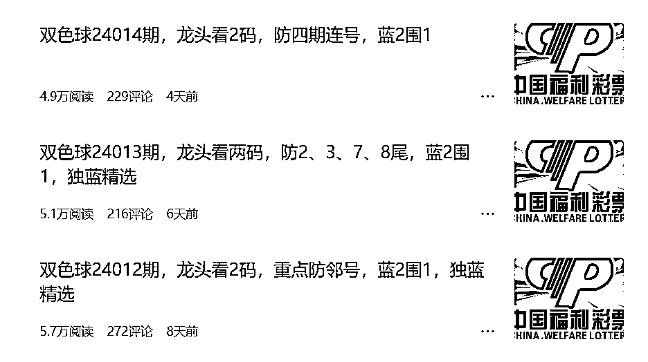

这个收益只是顺带的，重要的是社群收益。重要是后面社群变现，官方彩票返点是8点，可能其他地方也低1-2点火；还有其他方式变现。

### 个人账号情况

我一大号”阿锦的百万生产线”2万粉丝，因不懂引流问题，直接被封号，后又开了号“天天薅羊毛啦”，后面有事就停更了，甚至整个计划都停了，直到加入生财有术，才重新提起来实操一遍。

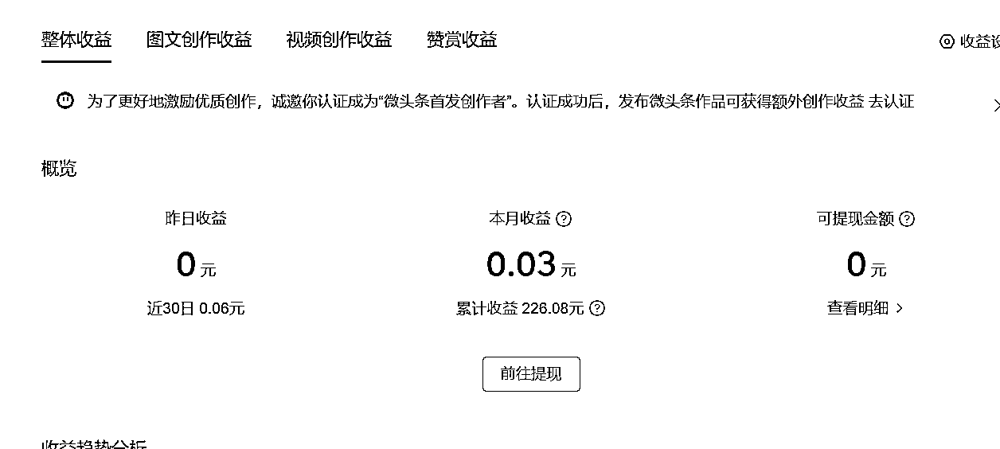

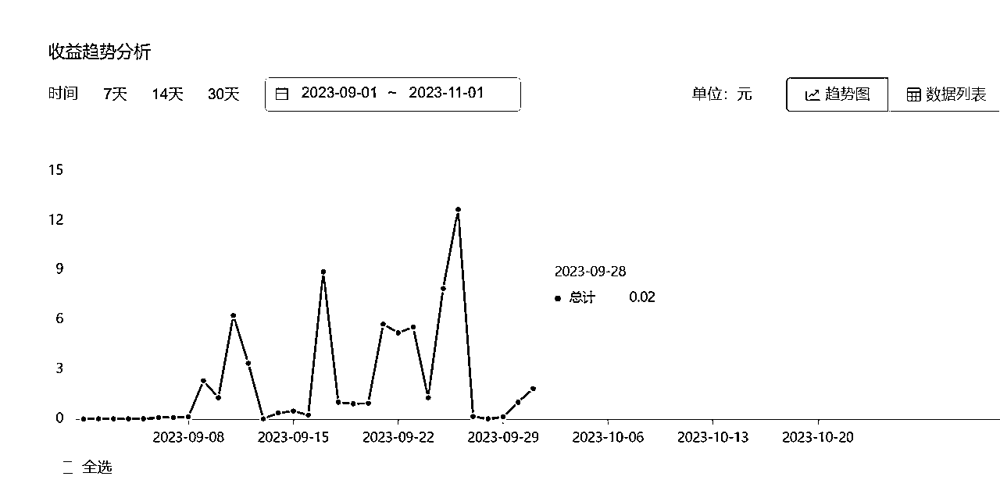

有一点要说明，就是这彩票类的文章，收益会相对其他类的少很多。

### 粉丝特征

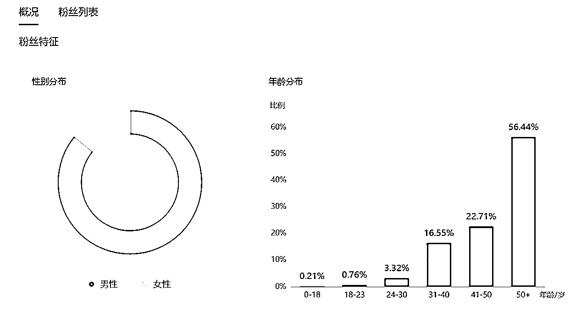

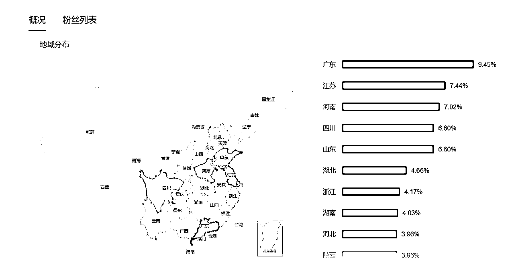

## 引流方式

大号就是不懂引流，给引废了，永久封号。

参考@郭晓文老师的 《抖音引流Tips合集：鱼钩思维+企业号专属引流方式+常见误区》

### 文章未尾法：

在文章留下钩子的，比如”后台回复秘密，我再告诉一个秘密!”

### 评论区留言法

在自己头条文章的评论区用小号提问，然后用作者号回复，并留下钩子，引导用户添加。

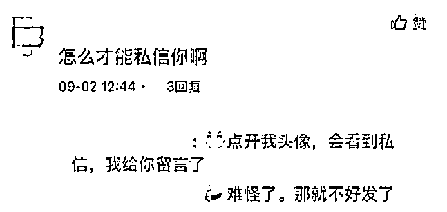

这种评论自己可以做置顶处置，这样用户点击文章就能看点这样的信息，文章的内容信息也是合规没有任何风险，不会影响文章及作者内容。

### 文章扩展链接

这个还未试，不知道可行不可行，先记录着

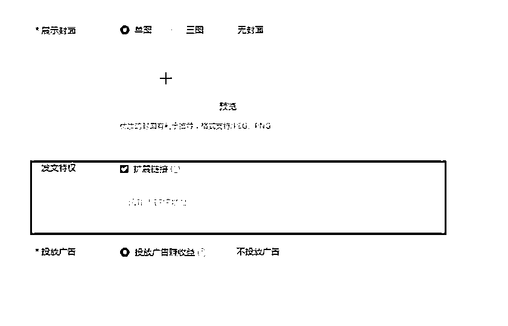

但是目前大家采用的方式都是用天天外链的链接在橙子建站来做落地页，将落地页的链接放置在扩展连接中，等待审核之后，就可以正常显示了。用户点击链接即可跳转至微信场景内，长摁添加好友或关注公众号。

[注意] 这站外链接，需要文章内容与链接想符合才行，需要去试试

### 炸群法

这个也还试过，先记录着

#### 抖音找同行号：

*   最精准的粉丝也都在同行那里，抖音粉丝群里全是精准粉。

*   进群门槛往往是关注即可进群。

*   抖音进群不受账号名/实限制，只要是正常注册账号就能进群

*   抖音流量精准，我们在抖查查、蝉妈妈可以找到垂直领域的各个账号，基本每个账号都有建立粉丝群，所以流量更加精准。

##### 如何拆解玩法：

1.  核心就是先搞定一定的账号资源，因为目前来说抖音进群不需要账名/实，如果后面抖音修改规则跟微信群一样得实名的话，那这个玩法就没得玩了。

1.  抖查查、蝉妈妈挖掘垂直领域达人账号，每个号都安排2-3个小号进他们的粉丝群。

1.  我们在进群的列表里的下方还有一个区域是系统推荐，系统会自动推荐一些可加的粉丝群我们也可以在这个地方找到一些能进的群。

1.  最重要的一点，抖音粉丝群群主是可以随时撤回群成员消息的，所以我们炸群的时间节点非常重要，我的经验是选择在凌晨1点后等他们都睡觉后再炸群，在这个时间节点炸群广告保存的时间会长一些，因为有的人睡醒了，起来后也能看到群消息。

1.  我们一个号一天能进10-30个群就可以。

1.  炸群除了要有足够多的小号进到足够多的群外，更核心更关键的是文案和钩子的设计。

1.  抖音群群消息的展示是这样的:账号昵称+群聊消息的前10个字构成。那么我们可以在账号进群完毕后修改抖音号的名字，改成“裙管理”，或者“锤要通知”这样醒目的字眼。

1.  炸群的广告顺序一定是先发图片 (二维码海报)，再发炸群文案，因为如果后发图的话，那么在抖音的消息列表不会显示文案的前10个字，降低了广告展示的机会。

1.  抖音群目前有全体禁言功能，但是目前我还没看到有博主设置全体禁言的群，整个玩法我估计今天文章发出去后，被多次炸过的博主应该会设置成全体禁言。

1.  那么泛粉群有没有被炸的价值，一定有，但优先炸垂直流量群。

1.  炸群几个时间节点:

*   凌晨12点-1点后

*   早晨6点-8点吃早饭、没睡醒、还在路上的时候、没上班的时候

*   中午12点-1点，中午吃午饭、工作午休的时候

*   这里的核心逻辑在于博主不是24小时时刻都会盯着群管理，总会有那么几个小时的空档可以被利用来群发广告。

### 线下引流

彩票站点，这个是最表准的粉丝群体，大部分的站点都会有1个群以上，打入内部。

## 变现

### 合买单方式

首先联营彩票站点，谈分成返点一般都会谈妥，大部分彩票站点营业额都不会高，都会有这个意愿合作，甚至8个点都返给你都能成，站点老板都希望自己站点有“高手”在，能提高中奖率，这样就能提高站点人气，形成良性循环，主要看自己谈。

其次，等社群购买力提高，可以考虑自己运营站点。

### 直播刮刮彩

现在抖音上挺多采用这种直播刮刮彩。

提醒，希望别玩私彩，违法，违法，违法！！！

## 矩阵玩法

我暂时还没玩，先记录

### 破解网络环境

所有平台都会扫号！第一个扫的是网络环境异常，网络环境异常。

1.  它定义在于在小范围区域内存在大量矩阵相同号，且重复营销行为动作，打个比方，名字全部叫123456，头像全是迪加背景，个性签名完全重复。或重度重复，这样就被官方定义成恶意营销矩阵，扫号时很容易被扫到。

1.  每个账号结构全不一样，避免被平台检测：头像不一样、昵称不一样、个性签名不一样

1.  发朋友圈的节奏（第一不要同一时间大规模发送，咱比如说：你有50个号哈，那你第一时间可能说要区分开，比如三点十分发十个号，三点三十再发十个号，三点五十再发十个号。只有这样才能快速破解开。

1.  你的网络环境异常问题，需要养一养，基本上就不会再出现，就是不要乱换网。

1.  一机一卡一号这是最基本的

1.  然后就是关于权重和模拟用户轨迹行为（一般情况下，都戴着它去走走，而不是在一个地方，像千年不动的古物一样一动不动，这肯定是不行的。反正就是正常人会干嘛，尽量在这个手机上，就让手机去干嘛！得正常。）

## 工具

## 注意事项

在承接流量时，出现的问题：

1.解决信任问题：

我的解决方式，先9.9或免费试用5期，用户满意再交付。

2.

# 三、进阶玩法-构建平台

构建平台，承接更多的变现方式

## 裂变

等初级走通后，就可以加入其他元素玩法。

### 分销模块

一开始我的想法是自己管理更多的群，但相信这样分散更多的精力。来了生财后，看到

@百川 知识星球 | 深度连接铁杆粉丝，运营高品质社群，知识变现的工具这篇里有段讲的挺好；

如何在微信重压下构架“私域流量”网络

我组织200个人，每个人都养一个5000人的微信号，我只要能和这200人建立紧密的合作关系，那不就相当于我自己养了200个5000人的微信号嘛

自己搞200个号，我多累啊，万一被微信大批量封号那就整个业务瘫痪，但是我要是通过模式，利用网络管理200个人，让这200个人自己再去当诸侯发展自己的人

这事情就裂变开了呀，如果控制了货源，这不就等于在家里躺着有税后收入了嘛？何必要自己搞那么多号？

这个模式很不错，轻松又不累，收益也扩大。效果也更佳。

### 收徒模块

在我们内容里输出，分出一部分模型公式给徒弟去输出，让徒弟去管理更多的群，把意愿缴费的会员的统一再归类，这样变现就可以和徒弟进行分润即可。

## 流量主

一开始我对流量主这个熟悉又陌生，知道有这玩意，不知道干嘛用，如何用。

参考@唐门三叔 我是如何用10个中老年种子用户，打通《小程序流量主自动裂变终极玩法》这套变现模式的精华分享

看到这篇精华文后，感叹流量主原来是这样啊，哇，人群不正好和我的人群重合吗，赶紧收藏，纳入体系内。