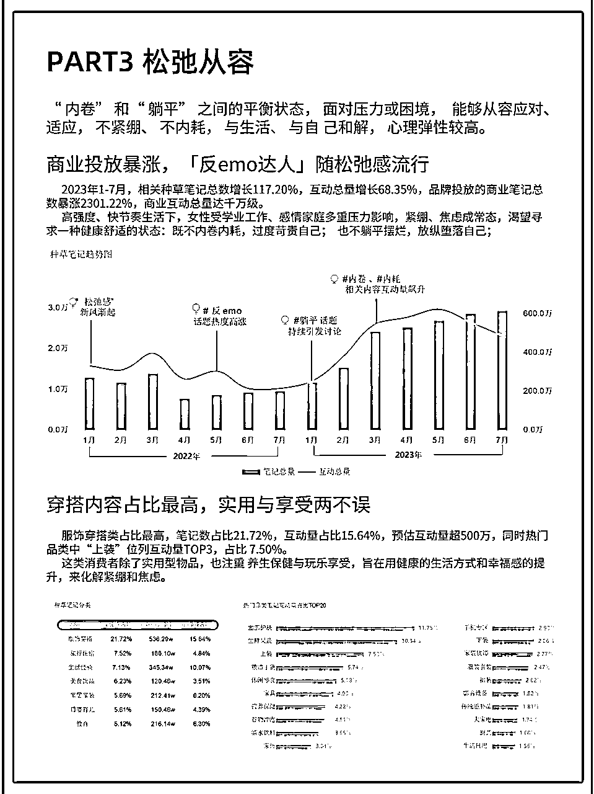
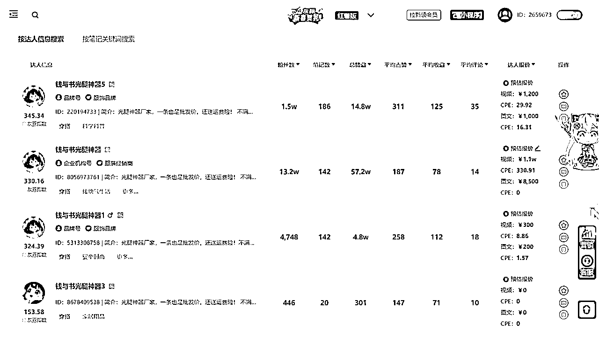
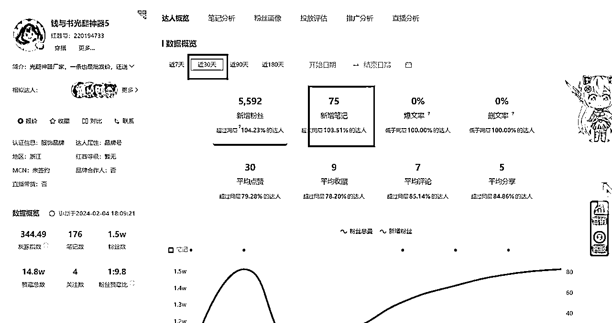
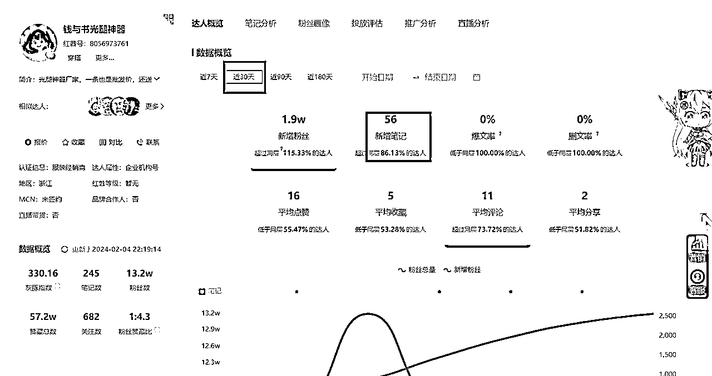
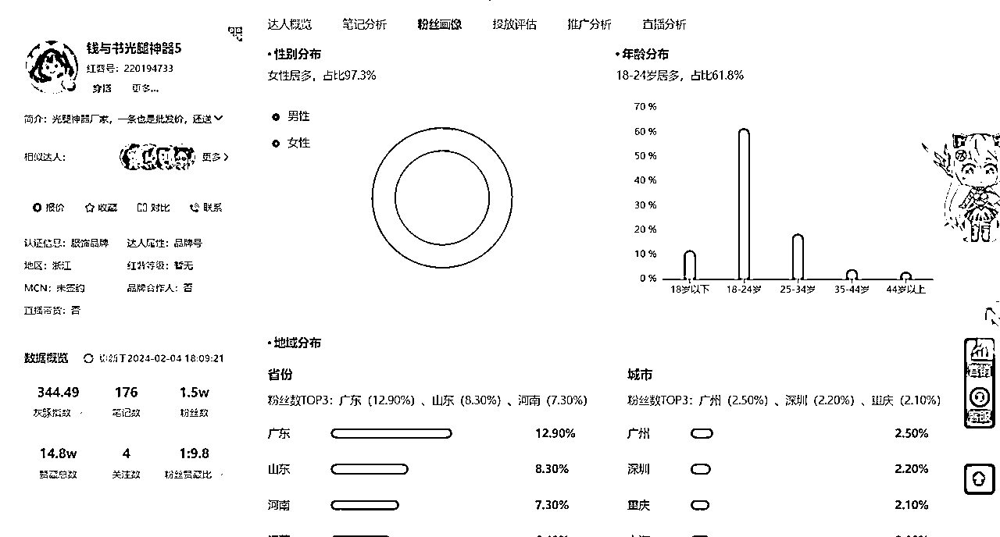
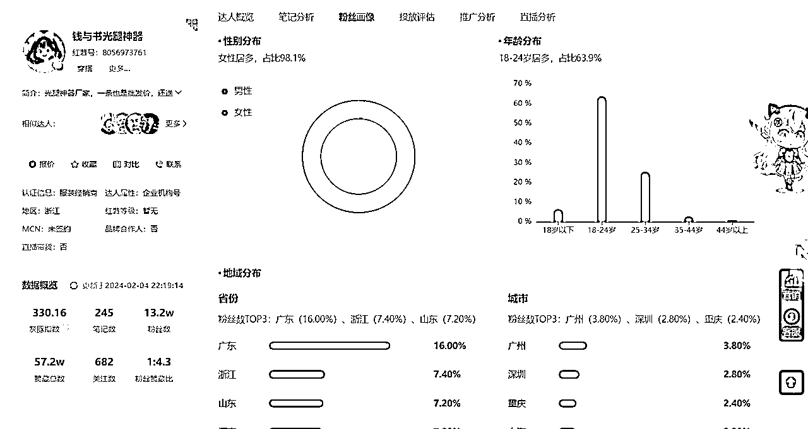
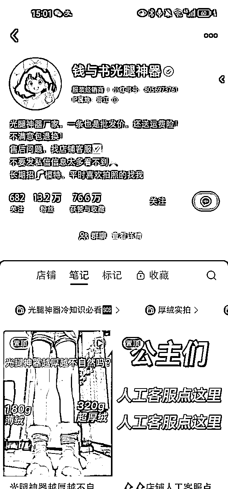
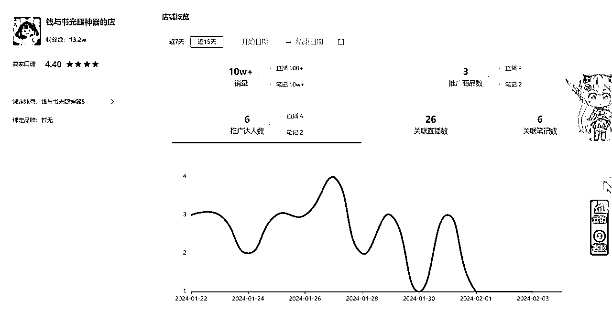

# 风向标拆解第 3 期--小红书爆款50w+--阿淼

> 来源：[https://cinlqbndr6j.feishu.cn/docx/UaXwdyS23obBZXxZfMxcuJKwnuh](https://cinlqbndr6j.feishu.cn/docx/UaXwdyS23obBZXxZfMxcuJKwnuh)

# 背景

随着小红书的商业化发展，小红书店铺也迎来了另一个风口，在这个风口之下，许多商品如雨后春笋般出现，但爆款的打造，必然是万变不离其宗的，其背后的逻辑就让我们一起来探索一下。

这次我们拆解的是关于“光腿神器”的，众所周知，光腿神器一直深受女性的追捧，尤其是在寒冷的冬季，一条服帖自然无褶皱的光腿神器更是万千女性想要的效果，但是在许许多多的光腿神器中商家应该怎么样脱颖而出，吸引到顾客，这就是首先要解决的问题！

# 定位

小红书本身的定位都不用再赘述了，女性用户占比85%，对时尚/美妆/旅行/美食/穿搭等领域有着弄红的兴趣和消费能力，根据最新数据分析，小红书的内容服饰穿搭类占比最高，且“穿衣自由”这一议题的热度也达到了千万级，所以光腿神器的热卖也是在预料之中的。

# 案例分析

基本情况

账号昵称：钱与书光腿神器 （多账号运行）

粉丝数：15w

店铺累计销量80w+，小红书平台销量第一

素人晒单笔记4500+

作品信息（30天）

视频为主，内容多对比，显得更真实

每个账号日更，最少2条

粉丝画像

女性占比95%以上，主要是18-24岁，年轻爱美女性，有极强的分享力

特殊点

简介内容有招腿部模特信息，为大量的对比视频内容做基础

推广

笔记出单为主，近15天笔记销量10w+

达人带货较少，仅有6位

好啦，以上就是关于在小红书做一个爆款得拆解全过程，第一次做这样的拆解，难免有误，欢迎各位圈友们指正一起交流吖~