# 风向标拆解第3 期--小红书爆款，售卖件数50W+的店铺到底是怎么赚钱的—祺然

> 来源：[https://j3buxv3ye3.feishu.cn/docx/WFySdzlzTownplxzrIhcJMk4nHh](https://j3buxv3ye3.feishu.cn/docx/WFySdzlzTownplxzrIhcJMk4nHh)

# 写在前面

售卖件数50W+的店铺爆款店铺其一【钱与书光腿神器】

收到任务后，一直在小红书刷各种店铺，在小红书的店铺很少看到销量高的件数，基本平均在1万~10万左右，也在好奇什么样的店铺售卖件数能达到50W+以上？无意间看到一个店铺，粉丝13万，已售数量：78.6万单，粗略算了下这个店铺的成交额高达3千多万！

那它到底是怎么赚钱的呢？那今天给大家拆解下这个店铺。

初次独立拆解，有拆解的不全面或不妥的地方，还请圈友们多多指正。

# 一、数据概况

【拆解账号】钱与书光腿神器的店

【账号粉丝】13万

【标签】时尚/母婴/家居家装

【账号属性】服装经销商（企业号）

【IP属地】浙江

【选品】主打一个专品（袜子）光腿神器

【账号包装】厂家/批发价

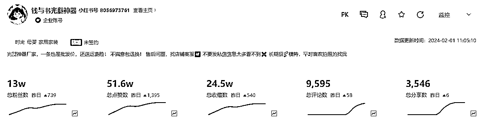

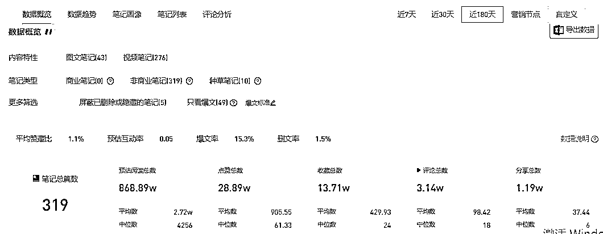

# 二、账号情况及数据分析

## 1、笔记情况

该账号是10月份开始更新视频笔记，11月中旬爆发点开始，围绕女生冬季的光腿神器！笔记内容目前以视频为主，图文为辅！帐号视频的拍摄方式达人试穿+效果展示，产品细节展示+和其他品牌进行比较。达人但实际上对于使用光腿神器的用户来讲，这种表现形式是非常直接的宣传方式，因为购买光腿神器的用户最看重的就是产品质量好+看起来自然。这种用试穿的呈现视频，是一个很吸引用户购买的点。

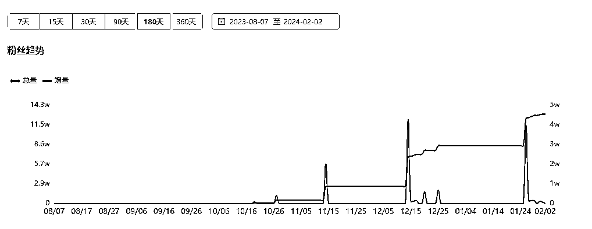

## 2、用户群体

用户群体以女性为主，年龄不限，这些用户通常对审美有较高要求，对时尚、美妆、生活方式等领域有浓厚兴趣，吸引对爱美的女生。有了光腿神器，即便在大冬天，也可以露出自己的大白腿，成为整条街最靓丽的女生。

## 3、发文情况

总笔记319篇，视频笔记为276篇，图文笔记为43篇 其中视频笔记占总笔记的百分之64左右。

12月发文：101篇 、 1月发文：59篇 按照这个数据每天至少发文一篇，平均每天2-3篇笔记

## 4、直播数据

10月份、11月份、12月份的直播数据均为零，这个账号以带货视频为主

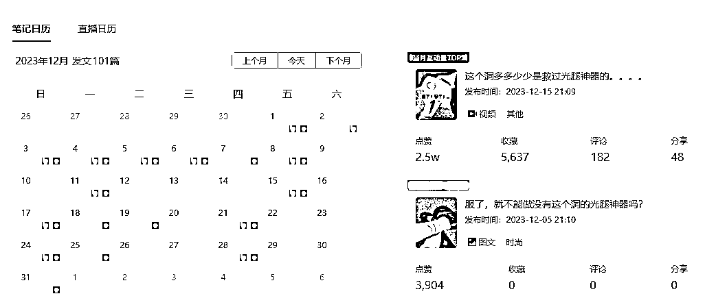

## 5、建立粉丝群

建立小红书群聊，沟通探讨穿搭，引导消费购买

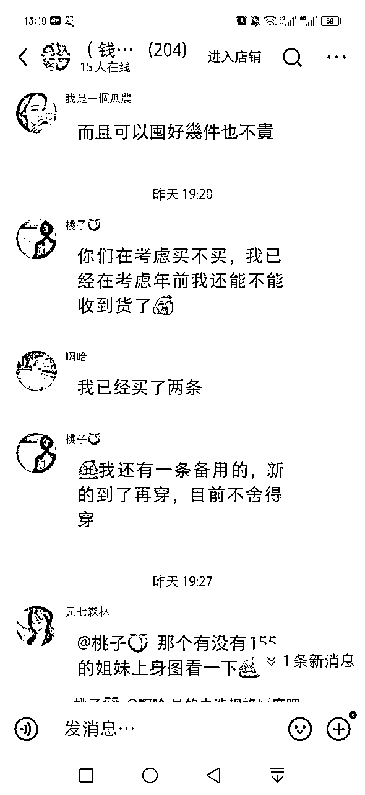

# 三、账号投放情况

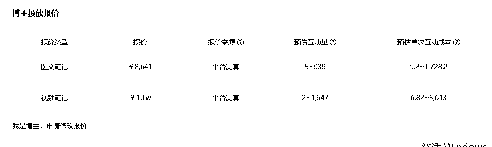

# 四、笔记类别数量与互动量分布

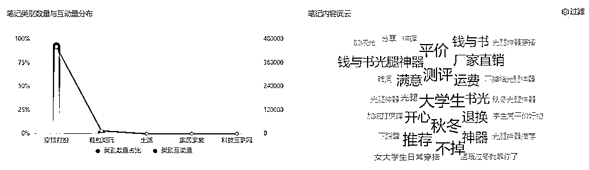

# 五、笔记画像

# 六、利润空间

相对比了同款140g，230g价格规格，

140g在某多的价格是17.88，小红书价格是39.9，一单利润22.02

230g在某多的价格是26.81，小红书价格是59.9，一单利润33.09

卖了78多万单，按照一单利润10元到37元来算

总利润有多少，你可以自己算一算

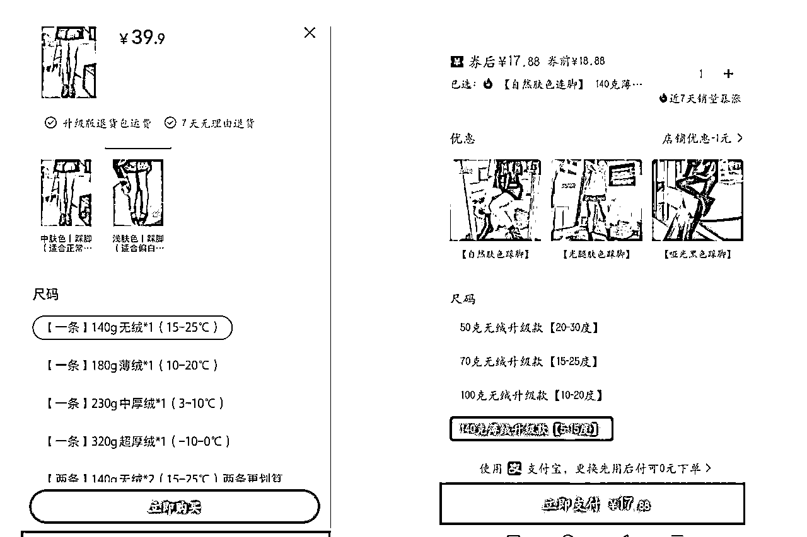

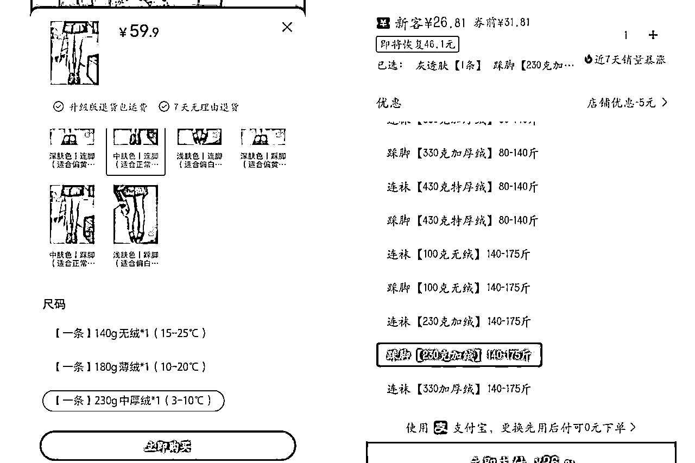

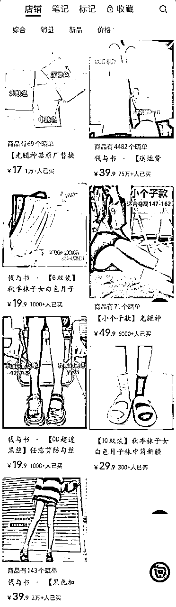

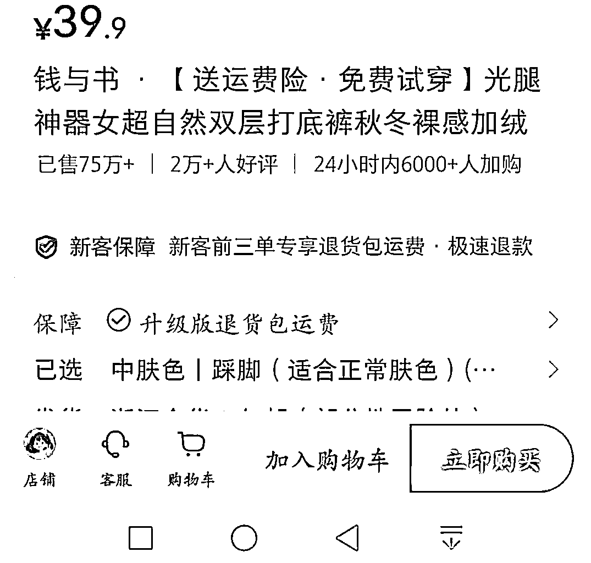

并且最近24小时之内有6000多人加入购物车，可见光腿神器的火爆程度

欢迎评论指导

——

感谢阅读，一起生财有术！

，