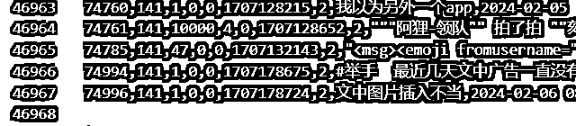
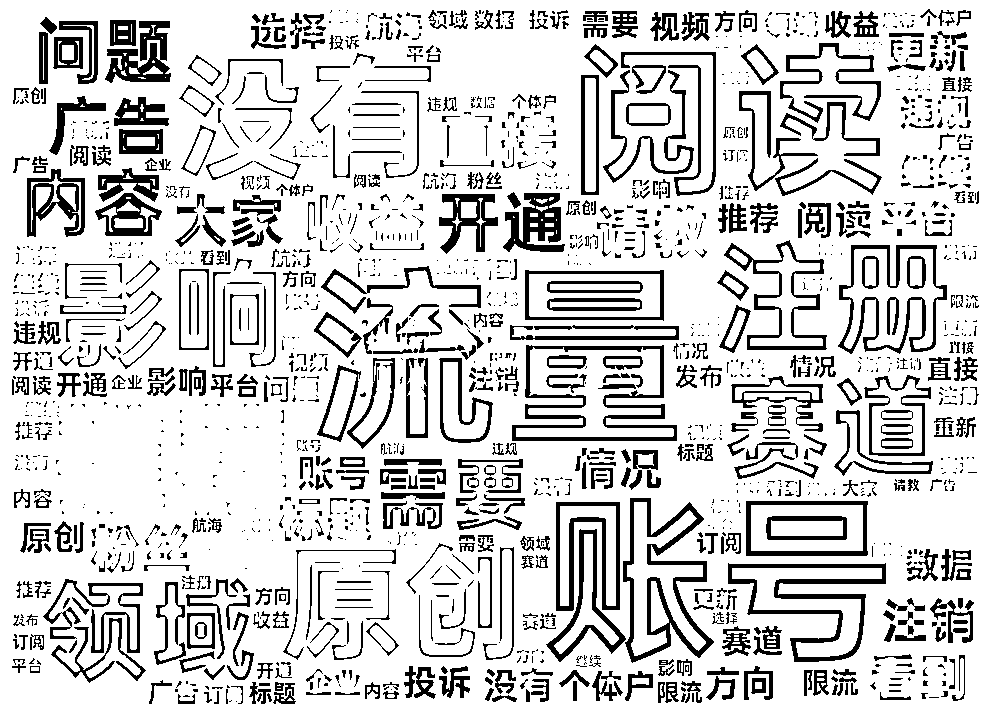
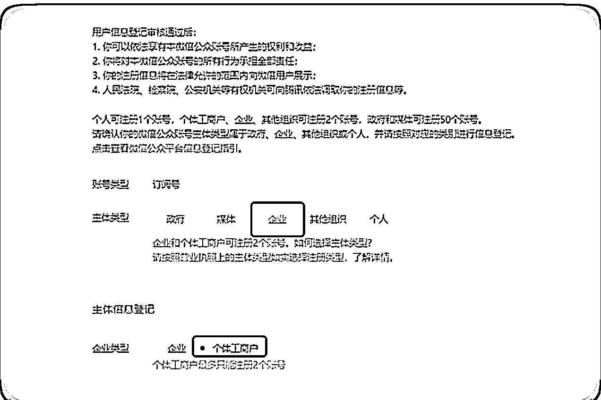
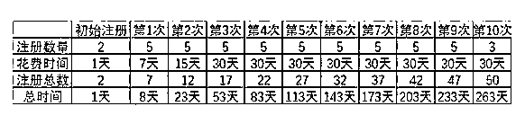
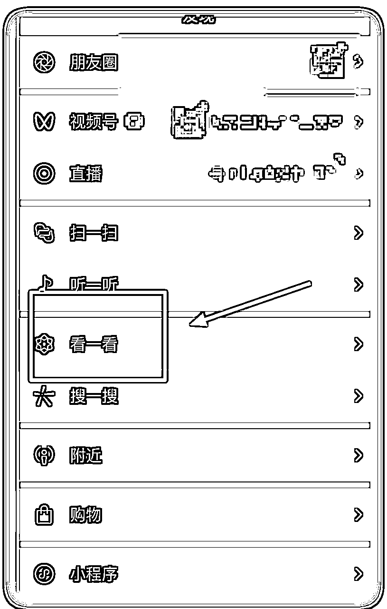

# 复盘 - 公众号爆文写作-202312月航海

> 来源：[https://y3my0b87ql.feishu.cn/docx/WQEYdrt7foNBN4xhVMJcR7bnnDb](https://y3my0b87ql.feishu.cn/docx/WQEYdrt7foNBN4xhVMJcR7bnnDb)

12月航海已经过去快 2 周了，你还在继续前行么？

在12月份有幸，成为「公众号爆文写作」的教练，和大家一起成长和学习。我在这趟航海中收获颇丰，现在，我也想借此机会，和大家分享一下我的航海总结，希望能对大家在航海结束后，还能继续航行，继续搞钱有所帮助。

航海绝不是一帆风顺的，在航海的过程中，看到大家的提问来看，遇到各种各样的困难和挑战。

最大的问题就是：写的文章，没有流量。

但，好多船员通过不断地精进和进化，坚持不懈，永不放弃，获得了正反馈，找到自己的赛道和写作方法。

在航海中，教练们通过精选日志、高手分享和多个环节来促进大家继续前行，一起赚到钱。

航海结束后，如果没有一群人每天报喜、分享和解答问题，如果这个时候还没有钱，就很难有激情，继续前行。

希望我的这次航海总结，对大家有所帮助。预祝大家在航海后，继续深耕、取得进步、取得成功，一起生财有术！

# 开篇

来自官方数据，参与「众号爆文写作」航海的船员有1774位，上船的 1540 位。

截止到2024-2-5，我从 5 个航海群，收集了数据总共的数据是 46967 条，

从这个数据里面找到有用的信息，提供大家在航海之后，这段时间内，可以继续航行，有问题的可以直接点击这里可以看到之前的回答。

原始数据：

也提供了大家的自我介绍，从大家的自我介绍里面，看到一些有用的资源，一起搞点事也不是不可能。

还有一个渠道就是，回头再看其他船员的日志，好事、精选日志，点击链接生财有术·航海资料库。

# 挖掘问题

从聊天记录里面 #举手 标签找到的所有问题。举手提问总共 1129 条。

排名最高的几个词云里面，可以看出来大家遇到的问题：流量、账号，阅读、没有，注册，影响，推荐，领域，赛道。

从这些关键字里面，可以大致分为拆分为3个大问题，也是最常见的，也是容易遇到的问题。

*   账号注册

*   没有流量，没有阅读，没有影响，没有推荐

*   赛道推荐，领域推荐

好了， 大部分问题找到了，下面就要开始找到问题的答案。

# 问题分析

二八原则， Top20%的问题，解决80%的问题。

下面挑选几个有代表性的问题，由于回答都比较分散，我整理之后，加上自己的个人见解，抛砖引玉。

### 账号注册

我们所说的公众号，是订阅号，千万不要注册小程序或者是服务号。

A. 一个身份证可注册一个公众号，一个手机号码可验证五个公众号。

这里要注意个人注册，目前一个普通账号只能注册一个订阅号，如果是之前注册的会提示你的，可以直接解冻或者是找回，可以继续用，说不定还有留言功能，现在一个留言功能的账号都好几千呢。

B. 用注册

可以参考这个官方的教程，用个体户注册公众号。

还有就是，企业如果是有一个体账号，去注册公众号的话，可以最多注册50个。下面是兔子鱼教练发的一个注册图片，大家可以参考一下。

千万要注意，这里注册好之后一般是没有粉丝的，这个粉丝，不要一上来就坐直升飞机，急着先去买。

因为有几位船友，就急着去买了粉丝，账号被封了，不能开流量主。

建议先发几天文章，然后再去买这个。

去哪里买？淘宝搜或者其他地方都可以，关键字「订阅号」，自己注意甄别真假。

还有一点，不要担心前几天，发的文章火了之后没有钱赚，因为后面开通了之后，前面的文章也是有底部广告。

### 没有流量、推荐、阅读

没有标准答案。

我的个人建议是：短平快的项目，方案就是模仿。

模仿的基础上加一个思路：思路就是：提出假设-> 尝试-> 继续假设-> 直到成功。

这个是通病，不是你一个人遇到的，是（大部分）所有项目，（大部分）所有商业都会遇到这个问题。

如果我能掌握这个固定的套路，那我就发了。没有流量，这是大多数项目和商业都会遇到的常见问题。不要灰心，这并不意味着这个的项目或商业不成功。

相反，我个人的思路就是：提出假设-> 尝试-> 继续假设-> 直到成功。

具体做法就是：

1.  提出假设：看一看里面的文章，看到你感兴趣的标题，就点击进去，还有这篇文章底部的推荐，然后觉得那些人会看这样的文章？文章的那个点让读者要进来看，标题？配图？内容？

1.  尝试假设：对自己的设想，开始验证。每一个假设或者是多个假设，发布的文章不低于 20 篇，看看是不是有收益，正反馈？跑通这个 mvp

1.  重复 1～2 步，直到成功。

### 赛道推荐、领域推荐

首先要给大家泼个冷水。

我给你说：名人名言，影视，极简生活领域，职场，军事，历史。 这些是热门赛道，这些领域超级火爆，你信么？

说实话吧， 我都不信。。

没有那个领域是长期的赚钱的，并不是每个赛道都能永久赚钱。

赚钱的赛道是不断变化的，需要我们学会如何找到它们。

找到赚钱赛道的方法不是听别人说，也不是一时半会儿看热门赛道。而是要自己去尝试，去探索。

只有亲身经历过，你才能真正了解一个赛道是不是适合自己，才能知道它是否适合你，是否能让你赚钱。

所以，不要害怕尝试，不要害怕失败。只有不断地尝试，你才能找到属于自己的赚钱赛道。

当然，在尝试的过程中，也要注意总结经验教训，不断地学习和进步。这样，你才能在未来的竞争中立于不败之地。

那如何找到这个赛道，这个领域？

我推荐我经常看的一个地方。

看一看、关注的对标账号、收藏的历史文章

*   以个人感觉为主，就是筛选“吸引我点击的标题”、收藏“能够让我产生分享、点赞又或者在看”的文章、关注“能让我产生很大情绪波动的”文章。

*   以数据分析为辅，“阅读量是参考”不是判定文章好坏的唯一参数，重点关注点赞数、转发数、在看数等互动数据，当阅读量相似时优先考虑互动参数高的文章。

*   对一篇收藏的文章进行分析，主要看看标题中吸引我阅读的点（从情绪角度、用语角度），看看正文中素材（按照热点+干货）的结构拆分，看看文章中是否存在“出乎人意料”的观点并搜集。看看文中如何引导互动。

有一个小技巧，就是看到不错的文章，可以转发给自己和收藏，后面有空了，来多看看。或者是模仿的对象。

赚钱记住，三不成立：事少，钱多，风险小，没有 3 个同时成立的，有的话。

*   不要把鸡蛋放在一个篮子里。就是不要把所有的账号都用来写一个赛道、一个领域上，要分散，这样可以降低风险。

*   不要相信一夜暴富的神话。赚钱需要时间和努力，不要指望一夜暴富，写几篇文章，就能 10w+。

### 典型问题

Q：选的赛道是武汉地区的旅游类，想法是把武汉这个地区围起来写，只写武汉这个地区的，会不会面临受众比较小，从而导致流量起不来？

A：将武汉地区的旅游类账号文章，每次发布几篇。在头条+次头条+xxx。这样就可以在短时间内发表多篇高质量文章。

* * *

Q：ai只有用于生图可以吗。我现在只有两个号，是做两个方向好呢，还是一个大方向聚焦两个下面的子方向好呢？

A：首先是图片，可以用 AI 生成的，只要还可以避免版权的问题。

关于是否应该做两个方向还是一个大方向聚焦两个下面的子方向，我的建议是：

如果你有足够的时间和精力，可以考虑做两个方向。这样可以分散风险，也更容易吸引到不同的受众。

如果你时间和精力有限，可以考虑聚焦一个大方向下的两个子方向。这样可以让你在某个领域内有更深的研究和理解，也更容易创作出高质量的内容。

我个人倾向于前者。

* * *

Q：我今天看手册说，遇到爆款文章，要拆解出来开头，过程，结尾，然后按照自己的话，再模仿一篇。我的疑问:这个意思是我们直接把爆款文章选题拿来用，甚至标题改一下也可以拿来用？内容也是模仿对方的，是这个意思吗？那么，这样文章的原创度会不会不高，如果不高的话，会不会影响入池？

A：只要标注原创能过，说明原创度就没有问题，除非有人举报。

我一般有时候，看到标题特别好的， 我标题都懒得改，直接用对方的。内容还是要用 AI 来再次二次创作。

* * *

Q：不开原创会有影响吗，不开原创会推流吗？我看我一个对标账号，每一篇都不标原创，多篇10W+，再差都是几万。是老号，有留言功能，而且留言区非常火爆。但是是去年9月才开始写现在的内容，看账号改名的更新记录，之前肯定不是写这个赛道的，不知道是以前没写文章，还是说把以前的删了的。

A：不开原创对账号的推荐和权重都会有影响。推流方面：

*   平台会优先推荐原创内容，如果不开原创，平台会认为你的内容是抄袭或搬运，不会给予较高的推荐权重。

*   你的内容很难被用户搜索到，因为平台在搜索结果中会优先展示原创内容。

还有就是别人的每篇都是 10w+，那很大可能是：说明对方耕耘很久了，粉丝基础很大。没有参考价值。

* * *

Q：有个有留言功能的老号，11月开始做的，出池一个多月了，之前都是军事、国际关系领域的，有过一万多收益、半洗稿（具体选题有调），出池后换过领域发了几篇，后来又转回来，还是没有起色，这种号要注销吗，老留言号舍不得注销，不注销的话，改手搓继续这个领域吗，还是说直接换领域了？

A：不要注销。直接注册一个新的账号，也不是不可以的。

* * *

Q：我有一个靠模仿起来的号，中间被举报三次，申诉成功两次，失败一次，现在账号流量很稳定，算是入池了，现在是自己找素材比较好还是继续模仿写作?模仿的基本都是爆款文章，好多人都写，也有一定的阅读量，自己写 标题啥的都不太好掌握 模仿写作是长久之计吗？

A：对于短平快的项目，就是模仿是最快的， 有了一定流量和粉丝的基础情况下，可以考虑自己找素材，自己写。

*   可以快速产出内容，节省时间和精力。

*   容易获得一定的阅读量，因为爆款文章已经证明了它们的受欢迎程度。

如果你想长期发展你的账号，建议你逐渐从模仿写作转向自己找素材，自己写。你可以先从模仿中学习写作技巧和方法，然后逐步融入自己的想法和创意，最终形成自己的写作风格。

* * *

如果你有问题， 还没有到原始的数据里面去找找看。问题不是关键，下场实操起来，才是最大的难度。

# 资源分享篇

在自媒体时代，想要创作出高质量的内容，离不开素材的积累和灵感的迸发。

真的是素材和赛道，领域，这些都是自己平时刷的时候，多注意下。积累起来的。

下面大家分享一些实用的资源，包括 AI 提速提示词、图片素材和公众号细分领域。希望这些资源能够帮助大家创作出更多精彩的内容，吸引更多的粉丝。

## AI 提速提示词

用AI来加速写作文章。

根据民生类文章提示词，改写， 其实把民生改为其他xxx都行。 -- 似乎来自伟豪教练

"请根据以下指示撰写一篇文章：

-我是一名公众号xx文章的写作者需要仿写文章

-你是一位擅长伪原创写作的专家，具备将原有文章内容进行创新性改写的能力，

*   模型：4.0

-文章内容包含，

1.  仿写文章：[请向我索要为你准备文章素材]

1.  目的：[文章的目的，提高完阅读率，保证生成内容重复率低于 30% 成为微信公众号的爆文]

1.  风格：[自己根据仿文选择合适的风格，客观中肯，正式与信息性，解释性，警示性与直接性，分析性，分析讨论]

1.  结构：

*   引言（要求 50 字）：简要介绍主题和文章，要包含有异常，有捷径，有性暗示，有暴力，有民生问题，有民族主义，有情绪，有金钱，有数字，九个要素要让人有强烈读下去的欲望，要达到（开幕雷击）的效果。。

*   背景（要求 100 字）：提供相关背景信息，描述当前情况。

*   主体部分（要求 400 字）：包含多个论点，每个论点都要用数据、事实或例证支持。

*   对比和对立观点：如适用，提出并分析对立或对比观点。

*   案例研究/实证分析：如适用，提出相关案例研究。

*   讨论（要求 200 字）：深入分析主体内容，讨论其广泛含义。

*   结论（要求 200 字）：总结文章主要内容，提出建议或解决方案。

*   根据引言为文章写 10 个标题：

标题内容包含，有异常，有捷径，有性暗示，有暴力，有民生问题，有民族主义，有情绪，有金钱，有数字，包含九个要素中的一个或者多个，要让人有强烈读下去的欲望，要达到（开幕雷击）的效果。

*   我为你提供文章素材，按照任务要求写 10 个标题

1.  手法：

*   使用事实陈述和逻辑推理。

*   结构化分段，每段聚焦一个中心思想。

*   如有对立观点，运用平衡对比和实证支持的方式进行分析。

要求：

1.  生成内容重复率低于 30%。

1.  保留时间、地点、数字、政策名称等关键细节。

1.  遵循原文逻辑，避免引入歧义。

1.  不创造新概念、人物，确保内容真实性。

任务流程：

-请按引言（要求 50 字），背景（要求 100 字），主体部分（要求 400 字），讨论（要求 200 字），结论（要求 200 字）顺序根据以下步管执行任务，每完成一项任务请与我确认是否满意，我回复满意后你再执行下一步，必要时请求我提供相关信息

请根据以上指示仿写文章，确保内容逻辑清晰、信息准确、风格一致。"

## 图片素材

【图片哪里找？】（仅供生财圈友参考使用） --- 似乎来自兔子鱼教练

一，【APP类】

1.  小红书APP

小红书这个APP挺好的，有很多分享美图的，优点是：好看、审美好；缺点是：有的不给用

判断方法：你去博主首页看看，简介上是否有明确写：严禁二改、二创、严禁商用盗图

写了就不能用人家的，避免侵权

没有写，可以下载图片，裁一下右下角自带的小红书字样就OK。

1.  堆糖APP

这个APP里面也有很多图，很多小红书博主的背景图会在里面找

好处是免费、无版权的多

缺点是：广告多，不小心会点掉。不过都不是事儿，开个会员，好像一个月2块钱，便宜的。

二，【网页类】

1.  Pixabay

网址：http://pixabay.com/

1.  Pexels

网址：http://www.pexels.com/

1.  Unsplash

网址：www.unsplash.com

1.  Gratisography

网址：www.gratisography.com

1.  VisualHunt

网址：https://visualhunt.com/

1.  Cupcake

网址：http://cupcake.nilssonlee.se/

1.  Photock

网址：https://www.photock.jp/

1.  kaboompics

网址：http://kaboompics.com/

1.  StockSnap

网址：https://stocksnap.io/

1.  FANCYCRAVE

网址：http://fancycrave.com/

## 公众号细分领域

电脑发文章的时候，选择领域，不知道选哪一个，可以参考这个，非常的全面。

注意手机的订阅号助手，没有这个选项。

期望这些问题和素材，能为一些继续在这个航海深耕的圈友，一些帮助~

最后， 祝大家在新年快乐， 一起生财有术。