# 风向标拆解第 3 期--小红书卖苹果卖了300w，三农账号怎么做？--玉静

> 来源：[https://iyb4ybu5t9.feishu.cn/docx/WREydp0cio29VyxP0XgcxeUYnDb](https://iyb4ybu5t9.feishu.cn/docx/WREydp0cio29VyxP0XgcxeUYnDb)

最近刚好有朋友在问家里有千亩果园，想要从0入局小红书，该如何去做，所以我这篇文章主要的目的，是从新手实操的角度要如何去做，以及分析的项目情况。

刚好参加了最近一期的小红书店铺航海，现学现用，筛选一些对标账号，然后通过对标账号的拆解，去分析小红书内产品高销量背后的逻辑；

以下几个账号，筛选的思路是店铺销售排名靠前，低粉/高订单量/笔记数量相对较低的账号，这样能够很好的给新手朋友提供思路，怎么样制作高质量的笔记达到更好的销售效果。

目前筛选出来的账号有个，分别如下：

1.  @桃社长鲜果园 （企业认证账号）

发布笔记数据： 97篇（赞藏数据如下图） 最早笔记发布时间：10-20

客单价：39.9元 店铺销量： 1.5万+ 店铺总销量在60万+

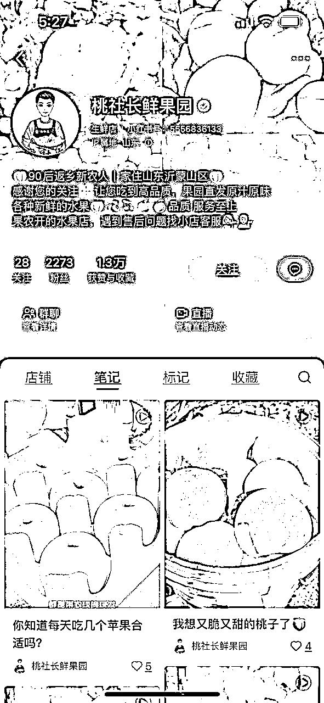

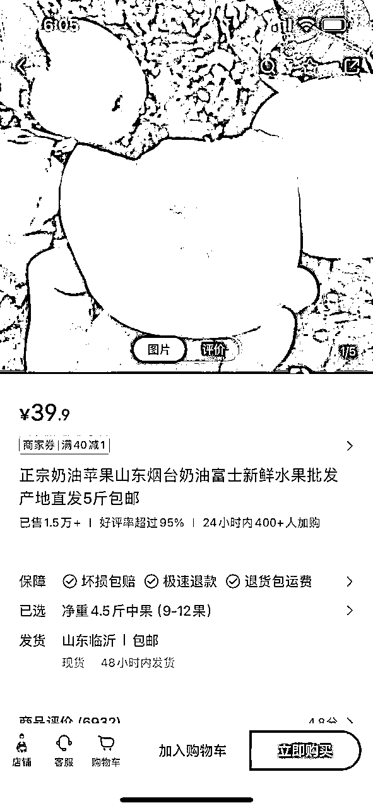

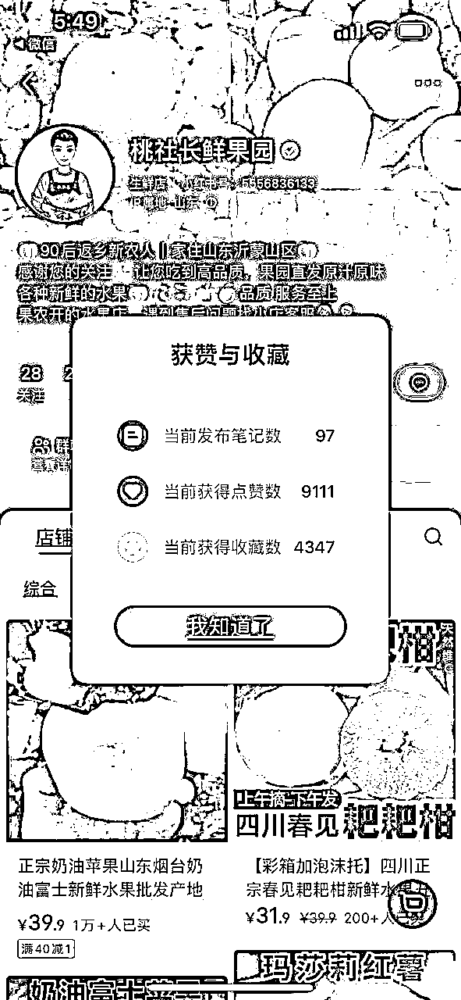

https://www.xiaohongshu.com/user/profile/63dcdfa50000000027029015?xhsshare=WeixinSession&appuid=6323dd34000000002303c70a&apptime=1707126598&wechatWid=225c1c2276fb80ba44bfa5ccd871d186&wechatOrigin=menu

1.  青山集(新疆农场)

发布笔记数据： 209篇（赞藏数据如下图） 最早笔记发布时间：10-7

客单价：56元 店铺销量： 1.5万+ 店铺总销量在84万+

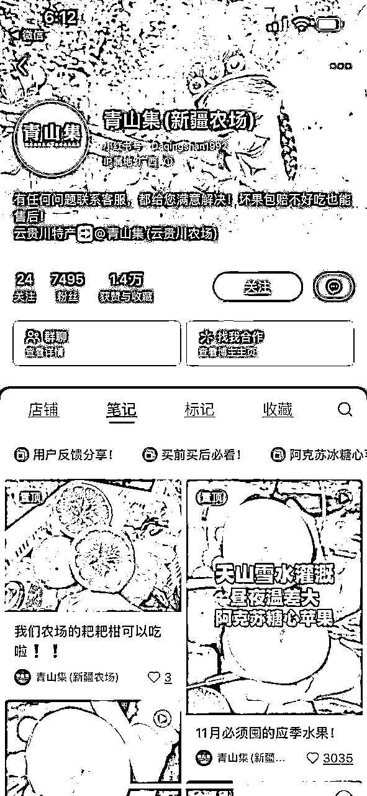

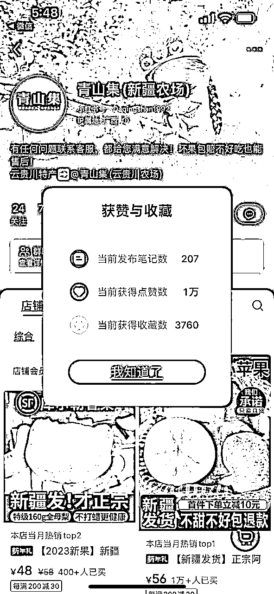

1.  @鲜果时光

发布笔记数据： 482篇（赞藏数据如下图） 最早笔记发布时间：9-22

客单价：56元 店铺销量： 9.4k+ 店铺总销量在50万+

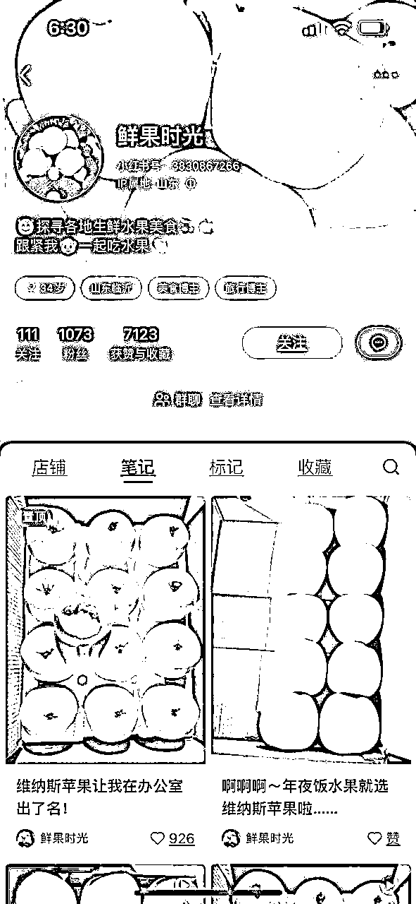

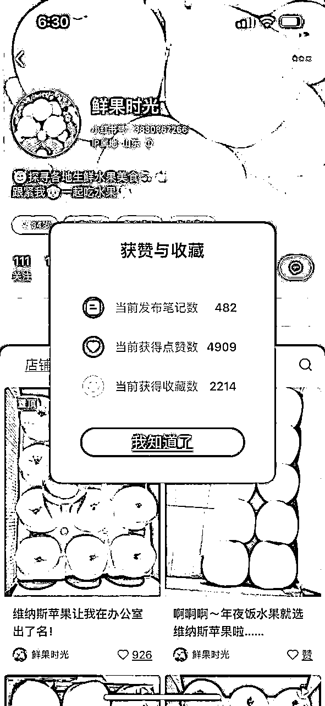

1.  @买买买上瘾啦

发布笔记数据： 310篇（赞藏数据如下图） 最早笔记发布时间：9-13

客单价：19.9元 店铺销量： 3k+ 店铺总销量在6.5万+

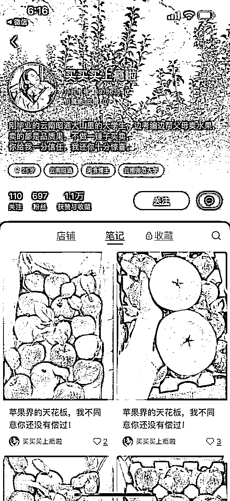

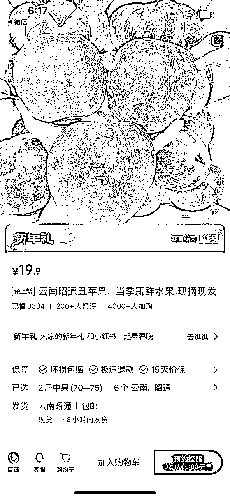

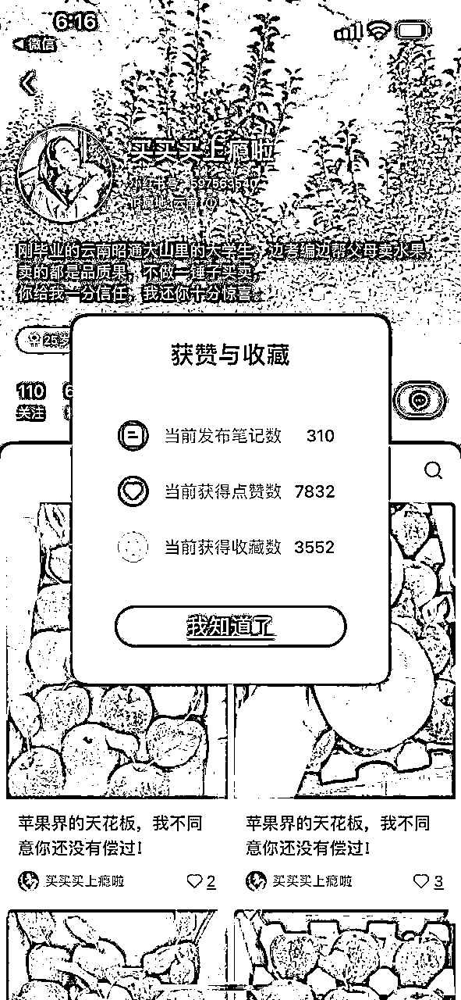

# 一、流量怎么运营？

筛选出来的这四类账号基本都是通过内容来获取流量，没有看到有付费推广，当然可能之前在某个节日，如圣诞元旦这种节日有做推广，现在无法看出来；

账号的包装方向：自有农场果园，学生助农卖货等，背景多以水果或者果园照片为主

笔记内容方向：产品实拍穿插发货，果园实拍等

部分账号有爆款笔记，但是基本都保持高频率更新，每天至少3条左右，多的6-8条，内容内容基本都是通过产品实拍来实现，有部分有真人出镜，通过通过挂车卖货来成交，有部分博主建立粉丝福利群，人数不多在50人左右。

结论：小红书怼着一个单品持续发笔记，然后找到爆款模板之后，可以迅速起量。

# 二、产品怎么解决？

抖音精选联盟

以上四种不同产地的苹果，从抖音精选联盟都可以查到相应的产品，然后佣金率在20%-30%之间，产品原价比小红书低5-10元

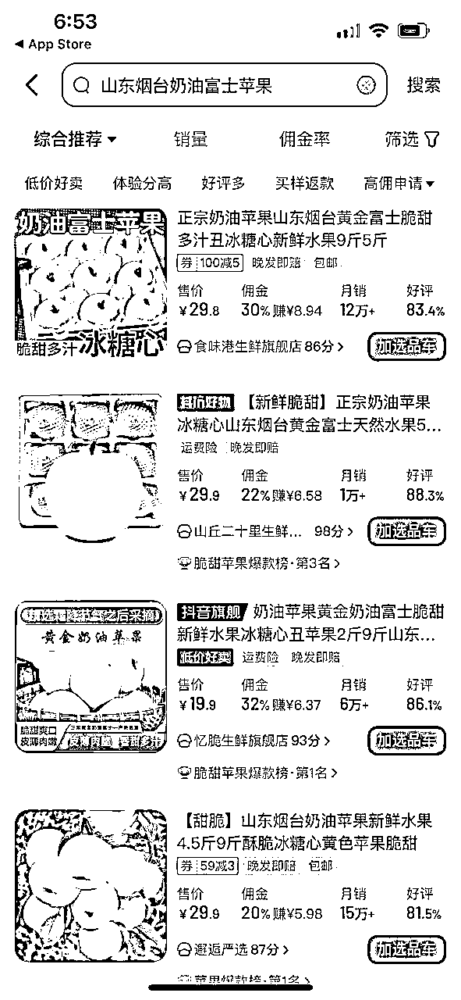

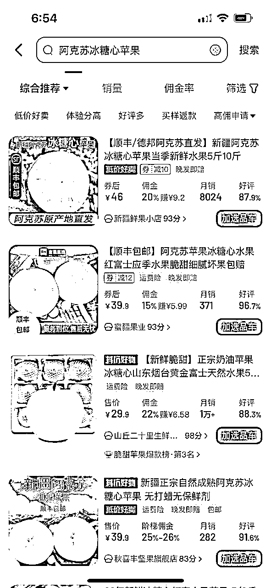

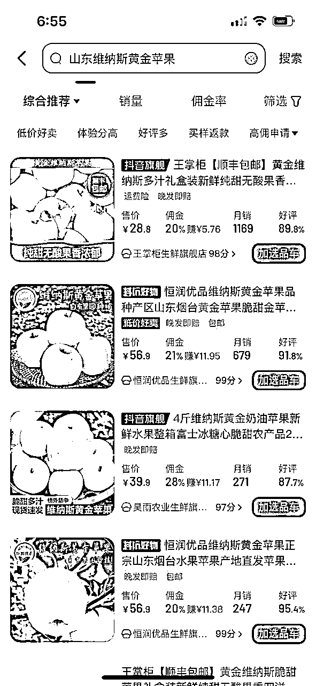

无货源

拼多多或者1688

以1688为例，四种产地的水果都可以找到，定价是小红书定价的50%左右

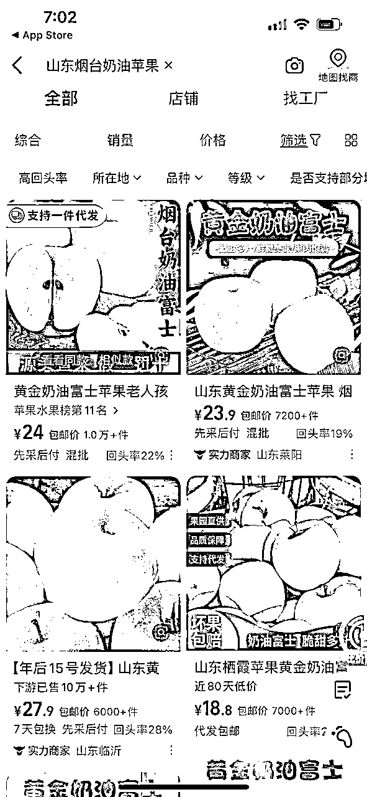

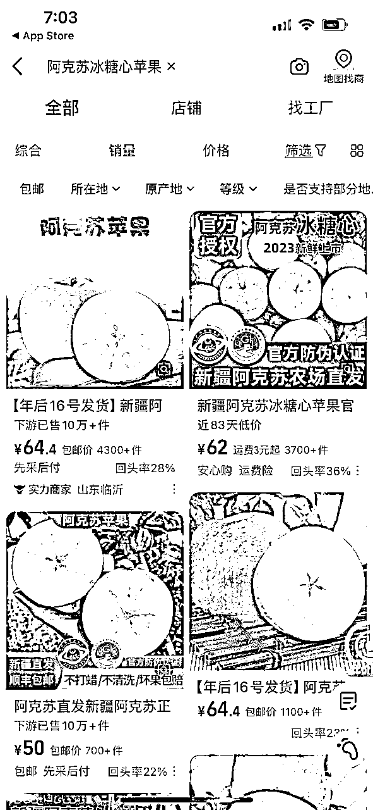

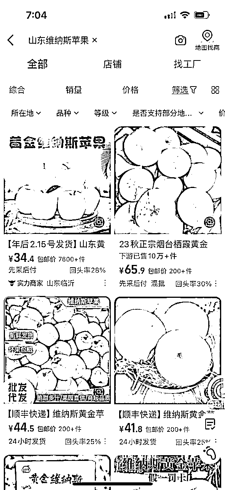

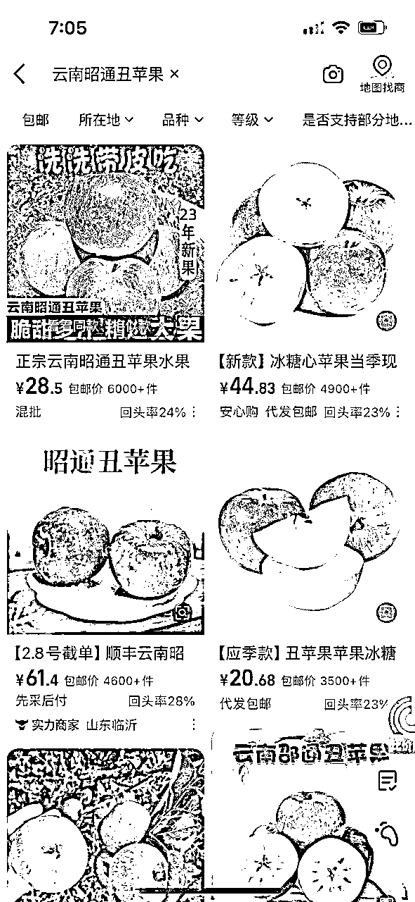

# 三、利润怎么核算？

💡利润的核算非常简单，本质上就一条核心公式：利润=收益-成本

*   收益：可以通过三方数据平台看大致的收益空间；也可以通过店铺销量和销售额，计算大概的gmv。

*   利润率：通过精选联盟看佣金率，或通过不同平台差价，可以看出大致的利润率。

*   成本：需要考虑开店保证金、平台抽成、退货率、人力、物流、售后等多方面因素，考虑的要素越多，最终核算成本越精准。这些成本，可以从星球参考同项目的帖子，找找答案。

1）收益分析

*   利润率20-40%

*   小红书单账号单店，0经验的新手博主月GMV做到2万-3万左右平均水平；

2）成本分析

*   资金投入：小红书开店保证金+少许投流费用+垫付资金+工商执照费用（个人店不用）。小红书开1家店的费用=1000+垫付资金

*   正常退货率5%（预估）

3）综合利润

*   按最低算（利润率20%，退货率5%）

*   影响项目最关键的问题：第一水果的质量问题，是否与宣传描述相符，因为口感这些是直接影响店铺评价；

*   第二是物流的问题，水果的新鲜程度会严重影响水果的口碑和质量，如果爆单，是否能够承接住发货的时效性；

*   第三：如果出现水果质量的问题，会包发大面积的售后，比如退货退款，比如仅退款等等；

因为我本人没有做过生鲜类产品，所以保守估计，这个项目如果能够找到匹配的供应商，解决上面三个问题，那么利润率保守在15%以上，如果是自有果园，然后没有小红书经验的新手，单个账号做到GMV在2万左右，赚点零花钱是OK的。

# 四、项目如何做&如何放大？

综合上面的结论，我们可以给出一套属于自己的路径。

以4的小博主为例，我们优先梳理：

*   项目的整体玩法是什么？靠图文怼量起号，挂车卖货。

*   产品怎么解决？选品怎么选？走无货源模式则开通店铺，自己对接供应链，缴纳一系列保证金。自有果园的，联系物流自己发货，只有内容制作成本和小红书开店成本；

*   流量怎么来？参考上面我发的对标账号的内容，进项账号包装起号；

*   项目如何放大？通过多账号运营的模式来放大，可以开个人店，也可以开企业店，1个企业店关联6个子账号来卖货。

具体操作流程：

1.  开通店铺

1.  资金投入：保证金+少许投流费用+垫付资金+工商执照费用（个人店不用）。小红书开1家店的费用=1000+垫付资金

1.  开店：一个人开2-3个店；前期用自己和家人的身份证开店。后期跑通路径之后可以开企业店做账号关联。

1.  图文起号

1.  基本要求：画质清晰，数量大于等于 2 张

1.  图片来源：自有果园的可以自己实拍，也可以找其他平台的素材；

1.  图片去重：其它平台素材通过加贴纸水印、抠图、拼图、提升画质等方法，进行去重

1.  连怼玩法：一天至少5条图文，用数量博取爆款概率。

1.  果园直播

1.  可以在果园场景进行直播，或者发货场景直播

1.  直播时长：每场直播2-4小时

# 五、项目结论

从上面的分析来看，如果是自有果园的新手生鲜类账号内容制作相对简单，持续高频发布垂直内容，新手单账号收益总销售量2-3万，赚个几千块钱是没有问题的，按照15%净利润来算。

因为自有果园有稳定供应链，一旦流程跑通了之后，解决好爆单采摘的人力成本和发货的问题，通过直播提升流量转化效率，也可以通过矩阵账号来放大。