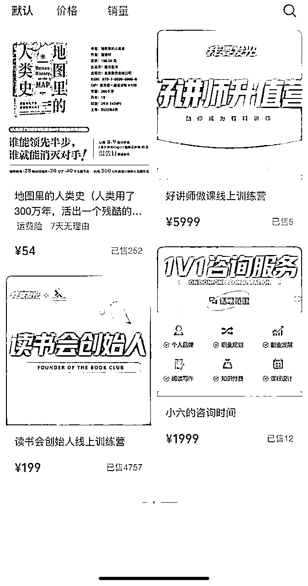
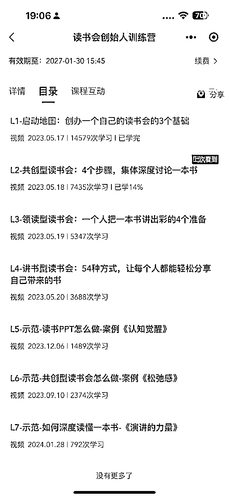
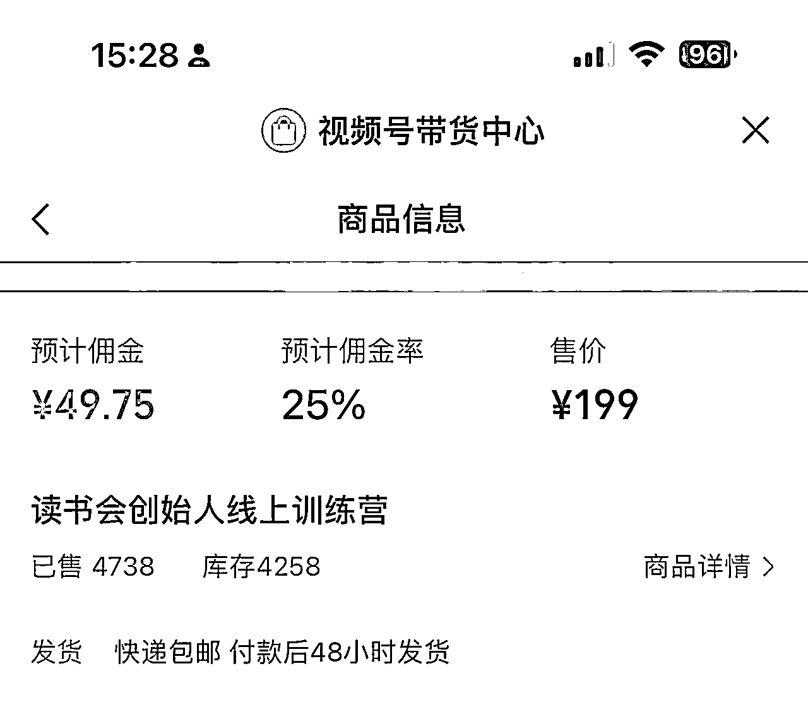
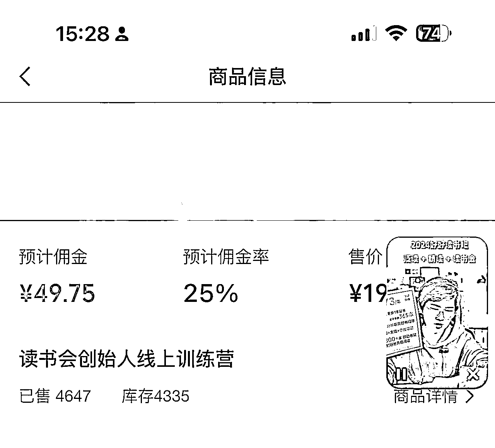

# 风向标拆解第3期--视频号高销量的知识付费是怎么玩的--阿坚

> 来源：[https://ov105yyd40.feishu.cn/docx/WZDBdFvFpo32r6xLA93ctZCLnkf](https://ov105yyd40.feishu.cn/docx/WZDBdFvFpo32r6xLA93ctZCLnkf)

视频号刚出来的时候，就拿到内测资格，当时总觉得是个机会，却一直没有行动，现在2024年都已经过去了一个月，感谢生财、感谢鱼丸让我开始认真去研究视频号，这也是我第一次尝试去做拆解，旨在抛砖引玉，引来更多生财的兄弟姐妹们的真知灼见。

抖音，记录美好生活，现在更趋向于兴趣电商，更适合在抖音做生意，而小红书则帮助用户更好地做决策，在我看来，视频号是一个鼓励人人都可创作的平台，更加聚焦在普通人，鼓励普通个体去创作。

之所以选择这个课题，是因为作为普通人的我，也想切入这个赛道，去做成这件事情。所以我在刷视频号的时候，聚焦点就会放在“普通人也可以做的知识付费”，我关注到普通人有两个切入点，一个是【读书】，一个是【口才】。

这一期我拆解的，是从【读书】入手，我关注到不少读书账号，都在推同一个产品《读书会创始人》，这是一个教用户成立读书会的产品。

这个博主在橱窗总共有4类产品：

1、《读书会创始人》199元

2、1V1咨询 1999元

3、《好讲师做课训练营》5999元

4、书籍

# 流量怎么运营

观察了3天，我发现发起人主要经营“社群”、“朋友圈”、以及“视频号直播”，用个人微信，将每个有意向做读书会的人群都加上微信，并邀请进入社群，设定好社群规则，基本以社群自行共创为主，目前共有10个社群，他的主要工作是，提供好社群服务，提供答疑，然后社群里其他人自发地去帮助他做裂变。

所以流量来源于：社区成员出摊直播，吸引流量。

只要你觉得做读书会能够赚钱，你想尝试赚这一笔收入，那你就会自发地为发起人去推广裂变拉新。

# 产品怎么解决

产品其实为两个方向：

1、帮助读书会创始人成功建立读书会，获得变现（读书会创始人产品）

2、帮助他人成长（咨询、读书会活动、书籍、进阶培训课）

而且引流课程就在小鹅通进行实现，并且在第一期直播的时候，把录播变成了课程即可了。并不需要再单独录课。

# 利润怎么核算

今天的拆解重点关注他的199元这个产品。

我是1月31日下午15:28下单了这个产品，很顺滑地我也选择分佣这个199元的产品，也就看到了以下的数据：累计已售4647份，而在写本文的时候，正好是2月3日下午15:28，我也看了一眼最新的数据，累计已售4738份。刚好3天的时间销售91份，扣除掉我那份，正好平均一天成交30份，毛利149元/份（分佣需扣除25%），可见产品发起人日进4477元起，还不包含其他收入。

最关键是，这些产品的销售，是购买了这些199元产品的人们自发地帮他去推广，我就是看到一个读书主播，然后为了完成作业才下的单。

这仅仅是将近5000人的社群人数，其中只有87人为其做分销所带来的结果

每成交1单，就意味着多1个人为他推广产品的可能性，在我看来随着时间的推移，这种被动收入日入过万很简单。

对于我们普通人要做的话，前期可以拿对方的产品来做，只赚取分佣，每笔50元。同时也可以复制对方的模式，设立属于我们自己的社群，至于定价就看我们自己来定。

# 项目如何做&如何放大

这个项目本质上是教别人如何在业余时间赚钱的项目，也就是以读书作为切入口，以书的主题来吸引相应的精准流量，把门槛降低为“爱读书”的人，因此让普通人也可以参与到进来。如果我们自身精力充足，就可以复刻发起人的模式，开始发展会员。如果没有足够的精力或者能力去解决会员问题，那就可以依托发起人的社群，只赚取分佣。

另外发起人当前的交付并不是很重，也没有足够多的社群运营，假如他能够提升分销转化数量，当前4738个社区成员，只有87个分销达人，转化1.8%，假如这个转化比能够去到10%，那么带来的裂变速度将呈指数级增长。

所以想要尝试去做大，一可以多平台拓宽渠道，二可以做好转化。

作为第一次拆解，就写到这里吧！接下来我打算深度参与进去，并且我并不想只建立一个读书会社区，还要结合演讲，边读书边提升演讲的社区。

期待与对这个课题想要进一步延伸的圈友可以链接起来😀