# 二，GPT批量写文机器人

> 来源：[https://fqlleg2dnfa.feishu.cn/docx/IExqdkEOYoyLvKx9idYcOvYknUg](https://fqlleg2dnfa.feishu.cn/docx/IExqdkEOYoyLvKx9idYcOvYknUg)

目前实践应用于电商&小红书&公众号领域，有需要可深度线下交流。V：zhuhou-xi

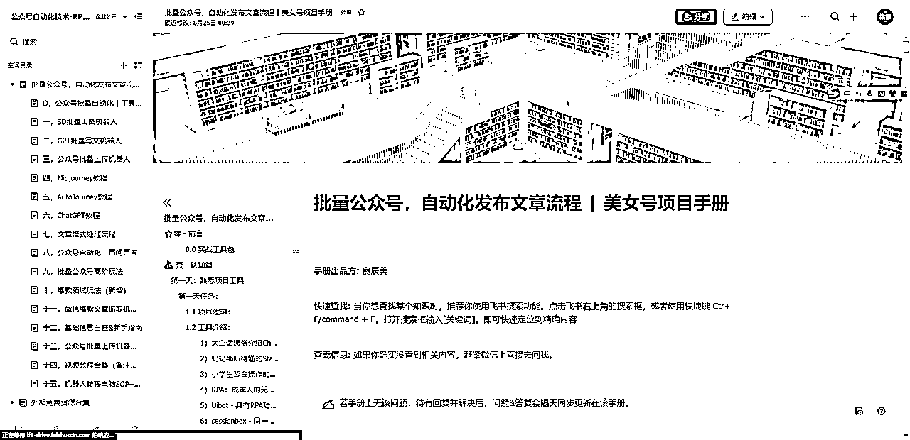

机器人写完内容后，如暂停机器人再开启，则需要先剪切完前面GPT输出的内容。

### 一、 概述

GPT批量写文机器人是一种基于OpenAI的GPT（Generative Pretrained Transformer）模型开发的自然语言处理工具，其目标是生成高质量、连贯、有深度的文本内容。该机器人利用了大规模预训练语言模型的优点，能够理解和生成自然语言文本，使其成为一种强大的写作工具。

GPT批量写文机器人能够在多种场景中派上用场，包括但不限于内容创作、文章生成、自动回复、编程帮助、教育辅导等。用户可以提供简单的提示或特定的问题，机器人会根据其训练数据和算法逻辑，生成一篇或多篇满足用户需求的文章。批量写作功能使其在面对大规模文本生成需求时，能够提供有效且高效的解决方案。

##### A. 机器人运行逻辑：

##### B. 必备条件：

### 二、主要功能

##### A. 基础目的

通过预先调整好的Prompt，两次发送时获取两次的GPT输出结果。

输入的PROMPT分别在表格的SHEET1工作簿，输出的结果分别SHEET2的工作簿。

##### B.高阶调试

用户可自行调整PROMPT的内容，和向GPT发送的次数。

### 三、下载安装机器人

##### A. 机器人运行环境：

##### B. 机器人压缩包：

##### C. 配置步骤：选择Uibot创造者Creator

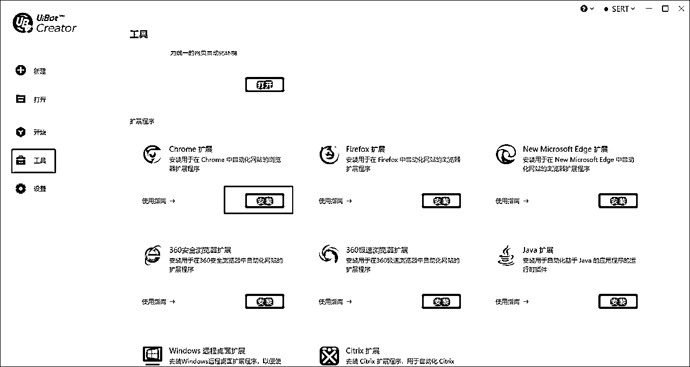

点击打开

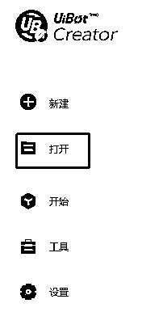

选择对应文件夹

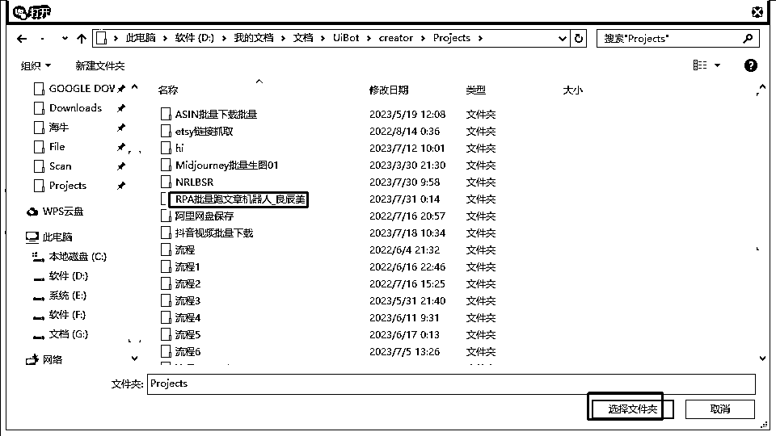

##### D. 开始运行：

点击运行，请注意，务必保留ChatGPT浏览器页面打开登录状态

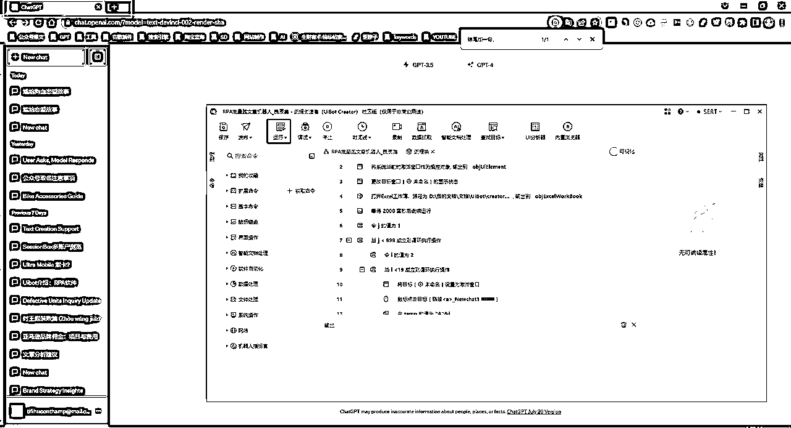

##### E. 机器人运行要点

由于PROMPT提示语较长，可能需要页面缩放80%，以获得页面的复制按钮。

<h9>1）循环次数</h9>

修改这个数字即可改变循环重复次数

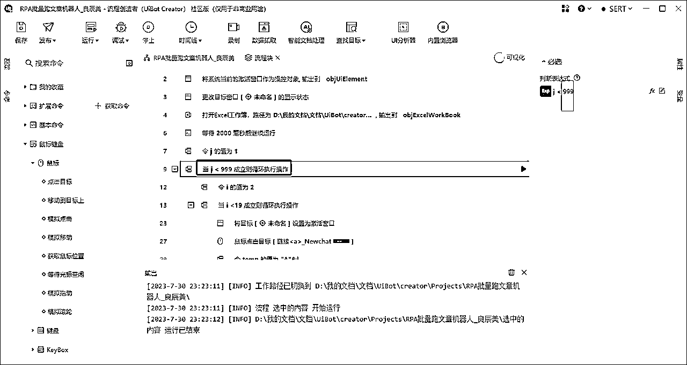

<h9>2）第二段Prompt复制输出内容</h9>

机器人通过“结尾加一句”来识别到第二次GPT输出的复制按钮位置，因此如果改动了prompt2，该识别语句需要同步修改即可

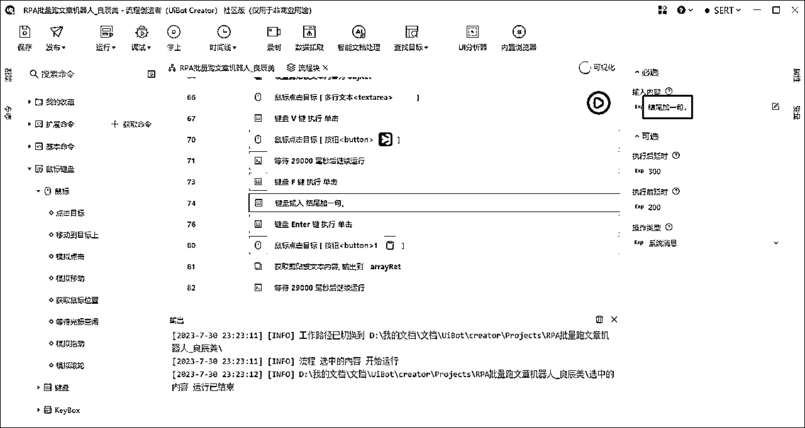

<h9>3）运行前请关闭模板表格，否则第二次打开表格处于只读状态，无法保存导致机器人报错</h9>

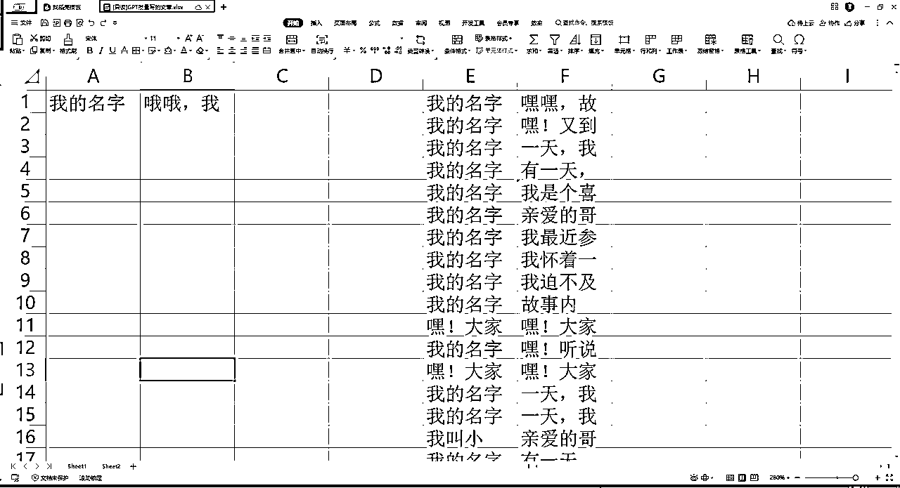

##### 4）如何点击机器人运行？

<h8>第一种：</h8>

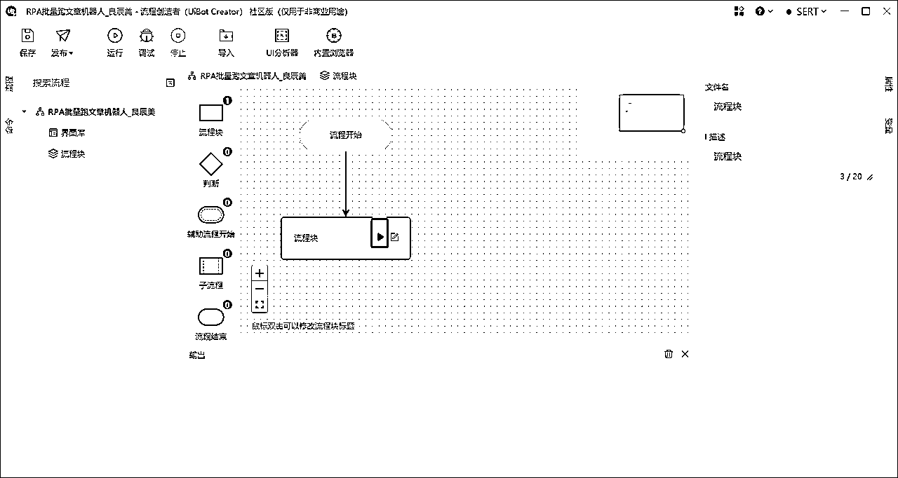

<h8>第二种：</h8>

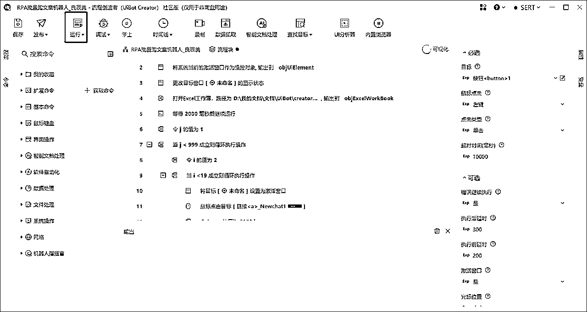

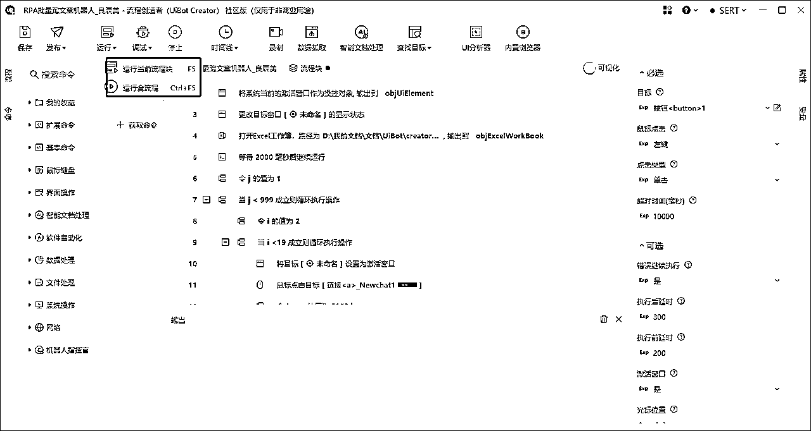

如果报错，运行路径不存在，则按照如下调整：

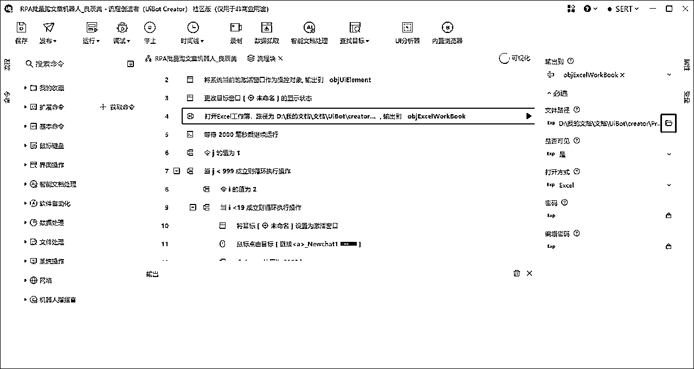

请注意，GPT不要使用ARPM的插件，否则会影响复制内容

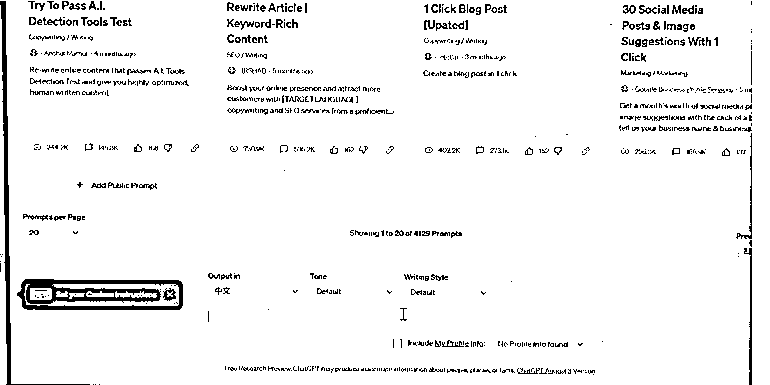

##### 5）运行完成后，剪切完SHEET1工作簿的输出项A和B列内容，否则会新产生的内容会覆盖住旧有内容，机器人每次都是从A1开始写入内容。可以新建工作簿，也可以剪切到右边的其他列。

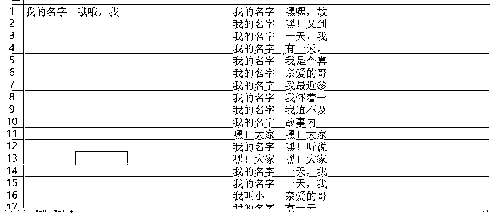

### 四、表格内容模板

##### A. 起始表格

<h9>1）表格文件位置</h9>

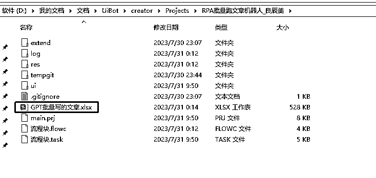

<h9>2） 表格内容说明</h9>

sheet1初始状态是空白，

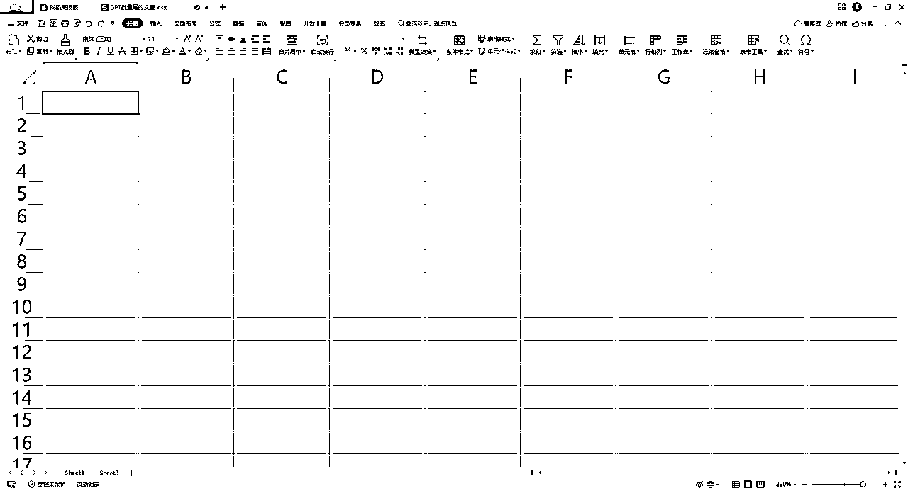

sheet2是prompt语句，2-20列循环使用，可以替换为你的Prompt，但请勿删除

##### B. 完成状态

机器人会依次在Sheet1空白表格工作簿写入GPT输出内容

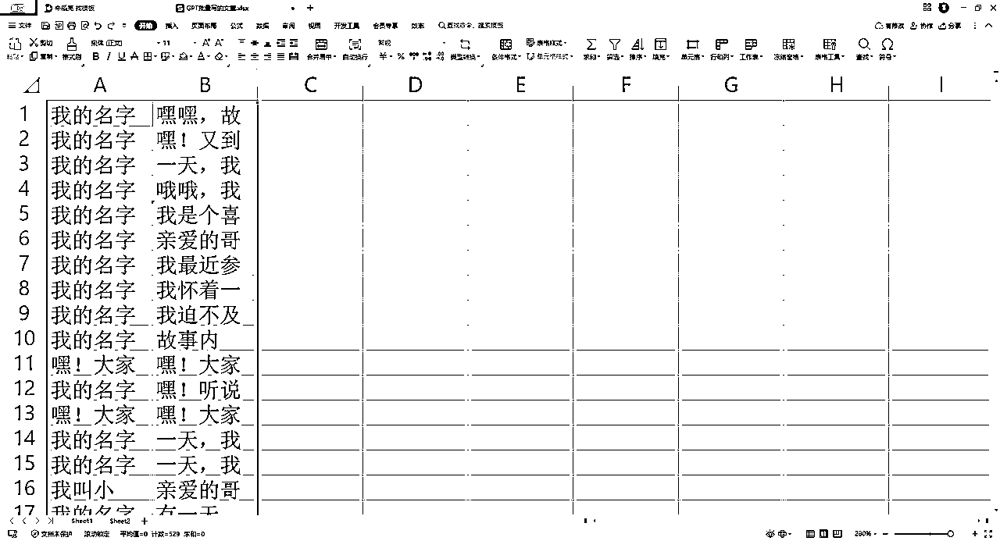

### 五、使用说明

##### A. 常见问题

##### Q1 机器人报错怎么办？

提供出错截图，请务必全部界面截图，包含以下三部分

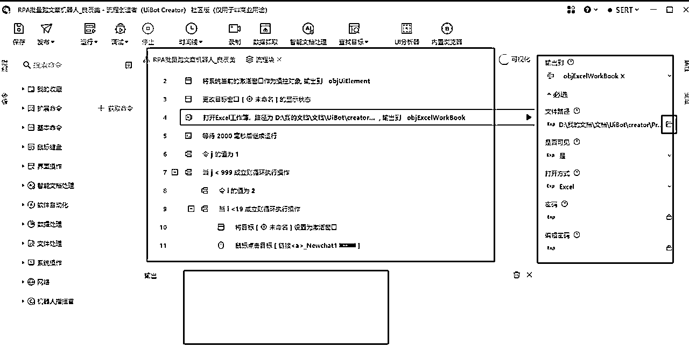

##### Q2 EXCEL输出工作簿sheet1无任何内容怎么办？

请先确保GPT运行正常，浏览器页面处于GPT页面时点击RPA的运行机器人

这种情况都是GPT出错。

##### Q3 机器人运行完成怎么办？

剪切走SHEET1的输出内容，保持空白界面再开启下一轮下机器人循环，或者保持机器人长期运行，把循环数字修改为99999

##### B. 注意事项

*   ChatGPT3.5版本，每24小时限制500次会话左右，每个小时限制50次左右；ChatGPT4.0版本，目前（2023.07.30）每隔3个小时限制50次会话。

*   电脑安装软件过多（30+），内存过小（2G以内），可能会导致运行出错。