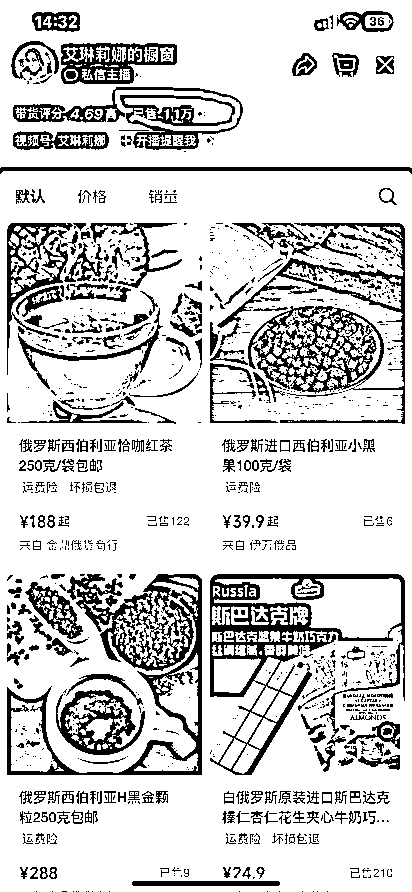
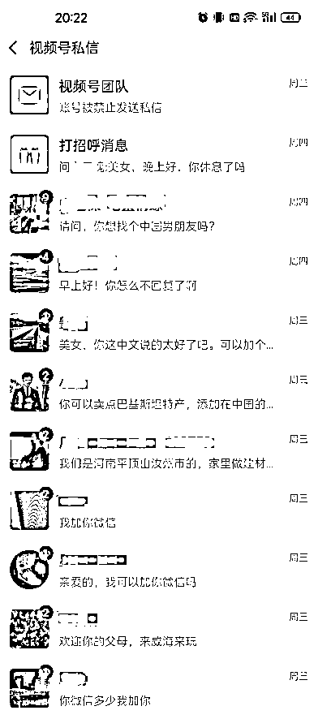
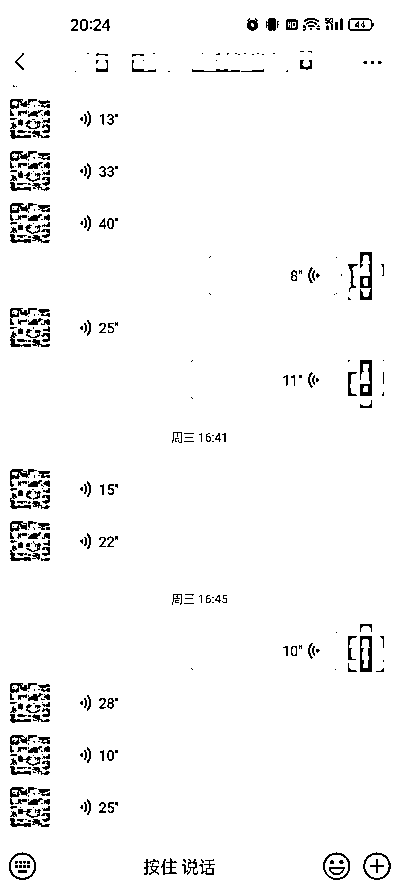
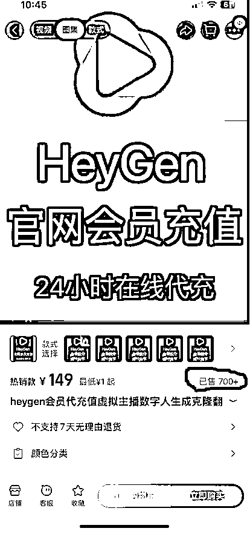
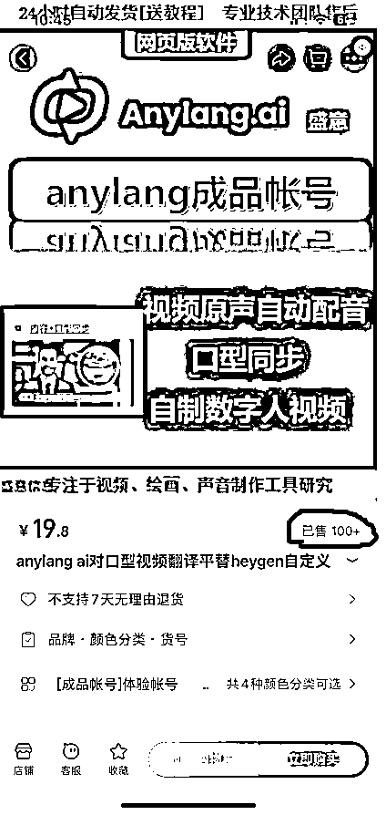

# 海外美女数字人变现场景全解析（万字长文）

> 来源：[https://pe3zzbrwvl.feishu.cn/docx/WeoVdYJl4o1LxkxsunKcXSignte](https://pe3zzbrwvl.feishu.cn/docx/WeoVdYJl4o1LxkxsunKcXSignte)

此文档仅供生财内部交流学习使用，侵权倒卖、非法传播一律追究法律责任。咨询/举报微信：jingdu2024

大家好，我是Pony，没想到这么快又和圈友们见面了。昨天我在生财第一次发了一篇长文后，没想到获得了这么多圈友的支持与鼓励，有无数圈友找我沟通交流，一起探索数字人&其他领域的学习以及变现，我从中受益匪浅。生财真的是一个超级超级棒的社群，我真的没有想到，我这样一个社恐自闭的男青年，也能在这里找到存在感，能收获许许多多同频的、想要通过自己努力来赚钱的圈友们的支持，我内心感到十分的欣慰，也给自己增添了更多的自信。感谢生财提供一个如此宝贵的平台，让我这样的普通人也能迅速成长，通过在社群里不断地向其他圈友们学习，自己也能凭借努力去过上更好的生活。

接下来的第一部分内容是关于我个人成长以及创业的所有经历，内容有些长，不感兴趣的圈友可以直接略过、进入第二部分的正题内容：

我出生在湖北的一个小镇，小镇不大，15分钟就可以逛完，镇上的人大多也都在同一个国企工作，我的父母都是普通工人。我上学比较早，班上同学的年龄都比我大，我在学习中接受能力总是比别人慢一拍，这使得我总是得付出比别人更多的时间、更多的努力才能达到一个平均水平。而且自幼身体也很差，三天两头生病，很少参加班上的活动，这也导致了我在班上没什么朋友。不过凡事都有利弊，以上的诸多因素也造就了我从小几乎把所有的精力都花在了学习上。人家在学习，我也在学习；人家在娱乐，我还在学习。从小学到初中，我的成绩一直在班上、甚至在年级里都名列前茅。

初中毕业后，我考进了全市最好的高中，也从小镇来到了市里。来到市里后，我还是沿用了之前在镇上的学习方法，但成绩始终排名中下游，无论我怎样努力、各种卷自己，晚上学习到11点、12点、甚至到凌晨1点，成绩始终上不去，这也让我备受打击。由于性格内向，不擅长与人交流，我的解决方法就是通过购买大量的参考书籍提升自己的知识面。虽说成绩有所提升，但还是存在两个短板：物理和地理这两门成绩严重拖后腿。我试过无数方法去提升，但很无奈，效果都十分不理想。高二分科后，两者取其一，我选择了文科，但地理成绩拖后腿的问题一直无法解决，这也让我无比懊恼。学习是我当时唯一的精神寄托，无奈之下，我只能向我的父母求助，跟他们讲述了我的实际情况，希望他们能帮我请一名家教来提升成绩。但由于认知上的局限以及我过往极其独立的学习习惯，我的父母非常不理解我，认为成绩上不去我是没用功，建议我多请教老师，不需要请家教，小孩子不要乱花钱。在我数次向他们请求皆遭到明确拒绝后，我这才意识到父母真的无法理解我，也无法给我提供任何帮助，这让我感到心灰意冷。对于一个16-17岁、处于叛逆期的孩子来说，这种心理上的打击相当致命。

我开始翘课，去网吧上网找陌生人聊天以寻求慰藉，偶尔玩下单机小游戏打发时间。时间一天天地很快就过去了，转眼到了高考倒计时100天，眼看着黑板上的时间在逐渐减少，一种焦虑的心情也随之袭来。突然有一天，我坐在教室里想到一件可怕的事：如果我继续保持现有的状态，我的人生会不会就这样荒废了。如果高考失败，我的最终结果可能就是父母常在我耳边叮嘱的：毕业后，你就回到咱们小镇，在当地的国企找个班上多好。每每想到这，我整个人就会变得非常抑郁，在一个无聊的小镇，每天过朝九晚五的生活，十年如一日，真的太生无可恋了。在这种近乎绝望的心情之下，我开始拼命的学习，想把之前落下的知识补回来。而现实似乎也在朝着我想要的方向在发展，我的成绩开始逐渐提升，虽然仍处于班上的中游水平，但至少让我看到了希望。只不过对当时的我来说，无法认清一件事：心态不好，将严重影响接下来发生的每一件事情。

高考很快就来了，考试全程我都觉得无比轻松，因为平时做的模拟题比高考难多了。数学考试不到1个小时我就做完了，心里得意满满，做完后也懒得检查，趴在桌上无所事事，甚至睡着了，监考老师把我拍醒、提醒我检查一下，可我依然无动于衷。高考结束后的第二天，我妈买回报纸让我估下分，我压根儿就没打开看，心里觉得稳着呢。等高考成绩正式公布时，我整个人直接傻眼了，怎么才400多分，我简直不敢相信自己的眼睛，第一感觉是改卷老师肯定给我弄错了，我要申请重新阅卷。但身体还是老实的，我赶忙翻箱倒柜找出报纸去核对每一题的答案。不看还好，一题题的对照过后我才发现，题目是不难，但由于我糟糕的心态，题目大多都算错了。如果说题目不会做，那我也认了。但如果是因为自己粗心大意、心态不好的原因而导致，我内心真接受不了这个惨痛的后果。

高考失利是我人生中经历的第一次重大打击，万般无奈之下，我只能去武汉的一个三本院校读书，选择了自己喜欢的专业：英语。说实话，这个心里落差真的太大了，镇上许多成绩远不如我的同学，至少都考上了一本、二本，而我则成为了一个天大的笑话。之前我是老师和同学家长们口中的榜样，现在直接成了反面教材。现实就是如此的残酷，但也没什么好抱怨的，你有今天全赖你自己，心中安慰自己只有在大学多努力了。

进入大学后，我发现周围的同学分成了截然不同的两类：一类是死读书的，抱着字典啃的书呆子；还有一类是每天在宿舍打游戏或者忙着谈对象的。我感到格格不入，我只好把自己完全封闭起来，每天不是在教室上课，就是去图书馆埋头学习，饿了就去食堂吃点，宿舍也只是一个晚上回去睡觉的地方。除了学习，我对其他的事情都不感兴趣。

在此期间，还发生过一件事，让我备受打击。新生刚进校时，外国语学院组织了一次英语角，高年级的学长学姐与我们新生交流口语。我虽然性格内向，但心里十分清楚口语对一个英语专业学生的重要性，因此也鼓起勇气在人群中发了言。没想到刚一开口，就被一个学姐打断了，指出我这个单词重音读错了，口音也十分奇怪，周围人开始哈哈大笑，有几个人甚至嘲笑我是印度口音。慌乱中我逃回了宿舍，把自己关在洗手间里大声痛哭，睡觉时把头蒙在被子里继续哭，还不敢哭出声，怕舍友听见，感觉自己真是个废物。

过了几天，我才慢慢地接受了自己口语差的现实，由于我从未练过口语，发音极不标准，因此哪哪都有问题。接下来要怎么办？我只能用最蠢的方法，把课文里的音频用MP3反复地播放，自己跟着一句句读，把自己读的录下来听，直到听不出与原声有任何差别，再回宿舍放给室友听，直到他们也听不出来，我才会继续学习下一篇课文。

有一次，从同学口中得知华中师范大学有一个全武汉最知名的英语角，武汉各大高校的学生都会去那里交流口语，我认为这是一个绝佳的练口语的好机会，于是和室友们一起去了华师，但没想到这次迎接我的会是更大的打击。我清晰地记得，当时我站在两个武汉理工的男生身边，听他们在发言，他们邀请我加入。在询问了我的学校和专业后，他们和我聊了几分钟，然后就发生了令人极其崩溃的事情。其中一个男生用英语很不屑地说，就你这学校，你还英语专业，口语还不如我这非英专，也太可笑了吧。

那一次去华师的惨痛经历，直接导致了我和室友们备受打击，他们表示以后再也不会去了。我内心其实也相当崩溃，但没办法，现实就是你现在确实很菜，在优秀的圈子里被人收拾了。就这样放弃吗？我心里对自己说。不，坚决不，我现在确实很菜，但我必须不断地坚持学习，去经历无数次的碰壁，每次都能从中发现自己新的问题，只有这样我才能迅速提升。

接下来的日子里，我平时都在图书馆埋头苦练口语，每周四、五不下雨的话，都会去华师参加英语角。这样的日子持续了三年，直到有一天我再次遇见了那两个武汉理工的男生。这一次我十分自信地走向他们，跟他们打招呼，简短聊了不到一分钟，我就看到他们露出了惊讶、不敢相信的眼神。直到那一刻，我才真正地意识到，我已经不再是过去的我，我现在已经是全新的自己了。回学校的路上，我没有选择坐公交车，我步行走了半个多小时，这一路上我的眼泪哗啦啦地流了下来，时而忍不住笑出声来，旁边人肯定觉得我疯了，不过我一点也不在乎。这一路走过来真的太不容易了，至少我为自己这三年来所取得的成就感到骄傲，心里对自己说，Pony，你是最棒的！

这件事也成为了我人生中的一个重要转折点，我开始学会去认可自己，并相信只要自己坚持努力，最终肯定会有回报，这点也在之后得到了印证。大三下学期，同学们有的准备考研，有的开始找实习机会，而我却还在苦恼如何解决温饱问题。由于家里出了变故，我每个月只能得到600块的生活费，除了吃饭，我还得拿出一部分充话费、买书、坐公交去华师参加英语角。夏天还好，冬天真的是饿的眼冒金星。被逼无奈之下，我只好硬着头皮去找些兼职做做。由于社恐加自闭，发传单、端盘子我肯定不行，做家教能力上我可以胜任，但谁会请一个三本学生当家教呢？

想来想去，我只能在网上搜索各种和英语家教相关的内容。幸运的是，我发现了一个在网上交流口语的平台，叫布谷堂，我在里面找了份主持人的工作，每周一、三、五的晚上负责在平台上组织用户进行口语交流，每周工资100块。只不过没干多久，这个平台就倒闭了，我只好继续搜索，找到了一个叫口语陪练网的网站，面试成功后我开启了在该平台教英语的日子。一开始，为了获取生源，我把单价定为20-30/小时，从1个学生到后来每天7-8学生，为了赚钱，我每天连续7-8个小时不停地给学生上课，期间不敢上厕所、更不敢喝水。每天上完这些课后，我累地瘫倒在床上一句话也不想说，真的太累了，但看着银行卡里多出来的200-300块，心里露出了满意的笑容，这些都是靠自己的努力所换来的。随着时间的累积，我在平台上也逐渐有了人气，课时费也增加到75/小时，我的收入开始不断增长。大四上学期时，我每天固定能有4节课，再接一些其他的散课，每个月收入能够过万，那会儿我们学校老师一个月工资也才3000-4000，这也带给了我极大的自信。

我在大学期间的成果：通过四六级、英语专四、专八，练就了流利的口语，赚了小几万。

为了谋求更大的发展，大学毕业那年的3月份，我一个人拎着三个箱子去了深圳。当时还没有从武汉直达深圳的高铁，我先买票坐到了广州南，再从广州南坐到深圳北。当时我谁也不认识，只知道深圳是一个实现梦想的地方，全国各地的年轻人都来到这里打拼，我想要赚更多的钱，我不怕累，也不怕苦，我相信自己肯定能成功。

年轻那会儿就是天不怕地不怕，每天斗志满满，但还是对这个社会了解的太少。我刚去的第一个月面试了30多家培训机构， 除了2家特别高端的卷不进去，其他机构都给了我offer。我选择了一家工资开的最高的机构，底薪5000，再加课时费提成。这家机构是做出国培训的，位于海岸城的一个5A级写字楼里的32层，刚去我就享有独立办公室，全景落地窗以及全新的电脑。我记得那会儿几乎每天都排满了课，一天要上8-10节课，甚至说好的每周一休息都要加班。由于客户群体主要是深圳的四大高校的准备出国的学生，因此备课压力特别大，我每天备课到凌晨三四点。在极度疲劳的状态下煎熬了几个月，最终由于体力不支，我病倒了，只好辞去工作回到小镇休养。调整了一段时间后我再次返回深圳。

这次回来后，我认清了一点：赚钱是很重要，但也不能拿命去换，还是得把握好度。有一位去美国打工的同学在QQ上跟我联系，问我最近咋样，我简单说了我的情况后，她感叹道：还不就是赚钱那点事吗？你知道我现在从美国给亲戚朋友带保健品，一个月可以赚好几万呢。我直接愣住了，竟然还有这么赚钱的买卖。在和她详细了解过后，我们达成了共识：她负责从美国供货，而我负责在国内开淘宝店负责店铺运营和接待客户。就这样我稀里糊涂地开启了在淘宝做电商的日子。说实话，当时真的挺难的，我一个英语专业的人，从来也没接触过电商，完全就是从零开始。我自学了如何开店、制作素材、上架商品、店铺装修等一系列内容，但最终我得到的结果是三个月没有开单，之前大学赚的钱也快花完了。再这样下去，我只能打道回府了。由此可以说明一点，没有经过自己深入细致的观察和研究，就贸然开启做一件事，极大概率会惨淡收场。

无奈之下，只能继续寻找出路。虽然稀里糊涂地进入了电商这个行当，啥也没赚到，但我当时心里可以确定一点：从美国进货，拿回国内卖，这条路是肯定能走通的。关键是卖什么品。算了下我的存款余额还能维持在深圳一个月的生活，既然如此，那就再给自己一个月的时间去做电商，实在不行就只能去找份工作了。我开始在美国最大的电商网站亚马逊上找机会，先从自己了解的运动鞋下手。我搜索了平时穿的运动鞋，没想到还真被我找到了一个突破口，在国内卖800多的新百伦运动鞋，在美国才400多，即便加上运费（当时还不扣税）还能净赚300+。巨大的价格差让我激动不已，接下来的任务就是如何把鞋子买回来。我在网上一通搜索后，发现招商银行的双币卡可以在亚马逊下单，寄到中转仓然后发回国内即可。说干就干，我很快下单了，苦等20多天终于到手。拆开包装、仔细检查、穿了一周后，我发现不仅价格比国内的便宜，鞋子质量比国内的好太多。虽然都是MADE IN CHINA，但同一个厂家出售给不同国家的货质量会差那么多吗？（当时还无法想的太深，只觉得这是一个绝佳的赚钱机会）

我赶紧在淘宝上架了新百伦的三双热门款球鞋，在朋友圈里也宣传了一波，没想到很快就有人下单了。在接下来的一个月里，我每天都能出10-20单，除掉成本，第一个月我赚了4万多，这比做英语培训轻松太多了。不过由于自己电商经验不足，再加上同行恶性竞争以及投诉，我的店铺最终还是关闭了，但无论如何，做电商再次开启了我新世界的大门，这也为接下来出现的新机会埋下了伏笔。

起初是有个女同学在朋友圈得知我可以从国外买东西，拜托我从美国买一双Keds鞋，我欣然答应了，举手之劳而已。鞋子拿回来后，我左看右看，就这么一双普通的帆布鞋，质量也不咋地，不知道有什么值得喜欢的地方。后来和她仔细一聊，才发现这鞋大有门道。虽然只是一双普通的帆布鞋，但这是美国著名乡村歌手泰勒斯威夫特代言的，这鞋已经是她所代言的诸多产品中价格最平价的，普通人能买得起的产品。这也是我第一次接触到明星周边产品，之后发生的事情才一步步打开我的格局，让我深刻地体会到粉丝经济有多么可怕。

我在网上开始搜索跟这鞋相关的各种信息，在贴吧里发现了众多的求购贴，心里隐约觉得这是一个巨大的商机。接着我在淘宝上搜，除了个别店铺有少数几款外，几乎没有店铺在售卖这个品牌的鞋。我心中大喜，这简直是一个天大的好机会。但我这次没有选择贸然行动，而是静下心去仔细研究和思考这个产品，我需要更多地了解这个产品以及思索如何去营销才能最大化收益。我最终选择了微博来宣传这个产品，然后引流到微信来成交。当时我应该是最早在微博上带货的，说实话心里也没底，不知道能否做成，但心中有个执念告诉自己肯定行。后来发生的事也印证了这点，在微博刚注册的1-2天里，在只有几个粉丝的情况下，就有陌生用户找我下单了，而且是直接转的支付宝。接下来的日子里，我每天保持日更，平均1小时更新一条微博，一天保持10条左右的更新，手机24小时开响铃模式，但凡有客户咨询，半夜我都会爬起来回复客户信息。每一双到我手里的鞋，我都会拍实拍图，发货的时候我也会将快递单分享到微博，1年时间我就积累了微博1万粉，微信里也添加了3000多名客户，这个生意我持续做了4年多，赚到了人生的第一个100万。这100万我在老家小城市买了房、车、添置了家具、家电。

我在毕业5年的成果：赚了100万，买了房、车，利用空闲时间考了驾照、教师证，去了国内外10几个城市旅游。

在物质上得到极大满足后，我开始更多地考虑到精神上的需求，这也印证了马斯洛的需求理论。一直以来我心中都有一个执念：在学业上我不甘心只读了个三本，我想在学业上重新证明自己。每次同学聚会时我都感觉低人一等，哪怕通过自身努力赚到了钱、提升了生活质量，因此我决定直面自己的内心，通过考研来提升学历。（直到今年听了曹大的多次直播后，我才意识到自己当时的这个决定是多么的愚蠢，有这时间和精力，还真不如考雅思去英国读个一年硕士，当然这是后话了）

我留给自己一个月的缓冲期，把一些没处理完的订单收尾工作做好，随后注销了微博和微信，决定全身心备战考研（事后看来，这是一个无比愚蠢的决定：放下可以不断入金的生意去追逐学业的提升。不过为了追逐心中的梦想，倔强的我依然不后悔）生意的事情告一段落后，回到了湖北，找了一个当地的大学，在图书馆开启了两耳不闻窗外事、一心只读圣贤书的简单生活。为了能让自己坚持下去，我每天早上五点起床，六点抵达图书馆开启一天的学习，每天的时间按小时精确计算，晚上回家在跑步机上奔跑。跑步是我极其痛恨的事情，因为感觉特别枯燥，但毕业多年后再次回归学习也是枯燥。如果能将两者结合起来，跑步能做到的话，考研自然可以，反之亦然，我就这样坚持了大半年，体重掉了40斤，整个人焕然一新。

但事实证明，我还是想法太简单了，TOO NAIVE, TOO SIMPLE。毕业6年后，你的精力、记忆力等方面和读书那会儿完全没法比，而且你不知道如今的考研人数比往年也翻了好几倍。第一年考研我考了366分，和我同学考研上岸的分数一样，但很遗憾落榜了，时代不一样了，已变得越来越卷。第二年我调整了目标院校后，在图书馆里又闭关学习了一年，每天的生活就是在食堂和图书馆。好在努力没有白费，二战终于上岸了，那一年我正好30岁。

重返校园后，内心的喜悦仅仅维持了几天便消失殆尽，留下来的只是日复一日的课程、论文以及索然无味的校园生活。期间有想过去做一些兼职，但平时学校里的琐事太多，根本无暇顾及。很快三年就过去了，去年6月份我研究生毕业了，也算了却了一桩心愿。虽然过往自己取得过一些成就，但新的时代已然来临，继续沉迷过去的成就只能说明你现在过的很不如意，活在当下，重新开始赚到第一块钱才是当务之急。我之前的那些微商、淘宝经验已成为过眼云烟，现在是直播、短视频的时代了，自己唯有不断地坚持学习，不断地在失败中成长，才能重新找到自己的一席之地。于是我在去年2月份加入了生财，参加过多次航海后，这才意识到这些年我错过了太多的机会，前几年的抖音、小红书、tiktok，如果我不去考研，这波浪潮我肯定都能赶上。但现实就是如此，没有两全其美的，唯有从头再来。

话题扯得有点远，以上是我个人的成长以及创业的经历。下面进入到本文的第二部分，回到正题：海外美女数字人变现场景全解析。圈友如果不了解海外美女数字人这个领域的相关内容，可以查看我的第一篇生财长文：海外美女数字人，屡败屡战，一周变现5W+

根据我过去一周在这个领域所取得的成绩来看，目前海外美女数字人的变现场景主要有以下几种：

1.  通过短视频带货来变现

这种主要是在各大短视频平台，如抖音、快手、视频号以及小红书来发布海外美女数字人的短视频，通过打造热爱中国的人设，引发中老年人士的爱国情怀，产生情绪价值，进而产生消费意愿。这种变现场景的核心是你的数字人模型和文案是否足够吸引人，能达到共情的效果，获取用户的信任，进而愿意根据你打造的人设去付费。

产品有两种：第一种是成为带货达人，在选品中心选品进行带货（优点是不用自己处理发货和售后，直接挂小黄车即可；缺点是你得选好品，不然因为质量问题产生售后影响你的个人信誉，再一个就是利润不高）；第二种是自己开设店铺，从1688进货，优点是利润高，质量可控；缺点是你得自己处理发货和售后。

1.  通过引流私域来变现

这种主要是把那些给你发送私信的用户引流到你的微信，在朋友圈和用户建立更深层次的信任关系，在私域里带货来变现。这里有几个点要注意：一是要格外注重给你发私信的用户，他们都是有强烈意愿和你交流、建立更深的关系，这层关系能否处理好会直接影响你接下来的变现；二是要注意回复视频下方的评论，和用户多建立交流，这样也能吸引更多的潜在用户；三是一些敏感评论一定要及时删除，否则会导致平台对视频进行处罚。

1.  通过出售数字人平台账号来变现

这种主要考验你的信息挖掘能力，怎样能够获取到这些账号资源并进行出售是关键，只要能解决资源获取的问题，接下来的变现就容易许多，毕竟在成本极低、数字人需求如此强烈（看各大平台的数字人短视频有多少就知道了）的前提下，出量是非常快的。我个人认为，短期内这是一个巨大的获利风口（昨天发完第一篇长文后，Anylang就把风控拉满了，谷歌邮箱直接无法注册，后来的几个小时里，我尝试了无数方法，使出浑身解数都无解。不过好在足够细心，找遍全网发现了蛛丝马迹，目前找到完美平替和解决方案）

1.  通过制作海外美女数字人的相关课程来变现

纸上得来终觉浅，绝知此事要躬行。昨天我发布了第一篇长文后，有超级多的圈友找我交流数字人相关的话题。交流的过程中，我发现很多圈友的思路和对内容的理解还是停留在表面，把精力过多地放在了一些非核心的内容上，例如做数字人对电脑的配置要求如何等等。可能每个人对知识的理解程度不同，有些人只需要看到一些思路，得到启发后就能很快上手；而有些人可能需要你手把手地教，一对一的指导才能学会。因此，能否成事还是要看个人的领悟和执行力。这也是为什么现在的学习有如此多的形式，如文字学习、语音学习、视频学习、面对面学习等等。这些课程都满足了不同人的学习需求，因此具备很强的变现能力，我个人十分看好通过课程来变现的场景。

要想在一个领域做出成绩，绝非一朝一夕可以实现。一口吃成胖子真的不现实，你们看我过往的经历便能得知。首先得通过大量地阅读和学习，才能挖掘到一个自己认为能做的好项目，其次需要极强的执行力以及在出现问题时及时的应变能力；再次需要良好的心态以及百折不挠的精神。失败是难免的，人生不如意之事都十之八九，更何况是赚钱呢？关键是要在每次失败中吸取教训，总结经验，在一次次失败中去成长，去提升自己的能力，让自己变得更加优秀。其实我认为最关键的一点是一定要自信，心态真的很重要。失败并不可怕，重新再来过就是了，只要你相信自己能够成功，屡败屡战，总有一天你能实现自己的目标。

感谢各位圈友的阅读，Pony十分感谢你们的支持与鼓励，希望大家在新的一年都能多多赚钱，一起生财有术。你们如果对以上内容有什么不明白的地方，欢迎与我联系：jingdu2024