# RPA+视频号无人直播涨粉保姆级教程

> 来源：[https://ev0ft8k60w2.feishu.cn/docx/XAgYdSyUMoghvCxdjPgcxwtEnqh](https://ev0ft8k60w2.feishu.cn/docx/XAgYdSyUMoghvCxdjPgcxwtEnqh)

最近大家可能都从各个渠道发现了一个小风口，那就是视频号对视频号新号推流力度很大，很多人通过视频号疯狂涨粉。

我实操了两遍，大概理解了其中的原理，并且所有人都可以直接复制，快速实现涨粉。自从有幸担任了航海教练后，经常会思考RPA如何结合场景发挥作用，本文介绍如何通过 RPA 实现无人直播，实现睡后涨粉。

首先简单介绍视频号涨粉的原理及操作

# 一、视频号涨粉原理与 SOP

## 一）准备钩子

要准备什么样的钩子主要跟自身领域相关，例如我是 AI 博主，那么我的钩子就是领取 AI 资料。

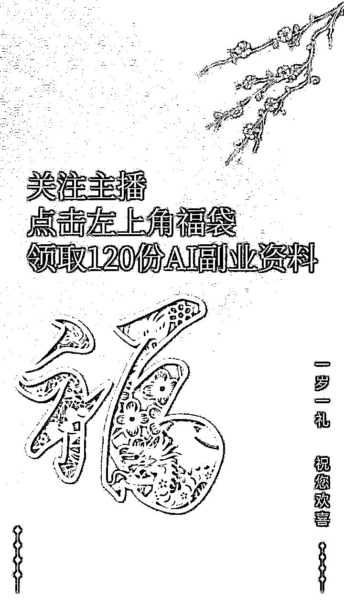

## 二）设置直播内容

1.  设置封面：带有钩子的封面

1.  主题：例如领取 AI 资料

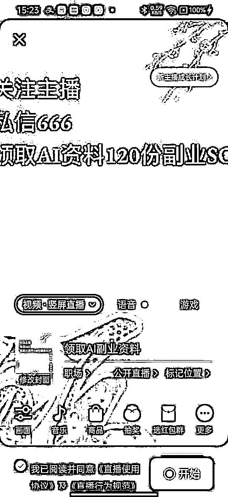

1.  根据自己喜欢关闭摄像头，如果是无人直播就关闭摄像头，背景用做好的钩子图片。

1.  开播后可点击【文件演示】设置高清背景。

1.  设置背景音乐，选择自己喜欢的就可以。

## 三）设置抽奖

设置福袋抽奖可以大大增加与用户的互动。下文会详细介绍如何采用RPA实现自动设置福袋，实现无人直播涨粉。

设置配置可参考：

1、礼物分配选择：拼手气

2、总礼物：可自行选择（注意：是总礼物数，不是单个！！！）

3、中奖名额：1 - 5 个，看热度与在线人数。

4、开奖时间：设置 1 - 5 min

5、用户参与方式：关注主播

6、兑换并发起

经过测试，1-2分钟抽一个福袋效果是比较好的。

## 四）如何涨人气

数据 = 点亮灯牌 + 刷礼物 + 评论 + 引导评论关注点灯牌 + 全平台转发直播间 + 停留时长等

可以加入一些互助群一起做数据。

开播后，可发到群里，发个红包，互相上灯牌+点赞+停留 3 - 5 分钟，这样可以让视频号更好地推流。

同时，新号记得用一下官方送的流量券。

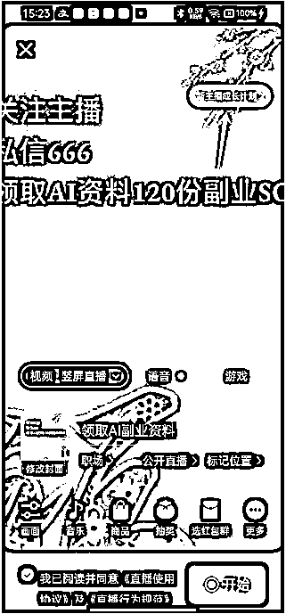

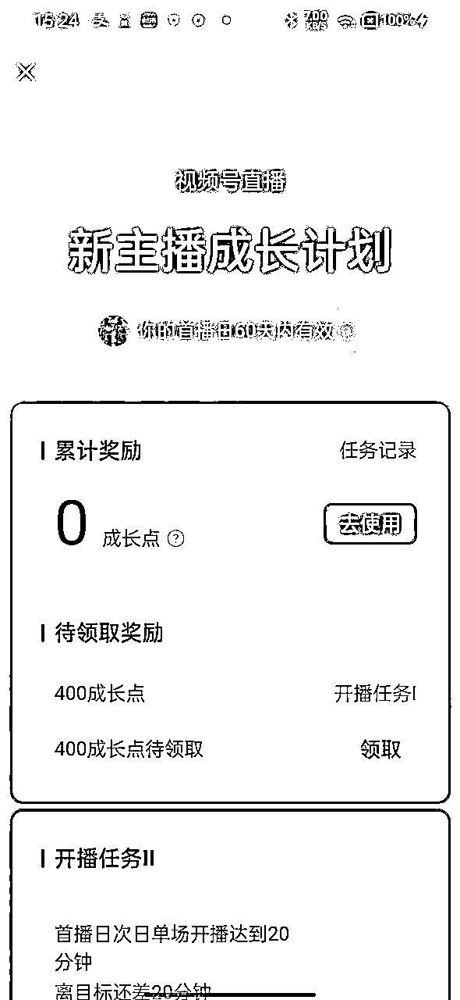

# 二、RPA 自动设置福袋

接下来详细介绍怎么用 7 行 RPA 代码实现无人设置福袋，非常简单，有手就能操作。

## 一）提前准备

这一步需要手动操作，在手机上创建好视频号直播内容，并点击开始。同时手动设置好福袋抽奖规则。例如：

## 二）影刀连接手机

打开影刀的【手机管理器】，连接好手机。

要求安卓手机，打开USB调试，部分手机需要打开禁止权限监控

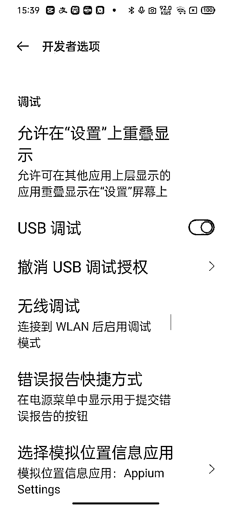

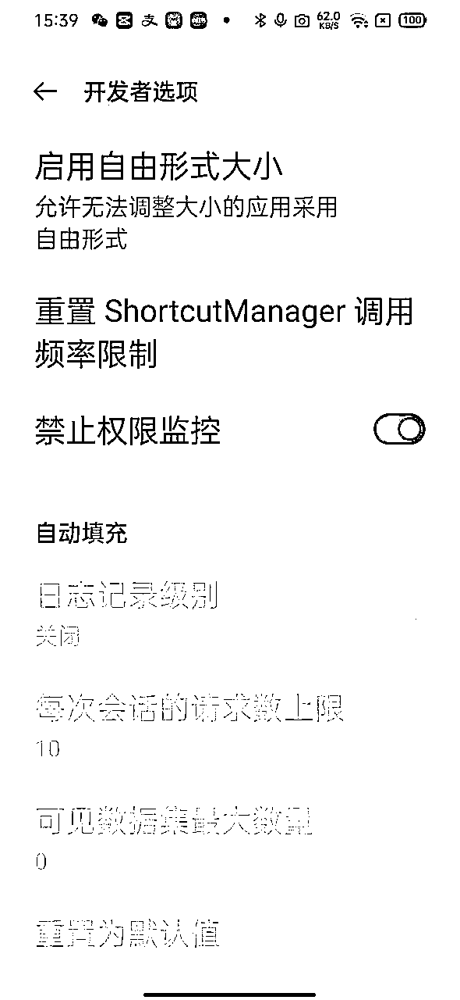

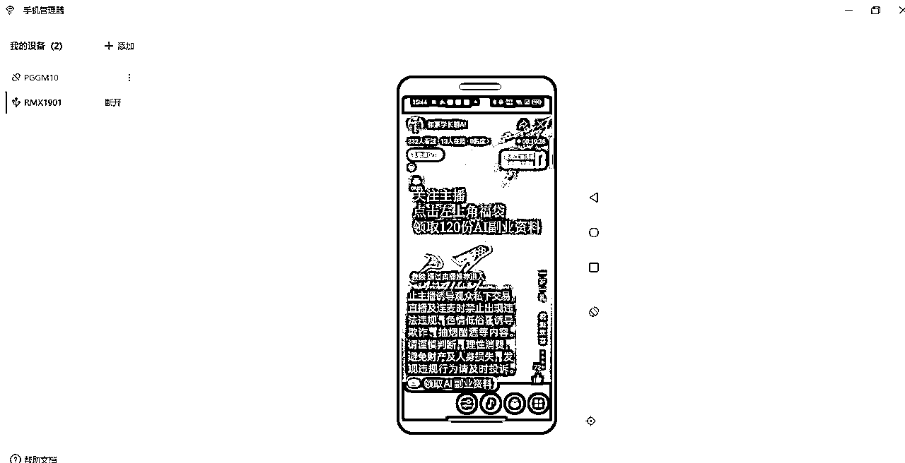

## 三）创建影刀手机应用

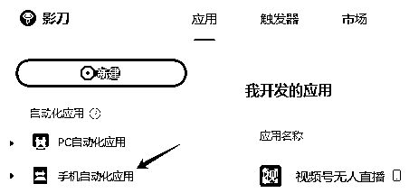

## 四）拖入【连接手机】指令

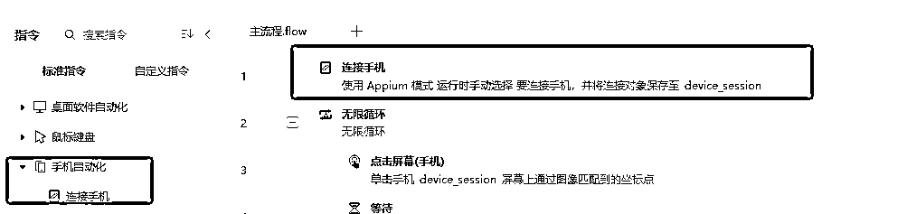

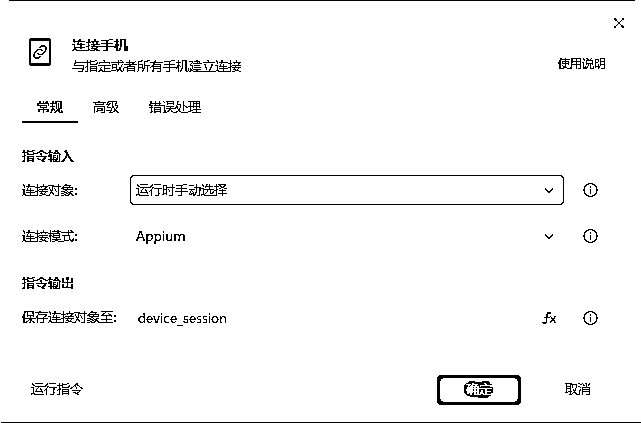

## 五）拖入【无限循环】指令，实现重复运行。

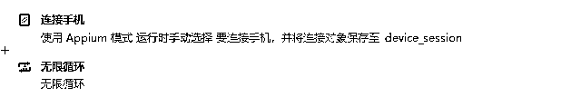

## 六）拖入【点击屏幕（手机）】指令，通过识别图形的方式，点击福袋按钮。

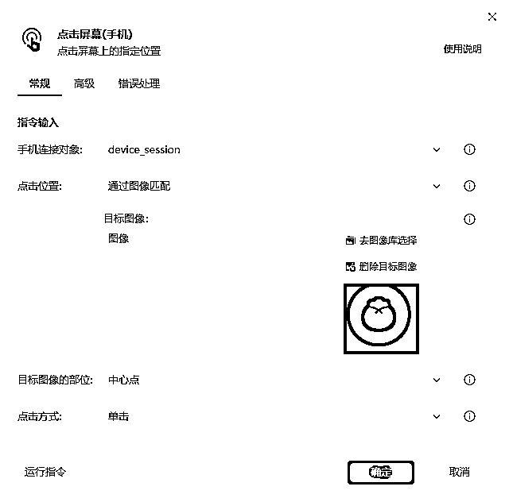

## 七）拖入【点击屏幕（手机）】指令，通过识别图形的方式，点击支付按钮。

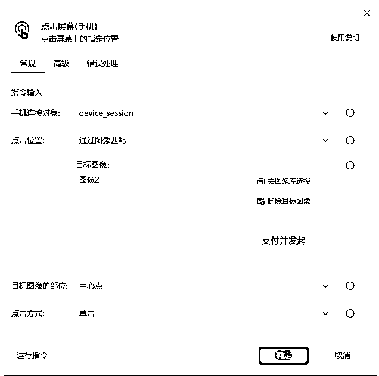

## 八）拖入【点击屏幕（手机）】指令，通过识别图形的方式，点击兑换按钮。

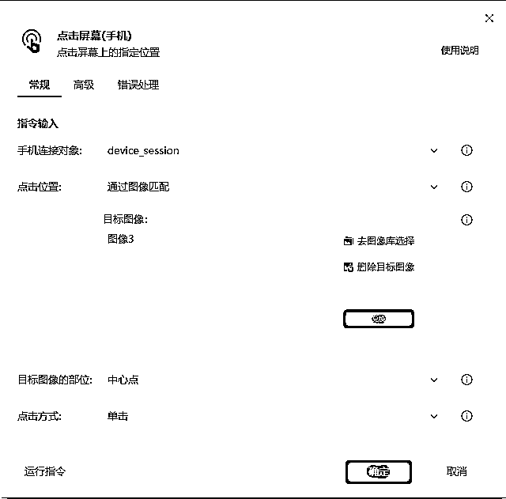

## 九）添加一个【等待】指令，例如设置了1分钟开奖，可以设置等待70秒后继续操作。

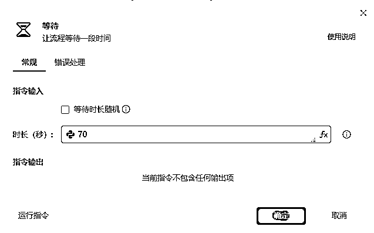

## 十）由于抽奖后会弹窗显示中奖名单，因此添加一个【点击屏幕】指令，点击窗口以外的地方，关闭抽奖。

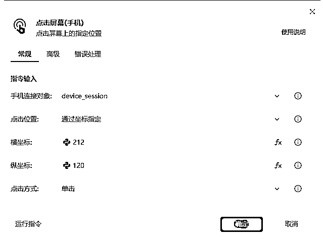

坐标可以在手机管理器中用鼠标移动获取。

以上就是RPA自动设置福袋抽奖全过程，看看视频操作。

最后附上影刀操作全流程。

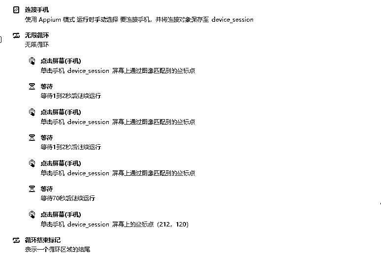

最后，如果有疑问，欢迎提问。