# 社群小白，日更陪伴群10天，营业1W ➕的秘密！

> 来源：[https://dqez6wornz.feishu.cn/docx/XUdqdjVLIoH3WYxZEMdchih4nKc](https://dqez6wornz.feishu.cn/docx/XUdqdjVLIoH3WYxZEMdchih4nKc)

# 社群成绩

我的陪伴群更新有10天了，目前营业1万+

目前总人数121人，其中81人是付费加入，另外40人免费加入

接下来就跟家人们分享一下，我是为什么要去做这个陪伴群，做陪伴群期间做了哪些事情？希望对今年想要做陪伴群的朋友有帮助～

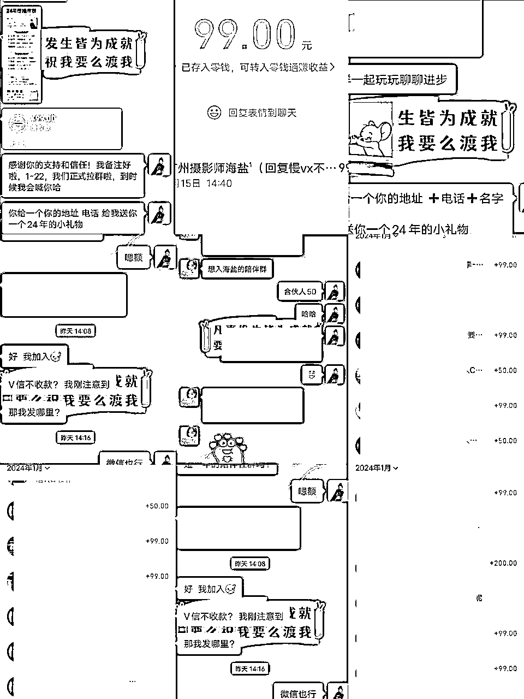

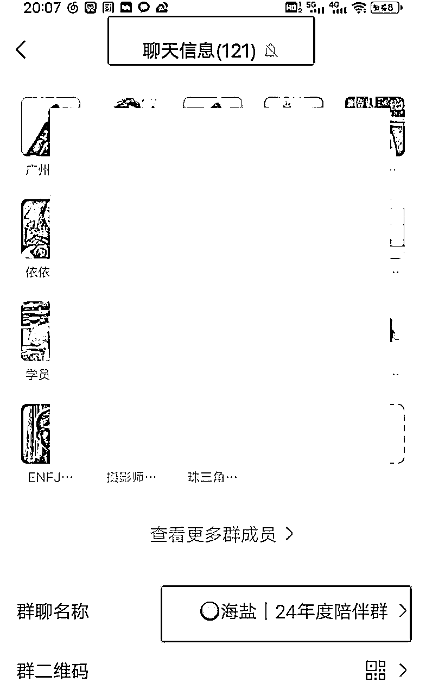

<h7>下面分四个部分介绍：</h7>

###### 1/我为何要做陪伴群

###### 2/如何从0-1做自己的付费社群

###### 3/那些人合适做陪伴群

###### 4/0-1做陪伴群的 3大疑问

### （一）我为何要做陪伴群？

## 成交高客单

想要自己的事业发展的更好，一定要了解自己的优势和劣势。

我的优势在于销售能力强，但是交付能力不算强，所以我进付费进入了很多的高客单社群，去筛选合适我的产品，然后用我的销售能力以及我的课程卖优质的产品，我从中去赚差价和赚影响力就可以了。

## 增触点 提粘性

其实我加入的群很多，但是每天分享的几乎没有久而久之就会把不重要的或者没有价值的群给折叠，但每周以及分享频率很高的群，我是不会折叠的，不知道你们有没有像同样感受？

每日分享群氛围不仅好，而且有效增加了和用户触达的点

每日见一面的力量真的很大，坚持下去很久的老用户又会重新看见你，甚至一言不合就跑来给你打钱。

## 提升输出力

每个人都是有惰性的，包括我也是一样，所以我们想要更好的成长，一定要为自己打造一条正反馈的路径，比如这次的年度陪伴群就是我很好的输入输出的一个路径。

两年输出4300条➕朋友圈

我的内容力，从质量方面不够优质，但是从数量方面还比较稳定

所以我在陪伴群也是每周五次价值输出，这个过程就在强化我的输出质量。

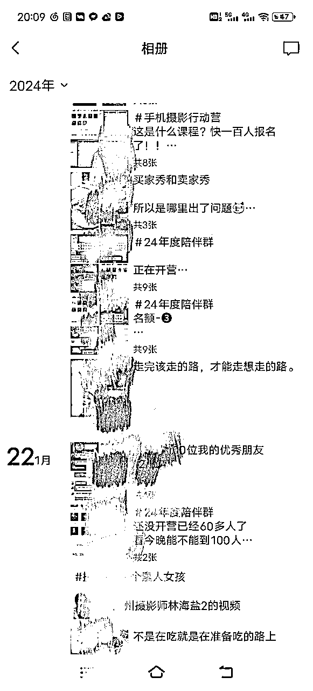

## 给别人链接的理由

我的朋友圈9000多人，我的职业是一名摄影师，但真正为我付费拍照的也就几百人，这个基数是非常小的，所以当你有一款综合性的引流产品的时候，就可以链接很多除了找你拍照以外的人，还可以更好的发挥你的优势

然后也会在这和这些人碰撞当中找到很多的灵感以及机会。

比如说因为我做了社群，所以我和很多合伙人有了交集，因为我们互相学习，互相交流以及互相到各自的群分享等等，这个过程就是在整合你的资源，整合你的灵感！

# （二）如何从0-1做自己的付费社群？

你是否也想要做付费社群，但是觉得自己没有经验，没有方向，也不知道怎么落地……

越是迷茫，只要搞定一个点就可以快速帮你落地。

一句话总结:

找到你喜欢的人，喜欢的模式，喜欢的事情去模仿，但是要注意 ，模仿的对象不能和自己相差太远，因相差太远会增加你的执行难度，从而打击信心。

咋就是说把好的套路摸清楚，把它快速模仿复制在自己的社群上，不要觉得不好意思，自我迭代才是最要紧的事情！

那问题来了？

我怎么找得到合适社群呢？

其实有一个非常简单的方式，就是人人都能做，付费就ok

我自己在做社群之前已经付费加入了七八个同类型的社群，主要详细拆解3-5个头部，剩下几个中小社群就看着感觉来拆解。

下面分享找到合适社群之后，可以从哪些方面拆解？

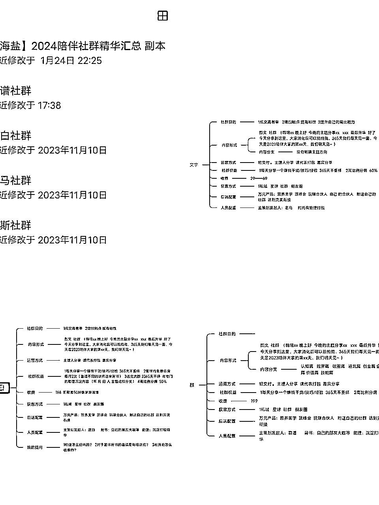

## 1.找对标社群拆解框架

1.  社群目的

模仿这件事，最怕的就是不明真相！

一个优秀的社群，每个动作必有目的性，如果你只是 复制 了人家的动作，没有理解内在的逻辑，最后一定是既耗费了精力，又没有效果。

所以优秀的社群的目的要深入去了解

1.  内容形式和方向

内容形式一般有图文和视频，社群一般是图文比较多，因为成本低，不管是制作成本还经济成本，还是输入输出成本都普遍偏低，而视频则与之图文相反

内容方向就是说这个社群主要是分享哪个领域的是综合性还是针对性？

综合性，比如说认知，眼界，破圈，地坑，创业企业，行业策略，个体价值等等含有。

针对性，主要针对某一领域展开

比如说搞钱陪伴群，分享的就是搞钱的方方面面

比如说小红书陪伴群，分享的领域大部分是小红书方面

1.  参考海报

需要把海报拆解下来

比如海报主题是什么，副标题是什么，收费标准是什么，内容主题是什么，为什么要现在下单？为什么要找他下单？

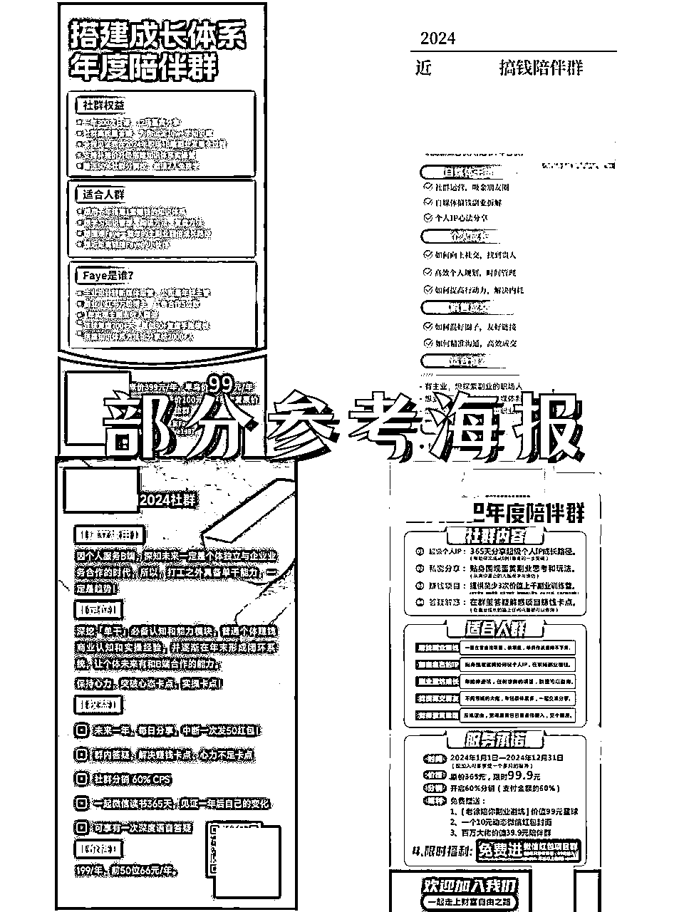

1.  运营方式

运营方式需要看轻运营OR重运营？

轻运营，主要就是群主分享，期间没有太多的运营成本和人员配置

重运营，主要需要团队 有人上课 有人答疑 预告 跟进学员 布置作业 改作业 复盘前后等等

1.  社群权益

一句话总结：加入社群你能得到什么？

1.  收费标准

陪伴群属于引流产品，所以说定价一般都不会太高，我了解到的大部分是29~200区间居多

1.  获客来源

社群用户来源来自于哪里？是主要是私域还是公域？

1.  承接产品

陪伴群属引流品，最好有承接高客单产品，这样才能够最大化利用且不易浪费

1.  人员配置

如果你是0经验做社群，不需要找任何的合伙人或助理，因为建立起步阶段，你自己没有搞清楚，找这些人是没有意义的，只会图增你的沟通成本和拖延你行动力。

关于合伙人，在你不够优秀的时候，你也不会遇到太好的合伙人，优秀的合伙人本就强，会自己单干

关于助理，陪伴群本来就是一个轻交付的引流产品，所以说也不需要什么助理，当然后期精力不够就要配置了，看阶段和需求。

1.  内容来源

内容来源：一句话就是以终为始

需要根据社群目的以及后端产品去设计，

比如你的目的是要成交小红书的0基础学员，这个时候内容可以主要针对小红书板块

比如你主要是成交高客单的营销产品，这个时候就主要针对分享一些搞钱领域

1.  销售体系

还要观察他们在发售社群到真正开营期间，朋友圈的销售内容如何设计的

1.  行动清单

当以上的内容，都拆解完之后，你就可以从中思考，自己当前社群的运营结构，并找到最合适你的同赛道内的3个头号玩家，对比你们之间的业务模式差异点和社群运营细节

以及你是否可以复制？以及怎么复制？

这个时候就需罗列自己的行动清单，总结就是说你打算怎么做及实现的路径

## 2.设定自己社群运营框架

这个设定自己设计的框架，其实和上面拆解的是一样框架，可以直接用上面拆解框架

下面给你们展示一下，我是怎么设定自己社群的框架

1.  社群目的

我的目的一开始就说了，1成交高客单价，2增触点提粘性，3提升输出力

1.  内容形式和方向

坚持是一切的前提！

内容形式，我用的是图文

因为我擅长，我喜欢，能坚持，成本低，优势太多了...

内容方向，因为我想要的是漏斗筛选，所以我没有非常特定领域的主题，可以说是综合性的方向，大概就是自媒体，个人IP，私域销售成交及个人成长等

1.  参考海报

我在确定自己海报之前，我找了五六个比较好的海报拆解，都属于年度陪伴群，总结共性包含如下：

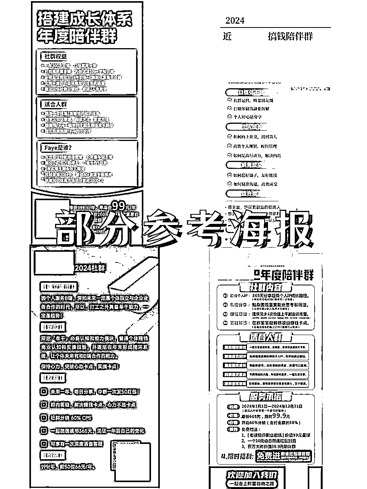

主题:

24年度陪伴群，这样命名的原因相当于给大家一个新年礼物，就是让大家有一个理由送给自己。

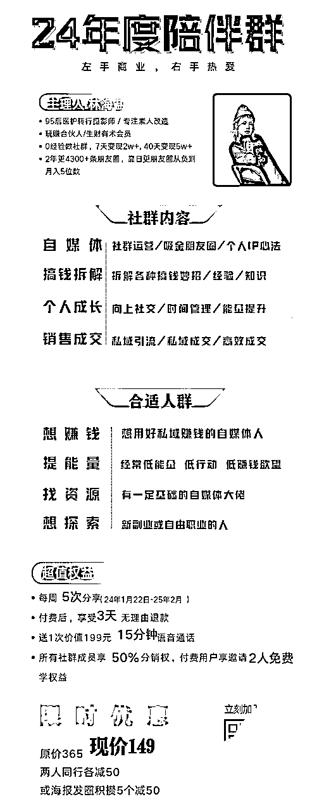

【这是我最终的海报】

副标题:

这个可以理解成贩卖美好的意思，我的是左手热爱，右手商业

传达一种一边热爱一边赚钱两不误的感觉。

收费标准:

我设定两个收费，一个是原价，一个是早鸟价，原价是呈现价格锚定，制造早鸟价便宜的感觉

内容主题:

我设定了的背后是，结合我自己高客单产品具备的卖点，再结合我自己擅长且能够坚持输出的去做的一个融合，不要搞自己不擅长的领域，这个很重要。

因为能坚持大于一切！

为什么要现在下单？

刚开始我设定了原价365 早鸟价99，早鸟价有30个名额，每增加20个涨价50块钱，但后面不停的有人加入之后，我就没有继续保留早鸟价了，这就是因为根据不同的情况需要及时调整，也没有所谓的限定~

为什么要找我下单？

这个就跟你的自我介绍有关，及你平时朋友圈输出体系有关系

所以我把成就事件简单罗列在自我介绍板块，同时朋友圈的输出体系会吸引很多喜欢你的人，喜欢你的人可能有时候不需要你的产品，但是会因为你这个人而买单，这个就是感性消费，也是论平时输出的重要性！

海报颜色：

我喜欢黄色 蓝色 加上抓眼球，所以我就用了黄色位主色调，蓝色作为点缀色。

不懂设计 配色 排版的 ，建议找专业设计师帮你做海报。

海报只要把这以上的问题搞定就ok了！

1.  运营方式

我陪伴群一般是轻运营模式，主要就是群主分享，附加嘉宾不定期分享，期间没有太多的运营成本和人员，当然到后期的人越来越多的时候，自己精力不够的时候可以找助理协助

1.  社群权益

加入社群你能得到什么？

我给自己设置了四个

第一， 每周有5次分享

第二 ，三天无理由退款权益

给用户一个反悔的机会，这个概率是很低的，我的目前还没有人退款。

第三 ，免费享受199元的通话

我为什么会加这个？是因为我之前加入社群的时候，我对其他东西不感兴趣，我就对他的通话感兴趣，因为对通话感兴趣，所以我为他付费了

最后，我就把自己消费的冲动点，用在自己的产品上

第四， 享受50%的分销权益

如果有人推荐付费进来会有一半的佣金，同时还可以免费拉两位有自媒体需求的人进

这个主要是为了裂变，不管多少人进来，我的成本都不会增加。

如果他们每个人都愿意拉两个人进来，这些免费加入的人都会成为潜在用户，同时对费用户而言也是给别人种好种子的机会，实现三方共赢！

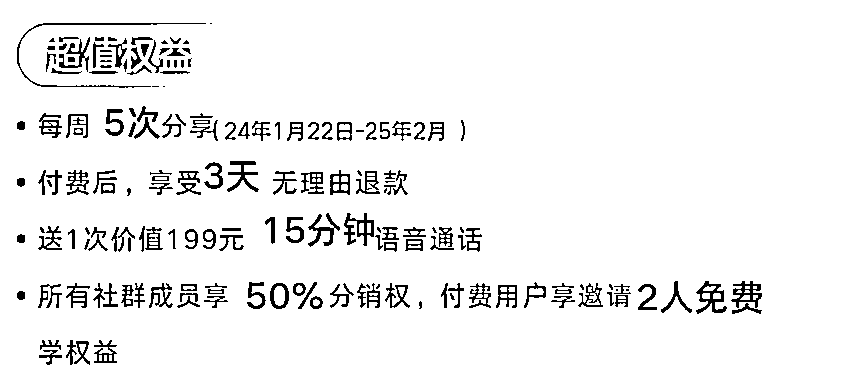

1.  收费标准

陪伴群属引流产品，定价一般不要太高，陪伴群最重要的就是流量，如定价太高点，进来的门槛就会增加，人数就容易受限

所以，我一般建议是39~200元左右，中间可以有一个梯度的涨价

梯度涨价也有讲究，最好是50人涨价一次，且金额不要太大

不建议10个就涨价，也不建议买100个就涨价，前者太快，后者太久，所以说取中间值50人会比较合适。

1.  获客来源

我的用户来源主要有两个，一个是自己的，一个是别人的

自己的话

1/一个是收费的【这些可以是喜欢你的人，认可你的人等等】

2/一个是免费的【这些是你去邀请一些大咖过来分享的时候就是可以免费进来，因为他们会为你的社群增加内容力和影响力

别人的话

1/一个是收费【这些可以是喜欢你的人，认可你的人等等】

2/一个是免费【就是付费用户免费拉两个人的这波潜在用户】

1.  承接产品

陪伴群属于引流品，最好是要承接高客单产品

这样才能够最大化利用。你的资源且不容易浪费。

我去年做过一个，但是我当时没有高客单产品，主要因为我没有后端承接意识，接着今年付费进入了很多高客单社群去筛选合适我的产品，用我的优势去卖别人的产品，我在中间赚差价以及赚影响力就ok了。

所以当你自己没有高客单的时候，也可用我这种方式，起步不需要自己去做高客单

因为高客单是需要交付很重，需要团队，需要精力和经验还有模式支撑

没有交付是就是割韭菜，这种一次性生意是不长久的

所以说最好的模式，就是借势！卖有影响力且优质的产品。

所以我今年的高客单就2个，一个是玩赚的合伙人，一个是生财的生财有术的会员

1.  人员配置

不知道你们有没有我的时候这种想法，我刚开始做社群的时候老是想要找一个合伙人和我一起做，但是找了很久都一直没有找到，后面因此拖了大半年 后面我就打算不找了。

所以你是零经验做社群不需要找任何的合伙人，因建立起步阶段，自己没有搞清楚找这些是没有意义的，只会徒增成本

且在你不够优秀的时候，你也不会遇到太牛逼的合伙人。

我不找合伙人之后，我就开始换个形式，就是找牛逼和有影响力的嘉宾，这个就可以解决内容问题+影响力问题+新流量问题。

1.  更新频率和来源

关于更新频率量，当时在日更还是一周五更之间，我选择了一周五更，这个选择非常对

日更，对我来说压力很大，且我会觉得质量可能会下降，也没有更多的精力去找牛逼嘉宾

一周五更，对我来说刚刚好，周末有时间去找优秀的嘉宾分享，既解决流量问题和影响力问题，很爽！

所以新手来说不建议做日更，你可以做个每周3-5更就可以，用剩下的时间做流量！

内容来源，我主要是在知识星球

根据对应的板块内容去找对应的知识，先把框架定好，然后再找对应的分支

比如说大方向有社群的运营，小分支方面的就找社群的常见问题就行

同样事情同一时间做，你的效率更高！

内容我是提前一周准备好下周的，尽量不要当天分享，当天准备，这种会影响质量，也会影响你的效率等。

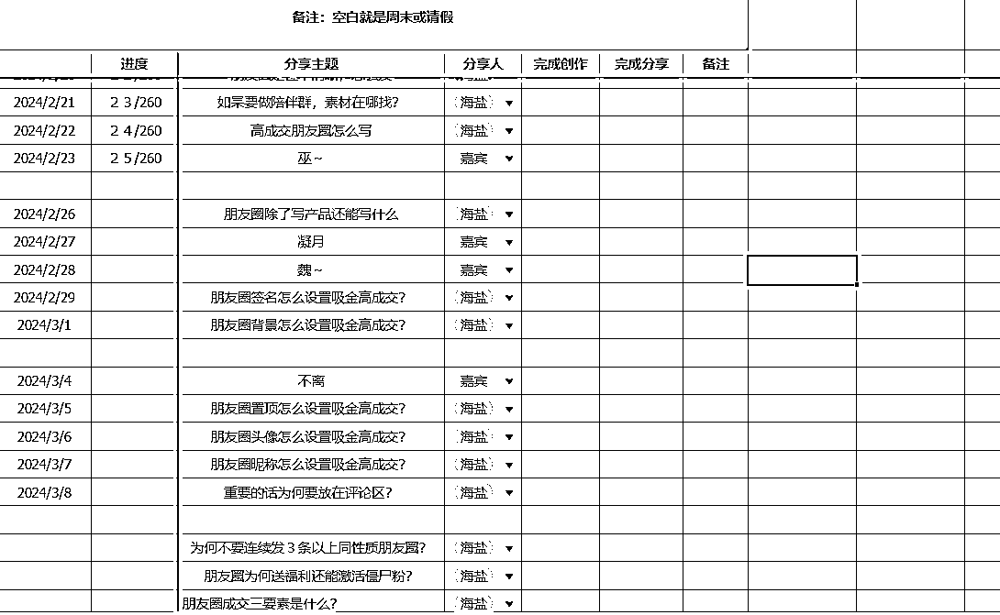

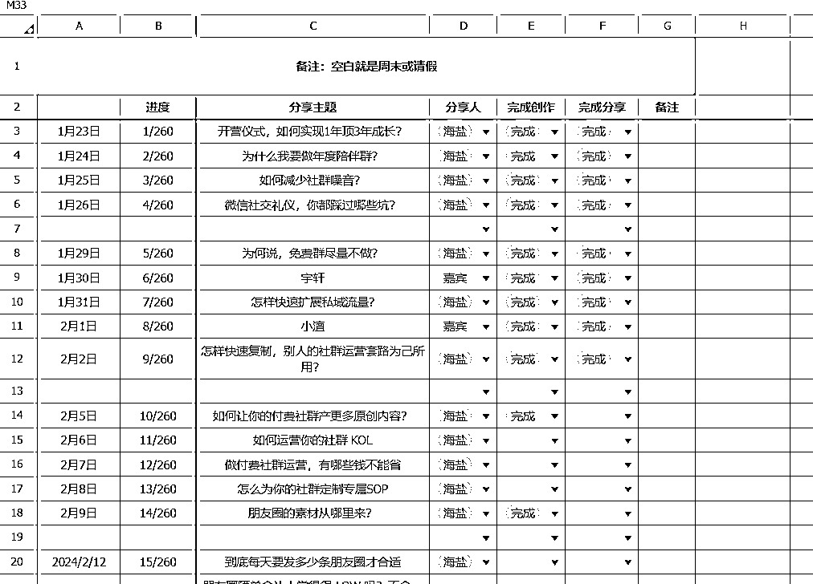

1.  销售体系

我是直接把卖的好的社群，把他们发售陪伴群期间的文案和图片都扒拉下来，然后改成自己的，但是不是照搬，只是用框架，也是最快的方式。

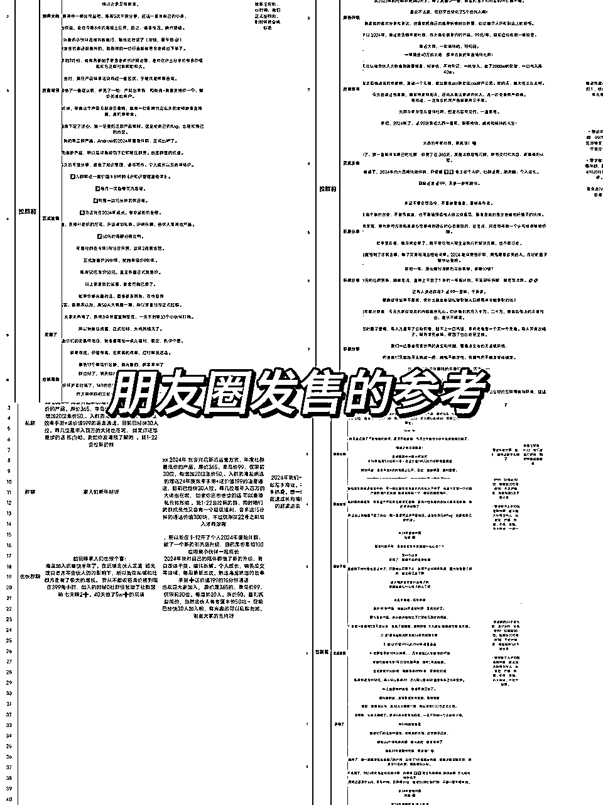

# （三）那些人合适做陪伴群？

## 提升输出力

如果你的输出不是很牛逼，那更需要这种陪伴群刻意的去练习，然后用付费的形式去筛选。

我不建议做免费社群，因为你会把过多的时间浪费在碎片知识分享以及免费社群运营过程中。

人的时间和精力是有限的，你在免费社群里浪费的时间，本应用在学习、内化和输出上，你应该靠自己的内容优化上

我以前做过很多的社群，比如说什么朋友圈打卡呀，读书群呀，这些我都没有收费，当时效果也不是很好，就是发什么也没有什么人回应那种，自己的要付也是很随意，因为没有付钱，最后也会打击我的做社群信心

后来我想明白了，与其费尽心思做泛粉丝转化，不如多花功夫做内容。

你输出内容的频率足够高，能覆盖到的用户范围就足够广；你输出的内容有深度，转化的周期就更短。

你只有敢于收费，才能倒逼自己去做交付，你想做交付，就必然要不断地去学习和迭代自己。当自己的价值越来越高，你才敢继续提高社群门槛，这样才会进入正向循环

## 有后端产品

很多时候 陪伴成长和经历共情就是对你的最大信任，而信任就是变现的基础，如果你有后端产品，那更加要做陪伴群了去打造强信任感。

## 提升成交力

如果你是一个销售能力不太强，然后不敢收钱的人更加要做。

因为销售是一件非常有成就感，也是你能力的体现，你会从一件件成交的小事当中慢慢找到成就感，这些成就感会一步一步促进变得更好！

# （四）0-1做陪伴群的 3大疑问

## 新产品发布，在朋友圈提高成交率？

成交只是一个结果，重在日常经营。

如果你是一个长年不发圈，突然发一个产品，你觉得别人会买你的东西吗？大概率是很少的，成交来自于信任，发朋友圈就是一个积累信任的过程。

所以保持日常的发圈频率很重要！

## 如何让社群保持长期的活跃度？

1.内部邀请

观察你社群里的用户，看他们的朋友圈，看他们在社群里的活跃状态。一旦发现有比较“热情”的，就私信，鼓励他输出某个话题，如果没有话题，你给他一个话题

分享完要鼓励，其次 可以直接推名片群里面推以及在朋友圈里面推。

这样子他既有面子又有成就感，这样子也更加愿意分享。

2.外部邀请

你要定期邀请某个领域的牛人来群里分享，让小白看到自己的未来，看到自己未来要成为的人才行。

## 对自己的内容不够自信，怎么突破这个心理？

你看到的优秀背后都是经过大量刻意练习，要接受自己从不会到会的过程。

比如

我从不会写朋友圈

到秒写朋友圈花了三年时间

现在

我在生活中看到何人任何事

都可以随时写一条很长的朋友圈

第一年写朋友圈的时候也非常局促 没思路

从刚开始卖产品很难卖

到现在一条朋友圈可以转化几千上万块～

最开始那一年的时候

我写朋友圈字数都不会超过100个字

所以，不要一开始要求做的很好，要接受自己有一个成长和练习的过程

以上就是我做社群的全部分享啦

希望对大家有帮助，有社群问题的也可以都可以留言哦，看到的都会回答呢